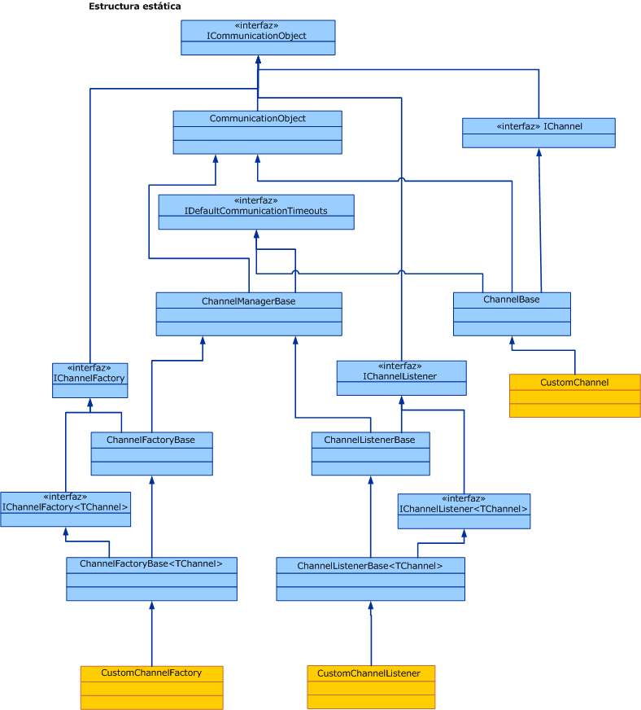

# Información general del modelo de canales

La pila de canales de Windows Communication Foundation (WCF) es una pila de comunicación por capas con uno o más canales que procesan los mensajes. En la parte inferior de la pila hay un canal de transporte que es responsable de adaptar la pila del canal al transporte subyacente (por ejemplo, TCP, HTTP, SMTP y otros tipos de transporte). Los canales proporcionan un modelo de programación de bajo nivel para enviar y recibir mensajes. Este modelo de programación se basa en varias interfaces y otros tipos denominados colectivamente como el modelo de canal de WCF. En este tema se tratan diversas formas de canal, la construcción de un agente de escucha básico del canal (en el servicio) y el generador de canales (en el cliente).  
  
## Pila del canal  

 Los extremos de WCF se comunican con el mundo mediante una pila de comunicación denominada pila de canales. El diagrama siguiente compara la pila de canal con otras pilas de la comunicación, por ejemplo, TCP/IP.  
  
   
  
 Primero, las similitudes: en ambos casos, cada nivel de la pila proporciona una abstracción del mundo debajo de ese nivel y expone solo esa abstracción en el nivel directamente situado encima de él. Cada nivel utiliza la abstracción de solo el nivel situado directamente debajo de él. También en ambos casos, cuando dos pilas se comunican, cada nivel se comunica con el nivel correspondiente en la otra pila, por ejemplo, que el nivel IP se comunica con el nivel de IP y el nivel de TCP con el nivel de TCP, etc.  
  
 Ahora, las diferencias: aunque la pila de TCP se diseñó para proporcionar una abstracción de la red física, la pila del canal está diseñada para proporcionar no solo una abstracción de cómo se entrega el mensaje, es decir, el transporte, sino también otras características como lo que está en el mensaje o qué protocolo se utiliza para la comunicación, incluido el transporte, aunque mucho más que eso. Por ejemplo, el elemento de enlace de la sesión confiable es parte de la pila del canal pero no está debajo del transporte o el propio transporte. Esta abstracción se logra obligando al canal inferior en la pila a que se adapte al protocolo de transporte subyacente a la arquitectura de la pila del canal y después confiando en los canales que hay más arriba en la pila para proporcionar características de comunicación como garantías de confiabilidad y seguridad.  
  
 Los mensajes fluyen a través de la pila de la comunicación como objetos <xref:System.ServiceModel.Channels.Message>. Tal y como se muestra en la ilustración anterior, al canal inferior se le denomina "canal de transporte". Es el canal responsable de enviar y recibir mensajes a otras partes y desde ellas. Esto incluye la responsabilidad de transformar el objeto <xref:System.ServiceModel.Channels.Message> al formato utilizado para comunicar con otras partes y desde él. Por encima del canal de transporte puede haber cualquier número de canales de protocolo cado uno de ellos responsable de proporcionar una función de comunicación como garantías de entrega confiables. Los canales de protocolo funcionan en los mensajes que fluyen a través de ellos en el formulario del objeto <xref:System.ServiceModel.Channels.Message>. Normalmente transforman el mensaje (por ejemplo, añadiendo encabezados o cifrando el cuerpo) o bien envían y reciben su propios mensajes de control de protocolo (por ejemplo, confirmaciones de recibo).  
  
## Formas del canal  

 Cada canal implementa una o más interfaces conocidas como "interfaces de forma de canal" o "formas de canal". Esas formas de canal proporcionan los métodos orientados a la comunicación, como enviar y recibir o solicitar y responder, que el canal implementa y el usuario del canal llama. En la base de las formas de canal se encuentra la <xref:System.ServiceModel.Channels.IChannel> interfaz, que es una interfaz que proporciona un `GetProperty` \<T> método diseñado como mecanismo superpuesto para tener acceso a las características arbitrarias expuestas por los canales de la pila. Las cinco formas del canal que extienden <xref:System.ServiceModel.Channels.IChannel> son:  
  
- <xref:System.ServiceModel.Channels.IInputChannel>  
  
- <xref:System.ServiceModel.Channels.IOutputChannel>  
  
- <xref:System.ServiceModel.Channels.IRequestChannel>  
  
- <xref:System.ServiceModel.Channels.IReplyChannel>  
  
- <xref:System.ServiceModel.Channels.IDuplexChannel>  
  
 Además, cada una de estas formas tiene un equivalente que extiende <xref:System.ServiceModel.Channels.ISessionChannel%601?displayProperty=nameWithType> para admitir las sesiones. Dichos componentes son:  
  
- <xref:System.ServiceModel.Channels.IInputSessionChannel>  
  
- <xref:System.ServiceModel.Channels.IOutputSessionChannel>  
  
- <xref:System.ServiceModel.Channels.IRequestSessionChannel>  
  
- <xref:System.ServiceModel.Channels.IReplySessionChannel>  
  
- <xref:System.ServiceModel.Channels.IDuplexSessionChannel>  
  
 Las formas del canal se modelan después de algunos de los modelos de intercambio de mensajes fundamentales admitidos por los protocolos de transporte existentes. Por ejemplo, la mensajería unidireccional corresponde a un <xref:System.ServiceModel.Channels.IInputChannel> / <xref:System.ServiceModel.Channels.IOutputChannel> par, la solicitud-respuesta corresponde a <xref:System.ServiceModel.Channels.IRequestChannel> / <xref:System.ServiceModel.Channels.IReplyChannel> pares y las comunicaciones dúplex bidireccionales corresponden a <xref:System.ServiceModel.Channels.IDuplexChannel> (que extiende <xref:System.ServiceModel.Channels.IInputChannel> y <xref:System.ServiceModel.Channels.IOutputChannel> ).  
  
## Programación con la pila del canal  

 Las pilas de canales se suelen crear con un modelo de generador en el que un enlace crea la pila de canales. En el lado de envío, se utiliza un enlace para crear un <xref:System.ServiceModel.ChannelFactory>, que a su vez crea una pila de canal y devuelve una referencia al canal superior en la pila. La aplicación puede utilizar a continuación este canal para enviar los mensajes. Para obtener más información, vea [programación de Channel-Level de cliente](client-channel-level-programming.md).  
  
 En el lado de la recepción, se usa un enlace para crear un <xref:System.ServiceModel.Channels.IChannelListener>, que realiza escuchas para los mensajes entrantes. <xref:System.ServiceModel.Channels.IChannelListener> proporciona mensajes a la aplicación de escucha creando pilas de canal y llevando la referencia de la aplicación al canal superior. La aplicación utiliza a continuación este canal para recibir mensajes entrantes. Para obtener más información, vea [programación de Service Channel-Level](service-channel-level-programming.md).  
  
## El modelo de objetos del canal  

 El modelo de objetos del canal es el conjunto principal de interfaces necesario para implementar canales, agentes de escucha de canales y generadores de canales. Habrá también algunas clases base proporcionadas para ayudar en las implementaciones personalizadas.  
  
 Los agentes de escucha del canal son responsables de realizar escuchas de los mensajes entrantes, entregándolos a continuación en el nivel anterior a través de los canales creados por el agente de escucha del canal.  
  
 Los generadores de canales son responsables de crear canales que se utilizan para enviar los mensajes y cerrar todos los canales que se crearon cuando se cerró el generador de canales.  
  
 <xref:System.ServiceModel.ICommunicationObject> es la interfaz básica que define la máquina de estados básica que todos los objetos de comunicación implementan. <xref:System.ServiceModel.Channels.CommunicationObject> proporciona una implementación de esta interfaz básica de la que pueden derivar otras clases de canal en lugar de volver a implementar la interfaz. Sin embargo, esto no es necesario: un canal personalizado puede implementar directamente <xref:System.ServiceModel.ICommunicationObject> y no heredar desde <xref:System.ServiceModel.Channels.CommunicationObject>. Ninguna de las clases en la ilustración 3 se considera parte del modelo del canal; son los asistentes disponibles para los implementadores de canal personalizados que desean crear los canales.  
  
   
  
 Los temas siguientes describen el modelo de objetos del canal así como varias áreas de desarrollo que ayudan a la creación de canales personalizados.  
  
|Tema|Descripción|  
|-----------|-----------------|  
|[Servicio: escuchas de canales y canales](service-channel-listeners-and-channels.md)|Describe los agentes de escucha del canal, que realizan escuchas de los canales entrantes en una aplicación de servicio.|  
|[Cliente: Generadores de canales y canales](client-channel-factories-and-channels.md)|Describe generadores de canales, que crean canales para conectar a una aplicación de servicio.|  
|[Introducción a los cambios de estado](understanding-state-changes.md)|Describe cómo cambia el estado de los modelos de interfaz <xref:System.ServiceModel.ICommunicationObject?displayProperty=nameWithType> en los canales.|  
|[Elección de un patrón de intercambio de mensajes](choosing-a-message-exchange-pattern.md)|Describe los seis patrones de intercambio de mensajes básicos que los canales pueden admitir.|  
|[Administración de excepciones y errores](handling-exceptions-and-faults.md)|Describe cómo administrar errores y excepciones en canales personalizados.|  
|[Compatibilidad con metadatos y configuración](configuration-and-metadata-support.md)|Describe cómo admitir el uso de canales personalizados desde el modelo de la aplicación y cómo exportar e importar metadatos mediante enlaces y elementos de enlace.|
