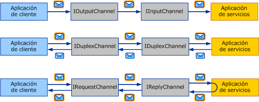
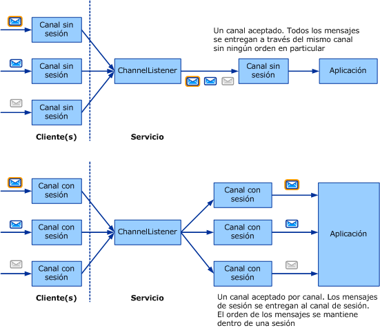

# Elección de un patrón de intercambio de mensajesChoosing a Message Exchange Pattern

El primer paso para escribir un transporte personalizado es decidir qué *patrones de intercambio de mensajes* (o MEP) son necesarios para el canal que está desarrollando.The first step in writing a custom transport is to decide which *message exchange patterns* (or MEPs) are required for the channel you are developing. Este tema describe las opciones disponibles y trata sobre los distintos requisitos.This topic describes the options available and discusses the various requirements. Esta es la primera tarea en la lista de tareas de desarrollo de canales que se describe en [desarrollar canales](developing-channels.md).This is the first task in the channel development task list described in [Developing Channels](developing-channels.md).  
  
## Seis patrones de intercambio de mensajesSix Message Exchange Patterns  

 Hay tres MEP entre los que elegir:There are three MEPs to choose from:  
  
- Datagrama (<xref:System.ServiceModel.Channels.IInputChannel> y <xref:System.ServiceModel.Channels.IOutputChannel>)Datagram (<xref:System.ServiceModel.Channels.IInputChannel> and <xref:System.ServiceModel.Channels.IOutputChannel>)  
  
     Cuando se usa un MEP de datagrama, un cliente envía un mensaje mediante un *desencadenador y olvidó* Exchange.When using a datagram MEP, a client sends a message using a *fire and forget* exchange. Un intercambio de este tipo es uno que exige una confirmación fuera de banda de entrega correcta.A fire and forget exchange is one that requires out-of-band confirmation of successful delivery. El mensaje se podría perderse por el camino y no llegar nunca al servicio.The message might be lost in transit and never reach the service. Si la operación de envío se completa correctamente en la parte del cliente, no garantiza que el extremo remoto haya recibido el mensaje.If the send operation completes successfully at the client end, it does not guarantee that the remote endpoint has received the message. El datagrama es un bloque de creación fundamental para la mensajería, ya que puede crear sus propios protocolos encima de él, incluidos protocolos confiables y seguros.The datagram is a fundamental building block for messaging, as you can build your own protocols on top of it—including reliable protocols and secure protocols. Los canales de datagrama del cliente implementan la interfaz <xref:System.ServiceModel.Channels.IOutputChannel> y los del servicio, la interfaz <xref:System.ServiceModel.Channels.IInputChannel>.Client datagram channels implement the <xref:System.ServiceModel.Channels.IOutputChannel> interface and service datagram channels implement the <xref:System.ServiceModel.Channels.IInputChannel> interface.  
  
- Solicitud-respuesta (<xref:System.ServiceModel.Channels.IRequestChannel> y <xref:System.ServiceModel.Channels.IReplyChannel>)Request-Response (<xref:System.ServiceModel.Channels.IRequestChannel> and <xref:System.ServiceModel.Channels.IReplyChannel>)  
  
     En este MEP, un mensaje se envía y se recibe una respuesta.In this MEP, a message is sent, and a reply is received. El patrón está compuesto de los pares solicitud-respuesta.The pattern consists of request-response pairs. Los ejemplos de llamadas de solicitud-respuesta son llamadas a procedimientos remotos (RPC) y solicitudes GET del explorador.Examples of request-response calls are remote procedure calls (RPC) and browser GET requests. Este patrón también se conoce como dúplex medio.This pattern is also known as half-duplex. En este MEP, los canales de cliente implementan <xref:System.ServiceModel.Channels.IRequestChannel> y los canales de servicio <xref:System.ServiceModel.Channels.IReplyChannel>.In this MEP, client channels implement <xref:System.ServiceModel.Channels.IRequestChannel> and service channels implement <xref:System.ServiceModel.Channels.IReplyChannel>.  
  
- Dúplex (<xref:System.ServiceModel.Channels.IDuplexChannel>)Duplex (<xref:System.ServiceModel.Channels.IDuplexChannel>)  
  
     El MEP dúplex permite que un cliente envíe un número arbitrario de mensajes y que se reciban en cualquier orden.The duplex MEP allows an arbitrary number of messages to be sent by a client and received in any order. El MEP de dúplex es como una conversación telefónica, donde cada palabra que se pronuncia es un mensaje.The duplex MEP is like a phone conversation, where each word being spoken is a message. Dado que ambos lados pueden enviar y recibir en este MEP, la interfaz implementada por los canales de servicio y cliente es <xref:System.ServiceModel.Channels.IDuplexChannel>.Because both sides can send and receive in this MEP, the interface implemented by the client and service channels is <xref:System.ServiceModel.Channels.IDuplexChannel>.  
  
   
Los tres patrones de intercambio de mensajes básicos.The three basic message exchange patterns. De arriba abajo: datagrama, solicitud-respuesta y dúplex.Top to bottom: datagram, request-response, and duplex.  
  
 Cada uno de estos MEP también puede admitir *sesiones*.Each of these MEPs can also support *sessions*. Una sesión (e implementación de <xref:System.ServiceModel.Channels.ISessionChannel%601?displayProperty=nameWithType> de tipo <xref:System.ServiceModel.Channels.ISession?displayProperty=nameWithType>) pone en correlación todos los mensajes enviados y recibidos en un canal.A session (and implementation of <xref:System.ServiceModel.Channels.ISessionChannel%601?displayProperty=nameWithType> of type <xref:System.ServiceModel.Channels.ISession?displayProperty=nameWithType>) correlates all messages sent and received on a channel. El patrón de solicitud-respuesta es una sesión autónoma de dos mensajes, ya que la solicitud y la respuesta se ponen en correlación.The request-response pattern is a stand-alone two-message session, as the request and reply are correlated. Por el contrario, el patrón de solicitud-respuesta que admite las sesiones implica que se ponen en correlación todos los pares de solicitud/respuesta en ese canal entre sí.In contrast, the request-response pattern that supports sessions implies that all request/response pairs on that channel are correlated with each other. Esto le da un total de seis MEP entre los que elegir:This gives you a total of six MEPs to choose from:  
  
- DatagramaDatagram  
  
- Solicitud-respuestaRequest-response  
  
- DúplexDuplex  
  
- Datagrama con sesionesDatagram with sessions  
  
- Solicitud-respuesta con sesionesRequest-response with sessions  
  
- Dúplex con sesionesDuplex with sessions  
  
> [!NOTE]
> En el caso del transporte de UDP, el único MEP que se admite es el datagrama, ya que UDP es en sí mismo un protocolo de tipo desencadenar y omitir.For the UDP transport, the only MEP that is supported is datagram, because UDP is inherently a fire and forget protocol.  
  
## Sesiones y canales con sesionesSessions and Sessionful Channels  

 En el mundo de red, hay protocolos orientado a la conexión (por ejemplo, TCP) y protocolos sin conexión (por ejemplo, UDP).In the networking world, there are connection-oriented protocols (for example, TCP) and connection-less protocols (for example, UDP). WCF usa el término sesión para indicar una abstracción lógica similar a la de una conexión.WCF uses the term session to mean a connection-like logical abstraction. Los protocolos WCF con sesión son similares a los protocolos de red orientados a la conexión y los protocolos WCF sin sesión son similares a los protocolos de red sin sesión.Sessionful WCF protocols are similar to connection-oriented network protocols and sessionless WCF protocols are similar to connection-less network protocols.  
  
 En el modelo de objetos de canal, cada sesión lógica se manifiesta como una instancia de un canal con sesión.In the channel object model, each logical session manifests as an instance of a sessionful channel. Por consiguiente, cada nueva sesión creada por el cliente y aceptada en el servicio se corresponde con un nuevo canal con sesión en cada lado.Therefore every new session created by the client, and accepted on the service, corresponds to a new sessionful channel on each side. El siguiente diagrama muestra, en la parte superior, la estructura de los canales sin sesión y, en la parte inferior, la estructura de los canales con sesión.The following diagram shows, on the top, the structure of sessionless channels, and on the bottom, the structure of sessionful channels.  
  
   
  
 Un cliente crea un nuevo canal con sesión y envía un mensaje.A client creates a new sessionful channel and sends a message. En el lado del servicio, el agente de escucha del canal recibe este mensaje y detecta que pertenece a una nueva sesión de manera que crea un nuevo canal con sesión y lo une a la aplicación (en respuesta a la aplicación que llama a AcceptChannel en el agente de escucha del canal).On the service side, the channel listener receives this message and detects that it belongs to a new session so it creates a new sessionful channel and hands it to the application (in response to the application calling AcceptChannel on the channel listener). La aplicación recibe a continuación este mensaje y todos los mensajes subsiguientes enviados en la misma sesión a través del mismo canal con sesión.The application then receives this message and all subsequent messages sent in the same session through the same sessionful channel.  
  
 Otro cliente (o el mismo cliente) crea un nuevo canal con sesión y envía un mensaje.Another client (or the same client) creates a new sessionful and sends a message. El agente de escucha del canal detecta que este mensaje está en una nueva sesión y crea un nuevo canal con sesión. El proceso se repite.The channel listener detects this message is in a new session and creates a new sessionful channel and the process repeats.  
  
 Sin las sesiones, no hay ninguna correlación entre los canales y ellas.Without sessions, there is no correlation between channels and sessions. Por consiguiente, un agente de escucha del canal crea solo un canal a través del cual se entregarán los mensajes recibidos a la aplicación.Therefore a channel listener creates only one channel through which all received messages are delivered to the application. Tampoco hay un orden de mensajes porque no hay sesión dentro de la cual mantener el orden de los mensajes.There is also no message ordering because there is no session within which to maintain message order. La parte superior del gráfico anterior muestra un intercambio de mensajes sin sesión.The top portion of the preceding graphic illustrates a sessionless message exchange.  
  
## Inicio y finalización de sesionesStarting and Terminating Sessions  

 Para iniciar las sesiones en el cliente basta con crear un canal con sesión nuevo.Sessions are started on the client by simply creating a new sessionful channel. Se inician en el servicio cuando recibe un mensaje que se envió en una nueva sesión.They are started on the service when the service receives a message that was sent in a new session. Igualmente, las sesiones se finalizan cerrando o anulando un canal con sesión.Likewise, sessions are terminated by closing or aborting a sessionful channel.  
  
 La excepción a esto es <xref:System.ServiceModel.Channels.IDuplexSessionChannel> que se utiliza para enviar y recibir los mensajes en un patrón de comunicación con sesión dúplex.The exception to this is <xref:System.ServiceModel.Channels.IDuplexSessionChannel> which is used for both sending and receiving messages in a duplex, sessionful communication pattern. Es posible que un lado desee dejar de enviar los mensajes pero continuar recibiéndolos. Por tanto, cuando se use <xref:System.ServiceModel.Channels.IDuplexSessionChannel>, habrá un mecanismo que le permitirá cerrar la sesión de salida que indicará que no enviará más mensajes pero que mantendrá la sesión de entrada abierta lo que le permitirá continuar recibiendo mensajes.It is possible that one side will want to stop sending messages but continue to receive messages therefore when using <xref:System.ServiceModel.Channels.IDuplexSessionChannel> there is a mechanism that lets you close the output session indicating you will not send any more messages but keep the input session opened allowing you to continue to receive messages.  
  
 En general, las sesiones se cierran en el lado de salida y no en el de entrada.In general, sessions are closed on the outgoing side and not on the incoming side. Es decir, los canales de salida con sesión pueden cerrarse, cerrando con ello la sesión.That is, sessionful output channels can be closed, thereby cleanly terminating the session. Cerrar un canal de salida con sesión provoca que el canal de entrada con sesión correspondiente devuelva el valor null a la aplicación que esté llamando a <xref:System.ServiceModel.Channels.IInputChannel.Receive%2A?displayProperty=nameWithType> en <xref:System.ServiceModel.Channels.IDuplexSessionChannel>.Closing a sessionful output channel causes the corresponding sessionful input channel to return null to the application calling <xref:System.ServiceModel.Channels.IInputChannel.Receive%2A?displayProperty=nameWithType> on the <xref:System.ServiceModel.Channels.IDuplexSessionChannel>.  
  
 Sin embargo, los canales de entrada con sesión no deberían estar cerrados a menos que <xref:System.ServiceModel.Channels.IInputChannel.Receive%2A?displayProperty=nameWithType> en <xref:System.ServiceModel.Channels.IDuplexSessionChannel> devuelva el valor null, indicando que la sesión ya está cerrada.However sessionful input channels should not be closed unless <xref:System.ServiceModel.Channels.IInputChannel.Receive%2A?displayProperty=nameWithType> on the <xref:System.ServiceModel.Channels.IDuplexSessionChannel> returns null, indicating that the session is already closed. Si <xref:System.ServiceModel.Channels.IInputChannel.Receive%2A?displayProperty=nameWithType> en <xref:System.ServiceModel.Channels.IDuplexSessionChannel> no ha devuelto el valor null, cerrar un canal de entrada con sesión puede producir una excepción porque puede recibir mensajes inesperados al cerrarse.If <xref:System.ServiceModel.Channels.IInputChannel.Receive%2A?displayProperty=nameWithType> on the <xref:System.ServiceModel.Channels.IDuplexSessionChannel> has not returned null, closing a sessionful input channel may throw an exception because it may receive unexpected messages while closing. Si un receptor desea finalizar una sesión antes de que el remitente lo haga, debería llamar a <xref:System.ServiceModel.ICommunicationObject.Abort%2A> en el canal de entrada, lo que terminaría la sesión bruscamente.If a receiver wishes to terminate a session before the sender does, it should call <xref:System.ServiceModel.ICommunicationObject.Abort%2A> on the input channel, which abruptly terminates the session.  
  
## Creación de canales con sesiónWriting Sessionful Channels  

 Como autor del canal con sesión, hay algunas cosas que el canal deberá hacer para proporcionar sesiones.As a sessionful channel author, there are a few things your channel must do to provide sessions. En el lado del envío, el canal tendrá que:On the send side, your channel needs to:  
  
- Para cada canal nuevo, crear una sesión nueva y asociarla a un identificador de sesión nuevo que sea una cadena única.For each new channel, create a new session and associate it with a new session id which is a unique string. U obtener una nueva sesión a partir del canal con sesión debajo de usted en la pila.Or obtain a new session from the sessionful channel below you in the stack.  
  
- Para cada mensaje enviado utilizando este canal, si el canal creó la sesión (lo contrario a obtenerla de la capa debajo de usted), tendrá que asociar el mensaje con la sesión.For each message sent using this channel, if your channel created the session (as opposed to obtaining it from the layer below you), you need to associate the message with the session. Para los canales de protocolo, esto se realiza normalmente añadiendo un encabezado SOAP.For protocol channels, this is typically done by adding a SOAP header. En el caso de los canales de transporte, esto se hace normalmente creando una nueva conexión de transporte o agregando la información de sesión al protocolo de tramas.For transport channels, this is typically done by creating a new transport connection or adding session information to the framing protocol.  
  
- Para cada mensaje enviado mediante este canal, necesita proporcionar las garantías de entrega mencionadas anteriormente.For each message sent using this channel, you need to provide the delivery guarantees mentioned above. Si está confiando en el canal situado debajo de usted para proporcionar la sesión, ese canal también proporcionará las garantías de la entrega.If you are relying on the channel below you to provide the session, that channel will also provide the delivery guarantees. Si está proporcionando la sesión usted mismo, necesita implementar esas garantías como parte del protocolo.If you’re providing the session yourself, you need to implement those guarantees as part of your protocol. En general, si está escribiendo un canal de protocolo que supone WCF en ambos lados, es posible que necesite el transporte de TCP o el canal de mensajería confiable y confíe en cualquier de ellos para proporcionar una sesión.In general, if you are writing a protocol channel that assumes WCF on both sides you may require the TCP transport or the Reliable Messaging channel and rely on either one to provide a session.  
  
- Cuando se llama a <xref:System.ServiceModel.ICommunicationObject.Close%2A?displayProperty=nameWithType> en su canal, realice el trabajo necesario para cerrar la sesión mediante el tiempo de espera especificado o el valor predeterminado.When <xref:System.ServiceModel.ICommunicationObject.Close%2A?displayProperty=nameWithType> is called on your channel, perform the necessary work to close the session using either the specified timeout or the default one. Esto puede ser tan simple como llamar a <xref:System.ServiceModel.ICommunicationObject.Close%2A> en el canal debajo de usted (si acabara de obtener una sesión de él) o enviar un mensaje SOAP especial o cerrar una conexión de transporte.This can be as simple as calling <xref:System.ServiceModel.ICommunicationObject.Close%2A> on the channel below you (if you just obtained the session from it) or sending a special SOAP message or closing a transport connection.  
  
- Cuando se llama a <xref:System.ServiceModel.ICommunicationObject.Abort%2A> en su canal, finalice la sesión bruscamente sin realizar E/S.When <xref:System.ServiceModel.ICommunicationObject.Abort%2A> is called on your channel, terminate the session abruptly without performing I/O. Esto puede significar no hacer nada o puede suponer interrumpir la conexión de red o algún otro recurso.This may mean doing nothing or may involve aborting a network connection or some other resource.  
  
 En el lado de recepción, el canal tendrá que:On the receive side, your channel needs to:  
  
- Para cada mensaje entrante, el agente de escucha debe detectar la sesión a la que pertenece.For each incoming message, the channel listener must detect the session it belongs to. Si éste es el primer mensaje en la sesión, el agente de escucha del canal debe crear un nuevo canal y devolverlo desde la llamada a <xref:System.ServiceModel.Channels.IChannelListener%601.AcceptChannel%2A?displayProperty=nameWithType>.If this is the first message in the session, the channel listener must create a new channel and return it from the call to <xref:System.ServiceModel.Channels.IChannelListener%601.AcceptChannel%2A?displayProperty=nameWithType>. De lo contrario, el agente de escucha del canal debe buscar el canal existente que corresponde a la sesión y entregar el mensaje a través de ese canal.Otherwise the channel listener must find the existing channel that corresponds to the session and deliver the message through that channel.  
  
- Si su canal proporciona la sesión (junto con las garantías de la entrega necesarias), es posible que se pida al lado de recepción que realice algunas acciones como volver a ordenar los mensajes y enviar confirmaciones.If your channel is providing the session (along with the required delivery guarantees) the receive side may be required to perform some actions such as re-order messages or send acknowledgements.  
  
- Cuando se llama a <xref:System.ServiceModel.ICommunicationObject.Close%2A> en su canal, realice el trabajo necesario para cerrar la sesión mediante el tiempo de espera especificado o el valor predeterminado.When <xref:System.ServiceModel.ICommunicationObject.Close%2A> is called on your channel, perform the necessary work to close the session either the specified timeout or the default one. Esto podría producir excepciones si el canal recibe un mensaje mientras espera que el tiempo de espera esté a punto de agotarse.This could result in exceptions if the channel receives a message while waiting for the close timeout to expire. Esto se debe a que el canal estará en estado de cierre cuando reciba un mensaje por lo que se producirá una.That’s because the channel will be in the Closing state when it receives a message so it would throw.  
  
- Cuando se llama a <xref:System.ServiceModel.ICommunicationObject.Abort%2A> en su canal, finalice la sesión bruscamente sin realizar E/S.When <xref:System.ServiceModel.ICommunicationObject.Abort%2A> is called on your channel, terminate the session abruptly without performing I/O. De nuevo, esto puede significar no hacer nada o puede suponer interrumpir la conexión de red o algún otro recurso.Again, this may mean doing nothing or may involve aborting a network connection or some other resource.  
  
## Vea tambiénSee also

- [Información general del modelo de canalesChannel Model Overview](channel-model-overview.md)
