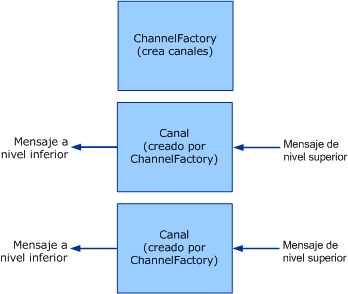

# <a name="client-channel-factories-and-channels"></a><span data-ttu-id="d3099-103">Cliente: Generadores de canales y canales</span><span class="sxs-lookup"><span data-stu-id="d3099-103">Client: Channel Factories and Channels</span></span>

<span data-ttu-id="d3099-104">Este tema describe la creación de generadores de canales y de canales.</span><span class="sxs-lookup"><span data-stu-id="d3099-104">This topic discusses the creation of channel factories and channels.</span></span>  
  
## <a name="channel-factories-and-channels"></a><span data-ttu-id="d3099-105">Generadores de canales y canales</span><span class="sxs-lookup"><span data-stu-id="d3099-105">Channel Factories and Channels</span></span>  

 <span data-ttu-id="d3099-106">Los generadores de canales son responsables de la creación de canales.</span><span class="sxs-lookup"><span data-stu-id="d3099-106">Channel factories are responsible for creating channels.</span></span> <span data-ttu-id="d3099-107">Los canales creados por los generadores de canales se utilizan para enviar mensajes.</span><span class="sxs-lookup"><span data-stu-id="d3099-107">Channels created by channel factories are used for sending messages.</span></span> <span data-ttu-id="d3099-108">Estos canales son responsables de obtener el mensaje de la capa anterior, realizando cualquier procesamiento necesario, y, a continuación, de enviar el mensaje a la capa inferior.</span><span class="sxs-lookup"><span data-stu-id="d3099-108">These channels are responsible for getting the message from the layer above, performing whatever processing is necessary, then sending the message to the layer below.</span></span> <span data-ttu-id="d3099-109">El siguiente gráfico ilustra este proceso.</span><span class="sxs-lookup"><span data-stu-id="d3099-109">The following graphic illustrates this process.</span></span>  
  
 <span data-ttu-id="d3099-110"></span><span class="sxs-lookup"><span data-stu-id="d3099-110"></span></span>  
<span data-ttu-id="d3099-111">Un generador de canales crea canales.</span><span class="sxs-lookup"><span data-stu-id="d3099-111">A channel factory creates channels.</span></span>  
  
 <span data-ttu-id="d3099-112">Cuando se cierran, los generadores de canales son responsables de cerrar cualquier canal creado por ellos que aún no se haya cerrado.</span><span class="sxs-lookup"><span data-stu-id="d3099-112">When closed, channel factories are responsible for closing any channels they created that are not yet closed.</span></span> <span data-ttu-id="d3099-113">Tenga en cuenta que, en el ejemplo, el modelo es asimétrico debido a que cuando se cierra un agente de escucha del canal solo detiene la aceptación de nuevos canales, pero mantiene abiertos los canales existentes de modo que pueden continuar recibiendo mensajes.</span><span class="sxs-lookup"><span data-stu-id="d3099-113">Note that the model is asymmetric here because when a channel listener is closed, it only stops accepting new channels but leaves existing channels open so that they can continue receiving messages.</span></span>  
  
 <span data-ttu-id="d3099-114">WCF proporciona aplicaciones auxiliares de clase base para este proceso.</span><span class="sxs-lookup"><span data-stu-id="d3099-114">WCF provides base class helpers for this process.</span></span> <span data-ttu-id="d3099-115">(Para ver un diagrama de las clases de aplicación auxiliar de canal descritas en este tema, consulte [información general del modelo de canal](channel-model-overview.md)).</span><span class="sxs-lookup"><span data-stu-id="d3099-115">(For a diagram of the channel helper classes discussed in this topic, see [Channel Model Overview](channel-model-overview.md).)</span></span>  
  
- <span data-ttu-id="d3099-116">La <xref:System.ServiceModel.Channels.CommunicationObject> clase implementa <xref:System.ServiceModel.ICommunicationObject> y exige el equipo de estado descrito en el paso 2 de [desarrollo de canales](developing-channels.md).</span><span class="sxs-lookup"><span data-stu-id="d3099-116">The <xref:System.ServiceModel.Channels.CommunicationObject> class implements <xref:System.ServiceModel.ICommunicationObject> and enforces the state machine described in step 2 of [Developing Channels](developing-channels.md).</span></span>  
  
- <span data-ttu-id="d3099-117">La <xref:System.ServiceModel.Channels.ChannelManagerBase> clase implementa <xref:System.ServiceModel.Channels.CommunicationObject> y proporciona una clase base unificada para <xref:System.ServiceModel.Channels.ChannelFactoryBase?displayProperty=nameWithType> y <xref:System.ServiceModel.Channels.ChannelListenerBase?displayProperty=nameWithType> .</span><span class="sxs-lookup"><span data-stu-id="d3099-117">The <xref:System.ServiceModel.Channels.ChannelManagerBase> class implements <xref:System.ServiceModel.Channels.CommunicationObject> and provides a unified base class for <xref:System.ServiceModel.Channels.ChannelFactoryBase?displayProperty=nameWithType> and <xref:System.ServiceModel.Channels.ChannelListenerBase?displayProperty=nameWithType>.</span></span> <span data-ttu-id="d3099-118">La clase <xref:System.ServiceModel.Channels.ChannelManagerBase> trabaja junto con <xref:System.ServiceModel.Channels.ChannelBase>, que es una clase base que implementa <xref:System.ServiceModel.Channels.IChannel>.</span><span class="sxs-lookup"><span data-stu-id="d3099-118">The <xref:System.ServiceModel.Channels.ChannelManagerBase> class works in conjunction with <xref:System.ServiceModel.Channels.ChannelBase>, which is a base class that implements <xref:System.ServiceModel.Channels.IChannel>.</span></span>
  
- <span data-ttu-id="d3099-119">La <xref:System.ServiceModel.Channels.ChannelFactoryBase> clase implementa <xref:System.ServiceModel.Channels.ChannelManagerBase> y <xref:System.ServiceModel.Channels.IChannelFactory> y consolida las `CreateChannel` sobrecargas en un `OnCreateChannel` método abstracto.</span><span class="sxs-lookup"><span data-stu-id="d3099-119">The <xref:System.ServiceModel.Channels.ChannelFactoryBase> class implements <xref:System.ServiceModel.Channels.ChannelManagerBase> and <xref:System.ServiceModel.Channels.IChannelFactory> and consolidates the `CreateChannel` overloads into one `OnCreateChannel` abstract method.</span></span>
  
- <span data-ttu-id="d3099-120">La <xref:System.ServiceModel.Channels.ChannelListenerBase> clase implementa <xref:System.ServiceModel.Channels.IChannelListener> .</span><span class="sxs-lookup"><span data-stu-id="d3099-120">The <xref:System.ServiceModel.Channels.ChannelListenerBase> class implements <xref:System.ServiceModel.Channels.IChannelListener>.</span></span> <span data-ttu-id="d3099-121">Se encarga de la administración de estados básica.</span><span class="sxs-lookup"><span data-stu-id="d3099-121">It takes care of basic state management.</span></span>
  
 <span data-ttu-id="d3099-122">La siguiente explicación se basa en el ejemplo [Transport: UDP](../samples/transport-udp.md) .</span><span class="sxs-lookup"><span data-stu-id="d3099-122">The following discussion is based upon the [Transport: UDP](../samples/transport-udp.md) sample.</span></span>  
  
### <a name="creating-a-channel-factory"></a><span data-ttu-id="d3099-123">Creación de un generador de canales</span><span class="sxs-lookup"><span data-stu-id="d3099-123">Creating a Channel Factory</span></span>  

 <span data-ttu-id="d3099-124">La clase `UdpChannelFactory` se deriva de la clase <xref:System.ServiceModel.Channels.ChannelFactoryBase>.</span><span class="sxs-lookup"><span data-stu-id="d3099-124">The `UdpChannelFactory` derives from <xref:System.ServiceModel.Channels.ChannelFactoryBase>.</span></span> <span data-ttu-id="d3099-125">El ejemplo invalida <xref:System.ServiceModel.Channels.ChannelFactoryBase.GetProperty%2A> para proporcionar acceso a la versión del mensaje del codificador de mensajes.</span><span class="sxs-lookup"><span data-stu-id="d3099-125">The sample overrides <xref:System.ServiceModel.Channels.ChannelFactoryBase.GetProperty%2A> to provide access to the message version of the message encoder.</span></span> <span data-ttu-id="d3099-126">El ejemplo también invalida <xref:System.ServiceModel.Channels.ChannelFactoryBase.OnClose%2A> para anular nuestra instancia de <xref:System.ServiceModel.Channels.BufferManager> cuando se realizan las transiciones del equipo de estados.</span><span class="sxs-lookup"><span data-stu-id="d3099-126">The sample also overrides <xref:System.ServiceModel.Channels.ChannelFactoryBase.OnClose%2A> to tear down our instance of <xref:System.ServiceModel.Channels.BufferManager> when the state machine transitions.</span></span>  
  
#### <a name="the-udp-output-channel"></a><span data-ttu-id="d3099-127">Canal de salida UDP</span><span class="sxs-lookup"><span data-stu-id="d3099-127">The UDP Output Channel</span></span>  

 <span data-ttu-id="d3099-128">La clase `UdpOutputChannel` implementa la interfaz <xref:System.ServiceModel.Channels.IOutputChannel>.</span><span class="sxs-lookup"><span data-stu-id="d3099-128">The `UdpOutputChannel` implements <xref:System.ServiceModel.Channels.IOutputChannel>.</span></span> <span data-ttu-id="d3099-129">El constructor valida los argumentos y construye un objeto de destino <xref:System.Net.EndPoint> basado en la <xref:System.ServiceModel.EndpointAddress> a la que se pasa.</span><span class="sxs-lookup"><span data-stu-id="d3099-129">The constructor validates the arguments and constructs a destination <xref:System.Net.EndPoint> object based on the <xref:System.ServiceModel.EndpointAddress> that is passed in.</span></span>  
  
 <span data-ttu-id="d3099-130">La invalidación de <xref:System.ServiceModel.Channels.CommunicationObject.OnOpen%2A> crea un socket que se utiliza para enviar los mensajes a <xref:System.Net.EndPoint>.</span><span class="sxs-lookup"><span data-stu-id="d3099-130">The override of <xref:System.ServiceModel.Channels.CommunicationObject.OnOpen%2A> creates a socket that is used to send messages to this <xref:System.Net.EndPoint>.</span></span>  
  
 ```csharp
this.socket = new Socket(  
this.remoteEndPoint.AddressFamily,
   SocketType.Dgram,
   ProtocolType.Udp
);  
```  

 <span data-ttu-id="d3099-131">El canal puede cerrarse de forma correcta o incorrecta.</span><span class="sxs-lookup"><span data-stu-id="d3099-131">The channel can be closed gracefully or ungracefully.</span></span> <span data-ttu-id="d3099-132">Si el canal se cierra correctamente, el socket se cierra y se realiza una llamada al método `OnClose` de la clase base.</span><span class="sxs-lookup"><span data-stu-id="d3099-132">If the channel is closed gracefully the socket is closed and a call is made to the base class `OnClose` method.</span></span> <span data-ttu-id="d3099-133">Si se inicia una excepción, la infraestructura llama a `Abort` para garantizar que se limpia el canal.</span><span class="sxs-lookup"><span data-stu-id="d3099-133">If this throws an exception, the infrastructure calls `Abort` to ensure the channel is cleaned up.</span></span>  
  
```csharp  
this.socket.Close();  
base.OnClose(timeout);  
```  
  
 <span data-ttu-id="d3099-134">Implemente `Send()` y `BeginSend()` / `EndSend()` .</span><span class="sxs-lookup"><span data-stu-id="d3099-134">Implement `Send()` and `BeginSend()`/`EndSend()`.</span></span> <span data-ttu-id="d3099-135">De este modo se divide en dos secciones principales.</span><span class="sxs-lookup"><span data-stu-id="d3099-135">This breaks down into two main sections.</span></span> <span data-ttu-id="d3099-136">Primero se serializa el mensaje en una matriz de bytes:</span><span class="sxs-lookup"><span data-stu-id="d3099-136">First serialize the message into a byte array:</span></span>  
  
```csharp  
ArraySegment<byte> messageBuffer = EncodeMessage(message);  
```  
  
 <span data-ttu-id="d3099-137">A continuación, se envían los datos resultantes en la conexión:</span><span class="sxs-lookup"><span data-stu-id="d3099-137">Then send the resulting data on the wire:</span></span>  
  
```csharp  
this.socket.SendTo(  
  messageBuffer.Array,
  messageBuffer.Offset,
  messageBuffer.Count,
  SocketFlags.None,
  this.remoteEndPoint  
);  
```  
  
## <a name="see-also"></a><span data-ttu-id="d3099-138">Vea también</span><span class="sxs-lookup"><span data-stu-id="d3099-138">See also</span></span>

- [<span data-ttu-id="d3099-139">Desarrollo de canales</span><span class="sxs-lookup"><span data-stu-id="d3099-139">Developing Channels</span></span>](developing-channels.md)
