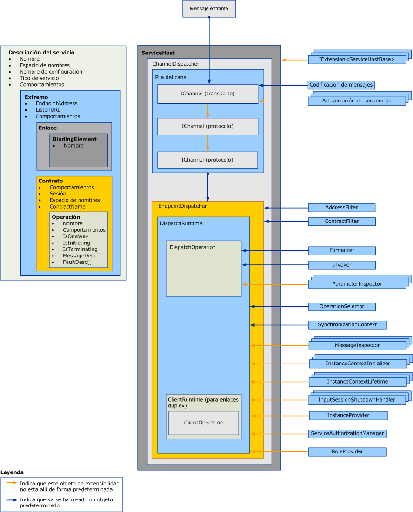

# Extensión de distribuidoresExtending Dispatchers

Los distribuidores son los responsables de extraer los mensajes entrantes de los canales subyacentes, de modo que los traducen en código de aplicación en las invocaciones de método y devuelven los resultados al autor de la llamada.Dispatchers are responsible for pulling incoming messages out of the underlying channels, translating them into method invocations in application code, and sending the results back to the caller. Las extensiones de distribuidores le permiten modificar este procesamiento.Dispatcher extensions allow you to modify this processing.  Puede implementar inspectores de parámetro o de mensaje que inspeccionen o modifiquen el contenido de los mensajes o los parámetros.You can implement message or parameter inspectors that inspect or modify the contents of messages or parameters.  Puede cambiar la manera en la que se enrutan los mensajes a las operaciones o proporcionar otras funcionalidades.You can change the way messages are routed to operations or provide some other functionality.

En este tema se describe cómo utilizar <xref:System.ServiceModel.Dispatcher.DispatchRuntime> las <xref:System.ServiceModel.Dispatcher.DispatchOperation> clases y en una aplicación de servicio de Windows Communication Foundation (WCF) para modificar el comportamiento de ejecución predeterminado de un distribuidor o para interceptar o modificar mensajes, parámetros o valores devueltos antes o después de enviarlos o recuperarlos de la capa del canal.This topic describes how to use the <xref:System.ServiceModel.Dispatcher.DispatchRuntime> and <xref:System.ServiceModel.Dispatcher.DispatchOperation> classes in a Windows Communication Foundation (WCF) service application to modify the default execution behavior of a dispatcher or to intercept or modify messages, parameters, or return values prior to or subsequent to sending or retrieving them from the channel layer. Para obtener más información sobre el procesamiento de mensajes en tiempo de ejecución de cliente equivalente, consulte [Extending](extending-clients.md)clients.For more information about the equivalent client runtime message processing, see [Extending Clients](extending-clients.md). Para comprender el rol que los <xref:System.ServiceModel.IExtensibleObject%601> tipos desempeñan en el acceso al estado compartido entre varios objetos de personalización en tiempo de ejecución, vea [objetos extensibles](extensible-objects.md).To understand the role that <xref:System.ServiceModel.IExtensibleObject%601> types play in accessing shared state between various runtime customization objects, see [Extensible Objects](extensible-objects.md).

## DistribuidoresDispatchers

El nivel del modelo de servicios realiza la conversión entre el modelo de programación del programador y el intercambio de mensajes subyacentes, comúnmente denominado el nivel de canal.The service model layer performs the conversion between the developer’s programming model and the underlying message exchange, commonly called the channel layer. En WCF, los distribuidores de canal y punto de conexión ( <xref:System.ServiceModel.Dispatcher.ChannelDispatcher> y <xref:System.ServiceModel.Dispatcher.EndpointDispatcher> , respectivamente) son los componentes de servicio responsables de aceptar nuevos canales, recibir mensajes, operaciones de envío e invocación de operaciones y procesamiento de respuestas.In WCF the channel and endpoint dispatchers (<xref:System.ServiceModel.Dispatcher.ChannelDispatcher> and <xref:System.ServiceModel.Dispatcher.EndpointDispatcher>, respectively) are the service components responsible for accepting new channels, receiving messages, operation dispatch and invocation, and response processing. Los objetos de distribuidor son objetos de receptor, pero las implementaciones de contratos de devolución de llamadas en servicios dúplex también exponen sus objetos de distribuidor para la inspección, modificación o extensión.Dispatcher objects are receiver objects, but callback contract implementations in duplex services also expose their dispatcher objects for inspection, modification, or extension.

El distribuidor de canales (y <xref:System.ServiceModel.Channels.IChannelListener> complementario) extrae los mensajes del canal del subordinado y pasa los mensajes a sus distribuidores de extremos respectivos.The channel dispatcher (and companion <xref:System.ServiceModel.Channels.IChannelListener>) pulls messages out of the underling channel and passes the messages to their respective endpoint dispatchers. Cada distribuidor de extremos tiene un <xref:System.ServiceModel.Dispatcher.DispatchRuntime> que enruta los mensajes a la <xref:System.ServiceModel.Dispatcher.DispatchOperation> adecuada, que es responsable de llamar al método que implementa la operación.Each endpoint dispatcher has a <xref:System.ServiceModel.Dispatcher.DispatchRuntime> that routes messages to the appropriate <xref:System.ServiceModel.Dispatcher.DispatchOperation>, which is responsible for calling the method that implements the operation. Durante el proceso, se invocan varias clases de extensiones opcionales y obligatorias.Various optional and required extension classes are invoked along the way. En este tema se explica cómo encajan estas piezas, y cómo podría modificar las propiedades e introducir su propio código para extender la funcionalidad básica.This topic explains how these pieces fit together, and how you might modify properties and plug your own code in to extend the base functionality.

Las propiedades del distribuidor y los objetos de personalización modificados se insertan utilizando objetos de comportamiento de operación, servicio, punto de conexión, o contrato.Dispatcher properties and modified customization objects are inserted by using service, endpoint, contract, or operation behavior objects. En este tema no se describe cómo utilizar los comportamientos.This topic does not describe how to use behaviors. Para obtener más información sobre los tipos que se usan para insertar modificaciones del distribuidor, vea [configurar y extender el Runtime con comportamientos](configuring-and-extending-the-runtime-with-behaviors.md).For more information about the types used to insert dispatcher modifications, see [Configuring and Extending the Runtime with Behaviors](configuring-and-extending-the-runtime-with-behaviors.md).

El siguiente gráfico proporciona una vista de alto nivel de los elementos arquitectónicos de un servicio.The following graphic provides a high-level view of the architectural items in a service.

### Distribuidores de canalChannel Dispatchers

Se crea un objeto <xref:System.ServiceModel.Dispatcher.ChannelDispatcher> para asociar un <xref:System.ServiceModel.Channels.IChannelListener> de un URI determinado (denominado URI de escucha) a una instancia de un servicio.A <xref:System.ServiceModel.Dispatcher.ChannelDispatcher> object is created to associate an <xref:System.ServiceModel.Channels.IChannelListener> at a particular URI (called a listen URI) with an instance of a service. Cada objeto <xref:System.ServiceModel.ServiceHost> puede tener muchos objetos <xref:System.ServiceModel.Dispatcher.ChannelDispatcher>, cada uno asociado a un solo agente de escucha y un URI de escucha.Each <xref:System.ServiceModel.ServiceHost> object can have many <xref:System.ServiceModel.Dispatcher.ChannelDispatcher> objects, each associated with only one listener and listen URI. Cuando llega un mensaje, el objeto <xref:System.ServiceModel.Dispatcher.ChannelDispatcher> consulta a cada uno de los objetos <xref:System.ServiceModel.Dispatcher.EndpointDispatcher> asociados para saber si el extremo puede aceptar el mensaje, y pasa el mensaje a uno que pueda.When a message arrives, the <xref:System.ServiceModel.Dispatcher.ChannelDispatcher> queries each of the associated <xref:System.ServiceModel.Dispatcher.EndpointDispatcher> objects whether the endpoint can accept the message, and passes the message to the one that can.

Todas las propiedades que controlan la duración y el comportamiento de una sesión de canal se pueden inspeccionar o modificar en el objeto <xref:System.ServiceModel.Dispatcher.ChannelDispatcher>.All properties that control the lifetime and behavior of a channel session are available for inspection or modification on the <xref:System.ServiceModel.Dispatcher.ChannelDispatcher> object. Entre ellos se incluyen los inicializadores de canales personalizados, el agente de escuchas de canal, el host, el <xref:System.ServiceModel.InstanceContext>asociado, etc.These include custom channel initializers, the channel listener, the host, the associated <xref:System.ServiceModel.InstanceContext>, and so on.

### Distribuidores de puntos de conexiónEndpoint Dispatchers

El objeto <xref:System.ServiceModel.Dispatcher.EndpointDispatcher> es responsable de procesar los mensajes de un objeto <xref:System.ServiceModel.Dispatcher.ChannelDispatcher> cuando la dirección de destino de un mensaje coincide con la propiedad <xref:System.ServiceModel.Dispatcher.EndpointDispatcher.AddressFilter%2A> y la acción del mensaje coincide con la propiedad <xref:System.ServiceModel.Dispatcher.EndpointDispatcher.ContractFilter%2A>.The <xref:System.ServiceModel.Dispatcher.EndpointDispatcher> object is responsible for processing messages from a <xref:System.ServiceModel.Dispatcher.ChannelDispatcher> when the destination address of a message matches the <xref:System.ServiceModel.Dispatcher.EndpointDispatcher.AddressFilter%2A> and the message action matches the <xref:System.ServiceModel.Dispatcher.EndpointDispatcher.ContractFilter%2A> property. Si dos objetos <xref:System.ServiceModel.Dispatcher.EndpointDispatcher> pueden aceptar un mensaje, el valor de la propiedad <xref:System.ServiceModel.Dispatcher.EndpointDispatcher.FilterPriority%2A> determina el punto de conexión de mayor prioridad.If two <xref:System.ServiceModel.Dispatcher.EndpointDispatcher> objects can accept a message, the <xref:System.ServiceModel.Dispatcher.EndpointDispatcher.FilterPriority%2A> property value determines the higher priority endpoint.

Utilice el <xref:System.ServiceModel.Dispatcher.EndpointDispatcher> para adquirir los dos puntos de extensión de modelo de servicio principales, las clases <xref:System.ServiceModel.Dispatcher.DispatchRuntime> y <xref:System.ServiceModel.Dispatcher.DispatchOperation>, que puede utilizar para personalizar el procesamiento del distribuidor.Use the <xref:System.ServiceModel.Dispatcher.EndpointDispatcher> to acquire the two main service model extension points – the <xref:System.ServiceModel.Dispatcher.DispatchRuntime> and <xref:System.ServiceModel.Dispatcher.DispatchOperation> classes – that you can use to customize the processing of the dispatcher. La clase <xref:System.ServiceModel.Dispatcher.DispatchRuntime> permite a los usuarios interceptar y extender el distribuidor en el ámbito del contrato (es decir, para todos los mensajes de un contrato).The <xref:System.ServiceModel.Dispatcher.DispatchRuntime> class allows users to intercept and extend the dispatcher at the contract scope (that is, for all messages in a contract). La clase <xref:System.ServiceModel.Dispatcher.DispatchOperation> permite a los usuarios interceptar y extender el distribuidor en un ámbito de operación (es decir, para todos los mensajes de una operación).The <xref:System.ServiceModel.Dispatcher.DispatchOperation> class allows users to intercept and extend the dispatcher at an operation scope (that is, for all messages in an operation).

## EscenariosScenarios

Hay varias razones para extender el distribuidor:There a number of reasons to extend the dispatcher:

- Validación personalizada del mensaje.Custom Message Validation. Los usuarios pueden exigir que un mensaje sea válido para un determinado esquema.Users can enforce that a message is valid for a certain schema. Esto se puede hacer implementando las interfaces del interceptor de mensajes.This can be done by implementing the message interceptor interfaces. Para ver un ejemplo, consulte [inspectores de mensajes](../samples/message-inspectors.md).For an example, see [Message Inspectors](../samples/message-inspectors.md).

- Registro personalizado de mensajes.Custom Message Logging. Los usuarios pueden inspeccionar y registrar un conjunto de mensajes de la aplicación que fluyen a través de un punto de conexión.Users can inspect and log some set of application messages that flow through an endpoint. Esto también se puede lograr con las interfaces del interceptor de mensajes.This can also be accomplished with the message interceptor interfaces.

- Transformaciones personalizadas del mensaje.Custom Message Transformations. Los usuarios pueden aplicar ciertas transformaciones al mensaje en el runtime (por ejemplo, para el control de versiones).Users can apply certain transformations to the message in the runtime (for example, for versioning). Esto también se puede lograr, de nuevo, con las interfaces del interceptor de mensajes.This can be accomplished, again, with the message interceptor interfaces.

- Modelo de datos personalizado.Custom Data Model. Los usuarios pueden tener un modelo de serialización de datos distinto de los que se admiten de forma predeterminada en WCF (es decir, <xref:System.Runtime.Serialization.DataContractSerializer?displayProperty=nameWithType> <xref:System.Xml.Serialization.XmlSerializer?displayProperty=nameWithType> los mensajes, y sin formato).Users can have a data serialization model other than those supported by default in WCF (namely, <xref:System.Runtime.Serialization.DataContractSerializer?displayProperty=nameWithType>, <xref:System.Xml.Serialization.XmlSerializer?displayProperty=nameWithType>, and raw messages). Esto se puede hacer implementando las interfaces del formateador de mensajes.This can be done by implement the message formatter interfaces. Para obtener un ejemplo, vea [formateador de operaciones y selector de operaciones](../samples/operation-formatter-and-operation-selector.md).For an example, see [Operation Formatter and Operation Selector](../samples/operation-formatter-and-operation-selector.md).

- Validación personalizada de parámetros.Custom Parameter Validation. Los usuarios pueden exigir que los parámetros con tipo sean válidos (por oposición a XML).Users can enforce that typed parameters are valid (as opposed to XML). Esto puede hacerse mediante las interfaces del inspector de parámetros.This can be done using the parameter inspector interfaces.

- Distribución de operaciones personalizadas.Custom Operation Dispatching. Los usuarios pueden implementar la distribución en algo que no sea una acción; por ejemplo, en el elemento de cuerpo o en una propiedad de un mensaje personalizado.Users can implement dispatching on something other than action – for example, on the body element, or on a custom message property. Esto se puede hacer mediante la interfaz <xref:System.ServiceModel.Dispatcher.IDispatchOperationSelector>.This can be done using the <xref:System.ServiceModel.Dispatcher.IDispatchOperationSelector> interface. Para obtener un ejemplo, vea [formateador de operaciones y selector de operaciones](../samples/operation-formatter-and-operation-selector.md).For an example, see [Operation Formatter and Operation Selector](../samples/operation-formatter-and-operation-selector.md).

- Agrupación de objetos.Object Pooling. Los usuarios pueden agrupar instancias en lugar de asignar una nueva instancia a cada llamada.Users can pool instances rather than allocating a new one for every call. Esto se puede implementar mediante las interfaces proveedoras de instancias.This can be implemented using the instance provider interfaces. Para obtener un ejemplo, consulte [agrupación](../samples/pooling.md).For an example, see [Pooling](../samples/pooling.md).

- Arrendamiento de instancias.Instance Leasing. Los usuarios pueden implementar un patrón de arrendamiento para la duración de instancias, similar al de .NET Framework Remoting.Users can implement a leasing pattern for instance lifetime, similar to that of .NET Framework Remoting. Esto se puede hacer mediante las interfaces de duración de contexto de instancias.This can be done using the instance context lifetime interfaces.

- Control de errores personalizado.Custom Error Handling. Los usuarios pueden controlar cómo se procesan los errores locales y cómo se devuelven los errores a los clientes.Users can control how both local errors are processed and how faults are communicated back to clients. Esto se puede implementar utilizando las interfaces <xref:System.ServiceModel.Dispatcher.IErrorHandler>.This can be implemented using the <xref:System.ServiceModel.Dispatcher.IErrorHandler> interfaces.

- Comportamientos de autorización personalizados.Custom Authorization Behaviors. Los usuarios pueden implementar un control de acceso personalizado extendiendo las partes en tiempo de ejecución de contratos u operaciones y agregando comprobaciones de seguridad basadas en los tokens presentes en el mensaje.Users can implement custom access control by extending the Contract or Operation run-time pieces and adding security checks based upon the tokens present in the message. Esto se puede lograr utilizando las interfaces del interceptor de mensajes o del interceptor de parámetros.This can be accomplished using either the message interceptor or parameter interceptor interfaces. Para obtener ejemplos, vea [extensibilidad de seguridad](../samples/security-extensibility.md).For examples, see [Security Extensibility](../samples/security-extensibility.md).

  > [!CAUTION]
  > Dado que la modificación de las propiedades de seguridad tiene la posibilidad de poner en peligro la seguridad de las aplicaciones WCF, se recomienda encarecidamente realizar modificaciones relacionadas con la seguridad con cuidado y realizar pruebas exhaustivas antes de la implementación.Because altering security properties has the potential to compromise the security of WCF applications, it is strongly recommended that you undertake security-related modifications with care and test thoroughly prior to deployment.

- Validadores personalizados de WCF en tiempo de ejecución.Custom WCF Runtime Validators. Puede instalar validadores personalizados que examinen servicios, contratos y enlaces para aplicar directivas de nivel empresarial con respecto a las aplicaciones WCF.You can install custom validators that examine services, contracts, and bindings to enforce enterprise-level policies with respect to WCF applications. (Por ejemplo, consulte [Cómo: bloquear puntos de conexión en la empresa](how-to-lock-down-endpoints-in-the-enterprise.md)).(For example, see [How to: Lock Down Endpoints in the Enterprise](how-to-lock-down-endpoints-in-the-enterprise.md).)

### Uso de la clase DispatchRuntimeUsing the DispatchRuntime Class

Utilice la clase <xref:System.ServiceModel.Dispatcher.DispatchRuntime> para modificar el comportamiento predeterminado de punto de conexión individual o de servicio, o para insertar objetos que implementen modificaciones personalizadas en uno o ambos de los siguientes procesos de servicio (o procesos de cliente en el caso de un cliente dúplex):Use the <xref:System.ServiceModel.Dispatcher.DispatchRuntime> class either to modify the default behavior of a service or individual endpoint, or to insert objects that implement custom modifications to one or both of the following service processes (or client processes in the case of a duplex client):

- La transformación de mensajes entrantes en los objetos y la suelta de esos objetos como invocaciones de método en un objeto de servicio.The transformation of incoming messages into objects and releasing those objects as method invocations on a service object.

- La transformación de objetos recibidos de la respuesta a una invocación de operación de servicio en mensajes salientes.The transformation of objects received from the response to a service operation invocation into outbound messages.

<xref:System.ServiceModel.Dispatcher.DispatchRuntime> le permite interceptar y extender el canal o el distribuidor del extremo para todos los mensajes de un contrato determinado, incluso cuando no se reconoce un mensaje.The <xref:System.ServiceModel.Dispatcher.DispatchRuntime> enables you to intercept and extend the channel or endpoint dispatcher for all messages across a particular contract, even when a message is not recognized. Cuando llega un mensaje que no coincide con ningún mensaje declarado en el contrato, se envía a la operación devuelta por la propiedad <xref:System.ServiceModel.Dispatcher.DispatchRuntime.UnhandledDispatchOperation%2A>.When a message arrives that does not match any declared in the contract it is dispatched to the operation returned by the <xref:System.ServiceModel.Dispatcher.DispatchRuntime.UnhandledDispatchOperation%2A> property. Para interceptar o extenderse por todos los mensajes de una operación determinada, vea la clase <xref:System.ServiceModel.Dispatcher.DispatchOperation>.To intercept or extend across all messages for a particular operation, see the <xref:System.ServiceModel.Dispatcher.DispatchOperation> class.

Hay cuatro áreas principales de extensibilidad del distribuidor expuestas por la clase <xref:System.ServiceModel.Dispatcher.DispatchRuntime>:There are four main areas of dispatcher extensibility exposed by the <xref:System.ServiceModel.Dispatcher.DispatchRuntime> class:

1. Los componentes de canal utilizan las propiedades de <xref:System.ServiceModel.Dispatcher.DispatchRuntime> y las del distribuidor del canal asociado devueltas por la propiedad <xref:System.ServiceModel.Dispatcher.DispatchRuntime.ChannelDispatcher%2A> para personalizar cómo el distribuidor del canal acepta y cierra los canales.Channel components use the properties of the <xref:System.ServiceModel.Dispatcher.DispatchRuntime> and those of the associated channel dispatcher returned by the <xref:System.ServiceModel.Dispatcher.DispatchRuntime.ChannelDispatcher%2A> property to customize how the channel dispatcher accepts and closes channels. Esta categoría incluye las propiedades <xref:System.ServiceModel.Dispatcher.ChannelDispatcher.ChannelInitializers%2A> y <xref:System.ServiceModel.Dispatcher.DispatchRuntime.InputSessionShutdownHandlers%2A>.This category includes the <xref:System.ServiceModel.Dispatcher.ChannelDispatcher.ChannelInitializers%2A> and <xref:System.ServiceModel.Dispatcher.DispatchRuntime.InputSessionShutdownHandlers%2A> properties.

2. Los componentes de mensaje se personalizan para cada mensaje procesado.Message components are customized for each message processed. Esta categoría incluye las propiedades <xref:System.ServiceModel.Dispatcher.DispatchRuntime.MessageInspectors%2A>, <xref:System.ServiceModel.Dispatcher.DispatchRuntime.OperationSelector%2A>, <xref:System.ServiceModel.Dispatcher.DispatchRuntime.Operations%2A> y <xref:System.ServiceModel.Dispatcher.ChannelDispatcher.ErrorHandlers%2A>.This category includes the <xref:System.ServiceModel.Dispatcher.DispatchRuntime.MessageInspectors%2A>, <xref:System.ServiceModel.Dispatcher.DispatchRuntime.OperationSelector%2A>, <xref:System.ServiceModel.Dispatcher.DispatchRuntime.Operations%2A>, and the <xref:System.ServiceModel.Dispatcher.ChannelDispatcher.ErrorHandlers%2A> properties.

3. Los componentes de instancia personalizan la creación, duración y eliminación de instancias del tipo de servicio.Instance components customize the creation, lifetime, and disposal of instances of the service type. Para obtener más información acerca de la duración de los objetos de servicio, vea la propiedad <xref:System.ServiceModel.ServiceBehaviorAttribute.InstanceContextMode%2A>.For more information about service object lifetimes, see the <xref:System.ServiceModel.ServiceBehaviorAttribute.InstanceContextMode%2A> property. Esta categoría incluye las propiedades <xref:System.ServiceModel.Dispatcher.DispatchRuntime.InstanceContextInitializers%2A> y <xref:System.ServiceModel.Dispatcher.DispatchRuntime.InstanceProvider%2A>.This category includes the <xref:System.ServiceModel.Dispatcher.DispatchRuntime.InstanceContextInitializers%2A> and the <xref:System.ServiceModel.Dispatcher.DispatchRuntime.InstanceProvider%2A> properties.

4. Los componentes relacionados con seguridad pueden utilizar las propiedades siguientes:Security-related components can use the following properties:

    - <xref:System.ServiceModel.Dispatcher.DispatchRuntime.SecurityAuditLogLocation%2A> indica donde se escriben los eventos de auditoría.<xref:System.ServiceModel.Dispatcher.DispatchRuntime.SecurityAuditLogLocation%2A> indicates where audit events are written.

    - <xref:System.ServiceModel.Dispatcher.DispatchRuntime.ImpersonateCallerForAllOperations%2A> controla si el servicio intenta suplantar mediante las credenciales proporcionadas por el mensaje entrante.<xref:System.ServiceModel.Dispatcher.DispatchRuntime.ImpersonateCallerForAllOperations%2A> controls whether the service attempts to impersonate using the credentials provided by the incoming message.

    - <xref:System.ServiceModel.Dispatcher.DispatchRuntime.MessageAuthenticationAuditLevel%2A> controla si los eventos de autenticación de mensajes correctos se escriben en el registro de eventos especificado por <xref:System.ServiceModel.Dispatcher.DispatchRuntime.SecurityAuditLogLocation%2A>.<xref:System.ServiceModel.Dispatcher.DispatchRuntime.MessageAuthenticationAuditLevel%2A> controls whether successful message authentication events are written to the event log specified by <xref:System.ServiceModel.Dispatcher.DispatchRuntime.SecurityAuditLogLocation%2A>.

    - <xref:System.ServiceModel.Dispatcher.DispatchRuntime.PrincipalPermissionMode%2A> controla cómo se establece la propiedad <xref:System.Threading.Thread.CurrentPrincipal%2A>.<xref:System.ServiceModel.Dispatcher.DispatchRuntime.PrincipalPermissionMode%2A> controls how the <xref:System.Threading.Thread.CurrentPrincipal%2A> property is set.

    - <xref:System.ServiceModel.Dispatcher.DispatchRuntime.ServiceAuthorizationAuditLevel%2A> especifica cómo se realiza la auditoría de eventos de autorización.<xref:System.ServiceModel.Dispatcher.DispatchRuntime.ServiceAuthorizationAuditLevel%2A> specifies how the auditing of authorization events is performed.

    - <xref:System.ServiceModel.Dispatcher.DispatchRuntime.SuppressAuditFailure%2A> especifica si suprimir excepciones no críticas que producen durante el proceso del registro.<xref:System.ServiceModel.Dispatcher.DispatchRuntime.SuppressAuditFailure%2A> specifies whether to suppress non-critical exceptions that occur during the logging process.

Normalmente, un comportamiento de servicio (un objeto que implementa <xref:System.ServiceModel.Dispatcher.DispatchRuntime>), un comportamiento de contrato (un objeto que implementa <xref:System.ServiceModel.Description.IServiceBehavior>) o un comportamiento de extremo (un objeto que implementa <xref:System.ServiceModel.Description.IContractBehavior>) pueden asignar objetos de extensión a una propiedad <xref:System.ServiceModel.Description.IEndpointBehavior> o insertarlos en una colección.Typically, custom extension objects are assigned to a <xref:System.ServiceModel.Dispatcher.DispatchRuntime> property or inserted into a collection by a service behavior (an object that implements <xref:System.ServiceModel.Description.IServiceBehavior>), a contract behavior (an object that implements <xref:System.ServiceModel.Description.IContractBehavior>), or an endpoint behavior (an object that implements <xref:System.ServiceModel.Description.IEndpointBehavior>). Entonces, el objeto de comportamiento de instalación se agrega a la colección adecuada de comportamientos mediante programación o implementando un objeto <xref:System.ServiceModel.Configuration.BehaviorExtensionElement> personalizado para permitir insertar el comportamiento con un archivo de configuración de la aplicación.Then the installing behavior object is added to the appropriate collection of behaviors either programmatically or by implementing a custom <xref:System.ServiceModel.Configuration.BehaviorExtensionElement> object to enable the behavior to be inserted using an application configuration file.

Los clientes dúplex (clientes que implementan un contrato de devolución de llamadas especificado por un servicio dúplex) también tienen un objeto <xref:System.ServiceModel.Dispatcher.DispatchRuntime> al que se puede obtener acceso usando la propiedad <xref:System.ServiceModel.Dispatcher.ClientRuntime.CallbackDispatchRuntime%2A>.Duplex clients (clients that implement a callback contract specified by a duplex service) also have a <xref:System.ServiceModel.Dispatcher.DispatchRuntime> object that can be accessed using the <xref:System.ServiceModel.Dispatcher.ClientRuntime.CallbackDispatchRuntime%2A> property.

### Uso de la clase DispatchOperationUsing the DispatchOperation Class

La clase <xref:System.ServiceModel.Dispatcher.DispatchOperation> es la ubicación para las modificaciones en tiempo de ejecución y el punto de inserción para las extensiones personalizadas cuyo ámbito es solo una operación de servicio.The <xref:System.ServiceModel.Dispatcher.DispatchOperation> class is the location for run-time modifications and the insertion point for custom extensions that are scoped to only one service operation. (Para modificar el comportamiento del tiempo de ejecución del servicio para todos los mensajes de un contrato, use la clase <xref:System.ServiceModel.Dispatcher.DispatchRuntime>.)(To modify service run-time behavior for all messages in a contract, use the <xref:System.ServiceModel.Dispatcher.DispatchRuntime> class.)

Instale las modificaciones de <xref:System.ServiceModel.Dispatcher.DispatchOperation> utilizando un objeto de comportamiento del servicio personalizado.Install <xref:System.ServiceModel.Dispatcher.DispatchOperation> modifications using a custom service behavior object.

Use la propiedad <xref:System.ServiceModel.Dispatcher.DispatchRuntime.Operations%2A> para buscar el objeto <xref:System.ServiceModel.Dispatcher.DispatchOperation> que representa una operación de servicio determinada.Use the <xref:System.ServiceModel.Dispatcher.DispatchRuntime.Operations%2A> property to locate the <xref:System.ServiceModel.Dispatcher.DispatchOperation> object that represents a particular service operation.

Las siguientes propiedades controlan la ejecución en tiempo de ejecución en el nivel de operación:The following properties control runtime execution at the operation level:

- Las propiedades <xref:System.ServiceModel.Dispatcher.DispatchOperation.Action%2A>, <xref:System.ServiceModel.Dispatcher.DispatchOperation.ReplyAction%2A>, <xref:System.ServiceModel.Dispatcher.DispatchOperation.FaultContractInfos%2A>, <xref:System.ServiceModel.Dispatcher.DispatchOperation.IsOneWay%2A>, <xref:System.ServiceModel.Dispatcher.DispatchOperation.IsTerminating%2A> y <xref:System.ServiceModel.Dispatcher.DispatchOperation.Name%2A> obtienen los valores correspondientes para la operación.The <xref:System.ServiceModel.Dispatcher.DispatchOperation.Action%2A>, <xref:System.ServiceModel.Dispatcher.DispatchOperation.ReplyAction%2A>, <xref:System.ServiceModel.Dispatcher.DispatchOperation.FaultContractInfos%2A>, <xref:System.ServiceModel.Dispatcher.DispatchOperation.IsOneWay%2A>, <xref:System.ServiceModel.Dispatcher.DispatchOperation.IsTerminating%2A>, and <xref:System.ServiceModel.Dispatcher.DispatchOperation.Name%2A> properties obtain the respective values for the operation.

- Las propiedades <xref:System.ServiceModel.Dispatcher.DispatchOperation.TransactionAutoComplete%2A> y <xref:System.ServiceModel.Dispatcher.DispatchOperation.TransactionRequired%2A> especifican el comportamiento de transacciones.The <xref:System.ServiceModel.Dispatcher.DispatchOperation.TransactionAutoComplete%2A> and <xref:System.ServiceModel.Dispatcher.DispatchOperation.TransactionRequired%2A> specify transaction behavior.

- Las propiedades <xref:System.ServiceModel.Dispatcher.DispatchOperation.ReleaseInstanceBeforeCall%2A> y <xref:System.ServiceModel.Dispatcher.DispatchOperation.ReleaseInstanceAfterCall%2A> controlan la duración del objeto de servicio definido por el usuario relativo a <xref:System.ServiceModel.InstanceContext>.The <xref:System.ServiceModel.Dispatcher.DispatchOperation.ReleaseInstanceBeforeCall%2A> and <xref:System.ServiceModel.Dispatcher.DispatchOperation.ReleaseInstanceAfterCall%2A> properties control the lifetime of the user-defined service object relative to the <xref:System.ServiceModel.InstanceContext>.

- Las propiedades <xref:System.ServiceModel.Dispatcher.DispatchOperation.DeserializeRequest%2A>, <xref:System.ServiceModel.Dispatcher.DispatchOperation.SerializeReply%2A>y <xref:System.ServiceModel.Dispatcher.DispatchOperation.Formatter%2A> habilitan el control explícito sobre la conversión de los mensajes en los objetos, y de los objetos en mensajes.The <xref:System.ServiceModel.Dispatcher.DispatchOperation.DeserializeRequest%2A>, <xref:System.ServiceModel.Dispatcher.DispatchOperation.SerializeReply%2A>, and the <xref:System.ServiceModel.Dispatcher.DispatchOperation.Formatter%2A> properties enable explicit control over the conversion from messages to objects and objects to messages.

- La propiedad <xref:System.ServiceModel.Dispatcher.DispatchOperation.Impersonation%2A> especifica el nivel de suplantación de la operación.The <xref:System.ServiceModel.Dispatcher.DispatchOperation.Impersonation%2A> property specifies the operation impersonation level.

- La propiedad <xref:System.ServiceModel.Dispatcher.DispatchOperation.CallContextInitializers%2A> inserta extensiones de contexto de llamada personalizadas para la operación.The <xref:System.ServiceModel.Dispatcher.DispatchOperation.CallContextInitializers%2A> property inserts custom call context extensions for the operation.

- La propiedad <xref:System.ServiceModel.Dispatcher.DispatchOperation.AutoDisposeParameters%2A> controla cuando se destruyen los objetos de parámetro.The <xref:System.ServiceModel.Dispatcher.DispatchOperation.AutoDisposeParameters%2A> property controls when parameter objects are destroyed.

- La propiedad <xref:System.ServiceModel.Dispatcher.DispatchOperation.Invoker%2A> se usa para insertar un objeto autor de llamada personalizado.The <xref:System.ServiceModel.Dispatcher.DispatchOperation.Invoker%2A> property to insert a custom invoker object.

- La propiedad <xref:System.ServiceModel.Dispatcher.DispatchOperation.ParameterInspectors%2A> permite insertar un inspector de parámetros personalizado que se puede utilizar para inspeccionar o modificar parámetros y valores devueltos.The <xref:System.ServiceModel.Dispatcher.DispatchOperation.ParameterInspectors%2A> property enables you to insert a custom parameter inspector that you can use to inspect or modify parameters and return values.

## Vea tambiénSee also

- <xref:System.ServiceModel.Dispatcher.DispatchRuntime>
- <xref:System.ServiceModel.Dispatcher.DispatchOperation>
- [Procedimiento para inspeccionar y modificar mensajes en el servicioHow to: Inspect and Modify Messages on the Service](how-to-inspect-and-modify-messages-on-the-service.md)
- [Procedimiento para inspeccionar o modificar parámetrosHow to: Inspect or Modify Parameters](how-to-inspect-or-modify-parameters.md)
- [Procedimiento para bloquear puntos de conexión en la empresaHow to: Lock Down Endpoints in the Enterprise](how-to-lock-down-endpoints-in-the-enterprise.md)
