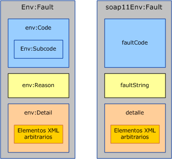
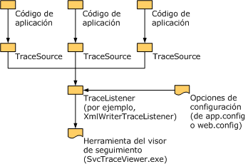

# <a name="handling-exceptions-and-faults"></a>Administración de excepciones y errores

Las excepciones se utilizan para comunicar localmente los errores dentro del servicio o la implementación del cliente. Los errores, por otro lado, se utilizan para comunicar los errores en los límites del servicio, como del servidor al cliente o viceversa. Además de los errores, los canales de transporte utilizan a menudo mecanismos específicos del transporte para comunicar los errores del nivel de transporte. Por ejemplo, el transporte HTTP utiliza códigos de estado como 404 para comunicar una dirección URL del extremo no existente (no hay ningún extremo para devolver un error). Este documento se compone de tres secciones que proporcionan una guía a los autores del canal personalizado. La primera sección proporciona una guía sobre cuándo y cómo definir y producir las excepciones. La segunda sección proporciona una guía sobre la generación y utilización de errores. La tercera sección explica cómo proporcionar información de seguimiento para ayudar al usuario de su canal personalizado a solucionar problemas de las aplicaciones en ejecución.  
  
## <a name="exceptions"></a>Excepciones  

 Hay dos cosas que deben tenerse presente al producir una excepción: primero tiene que ser de un tipo que permite a los usuarios escribir código correcto que pueda reaccionar apropiadamente a la excepción. Segundo, tiene que proporcionar suficiente información para que el usuario entienda qué salió mal, el impacto del error, y cómo corregirlo. En las secciones siguientes se proporcionan instrucciones sobre los tipos de excepción y los mensajes para los canales Windows Communication Foundation (WCF). También hay una guía general sobre las excepciones en .NET en el documento Instrucciones de diseño para excepciones.  
  
### <a name="exception-types"></a>Tipos de excepción  

 Todas las excepciones iniciadas por canales deben ser <xref:System.TimeoutException?displayProperty=nameWithType>, <xref:System.ServiceModel.CommunicationException?displayProperty=nameWithType>o un tipo derivado de <xref:System.ServiceModel.CommunicationException>. (También se pueden producir excepciones como <xref:System.ObjectDisposedException>, pero solo para indicar que el código de llamada ha empleado mal el canal. Si un canal se utiliza correctamente, solo debe iniciar las excepciones especificadas). WCF proporciona siete tipos de excepción que se derivan de <xref:System.ServiceModel.CommunicationException> y están diseñados para que los usen los canales. Hay otras excepciones derivadas de <xref:System.ServiceModel.CommunicationException> que están diseñadas para ser utilizadas por otras partes del sistema. Estos tipos de excepción son:  
  
|Tipo de excepción|Significado|Contenido de excepción interno|Estrategia de recuperación|  
|--------------------|-------------|-----------------------------|-----------------------|  
|<xref:System.ServiceModel.AddressAlreadyInUseException>|La dirección del punto de conexión especificada para realizar escuchas ya se está utilizando.|Si está presente, proporciona más detalles sobre el error de transporte que produjo esta excepción. Por ejemplo. <xref:System.IO.PipeException>, <xref:System.Net.HttpListenerException>, o <xref:System.Net.Sockets.SocketException>.|Pruebe una dirección diferente.|  
|<xref:System.ServiceModel.AddressAccessDeniedException>|El proceso no tiene acceso a la dirección del extremo especificada para realizar escuchas.|Si está presente, proporciona más detalles sobre el error de transporte que produjo esta excepción. Por ejemplo, <xref:System.IO.PipeException> o <xref:System.Net.HttpListenerException>.|Intente con credenciales diferentes.|  
|<xref:System.ServiceModel.CommunicationObjectFaultedException>|El <xref:System.ServiceModel.ICommunicationObject> que se está usando está en estado de error (para obtener más información, vea [Descripción de los cambios de estado](understanding-state-changes.md)). Tenga en cuenta que cuando un objeto con varias llamadas pendientes realiza una transición al estado de error, solo una llamada produce una excepción que está relacionada con el error y el resto de las llamadas inician <xref:System.ServiceModel.CommunicationObjectFaultedException>. Normalmente se produce esta excepción porque una aplicación pasa por alto alguna excepción e intenta utilizar un objeto que ya ha fallado, posiblemente en un subproceso diferente al que detectó la excepción original.|Si está presente, proporciona detalles sobre la excepción interna.|Crear un nuevo objeto. Tenga en cuenta que dependiendo de lo que provocó que<xref:System.ServiceModel.ICommunicationObject> fallase en primer lugar, puede haber otro trabajo implicado para recuperarlo.|  
|<xref:System.ServiceModel.CommunicationObjectAbortedException>|Se <xref:System.ServiceModel.ICommunicationObject> ha anulado el que se está usando (para obtener más información, vea [Descripción de los cambios de estado](understanding-state-changes.md)). De forma similar a <xref:System.ServiceModel.CommunicationObjectFaultedException> , esta excepción indica que la aplicación ha llamado a <xref:System.ServiceModel.ICommunicationObject.Abort%2A> en el objeto, posiblemente desde otro subproceso, y que el objeto ya no se puede utilizar por esa razón.|Si está presente, proporciona detalles sobre la excepción interna.|Crear un nuevo objeto. Tenga en cuenta que dependiendo de lo que provocó la anulación de <xref:System.ServiceModel.ICommunicationObject> en primer lugar, puede haber otro trabajo implicado para recuperarlo.|  
|<xref:System.ServiceModel.EndpointNotFoundException>|El punto de conexión remoto de destino no está realizando escuchas. Esto puede ser el resultado de que cualquier parte de la dirección de punto de conexión sea incorrecta, irresoluble, o que el punto de conexión esté caído. Los ejemplos incluyen error de DNS, Administrador de la cola no disponible y servicio no ejecutándose.|La excepción interna proporciona detalles, normalmente del transporte subyacente.|Pruebe una dirección diferente. Alternativamente, el remitente puede esperar un poco e intentarlo de nuevo en caso de que el servicio estuviera caído|  
|<xref:System.ServiceModel.ProtocolException>|Los protocolos de comunicación, como se describe en la Directiva del punto de conexión, no coinciden entre los extremos. Por ejemplo, el tipo de contenido de marco no coincide o se ha excedido el tamaño máximo del mensaje.|Si está presente, proporciona más información sobre el error de protocolo concreto. Por ejemplo, <xref:System.ServiceModel.QuotaExceededException> es la excepción interna cuando la causa del error es que se ha superado MaxReceivedMessageSize.|Recuperación: Asegurarse de que la configuración de protocolo del remitente y el destinatario coincidan. Una manera de hacerlo es volver a importar los metadatos del punto de conexión de servicio (Directiva) y utilizar el enlace generado para volver a crear el canal.|  
|<xref:System.ServiceModel.ServerTooBusyException>|El extremo remoto está realizando escuchas pero no está preparado para procesar los mensajes.|Si está presente, la excepción interna proporciona el error de SOAP o detalles del error en el nivel de transporte.|Recuperación: espere y vuelva a intentar después la operación.|  
|<xref:System.TimeoutException>|La operación no se completó dentro del período de tiempo de espera.|Puede proporcionar los detalles sobre el tiempo de espera.|Espere y reintente después la operación.|  
  
 Solo defina un nuevo tipo de excepción si ese tipo se corresponde con una estrategia de recuperación concreta diferente de todos los tipos de excepción existentes. Si define un nuevo tipo de excepción, debe derivar de <xref:System.ServiceModel.CommunicationException> o una de sus clases derivadas.  
  
### <a name="exception-messages"></a>Mensajes de excepción  

 Los mensajes de excepción se destinan al usuario no al programa de modo que deberían proporcionar la información suficiente para ayudar al usuario a entender y resolver el problema. Las tres partes esenciales de un mensaje de excepción bueno son:  
  
 Qué sucedió. Proporcione una descripción clara del problema con los términos relacionados con la experiencia del usuario. Por ejemplo, un mensaje de excepción malo sería "Sección de configuración no válida". Esto deja al usuario preguntándose qué sección de configuración es incorrecta y por qué es incorrecta. Un mensaje mejorado sería "sección de configuración no válida \<customBinding> ". Un mensaje aún mejor sería no "No se puede agregar el transporte denominado myTransport al enlace denominado myBinding porque el enlace ya tiene un transporte denominado myTransport." Se trata de un mensaje muy específico que usa términos y nombres que el usuario puede identificar fácilmente en el archivo de configuración de la aplicación. Sin embargo, todavía faltan algunos componentes clave.  
  
 La importancia del error. A menos que el mensaje diga claramente qué significa el error, es probable que el usuario se pregunte si es un error irrecuperable o si se puede omitir. En general, los mensajes deberían conducir al error mediante el significado o la importancia. Para mejorar el ejemplo anterior, el mensaje podría ser “ServiceHost no se ha podido abrir debido a un error de configuración: No puede agregar el transporte denominado myTransport al enlace denominado myBinding porque el enlace ya tiene un transporte denominado myTransport.”  
  
 Cómo el usuario debería corregir el problema. La parte más importante del mensaje está ayudar al usuario a corregir el problema. El mensaje debería incluir alguna guía o sugerencias sobre qué comprobar o corregir para solucionar el problema. Por ejemplo, "ServiceHost no se ha podido abrir debido a un error de configuración: No puede agregar el transporte denominado myTransport al enlace denominado myBinding porque el enlace ya tiene un transporte denominado myTransport. Asegúrese de que solo haya un transporte en el enlace."  
  
## <a name="communicating-faults"></a>Comunicar los errores  

 SOAP 1.1 y SOAP 1.2 definen una estructura concreta para los errores. Hay algunas diferencias entre las dos especificaciones pero en general, los tipos Message y MessageFault se utilizan para crear y utilizar los errores.  
  
   
Error de SOAP 1.2 (izquierda) y error de SOAP 1.1 (derecha). En SOAP 1,1, solo el elemento Fault está calificado con el espacio de nombres.  
  
 SOAP define un mensaje de error como un mensaje que contiene solo un elemento de error (un elemento cuyo nombre es `<env:Fault>`. El contenido del elemento de error difiere ligeramente entre SOAP 1.1 y SOAP 1.2 como se muestra en la figura 1. Sin embargo, la clase <xref:System.ServiceModel.Channels.MessageFault?displayProperty=nameWithType> normaliza estas diferencias en un modelo de objetos:  
  
```csharp
public abstract class MessageFault  
{  
    protected MessageFault();  
  
    public virtual string Actor { get; }  
    public virtual string Node { get; }  
    public static string DefaultAction { get; }  
    public abstract FaultCode Code { get; }  
    public abstract bool HasDetail { get; }  
    public abstract FaultReason Reason { get; }  
  
    public T GetDetail<T>();  
    public T GetDetail<T>( XmlObjectSerializer serializer);  
    public System.Xml.XmlDictionaryReader GetReaderAtDetailContents();  
  
    // other methods omitted  
}  
```  
  
 La propiedad `Code` corresponde a (o `env:Code` en SOAP 1.1) `faultCode` e identifica el tipo del error. SOAP 1.2 define cinco valores permitidos para `faultCode` (por ejemplo, Remitente y Receptor) y define un elemento `Subcode` que puede contener cualquier valor de subcódigo. (Consulte la [especificación de SOAP 1,2](https://www.w3.org/TR/soap12-part1/#tabsoapfaultcodes) para ver la lista de códigos de error permitidos y su significado). SOAP 1,1 tiene un mecanismo ligeramente diferente: define cuatro `faultCode` valores (por ejemplo, cliente y servidor) que se pueden extender definiendo los completamente nuevos o utilizando la notación de puntos para crear más específicos `faultCodes` , por ejemplo, Client. Authentication.  
  
 Al utilizar MessageFault para programar los errores, FaultCode.Name y FaultCode.Namespace se asignan al nombre y espacio de nombres de `env:Code` de SOAP 1.2 `faultCode`ó SOAP 1.1. FaultCode.SubCode se asigna a `env:Subcode` para SOAP 1.2 y es NULL para SOAP 1.1.  
  
 Debería crear nuevos subcódigos de error (o nuevos códigos de error si utiliza SOAP 1.1) si es interesante para distinguir mediante programación un error. Esto es análogo a crear un nuevo tipo de excepción. Debería evitar utilizar la notación de puntos con códigos de error de SOAP 1.1. (El [Perfil básico de WS-I](http://www.ws-i.org/Profiles/BasicProfile-1.1-2004-08-24.html#SOAP_Custom_Fault_Codes) también desaconseja el uso de la notación de puntos de código de error).  
  
```csharp
public class FaultCode  
{  
    public FaultCode(string name);  
    public FaultCode(string name, FaultCode subCode);  
    public FaultCode(string name, string ns);  
    public FaultCode(string name, string ns, FaultCode subCode);  
  
    public bool IsPredefinedFault { get; }  
    public bool IsReceiverFault { get; }  
    public bool IsSenderFault { get; }  
    public string Name { get; }  
    public string Namespace { get; }  
    public FaultCode SubCode { get; }  
  
//  methods omitted  
  
}  
```  
  
 La `Reason` propiedad corresponde a `env:Reason` (o `faultString` en SOAP 1,1) una descripción inteligible de la condición de error análoga al mensaje de una excepción. La clase `FaultReason` (y SOAP `env:Reason/faultString`) tiene compatibilidad integrada para tener varias traducciones en interés de la globalización.  
  
```csharp
public class FaultReason  
{  
    public FaultReason(FaultReasonText translation);  
    public FaultReason(IEnumerable<FaultReasonText> translations);  
    public FaultReason(string text);  
  
    public SynchronizedReadOnlyCollection<FaultReasonText> Translations
    {
       get;
    }  
  
 }  
```  
  
 El contenido de los detalles del error se expone en MessageFault con varios métodos, entre los que se incluyen `GetDetail` \<T> y `GetReaderAtDetailContents` (). El detalle del error es un elemento opaco para llevar el detalle adicional sobre el error. Esto es útil si es algún detalle estructurado arbitrario que desea llevar con el error.  
  
### <a name="generating-faults"></a>Generar errores  

 En esta sección se explica el proceso de generar un error en respuesta a una condición de error detectada en un canal o en una propiedad de mensaje creada por el canal. Un ejemplo típico es devolver un error en respuesta a un mensaje de solicitud que contiene datos no válidos.  
  
 Al generar un error, el canal personalizado no debería enviar directamente el error, más bien, debería iniciar una excepción y permitir a la capa anterior decidir si convertir esa excepción en un error y cómo enviarlo. Para ayudar en esta conversión, el canal debería proporcionar una implementación `FaultConverter` que pueda convertir la excepción iniciada por el canal personalizado en el error adecuado. `FaultConverter` se define como:  
  
```csharp
public class FaultConverter  
{  
    public static FaultConverter GetDefaultFaultConverter(  
                                   MessageVersion version);  
    protected abstract bool OnTryCreateFaultMessage(  
                                   Exception exception,
                                   out Message message);  
    public bool TryCreateFaultMessage(  
                                   Exception exception,
                                   out Message message);  
}  
```  
  
 Cada canal que genera errores personalizados debe implementar `FaultConverter` y devolverlo de una llamada a `GetProperty<FaultConverter>`. La `OnTryCreateFaultMessage` implementación personalizada debe convertir la excepción en un error o un delegado en el del canal interno `FaultConverter` . Si el canal es un transporte, debe convertir la excepción o el delegado en el codificador `FaultConverter` o el valor predeterminado `FaultConverter` proporcionado en WCF. El `FaultConverter` predeterminado convierte los errores que corresponden a los mensajes de error especificados por WS-Addressing y SOAP. A continuación se incluye un ejemplo de implementación `OnTryCreateFaultMessage`:  
  
```csharp
public override bool OnTryCreateFaultMessage(Exception exception,
                                             out Message message)  
{  
    if (exception is ...)  
    {  
        message = ...;  
        return true;  
    }  
  
#if IMPLEMENTING_TRANSPORT_CHANNEL  
    FaultConverter encoderConverter =
                    this.encoder.GetProperty<FaultConverter>();  
    if ((encoderConverter != null) &&
        (encoderConverter.TryCreateFaultMessage(  
         exception, out message)))  
    {  
        return true;  
    }  
  
    FaultConverter defaultConverter =
                   FaultConverter.GetDefaultFaultConverter(  
                   this.channel.messageVersion);  
    return defaultConverter.TryCreateFaultMessage(  
                   exception,
                   out message);  
#else  
    FaultConverter inner =
                   this.innerChannel.GetProperty<FaultConverter>();  
    if (inner != null)  
    {  
        return inner.TryCreateFaultMessage(exception, out message);  
    }  
    else  
    {  
        message = null;  
        return false;  
    }  
#endif  
}  
```  
  
 Una implicación de este patrón es que las excepciones iniciadas entre las capas para las condiciones de error que requieren los errores deben contener suficiente información para que el generador del error correspondiente cree el error correcto. Como un autor del canal personalizado, puede definir tipos de excepción que correspondan a condiciones de error diferentes si tales excepciones aún no existen. Observe que las excepciones que atraviesan las capas del canal deberían comunicar la condición de error en lugar de los datos del error opacos.  
  
### <a name="fault-categories"></a>Categorías de error  

 Generalmente hay tres categorías de errores:  
  
1. Errores que son penetrantes a lo largo de la pila completa. Estos errores se podrían encontrar en cualquier capa en la pila del canal, por ejemplo InvalidCardinalityAddressingException.  
  
2. Errores que se pueden encontrar en cualquier parte sobre una cierta capa en la pila, por ejemplo, algunos errores que pertenecen a una transacción fluida o a las funciones de seguridad.  
  
3. Errores dirigidos a una capa única en la pila, por ejemplo, errores como los errores de número de secuencia de WS-RM.  
  
 Categoría 1. Los errores son generalmente errores de WS-Addressing y de SOAP. La `FaultConverter` clase base proporcionada por WCF convierte los errores correspondientes a los mensajes de error especificados por WS-Addressing y SOAP, por lo que no es necesario controlar la conversión de estas excepciones usted mismo.  
  
 Categoría 2. Los errores se producen cuando una capa agrega una propiedad al mensaje que no usa completamente la información del mensaje que pertenece a esa capa. Se pueden detectar los errores más adelante cuando una capa superior pide a la propiedad de mensaje que procese más información del mensaje. Tales canales deberían implementar la `GetProperty` especificada previamente para permitir a la capa superior devolver el error correcto. Un ejemplo de esto es TransactionMessageProperty. Esta propiedad se agrega al mensaje sin validar totalmente todos los datos en el encabezado (hacer esto puede implicar ponerse en contacto con el coordinador de transacciones distribuidas (DTC).  
  
 Categoría 3. Los errores solo son generados y enviados por una capa única en el procesador. Por consiguiente todas las excepciones están contenidas dentro de la capa. Para mejorar la coherencia entre los canales y facilitar el mantenimiento, su canal personalizado debería utilizar el patrón especificado previamente para generar mensajes de error incluso para los errores internos.  
  
### <a name="interpreting-received-faults"></a>Errores de interpretación recibidos  

 Esta sección proporciona una guía para generar la excepción adecuada al recibir un mensaje de error. El árbol de decisión para procesar un mensaje en cada capa en la pila es como sigue:  
  
1. Si la capa considera que el mensaje no es válido, la capa debe realizar su procesamiento de "mensaje no válido". Tal procesamiento es específico de la capa, pero podría incluir la colocación del mensaje, el seguimiento o el inicio de una excepción que se convierta en un error. Los ejemplos incluyen seguridad al recibir un mensaje que no está correctamente protegido o RM al recibir un mensaje con un número de secuencia no válido.  
  
2. De lo contrario, si el mensaje es un mensaje de error que se aplica específicamente a la capa, y el mensaje no es significativo fuera de la interacción de la capa, la capa debería controlar la condición de error. Un ejemplo de esto es un error de secuencia de RM rechazada que no tiene sentido para las capas sobre el canal RM y que implica un error en el canal RM y el inicio de las operaciones pendientes.  
  
3. De lo contrario, el mensaje se debería devolver de Solicitud() o Recepción(). Esto incluye los casos donde la capa reconoce el error, pero el error apenas indica que hubo un error en una solicitud y no implica un error en el canal y el inicio de las operaciones pendientes. Para mejorar la utilidad en este tipo de caso, la capa debería implementar `GetProperty<FaultConverter>``FaultConverter` y devolver una clase derivada `OnTryCreateException` que pueda convertir el error en una excepción invalidando .  
  
 El modelo de objetos siguiente permite convertir los mensajes en excepciones:  
  
```csharp
public class FaultConverter  
{  
    public static FaultConverter GetDefaultFaultConverter(  
                                  MessageVersion version);  
    protected abstract bool OnTryCreateException(  
                                 Message message,
                                 MessageFault fault,
                                 out Exception exception);  
    public bool TryCreateException(  
                                 Message message,
                                 MessageFault fault,
                                 out Exception exception);  
}  
```  
  
 Una capa del canal puede implementar `GetProperty<FaultConverter>` para permitir convertir los mensajes de error en excepciones. Para ello, invalide `OnTryCreateException` e inspeccione el mensaje de error. Si se reconoce, haga la conversión, de lo contrario pida al canal interno que lo convierta. Los canales de transporte deberían delegar a `FaultConverter.GetDefaultFaultConverter` para obtener el SOAP predeterminado/FaultConverter de WS-Addressing.  
  
 Una implementación típica se parece a:  
  
```csharp
public override bool OnTryCreateException(  
                            Message message,
                            MessageFault fault,
                            out Exception exception)  
{  
    if (message.Action == "...")  
    {  
        exception = ...;  
        return true;  
    }  
    // OR  
    if ((fault.Code.Name == "...") && (fault.Code.Namespace == "..."))  
    {  
        exception = ...;  
        return true;  
    }  
  
    if (fault.IsMustUnderstand)  
    {  
        if (fault.WasHeaderNotUnderstood(  
                   message.Headers, "...", "..."))  
        {  
            exception = new ProtocolException(...);  
            return true;  
        }  
    }  
  
#if IMPLEMENTING_TRANSPORT_CHANNEL  
    FaultConverter encoderConverter =
              this.encoder.GetProperty<FaultConverter>();  
    if ((encoderConverter != null) &&
        (encoderConverter.TryCreateException(  
                              message, fault, out exception)))  
    {  
        return true;  
    }  
  
    FaultConverter defaultConverter =  
             FaultConverter.GetDefaultFaultConverter(  
                             this.channel.messageVersion);  
    return defaultConverter.TryCreateException(  
                             message, fault, out exception);  
#else  
    FaultConverter inner =
                    this.innerChannel.GetProperty<FaultConverter>();  
    if (inner != null)  
    {  
        return inner.TryCreateException(message, fault, out exception);  
    }  
    else  
    {  
        exception = null;  
        return false;  
    }  
#endif  
}  
```  
  
 Para las condiciones de error concretas que tienen escenarios de recuperación distintos, considere definir una clase derivada de `ProtocolException`.  
  
### <a name="mustunderstand-processing"></a>Procesamiento de MustUnderstand  

 SOAP define un error general para señalar que el receptor no entendió un encabezado necesario. Este error se conoce como el error `mustUnderstand`. En WCF, los canales personalizados nunca generan `mustUnderstand` errores. En su lugar, el distribuidor de WCF, que se encuentra en la parte superior de la pila de comunicación de WCF, comprueba que todos los encabezados que se marcaron como MustUnderstand = true se entendieron en la pila subyacente. Si alguno se entendió, se genera un error `mustUnderstand` en ese punto. (El usuario puede decidir desactivar este procesamiento `mustUnderstand` y hacer que la aplicación reciba todos los encabezados de mensajes. En ese caso, la aplicación es responsable de realizar el `mustUnderstand` procesamiento). El error generado incluye un encabezado NotUnderstood que contiene los nombres de todos los encabezados con MustUnderstand = true que no se entendieron.  
  
 Si su canal de protocolo envía un encabezado personalizado con MustUnderstand=true y recibe un error `mustUnderstand`, debe deducir si ese error se debe al encabezado enviado. Hay dos miembros en la clase `MessageFault` que son útiles para esto:  
  
```csharp
public class MessageFault  
{  
    ...  
    public bool IsMustUnderstandFault { get; }  
    public static bool WasHeaderNotUnderstood(MessageHeaders headers,
        string name, string ns) { }  
    ...  
  
}  
```  
  
 `IsMustUnderstandFault` devuelve `true` si el error es un error `mustUnderstand`. `WasHeaderNotUnderstood` devuelve `true` si el encabezado con el nombre y el espacio de nombres especificados está incluido en el error como un encabezado NotUnderstood.  En caso contrario, devuelve `false`.  
  
 Si un canal emite un encabezado que está marcado como MustUnderstand = true, esa capa también debería implementar el patrón API de generación de excepción y convertir los errores `mustUnderstand` producidos por ese encabezado en una excepción más útil como se ha descrito previamente.  
  
## <a name="tracing"></a>Seguimiento  

 .NET Framework proporciona un mecanismo para efectuar el seguimiento de la ejecución del programa como una manera de ayudar a diagnosticar aplicaciones de producción o los problemas intermitentes donde no es posible adjuntar simplemente un depurador y avanzar a través del código. Los componentes básicos de este mecanismo están en el espacio de nombres <xref:System.Diagnostics?displayProperty=nameWithType> y consisten en:  
  
- <xref:System.Diagnostics.TraceSource?displayProperty=nameWithType>, que es el origen de información de seguimiento que se va a escribir, <xref:System.Diagnostics.TraceListener?displayProperty=nameWithType>, que es una clase base abstracta para escuchas concretas que reciben la información a seguir de <xref:System.Diagnostics.TraceSource> y la entregan a un destino específico de escucha. Por ejemplo, <xref:System.Diagnostics.XmlWriterTraceListener> genera información de seguimiento a un archivo XML. Finalmente, <xref:System.Diagnostics.TraceSwitch?displayProperty=nameWithType>, que permite al usuario de la aplicación controlar el nivel de detalle del seguimiento y normalmente se especifica en configuración.  
  
- Además de los componentes principales, puede usar la [herramienta Service Trace Viewer (SvcTraceViewer.exe)](../service-trace-viewer-tool-svctraceviewer-exe.md) para ver y buscar los seguimientos de WCF. La herramienta está diseñada específicamente para los archivos de seguimiento generados por WCF y se escriben con <xref:System.Diagnostics.XmlWriterTraceListener> . La figura siguiente muestra los diferentes componentes implicados en el seguimiento.  
  
   
  
### <a name="tracing-from-a-custom-channel"></a>Seguimiento desde un canal personalizado  

 Los canales personalizados deberían escribir los mensajes de seguimiento para ayudar en los problemas de diagnóstico cuando no es posible adjuntar un depurador a la aplicación en ejecución. Esto implica dos tareas de alto nivel: crear una instancia de <xref:System.Diagnostics.TraceSource> y llamar a sus métodos para escribir las trazas.  
  
 Al crear una instancia de <xref:System.Diagnostics.TraceSource>, la cadena que especifica se convierte en el nombre de ese origen. Este nombre se utiliza para configurar (habilitar/deshabilitar/establecer nivel de seguimiento) el origen de seguimiento. También aparece en el resultado del seguimiento. Los canales personalizados deberían utilizar un nombre de origen único para ayudar a los lectores del resultado de seguimiento a entender de dónde procede la información de seguimiento. Utilizar el nombre del ensamblado que está escribiendo la información como el nombre del origen de seguimiento es lo más habitual. Por ejemplo, WCF usa System. ServiceModel como el origen de seguimiento para la información escrita desde el ensamblado System. ServiceModel.  
  
 Una vez tenga un origen de seguimiento, llame a sus métodos <xref:System.Diagnostics.TraceSource.TraceData%2A>, <xref:System.Diagnostics.TraceSource.TraceEvent%2A>o <xref:System.Diagnostics.TraceSource.TraceInformation%2A> para escribir las entradas de seguimiento en las escuchas de seguimiento. Para cada entrada de seguimiento que escriba, necesita clasificar el tipo de evento como uno de los tipos de evento definidos en <xref:System.Diagnostics.TraceEventType>. Esta clasificación y la configuración del nivel seguimiento en configuración determinan si la entrada de seguimiento se genera en la escucha. Por ejemplo, establecer el nivel de seguimiento en configuración en `Warning` permite `Warning`, `Error` y que se escriban las entradas de seguimiento `Critical` pero bloquea entradas de información y detalladas. A continuación un ejemplo para crear instancias de un origen de seguimiento y escribir una entrada en el nivel de información:  
  
```csharp
using System.Diagnostics;  
//...  
TraceSource udpSource = new TraceSource("Microsoft.Samples.Udp");  
//...  
udpsource.TraceInformation("UdpInputChannel received a message");  
```  
  
> [!IMPORTANT]
> Se recomienda encarecidamente que especifique un nombre del origen de seguimiento que sea único para su canal personalizado para ayudar a los lectores de resultados de seguimiento a entender de dónde procede el resultado.  
  
#### <a name="integrating-with-the-trace-viewer"></a>Integrar con el visor de seguimiento  

 Los seguimientos generados por el canal se pueden mostrar en un formato legible por la [herramienta del visor de seguimiento de servicio (SvcTraceViewer.exe)](../service-trace-viewer-tool-svctraceviewer-exe.md) mediante <xref:System.Diagnostics.XmlWriterTraceListener?displayProperty=nameWithType> como agente de escucha de seguimiento. Esto no es algo que usted, como el programador del canal, necesite hacer. En su lugar, es el usuario de la aplicación (o la persona que soluciona el problema de la aplicación) que necesita configurar este agente de escucha de seguimiento en el archivo de configuración de la aplicación. Por ejemplo, la configuración siguiente genera información de seguimiento de <xref:System.ServiceModel?displayProperty=nameWithType> y `Microsoft.Samples.Udp` en el archivo denominado `TraceEventsFile.e2e`:  
  
```xml  
<configuration>  
  <system.diagnostics>  
    <sources>  
      <!-- configure System.ServiceModel trace source -->  
      <source name="System.ServiceModel" switchValue="Verbose"
              propagateActivity="true">  
        <listeners>  
          <add name="e2e" />  
        </listeners>  
      </source>  
      <!-- configure Microsoft.Samples.Udp trace source -->  
      <source name="Microsoft.Samples.Udp" switchValue="Verbose" >  
        <listeners>  
          <add name="e2e" />  
        </listeners>  
      </source>  
    </sources>  
    <!--   
    Define a shared trace listener that outputs to TraceFile.e2e  
    The listener name is e2e   
    -->  
    <sharedListeners>  
      <add name="e2e" type="System.Diagnostics.XmlWriterTraceListener"  
        initializeData=".\TraceFile.e2e"/>  
    </sharedListeners>  
    <trace autoflush="true" />  
  </system.diagnostics>  
</configuration>  
```  
  
#### <a name="tracing-structured-data"></a>Seguimiento de datos estructurados  

 <xref:System.Diagnostics.TraceSource?displayProperty=nameWithType> tiene un método <xref:System.Diagnostics.TraceSource.TraceData%2A> que toma uno o más objetos que deben incluirse en la entrada de seguimiento. En general, se llama al método <xref:System.Object.ToString%2A?displayProperty=nameWithType> en cada objeto y la cadena resultante se escribe como parte de la entrada de seguimiento. Al utilizar <xref:System.Diagnostics.XmlWriterTraceListener?displayProperty=nameWithType> para generar las trazas, puede pasar <xref:System.Xml.XPath.IXPathNavigable?displayProperty=nameWithType> como el objeto de datos a <xref:System.Diagnostics.TraceSource.TraceData%2A>. La entrada de seguimiento resultante incluye el XML proporcionado por <xref:System.Xml.XPath.XPathNavigator?displayProperty=nameWithType>. A continuación un ejemplo con datos de la aplicación XML:  
  
```xml  
<E2ETraceEvent xmlns="http://schemas.microsoft.com/2004/06/E2ETraceEvent">  
  <System xmlns="...">  
    <EventID>12</EventID>  
    <Type>3</Type>  
    <SubType Name="Information">0</SubType>  
    <Level>8</Level>  
    <TimeCreated SystemTime="2006-01-13T22:58:03.0654832Z" />  
    <Source Name="Microsoft.ServiceModel.Samples.Udp" />  
    <Correlation ActivityID="{00000000-0000-0000-0000-000000000000}" />  
    <Execution  ProcessName="UdpTestConsole"
                ProcessID="3348" ThreadID="4" />  
    <Channel />  
    <Computer>COMPUTER-LT01</Computer>  
  </System>  
<!-- XML application data -->  
  <ApplicationData>  
  <TraceData>  
   <DataItem>  
   <TraceRecord
     Severity="Information"  
     xmlns="…">  
        <TraceIdentifier>some trace id</TraceIdentifier>  
        <Description>EndReceive called</Description>  
        <AppDomain>UdpTestConsole.exe</AppDomain>  
        <Source>UdpInputChannel</Source>  
      </TraceRecord>  
    </DataItem>  
  </TraceData>  
  </ApplicationData>  
</E2ETraceEvent>  
```  
  
 El visor de seguimiento de WCF entiende el esquema del `TraceRecord` elemento mostrado previamente y extrae los datos de sus elementos secundarios y los muestra en formato tabular. Su canal debería utilizar este esquema al seguir paso a paso los datos de aplicación estructurados para ayudar a los usuarios de Svctraceviewer.exe a leer los datos.
