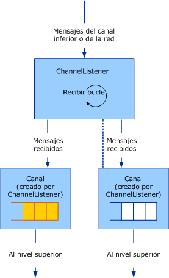

# <a name="service-channel-listeners-and-channels"></a>Servicio: Canales y escuchas de canales

Hay tres categorías de objetos de canal: canales, escuchas de canales y generadores de canales. Los canales son la interfaz entre la aplicación y la pila de canales. Las escuchas de canales son responsables de crear los canales en el lado de recepción (o escucha), normalmente en respuesta a un nuevo mensaje entrante o conexión. Los generadores de canales son responsables de crear los canales en el lado de envío para iniciar la comunicación con un punto de conexión.

## <a name="channel-listeners-and-channels"></a>Escuchas de canales y canales

Las escuchas de canales son responsables de crear los canales y recibir los mensajes del nivel inferior o de la red. Los mensajes recibidos se entregan al nivel superior utilizando un canal creado por la escucha de canales.

El diagrama siguiente muestra el proceso de recibir mensajes y entregarlos al nivel superior.



Una escucha de canales recibiendo mensajes y entregándolos al nivel superior a través de canales.

El proceso se puede modelar conceptualmente como una cola, aunque dentro de cada canal la implementación puede no utilizar una cola. La escucha de canales es responsable de recibir los mensajes del nivel inferior o de la red y colocarlos en la cola. El canal es responsable de recibir los mensajes de la cola y entregarlos al nivel superior cuando dicho nivel pide un mensaje, por ejemplo llamando a `Receive` en el canal.

WCF proporciona aplicaciones auxiliares de clase base para este proceso. (Para un diagrama de las clases auxiliares de canal descritas en este artículo, consulte [información general del modelo de canal](channel-model-overview.md).)

- El <xref:System.ServiceModel.Channels.CommunicationObject> la clase implementa <xref:System.ServiceModel.ICommunicationObject> y aplica la máquina de Estados que se describe en el paso 2 de [desarrollar canales](developing-channels.md).

- El <xref:System.ServiceModel.Channels.ChannelManagerBase> la clase implementa <xref:System.ServiceModel.Channels.CommunicationObject> y proporciona una clase base unificada para <xref:System.ServiceModel.Channels.ChannelFactoryBase> y <xref:System.ServiceModel.Channels.ChannelListenerBase>. La clase <xref:System.ServiceModel.Channels.ChannelManagerBase> trabaja junto con <xref:System.ServiceModel.Channels.ChannelBase>, que es una clase base que implementa <xref:System.ServiceModel.Channels.IChannel>.

- El <xref:System.ServiceModel.Channels.ChannelFactoryBase> la clase implementa <xref:System.ServiceModel.Channels.ChannelManagerBase> y <xref:System.ServiceModel.Channels.IChannelFactory> y consolida el `CreateChannel` sobrecargas en una `OnCreateChannel` método abstracto.

- El <xref:System.ServiceModel.Channels.ChannelListenerBase> la clase implementa <xref:System.ServiceModel.Channels.IChannelListener>. Se encarga de la administración de estados básica.

En la siguiente explicación se basa en el [transporte: UDP](../../../../docs/framework/wcf/samples/transport-udp.md) ejemplo.

## <a name="creating-a-channel-listener"></a>Creación de un agente de escucha del canal

El `UdpChannelListener` que implementa el ejemplo se deriva de la <xref:System.ServiceModel.Channels.ChannelListenerBase> clase. Utiliza un socket UDP único para recibir datagramas. El método `OnOpen` recibe datos utilizando el socket UDP en un bucle asincrónico. Los datos se convierten en mensajes utilizando el sistema de la codificación de mensajes:

```csharp
message = UdpConstants.MessageEncoder.ReadMessage(
  new ArraySegment<byte>(buffer, 0, count),
  bufferManager
);
```

Dado que el mismo canal del datagrama representa mensajes que llegan de varios orígenes, `UdpChannelListener` es un agente de escucha singleton. No hay en la mayoría uno activo <xref:System.ServiceModel.Channels.IChannel> asociado a este agente de escucha a la vez. El ejemplo solo genera otro si se elimina subsiguientemente un canal que es devuelto por el método <xref:System.ServiceModel.Channels.ChannelListenerBase%601.AcceptChannel%2A>. Cuando se recibe un mensaje, es puestos en cola en este canal singleton.

### <a name="udpinputchannel"></a>UdpInputChannel

El `UdpInputChannel` la clase implementa <xref:System.ServiceModel.Channels.IInputChannel>. Está compuesto de una cola de mensajes entrantes que es rellenada por el socket `UdpChannelListener`. Estos mensajes se quitan de la cola mediante el método <xref:System.ServiceModel.Channels.IInputChannel.Receive%2A>.
