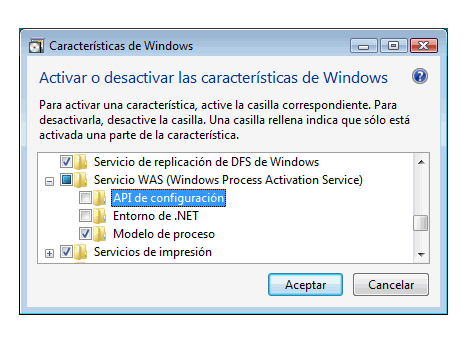
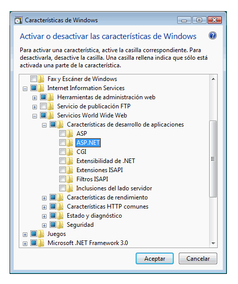
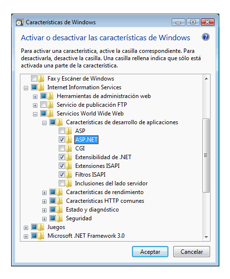
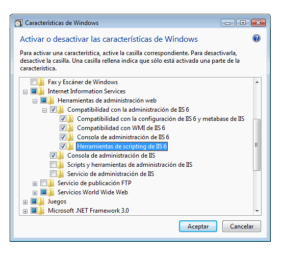

# <a name="configuring-internet-information-services-70-for-windows-communication-foundation"></a><span data-ttu-id="44e92-102">Configuración de Internet Information Services 7.0 para Windows Communication Foundation</span><span class="sxs-lookup"><span data-stu-id="44e92-102">Configuring Internet Information Services 7.0 for Windows Communication Foundation</span></span>

<span data-ttu-id="44e92-103">Internet Information Services (IIS) 7.0 tiene un diseño modular que le permite instalar de forma selectiva los componentes necesarios.</span><span class="sxs-lookup"><span data-stu-id="44e92-103">Internet Information Services (IIS) 7.0 has a modular design that allows you to selectively install components that are required.</span></span> <span data-ttu-id="44e92-104">Este diseño se basa en la nueva tecnología de componentes controlado por manifiestos introducida en Windows Vista.</span><span class="sxs-lookup"><span data-stu-id="44e92-104">This design is based on the new manifest-driven componentization technology introduced in Windows Vista.</span></span> <span data-ttu-id="44e92-105">Hay más de 40 componentes de características independientes de IIS 7,0 que se pueden instalar de forma independiente.</span><span class="sxs-lookup"><span data-stu-id="44e92-105">There are more than 40 standalone feature components of IIS 7.0 that can be installed independently.</span></span> <span data-ttu-id="44e92-106">Esto permite a los profesionales de TI personalizar la instalación con facilidad según sea necesario.</span><span class="sxs-lookup"><span data-stu-id="44e92-106">This allows IT professionals to easily customize the installation as required.</span></span> <span data-ttu-id="44e92-107">En este tema se describe cómo configurar IIS 7,0 para su uso con Windows Communication Foundation (WCF) y determinar qué componentes son necesarios.</span><span class="sxs-lookup"><span data-stu-id="44e92-107">This topic discusses how to configure IIS 7.0 for use with Windows Communication Foundation (WCF) and determine which components are required.</span></span>

## <a name="minimal-installation-installing-was"></a><span data-ttu-id="44e92-108">Instalación mínima: instalación de WAS</span><span class="sxs-lookup"><span data-stu-id="44e92-108">Minimal Installation: Installing WAS</span></span>

 <span data-ttu-id="44e92-109">La instalación mínima de todo el paquete de IIS 7,0 es instalar el servicio de activación de procesos de Windows (WAS).</span><span class="sxs-lookup"><span data-stu-id="44e92-109">The minimal installation of the whole IIS 7.0 package is to install the Windows Process Activation Service (WAS).</span></span> <span data-ttu-id="44e92-110">WAS es una característica independiente y es la única característica de IIS 7,0 que está disponible para todos los sistemas operativos Windows Vista (Home Basic, Home Premium, Business y Ultimate y Enterprise).</span><span class="sxs-lookup"><span data-stu-id="44e92-110">WAS is a standalone feature and it is the only feature from the IIS 7.0 that is available for all Windows Vista operating systems (Home Basic, Home Premium, Business, and Ultimate and Enterprise).</span></span>

 <span data-ttu-id="44e92-111">En el panel de control, haga clic en **programas** y, a continuación, haga clic en **activar o desactivar las características de Windows** , que aparece en **programas y características**, el componente was se muestra en la lista como se muestra en la siguiente ilustración.</span><span class="sxs-lookup"><span data-stu-id="44e92-111">From the Control Panel, click **Programs** and then click **Turn Windows features on or off** which is listed under **Programs and Features**, the WAS component is shown in the list as in the following illustration.</span></span>

 <span data-ttu-id="44e92-112"></span><span class="sxs-lookup"><span data-stu-id="44e92-112"></span></span>

 <span data-ttu-id="44e92-113">Esta característica tiene los siguientes componentes secundarios:</span><span class="sxs-lookup"><span data-stu-id="44e92-113">This feature has the following sub-components:</span></span>

- <span data-ttu-id="44e92-114">Entorno .NET</span><span class="sxs-lookup"><span data-stu-id="44e92-114">.NET Environment</span></span>

- <span data-ttu-id="44e92-115">API de configuración</span><span class="sxs-lookup"><span data-stu-id="44e92-115">Configuration APIs</span></span>

- <span data-ttu-id="44e92-116">Modelo de proceso</span><span class="sxs-lookup"><span data-stu-id="44e92-116">Process Model</span></span>

 <span data-ttu-id="44e92-117">Si selecciona el nodo raíz de WAS, solo se comprueba de forma predeterminada el subnodo del **modelo de proceso** .</span><span class="sxs-lookup"><span data-stu-id="44e92-117">If you select the root node of WAS, only the **Process Model** sub-node is checked by default.</span></span> <span data-ttu-id="44e92-118">Tenga en cuenta que con esta instalación solo está instalando WAS, porque no se ofrece ninguna compatibilidad para un servidor web.</span><span class="sxs-lookup"><span data-stu-id="44e92-118">Please note that with this installation you are only installing WAS, because there is no support for a Web server.</span></span>

 <span data-ttu-id="44e92-119">Para que WCF o cualquier aplicación de ASP.NET funcione, active la casilla **.net Environment** .</span><span class="sxs-lookup"><span data-stu-id="44e92-119">To make WCF or any ASP.NET application work, check the **.NET Environment** checkbox.</span></span> <span data-ttu-id="44e92-120">Esto significa que todos los componentes de WAS son necesarios para que WCF y ASP.NET funcionen correctamente.</span><span class="sxs-lookup"><span data-stu-id="44e92-120">This means that all of WAS components are required to make WCF and ASP.NET to work well.</span></span> <span data-ttu-id="44e92-121">Estos se comprueban automáticamente cuando instala cualquiera de esos componentes.</span><span class="sxs-lookup"><span data-stu-id="44e92-121">These are automatically checked once you install any of those components.</span></span>

## <a name="iis-70-default-installation"></a><span data-ttu-id="44e92-122">IIS 7.0: instalación predeterminada</span><span class="sxs-lookup"><span data-stu-id="44e92-122">IIS 7.0: Default Installation</span></span>

 <span data-ttu-id="44e92-123">Al comprobar la característica de **Internet Information Services** , algunos de los subnodos se comprueban automáticamente como se muestra en la siguiente ilustración.</span><span class="sxs-lookup"><span data-stu-id="44e92-123">By checking the **Internet Information Services** feature, some of the sub-nodes are automatically checked as shown in the following illustration.</span></span>

 <span data-ttu-id="44e92-124"></span><span class="sxs-lookup"><span data-stu-id="44e92-124"></span></span>

 <span data-ttu-id="44e92-125">Esta es la instalación predeterminada de IIS 7,0.</span><span class="sxs-lookup"><span data-stu-id="44e92-125">This is the default installation of IIS 7.0.</span></span> <span data-ttu-id="44e92-126">Con esta instalación, puede usar IIS 7,0 para atender contenido estático (como páginas HTML y otro contenido).</span><span class="sxs-lookup"><span data-stu-id="44e92-126">With this installation, you can use IIS 7.0 to service static content (such as HTML pages and other content).</span></span> <span data-ttu-id="44e92-127">Sin embargo, no se pueden ejecutar aplicaciones ASP.NET o CGI ni servicios WCF de host.</span><span class="sxs-lookup"><span data-stu-id="44e92-127">However, you cannot run ASP.NET or CGI applications or host WCF services.</span></span>

## <a name="iis-70-installation-with-aspnet-support"></a><span data-ttu-id="44e92-128">IIS 7.0: instalación con compatibilidad para ASP.NET</span><span class="sxs-lookup"><span data-stu-id="44e92-128">IIS 7.0: Installation with ASP.NET Support</span></span>

 <span data-ttu-id="44e92-129">Debe instalar ASP.NET para que ASP.NET funcione en IIS 7,0.</span><span class="sxs-lookup"><span data-stu-id="44e92-129">You must install ASP.NET to make ASP.NET work on IIS 7.0.</span></span> <span data-ttu-id="44e92-130">Después de comprobar **ASP.net**, la pantalla debe ser similar a la siguiente ilustración.</span><span class="sxs-lookup"><span data-stu-id="44e92-130">After checking **ASP.NET**, your screen should look like the following illustration.</span></span>

 <span data-ttu-id="44e92-131"></span><span class="sxs-lookup"><span data-stu-id="44e92-131"></span></span>

 <span data-ttu-id="44e92-132">Este es el entorno mínimo para que las aplicaciones WCF y ASP.NET funcionen en IIS 7,0.</span><span class="sxs-lookup"><span data-stu-id="44e92-132">This is the minimal environment for both WCF and ASP.NET applications to work in IIS 7.0.</span></span>

## <a name="iis-70-installation-with-iis-60-compatibility-components"></a><span data-ttu-id="44e92-133">IIS 7.0: instalación con componentes de compatibilidad de IIS 6.0</span><span class="sxs-lookup"><span data-stu-id="44e92-133">IIS 7.0: Installation with IIS 6.0 Compatibility Components</span></span>

 <span data-ttu-id="44e92-134">Al instalar IIS 7,0 en un sistema con Visual Studio 2005 o en otros scripts o herramientas de automatización (como Adsutil.vbs) que configuren aplicaciones virtuales que usen la API de metabase de IIS 6,0, asegúrese de comprobar las **herramientas de scripting** de IIS 6,0.</span><span class="sxs-lookup"><span data-stu-id="44e92-134">When installing IIS 7.0 on a system with Visual Studio 2005 or some other automation scripts or tools (such as Adsutil.vbs) that configure virtual applications that use IIS 6.0 Metabase API, ensure that you check the IIS 6.0 **Scripting Tools**.</span></span> <span data-ttu-id="44e92-135">Esto comprueba automáticamente los otros subnodos de compatibilidad con la **Administración** de IIS 6,0.</span><span class="sxs-lookup"><span data-stu-id="44e92-135">This automatically checks the other sub-nodes of IIS 6.0 **Management Compatibility**.</span></span> <span data-ttu-id="44e92-136">En la ilustración siguiente se muestra la pantalla una vez hecho esto:</span><span class="sxs-lookup"><span data-stu-id="44e92-136">The following illustration shows the screen after this is done:</span></span>

 <span data-ttu-id="44e92-137"></span><span class="sxs-lookup"><span data-stu-id="44e92-137"></span></span>

 <span data-ttu-id="44e92-138">Con esta instalación, tiene todo lo necesario para usar las características de IIS 7,0, ASP.NET y WCF y ejemplos disponibles en la Web.</span><span class="sxs-lookup"><span data-stu-id="44e92-138">With this installation, you have everything required to use IIS 7.0, ASP.NET and WCF features and samples available on the Web.</span></span>

## <a name="request-limits"></a><span data-ttu-id="44e92-139">Límites de la solicitud</span><span class="sxs-lookup"><span data-stu-id="44e92-139">Request Limits</span></span>

 <span data-ttu-id="44e92-140">En Windows Vista con IIS 7, se ha cambiado el valor predeterminado de la `maxUri` configuración de y `maxQueryStringSize` .</span><span class="sxs-lookup"><span data-stu-id="44e92-140">On Windows Vista with IIS 7 the default value of the `maxUri` and `maxQueryStringSize` settings have been changed.</span></span> <span data-ttu-id="44e92-141">De manera predeterminada, la solicitud de filtrado en IIS 7.0 admite una longitud de dirección URL de 4096 caracteres y una longitud de cadena de consulta de 2048 caracteres.</span><span class="sxs-lookup"><span data-stu-id="44e92-141">By default, request filtering in IIS 7.0 allows a URL length of 4096 characters and a query string length of 2048 characters.</span></span> <span data-ttu-id="44e92-142">Para cambiar estos valores predeterminados, agregue el siguiente XML al archivo App.config:</span><span class="sxs-lookup"><span data-stu-id="44e92-142">To change these defaults add the following XML to your App.config file.</span></span>

```xml
 <system.webServer>
    <security>
        <requestFiltering>
            <requestLimits maxUrl="8192" maxQueryString="8192" />
        </requestFiltering>
    </security>
 </system.webServer>
 ```

## <a name="see-also"></a><span data-ttu-id="44e92-143">Vea también</span><span class="sxs-lookup"><span data-stu-id="44e92-143">See also</span></span>

- [<span data-ttu-id="44e92-144">Arquitectura de activación de WAS</span><span class="sxs-lookup"><span data-stu-id="44e92-144">WAS Activation Architecture</span></span>](was-activation-architecture.md)
- [<span data-ttu-id="44e92-145">Configuración de WAS para su uso con WCF</span><span class="sxs-lookup"><span data-stu-id="44e92-145">Configuring WAS for Use with WCF</span></span>](configuring-the-wpa--service-for-use-with-wcf.md)
- [<span data-ttu-id="44e92-146">Procedimiento para instalar y configurar los componentes de activación de WFC</span><span class="sxs-lookup"><span data-stu-id="44e92-146">How to: Install and Configure WCF Activation Components</span></span>](how-to-install-and-configure-wcf-activation-components.md)
- <span data-ttu-id="44e92-147">[Características de hospedaje de Windows Server AppFabric](/previous-versions/appfabric/ee677189(v=azure.10))</span><span class="sxs-lookup"><span data-stu-id="44e92-147">[Windows Server App Fabric Hosting Features](/previous-versions/appfabric/ee677189(v=azure.10))</span></span>
