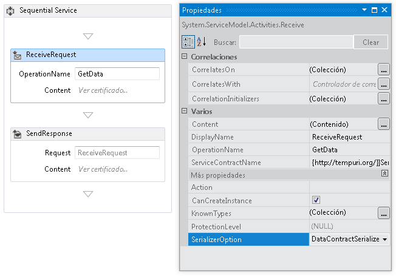
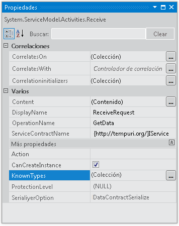
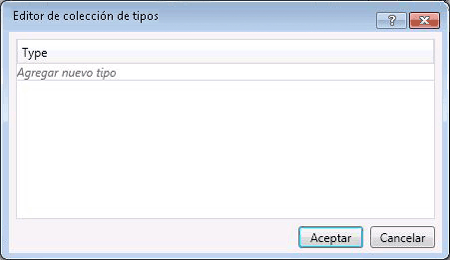

# <a name="configuring-serialization-in-a-workflow-service"></a><span data-ttu-id="10c4c-102">Configurar la serialización en un servicio de flujo de trabajo</span><span class="sxs-lookup"><span data-stu-id="10c4c-102">Configuring Serialization in a Workflow Service</span></span>
<span data-ttu-id="10c4c-103">Los servicios de flujo de trabajo son servicios de [!INCLUDE[indigo1](../../../../includes/indigo1-md.md)] y, por tanto, tienen la opción de usar la clase <xref:System.Runtime.Serialization.DataContractSerializer> (el valor predeterminado) o la clase <xref:System.Xml.Serialization.XmlSerializer>.</span><span class="sxs-lookup"><span data-stu-id="10c4c-103">Workflow services are [!INCLUDE[indigo1](../../../../includes/indigo1-md.md)] services and so have the option of using either the <xref:System.Runtime.Serialization.DataContractSerializer> (the default) or the <xref:System.Xml.Serialization.XmlSerializer>.</span></span> <span data-ttu-id="10c4c-104">Cuando se escriben servicios que no son de flujo de trabajo, el tipo de serializados que se va a usar se especifica en el servicio o en el contrato de operación.</span><span class="sxs-lookup"><span data-stu-id="10c4c-104">When writing non-workflow services the type of serializer to use is specified on the service or operation contract.</span></span> <span data-ttu-id="10c4c-105">Cuando se crean servicios de flujo de trabajo de [!INCLUDE[indigo2](../../../../includes/indigo2-md.md)], no se especifican estos contratos en código, sino que se generan en tiempo de ejecución por inferencia de contrato.</span><span class="sxs-lookup"><span data-stu-id="10c4c-105">When creating [!INCLUDE[indigo2](../../../../includes/indigo2-md.md)] workflow services you don’t specify these contracts in code, but rather they are generated at runtime by contract inference.</span></span> [!INCLUDE[crabout](../../../../includes/crabout-md.md)]<span data-ttu-id="10c4c-106">inferencia de contrato, vea [usar contratos en el flujo de trabajo](../../../../docs/framework/wcf/feature-details/using-contracts-in-workflow.md).</span><span class="sxs-lookup"><span data-stu-id="10c4c-106"> contract inference, see  [Using Contracts in Workflow](../../../../docs/framework/wcf/feature-details/using-contracts-in-workflow.md).</span></span>  <span data-ttu-id="10c4c-107">El serializador se especifica con la propiedad <xref:System.ServiceModel.Activities.Receive.SerializerOption%2A>,</span><span class="sxs-lookup"><span data-stu-id="10c4c-107">The serializer is specified using the <xref:System.ServiceModel.Activities.Receive.SerializerOption%2A> property.</span></span> <span data-ttu-id="10c4c-108">que se puede enviar en el diseñador como se muestra en la siguiente ilustración.</span><span class="sxs-lookup"><span data-stu-id="10c4c-108">This can be set in the designer as shown in the following illustration.</span></span>  
  
 <span data-ttu-id="10c4c-109"></span><span class="sxs-lookup"><span data-stu-id="10c4c-109"></span></span>  
  
 <span data-ttu-id="10c4c-110">El serializador también se puede establecer en código como se muestra en el siguiente ejemplo.</span><span class="sxs-lookup"><span data-stu-id="10c4c-110">The serializer can also be set in code as shown in the following example,</span></span>  
  
```  
Receive approveExpense = new Receive  
            {  
                OperationName = "ApproveExpense",  
                CanCreateInstance = true,  
                ServiceContractName = "FinanceService",  
                SerializerOption = SerializerOption.DataContractSerializer,  
                Content = ReceiveContent.Create(new OutArgument<Expense>(expense))  
            };  
```  
  
 <span data-ttu-id="10c4c-111">Asimismo, los tipos conocidos se pueden especificar en servicios de flujo de trabajo.</span><span class="sxs-lookup"><span data-stu-id="10c4c-111">Known types can be specified on Workflow services as well.</span></span> [!INCLUDE[crabout](../../../../includes/crabout-md.md)]<span data-ttu-id="10c4c-112">Conoce los tipos, vea [tipos conocidos de contrato de datos](../../../../docs/framework/wcf/feature-details/data-contract-known-types.md).</span><span class="sxs-lookup"><span data-stu-id="10c4c-112"> Known Types see [Data Contract Known Types](../../../../docs/framework/wcf/feature-details/data-contract-known-types.md).</span></span> <span data-ttu-id="10c4c-113">Los tipos conocidos se pueden especificar en el diseñador o en código.</span><span class="sxs-lookup"><span data-stu-id="10c4c-113">Known types can be specified in the designer or in code.</span></span> <span data-ttu-id="10c4c-114">Para especificar tipos conocidos en el diseñador, haga clic en el botón de puntos suspensivos situado junto a la ventana Propiedades de una actividad <xref:System.ServiceModel.Activities.Receive> como se muestra en la siguiente ilustración.</span><span class="sxs-lookup"><span data-stu-id="10c4c-114">To specify known types in the designer, click the ellipsis button next to the KnownTypes property in the properties window for a <xref:System.ServiceModel.Activities.Receive> activity as shown in the following illustration.</span></span>  
  
 <span data-ttu-id="10c4c-115"></span><span class="sxs-lookup"><span data-stu-id="10c4c-115"></span></span>  
  
 <span data-ttu-id="10c4c-116">De esta forma, se muestra el Editor de colección de tipos que le permitirá buscar y especificar tipos conocidos.</span><span class="sxs-lookup"><span data-stu-id="10c4c-116">This will display the Type Collections Editor that will allow you to search for and specify known types.</span></span>  
  
 <span data-ttu-id="10c4c-117"></span><span class="sxs-lookup"><span data-stu-id="10c4c-117"></span></span>  
  
 <span data-ttu-id="10c4c-118">Haga clic en el **Agregar nuevo tipo** vínculo y use la lista desplegable para seleccionar o buscar un tipo para agregar a la colección de tipos conocidos.</span><span class="sxs-lookup"><span data-stu-id="10c4c-118">Click the **Add new type** link and use the drop down to select or search for a type to add to the known types collection.</span></span> <span data-ttu-id="10c4c-119">Para especificar los tipos conocidos en código use la propiedad <xref:System.ServiceModel.Activities.Receive.KnownTypes%2A> como se muestra en el siguiente ejemplo.</span><span class="sxs-lookup"><span data-stu-id="10c4c-119">To specify known types in code use the <xref:System.ServiceModel.Activities.Receive.KnownTypes%2A> property as shown in the following example.</span></span>  
  
```  
Receive approveExpense = new Receive  
            {  
                OperationName = "ApproveExpense",  
                CanCreateInstance = true,  
                ServiceContractName = "FinanceService",  
                SerializerOption = SerializerOption.DataContractSerializer,  
                Content = ReceiveContent.Create(new OutArgument<Expense>(expense))  
            };  
            approveExpense.KnownTypes.Add(typeof(Travel));  
            approveExpense.KnownTypes.Add(typeof(Meal));  
```  
  
 <span data-ttu-id="10c4c-120">Para ver un ejemplo de código completo que muestra cómo configurar la serialización de un servicio de flujo de trabajo detecta [dar formato a mensajes en los servicios de flujo de trabajo](../../../../docs/framework/windows-workflow-foundation/samples/formatting-messages-in-workflow-services.md).</span><span class="sxs-lookup"><span data-stu-id="10c4c-120">To see a complete code example showing how to configure serialization for a workflow service see [Formatting messages in Workflow Services](../../../../docs/framework/windows-workflow-foundation/samples/formatting-messages-in-workflow-services.md).</span></span>
