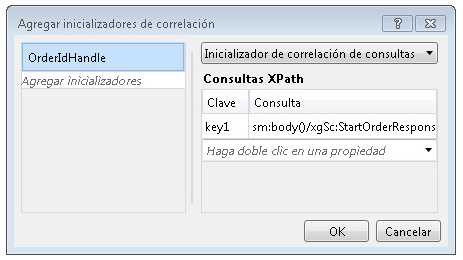

# Correlación basada en contenido
Cuando los servicios de flujo de trabajo se comunican con clientes y otros servicios, suele haber ciertos datos en los mensajes intercambiados que relacionan de forma única un mensaje con una instancia determinada. La correlación basada en contenidos usa estos datos en el mensaje, como un número de cliente o un identificador de orden, para enrutar los mensajes a la instancia de flujo de trabajo apropiada. En este tema, se explica cómo utilizar la correlación basada en contenidos en flujos de trabajo.  
  
## Utilizar la correlación basada en contenidos  
 Se utiliza la correlación basada en contenidos cuando un servicio de flujo de trabajo tiene varios métodos a los que se accede mediante un cliente único y una parte de los datos de los mensajes intercambiados identifica la instancia deseada.  
  
> [!NOTE]
>  La correlación basada en contenidos es útil cuando no se puede usar la correlación del contexto porque el enlace no es ninguno de los enlaces de intercambio de contexto compatibles. Para obtener más información acerca de la correlación del contexto, vea [intercambio de contexto](../../../../docs/framework/wcf/feature-details/context-exchange-correlation.md).  
  
 Cada actividad de mensajería utilizada en estas comunicaciones debe especificar la ubicación de los datos del mensaje que identifican de forma única la instancia. Esto se hace proporcionando <xref:System.ServiceModel.MessageQuerySet>, utilizando <xref:System.ServiceModel.Activities.QueryCorrelationInitializer> o <xref:System.ServiceModel.Activities.Receive.CorrelatesOn%2A>, de manera que se envía una consulta al mensaje sobre la parte o las partes de los datos que identifican de forma única la instancia.  
  
> [!WARNING]
>  A los datos que se utilizan para identificar la instancia se les aplica un algoritmo hash en una clave de correlación. Preste atención para asegurarse de que los datos utilizados para la correlación son únicos; de otro modo, podrían producirse colisiones en la clave a la que se ha aplicado un algoritmo hash y hacer que los mensajes se envíen a un destino incorrecto. Por ejemplo, una correlación basada solamente en un nombre de cliente puede producir una colisión porque puede haber múltiples clientes con el mismo nombre. Los dos puntos (`:`) no se deberían utilizar como parte de los datos empleados para la correlación del mensaje, porque ya se utilizan para delimitar el valor y la clave de la consulta del mensaje para formar la cadena a la que, posteriormente, se aplica un algoritmo hash.  
  
 En el ejemplo siguiente, la inicial <xref:System.ServiceModel.Activities.Receive> / <xref:System.ServiceModel.Activities.SendReply> en un servicio de flujo de trabajo devuelve un `OrderId`, que, a continuación, se pasa por el cliente en la llamada al siguiente <xref:System.ServiceModel.Activities.Receive> actividad en el servicio de flujo de trabajo.  
  
 [!code-csharp[CFX_ContentCorrelation#1](../../../../samples/snippets/csharp/VS_Snippets_CFX/cfx_contentcorrelation/cs/program.cs#1)]  
  
 En el ejemplo anterior, se muestra una correlación basada en contenidos que se inicializada mediante <xref:System.ServiceModel.Activities.SendReply>. <xref:System.ServiceModel.MessageQuerySet> especifica que los datos utilizados para identificar los mensajes subsiguientes de este servicio son `OrderId`.  
  
 [!code-csharp[CFX_ContentCorrelation#2](../../../../samples/snippets/csharp/VS_Snippets_CFX/cfx_contentcorrelation/cs/program.cs#2)]  
  
 La actividad <xref:System.ServiceModel.Activities.Receive> que sigue a <xref:System.ServiceModel.Activities.SendReply> en el flujo de trabajo continúa la correlación inicializada por <xref:System.ServiceModel.Activities.SendReply>. Ambas actividades comparten la misma clase <xref:System.ServiceModel.Activities.CorrelationHandle>, pero cada una tiene su propia <xref:System.ServiceModel.MessageQuerySet> y <xref:System.ServiceModel.XPathMessageQuery> que especifica dónde están los datos de identificación de ese mensaje en particular. En la actividad que inicializa la correlación, <xref:System.ServiceModel.MessageQuerySet> se especifica en la propiedad <xref:System.ServiceModel.Activities.Receive.CorrelationInitializers%2A> y, para cualquier actividad <xref:System.ServiceModel.Activities.Receive> siguiente, se especifica utilizando la propiedad <xref:System.ServiceModel.Activities.Receive.CorrelatesOn%2A>.  
  
 [!code-csharp[CFX_ContentCorrelation#3](../../../../samples/snippets/csharp/VS_Snippets_CFX/cfx_contentcorrelation/cs/program.cs#3)]  
  
 Cualquier actividad de mensajería (<xref:System.ServiceModel.Activities.Send>, <xref:System.ServiceModel.Activities.Receive>, <xref:System.ServiceModel.Activities.SendReply>, <xref:System.ServiceModel.Activities.ReceiveReply>) puede inicializar una correlación basada en contenidos cuando los datos se transmiten como parte de un mensaje. Si la parte determinada de los datos no se transmite como parte de un mensaje, entonces se puede inicializar explícitamente utilizando la actividad <xref:System.ServiceModel.Activities.InitializeCorrelation>. Si es necesario que múltiples partes de los datos identifiquen el mensaje de forma única, entonces pueden agregarse múltiples consultas a <xref:System.ServiceModel.MessageQuerySet>. En estos ejemplos, <xref:System.ServiceModel.Activities.CorrelationHandle> se proporcionó explícitamente a cada una de las actividades utilizando las propiedades `CorrelatesWith` o `CorrelationHandle`, pero si solo hay una correlación requerida para el flujo de trabajo completo, como en este ejemplo, donde todo se correlaciona en `OrderId`, la administración de identificación de correlación implícita proporcionada por <xref:System.ServiceModel.Activities.WorkflowServiceHost> es suficiente.  
  
## Usar la actividad InitializeCorrelation  
 En el ejemplo anterior, `OrderId` se transmitió al autor de la llamada a través de la actividad <xref:System.ServiceModel.Activities.SendReply>, y ahí es donde se inicializó la correlación. E mismo comportamiento se puede lograr utilizando la actividad <xref:System.ServiceModel.Activities.InitializeCorrelation>. La actividad <xref:System.ServiceModel.Activities.InitializeCorrelation> toma <xref:System.ServiceModel.Activities.CorrelationHandle> y un diccionario de elementos que representan los datos utilizados para asignar el mensaje a la instancia correcta. Para utilizar la actividad <xref:System.ServiceModel.Activities.InitializeCorrelation> en el ejemplo anterior, quite <xref:System.ServiceModel.Activities.SendReply.CorrelationInitializers%2A> de la actividad <xref:System.ServiceModel.Activities.SendReply> e inicialice la correlación mediante la actividad <xref:System.ServiceModel.Activities.InitializeCorrelation>.  
  
 [!code-csharp[CFX_ContentCorrelation#4](../../../../samples/snippets/csharp/VS_Snippets_CFX/cfx_contentcorrelation/cs/program.cs#4)]  
  
 A continuación, la actividad <xref:System.ServiceModel.Activities.InitializeCorrelation> se utiliza en el flujo de trabajo, una vez rellenadas las variables que contienen los datos, pero antes de la actividad <xref:System.ServiceModel.Activities.Receive> que se correlaciona con la clase <xref:System.ServiceModel.Activities.CorrelationHandle> inicializada.  
  
 [!code-csharp[CFX_ContentCorrelation#5](../../../../samples/snippets/csharp/VS_Snippets_CFX/cfx_contentcorrelation/cs/program.cs#5)]  
  
## Configurar consultas de XPath utilizando el Diseñador de flujo de trabajo  
 En los ejemplos anteriores, las actividades y las consultas XPath utilizadas en las consultas del mensaje se especificaron en código. El Diseñador de flujo de trabajo en [!INCLUDE[vs_current_long](../../../../includes/vs-current-long-md.md)] también proporciona la capacidad de generar XPaths de los tipos `DataContract` para la correlación basada en contenidos. El primer XPath configurado en el ejemplo anterior se configuró para <xref:System.ServiceModel.Activities.SendReply>.  
  
 [!code-csharp[CFX_ContentCorrelation#2](../../../../samples/snippets/csharp/VS_Snippets_CFX/cfx_contentcorrelation/cs/program.cs#2)]  
  
 Para configurar el XPath para una actividad de mensajería en el Diseñador de flujo de trabajo, seleccione la actividad en el Diseñador de flujo de trabajo. Si la actividad está inicializando la correlación, como se muestra en el ejemplo anterior, haga clic en el botón de puntos suspensivos para la **CorrelationInitializers** propiedad en el **propiedades** ventana. Esto muestra la **agregar inicializadores de correlación** cuadro de diálogo. En este cuadro de diálogo, puede especificar el tipo de correlación y seleccionar el contenido que se usará para ella. El <xref:System.ServiceModel.Activities.CorrelationHandle> variable se especifica en el **agregar inicializador** cuadro y el tipo de correlación y datos utilizados para la correlación se seleccionan en el **consultas XPath** sección del cuadro de diálogo.  
  
   
  
 La segunda consulta XPath del ejemplo anterior se configuró en la actividad <xref:System.ServiceModel.Activities.Receive>.  
  
 [!code-csharp[CFX_ContentCorrelation#3](../../../../samples/snippets/csharp/VS_Snippets_CFX/cfx_contentcorrelation/cs/program.cs#3)]  
  
 Para configurar la consulta XPath para una actividad de mensajería que no inicializa la correlación, seleccione la actividad en el Diseñador de flujo de trabajo y, a continuación, haga clic en el botón de puntos suspensivos para la **CorrelatesOn** propiedad en el  **Propiedades** ventana. Esto muestra la **definición de CorrelatesOn** cuadro de diálogo.  
  
   
  
 En este cuadro de diálogo, puede especificar el <xref:System.ServiceModel.Activities.CorrelationHandle> y seleccionar elementos en el **consultas XPath** lista para compilar la consulta XPath.
