# <a name="creating-a-long-running-workflow-service"></a>Crear un servicio de flujo de trabajo de larga ejecución
En este tema se describe cómo crear un servicio de flujo de trabajo de larga ejecución. Los servicios de flujo de trabajo de larga ejecución se pueden ejecutar durante períodos de tiempo prolongados. En algún momento, el flujo de trabajo se puede inactivar a la espera de recibir información adicional. En este caso, el flujo de trabajo se conserva en una base de datos SQL y se quita de la memoria. Cuando esté disponible la información adicional, la instancia de flujo de trabajo se vuelve a cargar en la memoria y continua ejecutándose.  En este escenario, el usuario implementa un sistema de pedidos muy simplificado.  El cliente envía un mensaje inicial al servicio de flujo de trabajo para que inicie el pedido. Devuelve un identificador de pedido al cliente. En este momento el servicio de flujo de trabajo espera otro mensaje del cliente y pasa al estado inactivo, y se conserva en una base de datos SQL Server.  Cuando el cliente envía el siguiente mensaje para pedir un elemento, el servicio de flujo de trabajo se vuelve a cargar en memoria y finaliza el procesamiento del pedido. En el ejemplo de código devuelve una cadena que indica que el elemento se ha agregado al pedido. No se pretende que el ejemplo de código sea una aplicación real de la tecnología, sino más bien un ejemplo sencillo que ilustre servicios de flujo de trabajo de ejecución prolongada. En este tema se presupone que sabe cómo crear proyectos y soluciones de [!INCLUDE[vs_current_long](../../../../includes/vs-current-long-md.md)].  
  
## <a name="prerequisites"></a>Requisitos previos  
 Debe tener instalado el siguiente software para usar este tutorial:  
  
1.  Microsoft SQL Server 2008  
  
2.  [!INCLUDE[vs_current_long](../../../../includes/vs-current-long-md.md)]  
  
3.  Microsoft [!INCLUDE[netfx_current_long](../../../../includes/netfx-current-long-md.md)]  
  
4.  Estar familiarizado con WCF, así como con [!INCLUDE[vs_current_long](../../../../includes/vs-current-long-md.md)] y saber crear proyectos y soluciones.  
  
### <a name="to-setup-the-sql-database"></a>Para configurar la base de datos SQL  
  
1.  Para conservar las instancias del servicio de flujo de trabajo debe tener instalado Microsoft SQL Server y configurar una base de datos con el fin de almacenar las instancias de flujo de trabajo persistentes. Ejecute Microsoft SQL Management Studio, haga clic en el **iniciar** botón Seleccionar **todos los programas**, **Microsoft SQL Server 2008**, y **Microsoft SQL Management Studio**.  
  
2.  Haga clic en el **conectar** botón Iniciar sesión en la instancia de SQL Server  
  
3.  Haga clic en **bases de datos** en la vista de árbol y seleccione **nueva base de datos...** Para crear una nueva base de datos denominada `SQLPersistenceStore`.  
  
4.  Ejecute el archivo de script SqlWorkflowInstanceStoreSchema.sql ubicado en el directorio C:\Windows\Microsoft.NET\Framework\v4.0\SQL\es en la base de datos SQLPersistenceStore para configurar los esquemas de base de datos necesarios.  
  
5.  Ejecute el archivo de script SqlWorkflowInstanceStoreLogic.sql ubicado en el directorio C:\Windows\Microsoft.NET\Framework\v4.0\SQL\es en la base de datos SQLPersistenceStore para configurar la lógica de base de datos necesaria.  
  
### <a name="to-create-the-web-hosted-workflow-service"></a>Para crear el servicio de flujo de trabajo hospedado en web  
  
1.  Cree una solución de [!INCLUDE[vs_current_long](../../../../includes/vs-current-long-md.md)] vacía y asígnele el nombre `OrderProcessing`.  
  
2.  Agregue un nuevo proyecto de aplicación de servicio de flujo de trabajo de [!INCLUDE[indigo2](../../../../includes/indigo2-md.md)] denominado `OrderService` a la solución.  
  
3.  En el cuadro de diálogo de propiedades de proyecto, seleccione la **Web** ficha.  
  
    1.  En **acción de inicio** seleccione **página específica** y especifique `Service1.xamlx`.  
  
         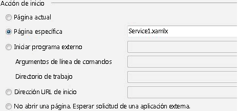  
  
    2.  En **servidores** seleccione **servidor Web de IIS Local utilice**.  
  
         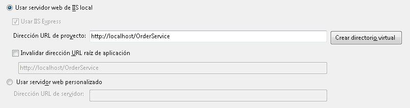  
  
        > [!WARNING]
        >  Debe ejecutar [!INCLUDE[vs_current_long](../../../../includes/vs-current-long-md.md)] en el modo de administrador para llevar a cabo esta configuración.  
  
         Estos dos pasos configuran el proyecto de servicio de flujo de trabajo que IIS va a hospedar.  
  
4.  Abra `Service1.xamlx` si está abierto aún no y eliminar las existentes **ReceiveRequest** y **SendResponse** actividades.  
  
5.  Seleccione el **servicio secuencial** actividad y haga clic en el **Variables** vincular y agregue las variables que se muestra en la siguiente ilustración. De esta forma, se agregan algunas variables que se usarán posteriormente en el servicio de flujo de trabajo.  
  
    > [!NOTE]
    >  Si CorrelationHandle no está en la lista desplegable Tipo de Variable, seleccione **buscar tipos** en la lista desplegable. Escriba CorrelationHandle en el **nombre de tipo** , seleccione CorrelationHandle en el cuadro de lista y haga clic en **Aceptar**.  
  
     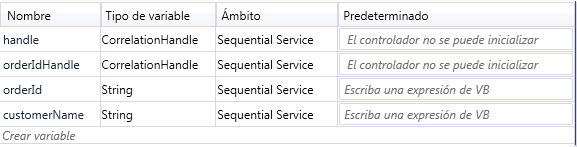  
  
6.  Arrastre y coloque una **ReceiveAndSendReply** plantilla de actividad en el **servicio secuencial** actividad. Este conjunto de actividades recibirá un mensaje de un cliente y devolverá un respuesta.  
  
    1.  Seleccione el **recepción** actividad y establezca las propiedades resaltadas en la siguiente ilustración.  
  
         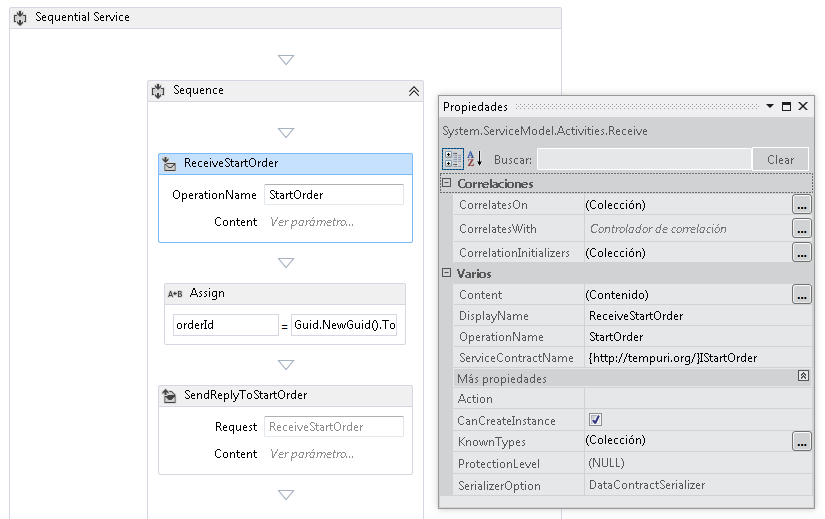  
  
         La propiedad DisplayName establece el nombre mostrado para la actividad Receive en el diseñador. Las propiedades ServiceContractName y OperationName especifican el nombre del contrato de servicio y la operación que implementa la actividad Receive. [!INCLUDE[crabout](../../../../includes/crabout-md.md)]¿cómo se usan los contratos en flujo de trabajo de servicios vea [usar contratos en el flujo de trabajo](../../../../docs/framework/wcf/feature-details/using-contracts-in-workflow.md).  
  
    2.  Haga clic en el **definir...**  vincular en el **ReceiveStartOrder** actividad y establezca las propiedades que se muestra en la siguiente ilustración.  Tenga en cuenta que la **parámetros** botón de radio está seleccionado, un parámetro denominado `p_customerName` está enlazado a la `customerName` variable. Esto configura la **recepción** actividad para recibir algunos datos y enlazarlos a variables locales.  
  
         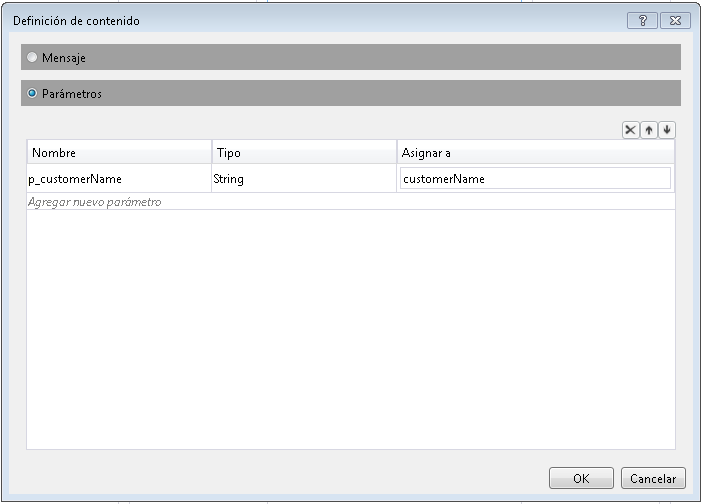  
  
    3.  Seleccione el **SendReplyToReceive** actividad y establezca la propiedad resaltada se muestra en la siguiente ilustración.  
  
         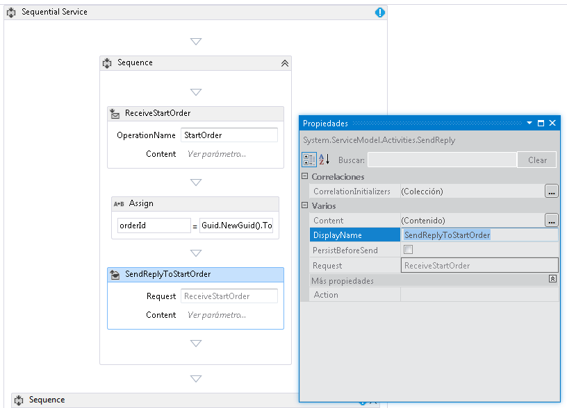  
  
    4.  Haga clic en el **definir...**  vincular en el **SendReplyToStartOrder** actividad y establezca las propiedades que se muestra en la siguiente ilustración. Tenga en cuenta que la **parámetros** botón de radio está seleccionado; un parámetro denominado `p_orderId` está enlazado a la `orderId` variable. Esta configuración especifica que la actividad SendReplyToStartOrder ejecutará un valor de tipo de cadena en el autor de la llamada.  
  
         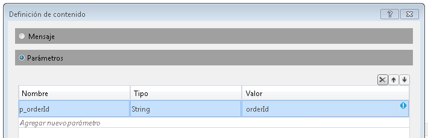  
  
    5.  Arrastre y coloque una actividad de asignación entre la **recepción** y **SendReply** actividades y establezca las propiedades tal como se muestra en la siguiente ilustración:  
  
         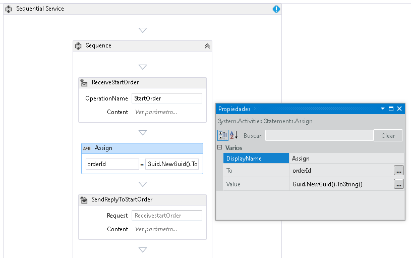  
  
         De esta forma, se crea un identificador de nuevo pedido y se coloca el valor en la variable orderId.  
  
    6.  Seleccione el **ReplyToStartOrder** actividad. En la ventana Propiedades, haga clic en el botón de puntos suspensivos para **CorrelationInitializers**. Seleccione el **agregar inicializador** vincular, escriba `orderIdHandle` en el cuadro de texto inicializador, seleccione el inicializador de correlación de consultas para el tipo de correlación y seleccione p_orderId en el cuadro desplegable consultas XPATH. Esta configuración se muestra en la siguiente ilustración. Haga clic en **Aceptar**.  De esta forma, se inicializa una correlación entre el cliente y esta instancia del servicio de flujo de trabajo. Cuando se reciba un mensaje con este identificador de pedido, se enruta a esta instancia del servicio de flujo de trabajo.  
  
         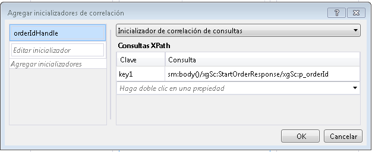  
  
7.  Arrastre y coloque otra **ReceiveAndSendReply** actividad al final del flujo de trabajo (fuera de la **secuencia** que contiene las primeras **recepción** y  **SendReply** actividades). De esta forma, se recibirá el segundo mensaje enviado por el cliente y se responderá al mismo.  
  
    1.  Seleccione el **secuencia** que contiene el recién agregado **recepción** y **SendReply** actividades y haga clic en el **Variables** botón. Agregue la variable resaltada en la siguiente ilustración:  
  
         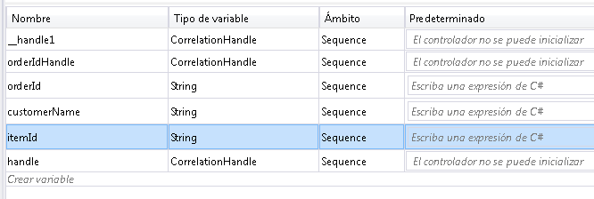  
  
    2.  Seleccione el **recepción** actividad y establezca las propiedades que se muestra en la siguiente ilustración:  
  
         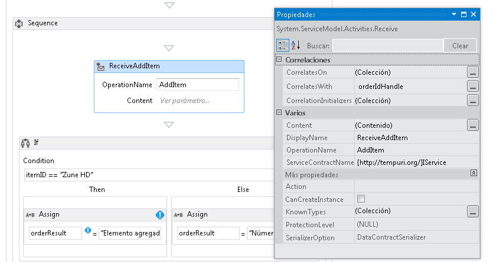  
  
    3.  Haga clic en el **definir...**  vincular en el **ReceiveAddItem** actividad y agregar los parámetros mostrados en la siguiente ilustración: Esto configura la actividad de recepción para Aceptar dos parámetros: el identificador de pedido y el identificador del elemento que se ordenan.  
  
         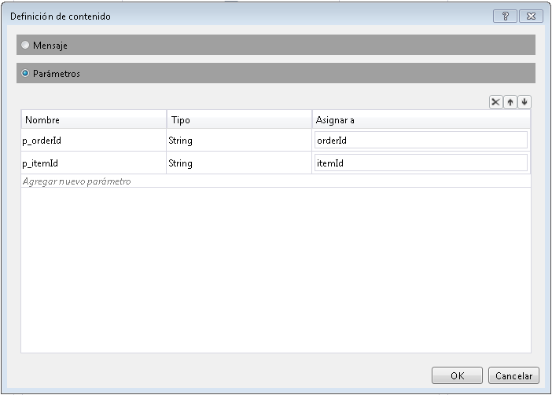  
  
    4.  Haga clic en el **CorrelateOn** puntos suspensivos situado y escriba `orderIdHandle`. En **consultas XPath**, haga clic en la flecha desplegable y seleccione `p_orderId`. De esta forma, se configura la correlación de la segunda actividad de recepción. [!INCLUDE[crabout](../../../../includes/crabout-md.md)]correlación, vea [correlación](../../../../docs/framework/wcf/feature-details/correlation.md).  
  
         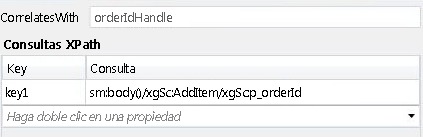  
  
    5.  Arrastre y coloque una **si** actividad inmediatamente después de la **ReceiveAddItem** actividad. Esta actividad actúa como instrucción If.  
  
        1.  Establecer el **condición** propiedad`itemId=="Zune HD" (itemId="Zune HD" for Visual Basic)`  
  
        2.  Arrastre y coloque una **asignar** actividad en el **, a continuación,** sección y otra en el **Else** sección establece las propiedades de la **asignar** actividades, como se muestra en la siguiente ilustración.  
  
             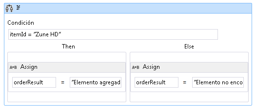  
  
             Si la condición es `true` el **, a continuación,** sección que se va a ejecutar. Si la condición es `false` el **Else** se ejecuta la sección.  
  
        3.  Seleccione el **SendReplyToReceive** actividad y establezca el **DisplayName** propiedad que se muestra en la siguiente ilustración.  
  
             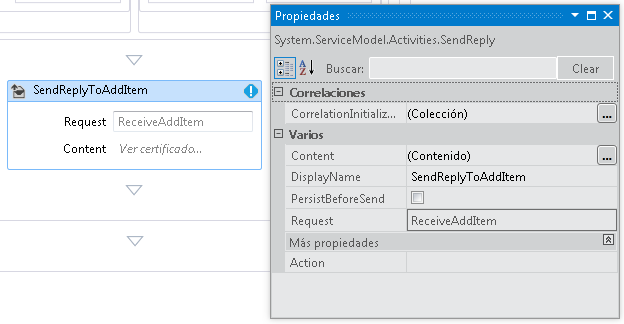  
  
        4.  Haga clic en el **definir...**  vincular en el **SetReplyToAddItem** actividad y configúrelo como se muestra en la siguiente ilustración. Esto configura la **SendReplyToAddItem** actividad para devolver el valor de la `orderResult` variable.  
  
             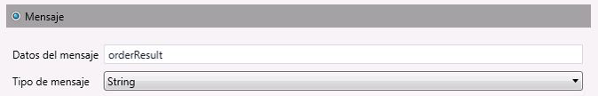  
  
8.  Abra el archivo web.config y agregue los siguientes elementos en la \<comportamiento > sección para habilitar la persistencia de flujo de trabajo.  
  
    ```xml  
    <sqlWorkflowInstanceStore connectionString="Data Source=your-machine\SQLExpress;Initial Catalog=SQLPersistenceStore;Integrated Security=True;Asynchronous Processing=True" instanceEncodingOption="None" instanceCompletionAction="DeleteAll" instanceLockedExceptionAction="BasicRetry" hostLockRenewalPeriod="00:00:30" runnableInstancesDetectionPeriod="00:00:02" />  
              <workflowIdle timeToUnload="0"/>  
    ```  
  
    > [!WARNING]
    >  Asegúrese de reemplazar el nombre del host y de la instancia de SQL Server en el fragmento de código anterior.  
  
9. Compile la solución.  
  
### <a name="to-create-a-client-application-to-call-the-workflow-service"></a>Para crear una aplicación cliente que llame al servicio de flujo de trabajo  
  
1.  Agregue un nuevo proyecto de aplicación de consola denominado `OrderClient` a la solución.  
  
2.  Agregue referencias a los siguientes ensamblados al proyecto `OrderClient`  
  
    1.  System.ServiceModel.dll  
  
    2.  System.ServiceModel.Activities.dll  
  
3.  Agregue una referencia de servicio al servicio de flujo de trabajo y especifique `OrderService` como el espacio de nombres.  
  
4.  En el método `Main()` del proyecto de cliente, agregue el siguiente código:  
  
    ```  
    static void Main(string[] args)  
    {  
       // Send initial message to start the workflow service  
       Console.WriteLine("Sending start message");  
       StartOrderClient startProxy = new StartOrderClient();  
       string orderId = startProxy.StartOrder("Kim Abercrombie");  
  
       // The workflow service is now waiting for the second message to be sent  
       Console.WriteLine("Workflow service is idle...");  
       Console.WriteLine("Press [ENTER] to send an add item message to reactivate the workflow service...");  
       Console.ReadLine();  
  
       // Send the second message  
       Console.WriteLine("Sending add item message");  
       AddItemClient addProxy = new AddItemClient();  
       AddItem item = new AddItem();  
       item.p_itemId = "Zune HD";  
       item.p_orderId = orderId;  
  
       string orderResult = addProxy.AddItem(item);  
       Console.WriteLine("Service returned: " + orderResult);  
    }  
    ```  
  
5.  Compile la solución y ejecute la aplicación `OrderClient`. El cliente mostrará un texto similar al siguiente:  
  
    ```Output  
    Sending start messageWorkflow service is idle...Press [ENTER] to send an add item message to reactivate the workflow service...  
    ```  
  
6.  Para comprobar que se ha conservado el servicio de flujo de trabajo, inicie SQL Server Management Studio yendo a la **iniciar** menú, si selecciona **todos los programas**, **deMicrosoftSQLServer2008**, **SQL Server Management Studio**.  
  
    1.  En el panel izquierdo, expanda, **bases de datos**, **SQLPersistenceStore**, **vistas** y haga clic en **System.Activities.DurableInstancing.Instances**  y seleccione **seleccionar 1000 filas superiores**. En el **resultados** panel Compruebe que ve al menos una instancia. Puede que haya otras instancia de ejecuciones previas si se produjo una excepción durante la ejecución. Puede eliminar las filas existentes haciendo clic **System.Activities.DurableInstancing.Instances** y seleccionando **editar las primeras 200 filas**, presiona la **Execute** botón, Seleccionar todas las filas en el panel de resultados y seleccionando **eliminar**.  Para comprobar que la instancia que se muestra en la base de datos es la instancia de la aplicación creada, compruebe que la vista de instancias esté vacía antes de ejecutar el cliente. Una vez que se ejecute el cliente, vuelva a ejecutar la consulta (Seleccionar las primeras 1000 filas) y compruebe que se haya agregado una nueva instancia.  
  
7.  Presione Entrar para enviar y agregar un mensaje de elemento al servicio de flujo de trabajo. El cliente mostrará un texto similar al siguiente:  
  
    ```Output  
    Sending add item messageService returned: Item added to orderPress any key to continue . . .  
    ```  
  
## <a name="see-also"></a>Vea también  
 [Servicios de flujo de trabajo](../../../../docs/framework/wcf/feature-details/workflow-services.md)
