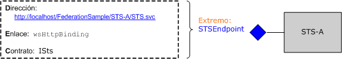

# <a name="federation"></a>Federación

En este tema se proporciona una información general breve sobre el concepto de seguridad federada. También se describe la compatibilidad con Windows Communication Foundation (WCF) para implementar arquitecturas de seguridad federadas. Para obtener una aplicación de ejemplo que muestra la Federación, vea [ejemplo de Federación](../samples/federation-sample.md).  
  
## <a name="definition-of-federated-security"></a>Definición de seguridad federada  

 La seguridad federada permite una separación limpia entre el servicio al que un cliente intenta obtener acceso y los procedimientos de autenticación y autorización asociados. La seguridad federada también habilita la colaboración en múltiples sistemas, redes y organizaciones en dominios de confianza diferentes.  
  
 WCF proporciona compatibilidad para la creación e implementación de sistemas distribuidos que emplean la seguridad federada.  
  
### <a name="elements-of-a-federated-security-architecture"></a>Elementos de una arquitectura de seguridad federada  

 La arquitectura de seguridad federada tiene tres elementos clave, tal y como se describe en la tabla siguiente.  
  
|Elemento|Descripción|  
|-------------|-----------------|  
|Dominio|Una unidad única de administración de seguridad o confianza. Un dominio típico podría incluir una organización única.|  
|Federación|Una colección de dominios que han establecido confianza. El nivel de confianza puede variar, pero normalmente incluye la autenticación y casi siempre la autorización. Una federación típica podría incluir un número de organizaciones que han establecido confianza para el acceso compartido a un conjunto de recursos.|  
|Servicio de tokens de seguridad (STS)|Un servicio web que emite tokens de seguridad; es decir, realiza aserciones basadas en la prueba en la que confía, a quienquiera que confíe en ella. Esto forma la base de la negociación de confianza entre dominios.|  
  
### <a name="example-scenario"></a>Escenario de ejemplo  

 En la ilustración siguiente se muestra un ejemplo de seguridad federada:  
  
   
  
 Este escenario incluye dos organizaciones: A y B. La organización B tiene un recurso web (un servicio web) que algunos usuarios de la organización A encuentran valioso.  
  
> [!NOTE]
> En esta sección se usan indistintamente los términos *recurso*, *servicio* y *servicio Web* .  
  
 Normalmente, la organización B requiere que un usuario de la organización A proporcione alguna forma válida de autenticación antes de obtener acceso al servicio. Además, la organización también puede requerir que el usuario esté autorizado para tener acceso al recurso concreto en cuestión. Una manera de resolver este problema y permitir a los usuarios de la organización A obtener acceso al recurso de la organización B es la siguiente:  
  
- Los usuarios de la organización A registran sus credenciales (un nombre de usuario y contraseña) en la organización B.  
  
- Durante el acceso al recurso, los usuarios de la organización A presentan sus credenciales a la organización B y se autentican antes de obtener acceso al recurso.  
  
 Este método tiene tres inconvenientes significativos:  
  
- La organización B tiene que administrar las credenciales de los usuarios de la organización A además de administrar las credenciales de sus usuarios locales.  
  
- Los usuarios de la organización A han de mantener un conjunto adicional de credenciales (es decir, han de recordar un nombre de usuario y contraseña adicionales) aparte de las credenciales que utilizan normalmente para obtener acceso a los recursos de la organización A. Esto promueve el uso del mismo nombre de usuario y contraseña en varios sitios del servicio, lo que constituye una medida de seguridad débil.  
  
- La arquitectura no escala a medida que más organizaciones perciben que el recurso de la organización B tiene algún valor.  
  
 Un método alternativo, que trata los inconvenientes mencionados anteriormente, consiste en emplear la seguridad federada. En este método, las organizaciones A y B establecen una relación de confianza y emplean el Servicio de tokens de seguridad (STS) para habilitar la negociación de la confianza establecida.  
  
 En una arquitectura de seguridad federada, los usuarios de la organización A saben que si desean tener acceso al servicio web de la organización B, deben presentar un token de seguridad válido desde el STS de la organización B, que autentica y autoriza su acceso al servicio específico.  
  
 Al ponerse en contacto con el STS de B, los usuarios reciben otro nivel de direccionamiento indirecto desde la directiva asociada al STS. Deben presentar un token de seguridad válido del STS de A (es decir, el dominio de confianza del cliente) antes de que el STS de B pueda emitirles un token de seguridad. Esto es un corolario de la relación de confianza establecida entre las dos organizaciones e implica que la organización B no tiene que administrar las identidades de los usuarios de la organización A. En la práctica, el STS de B tiene normalmente una `issuerAddress` y `issuerMetadataAddress` nulas. Para obtener más información, consulte [Cómo: configurar un emisor local](how-to-configure-a-local-issuer.md). En ese caso, el cliente consulta una directiva local para buscar el STS A. Esta configuración se denomina *Federación del dominio de inicio* y se escala mejor porque el STS de B no tiene que mantener información sobre STS a.  
  
 Los usuarios se ponen en contacto a continuación con el STS de la organización A y obtienen un token de seguridad presentando las credenciales de autenticación que utilizan normalmente para obtener acceso a cualquier otro recurso de la organización A. Esto también palia el problema de que los usuarios tengan que mantener varios conjuntos de credenciales o que usen el mismo conjunto de credenciales en varios sitios de servicios.  
  
 Una vez que los usuarios obtienen un token de seguridad del STS de A, presentan el token al STS de B. La organización B continúa con la autorización de las solicitudes de los usuarios y emite un token de seguridad a los usuarios desde su propio conjunto de tokens de seguridad. Los usuarios pueden presentar a continuación su token al recurso de la organización B y obtener acceso al servicio.  
  
## <a name="support-for-federated-security-in-wcf"></a>Compatibilidad para la seguridad federada en WCF  

 WCF proporciona compatibilidad inmediata para la implementación de arquitecturas de seguridad federadas a través de [\<wsFederationHttpBinding>](../../configure-apps/file-schema/wcf/wsfederationhttpbinding.md) .  
  
 El [\<wsFederationHttpBinding>](../../configure-apps/file-schema/wcf/wsfederationhttpbinding.md) elemento proporciona un enlace seguro, confiable e interoperable que implica el uso de http como mecanismo de transporte subyacente para el estilo de comunicación de solicitud-respuesta, que emplea texto y XML como formato de conexión para la codificación.  
  
 El uso de [\<wsFederationHttpBinding>](../../configure-apps/file-schema/wcf/wsfederationhttpbinding.md) en un escenario de seguridad federado se puede desacoplar en dos fases lógicamente independientes, tal y como se describe en las secciones siguientes.  
  
### <a name="phase-1-design-phase"></a>Fase 1: fase de diseño  

 Durante la fase de diseño, el cliente usa la [herramienta de utilidad de metadatos de ServiceModel (Svcutil.exe)](../servicemodel-metadata-utility-tool-svcutil-exe.md) para leer la Directiva que expone el extremo de servicio y para recopilar los requisitos de autenticación y autorización del servicio. Los proxys adecuados se construyen para crear el siguiente patrón de comunicación de seguridad federada en el cliente:  
  
- Obtenga un token de seguridad de STS en el dominio de confianza del cliente.  
  
- Presente el token al STS en el dominio de confianza del servicio.  
  
- Obtenga un token de seguridad del STS en el dominio de confianza del servicio.  
  
- Presente el token al servicio para obtener acceso al servicio.  
  
### <a name="phase-2-run-time-phase"></a>Fase 2: fase en tiempo de ejecución  

 Durante la fase de tiempo de ejecución, el cliente crea una instancia de un objeto de la clase de cliente WCF y realiza una llamada mediante el cliente WCF. El marco de trabajo subyacente de WCF controla los pasos mencionados anteriormente en el patrón de comunicación de seguridad federada y permite al cliente consumir el servicio sin problemas.  
  
## <a name="sample-implementation-using-wcf"></a>Ejemplo de implementación mediante WCF  

 En la ilustración siguiente se muestra una implementación de ejemplo de una arquitectura de seguridad federada que usa la compatibilidad nativa con WCF.  
  
   
  
### <a name="example-myservice"></a>Ejemplo de MyService  

 El servicio `MyService` expone un punto de conexión único a través de `MyServiceEndpoint`. La siguiente ilustración muestra la dirección, enlace y contrato asociados al extremo.  
  
   
  
 El punto de conexión de servicio `MyServiceEndpoint` usa [\<wsFederationHttpBinding>](../../configure-apps/file-schema/wcf/wsfederationhttpbinding.md) y requiere un token de lenguaje de marcado de aserciones de seguridad (SAML) válido con una `accessAuthorized` demanda emitida por el STS de B. Esto se especifica mediante declaración en la configuración del servicio.  
  
```xml  
<system.serviceModel>  
  <services>  
    <service type="FederationSample.MyService"
        behaviorConfiguration='MyServiceBehavior'>  
        <endpoint address=""  
            binding=" wsFederationHttpBinding"  
            bindingConfiguration='MyServiceBinding'  
            contract="Federation.IMyService" />  
   </service>  
  </services>  
  
  <bindings>  
    <wsFederationHttpBinding>  
    <!-- This is the binding used by MyService. It redirects   
    clients to STS-B. -->  
      <binding name='MyServiceBinding'>  
        <security mode="Message">  
           <message issuedTokenType=  
"http://docs.oasis-open.org/wss/oasis-wss-saml-token-profile-1.1#SAMLV1.1">  
           <issuer address="http://localhost/FederationSample/STS-B/STS.svc" />  
            <issuerMetadata
           address=  
"http://localhost/FederationSample/STS-B/STS.svc/mex" />  
         <requiredClaimTypes>  
            <add claimType="http://tempuri.org:accessAuthorized" />  
         </requiredClaimTypes>  
        </message>  
      </security>  
      </binding>  
    </wsFederationHttpBinding>  
  </bindings>  
  
  <behaviors>  
    <behavior name='MyServiceBehavior'>  
      <serviceAuthorization
operationRequirementType="FederationSample.MyServiceOperationRequirement, MyService" />  
       <serviceCredentials>  
         <serviceCertificate findValue="CN=FederationSample.com"  
         x509FindType="FindBySubjectDistinguishedName"  
         storeLocation='LocalMachine'  
         storeName='My' />  
      </serviceCredentials>  
    </behavior>  
  </behaviors>  
</system.serviceModel>  
```  
  
> [!NOTE]
> Se debería tener en cuenta un pequeño punto sobre las demandas requeridas por `MyService`. La segunda figura indica que `MyService` requiere un token de SAML con la demanda `accessAuthorized`. Para ser más preciso, esto especifica el tipo de demanda que `MyService` requiere. El nombre completo de este tipo de demanda es `http://tempuri.org:accessAuthorized` (junto con el espacio de nombres asociado), que se usa en el archivo de configuración de servicio. El valor de esta demanda indica la presencia de esta demanda y se supone que el STS de B lo ha establecido en `true`.  
  
 En tiempo de ejecución, la clase `MyServiceOperationRequirement` que se implementa como parte de `MyService` obliga a cumplir esta directiva.  
  
 [!code-csharp[C_Federation#0](../../../../samples/snippets/csharp/VS_Snippets_CFX/c_federation/cs/source.cs#0)]
 [!code-vb[C_Federation#0](../../../../samples/snippets/visualbasic/VS_Snippets_CFX/c_federation/vb/source.vb#0)]  
[!code-csharp[C_Federation#1](../../../../samples/snippets/csharp/VS_Snippets_CFX/c_federation/cs/source.cs#1)]
[!code-vb[C_Federation#1](../../../../samples/snippets/visualbasic/VS_Snippets_CFX/c_federation/vb/source.vb#1)]  
  
#### <a name="sts-b"></a>STS de B  

 La siguiente ilustración muestra el STS de B. Como se mencionó anteriormente, un servicio de tokens de seguridad (STS) es también un servicio web y puede tener sus extremos asociados, directiva, etc.  
  
   
  
 El STS de B expone un extremo único, denominado `STSEndpoint`, que puede ser de uso para solicitar tokens de seguridad. Específicamente, el STS de B emite tokens SAML con la demanda `accessAuthorized`, que puede presentarse en el sitio del servicio `MyService` para obtener acceso al servicio. Sin embargo, el STS de B requiere que los usuarios presenten un token SAML válido emitido por el STS de A que contiene la demanda `userAuthenticated`. Esto se especifica mediante declaración en la configuración del STS.  
  
```xml  
<system.serviceModel>  
  <services>  
    <service type="FederationSample.STS_B" behaviorConfiguration=  
     "STS-B_Behavior">  
    <endpoint address=""  
              binding="wsFederationHttpBinding"  
              bindingConfiguration='STS-B_Binding'  
      contract="FederationSample.ISts" />  
    </service>  
  </services>  
  <bindings>  
    <wsFederationHttpBinding>  
    <!-- This is the binding used by STS-B. It redirects clients to   
         STS-A. -->  
      <binding name='STS-B_Binding'>  
        <security mode='Message'>  
          <message issuedTokenType="http://docs.oasis-open.org/wss/oasis-wss-saml-token-profile-1.1#SAMLV1.1">  
          <issuer address='http://localhost/FederationSample/STS-A/STS.svc' />  
          <issuerMetadata address='http://localhost/FederationSample/STS-A/STS.svc/mex'/>  
          <requiredClaimTypes>  
            <add claimType='http://tempuri.org:userAuthenticated'/>  
          </requiredClaimTypes>  
          </message>  
        </security>  
    </binding>  
   </wsFederationHttpBinding>  
  </bindings>  
  <behaviors>  
  <behavior name='STS-B_Behavior'>  
    <serviceAuthorization   operationRequirementType='FederationSample.STS_B_OperationRequirement, STS_B' />  
    <serviceCredentials>  
      <serviceCertificate findValue='CN=FederationSample.com'  
      x509FindType='FindBySubjectDistinguishedName'  
       storeLocation='LocalMachine'  
       storeName='My' />  
     </serviceCredentials>  
   </behavior>  
  </behaviors>  
</system.serviceModel>  
```  
  
> [!NOTE]
> De nuevo, la `userAuthenticated` demanda es el tipo de demanda que el STS de B necesita. El nombre completo de este tipo de demanda es `http://tempuri.org:userAuthenticated` (junto con el espacio de nombres asociado), que se usa en el archivo de configuración de STS. El valor de esta demanda indica la presencia de esta demanda y se supone que el STS de A lo ha establecido en `true`.  
  
 En tiempo de ejecución, la clase `STS_B_OperationRequirement` hace cumplir esta directiva, que se implementa como parte del STS de B.  
  
 [!code-csharp[C_Federation#2](../../../../samples/snippets/csharp/VS_Snippets_CFX/c_federation/cs/source.cs#2)]
 [!code-vb[C_Federation#2](../../../../samples/snippets/visualbasic/VS_Snippets_CFX/c_federation/vb/source.vb#2)]  
  
 Si la comprobación de acceso se ha superado, el STS de B emite un token SAML con la demanda `accessAuthorized`.  
  
 [!code-csharp[C_Federation#3](../../../../samples/snippets/csharp/VS_Snippets_CFX/c_federation/cs/source.cs#3)]
 [!code-vb[C_Federation#3](../../../../samples/snippets/visualbasic/VS_Snippets_CFX/c_federation/vb/source.vb#3)]  
  
#### <a name="sts-a"></a>STS de A  

 En la siguiente ilustración se muestra el STS de A.  
  
   
  
 Similar al STS de B, el STS de A también es un servicio web que emite tokens de seguridad y expone un extremo único con este fin. Sin embargo, utiliza un enlace diferente ( `wsHttpBinding` ) y requiere que los usuarios presenten un CardSpace válido con una `emailAddress` demanda. En respuesta, emite tokens SAML con la demanda `userAuthenticated`. Esto se especifica mediante declaración en la configuración del servicio.  
  
```xml  
<system.serviceModel>  
  <services>  
    <service type="FederationSample.STS_A" behaviorConfiguration="STS-A_Behavior">  
      <endpoint address=""  
                binding="wsHttpBinding"  
                bindingConfiguration="STS-A_Binding"  
                contract="FederationSample.ISts">  
       <identity>  
       <certificateReference findValue="CN=FederationSample.com"
                       x509FindType="FindBySubjectDistinguishedName"  
                       storeLocation="LocalMachine"
                       storeName="My" />  
       </identity>  
    </endpoint>  
  </service>  
</services>  
  
<bindings>  
  <wsHttpBinding>  
  <!-- This is the binding used by STS-A. It requires users to present  
   a CardSpace. -->  
    <binding name='STS-A_Binding'>  
      <security mode='Message'>  
        <message clientCredentialType="CardSpace" />  
      </security>  
    </binding>  
  </wsHttpBinding>  
</bindings>  
  
<behaviors>  
  <behavior name='STS-A_Behavior'>  
    <serviceAuthorization operationRequirementType=  
     "FederationSample.STS_A_OperationRequirement, STS_A" />  
      <serviceCredentials>  
  <serviceCertificate findValue="CN=FederationSample.com"  
                     x509FindType='FindBySubjectDistinguishedName'  
                     storeLocation='LocalMachine'  
                     storeName='My' />  
      </serviceCredentials>  
    </behavior>  
  </behaviors>  
</system.serviceModel>  
```  
  
 En tiempo de ejecución, la clase `STS_A_OperationRequirement` hace cumplir esta directiva, que se implementa como parte del STS de A.  
  
 [!code-csharp[C_Federation#4](../../../../samples/snippets/csharp/VS_Snippets_CFX/c_federation/cs/source.cs#4)]
 [!code-vb[C_Federation#4](../../../../samples/snippets/visualbasic/VS_Snippets_CFX/c_federation/vb/source.vb#4)]  
  
 Si el acceso es `true`, el STS de A emite un token SAML con demanda `userAuthenticated`.  
  
 [!code-csharp[C_Federation#5](../../../../samples/snippets/csharp/VS_Snippets_CFX/c_federation/cs/source.cs#5)]
 [!code-vb[C_Federation#5](../../../../samples/snippets/visualbasic/VS_Snippets_CFX/c_federation/vb/source.vb#5)]  
  
### <a name="client-at-organization-a"></a>Cliente en la organización A  

 La siguiente ilustración muestra el cliente en la organización A, junto con los pasos implicados para realizar una llamada de servicio `MyService`. Los otros componentes funcionales también se incluyen para ofrecer totalidad.  
  
   
  
## <a name="summary"></a>Resumen  

 La seguridad federada proporciona una división limpia de responsabilidad y ayuda a crear arquitecturas de servicios seguras y escalables. Como plataforma para la creación e implementación de aplicaciones distribuidas, WCF proporciona compatibilidad nativa para implementar la seguridad federada.  
  
## <a name="see-also"></a>Vea también

- [Seguridad](security.md)
