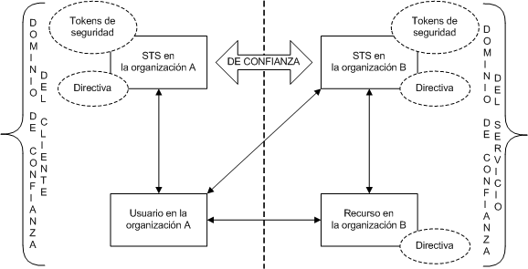
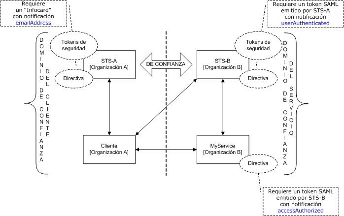
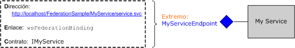
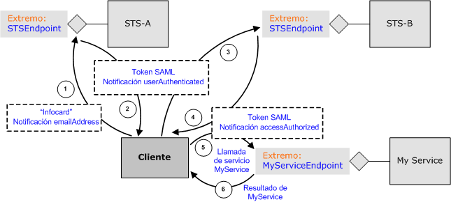

# <a name="federation"></a><span data-ttu-id="d7d7e-102">Federación</span><span class="sxs-lookup"><span data-stu-id="d7d7e-102">Federation</span></span>
<span data-ttu-id="d7d7e-103">En este tema se proporciona una información general breve sobre el concepto de seguridad federada.</span><span class="sxs-lookup"><span data-stu-id="d7d7e-103">This topic provides a brief overview of the concept of federated security.</span></span> <span data-ttu-id="d7d7e-104">También se describe la compatibilidad de Windows Communication Foundation (WCF) para implementar una arquitectura de seguridad federada.</span><span class="sxs-lookup"><span data-stu-id="d7d7e-104">It also describes Windows Communication Foundation (WCF) support for deploying federated security architectures.</span></span> <span data-ttu-id="d7d7e-105">Para una aplicación de ejemplo que demuestre la federación, consulte [ejemplo de federación](../../../../docs/framework/wcf/samples/federation-sample.md).</span><span class="sxs-lookup"><span data-stu-id="d7d7e-105">For a sample application that demonstrates federation, see [Federation Sample](../../../../docs/framework/wcf/samples/federation-sample.md).</span></span>  
  
## <a name="definition-of-federated-security"></a><span data-ttu-id="d7d7e-106">Definición de seguridad federada</span><span class="sxs-lookup"><span data-stu-id="d7d7e-106">Definition of Federated Security</span></span>  
 <span data-ttu-id="d7d7e-107">La seguridad federada permite una separación limpia entre el servicio al que un cliente intenta obtener acceso y los procedimientos de autenticación y autorización asociados.</span><span class="sxs-lookup"><span data-stu-id="d7d7e-107">Federated security allows for clean separation between the service a client is accessing and the associated authentication and authorization procedures.</span></span> <span data-ttu-id="d7d7e-108">La seguridad federada también habilita la colaboración en múltiples sistemas, redes y organizaciones en dominios de confianza diferentes.</span><span class="sxs-lookup"><span data-stu-id="d7d7e-108">Federated security also enables collaboration across multiple systems, networks, and organizations in different trust realms.</span></span>  
  
 <span data-ttu-id="d7d7e-109">WCF proporciona compatibilidad para la creación e implementación de sistemas distribuidos que emplean la seguridad federada.</span><span class="sxs-lookup"><span data-stu-id="d7d7e-109">WCF provides support for building and deploying distributed systems that employ federated security.</span></span>  
  
### <a name="elements-of-a-federated-security-architecture"></a><span data-ttu-id="d7d7e-110">Elementos de una arquitectura de seguridad federada</span><span class="sxs-lookup"><span data-stu-id="d7d7e-110">Elements of a Federated Security Architecture</span></span>  
 <span data-ttu-id="d7d7e-111">La arquitectura de seguridad federada tiene tres elementos clave, tal y como se describe en la tabla siguiente.</span><span class="sxs-lookup"><span data-stu-id="d7d7e-111">The federated security architecture has three key elements, as described in the following table.</span></span>  
  
|<span data-ttu-id="d7d7e-112">Elemento</span><span class="sxs-lookup"><span data-stu-id="d7d7e-112">Element</span></span>|<span data-ttu-id="d7d7e-113">Descripción</span><span class="sxs-lookup"><span data-stu-id="d7d7e-113">Description</span></span>|  
|-------------|-----------------|  
|<span data-ttu-id="d7d7e-114">Dominio</span><span class="sxs-lookup"><span data-stu-id="d7d7e-114">Domain/realm</span></span>|<span data-ttu-id="d7d7e-115">Una unidad única de administración de seguridad o confianza.</span><span class="sxs-lookup"><span data-stu-id="d7d7e-115">A single unit of security administration or trust.</span></span> <span data-ttu-id="d7d7e-116">Un dominio típico podría incluir una organización única.</span><span class="sxs-lookup"><span data-stu-id="d7d7e-116">A typical domain might include a single organization.</span></span>|  
|<span data-ttu-id="d7d7e-117">Federación</span><span class="sxs-lookup"><span data-stu-id="d7d7e-117">Federation</span></span>|<span data-ttu-id="d7d7e-118">Una colección de dominios que han establecido confianza.</span><span class="sxs-lookup"><span data-stu-id="d7d7e-118">A collection of domains that have established trust.</span></span> <span data-ttu-id="d7d7e-119">El nivel de confianza puede variar, pero normalmente incluye la autenticación y casi siempre incluye la autorización.</span><span class="sxs-lookup"><span data-stu-id="d7d7e-119">The level of trust may vary, but typically includes authentication and almost always includes authorization.</span></span> <span data-ttu-id="d7d7e-120">Una federación típica podría incluir varias organizaciones que han establecido la confianza para el acceso compartido a un conjunto de recursos.</span><span class="sxs-lookup"><span data-stu-id="d7d7e-120">A typical federation might include a number of organizations that have established trust for shared access to a set of resources.</span></span>|  
|<span data-ttu-id="d7d7e-121">Servicio de tokens de seguridad (STS)</span><span class="sxs-lookup"><span data-stu-id="d7d7e-121">Security Token Service (STS)</span></span>|<span data-ttu-id="d7d7e-122">Un servicio web que emite tokens de seguridad; es decir, realiza aserciones basadas en la prueba en la que confía, a quienquiera que confíe en ella.</span><span class="sxs-lookup"><span data-stu-id="d7d7e-122">A Web service that issues security tokens; that is, it makes assertions based on evidence that it trusts, to whomever trusts it.</span></span> <span data-ttu-id="d7d7e-123">Esto forma la base de la negociación de confianza entre dominios.</span><span class="sxs-lookup"><span data-stu-id="d7d7e-123">This forms the basis of trust brokering between domains.</span></span>|  
  
### <a name="example-scenario"></a><span data-ttu-id="d7d7e-124">Escenarios de ejemplo</span><span class="sxs-lookup"><span data-stu-id="d7d7e-124">Example Scenario</span></span>  
 <span data-ttu-id="d7d7e-125">La siguiente ilustración muestra un ejemplo de seguridad federada.</span><span class="sxs-lookup"><span data-stu-id="d7d7e-125">The following illustration shows an example of federated security.</span></span>  
  
 <span data-ttu-id="d7d7e-126"></span><span class="sxs-lookup"><span data-stu-id="d7d7e-126"></span></span>  
  
 <span data-ttu-id="d7d7e-127">Este escenario incluye dos organizaciones: A y B. la organización B tiene un recurso Web (un servicio Web) que algunos usuarios de la organización A encuentran valiosos.</span><span class="sxs-lookup"><span data-stu-id="d7d7e-127">This scenario includes two organizations: A and B. Organization B has a Web resource (a Web service) that some users in organization A find valuable.</span></span>  
  
> [!NOTE]
>  <span data-ttu-id="d7d7e-128">En esta sección utiliza los términos *recursos*, *servicio*, y *servicio Web* indistintamente.</span><span class="sxs-lookup"><span data-stu-id="d7d7e-128">This section uses the terms *resource*, *service*, and *Web service* interchangeably.</span></span>  
  
 <span data-ttu-id="d7d7e-129">Normalmente, la organización B requiere que un usuario de la organización A proporcione alguna forma válida de autenticación antes de obtener acceso al servicio.</span><span class="sxs-lookup"><span data-stu-id="d7d7e-129">Typically, organization B requires that a user from organization A provide some valid form of authentication before accessing the service.</span></span> <span data-ttu-id="d7d7e-130">Además, la organización también puede requerir que el usuario esté autorizado para tener acceso al recurso concreto en cuestión.</span><span class="sxs-lookup"><span data-stu-id="d7d7e-130">In addition, the organization may also require that the user be authorized to access the specific resource in question.</span></span> <span data-ttu-id="d7d7e-131">Una manera de resolver este problema y permitir a los usuarios de la organización A obtener acceso al recurso de la organización B es la siguiente:</span><span class="sxs-lookup"><span data-stu-id="d7d7e-131">One way to address this problem and enable users in organization A to access the resource in organization B is as follows:</span></span>  
  
-   <span data-ttu-id="d7d7e-132">Los usuarios de la organización A registran sus credenciales (un nombre de usuario y contraseña) en la organización B.</span><span class="sxs-lookup"><span data-stu-id="d7d7e-132">Users from organization A register their credentials (a user name and password) with organization B.</span></span>  
  
-   <span data-ttu-id="d7d7e-133">Durante el acceso al recurso, los usuarios de la organización A presentan sus credenciales a la organización B y se autentican antes de obtener acceso al recurso.</span><span class="sxs-lookup"><span data-stu-id="d7d7e-133">During the resource access, users from organization A present their credentials to organization B and are authenticated before accessing the resource.</span></span>  
  
 <span data-ttu-id="d7d7e-134">Este método tiene tres inconvenientes significativos:</span><span class="sxs-lookup"><span data-stu-id="d7d7e-134">This approach has three significant drawbacks:</span></span>  
  
-   <span data-ttu-id="d7d7e-135">La organización B tiene que administrar las credenciales de los usuarios de la organización A además de administrar las credenciales de sus usuarios locales.</span><span class="sxs-lookup"><span data-stu-id="d7d7e-135">Organization B has to manage the credentials for users from organization A in addition to managing the credentials of its local users.</span></span>  
  
-   <span data-ttu-id="d7d7e-136">Los usuarios de la organización A han de mantener un conjunto adicional de credenciales (es decir, han de recordar un nombre de usuario y contraseña adicionales) aparte de las credenciales que utilizan normalmente para obtener acceso a los recursos de la organización A. Esto promueve el uso del mismo nombre de usuario y contraseña en varios sitios del servicio, lo que constituye una medida de seguridad débil.</span><span class="sxs-lookup"><span data-stu-id="d7d7e-136">Users in organization A need to maintain an additional set of credentials (that is, remember an additional user name and password) apart from the credentials they normally use to gain access to resources within organization A. This usually encourages the practice of using the same user name and password at multiple service sites, which is a weak security measure.</span></span>  
  
-   <span data-ttu-id="d7d7e-137">La arquitectura no escala a medida que más organizaciones perciben que el recurso de la organización B tiene algún valor.</span><span class="sxs-lookup"><span data-stu-id="d7d7e-137">The architecture does not scale as more organizations perceive the resource at organization B as being of some value.</span></span>  
  
 <span data-ttu-id="d7d7e-138">Un método alternativo, que trata los inconvenientes mencionados anteriormente, consiste en emplear la seguridad federada.</span><span class="sxs-lookup"><span data-stu-id="d7d7e-138">An alternative approach, which addresses the previously mentioned drawbacks, is to employ federated security.</span></span> <span data-ttu-id="d7d7e-139">En este método, las organizaciones A y B establecen una relación de confianza y emplean el Servicio de tokens de seguridad (STS) para habilitar la negociación de la confianza establecida.</span><span class="sxs-lookup"><span data-stu-id="d7d7e-139">In this approach, organizations A and B establish a trust relationship and employ Security Token Service (STS) to enable brokering of the established trust.</span></span>  
  
 <span data-ttu-id="d7d7e-140">En una arquitectura de seguridad federada, los usuarios de la organización A saben que si desean tener acceso al servicio web de la organización B, deben presentar un token de seguridad válido desde el STS de la organización B, que autentica y autoriza su acceso al servicio específico.</span><span class="sxs-lookup"><span data-stu-id="d7d7e-140">In a federated security architecture, users from organization A know that if they want to access the Web service in organization B that they must present a valid security token from the STS at organization B, which authenticates and authorizes their access to the specific service.</span></span>  
  
 <span data-ttu-id="d7d7e-141">Al ponerse en contacto con el STS de B, los usuarios reciben otro nivel de direccionamiento indirecto desde la directiva asociada al STS.</span><span class="sxs-lookup"><span data-stu-id="d7d7e-141">On contacting the STS B, the users receive another level of indirection from the policy associated with the STS.</span></span> <span data-ttu-id="d7d7e-142">Deben presentar un token de seguridad válido del STS de A (es decir, el dominio de confianza del cliente) antes de que el STS de B pueda emitirles un token de seguridad.</span><span class="sxs-lookup"><span data-stu-id="d7d7e-142">They must present a valid security token from the STS A (that is, the client trust realm) before the STS B can issue them a security token.</span></span> <span data-ttu-id="d7d7e-143">Esto es un corolario de la relación de confianza establecida entre las dos organizaciones e implica que la organización B no tiene que administrar las identidades de los usuarios de la organización A. En la práctica, el STS de B tiene normalmente una `issuerAddress` y `issuerMetadataAddress` nulas.</span><span class="sxs-lookup"><span data-stu-id="d7d7e-143">This is a corollary of the trust relationship established between the two organizations and implies that organization B does not have to manage identities for users from organization A. In practice, STS B typically has a null `issuerAddress` and `issuerMetadataAddress`.</span></span> <span data-ttu-id="d7d7e-144">Para obtener más información, vea [Cómo: Configurar un emisor Local](../../../../docs/framework/wcf/feature-details/how-to-configure-a-local-issuer.md).</span><span class="sxs-lookup"><span data-stu-id="d7d7e-144">For more information, see [How to: Configure a Local Issuer](../../../../docs/framework/wcf/feature-details/how-to-configure-a-local-issuer.md).</span></span> <span data-ttu-id="d7d7e-145">En ese caso, el cliente consulta una directiva local para buscar STS A. Esta configuración se denomina *federación del dominio de inicio* y se escala mejor porque STS de B no tiene que mantener información sobre STS A.</span><span class="sxs-lookup"><span data-stu-id="d7d7e-145">In that case, the client consults a local policy to locate STS A. This configuration is called *home realm federation* and it scales better because STS B does not have to maintain information about STS A.</span></span>  
  
 <span data-ttu-id="d7d7e-146">Los usuarios se ponen en contacto a continuación con el STS de la organización A y obtienen un token de seguridad presentando las credenciales de autenticación que utilizan normalmente para obtener acceso a cualquier otro recurso de la organización A. Esto también palia el problema de que los usuarios tengan que mantener varios conjuntos de credenciales o que usen el mismo conjunto de credenciales en varios sitios de servicios.</span><span class="sxs-lookup"><span data-stu-id="d7d7e-146">The users then contact the STS at organization A and obtain a security token by presenting authentication credentials that they normally use to gain access to any other resource within organization A. This also alleviates the problem of users having to maintain multiple sets of credentials or using the same set of credentials at multiple service sites.</span></span>  
  
 <span data-ttu-id="d7d7e-147">Una vez que los usuarios obtienen un token de seguridad del STS de A, presentan el token al STS de B. La organización B continúa con la autorización de las solicitudes de los usuarios y emite un token de seguridad a los usuarios desde su propio conjunto de tokens de seguridad.</span><span class="sxs-lookup"><span data-stu-id="d7d7e-147">Once the users obtain a security token from the STS A, they present the token to the STS B. Organization B proceeds to perform authorization of the users' requests and issues a security token to the users from its own set of security tokens.</span></span> <span data-ttu-id="d7d7e-148">Los usuarios pueden presentar a continuación su token al recurso de la organización B y obtener acceso al servicio.</span><span class="sxs-lookup"><span data-stu-id="d7d7e-148">The users can then present their token to the resource at organization B and access the service.</span></span>  
  
## <a name="support-for-federated-security-in-wcf"></a><span data-ttu-id="d7d7e-149">Compatibilidad para la seguridad federada en WCF</span><span class="sxs-lookup"><span data-stu-id="d7d7e-149">Support for Federated Security in WCF</span></span>  
 <span data-ttu-id="d7d7e-150">WCF proporciona compatibilidad inmediata para la implementación de arquitecturas de seguridad federadas a través de la [ \<wsFederationHttpBinding >](../../../../docs/framework/configure-apps/file-schema/wcf/wsfederationhttpbinding.md).</span><span class="sxs-lookup"><span data-stu-id="d7d7e-150">WCF provides turnkey support for deploying federated security architectures through the [\<wsFederationHttpBinding>](../../../../docs/framework/configure-apps/file-schema/wcf/wsfederationhttpbinding.md).</span></span>  
  
 <span data-ttu-id="d7d7e-151">El [ \<wsFederationHttpBinding >](../../../../docs/framework/configure-apps/file-schema/wcf/wsfederationhttpbinding.md) elemento proporciona un enlace seguro, fiable e interoperable que conlleva el uso de HTTP como mecanismo de transporte subyacente para el estilo de comunicación de solicitud-respuesta, empleo del texto y XML como el formato de codificación.</span><span class="sxs-lookup"><span data-stu-id="d7d7e-151">The [\<wsFederationHttpBinding>](../../../../docs/framework/configure-apps/file-schema/wcf/wsfederationhttpbinding.md) element provides for a secure, reliable, interoperable binding that entails the use of HTTP as the underlying transport mechanism for request-reply communication style, employing text and XML as the wire format for encoding.</span></span>  
  
 <span data-ttu-id="d7d7e-152">El uso de [ \<wsFederationHttpBinding >](../../../../docs/framework/configure-apps/file-schema/wcf/wsfederationhttpbinding.md) de seguridad federada se puede desacoplar escenario en dos fases lógicamente independientes, como se describe en las secciones siguientes.</span><span class="sxs-lookup"><span data-stu-id="d7d7e-152">The use of [\<wsFederationHttpBinding>](../../../../docs/framework/configure-apps/file-schema/wcf/wsfederationhttpbinding.md) in a federated security scenario can be decoupled into two logically independent phases, as described in the following sections.</span></span>  
  
### <a name="phase-1-design-phase"></a><span data-ttu-id="d7d7e-153">Fase 1: Fase de diseño</span><span class="sxs-lookup"><span data-stu-id="d7d7e-153">Phase 1: Design Phase</span></span>  
 <span data-ttu-id="d7d7e-154">Durante la fase de diseño, el cliente usa la [ServiceModel Metadata Utility Tool (Svcutil.exe)](../../../../docs/framework/wcf/servicemodel-metadata-utility-tool-svcutil-exe.md) para leer la directiva que expone el extremo de servicio y para recopilar los requisitos de autenticación y autorización del servicio.</span><span class="sxs-lookup"><span data-stu-id="d7d7e-154">During the design phase, the client uses the [ServiceModel Metadata Utility Tool (Svcutil.exe)](../../../../docs/framework/wcf/servicemodel-metadata-utility-tool-svcutil-exe.md) to read the policy the service endpoint exposes and to collect the service's authentication and authorization requirements.</span></span> <span data-ttu-id="d7d7e-155">Los proxys adecuados se construyen para crear el siguiente patrón de comunicación de seguridad federada en el cliente:</span><span class="sxs-lookup"><span data-stu-id="d7d7e-155">The appropriate proxies are constructed to create the following federated security communication pattern at the client:</span></span>  
  
-   <span data-ttu-id="d7d7e-156">Obtenga un token de seguridad de STS en el dominio de confianza del cliente.</span><span class="sxs-lookup"><span data-stu-id="d7d7e-156">Obtain a security token from the STS in the client trust realm.</span></span>  
  
-   <span data-ttu-id="d7d7e-157">Presente el token al STS en el dominio de confianza del servicio.</span><span class="sxs-lookup"><span data-stu-id="d7d7e-157">Present the token to the STS in the service trust realm.</span></span>  
  
-   <span data-ttu-id="d7d7e-158">Obtenga un token de seguridad del STS en el dominio de confianza del servicio.</span><span class="sxs-lookup"><span data-stu-id="d7d7e-158">Obtain a security token from the STS in the service trust realm.</span></span>  
  
-   <span data-ttu-id="d7d7e-159">Presente el token al servicio para obtener acceso al servicio.</span><span class="sxs-lookup"><span data-stu-id="d7d7e-159">Present the token to the service to access the service.</span></span>  
  
### <a name="phase-2-run-time-phase"></a><span data-ttu-id="d7d7e-160">Fase 2: Fase de tiempo de ejecución</span><span class="sxs-lookup"><span data-stu-id="d7d7e-160">Phase 2: Run-Time Phase</span></span>  
 <span data-ttu-id="d7d7e-161">Durante la fase de tiempo de ejecución, el cliente crea una instancia de un objeto de la clase de cliente WCF y realiza una llamada con el cliente de WCF.</span><span class="sxs-lookup"><span data-stu-id="d7d7e-161">During the run-time phase, the client instantiates an object of the WCF client class and makes a call using the WCF client.</span></span> <span data-ttu-id="d7d7e-162">El marco subyacente de WCF administra los pasos mencionados anteriormente en el patrón de comunicación de seguridad federada y permite al cliente consumir el servicio de forma transparente.</span><span class="sxs-lookup"><span data-stu-id="d7d7e-162">The underlying framework of WCF handles the previously mentioned steps in the federated security communication pattern and enables the client to seamlessly consume the service.</span></span>  
  
## <a name="sample-implementation-using-wcf"></a><span data-ttu-id="d7d7e-163">Ejemplo de implementación mediante WCF</span><span class="sxs-lookup"><span data-stu-id="d7d7e-163">Sample Implementation Using WCF</span></span>  
 <span data-ttu-id="d7d7e-164">La siguiente ilustración muestra una implementación de ejemplo para una arquitectura de seguridad federada utilizando la compatibilidad nativa de WCF.</span><span class="sxs-lookup"><span data-stu-id="d7d7e-164">The following illustration shows a sample implementation for a federated security architecture using native support from WCF.</span></span>  
  
 <span data-ttu-id="d7d7e-165"></span><span class="sxs-lookup"><span data-stu-id="d7d7e-165"></span></span>  
  
### <a name="example-myservice"></a><span data-ttu-id="d7d7e-166">Ejemplo de MyService</span><span class="sxs-lookup"><span data-stu-id="d7d7e-166">Example MyService</span></span>  
 <span data-ttu-id="d7d7e-167">El servicio `MyService` expone un extremo único a través de `MyServiceEndpoint`.</span><span class="sxs-lookup"><span data-stu-id="d7d7e-167">The service `MyService` exposes a single endpoint through `MyServiceEndpoint`.</span></span> <span data-ttu-id="d7d7e-168">La siguiente ilustración muestra la dirección, enlace y contrato asociados al punto de conexión.</span><span class="sxs-lookup"><span data-stu-id="d7d7e-168">The following illustration shows the address, binding, and contract associated with the endpoint.</span></span>  
  
 <span data-ttu-id="d7d7e-169"></span><span class="sxs-lookup"><span data-stu-id="d7d7e-169"></span></span>  
  
 <span data-ttu-id="d7d7e-170">El punto de conexión de servicio `MyServiceEndpoint` usa el [ \<wsFederationHttpBinding >](../../../../docs/framework/configure-apps/file-schema/wcf/wsfederationhttpbinding.md) y requiere un token de lenguaje de marcado de aserción de seguridad (SAML) válido con un `accessAuthorized` notificación emitida por STS B. Esto se especifica mediante declaración en la configuración del servicio.</span><span class="sxs-lookup"><span data-stu-id="d7d7e-170">The service endpoint `MyServiceEndpoint` uses the [\<wsFederationHttpBinding>](../../../../docs/framework/configure-apps/file-schema/wcf/wsfederationhttpbinding.md) and requires a valid Security Assertions Markup Language (SAML) token with an `accessAuthorized` claim issued by STS B. This is declaratively specified in the service configuration.</span></span>  
  
```xml  
<system.serviceModel>  
  <services>  
    <service type="FederationSample.MyService"      
        behaviorConfiguration='MyServiceBehavior'>  
        <endpoint address=""  
            binding=" wsFederationHttpBinding"  
            bindingConfiguration='MyServiceBinding'  
            contract="Federation.IMyService" />  
   </service>  
  </services>  
  
  <bindings>  
    <wsFederationHttpBinding>  
    <!-- This is the binding used by MyService. It redirects   
    clients to STS-B. -->  
      <binding name='MyServiceBinding'>  
        <security mode="Message">  
           <message issuedTokenType=  
"http://docs.oasis-open.org/wss/oasis-wss-saml-token-profile-1.1#SAMLV1.1">  
           <issuer address="http://localhost/FederationSample/STS-B/STS.svc" />  
            <issuerMetadata   
           address=  
"http://localhost/FederationSample/STS-B/STS.svc/mex" />  
         <requiredClaimTypes>  
            <add claimType="http://tempuri.org:accessAuthorized" />  
         </requiredClaimTypes>  
        </message>  
      </security>  
      </binding>  
    </wsFederationHttpBinding>  
  </bindings>  
  
  <behaviors>  
    <behavior name='MyServiceBehavior'>  
      <serviceAuthorization   
operationRequirementType="FederationSample.MyServiceOperationRequirement, MyService" />  
       <serviceCredentials>  
         <serviceCertificate findValue="CN=FederationSample.com"  
         x509FindType="FindBySubjectDistinguishedName"  
         storeLocation='LocalMachine'  
         storeName='My' />  
      </serviceCredentials>  
    </behavior>  
  </behaviors>  
</system.serviceModel>  
```  
  
> [!NOTE]
>  <span data-ttu-id="d7d7e-171">Se debería tener en cuenta un pequeño punto sobre las demandas requeridas por `MyService`.</span><span class="sxs-lookup"><span data-stu-id="d7d7e-171">A subtle point should be noted about the claims required by `MyService`.</span></span> <span data-ttu-id="d7d7e-172">La segunda figura indica que `MyService` requiere un token de SAML con la demanda `accessAuthorized`.</span><span class="sxs-lookup"><span data-stu-id="d7d7e-172">The second figure indicates that `MyService` requires a SAML token with the `accessAuthorized` claim.</span></span> <span data-ttu-id="d7d7e-173">Para ser más preciso, esto especifica el tipo de demanda que `MyService` requiere.</span><span class="sxs-lookup"><span data-stu-id="d7d7e-173">To be more precise, this specifies the claim type that `MyService` requires.</span></span> <span data-ttu-id="d7d7e-174">El nombre completo de este tipo de notificación es `http://tempuri.org:accessAuthorized` (junto con el espacio de nombres asociado), que se usa en el archivo de configuración de servicio.</span><span class="sxs-lookup"><span data-stu-id="d7d7e-174">The fully-qualified name of this claim type is `http://tempuri.org:accessAuthorized` (along with the associated namespace), which is used in the service configuration file.</span></span> <span data-ttu-id="d7d7e-175">El valor de esta demanda indica la presencia de esta demanda y se supone que el STS de B lo ha establecido en `true`.</span><span class="sxs-lookup"><span data-stu-id="d7d7e-175">The value of this claim indicates the presence of this claim and is assumed to be set to `true` by STS B.</span></span>  
  
 <span data-ttu-id="d7d7e-176">En tiempo de ejecución, la clase `MyServiceOperationRequirement` que se implementa como parte de `MyService` obliga a cumplir esta directiva.</span><span class="sxs-lookup"><span data-stu-id="d7d7e-176">At runtime, this policy is enforced by the `MyServiceOperationRequirement` class that is implemented as part of the `MyService`.</span></span>  
  
 [!code-csharp[C_Federation#0](../../../../samples/snippets/csharp/VS_Snippets_CFX/c_federation/cs/source.cs#0)]
 [!code-vb[C_Federation#0](../../../../samples/snippets/visualbasic/VS_Snippets_CFX/c_federation/vb/source.vb#0)]  
[!code-csharp[C_Federation#1](../../../../samples/snippets/csharp/VS_Snippets_CFX/c_federation/cs/source.cs#1)]
[!code-vb[C_Federation#1](../../../../samples/snippets/visualbasic/VS_Snippets_CFX/c_federation/vb/source.vb#1)]  
  
#### <a name="sts-b"></a><span data-ttu-id="d7d7e-177">STS de B</span><span class="sxs-lookup"><span data-stu-id="d7d7e-177">STS B</span></span>  
 <span data-ttu-id="d7d7e-178">La siguiente ilustración muestra el STS de B. Como se mencionó anteriormente, un servicio de tokens de seguridad (STS) es también un servicio web y puede tener sus extremos asociados, directiva, etc.</span><span class="sxs-lookup"><span data-stu-id="d7d7e-178">The following illustration shows the STS B. As stated earlier, a security token service (STS) is also a Web service and can have its associated endpoints, policy, and so on.</span></span>  
  
 <span data-ttu-id="d7d7e-179"></span><span class="sxs-lookup"><span data-stu-id="d7d7e-179"></span></span>  
  
 <span data-ttu-id="d7d7e-180">El STS de B expone un punto de conexión único, denominado `STSEndpoint`, que puede ser de uso para solicitar tokens de seguridad.</span><span class="sxs-lookup"><span data-stu-id="d7d7e-180">STS B exposes a single endpoint, called `STSEndpoint` that can be use to request security tokens.</span></span> <span data-ttu-id="d7d7e-181">Específicamente, el STS de B emite tokens SAML con la demanda `accessAuthorized`, que puede presentarse en el sitio del servicio `MyService` para obtener acceso al servicio.</span><span class="sxs-lookup"><span data-stu-id="d7d7e-181">Specifically, STS B issues SAML tokens with the `accessAuthorized` claim, which can be presented at the `MyService` service site for accessing the service.</span></span> <span data-ttu-id="d7d7e-182">Sin embargo, el STS de B requiere que los usuarios presenten un token SAML válido emitido por el STS de A que contiene la demanda `userAuthenticated`.</span><span class="sxs-lookup"><span data-stu-id="d7d7e-182">However, STS B requires users to present a valid SAML token issued by STS A that contains the `userAuthenticated` claim.</span></span> <span data-ttu-id="d7d7e-183">Esto se especifica mediante declaración en la configuración del STS.</span><span class="sxs-lookup"><span data-stu-id="d7d7e-183">This is declaratively specified in the STS configuration.</span></span>  
  
```xml  
<system.serviceModel>  
  <services>  
    <service type="FederationSample.STS_B" behaviorConfiguration=  
     "STS-B_Behavior">  
    <endpoint address=""  
              binding="wsFederationHttpBinding"  
              bindingConfiguration='STS-B_Binding'  
      contract="FederationSample.ISts" />  
    </service>  
  </services>  
  <bindings>  
    <wsFederationHttpBinding>  
    <!-- This is the binding used by STS-B. It redirects clients to   
         STS-A. -->  
      <binding name='STS-B_Binding'>  
        <security mode='Message'>  
          <message issuedTokenType="http://docs.oasis-open.org/wss/oasis-wss-saml-token-profile-1.1#SAMLV1.1">  
          <issuer address='http://localhost/FederationSample/STS-A/STS.svc' />  
          <issuerMetadata address='http://localhost/FederationSample/STS-A/STS.svc/mex'/>  
          <requiredClaimTypes>  
            <add claimType='http://tempuri.org:userAuthenticated'/>  
          </requiredClaimTypes>  
          </message>  
        </security>  
    </binding>  
   </wsFederationHttpBinding>  
  </bindings>  
  <behaviors>  
  <behavior name='STS-B_Behavior'>  
    <serviceAuthorization   operationRequirementType='FederationSample.STS_B_OperationRequirement, STS_B' />  
    <serviceCredentials>  
      <serviceCertificate findValue='CN=FederationSample.com'  
      x509FindType='FindBySubjectDistinguishedName'  
       storeLocation='LocalMachine'  
       storeName='My' />  
     </serviceCredentials>  
   </behavior>  
  </behaviors>  
</system.serviceModel>  
```  
  
> [!NOTE]
>  <span data-ttu-id="d7d7e-184">Nuevamente, el `userAuthenticated` notificación es el tipo de notificación requerido por el STS de B. El nombre completo de este tipo de notificación es `http://tempuri.org:userAuthenticated` (junto con el espacio de nombres asociado), que se usa en el archivo de configuración de STS.</span><span class="sxs-lookup"><span data-stu-id="d7d7e-184">Again, the `userAuthenticated` claim is the claim type that is required by STS B. The fully-qualified name of this claim type is `http://tempuri.org:userAuthenticated` (along with the associated namespace), which is used in the STS configuration file.</span></span> <span data-ttu-id="d7d7e-185">El valor de esta demanda indica la presencia de esta demanda y se supone que el STS de A lo ha establecido en `true`.</span><span class="sxs-lookup"><span data-stu-id="d7d7e-185">The value of this claim indicates the presence of this claim and is assumed to be set to `true` by STS A.</span></span>  
  
 <span data-ttu-id="d7d7e-186">En tiempo de ejecución, la clase `STS_B_OperationRequirement` hace cumplir esta directiva, que se implementa como parte del STS de B.</span><span class="sxs-lookup"><span data-stu-id="d7d7e-186">At runtime, the `STS_B_OperationRequirement` class enforces this policy, which is implemented as part of STS B.</span></span>  
  
 [!code-csharp[C_Federation#2](../../../../samples/snippets/csharp/VS_Snippets_CFX/c_federation/cs/source.cs#2)]
 [!code-vb[C_Federation#2](../../../../samples/snippets/visualbasic/VS_Snippets_CFX/c_federation/vb/source.vb#2)]  
  
 <span data-ttu-id="d7d7e-187">Si la comprobación de acceso se ha superado, el STS de B emite un token SAML con la demanda `accessAuthorized`.</span><span class="sxs-lookup"><span data-stu-id="d7d7e-187">If the access check is clear, STS B issues a SAML token with the `accessAuthorized` claim.</span></span>  
  
 [!code-csharp[C_Federation#3](../../../../samples/snippets/csharp/VS_Snippets_CFX/c_federation/cs/source.cs#3)]
 [!code-vb[C_Federation#3](../../../../samples/snippets/visualbasic/VS_Snippets_CFX/c_federation/vb/source.vb#3)]  
  
#### <a name="sts-a"></a><span data-ttu-id="d7d7e-188">STS de A</span><span class="sxs-lookup"><span data-stu-id="d7d7e-188">STS A</span></span>  
 <span data-ttu-id="d7d7e-189">En la siguiente ilustración se muestra el STS de A.</span><span class="sxs-lookup"><span data-stu-id="d7d7e-189">The following illustration shows the STS A.</span></span>  
  
 <span data-ttu-id="d7d7e-190"></span><span class="sxs-lookup"><span data-stu-id="d7d7e-190"></span></span>  
  
 <span data-ttu-id="d7d7e-191">Similar al STS de B, el STS de A también es un servicio web que emite tokens de seguridad y expone un punto de conexión único con este fin.</span><span class="sxs-lookup"><span data-stu-id="d7d7e-191">Similar to the STS B, the STS A is also a Web service that issues security tokens and exposes a single endpoint for this purpose.</span></span> <span data-ttu-id="d7d7e-192">Sin embargo, utiliza un enlace diferente (`wsHttpBinding`) y requiere que los usuarios presenten un [!INCLUDE[infocard](../../../../includes/infocard-md.md)] válido con una demanda `emailAddress`.</span><span class="sxs-lookup"><span data-stu-id="d7d7e-192">However, it uses a different binding (`wsHttpBinding`) and requires users to present a valid [!INCLUDE[infocard](../../../../includes/infocard-md.md)] with an `emailAddress` claim.</span></span> <span data-ttu-id="d7d7e-193">En respuesta, emite tokens SAML con la demanda `userAuthenticated`.</span><span class="sxs-lookup"><span data-stu-id="d7d7e-193">In response, it issues SAML tokens with the `userAuthenticated` claim.</span></span> <span data-ttu-id="d7d7e-194">Esto se especifica mediante declaración en la configuración del servicio.</span><span class="sxs-lookup"><span data-stu-id="d7d7e-194">This is declaratively specified in the service configuration.</span></span>  
  
```xml  
<system.serviceModel>  
  <services>  
    <service type="FederationSample.STS_A" behaviorConfiguration="STS-A_Behavior">  
      <endpoint address=""  
                binding="wsHttpBinding"  
                bindingConfiguration="STS-A_Binding"  
                contract="FederationSample.ISts">  
       <identity>  
       <certificateReference findValue="CN=FederationSample.com"    
                       x509FindType="FindBySubjectDistinguishedName"  
                       storeLocation="LocalMachine"   
                       storeName="My" />  
       </identity>  
    <endpoint>  
  </service>  
</services>  
  
<bindings>  
  <wsHttpBinding>  
  <!-- This is the binding used by STS-A. It requires users to present  
   a CardSpace. -->  
    <binding name='STS-A_Binding'>  
      <security mode='Message'>  
        <message clientCredentialType="CardSpace" />  
      </security>  
    </binding>  
  </wsHttpBinding>  
</bindings>  
  
<behaviors>  
  <behavior name='STS-A_Behavior'>  
    <serviceAuthorization operationRequirementType=  
     "FederationSample.STS_A_OperationRequirement, STS_A" />  
      <serviceCredentials>  
  <serviceCertificate findValue="CN=FederationSample.com"  
                     x509FindType='FindBySubjectDistinguishedName'  
                     storeLocation='LocalMachine'  
                     storeName='My' />  
      </serviceCredentials>  
    </behavior>  
  </behaviors>  
</system.serviceModel>  
```  
  
 <span data-ttu-id="d7d7e-195">En tiempo de ejecución, la clase `STS_A_OperationRequirement` hace cumplir esta directiva, que se implementa como parte del STS de A.</span><span class="sxs-lookup"><span data-stu-id="d7d7e-195">At runtime, the `STS_A_OperationRequirement` class enforces this policy, which is implemented as part of STS A.</span></span>  
  
 [!code-csharp[C_Federation#4](../../../../samples/snippets/csharp/VS_Snippets_CFX/c_federation/cs/source.cs#4)]
 [!code-vb[C_Federation#4](../../../../samples/snippets/visualbasic/VS_Snippets_CFX/c_federation/vb/source.vb#4)]  
  
 <span data-ttu-id="d7d7e-196">Si el acceso es `true`, el STS de A emite un token SAML con demanda `userAuthenticated`.</span><span class="sxs-lookup"><span data-stu-id="d7d7e-196">If the access is `true`, STS A issues a SAML token with `userAuthenticated` claim.</span></span>  
  
 [!code-csharp[C_Federation#5](../../../../samples/snippets/csharp/VS_Snippets_CFX/c_federation/cs/source.cs#5)]
 [!code-vb[C_Federation#5](../../../../samples/snippets/visualbasic/VS_Snippets_CFX/c_federation/vb/source.vb#5)]  
  
### <a name="client-at-organization-a"></a><span data-ttu-id="d7d7e-197">Cliente en la organización A</span><span class="sxs-lookup"><span data-stu-id="d7d7e-197">Client at Organization A</span></span>  
 <span data-ttu-id="d7d7e-198">La siguiente ilustración muestra el cliente en la organización A, junto con los pasos implicados para realizar una llamada de servicio `MyService`.</span><span class="sxs-lookup"><span data-stu-id="d7d7e-198">The following illustration shows the client at organization A, along with the steps involved in making a `MyService` service call.</span></span> <span data-ttu-id="d7d7e-199">Los otros componentes funcionales también se incluyen para ofrecer totalidad.</span><span class="sxs-lookup"><span data-stu-id="d7d7e-199">The other functional components are also included for completeness.</span></span>  
  
 <span data-ttu-id="d7d7e-200"></span><span class="sxs-lookup"><span data-stu-id="d7d7e-200"></span></span>  
  
## <a name="summary"></a><span data-ttu-id="d7d7e-201">Resumen</span><span class="sxs-lookup"><span data-stu-id="d7d7e-201">Summary</span></span>  
 <span data-ttu-id="d7d7e-202">La seguridad federada proporciona una división limpia de responsabilidad y ayuda a crear arquitecturas de servicios seguras y escalables.</span><span class="sxs-lookup"><span data-stu-id="d7d7e-202">Federated security provides a clean division of responsibility and helps to build secure, scalable service architectures.</span></span> <span data-ttu-id="d7d7e-203">Como una plataforma para compilar e implementar aplicaciones distribuidas, WCF proporciona compatibilidad nativa para implementar la seguridad federada.</span><span class="sxs-lookup"><span data-stu-id="d7d7e-203">As a platform for building and deploying distributed applications, WCF provides native support for implementing federated security.</span></span>  
  
## <a name="see-also"></a><span data-ttu-id="d7d7e-204">Vea también</span><span class="sxs-lookup"><span data-stu-id="d7d7e-204">See also</span></span>
- [<span data-ttu-id="d7d7e-205">Seguridad</span><span class="sxs-lookup"><span data-stu-id="d7d7e-205">Security</span></span>](../../../../docs/framework/wcf/feature-details/security.md)
