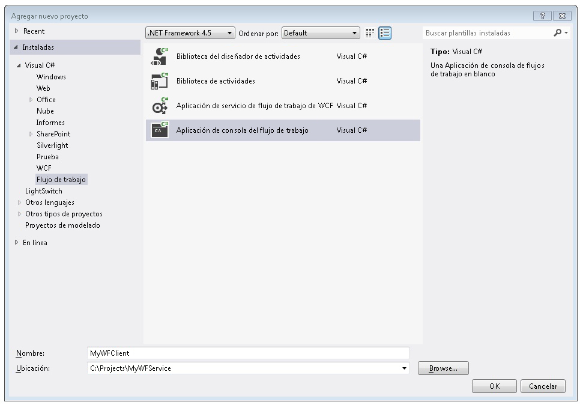
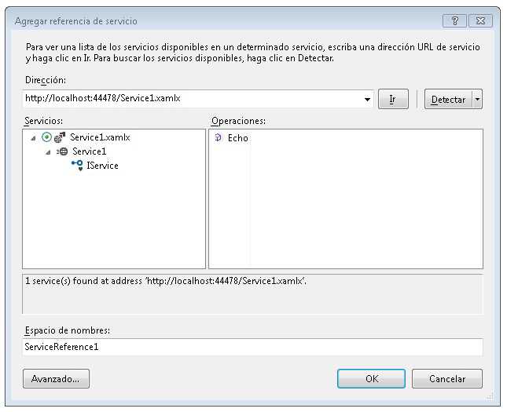
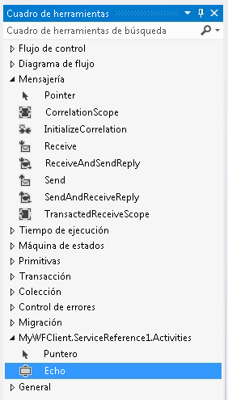
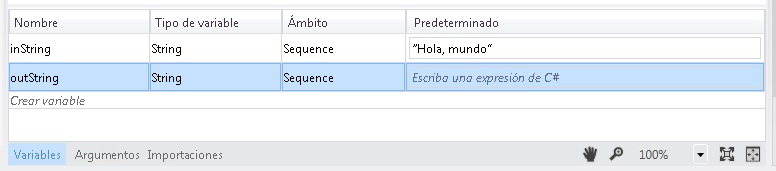
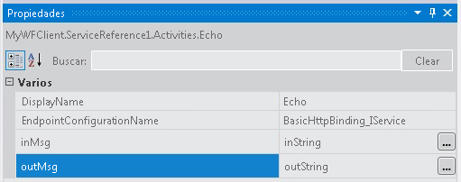
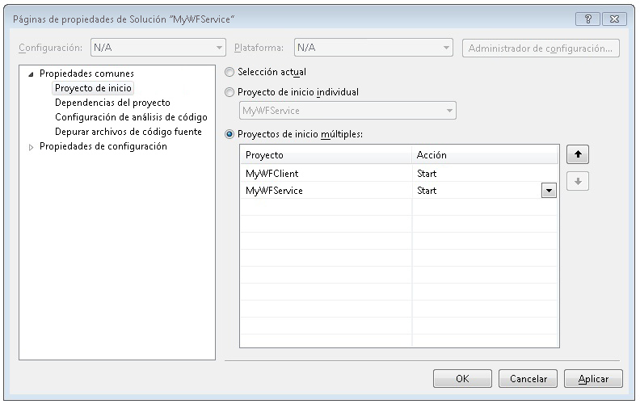

# Cómo: Tener acceso a un servicio desde una aplicación de flujo de trabajoHow To: Access a Service From a Workflow Application
En este tema, se describe cómo llamar a un servicio de flujo de trabajo desde una aplicación de consola de flujo de trabajo.This topic describes how to call a workflow service from a workflow console application. Depende de la finalización de la [Cómo: crear un servicio de flujo de trabajo con actividades de mensajería](../../../../docs/framework/wcf/feature-details/how-to-create-a-workflow-service-with-messaging-activities.md) tema.It depends on completion of the [How to: Create a Workflow Service with Messaging Activities](../../../../docs/framework/wcf/feature-details/how-to-create-a-workflow-service-with-messaging-activities.md) topic. Aunque este tema describe cómo llamar a un servicio de flujo de trabajo desde una aplicación de flujo de trabajo, se pueden usar los mismos métodos para llamar a cualquier servicio de [!INCLUDE[indigo1](../../../../includes/indigo1-md.md)] desde una aplicación de flujo de trabajo.Although this topic describes how to call a workflow service from a workflow application, the same methods can be used to call any [!INCLUDE[indigo1](../../../../includes/indigo1-md.md)] service from a workflow application.  
  
### Creación de un proyecto de aplicación de consola de flujo de trabajoCreate a Workflow Console Application Project  
  
1.  Inicie [!INCLUDE[vs_current_long](../../../../includes/vs-current-long-md.md)].Start [!INCLUDE[vs_current_long](../../../../includes/vs-current-long-md.md)].  
  
2.  Cargar el proyecto MyWFService que creó en el [Cómo: crear un servicio de flujo de trabajo con actividades de mensajería](../../../../docs/framework/wcf/feature-details/how-to-create-a-workflow-service-with-messaging-activities.md) tema.Load the MyWFService project you created in the [How to: Create a Workflow Service with Messaging Activities](../../../../docs/framework/wcf/feature-details/how-to-create-a-workflow-service-with-messaging-activities.md) topic.  
  
3.  Haga clic con el **MyWFService** solución en el **el Explorador de soluciones** y seleccione **agregar**, **nuevo proyecto**.Right click the **MyWFService** solution in the **Solution Explorer** and select **Add**, **New Project**. Seleccione **flujo de trabajo** en el **plantillas instaladas** y **aplicación de consola de flujos de trabajo** de la lista de tipos de proyecto.Select **Workflow** in the **Installed Templates** and **Workflow Console Application** from the list of project types. Denomine el MyWFClient del proyecto y use la ubicación predeterminada tal y como se muestra en la siguiente ilustración.Name the project MyWFClient and use the default location as shown in the following illustration.  
  
       
  
     Haga clic en el **Aceptar** botón para descartar la **cuadro de diálogo Agregar nuevo proyecto**.Click the **OK** button to dismiss the **Add New Project Dialog**.  
  
4.  Una vez creado el proyecto, el archivo Workflow1.xaml se abre en el diseñador.After the project is created, the Workflow1.xaml file is opened in the designer. Haga clic en el **cuadro de herramientas** ficha para abrir el cuadro de herramientas, si no está ya abierto y haga clic en el PIN para mantener abierta la ventana de cuadro de herramientas.Click the **Toolbox** tab to open the toolbox if it is not already open and click the pushpin to keep the toolbox window open.  
  
5.  Presione Ctrl + F5 para compilar y ejecutar el servicio.Press Ctrl + F5 to build and launch the service. Como antes, se inicia el servidor de desarrollo de ASP.NET e Internet Explorer muestra la página de ayuda de WCF.As before, the ASP.NET Development Server is launched and Internet Explorer displays the WCF Help Page. Observe el URI de esta página, ya que deberá usarlo en el paso siguiente.Notice the URI for this page as you must use it in the next step.  
  
       
  
6.  Haga clic con el **MyWFClient** del proyecto en el **el Explorador de soluciones** y seleccione **Agregar referencia de servicio**.Right click the **MyWFClient** project in the **Solution Explorer** and select **Add Service Reference**. Haga clic en el **Discover** botón para buscar la solución actual para cualquier servicio.Click the **Discover** button to search the current solution for any services. Haga clic en el triángulo situado junto a Service1.xamlx en la lista de servicios.Click the triangle next to Service1.xamlx in the Services list. Haga clic en el triángulo situado junto a Service1 para hacer una lista de los contratos implementados por el servicio Service1.Click the triangle next to Service1 to list the contracts implemented by the Service1 service. Expanda el **Service1** nodo en el **servicios** lista.Expand the **Service1** node in the **Services** list. La operación de eco se muestra en el **Operations** lista tal como se muestra en la siguiente ilustración.The Echo operation is displayed in the **Operations** list as shown in the following illustration.  
  
       
  
     Mantener el espacio de nombres predeterminado y haga clic en **Aceptar** para descartar la **Agregar referencia de servicio** cuadro de diálogo.Keep the default namespace and click **OK** to dismiss the **Add Service Reference** dialog. Se muestra el siguiente cuadro de diálogo.The following dialog is displayed.  
  
       
  
     Haga clic en **Aceptar** para descartar el cuadro de diálogo.Click **OK** to dismiss the dialog. Después, presione CTRL+MAYÚS+B para compilar la solución.Next, press CTRL+SHIFT+B to build the solution. Observe que en el cuadro de herramientas se ha agregado una nueva sección denominada **MyWFClient.ServiceReference1.Activities**.Notice in the toolbox a new section has been added called **MyWFClient.ServiceReference1.Activities**. Expanda esta sección y observe la actividad de eco agregada como se muestra en la siguiente ilustración.Expand this section and notice the Echo activity that has been added as shown in the following illustration.  
  
       
  
7.  Arrastre y coloque una <!--zz <xref:System.ServiceModel.Activities.Sequence>--> `System.ServiceModel.Activities.Sequence` actividad en la superficie del diseñador.Drag and drop a <!--zz <xref:System.ServiceModel.Activities.Sequence>--> `System.ServiceModel.Activities.Sequence` activity onto the designer surface. Está bajo la **flujo de Control** sección del cuadro de herramientas.It is under the **Control Flow** section of the toolbox.  
  
8.  Con el <!--zz <xref:System.ServiceModel.Activities.Sequence>--> `System.ServiceModel.Activities.Sequence` actividad en el foco, haga clic en el **Variables** vincular y agregue una variable de cadena denominada `inString`.With the <!--zz <xref:System.ServiceModel.Activities.Sequence>--> `System.ServiceModel.Activities.Sequence` activity in focus, click the **Variables** link and add a string variable named `inString`. Asigne a la variable un valor predeterminado de `"Hello, world"` , así como una variable de cadena denominada `outString` tal como se muestra en el diagrama siguiente.Give the variable a default value of `"Hello, world"` as well as a string variable named `outString` as shown in the following diagram.  
  
       
  
9. Arrastre y coloque una **Echo** actividad en el <!--zz <xref:System.ServiceModel.Activities.Sequence>--> `System.ServiceModel.Activities.Sequence`.Drag and drop an **Echo** activity into the <!--zz <xref:System.ServiceModel.Activities.Sequence>--> `System.ServiceModel.Activities.Sequence`. En la ventana Propiedades, enlace el `inMsg` argumento pasado a la `inString` variable y la `outMsg` argumento pasado a la `outString` variable tal y como se muestra en la siguiente ilustración.In the properties window bind the `inMsg` argument to the `inString` variable and the `outMsg` argument to the `outString` variable as shown in the following illustration. Esto pasa el valor de la variable `inString` a la operación y, a continuación, toma el valor devuelto y lo coloca en la variable `outString`.This passes in the value of the `inString` variable to the operation and then takes the return value and places it in the `outString` variable.  
  
       
  
10. Arrastre y coloque una **WriteLine** actividad debajo la **Echo** actividad para mostrar la cadena devuelta por la llamada al servicio.Drag and drop a **WriteLine** activity below the **Echo** activity to display the string returned by the service call. El **WriteLine** actividad se encuentra en la **primitivas** nodo en el cuadro de herramientas.The **WriteLine** activity is located in the **Primitives** node in the toolbox. Enlazar el **texto** argumento de la **WriteLine** actividad para la `outString` variable escribiendo `outString` en el cuadro de texto de la **WriteLine** actividad.Bind the **Text** argument of the **WriteLine** activity to the `outString` variable by typing `outString` into the text box on the **WriteLine** activity. El flujo de trabajo debería tener el mismo aspecto que la siguiente ilustración.The workflow should now look like the following illustration.  
  
       
  
11. Haga clic en la solución MyWFService y seleccione **Establecer proyectos de inicio...** . Seleccione el **proyectos de inicio múltiples** botón de radio y seleccione **iniciar** para cada proyecto en el **acción** columna tal y como se muestra en la siguiente ilustración.Right-click the MyWFService solution and select **Set Startup Projects ...**. Select the **Multiple startup projects** radio button and select **Start** for each project in the **Action** column as shown in the following illustration.  
  
       
  
12. Presione Ctrl + F5 para iniciar el servicio y el cliente.Press Ctrl + F5 to launch both the service and the client. El servidor de desarrollo de ASP.NET hospeda el servicio, Internet Explorer muestra la página de ayuda WCF y la aplicación de flujo de trabajo de cliente se inicia en una ventana de consola y muestra la cadena devuelta del servicio ("Hello, world").The ASP.NET Development Server hosts the service, Internet Explorer displays the WCF help page, and the client workflow application is launched in a console window and displays the string returned from the service ("Hello, world").  
  
## Vea tambiénSee Also  
 [Servicios de flujo de trabajoWorkflow Services](../../../../docs/framework/wcf/feature-details/workflow-services.md)  
 [Cómo: crear un servicio de flujo de trabajo con las actividades de mensajeríaHow to: Create a Workflow Service with Messaging Activities](../../../../docs/framework/wcf/feature-details/how-to-create-a-workflow-service-with-messaging-activities.md)  
 [Utilizar un servicio WCF desde un flujo de trabajo en un proyecto WebConsuming a WCF Service from a Workflow in a Web Project](http://go.microsoft.com/fwlink/?LinkId=207725)
