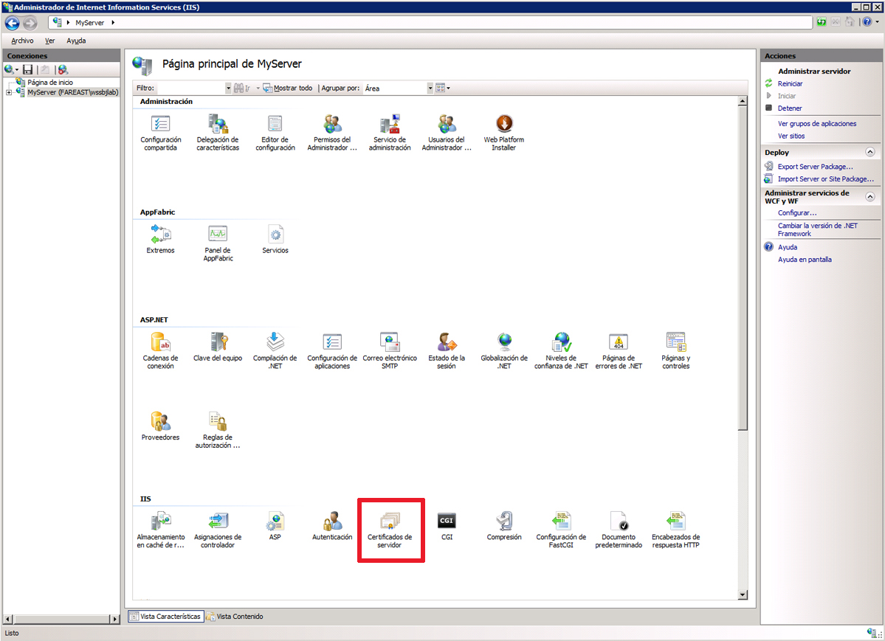
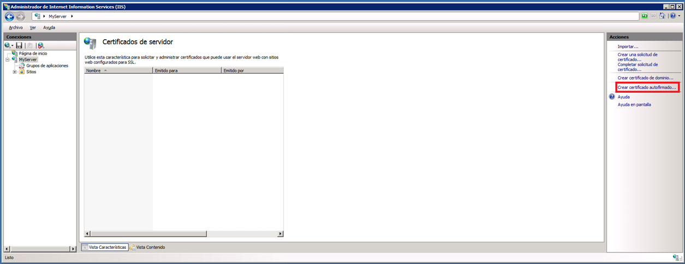
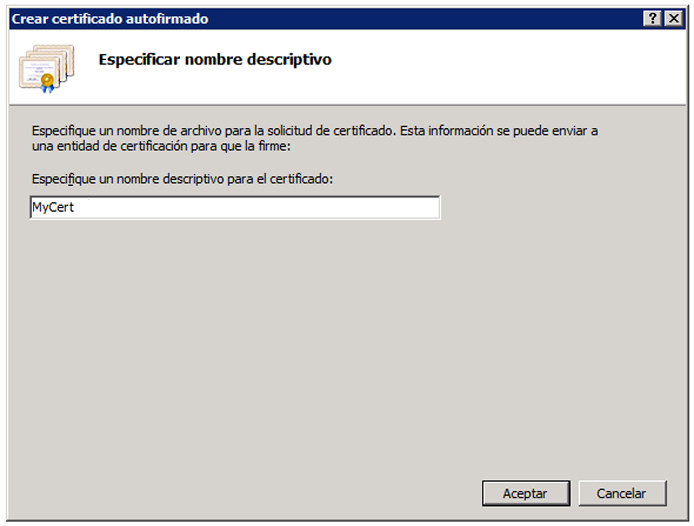
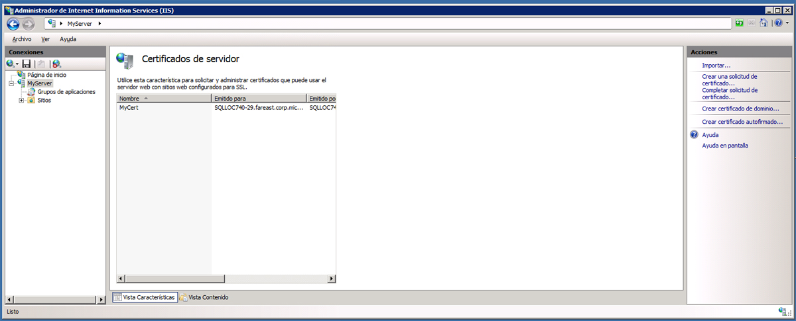
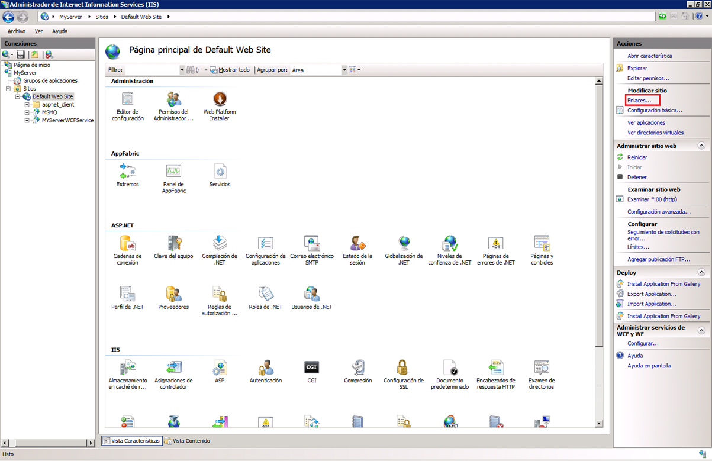
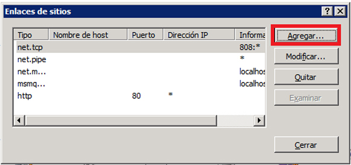
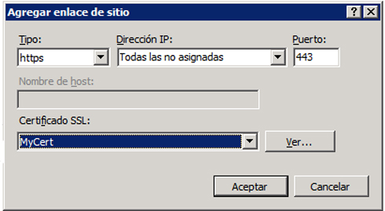
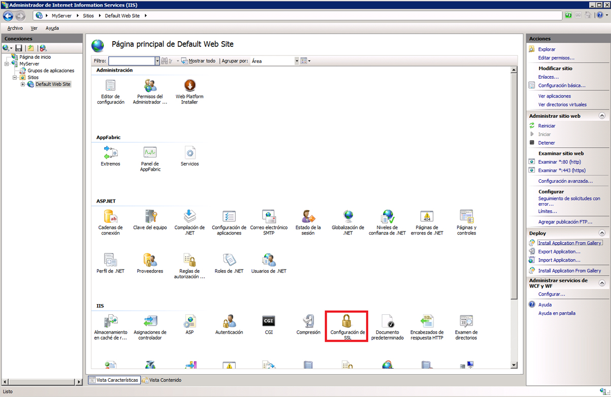
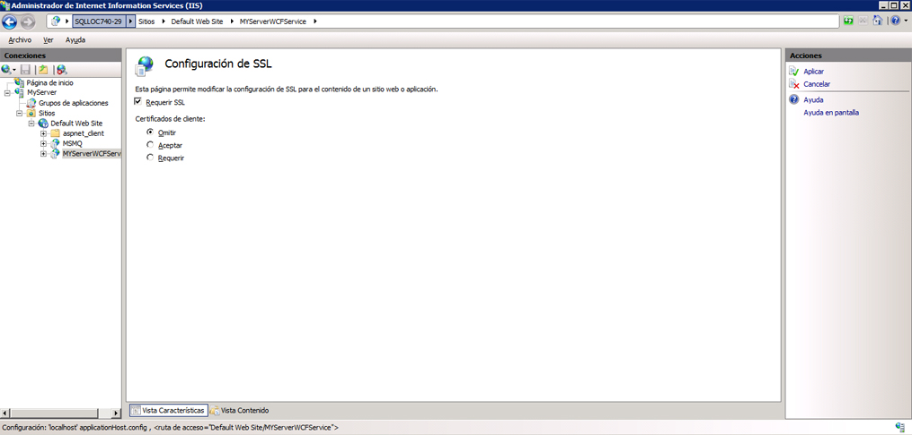

# <a name="how-to-configure-an-iis-hosted-wcf-service-with-ssl"></a><span data-ttu-id="68d50-103">Procedimiento para configurar un servicio WCF hospedado en IIS con SSL</span><span class="sxs-lookup"><span data-stu-id="68d50-103">How to: Configure an IIS-hosted WCF service with SSL</span></span>

<span data-ttu-id="68d50-104">En este tema se describe cómo configurar un servicio de WCF hospedado en IIS para usar la seguridad de transporte HTTP.</span><span class="sxs-lookup"><span data-stu-id="68d50-104">This topic describes how to set up an IIS-hosted WCF service to use HTTP transport security.</span></span> <span data-ttu-id="68d50-105">La seguridad de transporte HTTP necesita registrar un certificado SSL con IIS.</span><span class="sxs-lookup"><span data-stu-id="68d50-105">HTTP transport security requires an SSL certificate to be registered with IIS.</span></span> <span data-ttu-id="68d50-106">Si no tiene un certificado SSL puede usar IIS para generar un certificado de prueba.</span><span class="sxs-lookup"><span data-stu-id="68d50-106">If you do not have an SSL certificate you can use IIS to generate a test certificate.</span></span> <span data-ttu-id="68d50-107">Después debe agregar un enlace SSL al sitio web y configurar las propiedades de autenticación del sitio web.</span><span class="sxs-lookup"><span data-stu-id="68d50-107">Next you must add an SSL binding to the web site and configure the web site’s authentication properties.</span></span> <span data-ttu-id="68d50-108">Finalmente se debe configurar el servicio de WCF para usar HTTPS.</span><span class="sxs-lookup"><span data-stu-id="68d50-108">Finally you need to configure the WCF service to use HTTPS.</span></span>  
  
### <a name="creating-a-self-signed-certificate"></a><span data-ttu-id="68d50-109">Crear un certificado autofirmado</span><span class="sxs-lookup"><span data-stu-id="68d50-109">Creating a Self-Signed Certificate</span></span>  
  
1. <span data-ttu-id="68d50-110">Abra el Administrador de Internet Information Services (inetmgr.exe) y seleccione el nombre de equipo en la vista de árbol izquierda.</span><span class="sxs-lookup"><span data-stu-id="68d50-110">Open Internet Information Services Manager (inetmgr.exe), and select your computer name in the left-hand tree view.</span></span> <span data-ttu-id="68d50-111">En la parte derecha de la pantalla, seleccione Certificados de servidor</span><span class="sxs-lookup"><span data-stu-id="68d50-111">On the right-hand side of the screen select Server Certificates</span></span>  
  
     <span data-ttu-id="68d50-112"></span><span class="sxs-lookup"><span data-stu-id="68d50-112"></span></span>  
  
2. <span data-ttu-id="68d50-113">En la ventana certificados de servidor, haga clic en **crear Self-Signed certificado....**</span><span class="sxs-lookup"><span data-stu-id="68d50-113">In the Server Certificates window click the **Create Self-Signed Certificate….**</span></span> <span data-ttu-id="68d50-114">Vínculo.</span><span class="sxs-lookup"><span data-stu-id="68d50-114">Link.</span></span>  
  
     <span data-ttu-id="68d50-115"></span><span class="sxs-lookup"><span data-stu-id="68d50-115"></span></span>  
  
3. <span data-ttu-id="68d50-116">Escriba un nombre descriptivo para el certificado autofirmado y haga clic en **Aceptar**.</span><span class="sxs-lookup"><span data-stu-id="68d50-116">Enter a friendly name for the self-signed certificate and click **OK**.</span></span>  
  
     <span data-ttu-id="68d50-117"></span><span class="sxs-lookup"><span data-stu-id="68d50-117"></span></span>  
  
     <span data-ttu-id="68d50-118">Los detalles del certificado autofirmado recién creado se muestran ahora en la ventana **certificados de servidor** .</span><span class="sxs-lookup"><span data-stu-id="68d50-118">The newly created self-signed certificate details are now shown in the **Server Certificates** window.</span></span>  
  
     <span data-ttu-id="68d50-119"></span><span class="sxs-lookup"><span data-stu-id="68d50-119"></span></span>  
  
     <span data-ttu-id="68d50-120">El certificado generado se instala en el almacén de entidades de certificación raíz de confianza.</span><span class="sxs-lookup"><span data-stu-id="68d50-120">The generated certificate is installed in the Trusted Root Certification Authorities store.</span></span>  
  
### <a name="add-ssl-binding"></a><span data-ttu-id="68d50-121">Agregar enlace SSL</span><span class="sxs-lookup"><span data-stu-id="68d50-121">Add SSL Binding</span></span>  
  
1. <span data-ttu-id="68d50-122">En el administrador de Internet Information Services, expanda la carpeta **sitios** y, a continuación, la carpeta **sitio web predeterminado** en la vista de árbol del lado izquierdo de la pantalla.</span><span class="sxs-lookup"><span data-stu-id="68d50-122">Still in Internet Information Services Manager, expand the **Sites** folder and then the **Default Web Site** folder in the tree view on the left-hand side of the screen.</span></span>  
  
2. <span data-ttu-id="68d50-123">Haga clic en los **enlaces....**</span><span class="sxs-lookup"><span data-stu-id="68d50-123">Click the **Bindings….**</span></span> <span data-ttu-id="68d50-124">En la sección **acciones** de la parte superior derecha de la ventana.</span><span class="sxs-lookup"><span data-stu-id="68d50-124">Link in the **Actions** section in the upper right hand portion of the window.</span></span>  
  
     <span data-ttu-id="68d50-125"></span><span class="sxs-lookup"><span data-stu-id="68d50-125"></span></span>  
  
3. <span data-ttu-id="68d50-126">En la ventana enlaces de sitios, haga clic en el botón **Agregar** .</span><span class="sxs-lookup"><span data-stu-id="68d50-126">In the Site Bindings window click the **Add** button.</span></span>  
  
     <span data-ttu-id="68d50-127"></span><span class="sxs-lookup"><span data-stu-id="68d50-127"></span></span>  
  
4. <span data-ttu-id="68d50-128">En el cuadro de diálogo **Agregar enlace de sitio** , seleccione https como el tipo y el nombre descriptivo del certificado autofirmado que acaba de crear.</span><span class="sxs-lookup"><span data-stu-id="68d50-128">In the **Add Site Binding** dialog, select https for the type and the friendly name of the self-signed certificate you just created.</span></span>  
  
     <span data-ttu-id="68d50-129"></span><span class="sxs-lookup"><span data-stu-id="68d50-129"></span></span>  
  
### <a name="configure-virtual-directory-for-ssl"></a><span data-ttu-id="68d50-130">Configurar el directorio virtual para SSL</span><span class="sxs-lookup"><span data-stu-id="68d50-130">Configure Virtual Directory for SSL</span></span>  
  
1. <span data-ttu-id="68d50-131">En el Administrador de Internet Information Services, seleccione el directorio virtual que contiene el servicio seguro de WCF.</span><span class="sxs-lookup"><span data-stu-id="68d50-131">Still in Internet Information Services Manager, select the virtual directory that contains your WCF secure service.</span></span>  
  
2. <span data-ttu-id="68d50-132">En el panel central de la ventana, seleccione **configuración de SSL** en la sección IIS.</span><span class="sxs-lookup"><span data-stu-id="68d50-132">In the center pane of the window, select **SSL Settings** in the IIS section.</span></span>  
  
     <span data-ttu-id="68d50-133"></span><span class="sxs-lookup"><span data-stu-id="68d50-133"></span></span>  
  
3. <span data-ttu-id="68d50-134">En el panel Configuración de SSL, active la casilla **requerir SSL** y haga clic en el vínculo **aplicar** en la sección **acciones** en la parte derecha de la pantalla.</span><span class="sxs-lookup"><span data-stu-id="68d50-134">In the SSL Settings pane, select the **Require SSL** checkbox and click the **Apply** link in the **Actions** section on the right hand side of the screen.</span></span>  
  
     <span data-ttu-id="68d50-135"></span><span class="sxs-lookup"><span data-stu-id="68d50-135"></span></span>  
  
### <a name="configure-wcf-service-for-http-transport-security"></a><span data-ttu-id="68d50-136">Configurar el servicio WCF para la seguridad de transporte HTTP</span><span class="sxs-lookup"><span data-stu-id="68d50-136">Configure WCF Service for HTTP Transport Security</span></span>  
  
1. <span data-ttu-id="68d50-137">En el archivo web.config del servicio de WCF, configure el enlace HTTP para usar seguridad de transporte como se muestra en el siguiente código XML.</span><span class="sxs-lookup"><span data-stu-id="68d50-137">In the WCF service’s web.config configure the HTTP binding to use transport security as shown in the following XML.</span></span>  
  
    ```xml  
    <bindings>  
          <basicHttpBinding>  
            <binding name="secureHttpBinding">  
              <security mode="Transport">  
                <transport clientCredentialType="None"/>  
              </security>  
            </binding>  
          </basicHttpBinding>  
    </bindings>  
    ```  
  
2. <span data-ttu-id="68d50-138">Especifique el servicio y el punto de conexión del servicio tal y como se muestra en el siguiente código XML.</span><span class="sxs-lookup"><span data-stu-id="68d50-138">Specify your service and service endpoint as shown in the following XML.</span></span>  
  
    ```xml  
    <services>  
          <service name="MySecureWCFService.Service1">  
            <endpoint address=""  
                      binding="basicHttpBinding"  
                      bindingConfiguration="secureHttpBinding"  
                      contract="MySecureWCFService.IService1"/>  
  
            <endpoint address="mex"  
                      binding="mexHttpsBinding"  
                      contract="IMetadataExchange" />  
          </service>  
    </services>  
    ```  
  
## <a name="example"></a><span data-ttu-id="68d50-139">Ejemplo</span><span class="sxs-lookup"><span data-stu-id="68d50-139">Example</span></span>  

 <span data-ttu-id="68d50-140">A continuación se muestra un ejemplo completo de un archivo web.config para un servicio de WCF mediante la seguridad de transporte HTTP</span><span class="sxs-lookup"><span data-stu-id="68d50-140">The following is a complete example of a web.config file for a WCF service using HTTP transport security</span></span>  
  
```xml  
<?xml version="1.0"?>  
<configuration>  
  
  <system.web>  
    <compilation debug="true" targetFramework="4.0" />  
  </system.web>  
  <system.serviceModel>  
    <services>  
      <service name="MySecureWCFService.Service1">  
        <endpoint address=""  
                  binding="basicHttpBinding"  
                  bindingConfiguration="secureHttpBinding"  
                  contract="MySecureWCFService.IService1"/>  
  
        <endpoint address="mex"  
                  binding="mexHttpsBinding"  
                  contract="IMetadataExchange" />  
      </service>  
    </services>  
    <bindings>  
      <basicHttpBinding>  
        <binding name="secureHttpBinding">  
          <security mode="Transport">  
            <transport clientCredentialType="None"/>  
          </security>  
        </binding>  
      </basicHttpBinding>  
    </bindings>  
    <behaviors>  
      <serviceBehaviors>  
        <behavior>  
          <!-- To avoid disclosing metadata information, set the value below to false and remove the metadata endpoint above before deployment -->  
          <serviceMetadata httpsGetEnabled="true"/>  
          <!-- To receive exception details in faults for debugging purposes, set the value below to true.  Set to false before deployment to avoid disclosing exception information -->  
          <serviceDebug includeExceptionDetailInFaults="false"/>  
        </behavior>  
      </serviceBehaviors>  
    </behaviors>  
    <serviceHostingEnvironment multipleSiteBindingsEnabled="true" />  
  </system.serviceModel>  
  <system.webServer>  
    <modules runAllManagedModulesForAllRequests="true"/>  
  </system.webServer>  
  
</configuration>  
```  
  
## <a name="see-also"></a><span data-ttu-id="68d50-141">Vea también</span><span class="sxs-lookup"><span data-stu-id="68d50-141">See also</span></span>

- [<span data-ttu-id="68d50-142">Hospedaje en Internet Information Services</span><span class="sxs-lookup"><span data-stu-id="68d50-142">Hosting in Internet Information Services</span></span>](hosting-in-internet-information-services.md)
- [<span data-ttu-id="68d50-143">Instrucciones de hospedaje Internet Information Services</span><span class="sxs-lookup"><span data-stu-id="68d50-143">Internet Information Service Hosting Instructions</span></span>](../samples/internet-information-service-hosting-instructions.md)
- [<span data-ttu-id="68d50-144">Procedimientos recomendados de hospedaje de Internet Information Services</span><span class="sxs-lookup"><span data-stu-id="68d50-144">Internet Information Services Hosting Best Practices</span></span>](internet-information-services-hosting-best-practices.md)
- [<span data-ttu-id="68d50-145">Hospedaje de IIS utilizando código en línea</span><span class="sxs-lookup"><span data-stu-id="68d50-145">IIS Hosting Using Inline Code</span></span>](../samples/iis-hosting-using-inline-code.md)
