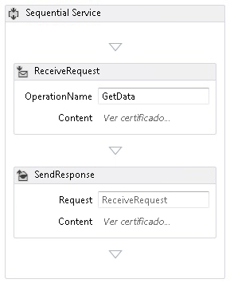
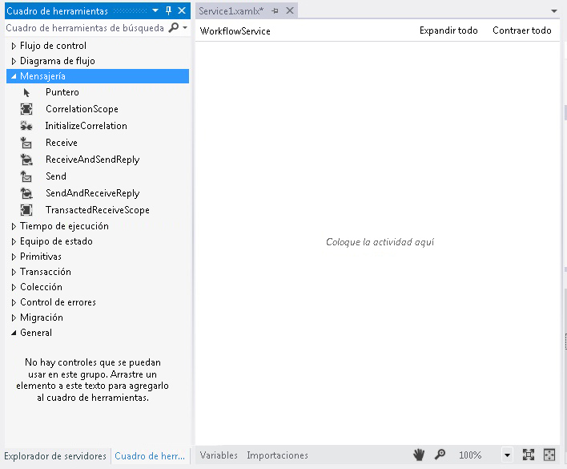
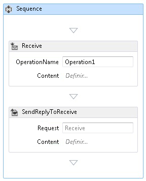
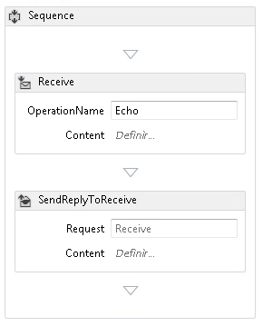
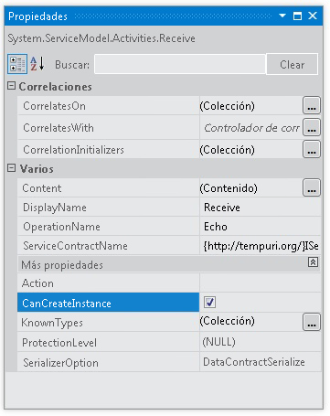
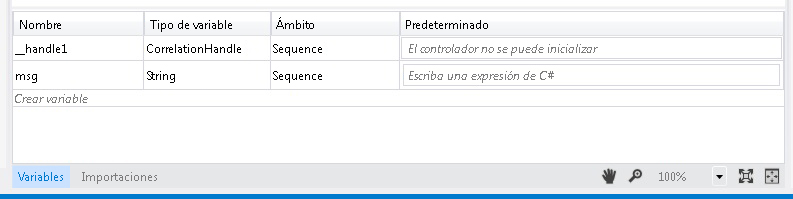
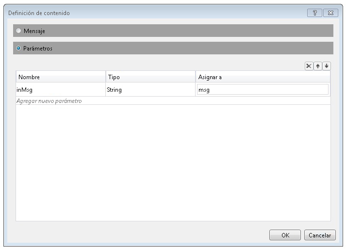
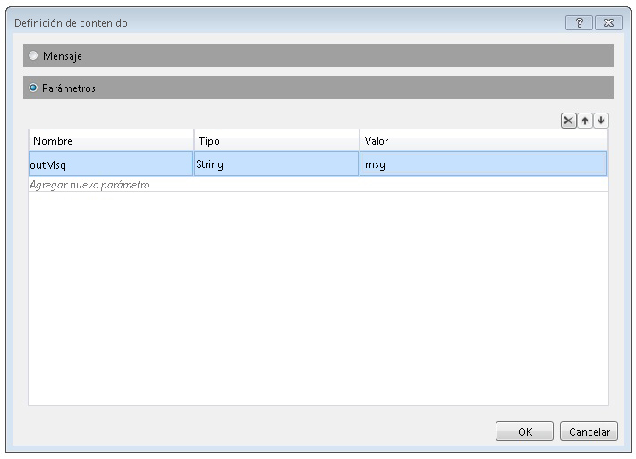
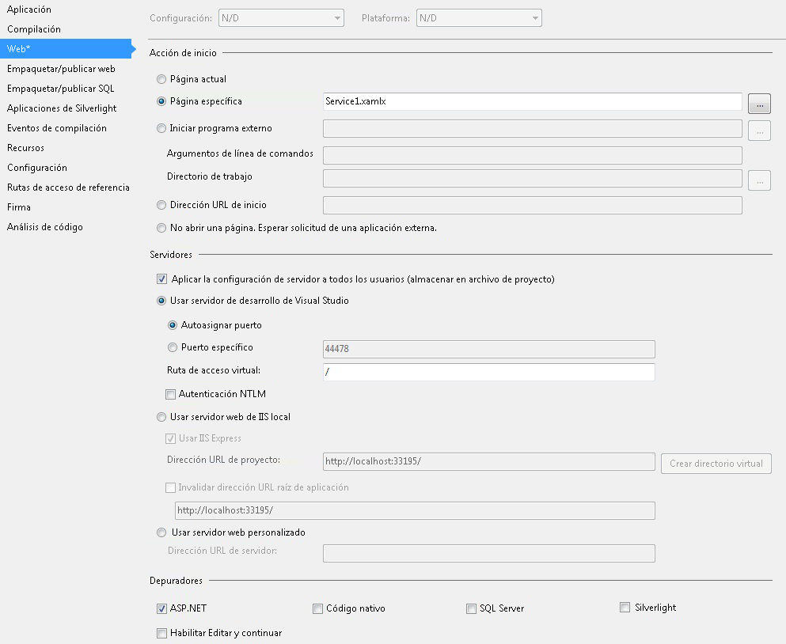

# C&#243;mo: Crear un servicio de flujo de trabajo con actividades de mensajer&#237;a
En este tema, se describe cómo crear un servicio de flujo de trabajo simple mediante actividades de mensajería.  Este tema se centra en los sistemas de creación de un servicio de flujo de trabajo compuesto solo por actividades de mensajería.  En un servicio real, el flujo de trabajo contiene muchas otras actividades.  El servicio implementa una operación denominada Eco, que toma una cadena y la devuelve al autor de la llamada.  Este tema es el primero en una serie de dos temas.  El tema siguiente, [Cómo: Tener acceso a un servicio desde una aplicación de flujo de trabajo](../../../../docs/framework/wcf/feature-details/how-to-access-a-service-from-a-workflow-application.md), describe cómo crear una aplicación de flujo de trabajo que pueda llamar al servicio creado en este tema.  
  
### Para crear un proyecto de servicio de flujo de trabajo  
  
1.  Inicie [!INCLUDE[vs_current_long](../../../../includes/vs-current-long-md.md)].  
  
2.  Haga clic en el menú **Archivo**, seleccione **Nuevo** y, a continuación, **Proyecto** para mostrar el cuadro de diálogo **Nuevo proyecto**.  Seleccione **Flujo de trabajo** en la lista de plantillas instaladas, y **Aplicación de servicio de flujo de trabajo WCF** en la lista de tipos de proyecto.  Denomine el `MyWFService` del proyecto y use la ubicación predeterminada como se muestra en la siguiente ilustración.  
  
     Haga clic en el botón **Aceptar** para descartar el cuadro de diálogo **Nuevo proyecto**.  
  
3.  Cuando se crea el proyecto, el archivo Service1.xamlx se abre en el diseñador tal y como se muestra en la siguiente ilustración.  
  
       
  
     Haga clic con el botón secundario del mouse en la actividad etiquetada como **Servicio secuencial** y seleccione **Eliminar**.  
  
### Para implementar el servicio de flujo de trabajo  
  
1.  Seleccione la pestaña **Cuadro de herramientas** en el lado izquierdo de la pantalla para mostrar el cuadro de herramientas y haga clic en el pin para mantener la ventana abierta.  Expanda la sección **Mensajería** del cuadro de herramientas para mostrar las actividades de mensajería y las plantillas de actividades de mensajería, tal y como se muestra en la siguiente ilustración.  
  
       
  
2.  Arrastre y coloque una plantilla **ReceiveAndSendReply** en el diseñador de flujo de trabajo.  De esta forma se crea una actividad de <xref:System.ServiceModel.Activities.Sequence> con una actividad **Recibir** seguida de una actividad de <xref:System.ServiceModel.Activities.SendReply>, tal y como se muestra en la siguiente ilustración.  
  
       
  
     Tenga en cuenta que la propiedad <xref:System.ServiceModel.Activities.SendReply> de la actividad <xref:System.ServiceModel.Activities.SendReply.Request%2A> está establecida en `Receive`, el nombre de la actividad <xref:System.ServiceModel.Activities.Receive> a la que responde la actividad <xref:System.ServiceModel.Activities.SendReply>.  
  
3.  En la actividad <xref:System.ServiceModel.Activities.Receive>, escriba `Eco` en el cuadro de texto denominado **OperationName**.  Esto define el nombre de la operación que implementa el servicio.  
  
       
  
4.  Con la actividad <xref:System.ServiceModel.Activities.Receive> seleccionada, abra la ventana de propiedades, si aún no lo está, mediante un clic en el menú **Ver** y seleccionando la ventana **Propiedades**.  En la ventana **Propiedades**, desplácese hacia abajo hasta que vea **CanCreateInstance** y haga clic en la casilla, tal y como se muestra en la siguiente ilustración.  Esta opción permite que el host de servicio de flujo de trabajo cree una nueva instancia del servicio, si es necesario, cuando se recibe un mensaje.  
  
       
  
5.  Seleccione la actividad <xref:System.ServiceModel.Activities.Sequence> y haga clic en el botón **Variables** en la esquina inferior izquierda del diseñador.  Esto muestra el editor de variables.  Haga clic en el vínculo **Crear variable** para agregar una variable para almacenar la cadena enviada a la operación.  Denomine la variable `msg` y establezca el tipo de **Variable** como Cadena, tal y como se muestra en la siguiente ilustración.  
  
       
  
     Haga clic de nuevo en el botón **Variables** para cerrar el editor de variables.  
  
6.  Haga clic en el vínculo **Definir...** en el cuadro de texto **Contenido** de la actividad <xref:System.ServiceModel.Activities.Receive> para mostrar el cuadro de diálogo **Definición de contenido**.  Seleccione el botón de radio **Parámetros**, haga clic en el vínculo **Agregar nuevo parámetro**, escriba `inMsg` en el cuadro de texto del **nombre**, seleccione **Cadena** en el cuadro de lista desplegable **Tipo** y escriba `msg` en el cuadro de texto **Asignar a**, tal y como se muestra en la siguiente ilustración.  
  
       
  
     Esto especifica que la actividad de recepción recibe el parámetro de cadena y que los datos se enlazan a la variable `msg`.  Al finalizar, haga clic en **Aceptar** para cerrar el cuadro de diálogo **Definición de contenido**.  
  
7.  Haga clic en el vínculo **Definir...** en el cuadro **Contenido** de la actividad <xref:System.ServiceModel.Activities.SendReply> para mostrar el cuadro de diálogo **Definición de contenido**.  Seleccione el botón de radio **Parámetros**, haga clic en el vínculo **Agregar nuevo Parámetro**, escriba `msg` en el cuadro de texto del **nombre**, seleccione **Cadena** en el cuadro de lista desplegable **Tipo** y `msg` en el cuadro de texto **Valor**, tal y como se muestra en la siguiente ilustración.  
  
       
  
     Esto especifica que la actividad <xref:System.ServiceModel.Activities.SendReply> envía un mensaje o un tipo de contrato de mensaje y esos datos están enlazados a la variable `msg`.  Dado que ésta es una actividad <xref:System.ServiceModel.Activities.SendReply>, esto significa que los datos de `msg` se usan para rellenar el mensaje que la actividad devuelve al cliente.  Al finalizar, haga clic en **Aceptar** para cerrar el cuadro de diálogo **Definición de contenido**.  
  
8.  Guarde y compile la solución haciendo clic en el menú **Compilar** y seleccionando **Compilar solución**.  
  
## Configuración del proyecto de servicio de flujo de trabajo  
 El servicio del flujo de trabajo ha finalizado.  En esta sección, se explica cómo configurar la solución de servicio de flujo de trabajo para facilitar el hospedaje y la ejecución.  Esta solución usa el servidor de desarrollo de ASP.NET para hospedar el servicio.  
  
#### Para establecer opciones de inicio de proyecto  
  
1.  En el **Explorador de soluciones**, haga clic con el botón secundario en **MyWFService** y seleccione **Propiedades** para mostrar el cuadro de diálogo **Propiedades del proyecto**.  
  
2.  Seleccione la pestaña **Web** y seleccione **Página específica** en **Acción de inicio**. A continuación, escriba `Service1.xamlx` en el cuadro de texto, tal y como se muestra en la siguiente ilustración.  
  
       
  
     Esto hospeda el servicio definido en Service1.xamlx en el servidor de desarrollo de ASP.NET.  
  
3.  Presione Ctrl \+ F5 para iniciar el servicio.  El icono del servidor de desarrollo de ASP.NET se muestra en el lado inferior derecho del escritorio, tal y como se muestra en la siguiente imagen.  
  
       
  
     Además, Internet Explorer muestra la página de ayuda del servicio WCF para el servicio.  
  
       
  
4.  Vaya al tema [Cómo: Tener acceso a un servicio desde una aplicación de flujo de trabajo](../../../../docs/framework/wcf/feature-details/how-to-access-a-service-from-a-workflow-application.md) para crear un cliente de flujo de trabajo que llame a este servicio.  
  
## Vea también  
 [Servicios de flujo de trabajo](../../../../docs/framework/wcf/feature-details/workflow-services.md)   
 [Hospedar información general de servicios de flujo de trabajo](../../../../docs/framework/wcf/feature-details/hosting-workflow-services-overview.md)   
 [Actividades de mensajería](../../../../docs/framework/wcf/feature-details/messaging-activities.md)