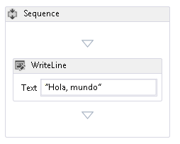
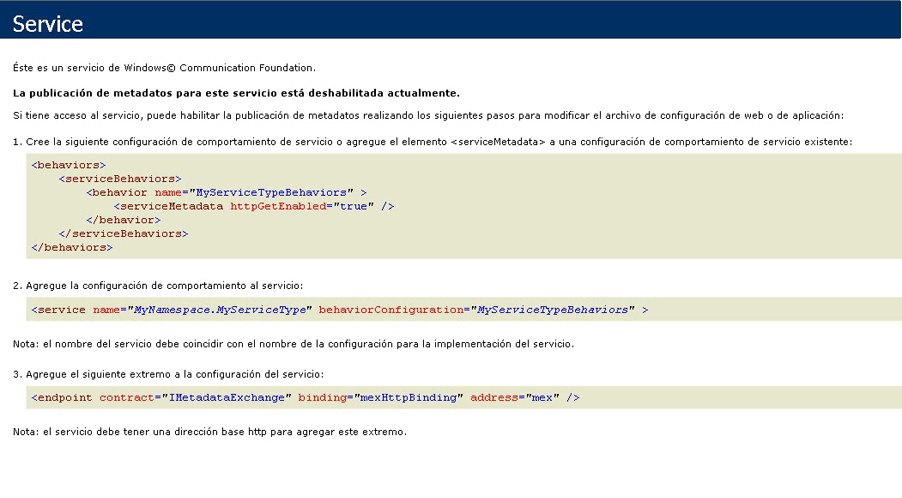

# <a name="how-to-host-a-non-service-workflow-in-iis"></a><span data-ttu-id="868ff-102">Cómo: Hospedar un flujo de trabajo no perteneciente al servicio en IIS</span><span class="sxs-lookup"><span data-stu-id="868ff-102">How to: Host a non-service workflow in IIS</span></span>
<span data-ttu-id="868ff-103">Los flujos de trabajo que no sean servicios de flujo de trabajo se pueden hospedar en IIS/WAS.</span><span class="sxs-lookup"><span data-stu-id="868ff-103">Workflows that are not workflow services can be hosted under IIS/WAS.</span></span> <span data-ttu-id="868ff-104">Esto es útil cuando deba hospedar un flujo de trabajo escrito por otra persona.</span><span class="sxs-lookup"><span data-stu-id="868ff-104">This is useful when you need to host a workflow written by somebody else.</span></span> <span data-ttu-id="868ff-105">Por ejemplo, si hospeda en otro host el diseñador de flujo de trabajo y permite a los usuarios que creen sus propios flujos de trabajo.</span><span class="sxs-lookup"><span data-stu-id="868ff-105">For example, if you rehost the workflow designer and allow users to create their own workflows.</span></span>  <span data-ttu-id="868ff-106">Si se hospedan flujos de trabajo no pertenecientes al servicio en IIS, se proporciona compatibilidad con características como el reciclaje de proceso, el apagado por inactividad, la supervisión del estado de los procesos y la activación basada en mensajes.</span><span class="sxs-lookup"><span data-stu-id="868ff-106">Hosting non-service workflows in IIS provides support for features like process recycling, idle shutdown, process health monitoring, and message-based activation.</span></span> <span data-ttu-id="868ff-107">Los servicios de flujo de trabajo hospedados en IIS contienen actividades de la clase <xref:System.ServiceModel.Activities.Receive> y se activan cuando IIS recibe un mensaje.</span><span class="sxs-lookup"><span data-stu-id="868ff-107">Workflow services hosted in IIS contain <xref:System.ServiceModel.Activities.Receive> activities and are activated when a message is received by IIS.</span></span> <span data-ttu-id="868ff-108">Los flujos de trabajo no pertenecientes al servicio no contienen actividades de mensajería y no se pueden activar enviando un mensaje de forma predeterminada.</span><span class="sxs-lookup"><span data-stu-id="868ff-108">Non-service workflows do not contain messaging activities, and by default cannot be activated by sending a message.</span></span>  <span data-ttu-id="868ff-109">Debe derivar una clase de la clase <xref:System.ServiceModel.Activities.WorkflowHostingEndpoint> y definir un contrato de servicio que contenga operaciones para crear una instancia de flujo de trabajo.</span><span class="sxs-lookup"><span data-stu-id="868ff-109">You must derive a class from <xref:System.ServiceModel.Activities.WorkflowHostingEndpoint> and define a service contract that contains operations to create an instance of the workflow.</span></span> <span data-ttu-id="868ff-110">Este tema le guiará a través de la creación de un flujo de trabajo simple, definir un contrato de servicio que un cliente puede utilizar para activar el flujo de trabajo y derivar una clase de <xref:System.ServiceModel.Activities.WorkflowHostingEndpoint> que utiliza el contrato de servicio para escuchar las solicitudes de creación de flujo de trabajo.</span><span class="sxs-lookup"><span data-stu-id="868ff-110">This topic will walk you through creating a simple workflow, defining a service contract a client can use to activate the workflow, and deriving a class from <xref:System.ServiceModel.Activities.WorkflowHostingEndpoint> which uses the service contract to listen for workflow creating requests.</span></span>  
  
### <a name="create-a-simple-workflow"></a><span data-ttu-id="868ff-111">Crear un flujo de trabajo simple</span><span class="sxs-lookup"><span data-stu-id="868ff-111">Create a simple workflow</span></span>  
  
1.  <span data-ttu-id="868ff-112">Cree una nueva solución de [!INCLUDE[vs_current_long](../../../../includes/vs-current-long-md.md)] vacía denominada `CreationEndpointTest`.</span><span class="sxs-lookup"><span data-stu-id="868ff-112">Create a new [!INCLUDE[vs_current_long](../../../../includes/vs-current-long-md.md)] empty solution called `CreationEndpointTest`.</span></span>  
  
2.  <span data-ttu-id="868ff-113">Agregue un nuevo proyecto de aplicación de servicio de flujo de trabajo WCF denominado `SimpleWorkflow` a la solución.</span><span class="sxs-lookup"><span data-stu-id="868ff-113">Add a new WCF Workflow Service Application project called `SimpleWorkflow` to the solution.</span></span> <span data-ttu-id="868ff-114">Se abrirá el diseñador de flujo de trabajo.</span><span class="sxs-lookup"><span data-stu-id="868ff-114">The workflow designer will open.</span></span>  
  
3.  <span data-ttu-id="868ff-115">Elimine las actividades ReceiveRequest y SendResponse.</span><span class="sxs-lookup"><span data-stu-id="868ff-115">Delete the ReceiveRequest and SendResponse activities.</span></span> <span data-ttu-id="868ff-116">Estas actividades son las que convierten un flujo de trabajo en un servicio de flujo de trabajo.</span><span class="sxs-lookup"><span data-stu-id="868ff-116">These activities are what makes a workflow a workflow service.</span></span> <span data-ttu-id="868ff-117">Puesto que no estamos trabajando con un servicio de flujo de trabajo, ya no las necesitamos.</span><span class="sxs-lookup"><span data-stu-id="868ff-117">Since we are not working with a workflow service, we no longer need them.</span></span>  
  
4.  <span data-ttu-id="868ff-118">Establezca el valor de DisplayName para la actividad de secuencia a "Flujo de trabajo secuencial".</span><span class="sxs-lookup"><span data-stu-id="868ff-118">Set the DisplayName for the sequence activity to "Sequential Workflow".</span></span>  
  
5.  <span data-ttu-id="868ff-119">Cambie el nombre de Service1.xamlx a Workflow1.xamlx.</span><span class="sxs-lookup"><span data-stu-id="868ff-119">Rename Service1.xamlx to Workflow1.xamlx.</span></span>  
  
6.  <span data-ttu-id="868ff-120">Haga clic en el diseñador fuera de la actividad de secuencia y establezca las propiedades Name y ConfigurationName en "Workflow1"</span><span class="sxs-lookup"><span data-stu-id="868ff-120">Click the designer outside of the sequence activity, and set the Name and ConfigurationName properties to "Workflow1"</span></span>  
  
7.  <span data-ttu-id="868ff-121">Arrastre una actividad <xref:System.Activities.Statements.WriteLine> a la clase <xref:System.Activities.Statements.Sequence>.</span><span class="sxs-lookup"><span data-stu-id="868ff-121">Drag a <xref:System.Activities.Statements.WriteLine> activity into the <xref:System.Activities.Statements.Sequence>.</span></span> <span data-ttu-id="868ff-122">El <xref:System.Activities.Statements.WriteLine> actividad puede encontrarse en el **primitivas** sección del cuadro de herramientas.</span><span class="sxs-lookup"><span data-stu-id="868ff-122">The <xref:System.Activities.Statements.WriteLine> activity can be found in the **Primitives** section of the toolbox.</span></span> <span data-ttu-id="868ff-123">Establecer el <xref:System.Activities.Statements.WriteLine.Text%2A> propiedad de la <xref:System.Activities.Statements.WriteLine> actividad a "Hola, mundo".</span><span class="sxs-lookup"><span data-stu-id="868ff-123">Set the <xref:System.Activities.Statements.WriteLine.Text%2A> property of the <xref:System.Activities.Statements.WriteLine> activity to "Hello, world".</span></span>  
  
     <span data-ttu-id="868ff-124">El flujo de trabajo ahora debe tener la misma apariencia que la del siguiente diagrama.</span><span class="sxs-lookup"><span data-stu-id="868ff-124">The workflow should now look like the following diagram.</span></span>  
  
     <span data-ttu-id="868ff-125"></span><span class="sxs-lookup"><span data-stu-id="868ff-125"></span></span>  
  
### <a name="create-the-workflow-creation-service-contract"></a><span data-ttu-id="868ff-126">Crear el contrato de servicio de creación del flujo de trabajo</span><span class="sxs-lookup"><span data-stu-id="868ff-126">Create the workflow creation service contract</span></span>  
  
1.  <span data-ttu-id="868ff-127">Agregue un nuevo proyecto de biblioteca de clases denominado `Shared` a la solución `CreationEndpointTest`.</span><span class="sxs-lookup"><span data-stu-id="868ff-127">Add a new class library project called `Shared` to the `CreationEndpointTest` solution.</span></span>  
  
2.  <span data-ttu-id="868ff-128">Agregue una referencia a System.ServiceModel.dll, System.Configuration y System.ServiceModel.Activities al proyecto `Shared`.</span><span class="sxs-lookup"><span data-stu-id="868ff-128">Add a reference to System.ServiceModel.dll, System.Configuration, and System.ServiceModel.Activities to the `Shared` project.</span></span>  
  
3.  <span data-ttu-id="868ff-129">Cambie el nombre del archivo Class1.cs a IWorkflowCreation.cs y agregue el siguiente código al archivo.</span><span class="sxs-lookup"><span data-stu-id="868ff-129">Rename the Class1.cs file to IWorkflowCreation.cs and the following code to the file.</span></span>  
  
    ```  
    using System;  
    using System.Collections.Generic;  
    using System.Linq;  
    using System.Text;  
    using System.ServiceModel;  
  
    namespace Shared  
    {  
        //service contract exposed from the endpoint  
        [ServiceContract(Name = "IWorkflowCreation")]  
        public interface IWorkflowCreation  
        {  
            [OperationContract(Name = "Create")]  
            Guid Create(IDictionary<string, object> inputs);  
  
            [OperationContract(Name = "CreateWithInstanceId", IsOneWay = true)]  
            void CreateWithInstanceId(IDictionary<string, object> inputs, Guid instanceId);  
        }  
    }  
    ```  
  
     <span data-ttu-id="868ff-130">Este contrato define dos operaciones que crean una nueva instancia de flujo de trabajo no perteneciente al servicio que acaba de crear.</span><span class="sxs-lookup"><span data-stu-id="868ff-130">This contract defines two operations both create a new instance of the non-service workflow you just created.</span></span> <span data-ttu-id="868ff-131">Una crea una nueva instancia con un identificador de instancia generado y la otra permite especificar el identificador de instancia de la nueva instancia de flujo de trabajo.</span><span class="sxs-lookup"><span data-stu-id="868ff-131">One creates a new instance with a generated instance ID and the other allows you to specify the instance ID for the new workflow instance.</span></span>  <span data-ttu-id="868ff-132">Ambos métodos permiten pasar parámetros a la nueva instancia de flujo de trabajo.</span><span class="sxs-lookup"><span data-stu-id="868ff-132">Both methods allow you to pass in parameters to the new workflow instance.</span></span> <span data-ttu-id="868ff-133">Este contrato lo expondrá la <xref:System.ServiceModel.Activities.WorkflowHostingEndpoint> para permitir a los clientes crear nuevas instancias de un flujo de trabajo no pertenecientes al servicio.</span><span class="sxs-lookup"><span data-stu-id="868ff-133">This contract will be exposed by the <xref:System.ServiceModel.Activities.WorkflowHostingEndpoint> to allow clients to create new instances of a non-service workflow.</span></span>  
  
### <a name="derive-a-class-from-workflowhostingendpoint"></a><span data-ttu-id="868ff-134">Derivar una clase de WorkflowHostingEndpoint</span><span class="sxs-lookup"><span data-stu-id="868ff-134">Derive a class from WorkflowHostingEndpoint</span></span>  
  
1.  <span data-ttu-id="868ff-135">Agregue una nueva clase denominada `CreationEndpoint` deriva <xref:System.ServiceModel.Activities.WorkflowHostingEndpoint> a la `Shared` proyecto.</span><span class="sxs-lookup"><span data-stu-id="868ff-135">Add a new class called `CreationEndpoint` derived from <xref:System.ServiceModel.Activities.WorkflowHostingEndpoint> to the `Shared` project.</span></span>  
  
    ```  
    using System;  
    using System.Collections.Generic;  
    using System.Diagnostics;  
    using System.Globalization;  
    using System.ServiceModel;  
    using System.ServiceModel.Activities;  
    using System.ServiceModel.Channels;  
  
    namespace Shared  
    {  
        public class CreationEndpoint : WorkflowHostingEndpoint  
        {  
        }  
    }  
    ```  
  
2.  <span data-ttu-id="868ff-136">Agregue una variable de la clase <xref:System.Uri> estática local denominada `defaultBaseUri` a la clase `CreationEndpoint`.</span><span class="sxs-lookup"><span data-stu-id="868ff-136">Add a local static <xref:System.Uri> variable called `defaultBaseUri` to the `CreationEndpoint` class.</span></span>  
  
    ```  
    public class CreationEndpoint : WorkflowHostingEndpoint  
    {  
        static Uri defaultBaseUri;  
    }  
    ```  
  
3.  <span data-ttu-id="868ff-137">Agregue el siguiente constructor a la clase `CreationEndpoint`.</span><span class="sxs-lookup"><span data-stu-id="868ff-137">Add the following constructor to the `CreationEndpoint` class.</span></span> <span data-ttu-id="868ff-138">Observe que especificamos el contrato de servicio `IWorkflowCreation` en la llamada al constructor base.</span><span class="sxs-lookup"><span data-stu-id="868ff-138">Notice we specify the `IWorkflowCreation` service contract in the call to the base constructor.</span></span>  
  
    ```  
    public CreationEndpoint(Binding binding, EndpointAddress address)  
       : base(typeof(IWorkflowCreation), binding, address)  
       {  
       }  
    ```  
  
4.  <span data-ttu-id="868ff-139">Agregue el siguiente constructor predeterminado a la clase `CreationEndpoint`.</span><span class="sxs-lookup"><span data-stu-id="868ff-139">Add the following default constructor to the `CreationEndpoint` class.</span></span>  
  
    ```  
    public CreationEndpoint()  
       : this(GetDefaultBinding(),  
       new EndpointAddress(new Uri(DefaultBaseUri, new Uri(Guid.NewGuid().ToString(), UriKind.Relative))))  
       {  
       }  
    ```  
  
5.  <span data-ttu-id="868ff-140">Agregue una propiedad `DefaultBaseUri` estática a la clase `CreationEndpoint`.</span><span class="sxs-lookup"><span data-stu-id="868ff-140">Add a static `DefaultBaseUri` property to the `CreationEndpoint` class.</span></span> <span data-ttu-id="868ff-141">Esta propiedad se usará para contener un URI base predeterminado si no se proporciona ninguno.</span><span class="sxs-lookup"><span data-stu-id="868ff-141">This property will be used to hold a default base URI if one is not provided.</span></span>  
  
    ```  
    static Uri DefaultBaseUri  
    {  
       get  
       {  
          if (defaultBaseUri == null)  
          {  
             defaultBaseUri = new Uri(string.Format(CultureInfo.InvariantCulture, "net.pipe://localhost/workflowCreationEndpoint/{0}/{1}",  
                Process.GetCurrentProcess().Id,  
                AppDomain.CurrentDomain.Id));  
          }  
          return defaultBaseUri;  
       }  
     }  
    ```  
  
6.  <span data-ttu-id="868ff-142">Cree el siguiente método para obtener el enlace predeterminado con el fin de usarlo para el extremo de creación.</span><span class="sxs-lookup"><span data-stu-id="868ff-142">Create the following method to get the default binding to use for the creation endpoint.</span></span>  
  
    ```  
    //defaults to NetNamedPipeBinding  
    public static Binding GetDefaultBinding()  
    {  
       return new NetNamedPipeBinding(NetNamedPipeSecurityMode.None) { TransactionFlow = true };  
    }  
    ```  
  
7.  <span data-ttu-id="868ff-143">Invalide el método <xref:System.ServiceModel.Activities.WorkflowHostingEndpoint.OnGetInstanceId%2A> para devolver el identificador de instancia de flujo de trabajo.</span><span class="sxs-lookup"><span data-stu-id="868ff-143">Override the <xref:System.ServiceModel.Activities.WorkflowHostingEndpoint.OnGetInstanceId%2A> method to return the workflow instance ID.</span></span> <span data-ttu-id="868ff-144">Si el `Action` termina de encabezado en "Create" devuelve un GUID vacío, si la `Action` encabezado termina con "createwithinstanceid", devuelve el GUID pasado al método.</span><span class="sxs-lookup"><span data-stu-id="868ff-144">If the `Action` header ends with "Create" return an empty GUID, if the `Action` header ends with "CreateWithInstanceId" return the GUID passed into the method.</span></span> <span data-ttu-id="868ff-145">De lo contrario, se produce una excepción <xref:System.InvalidOperationException>.</span><span class="sxs-lookup"><span data-stu-id="868ff-145">Otherwise, throw an <xref:System.InvalidOperationException>.</span></span> <span data-ttu-id="868ff-146">Estos encabezados `Action` corresponden a las dos operaciones definidas en el contrato de servicio `IWorkflowCreation`.</span><span class="sxs-lookup"><span data-stu-id="868ff-146">These `Action` headers correspond to the two operations defined in the `IWorkflowCreation` service contract.</span></span>  
  
    ```  
    protected override Guid OnGetInstanceId(object[] inputs, OperationContext operationContext)  
    {  
       //Create was called by client  
       if (operationContext.IncomingMessageHeaders.Action.EndsWith("Create"))  
       {  
          return Guid.Empty;  
       }  
       //CreateWithInstanceId was called by client  
       else if (operationContext.IncomingMessageHeaders.Action.EndsWith("CreateWithInstanceId"))  
       {  
          return (Guid)inputs[1];  
       }  
       else  
       {  
          throw new InvalidOperationException("Invalid Action: " + operationContext.IncomingMessageHeaders.Action);  
       }  
    }  
    ```  
  
8.  <span data-ttu-id="868ff-147">Invalide el método <xref:System.ServiceModel.Activities.WorkflowHostingEndpoint.OnGetCreationContext%2A> para crear una clase <xref:System.ServiceModel.Activities.WorkflowCreationContext> y agregar los argumentos del flujo de trabajo, enviar el identificador de instancia al cliente y, a continuación, devolver la clase <xref:System.ServiceModel.Activities.WorkflowCreationContext>.</span><span class="sxs-lookup"><span data-stu-id="868ff-147">Override the <xref:System.ServiceModel.Activities.WorkflowHostingEndpoint.OnGetCreationContext%2A> method to create a <xref:System.ServiceModel.Activities.WorkflowCreationContext> and add any arguments for the workflow, send the instance ID to the client, and then return the <xref:System.ServiceModel.Activities.WorkflowCreationContext>.</span></span>  
  
    ```  
    protected override WorkflowCreationContext OnGetCreationContext(object[] inputs, OperationContext operationContext, Guid instanceId, WorkflowHostingResponseContext responseContext)  
    {  
       WorkflowCreationContext creationContext = new WorkflowCreationContext();  
       if (operationContext.IncomingMessageHeaders.Action.EndsWith("Create") || (operationContext.IncomingMessageHeaders.Action.EndsWith("CreateWithInstanceId")))  
       {  
          Dictionary<string, object> arguments = (Dictionary<string, object>)inputs[0];  
          if (arguments != null && arguments.Count > 0)  
          {  
             foreach (KeyValuePair<string, object> pair in arguments)  
             {  
                //arguments to pass to the workflow  
                creationContext.WorkflowArguments.Add(pair.Key, pair.Value);  
             }  
          }  
          //reply to client with instanceId  
          responseContext.SendResponse(instanceId, null);  
       }  
       else  
       {  
          throw new InvalidOperationException("Invalid Action: " + operationContext.IncomingMessageHeaders.Action);  
       }  
       return creationContext;  
    }  
    ```  
  
### <a name="create-a-standard-endpoint-element-to-allow-you-to-configure-the-workflowcreationendpoint"></a><span data-ttu-id="868ff-148">Crear un elemento de extremo estándar para que pueda configurar WorkflowCreationEndpoint</span><span class="sxs-lookup"><span data-stu-id="868ff-148">Create a standard endpoint element to allow you to configure the WorkflowCreationEndpoint</span></span>  
  
1.  <span data-ttu-id="868ff-149">Agregue una referencia a Shared en el proyecto `CreationEndpoint`</span><span class="sxs-lookup"><span data-stu-id="868ff-149">Add a reference to Shared in the `CreationEndpoint` project</span></span>  
  
2.  <span data-ttu-id="868ff-150">Agregue una nueva clase denominada `CreationEndpointElement` derivada de la clase <xref:System.ServiceModel.Configuration.StandardEndpointElement> al proyecto `CreationEndpoint`.</span><span class="sxs-lookup"><span data-stu-id="868ff-150">Add a new class called `CreationEndpointElement`, derived from <xref:System.ServiceModel.Configuration.StandardEndpointElement> to the `CreationEndpoint` project.</span></span> <span data-ttu-id="868ff-151">Esta clase representará una clase `CreationEndpoint` en un archivo web.config.</span><span class="sxs-lookup"><span data-stu-id="868ff-151">This class will represent a `CreationEndpoint` in a web.config file.</span></span>  
  
    ```  
    using System;  
    using System.Configuration;  
    using System.ServiceModel.Activities;  
    using System.ServiceModel.Configuration;  
    using System.ServiceModel.Description;  
    using Shared;  
  
    namespace CreationEndpointTest  
    {  
        //config element for CreationEndpoint  
        public class CreationEndpointElement : StandardEndpointElement  
        {  
       }  
    ```  
  
3.  <span data-ttu-id="868ff-152">Agregue una propiedad denominada `EndpointType` para devolver el tipo de extremo.</span><span class="sxs-lookup"><span data-stu-id="868ff-152">Add a property called `EndpointType` to return the type of the endpoint.</span></span>  
  
    ```  
    protected override Type EndpointType  
    {  
       get { return typeof(CreationEndpoint); }  
    }  
    ```  
  
4.  <span data-ttu-id="868ff-153">Invalide el método <xref:System.ServiceModel.Configuration.StandardEndpointElement.CreateServiceEndpoint%2A> y devuelva un nuevo `CreationEndpoint`.</span><span class="sxs-lookup"><span data-stu-id="868ff-153">Override the <xref:System.ServiceModel.Configuration.StandardEndpointElement.CreateServiceEndpoint%2A> method and return a new `CreationEndpoint`.</span></span>  
  
    ```  
    protected override ServiceEndpoint CreateServiceEndpoint(ContractDescription contractDescription)  
    {  
       return new CreationEndpoint();  
    }  
    ```  
  
5.  <span data-ttu-id="868ff-154">Sobrecargue los métodos <xref:System.ServiceModel.Configuration.StandardEndpointElement.OnApplyConfiguration%2A>, <xref:System.ServiceModel.Configuration.StandardEndpointElement.OnApplyConfiguration%2A>, <xref:System.ServiceModel.Configuration.StandardEndpointElement.OnInitializeAndValidate%2A> y <xref:System.ServiceModel.Configuration.StandardEndpointElement.OnInitializeAndValidate%2A>.</span><span class="sxs-lookup"><span data-stu-id="868ff-154">Overload the <xref:System.ServiceModel.Configuration.StandardEndpointElement.OnApplyConfiguration%2A>, <xref:System.ServiceModel.Configuration.StandardEndpointElement.OnApplyConfiguration%2A>, <xref:System.ServiceModel.Configuration.StandardEndpointElement.OnInitializeAndValidate%2A>, and <xref:System.ServiceModel.Configuration.StandardEndpointElement.OnInitializeAndValidate%2A> methods.</span></span> <span data-ttu-id="868ff-155">Estos métodos solo se deben definir, no necesitan que se les agregue código.</span><span class="sxs-lookup"><span data-stu-id="868ff-155">These methods just need to be defined, you do not need to add any code to them.</span></span>  
  
    ```  
    protected override void OnApplyConfiguration(ServiceEndpoint endpoint, ChannelEndpointElement channelEndpointElement)  
    {  
    }  
  
    protected override void OnApplyConfiguration(ServiceEndpoint endpoint, ServiceEndpointElement serviceEndpointElement)  
    {  
    }  
  
    protected override void OnInitializeAndValidate(ChannelEndpointElement channelEndpointElement)  
    {  
    }  
  
    protected override void OnInitializeAndValidate(ServiceEndpointElement serviceEndpointElement)  
    {  
    }  
    ```  
  
6.  <span data-ttu-id="868ff-156">Agregue la clase de colección de `CreationEndpoint` al archivo CreationEndpointElement.cs del proyecto `CreationEndpoint`.</span><span class="sxs-lookup"><span data-stu-id="868ff-156">Add the collection class for `CreationEndpoint` to the CreationEndpointElement.cs file in the `CreationEndpoint` project.</span></span> <span data-ttu-id="868ff-157">Esta clase se usa durante la configuración para contener muchas instancias de `CreationEndpoint` en un archivo web.config.</span><span class="sxs-lookup"><span data-stu-id="868ff-157">This class is used by configuration to hold a number of `CreationEndpoint` instances in a web.config file.</span></span>  
  
    ```  
    public class CreationEndpointCollection : StandardEndpointCollectionElement<CreationEndpoint, CreationEndpointElement>  
    {  
    }  
    ```  
  
7.  <span data-ttu-id="868ff-158">Compile la solución.</span><span class="sxs-lookup"><span data-stu-id="868ff-158">Build the solution.</span></span>  
  
### <a name="host-the-workflow-in-iis"></a><span data-ttu-id="868ff-159">Hospede el flujo de trabajo en IIS</span><span class="sxs-lookup"><span data-stu-id="868ff-159">Host the workflow in IIS</span></span>  
  
1.  <span data-ttu-id="868ff-160">Cree una nueva aplicación denominada `MyCreationEndpoint` en IIS.</span><span class="sxs-lookup"><span data-stu-id="868ff-160">Create a new application called `MyCreationEndpoint` in IIS.</span></span>  
  
2.  <span data-ttu-id="868ff-161">Copie el archivo workflow1.xaml generado por el diseñador de flujo de trabajo en el directorio de la aplicación y cámbiele el nombre a workflow1.xamlx.</span><span class="sxs-lookup"><span data-stu-id="868ff-161">Copy the workflow1.xaml file generated by the workflow designer to the application directory and rename it to workflow1.xamlx.</span></span>  
  
3.  <span data-ttu-id="868ff-162">Copie los archivos shared.dll y CreationEndpoint.dll en el directorio \bin de la aplicación. Cree este directorio si no está presente.</span><span class="sxs-lookup"><span data-stu-id="868ff-162">Copy the shared.dll and CreationEndpoint.dll files to the application’s bin directory (create the bin directory if it is not present).</span></span>  
  
4.  <span data-ttu-id="868ff-163">Reemplace el contenido de archivo Web.config del proyecto `CreationEndpoint` por el código siguiente.</span><span class="sxs-lookup"><span data-stu-id="868ff-163">Replace the contents of the Web.config file in the `CreationEndpoint` project with the following code.</span></span>  
  
    ```xaml  
    <?xml version="1.0" encoding="utf-8" ?>  
    <configuration>  
      <system.web>  
        <compilation debug="true" targetFramework="4.0" />  
      </system.web>   
    </configuration>  
    ```  
  
5.  <span data-ttu-id="868ff-164">A continuación del elemento `<system.web>`, registre `CreationEndpoint` agregando el siguiente código de configuración.</span><span class="sxs-lookup"><span data-stu-id="868ff-164">After the `<system.web>` element, register `CreationEndpoint` by adding the following configuration code.</span></span>  
  
    ```xml  
    <system.serviceModel>  
        <!--register CreationEndpoint-->  
        <serviceHostingEnvironment multipleSiteBindingsEnabled="true" />  
        <extensions>  
          <endpointExtensions>  
            <add name="creationEndpoint" type="CreationEndpointTest.CreationEndpointCollection, CreationEndpoint, Version=1.0.0.0, Culture=neutral, PublicKeyToken=null" />  
          </endpointExtensions>  
        </extensions>  
    </system.serviceModel>  
    ```  
  
     <span data-ttu-id="868ff-165">De esta forma, se registra la clase `CreationEndpointCollection` para que pueda configurar una clase `CreationEndpoint` en un archivo web.config.</span><span class="sxs-lookup"><span data-stu-id="868ff-165">This registers the `CreationEndpointCollection` class so you can configure a `CreationEndpoint` in a web.config file.</span></span>  
  
6.  <span data-ttu-id="868ff-166">Agregar un `<service>` elemento (después de la \</extensions > etiqueta) con un `CreationEndpoint` que escuchará los mensajes entrantes.</span><span class="sxs-lookup"><span data-stu-id="868ff-166">Add a `<service>` element (after the \</extensions> tag) with a `CreationEndpoint` which will listen for incoming messages.</span></span>  
  
    ```xml  
    <services>  
          <!-- add endpoint to service-->  
          <service name="Workflow1" behaviorConfiguration="basicConfig" >  
            <endpoint kind="creationEndpoint" binding="basicHttpBinding" address=""/>  
          </service>  
        </services>  
    ```  
  
7.  <span data-ttu-id="868ff-167">Agregar un \<comportamientos > elemento (después de la  \< /servicios > etiqueta) para habilitar los metadatos del servicio.</span><span class="sxs-lookup"><span data-stu-id="868ff-167">Add a \<behaviors> element (after the \</services> tag) to enable service metadata.</span></span>  
  
    ```xml  
    <behaviors>  
          <serviceBehaviors>  
            <behavior name="basicConfig">  
              <serviceMetadata httpGetEnabled="true" />  
            </behavior>  
          </serviceBehaviors>  
        </behaviors>  
    ```  
  
8.  <span data-ttu-id="868ff-168">Copie el archivo web.config en el directorio de la aplicación IIS.</span><span class="sxs-lookup"><span data-stu-id="868ff-168">Copy the web.config to your IIS application directory.</span></span>  
  
9. <span data-ttu-id="868ff-169">Pruebe para ver si el extremo de creación funciona iniciando Internet Explorer y buscando http://localhost/MyCreationEndpoint/Workflow1.xamlx.</span><span class="sxs-lookup"><span data-stu-id="868ff-169">Test to see if the creation endpoint is working by starting Internet Explorer and browsing to http://localhost/MyCreationEndpoint/Workflow1.xamlx.</span></span> <span data-ttu-id="868ff-170">Internet Explorer debe mostrar la siguiente pantalla:</span><span class="sxs-lookup"><span data-stu-id="868ff-170">Internet Explorer should display the following screen:</span></span>  
  
     <span data-ttu-id="868ff-171"></span><span class="sxs-lookup"><span data-stu-id="868ff-171"></span></span>  
  
### <a name="create-a-client-that-will-call-the-creationendpoint"></a><span data-ttu-id="868ff-172">Crear un cliente que llamará a CreationEndpoint.</span><span class="sxs-lookup"><span data-stu-id="868ff-172">Create a client that will call the CreationEndpoint.</span></span>  
  
1.  <span data-ttu-id="868ff-173">Agregue una nueva aplicación de consola a la solución `CreationEndpointTest`.</span><span class="sxs-lookup"><span data-stu-id="868ff-173">Add a new Console application to the `CreationEndpointTest` solution.</span></span>  
  
2.  <span data-ttu-id="868ff-174">Agregue  referencias a System.ServiceModel.dll, System.ServiceModel.Activities y al proyecto `Shared`.</span><span class="sxs-lookup"><span data-stu-id="868ff-174">Add references to System.ServiceModel.dll, System.ServiceModel.Activities, and the `Shared` project.</span></span>  
  
3.  <span data-ttu-id="868ff-175">En el `Main` método crea un <xref:System.ServiceModel.ChannelFactory%601> de tipo `IWorkflowCreation` y llame a <xref:System.ServiceModel.ChannelFactory%601.CreateChannel%2A>.</span><span class="sxs-lookup"><span data-stu-id="868ff-175">In the `Main` method create a <xref:System.ServiceModel.ChannelFactory%601> of type `IWorkflowCreation` and call <xref:System.ServiceModel.ChannelFactory%601.CreateChannel%2A>.</span></span> <span data-ttu-id="868ff-176">De esta forma, se devolverá un proxy.</span><span class="sxs-lookup"><span data-stu-id="868ff-176">This will return a proxy.</span></span> <span data-ttu-id="868ff-177">Después, puede llamar a `Create` en ese proxy para crear una instancia de flujo de trabajo hospedad en IIS:</span><span class="sxs-lookup"><span data-stu-id="868ff-177">You can then call `Create` on that proxy to create the workflow instance hosted under IIS:</span></span>  
  
    ```  
    using System.Text;  
    using Shared;  
    using System.ServiceModel;  
  
    namespace CreationEndpointClient  
    {  
        class Program  
        {  
            static void Main(string[] args)  
            {  
                try  
                {  
                    //client using BasicHttpBinding  
                    IWorkflowCreation client = new ChannelFactory<IWorkflowCreation>(new BasicHttpBinding(), new EndpointAddress("http://localhost/CreationEndpoint/Workflow1.xamlx")).CreateChannel();  
  
                    Console.WriteLine("Workflow Instance created using CreationEndpoint added in config. Instance Id: {0}", client.Create(null));  
                    Console.WriteLine("Press return to exit ...");  
                    Console.ReadLine();  
                }  
                catch (Exception ex)  
                {  
                    Console.WriteLine(ex);  
                    Console.ReadLine();  
                }  
            }  
        }  
    }  
    ```  
  
4.  <span data-ttu-id="868ff-178">Ejecute CreationEndpointClient.</span><span class="sxs-lookup"><span data-stu-id="868ff-178">Run the CreationEndpointClient.</span></span> <span data-ttu-id="868ff-179">La salida debe tener un aspecto parecido al siguiente:</span><span class="sxs-lookup"><span data-stu-id="868ff-179">The output should look like the following:</span></span>  
  
    ```Output  
    Workflow Instance created using CreationEndpoint added in config. Instance Id: 0875dac0-2b8b-473e-b3cc-abcb235e9693Press return to exit ...  
    ```  
  
    > [!NOTE]
    >  <span data-ttu-id="868ff-180">No verá la salida del flujo de trabajo porque se está ejecutando en IIS, que no tiene salida de la consola.</span><span class="sxs-lookup"><span data-stu-id="868ff-180">You will not see the output of the workflow because it is running under IIS which has no console output.</span></span>  
  
## <a name="example"></a><span data-ttu-id="868ff-181">Ejemplo</span><span class="sxs-lookup"><span data-stu-id="868ff-181">Example</span></span>  
 <span data-ttu-id="868ff-182">Este es el código completo de este ejemplo.</span><span class="sxs-lookup"><span data-stu-id="868ff-182">The following is the complete code for this sample.</span></span>  
  
```xaml  
<!-— workflow1.xamlx -->  
<WorkflowService mc:Ignorable="sap"   
                 ConfigurationName="Workflow1"   
                 sap:VirtualizedContainerService.HintSize="263,230"   
                 Name="Workflow1"   
                 mva:VisualBasic.Settings="Assembly references and imported namespaces serialized as XML namespaces"   
                 xmlns="http://schemas.microsoft.com/netfx/2009/xaml/servicemodel"   
                 xmlns:mc="http://schemas.openxmlformats.org/markup-compatibility/2006"   
                 xmlns:mv="clr-namespace:Microsoft.VisualBasic;assembly=System"   
                 xmlns:mva="clr-namespace:Microsoft.VisualBasic.Activities;assembly=System.Activities"   
                 xmlns:p="http://schemas.microsoft.com/netfx/2009/xaml/activities"   
                 xmlns:s="clr-namespace:System;assembly=mscorlib"   
                 xmlns:s1="clr-namespace:System;assembly=System"   
                 xmlns:s2="clr-namespace:System;assembly=System.Xml"   
                 xmlns:s3="clr-namespace:System;assembly=System.Core"   
                 xmlns:sad="clr-namespace:System.Activities.Debugger;assembly=System.Activities"   
                 xmlns:sap="http://schemas.microsoft.com/netfx/2009/xaml/activities/presentation"   
                 xmlns:scg="clr-namespace:System.Collections.Generic;assembly=System"   
                 xmlns:scg1="clr-namespace:System.Collections.Generic;assembly=System.ServiceModel"   
                 xmlns:scg2="clr-namespace:System.Collections.Generic;assembly=System.Core"   
                 xmlns:scg3="clr-namespace:System.Collections.Generic;assembly=mscorlib"   
                 xmlns:sd="clr-namespace:System.Data;assembly=System.Data"   
                 xmlns:sl="clr-namespace:System.Linq;assembly=System.Core"   
                 xmlns:st="clr-namespace:System.Text;assembly=mscorlib"   
                 xmlns:x="http://schemas.microsoft.com/winfx/2006/xaml">  
  <p:Sequence DisplayName="Sequential Service"   
              sad:XamlDebuggerXmlReader.FileName="c:\projects\CreationEndpointTest\CreationEndpoint\Service1.xamlx"   
              sap:VirtualizedContainerService.HintSize="233,200"   
              mva:VisualBasic.Settings="Assembly references and imported namespaces serialized as XML namespaces">  
    <p:Sequence.Variables>  
      <p:Variable x:TypeArguments="CorrelationHandle" Name="handle" />  
      <p:Variable x:TypeArguments="x:Int32" Name="data" />  
    </p:Sequence.Variables>  
    <sap:WorkflowViewStateService.ViewState>  
      <scg3:Dictionary x:TypeArguments="x:String, x:Object">  
        <x:Boolean x:Key="IsExpanded">True</x:Boolean>  
      </scg3:Dictionary>  
    </sap:WorkflowViewStateService.ViewState>  
    <p:WriteLine sap:VirtualizedContainerService.HintSize="211,61" Text="Hello, world" />  
  </p:Sequence>  
</WorkflowService>  
```  
  
```csharp  
// CreationEndpointElement.cs  
using System;  
using System.Configuration;  
using System.ServiceModel.Activities;  
using System.ServiceModel.Configuration;  
using System.ServiceModel.Description;  
using Shared;  
  
namespace CreationEndpointTest  
{  
    //config element for CreationEndpoint  
    public class CreationEndpointElement : StandardEndpointElement  
    {  
        protected override Type EndpointType  
        {  
            get { return typeof(CreationEndpoint); }  
        }  
  
        protected override ConfigurationPropertyCollection Properties  
        {  
            get  
            {  
                ConfigurationPropertyCollection properties = base.Properties;  
                properties.Add(new ConfigurationProperty("name", typeof(String), null, ConfigurationPropertyOptions.IsRequired));  
                return properties;  
            }  
        }  
  
        protected override ServiceEndpoint CreateServiceEndpoint(ContractDescription contractDescription)  
        {  
            return new CreationEndpoint();  
        }  
  
        protected override void OnApplyConfiguration(ServiceEndpoint endpoint, ChannelEndpointElement channelEndpointElement)  
        {  
        }  
  
        protected override void OnApplyConfiguration(ServiceEndpoint endpoint, ServiceEndpointElement serviceEndpointElement)  
        {  
        }  
  
        protected override void OnInitializeAndValidate(ChannelEndpointElement channelEndpointElement)  
        {  
        }  
  
        protected override void OnInitializeAndValidate(ServiceEndpointElement serviceEndpointElement)  
        {  
        }  
    }  
  
    public class CreationEndpointCollection : StandardEndpointCollectionElement<CreationEndpoint, CreationEndpointElement>  
    {  
    }  
}  
```  
  
```xml  
<!-- web.config -->  
<?xml version="1.0" encoding="utf-8" ?>  
<configuration>  
  <system.web>  
    <compilation debug="true" targetFramework="4.0" />  
  </system.web>  
  <system.serviceModel>  
    <!--register CreationEndpoint-->  
    <serviceHostingEnvironment multipleSiteBindingsEnabled="true" />  
    <extensions>  
      <endpointExtensions>  
        <add name="creationEndpoint" type="CreationEndpointTest.CreationEndpointCollection, Shared, Version=1.0.0.0, Culture=neutral, PublicKeyToken=null" />  
      </endpointExtensions>  
    </extensions>  
    <services>  
      <!-- add endpoint to service-->  
      <service name="Workflow1" behaviorConfiguration="basicConfig" >  
        <endpoint kind="creationEndpoint" binding="basicHttpBinding" address=""/>  
      </service>  
    </services>  
    <behaviors>  
      <serviceBehaviors>  
        <behavior name="basicConfig">  
          <serviceMetadata httpGetEnabled="true" />  
        </behavior>  
      </serviceBehaviors>  
    </behaviors>  
  </system.serviceModel>  
</configuration>  
```  
  
```csharp  
// IWorkflowCreation.cs  
using System;  
using System.Collections.Generic;  
using System.Linq;  
using System.Text;  
using System.ServiceModel;  
  
namespace Shared  
{  
    //service contract exposed from the endpoint  
    [ServiceContract(Name = "IWorkflowCreation")]  
    public interface IWorkflowCreation  
    {  
        [OperationContract(Name = "Create")]  
        Guid Create(IDictionary<string, object> inputs);  
  
        [OperationContract(Name = "CreateWithInstanceId", IsOneWay = true)]  
        void CreateWithInstanceId(IDictionary<string, object> inputs, Guid instanceId);  
    }  
}  
```  
  
```csharp  
// CreationEndpoint.cs  
using System;  
using System.Collections.Generic;  
using System.Linq;  
using System.Text;  
using System.ServiceModel.Activities;  
using System.ServiceModel.Channels;  
using System.ServiceModel;  
using System.Globalization;  
using System.Diagnostics;  
  
namespace Shared  
{  
    public class CreationEndpoint : WorkflowHostingEndpoint  
    {  
        static Uri defaultBaseUri;  
  
        public CreationEndpoint(Binding binding, EndpointAddress address)  
            : base(typeof(IWorkflowCreation), binding, address) { }  
  
        public CreationEndpoint()  
            : this(GetDefaultBinding(),  
                new EndpointAddress(new Uri(DefaultBaseUri, new Uri(Guid.NewGuid().ToString(), UriKind.Relative)))) { }  
  
        static Uri DefaultBaseUri  
        {  
            get  
            {  
                if (defaultBaseUri == null)  
                {  
                    defaultBaseUri = new Uri(string.Format(CultureInfo.InvariantCulture, "net.pipe://localhost/workflowCreationEndpoint/{0}/{1}",  
                        Process.GetCurrentProcess().Id,  
                        AppDomain.CurrentDomain.Id));  
                }  
                return defaultBaseUri;  
            }  
        }  
  
        //defaults to NetNamedPipeBinding  
        public static Binding GetDefaultBinding()  
        {  
            return new NetNamedPipeBinding(NetNamedPipeSecurityMode.None) { TransactionFlow = true };  
        }  
  
        protected override Guid OnGetInstanceId(object[] inputs, OperationContext operationContext)  
        {  
            //Create was called by client  
            if (operationContext.IncomingMessageHeaders.Action.EndsWith("Create"))  
            {  
                return Guid.Empty;  
            }  
  
            //CreateWithInstanceId was called by client  
            else if (operationContext.IncomingMessageHeaders.Action.EndsWith("CreateWithInstanceId"))  
            {  
                return (Guid)inputs[1];  
            }  
            else  
            {  
                throw new InvalidOperationException("Invalid Action: " + operationContext.IncomingMessageHeaders.Action);  
            }  
        }  
  
        protected override WorkflowCreationContext OnGetCreationContext(object[] inputs, OperationContext operationContext, Guid instanceId, WorkflowHostingResponseContext responseContext)  
        {  
            WorkflowCreationContext creationContext = new WorkflowCreationContext();  
            if (operationContext.IncomingMessageHeaders.Action.EndsWith("Create"))  
            {  
                Dictionary<string, object> arguments = (Dictionary<string, object>)inputs[0];  
                if (arguments != null && arguments.Count > 0)  
                {  
                    foreach (KeyValuePair<string, object> pair in arguments)  
                    {  
                        //arguments to pass to the workflow  
                        creationContext.WorkflowArguments.Add(pair.Key, pair.Value);  
                    }  
                }  
                //reply to client with instanceId  
                responseContext.SendResponse(instanceId, null);  
            }  
            else if (operationContext.IncomingMessageHeaders.Action.EndsWith("CreateWithInstanceId"))  
            {  
                Dictionary<string, object> arguments = (Dictionary<string, object>)inputs[0];  
                if (arguments != null && arguments.Count > 0)  
                {  
                    foreach (KeyValuePair<string, object> pair in arguments)  
                    {  
                        //arguments to pass to workflow  
                        creationContext.WorkflowArguments.Add(pair.Key, pair.Value);  
                    }  
                }  
            }  
            else  
            {  
                throw new InvalidOperationException("Invalid Action: " + operationContext.IncomingMessageHeaders.Action);  
            }  
            return creationContext;  
        }  
    }  
}  
```  
  
```csharp  
// CreationEndpointClient.cs  
using System;  
using System.Collections.Generic;  
using System.Linq;  
using System.Text;  
using Shared;  
using System.ServiceModel;  
  
namespace CreationClient  
{  
    class Program  
    {  
        static void Main(string[] args)  
        {  
            try  
            {  
                //client using BasicHttpBinding  
                IWorkflowCreation client = new ChannelFactory<IWorkflowCreation>(new BasicHttpBinding(), new EndpointAddress("http://localhost/MyCreationEndpoint/Workflow1.xamlx")).CreateChannel();  
  
                Console.WriteLine("Workflow Instance created using CreationEndpoint added in config. Instance Id: {0}", client.Create(null));  
                Console.WriteLine("Press return to exit ...");  
                Console.ReadLine();  
            }  
            catch (Exception ex)  
            {  
                Console.WriteLine(ex);  
                Console.ReadLine();  
            }  
  
        }  
    }  
  
}  
```  
  
 <span data-ttu-id="868ff-183">Este ejemplo puede parecer confuso porque el usuario nunca implementa ningún servicio que implemente `IWorkflowCreation`.</span><span class="sxs-lookup"><span data-stu-id="868ff-183">This example may seem confusing because you never implement a service that implements `IWorkflowCreation`.</span></span> <span data-ttu-id="868ff-184">La razón es que `CreationEndpoint` lo hace automáticamente.</span><span class="sxs-lookup"><span data-stu-id="868ff-184">This is because the `CreationEndpoint` does this for you.</span></span>  
  
## <a name="see-also"></a><span data-ttu-id="868ff-185">Vea también</span><span class="sxs-lookup"><span data-stu-id="868ff-185">See Also</span></span>  
 [<span data-ttu-id="868ff-186">Servicios de flujo de trabajo</span><span class="sxs-lookup"><span data-stu-id="868ff-186">Workflow Services</span></span>](../../../../docs/framework/wcf/feature-details/workflow-services.md)  
 [<span data-ttu-id="868ff-187">Hospedaje en Internet Information Services</span><span class="sxs-lookup"><span data-stu-id="868ff-187">Hosting in Internet Information Services</span></span>](../../../../docs/framework/wcf/feature-details/hosting-in-internet-information-services.md)  
 [<span data-ttu-id="868ff-188">Procedimientos recomendados de hospedaje de Internet Information Services</span><span class="sxs-lookup"><span data-stu-id="868ff-188">Internet Information Services Hosting Best Practices</span></span>](../../../../docs/framework/wcf/feature-details/internet-information-services-hosting-best-practices.md)  
 [<span data-ttu-id="868ff-189">Instrucciones de hospedaje de Internet Information Services</span><span class="sxs-lookup"><span data-stu-id="868ff-189">Internet Information Service Hosting Instructions</span></span>](../../../../docs/framework/wcf/samples/internet-information-service-hosting-instructions.md)  
 [<span data-ttu-id="868ff-190">Arquitectura de Windows Workflow</span><span class="sxs-lookup"><span data-stu-id="868ff-190">Windows Workflow Architecture</span></span>](../../../../docs/framework/windows-workflow-foundation/architecture.md)  
 [<span data-ttu-id="868ff-191">Reanudar marcador WorkflowHostingEndpoint</span><span class="sxs-lookup"><span data-stu-id="868ff-191">WorkflowHostingEndpoint Resume Bookmark</span></span>](../../../../docs/framework/windows-workflow-foundation/samples/workflowhostingendpoint-resume-bookmark.md)  
 [<span data-ttu-id="868ff-192">Rehospedaje del Diseñador de flujo de trabajo</span><span class="sxs-lookup"><span data-stu-id="868ff-192">Rehosting the Workflow Designer</span></span>](../../../../docs/framework/windows-workflow-foundation/rehosting-the-workflow-designer.md)  
 [<span data-ttu-id="868ff-193">Información general de Windows Workflow</span><span class="sxs-lookup"><span data-stu-id="868ff-193">Windows Workflow Overview</span></span>](../../../../docs/framework/windows-workflow-foundation/overview.md)
