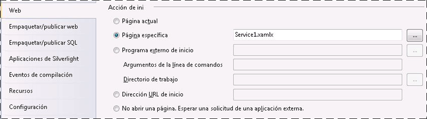
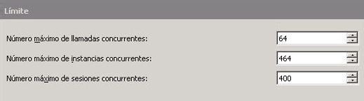
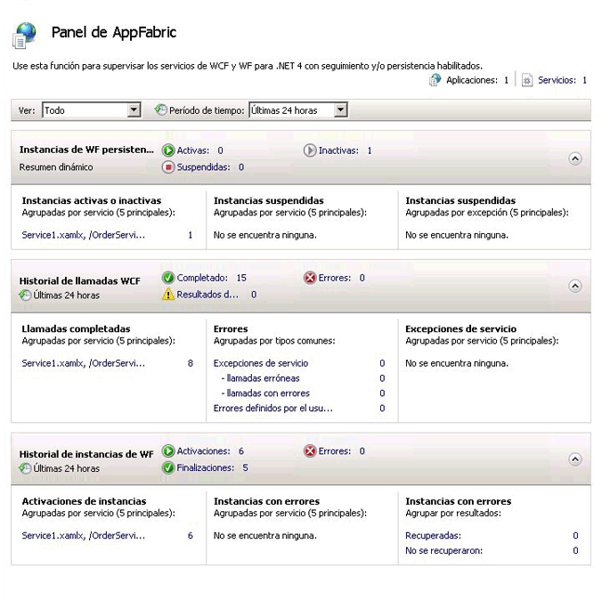
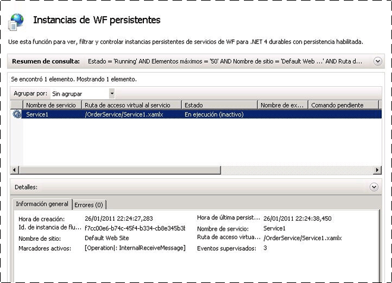

# Cómo: Hospedar un servicio de flujo de trabajo con Windows Server App Fabric
Hospedar servicios de flujo de trabajo en App Fabric es parecido al hospedaje en IIS/WAS. Las herramientas que proporciona App Fabric para implementar, supervisar y administrar los servicios de flujo de trabajo son la única diferencia. Este tema usa el servicio de flujo de trabajo creado en el [crear un servicio de flujo de trabajo de larga duración](../../../../docs/framework/wcf/feature-details/creating-a-long-running-workflow-service.md). que le guiará por el proceso de creación de un servicio de flujo de trabajo. En este tema se explicará cómo hospedar el servicio de flujo de trabajo usando App Fabric. [!INCLUDE[crabout](../../../../includes/crabout-md.md)]Windows Server App Fabric, vea [documentación de Windows Server App Fabric](http://go.microsoft.com/fwlink/?LinkID=193037&clcid=0x409). Antes de completar los pasos siguientes asegúrese de que tiene instalado Windows Server App Fabric.  Para ello, abra Internet Information Services (inetmgr.exe), haga clic en el nombre del servidor en el **conexiones** ver, haga clic en sitios y haga clic en **sitio Web predeterminado**. En el lado derecho de la pantalla verá una sección denominada **App Fabric**. Si no ve esta sección (estará en la parte superior del panel derecho), no tiene App Fabric instalado. [!INCLUDE[crabout](../../../../includes/crabout-md.md)]instalación de Windows Server App Fabric consulte [instalar Windows Server App Fabric](http://go.microsoft.com/fwlink/?LinkId=193136).  
  
### Crear un servicio de flujo de trabajo simple  
  
1.  Abra [!INCLUDE[vs_current_long](../../../../includes/vs-current-long-md.md)] y cargue la solución OrderProcessing que creó en el [crear un servicio de flujo de trabajo de larga duración](../../../../docs/framework/wcf/feature-details/creating-a-long-running-workflow-service.md) tema.  
  
2.  Haga clic con el **OrderService** de proyecto y seleccione **propiedades** y seleccione la **Web** ficha.  
  
3.  En el **acción de inicio** seleccione la sección de la página de propiedades **página específica** y escriba Service1.xamlx en el cuadro de edición.  
  
4.  En el **servidores** seleccione la sección de la página de propiedades **usar servidor Web de IIS Local** y escriba la dirección URL siguiente: `http://localhost/OrderService`.  
  
5.  Haga clic en el **crear directorio Virtual** botón. De esta forma, se creará un nuevo directorio virtual y se configurará el proyecto para copiar los archivos necesarios en el directorio virtual cuando se compile el proyecto.  O bien, podría copiar manualmente los archivos .xamlx y web.config, así como las DLL necesarias en el directorio virtual.  
  
### Configurar un servicio de flujo de trabajo hospedado en Windows Server App Fabric  
  
1.  Abra el Administrador de Internet Information Services (inetmgr.exe).  
  
2.  Navegue hasta el directorio virtual OrderService en el **conexiones** panel.  
  
3.  Haga clic en OrderService y seleccione **administrar servicios de WCF y WF**, **configurar...** . El **configurar WCF y WF para la aplicación** se muestra el cuadro de diálogo.  
  
4.  Seleccione el **General** ficha para mostrar información general acerca de la aplicación, como se muestra en la siguiente captura de pantalla.  
  
       
  
5.  Seleccione el **supervisión** ficha. Se muestran diversas configuraciones de supervisión como se ve en la siguiente captura de pantalla.  
  
       
  
     [!INCLUDE[crabout](../../../../includes/crabout-md.md)]configuración de supervisión de servicios de flujo de trabajo en App Fabric [configurar la supervisión con App Fabric](http://go.microsoft.com/fwlink/?LinkId=193153).  
  
6.  Seleccione el **persistencia de flujo de trabajo** ficha. De esta forma, puede configurar la aplicación para usar el proveedor de persistencia predeterminado de App Fabric como se muestra en la siguiente captura de pantalla.  
  
       
  
     [!INCLUDE[crabout](../../../../includes/crabout-md.md)]configuración de persistencia de flujo de trabajo en Windows Server App Fabric [configurar la persistencia de flujo de trabajo en App Fabric](http://go.microsoft.com/fwlink/?LinkId=193148).  
  
7.  Seleccione el **administración de Host de flujo de trabajo** ficha. De esta forma, puede especificar cuándo se deben descargar y conservar las instancias de servicio de flujo de trabajo inactivas como se muestra en la siguiente captura de pantalla.  
  
       
  
     [!INCLUDE[crabout](../../../../includes/crabout-md.md)]configuración de administración de host de flujo de trabajo, vea [configuración de administración de Host de flujo de trabajo en App Fabric](http://go.microsoft.com/fwlink/?LinkId=193151).  
  
8.  Seleccione el **inicio automático** ficha. De esta forma, puede especificar la configuración de inicio automático para los servicios de flujo de trabajo como se muestra en la siguiente captura de pantalla.  
  
       
  
     [!INCLUDE[crabout](../../../../includes/crabout-md.md)]configuración de inicio automático [configuración de inicio automático con App Fabric](http://go.microsoft.com/fwlink/?LinkId=193150).  
  
9. Seleccione el **limitación** ficha. De esta forma, puede especificar la configuración de límite para el servicio de flujo de trabajo como se muestra en la siguiente captura de pantalla.  
  
       
  
     [!INCLUDE[crabout](../../../../includes/crabout-md.md)]Consulte la configuración del límite de [configuración de limitación con App Fabric](http://go.microsoft.com/fwlink/?LinkId=193149).  
  
10. Seleccione el **seguridad** ficha. De esta forma, puede especificar la configuración de seguridad para la aplicación como se muestra en la siguiente captura de pantalla.  
  
       
  
     [!INCLUDE[crabout](../../../../includes/crabout-md.md)]configuración de seguridad con Windows Server App Fabric [configuración de la seguridad con App Fabric](http://go.microsoft.com/fwlink/?LinkId=193152).  
  
### Usar Windows Server App Fabric  
  
1.  Compile la solución para copiar los archivos necesarios en el directorio virtual.  
  
2.  Haga clic en el proyecto OrderClient y seleccione **depurar**, **Iniciar nueva instancia** para iniciar la aplicación de cliente.  
  
3.  El cliente se ejecutará y Visual Studio mostrará un **adjuntar advertencia de seguridad** cuadro de diálogo, haga clic en el **no adjuntar** botón. De esta forma, se indica a Visual Studio que no se adjunte al proceso IIS para la depuración.  
  
4.  La aplicación cliente inmediatamente llamará al servicio de flujo de trabajo y, a continuación, esperará. El servicio de flujo de trabajo se quedará inactivo y se conservará. Puede comprobarlo si inicia Internet Information Services (inetmgr.exe), navega a OrderService en el panel Conexiones y lo selecciona. A continuación, haga clic en el icono Panel de AppFabric del panel derecho. En Instancias de WF persistentes verá que hay una instancia del servicio de flujo de trabajo persistente como se muestra en la siguiente captura de pantalla.  
  
       
  
     El **historial de instancias de WF** muestra información sobre el servicio de flujo de trabajo como el número de activaciones de servicio de flujo de trabajo, el número de finalizaciones de instancia de servicio de flujo de trabajo y el número de instancias de flujo de trabajo con errores. En instancias Activas o Inactivas aparecerá un vínculo, si se hace clic en él, se mostrará más información sobre las instancias del flujo de trabajo inactivas como se muestra en la siguiente captura de pantalla.  
  
       
  
     Para obtener más información acerca de Windows Server App Fabric características y cómo utilizarlas vea [características de hospedaje de Windows Server App Fabric](http://go.microsoft.com/fwlink/?LinkID=193143&clcid=0x409)  
  
## Vea también  
 [Creación de un servicio de flujo de trabajo de larga ejecución](../../../../docs/framework/wcf/feature-details/creating-a-long-running-workflow-service.md)  
 [Características de hospedaje de Windows Server App Fabric](http://go.microsoft.com/fwlink/?LinkId=193143)  
 [Instalación de Windows Server AppFabric](http://go.microsoft.com/fwlink/?LinkId=193136)  
 [Documentación de Windows Server AppFabric](http://go.microsoft.com/fwlink/?LinkID=193037&clcid=0x409)
