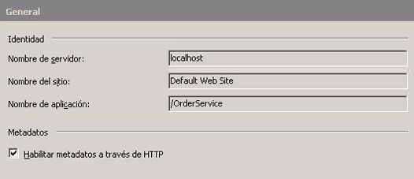
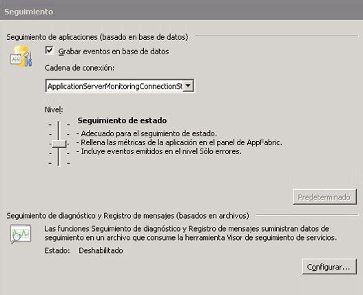
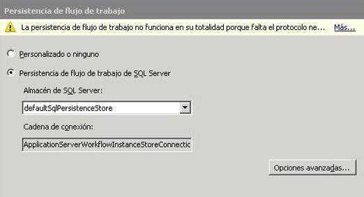
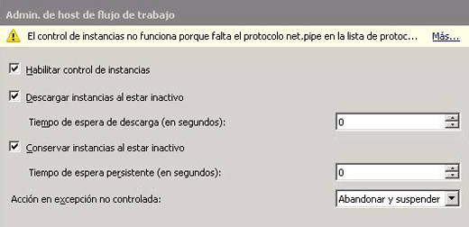
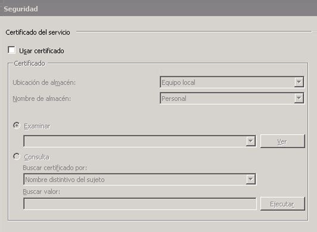

# Procedimiento para hospedar un servicio de flujo de trabajo con Windows Server App Fabric

Hospedar servicios de flujo de trabajo en App Fabric es parecido al hospedaje en IIS/WAS. Las herramientas que proporciona App Fabric para implementar, supervisar y administrar los servicios de flujo de trabajo son la única diferencia. En este tema se usa el servicio de flujo de trabajo creado en el [servicio de flujo de trabajo de ejecución prolongada](creating-a-long-running-workflow-service.md). que le guiará por el proceso de creación de un servicio de flujo de trabajo. En este tema se explicará cómo hospedar el servicio de flujo de trabajo usando App Fabric. Para obtener más información sobre Windows Server App fabric, consulte la [documentación de Windows Server App fabric](/previous-versions/appfabric/ff384253(v=azure.10)). Antes de completar los pasos siguientes asegúrese de que tiene instalado Windows Server App Fabric.  Para ello, abra Internet Information Services (inetmgr.exe), haga clic en el nombre del servidor en la vista **conexiones** , haga clic en sitios y, a continuación, haga clic en **sitio web predeterminado**. En el lado derecho de la pantalla debería ver una sección denominada **App fabric**. Si no ve esta sección (estará en la parte superior del panel derecho), no tiene App Fabric instalado. Para obtener más información sobre cómo instalar Windows Server App fabric, consulte [instalación de Windows Server App fabric](/previous-versions/appfabric/ee790960(v=azure.10)).  
  
### Crear un servicio de flujo de trabajo simple  
  
1. Abra Visual Studio 2012 y cargue la solución OrderProcessing que creó en el tema [creación de un servicio de flujo de trabajo de ejecución prolongada](creating-a-long-running-workflow-service.md) .  
  
2. Haga clic con el botón derecho en el proyecto **OrderService** y seleccione **propiedades** y seleccione la pestaña **Web** .  
  
3. En la sección **acción de inicio** de la página de propiedades, seleccione **página específica** y escriba Service1. xamlx en el cuadro de edición.  
  
4. En la sección **servidores** de la página de propiedades, seleccione **usar servidor Web de IIS local** y escriba la siguiente dirección URL: `http://localhost/OrderService` .  
  
5. Haga clic en el botón **Crear directorio virtual** . De esta forma, se creará un nuevo directorio virtual y se configurará el proyecto para copiar los archivos necesarios en el directorio virtual cuando se compile el proyecto.  O bien, podría copiar manualmente los archivos .xamlx y web.config, así como las DLL necesarias en el directorio virtual.  
  
### Configurar un servicio de flujo de trabajo hospedado en Windows Server App Fabric  
  
1. Abra el Administrador de Internet Information Services (inetmgr.exe).  
  
2. Navegue hasta el directorio virtual OrderService en el panel **conexiones** .  
  
3. Haga clic con el botón derecho en OrderService y seleccione **administrar servicios WCF y WF**, **configurar.**... Se muestra el cuadro **de diálogo Configurar WCF y WF para la aplicación** .  
  
4. Seleccione la pestaña **General** para mostrar información general sobre la aplicación, tal como se muestra en la captura de pantalla siguiente.  
  
       
  
5. Seleccione la pestaña **supervisión** . Esto muestra varios valores de supervisión, tal como se muestra en la captura de pantalla siguiente.  
  
       
  
     Para más información sobre cómo configurar la supervisión del servicio de flujo de trabajo en App fabric, consulte [configuración de la supervisión con App fabric](/previous-versions/appfabric/ee677384(v=azure.10)).  
  
6. Seleccione la pestaña **persistencia del flujo de trabajo** . Esto le permite configurar la aplicación para que use el proveedor de persistencia predeterminado de App fabric, tal como se muestra en la captura de pantalla siguiente.  
  
       
  
     Para obtener más información sobre la configuración de la persistencia del flujo de trabajo en Windows Server App fabric, consulte [configuración de la persistencia del flujo de trabajo en App fabric](/previous-versions/appfabric/ee677353(v=azure.10)).  
  
7. Seleccione la pestaña **Administración de host de flujo de trabajo** . Esto le permite especificar Cuándo se deben descargar y conservar las instancias de servicio de flujo de trabajo inactivas, tal y como se muestra en la captura de pantalla siguiente.  
  
       
  
     Para más información sobre la configuración de administración de host de flujo de trabajo, consulte [configuración de administración de host de flujo de trabajo en App fabric](/previous-versions/appfabric/ff383424(v=azure.10)).  
  
8. Seleccione la pestaña **Inicio automático** . Esto le permite especificar la configuración de inicio automático para los servicios de flujo de trabajo en la aplicación, tal como se muestra en la captura de pantalla siguiente.  
  
       
  
     Para más información sobre cómo configurar el inicio automático, consulte [configuración del inicio automático con App fabric](/previous-versions/appfabric/ee677261(v=azure.10)).  
  
9. Seleccione la pestaña **limitación** . Esto le permite configurar los valores de limitación para el servicio de flujo de trabajo, tal como se muestra en la siguiente captura de pantalla.  
  
       
  
     Para más información sobre la configuración de la limitación, consulte [configuración de la limitación con App fabric](/previous-versions/appfabric/ee677261(v=azure.10)).  
  
10. Seleccione la pestaña **seguridad** . Esto le permite configurar opciones de seguridad para la aplicación, tal como se muestra en la captura de pantalla siguiente.  
  
       
  
     Para obtener más información sobre la configuración de la seguridad con Windows Server App fabric, consulte [configuración de la seguridad con App fabric](/previous-versions/appfabric/ee677278(v=azure.10)).  
  
### Usar Windows Server App Fabric  
  
1. Compile la solución para copiar los archivos necesarios en el directorio virtual.  
  
2. Haga clic con el botón derecho en el proyecto OrderClient y seleccione **depurar**, **Iniciar nueva instancia** para iniciar la aplicación cliente.  
  
3. El cliente se ejecutará y Visual Studio mostrará un cuadro de diálogo **adjuntar ADVERTENCIA de seguridad** , haga clic en el botón **no adjuntar** . De esta forma, se indica a Visual Studio que no se adjunte al proceso IIS para la depuración.  
  
4. La aplicación cliente inmediatamente llamará al servicio de flujo de trabajo y, a continuación, esperará. El servicio de flujo de trabajo se quedará inactivo y se conservará. Puede comprobarlo si inicia Internet Information Services (inetmgr.exe), navega a OrderService en el panel Conexiones y lo selecciona. A continuación, haga clic en el icono Panel de AppFabric del panel derecho. En instancias de WF persistentes verá que hay una instancia de servicio de flujo de trabajo persistente, tal como se muestra en la captura de pantalla siguiente.  
  
       
  
     El **historial de instancias de WF** muestra información sobre el servicio de flujo de trabajo, como el número de activaciones de servicio de flujo de trabajo, el número de finalizaciones de instancias de servicio de flujo de trabajo y el número de instancias de flujo de trabajo con errores. En instancias activas o inactivas, se mostrará un vínculo; al hacer clic en el vínculo se mostrará más información sobre las instancias de flujo de trabajo inactivas como se muestra en la captura de pantalla siguiente.  
  
       
  
     Para obtener más información sobre las características de Windows Server App fabric y cómo usarlas, vea [características de hospedaje de Windows Server App fabric](/previous-versions/appfabric/ee677189(v=azure.10))  
  
## Vea también

- [Crear un servicio de flujo de trabajo de larga ejecución](creating-a-long-running-workflow-service.md)
- [Características de hospedaje de Windows Server AppFabric](/previous-versions/appfabric/ee677189(v=azure.10))
- [Instalación de Windows Server App fabric](/previous-versions/appfabric/ee790960(v=azure.10))
- [Documentación de Windows Server App fabric](/previous-versions/appfabric/ff384253(v=azure.10))
