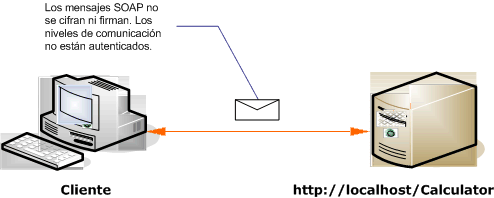

# <a name="internet-unsecured-client-and-service"></a><span data-ttu-id="41b6b-102">Cliente y servicio de Internet no protegidos</span><span class="sxs-lookup"><span data-stu-id="41b6b-102">Internet Unsecured Client and Service</span></span>
<span data-ttu-id="41b6b-103">La siguiente ilustración muestra un ejemplo de un cliente de Windows Communication Foundation (WCF) público, no seguro y servicio.</span><span class="sxs-lookup"><span data-stu-id="41b6b-103">The following illustration shows an example of a public, unsecured Windows Communication Foundation (WCF) client and service.</span></span>  
  
 <span data-ttu-id="41b6b-104"></span><span class="sxs-lookup"><span data-stu-id="41b6b-104"></span></span>  
  
|<span data-ttu-id="41b6b-105">Característica</span><span class="sxs-lookup"><span data-stu-id="41b6b-105">Characteristic</span></span>|<span data-ttu-id="41b6b-106">Descripción</span><span class="sxs-lookup"><span data-stu-id="41b6b-106">Description</span></span>|  
|--------------------|-----------------|  
|<span data-ttu-id="41b6b-107">Modo de seguridad</span><span class="sxs-lookup"><span data-stu-id="41b6b-107">Security Mode</span></span>|<span data-ttu-id="41b6b-108">Ninguna</span><span class="sxs-lookup"><span data-stu-id="41b6b-108">None</span></span>|  
|<span data-ttu-id="41b6b-109">Transporte</span><span class="sxs-lookup"><span data-stu-id="41b6b-109">Transport</span></span>|<span data-ttu-id="41b6b-110">HTTP</span><span class="sxs-lookup"><span data-stu-id="41b6b-110">HTTP</span></span>|  
|<span data-ttu-id="41b6b-111">Enlaces</span><span class="sxs-lookup"><span data-stu-id="41b6b-111">Binding</span></span>|<span data-ttu-id="41b6b-112"><xref:System.ServiceModel.BasicHttpBinding> en el código, o la [ \<basicHttpBinding >](../../../../docs/framework/configure-apps/file-schema/wcf/basichttpbinding.md) elemento de configuración.</span><span class="sxs-lookup"><span data-stu-id="41b6b-112"><xref:System.ServiceModel.BasicHttpBinding> in code, or the [\<basicHttpBinding>](../../../../docs/framework/configure-apps/file-schema/wcf/basichttpbinding.md) element in configuration.</span></span>|  
|<span data-ttu-id="41b6b-113">Interoperabilidad</span><span class="sxs-lookup"><span data-stu-id="41b6b-113">Interoperability</span></span>|<span data-ttu-id="41b6b-114">Con clientes de servicios Web existentes y servicios</span><span class="sxs-lookup"><span data-stu-id="41b6b-114">With existing Web service clients and services</span></span>|  
|<span data-ttu-id="41b6b-115">Autenticación</span><span class="sxs-lookup"><span data-stu-id="41b6b-115">Authentication</span></span>|<span data-ttu-id="41b6b-116">Ninguna</span><span class="sxs-lookup"><span data-stu-id="41b6b-116">None</span></span>|  
|<span data-ttu-id="41b6b-117">Integridad</span><span class="sxs-lookup"><span data-stu-id="41b6b-117">Integrity</span></span>|<span data-ttu-id="41b6b-118">Ninguna</span><span class="sxs-lookup"><span data-stu-id="41b6b-118">None</span></span>|  
|<span data-ttu-id="41b6b-119">Confidencialidad</span><span class="sxs-lookup"><span data-stu-id="41b6b-119">Confidentiality</span></span>|<span data-ttu-id="41b6b-120">Ninguna</span><span class="sxs-lookup"><span data-stu-id="41b6b-120">None</span></span>|  
  
## <a name="service"></a><span data-ttu-id="41b6b-121">Servicio</span><span class="sxs-lookup"><span data-stu-id="41b6b-121">Service</span></span>  
 <span data-ttu-id="41b6b-122">El código y la configuración siguientes están diseñados para ejecutarse de forma independiente.</span><span class="sxs-lookup"><span data-stu-id="41b6b-122">The following code and configuration are meant to run independently.</span></span> <span data-ttu-id="41b6b-123">Realice una de las siguientes acciones:</span><span class="sxs-lookup"><span data-stu-id="41b6b-123">Do one of the following:</span></span>  
  
-   <span data-ttu-id="41b6b-124">Cree un servicio independiente mediante el código sin configuración.</span><span class="sxs-lookup"><span data-stu-id="41b6b-124">Create a stand-alone service using the code with no configuration.</span></span>  
  
-   <span data-ttu-id="41b6b-125">Cree un servicio mediante la configuración proporcionada, pero sin definir ningún extremo.</span><span class="sxs-lookup"><span data-stu-id="41b6b-125">Create a service using the supplied configuration, but do not define any endpoints.</span></span>  
  
### <a name="code"></a><span data-ttu-id="41b6b-126">Código</span><span class="sxs-lookup"><span data-stu-id="41b6b-126">Code</span></span>  
 <span data-ttu-id="41b6b-127">El siguiente código muestra cómo crear extremo sin seguridad.</span><span class="sxs-lookup"><span data-stu-id="41b6b-127">The following code shows how to create an endpoint with no security.</span></span> <span data-ttu-id="41b6b-128">De forma predeterminada, <xref:System.ServiceModel.BasicHttpBinding> tiene el modo de seguridad establecido en <xref:System.ServiceModel.BasicHttpSecurityMode.None>.</span><span class="sxs-lookup"><span data-stu-id="41b6b-128">By default, the <xref:System.ServiceModel.BasicHttpBinding> has the security mode set to <xref:System.ServiceModel.BasicHttpSecurityMode.None>.</span></span>  
  
 [!code-csharp[C_UnsecuredService#1](../../../../samples/snippets/csharp/VS_Snippets_CFX/c_unsecuredservice/cs/source.cs#1)]
 [!code-vb[C_UnsecuredService#1](../../../../samples/snippets/visualbasic/VS_Snippets_CFX/c_unsecuredservice/vb/source.vb#1)]  
  
### <a name="service-configuration"></a><span data-ttu-id="41b6b-129">Configuración del servicio</span><span class="sxs-lookup"><span data-stu-id="41b6b-129">Service Configuration</span></span>  
 <span data-ttu-id="41b6b-130">El código siguiente configura el mismo extremo mediante la configuración.</span><span class="sxs-lookup"><span data-stu-id="41b6b-130">The following code sets up the same endpoint using configuration.</span></span>  
  
```xml  
<?xml version="1.0" encoding="utf-8"?>  
<configuration>  
  <system.serviceModel>  
    <behaviors />  
    <services>  
      <service behaviorConfiguration="" name="ServiceModel.Calculator">  
        <endpoint address="http://localhost/Calculator"   
                  binding="basicHttpBinding"  
                  bindingConfiguration="Basic_Unsecured"   
                  name="BasicHttp_ICalculator"  
                  contract="ServiceModel.ICalculator" />  
      </service>  
    </services>  
    <bindings>  
      <basicHttpBinding>  
        <binding name="Basic_Unsecured" />  
      </basicHttpBinding>  
    </bindings>  
    <client />  
  </system.serviceModel>  
</configuration>  
```  
  
## <a name="client"></a><span data-ttu-id="41b6b-131">Cliente</span><span class="sxs-lookup"><span data-stu-id="41b6b-131">Client</span></span>  
 <span data-ttu-id="41b6b-132">El código y la configuración siguientes están diseñados para ejecutarse de forma independiente.</span><span class="sxs-lookup"><span data-stu-id="41b6b-132">The following code and configuration are meant to run independently.</span></span> <span data-ttu-id="41b6b-133">Realice una de las siguientes acciones:</span><span class="sxs-lookup"><span data-stu-id="41b6b-133">Do one of the following:</span></span>  
  
-   <span data-ttu-id="41b6b-134">Cree un cliente independiente mediante el código (y el código de cliente).</span><span class="sxs-lookup"><span data-stu-id="41b6b-134">Create a stand-alone client using the code (and client code).</span></span>  
  
-   <span data-ttu-id="41b6b-135">Cree un cliente que no defina direcciones de extremo.</span><span class="sxs-lookup"><span data-stu-id="41b6b-135">Create a client that does not define any endpoint addresses.</span></span> <span data-ttu-id="41b6b-136">En su lugar, utilice el constructor de cliente que adopta el nombre de configuración como un argumento.</span><span class="sxs-lookup"><span data-stu-id="41b6b-136">Instead, use the client constructor that takes the configuration name as an argument.</span></span> <span data-ttu-id="41b6b-137">Por ejemplo:</span><span class="sxs-lookup"><span data-stu-id="41b6b-137">For example:</span></span>  
  
     [!code-csharp[C_SecurityScenarios#0](../../../../samples/snippets/csharp/VS_Snippets_CFX/c_securityscenarios/cs/source.cs#0)]
     [!code-vb[C_SecurityScenarios#0](../../../../samples/snippets/visualbasic/VS_Snippets_CFX/c_securityscenarios/vb/source.vb#0)]  
  
### <a name="code"></a><span data-ttu-id="41b6b-138">Código</span><span class="sxs-lookup"><span data-stu-id="41b6b-138">Code</span></span>  
 <span data-ttu-id="41b6b-139">El código siguiente muestra a un cliente WCF básico que tiene acceso a un punto de conexión no segura.</span><span class="sxs-lookup"><span data-stu-id="41b6b-139">The following code shows a basic WCF client that accesses an unsecured endpoint.</span></span>  
  
 [!code-csharp[C_UnsecuredClient#1](../../../../samples/snippets/csharp/VS_Snippets_CFX/c_unsecuredclient/cs/source.cs#1)]
 [!code-vb[C_UnsecuredClient#1](../../../../samples/snippets/visualbasic/VS_Snippets_CFX/c_unsecuredclient/vb/source.vb#1)]  
  
### <a name="client-configuration"></a><span data-ttu-id="41b6b-140">Configuración del cliente</span><span class="sxs-lookup"><span data-stu-id="41b6b-140">Client Configuration</span></span>  
 <span data-ttu-id="41b6b-141">El siguiente código configura el cliente.</span><span class="sxs-lookup"><span data-stu-id="41b6b-141">The following code configures the client.</span></span>  
  
```xml  
<?xml version="1.0" encoding="utf-8"?>  
<configuration>  
  <system.serviceModel>  
    <bindings>  
      <basicHttpBinding>  
        <binding name="BasicHttpBinding_ICalculator" >  
          <security mode="None">  
          </security>  
        </binding>  
      </basicHttpBinding>  
    </bindings>  
    <client>  
      <endpoint address="http://localhost/Calculator/Unsecured"  
          binding="basicHttpBinding"   
          bindingConfiguration="BasicHttpBinding_ICalculator"  
          contract="ICalculator"   
          name="BasicHttpBinding_ICalculator" />  
    </client>  
  </system.serviceModel>  
</configuration>  
```  
  
## <a name="see-also"></a><span data-ttu-id="41b6b-142">Vea también</span><span class="sxs-lookup"><span data-stu-id="41b6b-142">See Also</span></span>  
 [<span data-ttu-id="41b6b-143">Escenarios de seguridad comunes</span><span class="sxs-lookup"><span data-stu-id="41b6b-143">Common Security Scenarios</span></span>](../../../../docs/framework/wcf/feature-details/common-security-scenarios.md)  
 [<span data-ttu-id="41b6b-144">Información general sobre seguridad</span><span class="sxs-lookup"><span data-stu-id="41b6b-144">Security Overview</span></span>](../../../../docs/framework/wcf/feature-details/security-overview.md)  
 [<span data-ttu-id="41b6b-145">Modelo de seguridad de Windows Server AppFabric</span><span class="sxs-lookup"><span data-stu-id="41b6b-145">Security Model for Windows Server App Fabric</span></span>](https://go.microsoft.com/fwlink/?LinkID=201279&clcid=0x409)
