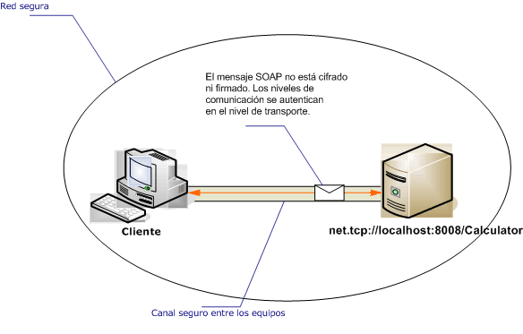

# <a name="intranet-unsecured-client-and-service"></a>Cliente y servicio de intranet no protegidos
La siguiente ilustración muestra un servicio de Windows Communication Foundation (WCF) sencillo desarrollado para proporcionar información sobre una red privada segura a una aplicación de WCF. No se requiere seguridad porque los datos son de poca importancia, espera que la red es intrínsecamente segura o una capa debajo de la infraestructura de WCF proporciona seguridad.  
  
   
  
|Característica|Descripción|  
|--------------------|-----------------|  
|Modo de seguridad|Ninguna|  
|Transporte|TCP|  
|Enlaces|<xref:System.ServiceModel.NetTcpBinding>|  
|Interoperabilidad|WCF solo|  
|Autenticación|Ninguna|  
|Integridad|Ninguna|  
|Confidencialidad|Ninguna|  
  
## <a name="service"></a>Servicio  
 El código y la configuración siguientes están diseñados para ejecutarse de forma independiente. Realice una de las siguientes acciones:  
  
-   Cree un servicio independiente mediante el código sin configuración.  
  
-   Cree un servicio mediante la configuración proporcionada, pero sin definir ningún extremo.  
  
### <a name="code"></a>Código  
 El siguiente código muestra cómo crear un extremo sin seguridad:  
  
 [!code-csharp[C_UnsecuredService#2](../../../../samples/snippets/csharp/VS_Snippets_CFX/c_unsecuredservice/cs/source.cs#2)]
 [!code-vb[C_UnsecuredService#2](../../../../samples/snippets/visualbasic/VS_Snippets_CFX/c_unsecuredservice/vb/source.vb#2)]  
  
### <a name="configuration"></a>Configuración  
 El código siguiente establece el mismo extremo utilizando la configuración.  
  
```xml  
<?xml version="1.0" encoding="utf-8"?>  
<configuration>  
  <system.serviceModel>  
    <behaviors />  
    <services>  
      <service behaviorConfiguration=""   
               name="ServiceModel.Calculator">  
        <endpoint address="net.tcp://localhost:8008/Calculator"   
                  binding="netTcpBinding"  
                  bindingConfiguration="tcp_Unsecured"   
                  name="netTcp_ICalculator"  
                  contract="ServiceModel.ICalculator" />  
      </service>  
    </services>  
    <bindings>  
      <netTcpBinding>  
        <binding name="tcp_Unsecured">  
          <security mode="None" />  
        </binding>  
      </netTcpBinding>  
    </bindings>  
    <client />  
  </system.serviceModel>  
</configuration>  
```  
  
## <a name="client"></a>Cliente  
 El código y la configuración siguientes están diseñados para ejecutarse de forma independiente. Realice una de las siguientes acciones:  
  
-   Cree un cliente independiente mediante el código (y el código de cliente).  
  
-   Cree un cliente que no defina direcciones de extremo. En su lugar, utilice el constructor de cliente que adopta el nombre de configuración como un argumento. Por ejemplo:  
  
     [!code-csharp[C_SecurityScenarios#0](../../../../samples/snippets/csharp/VS_Snippets_CFX/c_securityscenarios/cs/source.cs#0)]
     [!code-vb[C_SecurityScenarios#0](../../../../samples/snippets/visualbasic/VS_Snippets_CFX/c_securityscenarios/vb/source.vb#0)]  
  
### <a name="code"></a>Código  
 El código siguiente muestra a un cliente WCF básico que tiene acceso a un punto de conexión no segura mediante el protocolo TCP.  
  
 [!code-csharp[C_UnsecuredClient#2](../../../../samples/snippets/csharp/VS_Snippets_CFX/c_unsecuredclient/cs/source.cs#2)]
 [!code-vb[C_UnsecuredClient#2](../../../../samples/snippets/visualbasic/VS_Snippets_CFX/c_unsecuredclient/vb/source.vb#2)]  
  
### <a name="configuration"></a>Configuración  
 El código de configuración siguiente se aplica al cliente:  
  
```xml  
<?xml version="1.0" encoding="utf-8"?>  
<configuration>  
  <system.serviceModel>  
    <bindings>  
      <netTcpBinding>  
        <binding name="NetTcpBinding_ICalculator" >  
          <security mode="None">  
          </security>  
        </binding>  
      </netTcpBinding>  
    </bindings>  
    <client>  
      <endpoint address="net.tcp://machineName:8008/Calculator "  
                binding="netTcpBinding"   
                bindingConfiguration="NetTcpBinding_ICalculator"  
                contract="ICalculator"   
                name="NetTcpBinding_ICalculator" />  
    </client>  
  </system.serviceModel>  
</configuration>  
```  
  
## <a name="see-also"></a>Vea también  
 <xref:System.ServiceModel.NetTcpBinding>  
 [Información general sobre seguridad](../../../../docs/framework/wcf/feature-details/security-overview.md)  
 [Modelo de seguridad de Windows Server AppFabric](https://go.microsoft.com/fwlink/?LinkID=201279&clcid=0x409)
