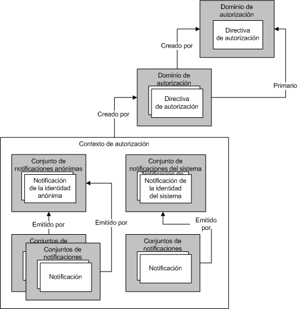

# Administración de notificaciones y autorización con el modelo de identidad
La autorización es el proceso de determinar qué entidades tienen permiso para cambiar, ver o tener acceso a un recurso informático. Por ejemplo, en una empresa, solo se puede permitir a los administradores el acceso a los archivos de sus empleados. Windows Communication Foundation (WCF) admite dos mecanismos para realizar el procesamiento de la autorización. El primer mecanismo le permite controlar la autorización utilizando construcciones de Common Language Runtime (CLR). El segundo es un modelo basado en notificaciones conocido como *modelo de identidad*. WCF usa el modelo de identidad para crear notificaciones de mensajes entrantes; Las clases del modelo de identidad se pueden extender para admitir nuevos tipos de notificaciones para esquemas de autorización personalizados. En este tema se presenta información general de los conceptos de programación principales de la característica Modelo de identidad, así como una lista de las clases más importantes que la característica utiliza.  
  
## Escenarios del modelo de identidad  
 Los escenarios siguientes representan el uso del modelo de identidad.  
  
### Escenario 1: admisión de notificaciones de identidad, función y grupo  
 Los usuarios envían mensajes a un servicio web. Los requisitos de control de acceso del servicio web utilizan la identidad, las funciones o los grupos. El remitente del mensaje está asignado a un conjunto de funciones o grupos. Se utiliza la información de grupo o función para realizar las comprobaciones de acceso.  
  
### Escenario 2: admisión de notificaciones enriquecidas  
 Los usuarios envían mensajes a un servicio web. Los requisitos de control de acceso del servicio web requieren un modelo más enriquecido que la identidad, las funciones o los grupos. El servicio web determina si un usuario determinado tiene acceso a un recurso protegido determinado que utilice un modelo basado en notificaciones enriquecidas. Por ejemplo, un usuario puede ser capaz de leer información determinada, como información sobre el sueldo, a la que otros usuarios no tienen acceso.  
  
### Escenario 3: asignación de notificaciones dispares  
 Un usuario envía un mensaje a un servicio web. El usuario puede especificar sus credenciales de varias maneras diferentes: certificado X.509, token del nombre de usuario o token de Kerberos. Es necesario que el servicio web realice las comprobaciones de control de acceso de la misma manera, sin tener en cuenta el tipo de credencial del usuario. Si se admiten tipos de credenciales adicionales con el tiempo, el sistema debería evolucionar de la misma manera.  
  
### Escenario 4: determinar el acceso a varios recursos  
 Un servicio web intenta tener acceso a varios recursos. El servicio determina a qué recursos protegidos el usuario tiene acceso comparando las notificaciones asociadas con el usuario con las necesarias para tener acceso al recurso.  
  
## Condiciones del modelo de identidad  
 La lista siguiente define los términos clave utilizados para describir los conceptos del modelo de identidad.  
  
 Directiva de autorización  
 Conjunto de reglas para la asignación de un conjunto de notificaciones de entrada a un conjunto de notificaciones de salida. La evaluación de los resultados de la directiva de autorización da como resultado la adición de conjuntos de notificaciones a un contexto de evaluación y posteriormente un contexto de autorización.  
  
 Contexto de autorización  
 Un conjunto de conjuntos de notificaciones y cero o más propiedades. El resultado de evaluar una o varias directivas de autorización.  
  
 Notificación  
 Una combinación de un tipo de notificación, un derecho y un valor.  
  
 Conjunto de notificaciones  
 Un conjunto de notificaciones emitido por un emisor determinado.  
  
 Tipo de notificación  
 Un tipo de notificación. Las notificaciones definidas por la API del modelo de identidad son propiedades de la clase <xref:System.IdentityModel.Claims.Claim.ClaimType%2A>. Los ejemplos de tipos de notificación proporcionados por el sistema son <xref:System.IdentityModel.Claims.ClaimTypes.Dns%2A>, <xref:System.IdentityModel.Claims.ClaimTypes.Email%2A>, <xref:System.IdentityModel.Claims.ClaimTypes.Hash%2A>, <xref:System.IdentityModel.Claims.ClaimTypes.Name%2A>, <xref:System.IdentityModel.Claims.ClaimTypes.Rsa%2A>, <xref:System.IdentityModel.Claims.ClaimTypes.Sid%2A>, <xref:System.IdentityModel.Claims.ClaimTypes.Spn%2A>, <xref:System.IdentityModel.Claims.ClaimTypes.System%2A>, <xref:System.IdentityModel.Claims.ClaimTypes.Thumbprint%2A>, <xref:System.IdentityModel.Claims.ClaimTypes.Uri%2A> y <xref:System.IdentityModel.Claims.ClaimTypes.X500DistinguishedName%2A>.  
  
 Contexto de evaluación  
 Un contexto en el que se evalúa una directiva de autorización. Contiene propiedades y conjuntos de notificaciones. Se convierte en la base de un contexto de autorización una vez que la evaluación ha finalizado.  
  
 Notificación de identidad  
 Una notificación cuyo derecho es la identidad.  
  
 Emisor  
 Un conjunto de notificaciones que contiene por lo menos una notificación de identidad y se considera que ha emitido otro conjunto de notificaciones.  
  
 Propiedades  
 Un conjunto de información asociado a un contexto de evaluación o contexto de autorización.  
  
 Recurso protegido  
 Algo en el sistema que solo se puede utilizar, obtener acceso o manipularse si se cumplen ciertos requisitos primero.  
  
 Derecha  
 Capacidad sobre un recurso. Los derechos definidos por la API del modelo de identidad son propiedades de la clase <xref:System.IdentityModel.Claims.Rights>. Los ejemplos de derechos proporcionados por el sistema son <xref:System.IdentityModel.Claims.Rights.Identity%2A> y <xref:System.IdentityModel.Claims.Rights.PossessProperty%2A>.  
  
 Value  
 Algo sobre lo que se reclama un derecho.  
  
## Notificaciones  
 El modelo de identidad es un sistema basado en notificaciones. Las notificaciones describen las funciones asociadas con alguna identidad en el sistema, a menudo un usuario de ese sistema. El conjunto de notificaciones asociado a una entidad determinada puede pensarse como clave. Las notificaciones determinadas definen la forma de esa clave, similar a una llave física utilizada para abrir una cerradura de una puerta. Las notificaciones se utilizan para obtener acceso a los recursos. El acceso a un recurso protegido determinado se determina comparando las notificaciones necesarias para tener acceso a ese recurso con las notificaciones asociadas con la entidad que intenta tener acceso.  
  
 Una notificación es la expresión de un derecho con respecto a un valor en concreto. Un derecho podría ser algo como "Lectura", "Escritura" o "Ejecutar". Un valor podría ser una base de datos, un archivo, un buzón o una propiedad. Las notificaciones también tienen un tipo de notificación. La combinación del tipo de notificación y el derecho proporciona el mecanismo para especificar las funciones con respecto al valor. Por ejemplo, una demanda de tipo "archivo", con derecho de "lectura" sobre el valor "biografía. doc", indica que la entidad con la que se asocia dicha demanda tiene acceso de lectura al archivo biografía. doc. Una demanda de tipo "Name", con el derecho "PossessProperty" sobre el valor "Martin", indica que la entidad con la que está asociada dicha demanda posee una propiedad Name con el valor "Martin".  
  
 Aunque se definen varios tipos de notificación y derechos como parte del modelo de identidad, el sistema es ampliable, lo que permite a los distintos sistemas, que se crean en la parte superior de la infraestructura del modelo de identidad, definir tipos de notificación y derechos adicionales según sea necesario.  
  
### Notificaciones de identidad  
 Un derecho determinado sería el de la identidad. Las notificaciones que lo poseen realizan una instrucción sobre la identidad de la entidad. Por ejemplo, una demanda de tipo "nombre principal de usuario" (UPN) con un valor de " someone@example.com " y un derecho de identidad indica una identidad determinada en un dominio determinado.  
  
#### Notificación de la identidad del sistema  
 El modelo de identidad define una notificación de identidad: sistema. La notificación de la identidad del sistema indica que una entidad es la aplicación o sistema actual.  
  
### Conjuntos de notificaciones  
 El modelo de notificaciones que representan la identidad es importante porque las notificaciones siempre las emiten alguna entidad en el sistema, aun cuando esa entidad es en última instancia un concepto de "self". Las notificaciones se agrupan en un conjunto y cada conjunto tiene un emisor. Un emisor es, simplemente, un conjunto de notificaciones. Este tipo de relación recursiva debe finalizar en el futuro y cualquier conjunto de notificaciones puede ser su propio emisor.  
  
 La ilustración siguiente muestra un ejemplo de tres conjuntos de notificaciones donde un conjunto de notificaciones tiene, como su emisor, otro conjunto de notificaciones, que, a su vez, tiene el conjunto de notificaciones de sistema como su emisor. Por consiguiente, los conjuntos de notificaciones forman una jerarquía que puede ser profunda de manera arbitraria.  
  
   
  
 Varios conjuntos de notificaciones pueden tener el mismo conjunto de notificaciones de emisión, como se muestra en la ilustración siguiente:
  
   
  
 Con la excepción de un conjunto de notificaciones que sea su propio emisor, el modelo de identidad no ofrece ninguna compatibilidad a los conjuntos de notificaciones para formar un bucle. Por tanto, una situación donde el conjunto de notificaciones A está emitido por el conjunto de notificaciones B, que a su vez está emitido por el conjunto A, nunca podrá darse. Asimismo, el modelo de identidad no proporciona ninguna compatibilidad para que los conjuntos de notificaciones tengan varios emisores. Si dos o más emisores deben emitir un conjunto determinado de notificaciones, a continuación, deberá utilizar varios conjuntos de notificaciones, cada uno con las mismas notificaciones, pero con distintos emisores.  
  
### El origen de las notificaciones  
 Las notificaciones pueden provenir de una gran variedad de orígenes. Un origen común de notificaciones son las credenciales presentadas por un usuario, por ejemplo, como parte de un mensaje enviado a un servicio web. El sistema valida tales notificaciones y se vuelven parte de un conjunto de notificaciones asociado con el usuario. Otros componentes del sistema también pueden ser orígenes de notificaciones, incluidos, aunque no limitados a ellos, el sistema operativo, la pila de red, el entorno de tiempo de ejecución o la aplicación. Además, los servicios remotos también pueden ser un origen de notificaciones.  
  
### Directivas de autorización  
 En el modelo de identidad, las notificaciones se generan como parte del proceso de evaluación de la directiva de autorización. Una directiva de autorización examina el (posiblemente vacío) conjunto de notificaciones existentes y puede optar por agregar notificaciones adicionales según las notificaciones ya presentes y la información adicional a su disposición. Esto proporciona la base de la asignación entre notificaciones. La presencia o ausencia de notificaciones en el sistema influye en el comportamiento de una directiva de autorización con respecto a si agrega notificaciones adicionales.  
  
 Por ejemplo, la directiva de autorización tiene acceso a una base de datos que incluye las fechas de nacimiento de las distintas entidades que utilizan el sistema. La directiva de autorización utiliza esa información para agregar una notificación de "Over18" al contexto. Tenga en cuenta que la notificación Over18 no divulga ninguna información sobre la entidad que no sea el hecho de que tenga más de 18 años. Tenga en cuenta que la interpretación de la notificación 'Over18' depende de comprender la semántica de esa notificación. La directiva de autorización que agregó la notificación comprende esa semántica en cierta medida. También se informará de esas semánticas al código que examina posteriormente las notificaciones que resultan de la evaluación de directivas.  
  
 Una directiva de autorización determinada puede requerir que se evalúe varias veces porque cuando otras directivas de autorización agregan notificaciones, esa directiva de autorización podría agregar aún más notificaciones. El modelo de identidad está diseñado para continuar la evaluación hasta que no se añada ninguna notificación más al contexto por parte de las directivas de autorización en vigor. Esta evaluación continua de las directivas de autorización impide al requisito aplicar cualquier orden de evaluación concreta con respecto a las directivas de autorización. Podrían evaluarse en cualquier orden. Por ejemplo, si la directiva X solo agrega la notificación Z si la directiva A ha añadido la notificación B, entonces si se evalúa X primero, no añade inicialmente la notificación Z. Posteriormente, se evalúa A y se añade la notificación B. X se evaluará una segunda vez y, en esta ocasión, añadirá la notificación Z.  
  
 Un sistema determinado puede tener muchas directivas de autorización en vigor.  
  
### Una máquina que crea claves  
 Evaluar un grupo de directivas de autorización asociadas es como usar una máquina que crea claves. Las directivas de autorización se evalúan una a una y se generan conjuntos de notificaciones, creando la forma de la clave. Una vez completada la forma de la clave, se puede utilizar para intentar abrir algunos bloqueos. La forma de la clave está almacenada en un "contexto de autorización", que crea un administrador de autorizaciones.  
  
### Contexto de autorización  
 Un administrador de autorizaciones evalúa las distintas directivas de autorización tal y como se ha descrito. El resultado es un contexto de autorización (un conjunto de conjuntos de notificaciones y algunas propiedades asociadas). Se puede examinar el contexto de autorización para determinar qué notificaciones están presentes en ese contexto, las relaciones entre las distintas notificaciones (por ejemplo, el conjunto de notificaciones que emite) y compararlas en última instancia con algunos requisitos que deben cumplir para tener acceso a un recurso.  
  
### Bloqueos  
 Si un contexto de autorización (un conjunto de notificaciones) es una clave, los requisitos que se deben satisfacer para conceder el acceso a un recurso protegido determinado constituyen el bloqueo que la clave debe ajustar. El modelo de identidad no formaliza cómo se expresan tales requisitos pero sí que, dada la naturaleza basada en notificaciones del sistema, supone la comparación de las notificaciones en el contexto de autorización contra algún conjunto de notificaciones necesarias.  
  
### Resumen  
 El modelo de identidad se basa en el concepto de notificaciones. Las notificaciones se agrupan en conjuntos y se agregan en un contexto de autorización. Un contexto de autorización contiene un conjunto de notificaciones y es el resultado de evaluar una o varias directivas asociadas con un administrador de autorizaciones. Se pueden examinar estos conjuntos de notificaciones para determinar si se han cumplido los requisitos de acceso. La siguiente ilustración muestra las relaciones entre estos distintos conceptos del modelo de identidad.  
  
   
  
## WCF y el modelo de identidad  
 WCF usa la infraestructura del modelo de identidad como base para realizar la autorización. En WCF, la <xref:System.ServiceModel.Description.ServiceAuthorizationBehavior> clase le permite especificar directivas de *autorización* como parte de un servicio. Estas directivas de autorización se conocen como *directivas de autorización externas*y pueden realizar el procesamiento de notificaciones en función de la directiva local o mediante la interacción con un servicio remoto. El administrador de autorización, representado por la <xref:System.ServiceModel.ServiceAuthorizationManager> clase, evalúa las directivas de autorización externas junto con las directivas de autorización que reconocen los distintos tipos de credenciales (tokens) y rellena lo que se denomina *contexto de autorización* con las notificaciones adecuadas para un mensaje entrante. El contexto de autorización está representando por la clase <xref:System.IdentityModel.Policy.AuthorizationContext>.  
  
## Programación del modelo de identidad  
 La tabla siguiente describe el modelo de objetos utilizado para programar las extensiones del modelo de identidad. Estas clases existen todas en los espacios de nombre <xref:System.IdentityModel.Policy> o <xref:System.IdentityModel.Claims>.  
  
|Class|Descripción|  
|-----------|-----------------|  
|Componente de autorización|Una clase del modelo de identidad que implementa la interfaz <xref:System.IdentityModel.Policy.IAuthorizationComponent>.|  
|<xref:System.IdentityModel.Policy.IAuthorizationComponent>|Una interfaz que proporciona una única propiedad de cadena de solo lectura: ID. El valor de esta propiedad es único para cada instancia del sistema que implementa esta interfaz.|  
|<xref:System.IdentityModel.Policy.AuthorizationContext>|*Componente de autorización* que contiene un conjunto de `ClaimSet` instancias con cero o más propiedades; el resultado de evaluar una o varias directivas de autorización.|  
|<xref:System.IdentityModel.Claims.Claim>|Una combinación de un tipo de notificación, derecho y un valor. El tipo de notificación restringe el derecho y las partes del valor.|  
|<xref:System.IdentityModel.Claims.ClaimSet>|Una clase base abstracta. Colección de instancias de `Claim`.|  
|<xref:System.IdentityModel.Claims.DefaultClaimSet>|Una clase sellada. Una implementación de la clase `ClaimSet`.|  
|<xref:System.IdentityModel.Policy.EvaluationContext>|Una clase base abstracta. Se pasa a una directiva de autorización durante la evaluación de la directiva.|  
|<xref:System.IdentityModel.Policy.IAuthorizationPolicy>|Una interfaz derivada de `IAuthorizationComponent` e implementada por las clases de directiva de autorización.|  
|<xref:System.IdentityModel.Claims.Rights>|Una clase estática que contiene los valores de derecho predefinidos.|  
  
 Las clases siguientes también se utilizan para la programación del modelo de identidad pero no se encuentran en los espacios de nombres <xref:System.IdentityModel.Policy> ni <xref:System.IdentityModel.Claims>.  
  
|Class|Descripción|  
|-----------|-----------------|  
|<xref:System.ServiceModel.ServiceAuthorizationManager>|Una clase que proporciona un método, <xref:System.ServiceModel.ServiceAuthorizationManager.CheckAccessCore%2A>, para realizar las comprobaciones de autorización basadas en notificaciones para cada operación en un servicio. Debe derivar de la clase e invalidar el método.|  
|<xref:System.ServiceModel.Description.ServiceAuthorizationBehavior>|Una clase sellada que proporciona varias propiedades relacionadas con el comportamiento de un servicio ya que pertenece a la autorización.|  
|<xref:System.ServiceModel.ServiceSecurityContext>|Una clase que proporciona el contexto de seguridad, incluido el contexto de autorización, para la operación actualmente en ejecución (o que va a ejecutarse). Una instancia de esta clase es parte de <xref:System.ServiceModel.OperationContext>.|  
  
### Miembros significativos  
 Los miembros siguientes se utilizan normalmente para crear nuevos tipos de notificación.  
  
|Miembro|Descripción|  
|------------|-----------------|  
|<xref:System.ServiceModel.ServiceAuthorizationManager.CheckAccessCore%2A>|Las clases derivadas implementan este método para realizar las comprobaciones de acceso basadas en notificaciones antes de ejecutar operaciones en un servicio. Se puede examinar cualquier información o toda ella en el <xref:System.ServiceModel.OperationContext> proporcionado, o en cualquier parte, cuando se realice la decisión de comprobación de acceso. Si <xref:System.ServiceModel.ServiceAuthorizationManager.CheckAccessCore%2A> devuelve `true`, después se obtiene el acceso y se permite que se ejecute la operación. Si `CheckAccessCore` devuelve `false`, después se deniega el acceso y la operación no se ejecuta. Para obtener un ejemplo, consulte [Cómo: crear un administrador de autorización personalizado para un servicio](../extending/how-to-create-a-custom-authorization-manager-for-a-service.md).|  
|<xref:System.ServiceModel.Description.ServiceAuthorizationBehavior.ServiceAuthorizationManager%2A>|Devuelve <xref:System.ServiceModel.ServiceAuthorizationManager> para el servicio. <xref:System.ServiceModel.ServiceAuthorizationManager> es responsable de tomar decisiones de autorización.|  
|<xref:System.ServiceModel.Description.ServiceAuthorizationBehavior.ExternalAuthorizationPolicies%2A>|La colección de directivas de autorización personalizadas especificada para el servicio. Se evalúan estas directivas además de esas directivas asociadas con las credenciales en mensajes entrantes.|  
  
## Vea también

- <xref:System.IdentityModel.Policy.AuthorizationContext>
- <xref:System.IdentityModel.Claims.Claim>
- <xref:System.IdentityModel.Policy.EvaluationContext>
- <xref:System.IdentityModel.Policy.IAuthorizationComponent>
- <xref:System.IdentityModel.Policy.IAuthorizationPolicy>
- <xref:System.IdentityModel.Claims.Rights>
- <xref:System.IdentityModel.Claims>
- <xref:System.IdentityModel.Policy>
- <xref:System.IdentityModel.Tokens>
- <xref:System.IdentityModel.Selectors>
- [Notificaciones y tokens](claims-and-tokens.md)
- [Notificaciones y denegación de acceso a los recursos](claims-and-denying-access-to-resources.md)
- [Creación de notificaciones y valores de recursos](claim-creation-and-resource-values.md)
- [Procedimiento para crear una notificación personalizada](../extending/how-to-create-a-custom-claim.md)
- [Procedimiento para comparar notificaciones](../extending/how-to-compare-claims.md)
- [Procedimiento para crear una directiva de autorización personalizada](../extending/how-to-create-a-custom-authorization-policy.md)
- [Procedimiento para crear un administrador de autorización personalizado para un servicio](../extending/how-to-create-a-custom-authorization-manager-for-a-service.md)
- [Información general sobre seguridad](security-overview.md)
- [Autorización](authorization-in-wcf.md)
