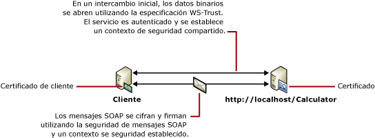

# <a name="message-security-with-a-certificate-client"></a><span data-ttu-id="8df79-102">Seguridad de mensajes con un cliente de certificado</span><span class="sxs-lookup"><span data-stu-id="8df79-102">Message Security with a Certificate Client</span></span>
<span data-ttu-id="8df79-103">El escenario siguiente muestra un servicio y cliente [!INCLUDE[indigo1](../../../../includes/indigo1-md.md)] protegidos utilizando el modo de seguridad de mensajes.</span><span class="sxs-lookup"><span data-stu-id="8df79-103">The following scenario shows a [!INCLUDE[indigo1](../../../../includes/indigo1-md.md)] client and service secured using message security mode.</span></span> <span data-ttu-id="8df79-104">Tanto el cliente como el servicio se autentican con certificados.</span><span class="sxs-lookup"><span data-stu-id="8df79-104">Both the client and the service are authenticated with certificates.</span></span> <span data-ttu-id="8df79-105">Para obtener más información, consulte [seguridad de las aplicaciones distribuidas](../../../../docs/framework/wcf/feature-details/distributed-application-security.md).</span><span class="sxs-lookup"><span data-stu-id="8df79-105">For more information, see [Distributed Application Security](../../../../docs/framework/wcf/feature-details/distributed-application-security.md).</span></span>  
  
 <span data-ttu-id="8df79-106">Para una aplicación de ejemplo, vea [certificado de seguridad de mensaje](../../../../docs/framework/wcf/samples/message-security-certificate.md).</span><span class="sxs-lookup"><span data-stu-id="8df79-106">For a sample application, see [Message Security Certificate](../../../../docs/framework/wcf/samples/message-security-certificate.md).</span></span>  
  
 <span data-ttu-id="8df79-107"></span><span class="sxs-lookup"><span data-stu-id="8df79-107"></span></span>  
  
|<span data-ttu-id="8df79-108">Característica</span><span class="sxs-lookup"><span data-stu-id="8df79-108">Characteristic</span></span>|<span data-ttu-id="8df79-109">Descripción</span><span class="sxs-lookup"><span data-stu-id="8df79-109">Description</span></span>|  
|--------------------|-----------------|  
|<span data-ttu-id="8df79-110">Modo de seguridad</span><span class="sxs-lookup"><span data-stu-id="8df79-110">Security Mode</span></span>|<span data-ttu-id="8df79-111">Mensaje</span><span class="sxs-lookup"><span data-stu-id="8df79-111">Message</span></span>|  
|<span data-ttu-id="8df79-112">Interoperabilidad</span><span class="sxs-lookup"><span data-stu-id="8df79-112">Interoperability</span></span>|<span data-ttu-id="8df79-113">Solo [!INCLUDE[indigo2](../../../../includes/indigo2-md.md)]</span><span class="sxs-lookup"><span data-stu-id="8df79-113">[!INCLUDE[indigo2](../../../../includes/indigo2-md.md)] only</span></span>|  
|<span data-ttu-id="8df79-114">Autenticación (servidor)</span><span class="sxs-lookup"><span data-stu-id="8df79-114">Authentication (Server)</span></span>|<span data-ttu-id="8df79-115">Con el certificado del servicio</span><span class="sxs-lookup"><span data-stu-id="8df79-115">Using service certificate</span></span>|  
|<span data-ttu-id="8df79-116">Autenticación (cliente)</span><span class="sxs-lookup"><span data-stu-id="8df79-116">Authentication (Client)</span></span>|<span data-ttu-id="8df79-117">Con el certificado del cliente</span><span class="sxs-lookup"><span data-stu-id="8df79-117">Using client certificate</span></span>|  
|<span data-ttu-id="8df79-118">Integridad</span><span class="sxs-lookup"><span data-stu-id="8df79-118">Integrity</span></span>|<span data-ttu-id="8df79-119">Sí</span><span class="sxs-lookup"><span data-stu-id="8df79-119">Yes</span></span>|  
|<span data-ttu-id="8df79-120">Confidencialidad</span><span class="sxs-lookup"><span data-stu-id="8df79-120">Confidentiality</span></span>|<span data-ttu-id="8df79-121">Sí</span><span class="sxs-lookup"><span data-stu-id="8df79-121">Yes</span></span>|  
|<span data-ttu-id="8df79-122">Transporte</span><span class="sxs-lookup"><span data-stu-id="8df79-122">Transport</span></span>|<span data-ttu-id="8df79-123">HTTP</span><span class="sxs-lookup"><span data-stu-id="8df79-123">HTTP</span></span>|  
|<span data-ttu-id="8df79-124">Enlaces</span><span class="sxs-lookup"><span data-stu-id="8df79-124">Binding</span></span>|<xref:System.ServiceModel.WSHttpBinding>|  
  
## <a name="service"></a><span data-ttu-id="8df79-125">Servicio</span><span class="sxs-lookup"><span data-stu-id="8df79-125">Service</span></span>  
 <span data-ttu-id="8df79-126">El código y la configuración siguientes están diseñados para ejecutarse de forma independiente.</span><span class="sxs-lookup"><span data-stu-id="8df79-126">The following code and configuration are meant to run independently.</span></span> <span data-ttu-id="8df79-127">Realice una de las siguientes acciones:</span><span class="sxs-lookup"><span data-stu-id="8df79-127">Do one of the following:</span></span>  
  
-   <span data-ttu-id="8df79-128">Cree un servicio independiente mediante el código sin configuración.</span><span class="sxs-lookup"><span data-stu-id="8df79-128">Create a stand-alone service using the code with no configuration.</span></span>  
  
-   <span data-ttu-id="8df79-129">Cree un servicio mediante la configuración proporcionada, pero sin definir ningún extremo.</span><span class="sxs-lookup"><span data-stu-id="8df79-129">Create a service using the supplied configuration, but do not define any endpoints.</span></span>  
  
### <a name="code"></a><span data-ttu-id="8df79-130">Código</span><span class="sxs-lookup"><span data-stu-id="8df79-130">Code</span></span>  
 <span data-ttu-id="8df79-131">El código siguiente muestra cómo crear un punto de conexión de servicio que utilice la seguridad del mensaje para establecer un contexto seguro.</span><span class="sxs-lookup"><span data-stu-id="8df79-131">The following code shows how to create a service endpoint that uses message security to establish a secure context.</span></span>  
  
 [!code-csharp[C_SecurityScenarios#10](../../../../samples/snippets/csharp/VS_Snippets_CFX/c_securityscenarios/cs/source.cs#10)]
 [!code-vb[C_SecurityScenarios#10](../../../../samples/snippets/visualbasic/VS_Snippets_CFX/c_securityscenarios/vb/source.vb#10)]  
  
### <a name="configuration"></a><span data-ttu-id="8df79-132">Configuración</span><span class="sxs-lookup"><span data-stu-id="8df79-132">Configuration</span></span>  
 <span data-ttu-id="8df79-133">En lugar del código, se puede utilizar la siguiente configuración.</span><span class="sxs-lookup"><span data-stu-id="8df79-133">The following configuration can be used instead of the code.</span></span>  
  
```xml  
<?xml version="1.0" encoding="utf-8"?>  
<configuration>  
  <system.serviceModel>  
    <behaviors>  
      <serviceBehaviors>  
        <behavior name="ServiceCredentialsBehavior">  
          <serviceCredentials>  
            <serviceCertificate findValue="Contoso.com"  
                                x509FindType="FindBySubjectName" />  
          </serviceCredentials>  
        </behavior>  
      </serviceBehaviors>  
    </behaviors>  
    <services>  
      <service behaviorConfiguration="ServiceCredentialsBehavior"   
               name="ServiceModel.Calculator">  
        <endpoint address="http://localhost/Calculator"   
                  binding="wsHttpBinding"  
                  bindingConfiguration="MessageAndCerficiateClient"   
                  name="SecuredByClientCertificate"  
                  contract="ServiceModel.ICalculator" />  
      </service>  
    </services>  
    <bindings>  
      <wsHttpBinding>  
        <binding name="WSHttpBinding_ICalculator">  
          <security mode="Message">  
            <message clientCredentialType="Certificate" />  
          </security>  
        </binding>  
      </wsHttpBinding>  
    </bindings>  
    <client />  
  </system.serviceModel>  
</configuration>  
```  
  
## <a name="client"></a><span data-ttu-id="8df79-134">Cliente</span><span class="sxs-lookup"><span data-stu-id="8df79-134">Client</span></span>  
 <span data-ttu-id="8df79-135">El código y la configuración siguientes están diseñados para ejecutarse de forma independiente.</span><span class="sxs-lookup"><span data-stu-id="8df79-135">The following code and configuration are meant to run independently.</span></span> <span data-ttu-id="8df79-136">Realice una de las siguientes acciones:</span><span class="sxs-lookup"><span data-stu-id="8df79-136">Do one of the following:</span></span>  
  
-   <span data-ttu-id="8df79-137">Cree un cliente independiente mediante el código (y el código de cliente).</span><span class="sxs-lookup"><span data-stu-id="8df79-137">Create a stand-alone client using the code (and client code).</span></span>  
  
-   <span data-ttu-id="8df79-138">Cree un cliente que no defina direcciones de extremo.</span><span class="sxs-lookup"><span data-stu-id="8df79-138">Create a client that does not define any endpoint addresses.</span></span> <span data-ttu-id="8df79-139">En su lugar, utilice el constructor de cliente que adopta el nombre de configuración como un argumento.</span><span class="sxs-lookup"><span data-stu-id="8df79-139">Instead, use the client constructor that takes the configuration name as an argument.</span></span> <span data-ttu-id="8df79-140">Por ejemplo:</span><span class="sxs-lookup"><span data-stu-id="8df79-140">For example:</span></span>  
  
     [!code-csharp[C_SecurityScenarios#0](../../../../samples/snippets/csharp/VS_Snippets_CFX/c_securityscenarios/cs/source.cs#0)]
     [!code-vb[C_SecurityScenarios#0](../../../../samples/snippets/visualbasic/VS_Snippets_CFX/c_securityscenarios/vb/source.vb#0)]  
  
### <a name="code"></a><span data-ttu-id="8df79-141">Código</span><span class="sxs-lookup"><span data-stu-id="8df79-141">Code</span></span>  
 <span data-ttu-id="8df79-142">El siguiente código crea el cliente.</span><span class="sxs-lookup"><span data-stu-id="8df79-142">The following code creates the client.</span></span> <span data-ttu-id="8df79-143">El enlace es para la seguridad del modo de mensaje y el tipo de credencial de cliente está establecido en `Certificate`.</span><span class="sxs-lookup"><span data-stu-id="8df79-143">The binding is to message mode security, and the client credential type is set to `Certificate`.</span></span>  
  
 [!code-csharp[C_SecurityScenarios#17](../../../../samples/snippets/csharp/VS_Snippets_CFX/c_securityscenarios/cs/source.cs#17)]
 [!code-vb[C_SecurityScenarios#17](../../../../samples/snippets/visualbasic/VS_Snippets_CFX/c_securityscenarios/vb/source.vb#17)]  
  
### <a name="configuration"></a><span data-ttu-id="8df79-144">Configuración</span><span class="sxs-lookup"><span data-stu-id="8df79-144">Configuration</span></span>  
 <span data-ttu-id="8df79-145">La configuración siguiente especifica el certificado de cliente mediante un comportamiento del punto de conexión.</span><span class="sxs-lookup"><span data-stu-id="8df79-145">The following configuration specifies the client certificate using an endpoint behavior.</span></span> <span data-ttu-id="8df79-146">Para más información, consulte [Trabajar con certificados](../../../../docs/framework/wcf/feature-details/working-with-certificates.md).</span><span class="sxs-lookup"><span data-stu-id="8df79-146">For more information about certificates, see [Working with Certificates](../../../../docs/framework/wcf/feature-details/working-with-certificates.md).</span></span> <span data-ttu-id="8df79-147">El código también usa una <`identity`> elemento para especificar un sistema de nombres de dominio (DNS) de la identidad del servidor esperado.</span><span class="sxs-lookup"><span data-stu-id="8df79-147">The code also uses an <`identity`> element to specify a Domain Name System (DNS) of the expected server identity.</span></span> <span data-ttu-id="8df79-148">Para obtener más información acerca de la identidad, vea [autenticación e identidad de servicio](../../../../docs/framework/wcf/feature-details/service-identity-and-authentication.md).</span><span class="sxs-lookup"><span data-stu-id="8df79-148">For more information about identity, see [Service Identity and Authentication](../../../../docs/framework/wcf/feature-details/service-identity-and-authentication.md).</span></span>  
  
```xml  
<?xml version="1.0" encoding="utf-8"?>  
<configuration>  
  <system.serviceModel>  
    <behaviors>  
      <endpointBehaviors>  
        <behavior name="endpointCredentialsBehavior">  
          <clientCredentials>  
            <clientCertificate findValue="Cohowinery.com"   
               storeLocation="LocalMachine"  
              x509FindType="FindBySubjectName" />  
          </clientCredentials>  
        </behavior>  
      </endpointBehaviors>  
    </behaviors>  
    <bindings>  
      <wsHttpBinding>  
        <binding name="WSHttpBinding_ICalculator" >  
          <security mode="Message">  
            <message clientCredentialType="Certificate" />  
          </security>  
        </binding>  
      </wsHttpBinding>  
    </bindings>  
    <client>  
      <endpoint address="http://machineName/Calculator"   
                behaviorConfiguration="endpointCredentialsBehavior"  
                binding="wsHttpBinding"  
                bindingConfiguration="WSHttpBinding_ICalculator"  
                contract="ICalculator"  
                name="WSHttpBinding_ICalculator">  
        <identity>  
          <dns value="Contoso.com" />  
        </identity>  
      </endpoint>  
    </client>  
  </system.serviceModel>  
</configuration>  
```  
  
## <a name="see-also"></a><span data-ttu-id="8df79-149">Vea también</span><span class="sxs-lookup"><span data-stu-id="8df79-149">See Also</span></span>  
 [<span data-ttu-id="8df79-150">Información general sobre seguridad</span><span class="sxs-lookup"><span data-stu-id="8df79-150">Security Overview</span></span>](../../../../docs/framework/wcf/feature-details/security-overview.md)  
 [<span data-ttu-id="8df79-151">Identidad del servicio y autenticación</span><span class="sxs-lookup"><span data-stu-id="8df79-151">Service Identity and Authentication</span></span>](../../../../docs/framework/wcf/feature-details/service-identity-and-authentication.md)  
 [<span data-ttu-id="8df79-152">Trabajo con certificados</span><span class="sxs-lookup"><span data-stu-id="8df79-152">Working with Certificates</span></span>](../../../../docs/framework/wcf/feature-details/working-with-certificates.md)  
 [<span data-ttu-id="8df79-153">Modelo de seguridad de Windows Server AppFabric</span><span class="sxs-lookup"><span data-stu-id="8df79-153">Security Model for Windows Server App Fabric</span></span>](http://go.microsoft.com/fwlink/?LinkID=201279&clcid=0x409)
