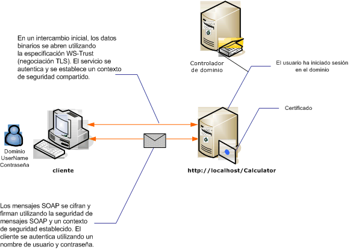

# <a name="message-security-with-a-user-name-client"></a><span data-ttu-id="e76d3-103">Seguridad de los mensajes con un cliente de nombres de usuario</span><span class="sxs-lookup"><span data-stu-id="e76d3-103">Message Security with a User Name Client</span></span>

<span data-ttu-id="e76d3-104">En la ilustración siguiente se muestra un servicio y un cliente de Windows Communication Foundation (WCF) protegidos mediante la seguridad de nivel de mensaje.</span><span class="sxs-lookup"><span data-stu-id="e76d3-104">The following illustration shows an Windows Communication Foundation (WCF) service and client secured using message-level security.</span></span> <span data-ttu-id="e76d3-105">La autenticación del servicio se realiza mediante un certificado X.509.</span><span class="sxs-lookup"><span data-stu-id="e76d3-105">The service is authenticated with an X.509 certificate.</span></span> <span data-ttu-id="e76d3-106">El cliente se autentica utilizando un nombre de usuario y contraseña.</span><span class="sxs-lookup"><span data-stu-id="e76d3-106">The client authenticates using a user name and password.</span></span>  
  
 <span data-ttu-id="e76d3-107">Para obtener una aplicación de ejemplo, vea [nombre de usuario de seguridad de mensaje](../samples/message-security-user-name.md).</span><span class="sxs-lookup"><span data-stu-id="e76d3-107">For a sample application, see [Message Security User Name](../samples/message-security-user-name.md).</span></span>  
  
 <span data-ttu-id="e76d3-108"></span><span class="sxs-lookup"><span data-stu-id="e76d3-108"></span></span>  
  
|<span data-ttu-id="e76d3-109">Característica</span><span class="sxs-lookup"><span data-stu-id="e76d3-109">Characteristic</span></span>|<span data-ttu-id="e76d3-110">Descripción</span><span class="sxs-lookup"><span data-stu-id="e76d3-110">Description</span></span>|  
|--------------------|-----------------|  
|<span data-ttu-id="e76d3-111">Modo de seguridad</span><span class="sxs-lookup"><span data-stu-id="e76d3-111">Security Mode</span></span>|<span data-ttu-id="e76d3-112">Message</span><span class="sxs-lookup"><span data-stu-id="e76d3-112">Message</span></span>|  
|<span data-ttu-id="e76d3-113">Interoperabilidad</span><span class="sxs-lookup"><span data-stu-id="e76d3-113">Interoperability</span></span>|<span data-ttu-id="e76d3-114">Solo Windows Communication Foundation (WCF)</span><span class="sxs-lookup"><span data-stu-id="e76d3-114">Windows Communication Foundation (WCF) only</span></span>|  
|<span data-ttu-id="e76d3-115">Autenticación (servidor)</span><span class="sxs-lookup"><span data-stu-id="e76d3-115">Authentication (Server)</span></span>|<span data-ttu-id="e76d3-116">La negociación inicial requiere autenticación de servidor</span><span class="sxs-lookup"><span data-stu-id="e76d3-116">Initial negotiation requires server authentication</span></span>|  
|<span data-ttu-id="e76d3-117">Autenticación (cliente)</span><span class="sxs-lookup"><span data-stu-id="e76d3-117">Authentication (Client)</span></span>|<span data-ttu-id="e76d3-118">Nombre de usuario/contraseña</span><span class="sxs-lookup"><span data-stu-id="e76d3-118">User name/password</span></span>|  
|<span data-ttu-id="e76d3-119">Integridad</span><span class="sxs-lookup"><span data-stu-id="e76d3-119">Integrity</span></span>|<span data-ttu-id="e76d3-120">Sí, mediante el contexto de seguridad compartido</span><span class="sxs-lookup"><span data-stu-id="e76d3-120">Yes, using shared security context</span></span>|  
|<span data-ttu-id="e76d3-121">Confidencialidad</span><span class="sxs-lookup"><span data-stu-id="e76d3-121">Confidentiality</span></span>|<span data-ttu-id="e76d3-122">Sí, mediante el contexto de seguridad compartido</span><span class="sxs-lookup"><span data-stu-id="e76d3-122">Yes, using shared security context</span></span>|  
|<span data-ttu-id="e76d3-123">Transporte</span><span class="sxs-lookup"><span data-stu-id="e76d3-123">Transport</span></span>|<span data-ttu-id="e76d3-124">HTTP</span><span class="sxs-lookup"><span data-stu-id="e76d3-124">HTTP</span></span>|  
|<span data-ttu-id="e76d3-125">Enlace</span><span class="sxs-lookup"><span data-stu-id="e76d3-125">Binding</span></span>|<xref:System.ServiceModel.WSHttpBinding>|  
  
## <a name="service"></a><span data-ttu-id="e76d3-126">Servicio</span><span class="sxs-lookup"><span data-stu-id="e76d3-126">Service</span></span>  

 <span data-ttu-id="e76d3-127">El código y la configuración siguientes están diseñados para ejecutarse de forma independiente.</span><span class="sxs-lookup"><span data-stu-id="e76d3-127">The following code and configuration are meant to run independently.</span></span> <span data-ttu-id="e76d3-128">Realice una de las siguientes acciones:</span><span class="sxs-lookup"><span data-stu-id="e76d3-128">Do one of the following:</span></span>  
  
- <span data-ttu-id="e76d3-129">Cree un servicio independiente mediante el código sin configuración.</span><span class="sxs-lookup"><span data-stu-id="e76d3-129">Create a stand-alone service using the code with no configuration.</span></span>  
  
- <span data-ttu-id="e76d3-130">Cree un servicio mediante la configuración proporcionada, pero sin definir ningún punto de conexión.</span><span class="sxs-lookup"><span data-stu-id="e76d3-130">Create a service using the supplied configuration, but do not define any endpoints.</span></span>  
  
### <a name="code"></a><span data-ttu-id="e76d3-131">Código</span><span class="sxs-lookup"><span data-stu-id="e76d3-131">Code</span></span>  

 <span data-ttu-id="e76d3-132">El código siguiente muestra cómo crear un extremo de servicio que utiliza la seguridad del mensaje.</span><span class="sxs-lookup"><span data-stu-id="e76d3-132">The following code shows how to create a service endpoint that uses message security.</span></span>  
  
 [!code-csharp[C_SecurityScenarios#9](../../../../samples/snippets/csharp/VS_Snippets_CFX/c_securityscenarios/cs/source.cs#9)]
 [!code-vb[C_SecurityScenarios#9](../../../../samples/snippets/visualbasic/VS_Snippets_CFX/c_securityscenarios/vb/source.vb#9)]  
  
### <a name="configuration"></a><span data-ttu-id="e76d3-133">Configuración</span><span class="sxs-lookup"><span data-stu-id="e76d3-133">Configuration</span></span>  

 <span data-ttu-id="e76d3-134">La siguiente configuración se puede usar en lugar del código.</span><span class="sxs-lookup"><span data-stu-id="e76d3-134">The following configuration can be used instead of the code:</span></span>  
  
```xml  
<?xml version="1.0" encoding="utf-8"?>  
<configuration>  
  <system.serviceModel>  
    <behaviors>  
      <serviceBehaviors>  
        <behavior name="ServiceCredentialsBehavior">  
          <serviceCredentials>  
            <serviceCertificate findValue="Contoso.com"
                                storeLocation="LocalMachine"  
                                storeName="My"
                                x509FindType="FindBySubjectName" />  
          </serviceCredentials>  
        </behavior>  
      </serviceBehaviors>  
    </behaviors>  
    <services>  
      <service behaviorConfiguration="ServiceCredentialsBehavior"  
               name="ServiceModel.Calculator">  
        <endpoint address="http://localhost/Calculator"  
                  binding="wsHttpBinding"  
                  bindingConfiguration="MessageAndUserName"  
                  name="SecuredByTransportEndpoint"  
                  contract="ServiceModel.ICalculator" />  
      </service>  
    </services>  
    <bindings>  
      <wsHttpBinding>  
        <binding name="MessageAndUserName">  
          <security mode="Message">
            <message clientCredentialType="UserName" />  
          </security>  
        </binding>  
      </wsHttpBinding>  
    </bindings>  
    <client />  
  </system.serviceModel>  
</configuration>  
```  
  
## <a name="client"></a><span data-ttu-id="e76d3-135">Cliente</span><span class="sxs-lookup"><span data-stu-id="e76d3-135">Client</span></span>  
  
### <a name="code"></a><span data-ttu-id="e76d3-136">Código</span><span class="sxs-lookup"><span data-stu-id="e76d3-136">Code</span></span>  

 <span data-ttu-id="e76d3-137">El siguiente código crea el cliente.</span><span class="sxs-lookup"><span data-stu-id="e76d3-137">The following code creates the client.</span></span> <span data-ttu-id="e76d3-138">El enlace es para la seguridad del modo de mensaje y el tipo de credencial de cliente está establecido en `UserName`.</span><span class="sxs-lookup"><span data-stu-id="e76d3-138">The binding is to message mode security, and the client credential type is set to `UserName`.</span></span> <span data-ttu-id="e76d3-139">El nombre de usuario y la contraseña solo se pueden especificar mediante código (no es configurable).</span><span class="sxs-lookup"><span data-stu-id="e76d3-139">The user name and password can only be specified using code (it is not configurable).</span></span> <span data-ttu-id="e76d3-140">El código para devolver el nombre de usuario y la contraseña no se muestra aquí porque se debe hacer en el nivel de la aplicación.</span><span class="sxs-lookup"><span data-stu-id="e76d3-140">The code to return the user name and password is not shown here because it must be done at the application level.</span></span> <span data-ttu-id="e76d3-141">Por ejemplo, use un cuadro de diálogo de Windows Forms para solicitar los datos al usuario.</span><span class="sxs-lookup"><span data-stu-id="e76d3-141">For example, use a Windows Forms dialog box to query the user for the data.</span></span>  
  
 [!code-csharp[C_SecurityScenarios#16](../../../../samples/snippets/csharp/VS_Snippets_CFX/c_securityscenarios/cs/source.cs#16)]
 [!code-vb[C_SecurityScenarios#16](../../../../samples/snippets/visualbasic/VS_Snippets_CFX/c_securityscenarios/vb/source.vb#16)]  
  
### <a name="configuration"></a><span data-ttu-id="e76d3-142">Configuración</span><span class="sxs-lookup"><span data-stu-id="e76d3-142">Configuration</span></span>  

 <span data-ttu-id="e76d3-143">El siguiente código configura el cliente.</span><span class="sxs-lookup"><span data-stu-id="e76d3-143">The following code configures the client.</span></span> <span data-ttu-id="e76d3-144">El enlace es para la seguridad del modo de mensaje y el tipo de credencial de cliente está establecido en `UserName`.</span><span class="sxs-lookup"><span data-stu-id="e76d3-144">The binding is to message mode security, and the client credential type is set to `UserName`.</span></span> <span data-ttu-id="e76d3-145">El nombre de usuario y la contraseña solo se pueden especificar mediante código (no es configurable).</span><span class="sxs-lookup"><span data-stu-id="e76d3-145">The user name and password can only be specified using code (it is not configurable).</span></span>  
  
```xml  
<?xml version="1.0" encoding="utf-8"?>  
<configuration>  
  <system.serviceModel>  
    <bindings>  
      <wsHttpBinding>  
        <binding name="WSHttpBinding_ICalculator" >  
          <security mode="Message">  
            <message clientCredentialType="UserName" />  
          </security>  
        </binding>  
      </wsHttpBinding>  
    </bindings>  
    <client>  
      <endpoint address="http://machineName/Calculator"
                binding="wsHttpBinding"  
                bindingConfiguration="WSHttpBinding_ICalculator"
                contract="ICalculator"  
                name="WSHttpBinding_ICalculator">  
        <identity>  
          <dns value ="Contoso.com" />  
        </identity>  
      </endpoint>  
    </client>  
  </system.serviceModel>  
</configuration>  
```  
  
## <a name="see-also"></a><span data-ttu-id="e76d3-146">Vea también</span><span class="sxs-lookup"><span data-stu-id="e76d3-146">See also</span></span>

- [<span data-ttu-id="e76d3-147">Información general sobre seguridad</span><span class="sxs-lookup"><span data-stu-id="e76d3-147">Security Overview</span></span>](security-overview.md)
- [<span data-ttu-id="e76d3-148">Nombre de usuario de seguridad de mensaje</span><span class="sxs-lookup"><span data-stu-id="e76d3-148">Message Security User Name</span></span>](../samples/message-security-user-name.md)
- [<span data-ttu-id="e76d3-149">Identidad del servicio y autenticación</span><span class="sxs-lookup"><span data-stu-id="e76d3-149">Service Identity and Authentication</span></span>](service-identity-and-authentication.md)
- [\<identity>](../../configure-apps/file-schema/wcf/identity.md)
- <span data-ttu-id="e76d3-150">[Modelo de seguridad para Windows Server App Fabric](/previous-versions/appfabric/ee677202(v=azure.10))</span><span class="sxs-lookup"><span data-stu-id="e76d3-150">[Security Model for Windows Server App Fabric](/previous-versions/appfabric/ee677202(v=azure.10))</span></span>
