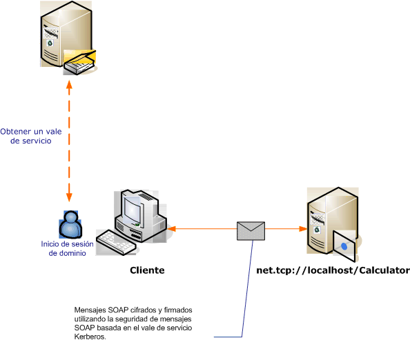

# <a name="message-security-with-a-windows-client-without-credential-negotiation"></a>Seguridad de los mensajes con un cliente de Windows sin negociación de credenciales

En el escenario siguiente se muestra un servicio y un cliente de Windows Communication Foundation (WCF) protegidos por el protocolo Kerberos.

Tanto el servicio como el cliente están en el mismo dominio, o dominios, de confianza.

> [!NOTE]
> La diferencia entre este escenario y la [seguridad de los mensajes con un cliente de Windows](../../../../docs/framework/wcf/feature-details/message-security-with-a-windows-client.md) es que este escenario no negocia la credencial de servicio con el servicio antes de enviar el mensaje de aplicación. Además, debido a la necesidad del protocolo Kerberos, este escenario requiere un entorno de dominio de Windows.



|Característica|Descripción|
|--------------------|-----------------|
|Modo de seguridad|Mensaje|
|Interoperabilidad|Sí, WS-Security con clientes Kerberos compatibles con el perfil del token|
|Autenticación (servidor)|Autenticación mutua del servidor y el cliente|
|Autenticación (cliente)|Autenticación mutua del servidor y el cliente|
|Integridad|Sí|
|Confidencialidad|Sí|
|Transport|HTTP|
|Enlace|<xref:System.ServiceModel.WSHttpBinding>|

## <a name="service"></a>Servicio

El código y la configuración siguientes están diseñados para ejecutarse de forma independiente. Siga uno de los procedimientos que se describen a continuación:

- Cree un servicio independiente mediante el código sin configuración.

- Cree un servicio mediante la configuración proporcionada, pero sin definir ningún punto de conexión.

### <a name="code"></a>Código

El código siguiente crea un extremo de servicio que utiliza el modo de seguridad. El código deshabilita la negociación de la credencial de servicio, y el establecimiento de un token de contexto de seguridad (SCT).

> [!NOTE]
> Para utilizar el tipo de credencial de Windows sin negociación, la cuenta de usuario del servicio debe tener acceso al nombre de entidad de seguridad de servicio (SPN) registrado en el dominio de Active Directory. Hay dos maneras de hacerlo:

1. Utilice el `NetworkService`, o la cuenta `LocalSystem`, para ejecutar el servicio. Dado que esas cuentas tienen acceso al SPN del equipo que se establece cuando el equipo se une al dominio Active Directory, WCF genera automáticamente el elemento SPN apropiado dentro del punto de conexión del servicio en los metadatos del servicio (Descripción de servicios web). Language o WSDL).

2. Utilice una cuenta de dominio arbitraria de Active Directory para ejecutar el servicio. En este caso, es necesario establecer un SPN para esa cuenta de dominio. Una manera de hacerlo es utilizar la herramienta de la utilidad Setspn.exe. Una vez creado el SPN para la cuenta del servicio, configure WCF para publicar ese SPN en los clientes del servicio a través de sus metadatos (WSDL). Esto se consigue estableciendo la identidad del punto de conexión expuesto, mediante un archivo de configuración de la aplicación o el código. El siguiente ejemplo publica la identidad mediante programación.

Para obtener más información acerca de los SPN, el protocolo Kerberos y Active Directory, vea el [suplemento técnico de Kerberos para Windows](https://docs.microsoft.com/previous-versions/msp-n-p/ff649429(v=pandp.10)). Para obtener más información sobre las identidades del extremo, vea [modos de autenticación de SecurityBindingElement](../../../../docs/framework/wcf/feature-details/securitybindingelement-authentication-modes.md).

[!code-csharp[C_SecurityScenarios#12](../../../../samples/snippets/csharp/VS_Snippets_CFX/c_securityscenarios/cs/source.cs#12)]
[!code-vb[C_SecurityScenarios#12](../../../../samples/snippets/visualbasic/VS_Snippets_CFX/c_securityscenarios/vb/source.vb#12)]

### <a name="configuration"></a>Configuración de

En lugar del código, se puede utilizar la siguiente configuración.

```xml
<?xml version="1.0" encoding="utf-8"?>
<configuration>
  <system.serviceModel>
    <behaviors />
    <services>
      <service behaviorConfiguration="" name="ServiceModel.Calculator">
        <endpoint address="http://localhost/Calculator"
                  binding="wsHttpBinding"
                  bindingConfiguration="KerberosBinding"
                  name="WSHttpBinding_ICalculator"
                  contract="ServiceModel.ICalculator"
                  listenUri="net.tcp://localhost/metadata" >
         <identity>
            <servicePrincipalName value="service_spn_name" />
         </identity>
        </endpoint>
      </service>
    </services>
    <bindings>
      <wsHttpBinding>
        <binding name="KerberosBinding">
          <security>
            <message negotiateServiceCredential="false"
                     establishSecurityContext="false" />
          </security>
        </binding>
      </wsHttpBinding>
    </bindings>
    <client />
  </system.serviceModel>
</configuration>
```

## <a name="client"></a>Client

El código y la configuración siguientes están diseñados para ejecutarse de forma independiente. Siga uno de los procedimientos que se describen a continuación:

- Cree un cliente independiente mediante el código (y el código de cliente).

- Cree un cliente que no defina direcciones de punto de conexión. En su lugar, utilice el constructor de cliente que adopta el nombre de configuración como un argumento. Por ejemplo:

  [!code-csharp[C_SecurityScenarios#0](../../../../samples/snippets/csharp/VS_Snippets_CFX/c_securityscenarios/cs/source.cs#0)]
  [!code-vb[C_SecurityScenarios#0](../../../../samples/snippets/visualbasic/VS_Snippets_CFX/c_securityscenarios/vb/source.vb#0)]

### <a name="code"></a>Código

El siguiente código configura el cliente. El modo de seguridad se establece en mensaje, y el tipo de credencial de cliente se establece en Windows. Tenga en cuenta que las propiedades <xref:System.ServiceModel.MessageSecurityOverHttp.NegotiateServiceCredential%2A> y <xref:System.ServiceModel.NonDualMessageSecurityOverHttp.EstablishSecurityContext%2A> se establecen en `false`.

> [!NOTE]
> Para utilizar el tipo de credencial de Windows sin negociación, el cliente debe configurarse con el SPN de la cuenta del servicio, antes de iniciar la comunicación con el servicio. El cliente utiliza el SPN para obtener el token de Kerberos para autenticar y proteger la comunicación con el servicio. El ejemplo siguiente muestra cómo configurar el cliente con el SPN del servicio. Si usa la herramienta de [utilidad de metadatos de ServiceModel (SvcUtil. exe)](../../../../docs/framework/wcf/servicemodel-metadata-utility-tool-svcutil-exe.md) para generar el cliente, el SPN del servicio se propagará automáticamente al cliente desde los metadatos del servicio (WSDL), si los metadatos del servicio contienen esa información. Para obtener más información sobre cómo configurar el servicio para incluir su SPN en los metadatos del servicio, vea la sección "servicio" más adelante en este tema.
>
> Para obtener más información acerca de los SPN, Kerberos y Active Directory, vea el [suplemento técnico de Kerberos para Windows](https://docs.microsoft.com/previous-versions/msp-n-p/ff649429(v=pandp.10)). Para obtener más información sobre las identidades del extremo, vea el tema [modos de autenticación de SecurityBindingElement](../../../../docs/framework/wcf/feature-details/securitybindingelement-authentication-modes.md) .

[!code-csharp[C_SecurityScenarios#19](../../../../samples/snippets/csharp/VS_Snippets_CFX/c_securityscenarios/cs/source.cs#19)]
[!code-vb[C_SecurityScenarios#19](../../../../samples/snippets/visualbasic/VS_Snippets_CFX/c_securityscenarios/vb/source.vb#19)]

### <a name="configuration"></a>Configuración de

El siguiente código configura el cliente. Tenga en cuenta que el elemento [\<servicePrincipalName >](../../../../docs/framework/configure-apps/file-schema/wcf/serviceprincipalname.md) debe establecerse para que coincida con el SPN del servicio registrado para la cuenta del servicio en el dominio de Active Directory.

```xml
<?xml version="1.0" encoding="utf-8"?>
<configuration>
  <system.serviceModel>
    <bindings>
      <wsHttpBinding>
        <binding name="WSHttpBinding_ICalculator" >
          <security mode="Message">
            <message clientCredentialType="Windows"
                     negotiateServiceCredential="false"
                     establishSecurityContext="false" />
          </security>
        </binding>
      </wsHttpBinding>
    </bindings>
    <client>
      <endpoint address="http://localhost/Calculator"
                binding="wsHttpBinding"
                bindingConfiguration="WSHttpBinding_ICalculator"
                contract="ICalculator"
                name="WSHttpBinding_ICalculator">
        <identity>
          <servicePrincipalName value="service_spn_name" />
        </identity>
      </endpoint>
    </client>
  </system.serviceModel>
</configuration>
```

## <a name="see-also"></a>Vea también

- [Información general sobre seguridad](../../../../docs/framework/wcf/feature-details/security-overview.md)
- [Identidad del servicio y autenticación](../../../../docs/framework/wcf/feature-details/service-identity-and-authentication.md)
- [Modelo de seguridad para Windows Server App fabric](https://docs.microsoft.com/previous-versions/appfabric/ee677202(v=azure.10))
