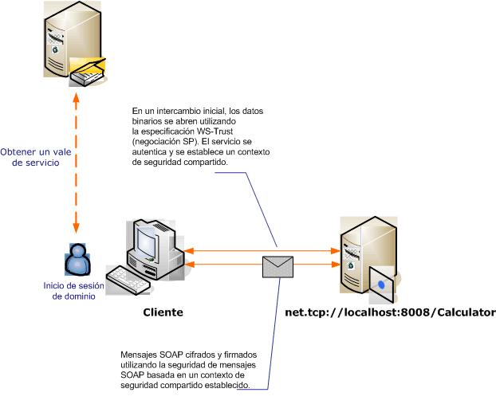

# <a name="message-security-with-a-windows-client"></a><span data-ttu-id="bb4ad-102">Seguridad del mensaje con un cliente de Windows</span><span class="sxs-lookup"><span data-stu-id="bb4ad-102">Message Security with a Windows Client</span></span>
<span data-ttu-id="bb4ad-103">Este escenario muestra un cliente y un servidor Windows Communication Foundation (WCF) protegidos por el modo de seguridad de mensajes.</span><span class="sxs-lookup"><span data-stu-id="bb4ad-103">This scenario shows a Windows Communication Foundation (WCF) client and server secured by message security mode.</span></span> <span data-ttu-id="bb4ad-104">El cliente y el servicio se autentican utilizando las credenciales de Windows.</span><span class="sxs-lookup"><span data-stu-id="bb4ad-104">The client and service are authenticated using Windows credentials.</span></span>  
  
 <span data-ttu-id="bb4ad-105"></span><span class="sxs-lookup"><span data-stu-id="bb4ad-105"></span></span>  
  
|<span data-ttu-id="bb4ad-106">Característica</span><span class="sxs-lookup"><span data-stu-id="bb4ad-106">Characteristic</span></span>|<span data-ttu-id="bb4ad-107">Descripción</span><span class="sxs-lookup"><span data-stu-id="bb4ad-107">Description</span></span>|  
|--------------------|-----------------|  
|<span data-ttu-id="bb4ad-108">Modo de seguridad</span><span class="sxs-lookup"><span data-stu-id="bb4ad-108">Security Mode</span></span>|<span data-ttu-id="bb4ad-109">Mensaje</span><span class="sxs-lookup"><span data-stu-id="bb4ad-109">Message</span></span>|  
|<span data-ttu-id="bb4ad-110">Interoperabilidad</span><span class="sxs-lookup"><span data-stu-id="bb4ad-110">Interoperability</span></span>|<span data-ttu-id="bb4ad-111">Solo WCF</span><span class="sxs-lookup"><span data-stu-id="bb4ad-111">WCF Only</span></span>|  
|<span data-ttu-id="bb4ad-112">Autenticación (servidor)</span><span class="sxs-lookup"><span data-stu-id="bb4ad-112">Authentication (Server)</span></span>|<span data-ttu-id="bb4ad-113">Autenticación mutua del servidor y el cliente</span><span class="sxs-lookup"><span data-stu-id="bb4ad-113">Mutual authentication of the server and client</span></span>|  
|<span data-ttu-id="bb4ad-114">Autenticación (cliente)</span><span class="sxs-lookup"><span data-stu-id="bb4ad-114">Authentication (Client)</span></span>|<span data-ttu-id="bb4ad-115">Autenticación mutua del servidor y el cliente</span><span class="sxs-lookup"><span data-stu-id="bb4ad-115">Mutual authentication of the server and client</span></span>|  
|<span data-ttu-id="bb4ad-116">Integridad</span><span class="sxs-lookup"><span data-stu-id="bb4ad-116">Integrity</span></span>|<span data-ttu-id="bb4ad-117">Sí, mediante el contexto de seguridad compartido</span><span class="sxs-lookup"><span data-stu-id="bb4ad-117">Yes, using shared security context</span></span>|  
|<span data-ttu-id="bb4ad-118">Confidencialidad</span><span class="sxs-lookup"><span data-stu-id="bb4ad-118">Confidentiality</span></span>|<span data-ttu-id="bb4ad-119">Sí, mediante el contexto de seguridad compartido</span><span class="sxs-lookup"><span data-stu-id="bb4ad-119">Yes, using shared security context</span></span>|  
|<span data-ttu-id="bb4ad-120">Transporte</span><span class="sxs-lookup"><span data-stu-id="bb4ad-120">Transport</span></span>|<span data-ttu-id="bb4ad-121">NET.TCP</span><span class="sxs-lookup"><span data-stu-id="bb4ad-121">NET.TCP</span></span>|  
|<span data-ttu-id="bb4ad-122">Enlace</span><span class="sxs-lookup"><span data-stu-id="bb4ad-122">Binding</span></span>|<xref:System.ServiceModel.NetTcpBinding>|  
  
## <a name="service"></a><span data-ttu-id="bb4ad-123">Servicio</span><span class="sxs-lookup"><span data-stu-id="bb4ad-123">Service</span></span>  
 <span data-ttu-id="bb4ad-124">El código y la configuración siguientes están diseñados para ejecutarse de forma independiente.</span><span class="sxs-lookup"><span data-stu-id="bb4ad-124">The following code and configuration are meant to run independently.</span></span> <span data-ttu-id="bb4ad-125">Realice una de las siguientes acciones:</span><span class="sxs-lookup"><span data-stu-id="bb4ad-125">Do one of the following:</span></span>  
  
- <span data-ttu-id="bb4ad-126">Cree un servicio independiente mediante el código sin configuración.</span><span class="sxs-lookup"><span data-stu-id="bb4ad-126">Create a stand-alone service using the code with no configuration.</span></span>  
  
- <span data-ttu-id="bb4ad-127">Cree un servicio mediante la configuración proporcionada, pero sin definir ningún punto de conexión.</span><span class="sxs-lookup"><span data-stu-id="bb4ad-127">Create a service using the supplied configuration, but do not define any endpoints.</span></span>  
  
### <a name="code"></a><span data-ttu-id="bb4ad-128">Código</span><span class="sxs-lookup"><span data-stu-id="bb4ad-128">Code</span></span>  
 <span data-ttu-id="bb4ad-129">El código siguiente muestra cómo crear un extremo de servicio que utiliza la seguridad del mensaje para establecer un contexto seguro con una máquina Windows.</span><span class="sxs-lookup"><span data-stu-id="bb4ad-129">The following code shows how to create a service endpoint that uses message security to establish a secure context with a Windows machine.</span></span>  
  
 [!code-csharp[C_SecurityScenarios#11](../../../../samples/snippets/csharp/VS_Snippets_CFX/c_securityscenarios/cs/source.cs#11)]
 [!code-vb[C_SecurityScenarios#11](../../../../samples/snippets/visualbasic/VS_Snippets_CFX/c_securityscenarios/vb/source.vb#11)]  
  
### <a name="configuration"></a><span data-ttu-id="bb4ad-130">Configuración</span><span class="sxs-lookup"><span data-stu-id="bb4ad-130">Configuration</span></span>  
 <span data-ttu-id="bb4ad-131">Se puede usar la configuración siguiente en lugar del código para preparar el servicio:</span><span class="sxs-lookup"><span data-stu-id="bb4ad-131">The following configuration can be used instead of the code to set up the service:</span></span>  
  
```xml  
<?xml version="1.0" encoding="utf-8"?>  
<configuration>  
  <system.serviceModel>  
    <services>  
      <service behaviorConfiguration=""  
               name="ServiceModel.Calculator">  
        <endpoint address="net.tcp://localhost:8008/Calculator"  
                  binding="netTcpBinding"  
                  bindingConfiguration="Windows"  
                  name="WindowsOverMessage"  
                  contract="ServiceModel.ICalculator" />  
      </service>  
    </services>  
    <bindings>  
      <netTcpBinding>  
        <binding name="Windows">  
          <security mode="Message">  
            <message clientCredentialType="Windows" />  
          </security>  
        </binding>  
      </netTcpBinding>  
    </bindings>  
    <client />  
  </system.serviceModel>  
</configuration>  
```  
  
## <a name="client"></a><span data-ttu-id="bb4ad-132">Cliente</span><span class="sxs-lookup"><span data-stu-id="bb4ad-132">Client</span></span>  
 <span data-ttu-id="bb4ad-133">El código y la configuración siguientes están diseñados para ejecutarse de forma independiente.</span><span class="sxs-lookup"><span data-stu-id="bb4ad-133">The following code and configuration are meant to run independently.</span></span> <span data-ttu-id="bb4ad-134">Realice una de las siguientes acciones:</span><span class="sxs-lookup"><span data-stu-id="bb4ad-134">Do one of the following:</span></span>  
  
- <span data-ttu-id="bb4ad-135">Cree un cliente independiente mediante el código (y el código de cliente).</span><span class="sxs-lookup"><span data-stu-id="bb4ad-135">Create a stand-alone client using the code (and client code).</span></span>  
  
- <span data-ttu-id="bb4ad-136">Cree un cliente que no defina direcciones de punto de conexión.</span><span class="sxs-lookup"><span data-stu-id="bb4ad-136">Create a client that does not define any endpoint addresses.</span></span> <span data-ttu-id="bb4ad-137">En su lugar, utilice el constructor de cliente que adopta el nombre de configuración como un argumento.</span><span class="sxs-lookup"><span data-stu-id="bb4ad-137">Instead, use the client constructor that takes the configuration name as an argument.</span></span> <span data-ttu-id="bb4ad-138">Por ejemplo:</span><span class="sxs-lookup"><span data-stu-id="bb4ad-138">For example:</span></span>  
  
     [!code-csharp[C_SecurityScenarios#0](../../../../samples/snippets/csharp/VS_Snippets_CFX/c_securityscenarios/cs/source.cs#0)]
     [!code-vb[C_SecurityScenarios#0](../../../../samples/snippets/visualbasic/VS_Snippets_CFX/c_securityscenarios/vb/source.vb#0)]  
  
### <a name="code"></a><span data-ttu-id="bb4ad-139">Código</span><span class="sxs-lookup"><span data-stu-id="bb4ad-139">Code</span></span>  
 <span data-ttu-id="bb4ad-140">El siguiente código crea un cliente.</span><span class="sxs-lookup"><span data-stu-id="bb4ad-140">The following code creates a client.</span></span> <span data-ttu-id="bb4ad-141">El enlace es para la seguridad del modo de mensaje y el tipo de credencial de cliente está establecido para `Windows`.</span><span class="sxs-lookup"><span data-stu-id="bb4ad-141">The binding is to Message mode security, and the client credential type is set to `Windows`.</span></span>  
  
 [!code-csharp[C_SecurityScenarios#18](../../../../samples/snippets/csharp/VS_Snippets_CFX/c_securityscenarios/cs/source.cs#18)]
 [!code-vb[C_SecurityScenarios#18](../../../../samples/snippets/visualbasic/VS_Snippets_CFX/c_securityscenarios/vb/source.vb#18)]  
  
### <a name="configuration"></a><span data-ttu-id="bb4ad-142">Configuración</span><span class="sxs-lookup"><span data-stu-id="bb4ad-142">Configuration</span></span>  
 <span data-ttu-id="bb4ad-143">La configuración siguiente se utiliza para establecer las propiedades del cliente.</span><span class="sxs-lookup"><span data-stu-id="bb4ad-143">The following configuration is used to set the client properties.</span></span>  
  
```xml  
<?xml version="1.0" encoding="utf-8"?>  
<configuration>  
  <system.serviceModel>  
    <bindings>  
      <netTcpBinding>  
        <binding name="NetTcpBinding_ICalculator" >  
         <security mode="Message">  
            <message clientCredentialType="Windows" />  
          </security>  
        </binding>  
      </netTcpBinding>  
    </bindings>  
    <client>  
      <endpoint address="net.tcp://machineName:8008/Calculator"
                binding="netTcpBinding"  
                bindingConfiguration="NetTcpBinding_ICalculator"  
                contract="ICalculator"  
                name="NetTcpBinding_ICalculator">
      </endpoint>  
    </client>  
  </system.serviceModel>  
</configuration>  
```  
  
## <a name="see-also"></a><span data-ttu-id="bb4ad-144">Vea también</span><span class="sxs-lookup"><span data-stu-id="bb4ad-144">See also</span></span>

- [<span data-ttu-id="bb4ad-145">Información general sobre seguridad</span><span class="sxs-lookup"><span data-stu-id="bb4ad-145">Security Overview</span></span>](security-overview.md)
- <span data-ttu-id="bb4ad-146">[Modelo de seguridad para Windows Server App Fabric](/previous-versions/appfabric/ee677202(v=azure.10))</span><span class="sxs-lookup"><span data-stu-id="bb4ad-146">[Security Model for Windows Server App Fabric](/previous-versions/appfabric/ee677202(v=azure.10))</span></span>
