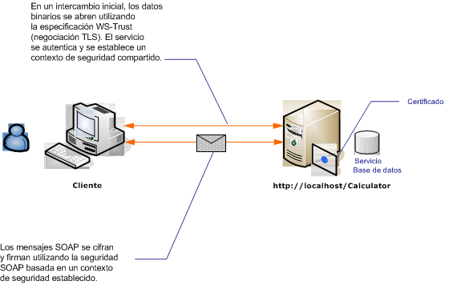

# <a name="message-security-with-an-anonymous-client"></a><span data-ttu-id="b3be8-102">Seguridad de mensajes con clientes anónimos</span><span class="sxs-lookup"><span data-stu-id="b3be8-102">Message Security with an Anonymous Client</span></span>

<span data-ttu-id="b3be8-103">En el siguiente escenario se muestra un cliente y un servicio protegidos por la seguridad de mensajes de Windows Communication Foundation (WCF).</span><span class="sxs-lookup"><span data-stu-id="b3be8-103">The following scenario shows a client and service secured by Windows Communication Foundation (WCF) message security.</span></span> <span data-ttu-id="b3be8-104">Un objetivo del diseño es usar la seguridad del mensaje en lugar de la seguridad de transporte, para que en el futuro pueda admitir un modelo basado en notificaciones más completo.</span><span class="sxs-lookup"><span data-stu-id="b3be8-104">A design goal is to use message security rather than transport security, so that in the future it can support a richer claims-based model.</span></span> <span data-ttu-id="b3be8-105">Para obtener más información sobre el uso de notificaciones enriquecidas para la autorización, consulte [Administración de notificaciones y autorización con el modelo de identidad](../../../../docs/framework/wcf/feature-details/managing-claims-and-authorization-with-the-identity-model.md).</span><span class="sxs-lookup"><span data-stu-id="b3be8-105">For more information about using rich claims for authorization, see [Managing Claims and Authorization with the Identity Model](../../../../docs/framework/wcf/feature-details/managing-claims-and-authorization-with-the-identity-model.md).</span></span>

<span data-ttu-id="b3be8-106">Para obtener una aplicación de ejemplo, vea [seguridad de mensajes anónima](../../../../docs/framework/wcf/samples/message-security-anonymous.md).</span><span class="sxs-lookup"><span data-stu-id="b3be8-106">For a sample application, see [Message Security Anonymous](../../../../docs/framework/wcf/samples/message-security-anonymous.md).</span></span>

<span data-ttu-id="b3be8-107"></span><span class="sxs-lookup"><span data-stu-id="b3be8-107"></span></span>

|<span data-ttu-id="b3be8-108">Característica</span><span class="sxs-lookup"><span data-stu-id="b3be8-108">Characteristic</span></span>|<span data-ttu-id="b3be8-109">Descripción</span><span class="sxs-lookup"><span data-stu-id="b3be8-109">Description</span></span>|
|--------------------|-----------------|
|<span data-ttu-id="b3be8-110">Modo de seguridad</span><span class="sxs-lookup"><span data-stu-id="b3be8-110">Security Mode</span></span>|<span data-ttu-id="b3be8-111">Mensaje</span><span class="sxs-lookup"><span data-stu-id="b3be8-111">Message</span></span>|
|<span data-ttu-id="b3be8-112">Interoperabilidad</span><span class="sxs-lookup"><span data-stu-id="b3be8-112">Interoperability</span></span>|<span data-ttu-id="b3be8-113">Solo WCF</span><span class="sxs-lookup"><span data-stu-id="b3be8-113">WCF only</span></span>|
|<span data-ttu-id="b3be8-114">Autenticación (servidor)</span><span class="sxs-lookup"><span data-stu-id="b3be8-114">Authentication (Server)</span></span>|<span data-ttu-id="b3be8-115">La negociación inicial requiere la autenticación del servidor, pero no la autenticación del cliente</span><span class="sxs-lookup"><span data-stu-id="b3be8-115">Initial negotiation requires server authentication, but not client authentication</span></span>|
|<span data-ttu-id="b3be8-116">Autenticación (cliente)</span><span class="sxs-lookup"><span data-stu-id="b3be8-116">Authentication (Client)</span></span>|<span data-ttu-id="b3be8-117">Ninguno</span><span class="sxs-lookup"><span data-stu-id="b3be8-117">None</span></span>|
|<span data-ttu-id="b3be8-118">Integridad</span><span class="sxs-lookup"><span data-stu-id="b3be8-118">Integrity</span></span>|<span data-ttu-id="b3be8-119">Sí, mediante el contexto de seguridad compartido</span><span class="sxs-lookup"><span data-stu-id="b3be8-119">Yes, using shared security context</span></span>|
|<span data-ttu-id="b3be8-120">Confidencialidad</span><span class="sxs-lookup"><span data-stu-id="b3be8-120">Confidentiality</span></span>|<span data-ttu-id="b3be8-121">Sí, mediante el contexto de seguridad compartido</span><span class="sxs-lookup"><span data-stu-id="b3be8-121">Yes, using shared security context</span></span>|
|<span data-ttu-id="b3be8-122">Transport</span><span class="sxs-lookup"><span data-stu-id="b3be8-122">Transport</span></span>|<span data-ttu-id="b3be8-123">HTTP</span><span class="sxs-lookup"><span data-stu-id="b3be8-123">HTTP</span></span>|

## <a name="service"></a><span data-ttu-id="b3be8-124">Servicio</span><span class="sxs-lookup"><span data-stu-id="b3be8-124">Service</span></span>

<span data-ttu-id="b3be8-125">El código y la configuración siguientes están diseñados para ejecutarse de forma independiente.</span><span class="sxs-lookup"><span data-stu-id="b3be8-125">The following code and configuration are meant to run independently.</span></span> <span data-ttu-id="b3be8-126">Siga uno de los procedimientos que se describen a continuación:</span><span class="sxs-lookup"><span data-stu-id="b3be8-126">Do one of the following:</span></span>

- <span data-ttu-id="b3be8-127">Cree un servicio independiente mediante el código sin configuración.</span><span class="sxs-lookup"><span data-stu-id="b3be8-127">Create a stand-alone service using the code with no configuration.</span></span>

- <span data-ttu-id="b3be8-128">Cree un servicio mediante la configuración proporcionada, pero sin definir ningún punto de conexión.</span><span class="sxs-lookup"><span data-stu-id="b3be8-128">Create a service using the supplied configuration, but do not define any endpoints.</span></span>

### <a name="code"></a><span data-ttu-id="b3be8-129">Código</span><span class="sxs-lookup"><span data-stu-id="b3be8-129">Code</span></span>

<span data-ttu-id="b3be8-130">El código siguiente muestra cómo crear un extremo de servicio que utiliza la seguridad del mensaje.</span><span class="sxs-lookup"><span data-stu-id="b3be8-130">The following code shows how to create a service endpoint that uses message security.</span></span>

[!code-csharp[C_SecurityScenarios#8](../../../../samples/snippets/csharp/VS_Snippets_CFX/c_securityscenarios/cs/source.cs#8)]
[!code-vb[C_SecurityScenarios#8](../../../../samples/snippets/visualbasic/VS_Snippets_CFX/c_securityscenarios/vb/source.vb#8)]

### <a name="configuration"></a><span data-ttu-id="b3be8-131">Configuración de</span><span class="sxs-lookup"><span data-stu-id="b3be8-131">Configuration</span></span>

<span data-ttu-id="b3be8-132">En lugar del código, se puede utilizar la siguiente configuración.</span><span class="sxs-lookup"><span data-stu-id="b3be8-132">The following configuration can be used instead of the code.</span></span> <span data-ttu-id="b3be8-133">El elemento de comportamiento del servicio se utiliza para especificar un certificado utilizado para autenticar el servicio al cliente.</span><span class="sxs-lookup"><span data-stu-id="b3be8-133">The service behavior element is used to specify a certificate that is used to authenticate the service to the client.</span></span> <span data-ttu-id="b3be8-134">El elemento de servicio debe especificar el comportamiento mediante el atributo `behaviorConfiguration`.</span><span class="sxs-lookup"><span data-stu-id="b3be8-134">The service element must specify the behavior using the `behaviorConfiguration` attribute.</span></span> <span data-ttu-id="b3be8-135">El elemento de enlace especifica que el tipo de credencial de cliente es `None`, de modo que permite a los clientes anónimos utilizar el servicio.</span><span class="sxs-lookup"><span data-stu-id="b3be8-135">The binding element specifies that the client credential type is `None`, allowing anonymous clients to use the service.</span></span>

```xml
<?xml version="1.0" encoding="utf-8"?>
<configuration>
  <system.serviceModel>
    <behaviors>
      <serviceBehaviors>
        <behavior name="ServiceCredentialsBehavior">
          <serviceCredentials>
            <serviceCertificate findValue="contoso.com"
                                storeLocation="LocalMachine"
                                storeName="My" />
          </serviceCredentials>
        </behavior>
      </serviceBehaviors>
    </behaviors>
    <services>
      <service behaviorConfiguration="ServiceCredentialsBehavior"
               name="ServiceModel.Calculator">
        <endpoint address="http://localhost/Calculator"
                  binding="wsHttpBinding"
                  bindingConfiguration="WSHttpBinding_ICalculator"
                  name="CalculatorService"
                  contract="ServiceModel.ICalculator" />
      </service>
    </services>
    <bindings>
      <wsHttpBinding>
        <binding name="WSHttpBinding_ICalculator" >
          <security mode="Message">
            <message clientCredentialType="None" />
          </security>
        </binding>
      </wsHttpBinding>
    </bindings>
    <client />
  </system.serviceModel>
</configuration>
```

## <a name="client"></a><span data-ttu-id="b3be8-136">Client</span><span class="sxs-lookup"><span data-stu-id="b3be8-136">Client</span></span>

<span data-ttu-id="b3be8-137">El código y la configuración siguientes están diseñados para ejecutarse de forma independiente.</span><span class="sxs-lookup"><span data-stu-id="b3be8-137">The following code and configuration are meant to run independently.</span></span> <span data-ttu-id="b3be8-138">Siga uno de los procedimientos que se describen a continuación:</span><span class="sxs-lookup"><span data-stu-id="b3be8-138">Do one of the following:</span></span>

- <span data-ttu-id="b3be8-139">Cree un cliente independiente mediante el código (y el código de cliente).</span><span class="sxs-lookup"><span data-stu-id="b3be8-139">Create a stand-alone client using the code (and client code).</span></span>

- <span data-ttu-id="b3be8-140">Cree un cliente que no defina direcciones de punto de conexión.</span><span class="sxs-lookup"><span data-stu-id="b3be8-140">Create a client that does not define any endpoint addresses.</span></span> <span data-ttu-id="b3be8-141">En su lugar, utilice el constructor de cliente que adopta el nombre de configuración como un argumento.</span><span class="sxs-lookup"><span data-stu-id="b3be8-141">Instead, use the client constructor that takes the configuration name as an argument.</span></span> <span data-ttu-id="b3be8-142">Por ejemplo:</span><span class="sxs-lookup"><span data-stu-id="b3be8-142">For example:</span></span>

    [!code-csharp[C_SecurityScenarios#0](../../../../samples/snippets/csharp/VS_Snippets_CFX/c_securityscenarios/cs/source.cs#0)]
    [!code-vb[C_SecurityScenarios#0](../../../../samples/snippets/visualbasic/VS_Snippets_CFX/c_securityscenarios/vb/source.vb#0)]

### <a name="code"></a><span data-ttu-id="b3be8-143">Código</span><span class="sxs-lookup"><span data-stu-id="b3be8-143">Code</span></span>

<span data-ttu-id="b3be8-144">En el ejemplo de código siguiente se crea una instancia de cliente.</span><span class="sxs-lookup"><span data-stu-id="b3be8-144">The following code creates an instance of the client.</span></span> <span data-ttu-id="b3be8-145">El enlace utiliza seguridad en modo de mensaje y el tipo de credencial de cliente está establecido como ninguno.</span><span class="sxs-lookup"><span data-stu-id="b3be8-145">The binding uses message mode security, and the client credential type is set to none.</span></span>

[!code-csharp[C_SecurityScenarios#15](../../../../samples/snippets/csharp/VS_Snippets_CFX/c_securityscenarios/cs/source.cs#15)]
[!code-vb[C_SecurityScenarios#15](../../../../samples/snippets/visualbasic/VS_Snippets_CFX/c_securityscenarios/vb/source.vb#15)]

### <a name="configuration"></a><span data-ttu-id="b3be8-146">Configuración de</span><span class="sxs-lookup"><span data-stu-id="b3be8-146">Configuration</span></span>

<span data-ttu-id="b3be8-147">El siguiente código configura el cliente.</span><span class="sxs-lookup"><span data-stu-id="b3be8-147">The following code configures the client.</span></span>

```xml
<?xml version="1.0" encoding="utf-8"?>
<configuration>
  <system.serviceModel>
    <bindings>
      <wsHttpBinding>
        <binding name="WSHttpBinding_ICalculator" >
          <security mode="Message">
            <message clientCredentialType="None" />
          </security>
        </binding>
      </wsHttpBinding>
    </bindings>
    <client>
      <endpoint address="http://machineName/Calculator"
        binding="wsHttpBinding"
        bindingConfiguration="WSHttpBinding_ICalculator"
        contract="ICalculator"
        name="WSHttpBinding_ICalculator">
        <identity>
          <dns value="contoso.com" />
        </identity>
      </endpoint>
    </client>
  </system.serviceModel>
</configuration>
```

## <a name="see-also"></a><span data-ttu-id="b3be8-148">Vea también</span><span class="sxs-lookup"><span data-stu-id="b3be8-148">See also</span></span>

- [<span data-ttu-id="b3be8-149">Información general sobre seguridad</span><span class="sxs-lookup"><span data-stu-id="b3be8-149">Security Overview</span></span>](../../../../docs/framework/wcf/feature-details/security-overview.md)
- [<span data-ttu-id="b3be8-150">Seguridad distribuida de aplicaciones</span><span class="sxs-lookup"><span data-stu-id="b3be8-150">Distributed Application Security</span></span>](../../../../docs/framework/wcf/feature-details/distributed-application-security.md)
- [<span data-ttu-id="b3be8-151">Seguridad de mensaje anónima</span><span class="sxs-lookup"><span data-stu-id="b3be8-151">Message Security Anonymous</span></span>](../../../../docs/framework/wcf/samples/message-security-anonymous.md)
- [<span data-ttu-id="b3be8-152">Identidad del servicio y autenticación</span><span class="sxs-lookup"><span data-stu-id="b3be8-152">Service Identity and Authentication</span></span>](../../../../docs/framework/wcf/feature-details/service-identity-and-authentication.md)
- <span data-ttu-id="b3be8-153">[Modelo de seguridad para Windows Server App fabric](https://docs.microsoft.com/previous-versions/appfabric/ee677202(v=azure.10))</span><span class="sxs-lookup"><span data-stu-id="b3be8-153">[Security Model for Windows Server App Fabric](https://docs.microsoft.com/previous-versions/appfabric/ee677202(v=azure.10))</span></span>
