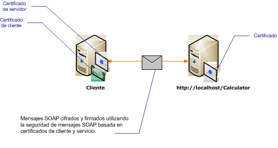

# <a name="message-security-with-mutual-certificates"></a>Seguridad de mensajes con certificados mutuos
En el siguiente escenario se muestra un servicio de Windows Communication Foundation (WCF) y un cliente protegido mediante el modo de seguridad de mensajes. El cliente y el servicio se autentican con certificados.  
  
 Este escenario es interoperable porque utiliza WS-Security con el perfil de token de certificado X.509.  
  
> [!NOTE]
> Este escenario no realiza negociación del certificado del servicio. El certificado del servicio debe ser proporcionado de antemano al cliente de cualquier comunicación. El certificado de servidor se puede distribuir con la aplicación o puede ser proporcionado en una comunicación fuera de banda.  
  
   
  
|Característica|Descripción|  
|--------------------|-----------------|  
|Modo de seguridad|Mensaje|  
|Interoperabilidad|Sí, clientes y servicios compatibles con WS-Security y el perfil de token de certificado X.509.|  
|Autenticación|Autenticación mutua del servidor y el cliente.|  
|Integridad|Sí|  
|Confidencialidad|Sí|  
|Transport|HTTP|  
|Enlace|<xref:System.ServiceModel.WSHttpBinding>|  
  
## <a name="service"></a>Servicio  
 El código y la configuración siguientes están diseñados para ejecutarse de forma independiente. Siga uno de los procedimientos que se describen a continuación:  
  
- Cree un servicio independiente mediante el código sin configuración.  
  
- Cree un servicio mediante la configuración proporcionada, pero sin definir ningún punto de conexión.  
  
### <a name="code"></a>Código  
 El código siguiente muestra cómo crear un punto de conexión de servicio que utilice la seguridad del mensaje. El servicio exige a un certificado que se autentique.  
  
 [!code-csharp[C_SecurityScenarios#13](../../../../samples/snippets/csharp/VS_Snippets_CFX/c_securityscenarios/cs/source.cs#13)]
 [!code-vb[C_SecurityScenarios#13](../../../../samples/snippets/visualbasic/VS_Snippets_CFX/c_securityscenarios/vb/source.vb#13)]  
  
### <a name="configuration"></a>Configuración de  
 La configuración siguiente se puede utilizar en lugar del código para crear el mismo servicio.  
  
```xml  
<?xml version="1.0" encoding="utf-8"?>  
<configuration>  
  <system.serviceModel>  
    <behaviors>  
      <serviceBehaviors>  
        <behavior name="serviceCredentialBehavior">  
          <serviceCredentials>  
            <serviceCertificate findValue="Contoso.com"   
                                storeLocation="LocalMachine"  
                                storeName="My"   
                                x509FindType="FindBySubjectName" />  
          </serviceCredentials>  
        </behavior>  
      </serviceBehaviors>  
    </behaviors>  
    <services>  
      <service behaviorConfiguration="serviceCredentialBehavior"   
               name="ServiceModel.Calculator">  
        <endpoint address="http://localhost/Calculator"   
                  binding="wsHttpBinding"  
                  bindingConfiguration="InteropCertificateBinding"  
                  name="WSHttpBinding_ICalculator"  
                  contract="ServiceModel.ICalculator" />  
      </service>  
    </services>  
    <bindings>  
      <wsHttpBinding>  
        <binding name="InteropCertificateBinding">  
          <security mode="Message">  
            <message clientCredentialType="Certificate"  
                     negotiateServiceCredential="false"  
                     establishSecurityContext="false" />  
          </security>  
        </binding>  
      </wsHttpBinding>  
    </bindings>  
    <client />  
  </system.serviceModel>  
</configuration>  
```  
  
## <a name="client"></a>Client  
 El código y la configuración siguientes están diseñados para ejecutarse de forma independiente. Siga uno de los procedimientos que se describen a continuación:  
  
- Cree un cliente independiente mediante el código (y el código de cliente).  
  
- Cree un cliente que no defina direcciones de punto de conexión. En su lugar, utilice el constructor de cliente que adopta el nombre de configuración como un argumento. Por ejemplo:  
  
     [!code-csharp[C_SecurityScenarios#0](../../../../samples/snippets/csharp/VS_Snippets_CFX/c_securityscenarios/cs/source.cs#0)]
     [!code-vb[C_SecurityScenarios#0](../../../../samples/snippets/visualbasic/VS_Snippets_CFX/c_securityscenarios/vb/source.vb#0)]  
  
### <a name="code"></a>Código  
 El siguiente código crea el cliente. El modo de seguridad se establece en mensaje, y el tipo de credencial de cliente se establece en certificado.  
  
 [!code-csharp[C_SecurityScenarios#20](../../../../samples/snippets/csharp/VS_Snippets_CFX/c_securityscenarios/cs/source.cs#20)]
 [!code-vb[C_SecurityScenarios#20](../../../../samples/snippets/visualbasic/VS_Snippets_CFX/c_securityscenarios/vb/source.vb#20)]  
  
### <a name="configuration"></a>Configuración de  
 Lo siguiente configura el cliente. Se debe especificar un certificado de cliente mediante el [\<clientCertificate >](../../../../docs/framework/configure-apps/file-schema/wcf/clientcertificate-of-clientcredentials-element.md). Además, el certificado del servicio se especifica mediante el [\<defaultCertificate >](../../../../docs/framework/configure-apps/file-schema/wcf/defaultcertificate-element.md).  
  
```xml  
<?xml version="1.0" encoding="utf-8"?>  
<configuration>  
  <system.serviceModel>  
    <behaviors>  
      <endpointBehaviors>  
        <behavior name="ClientCredentialsBehavior">  
          <clientCredentials>  
            <clientCertificate findValue="Cohowinery.com"   
                 storeLocation="CurrentUser"  
                 storeName="My"  
                 x509FindType="FindBySubjectName" />  
            <serviceCertificate>  
              <defaultCertificate findValue="Contoso.com"   
                                  storeLocation="CurrentUser"  
                                  storeName="TrustedPeople"  
                                  x509FindType="FindBySubjectName" />  
            </serviceCertificate>  
          </clientCredentials>  
        </behavior>  
      </endpointBehaviors>  
    </behaviors>  
    <bindings>  
      <wsHttpBinding>  
        <binding name="WSHttpBinding_ICalculator" >  
          <security mode="Message">  
            <message clientCredentialType="Certificate"   
                     negotiateServiceCredential="false"  
                     establishSecurityContext="false" />  
          </security>  
        </binding>  
      </wsHttpBinding>  
    </bindings>  
    <client>  
      <endpoint address="http://machineName/Calculator"   
                behaviorConfiguration="ClientCredentialsBehavior"  
                binding="wsHttpBinding"   
                bindingConfiguration="WSHttpBinding_ICalculator"  
                contract="ICalculator"  
                name="WSHttpBinding_ICalculator">  
        <identity>  
          <certificate encodedValue="Encoded_Value_Not_Shown" />  
        </identity>  
      </endpoint>  
    </client>  
  </system.serviceModel>  
</configuration>  
```  
  
## <a name="see-also"></a>Vea también

- [Información general sobre seguridad](../../../../docs/framework/wcf/feature-details/security-overview.md)
- [Modelo de seguridad para Windows Server App fabric](https://docs.microsoft.com/previous-versions/appfabric/ee677202(v=azure.10))
- [Cómo: crear e instalar certificados temporales en WCF para la seguridad de transporte durante el desarrollo](https://docs.microsoft.com/previous-versions/msp-n-p/ff648498(v=pandp.10))
