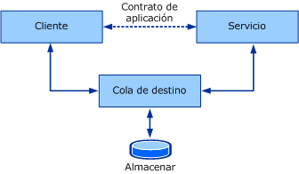
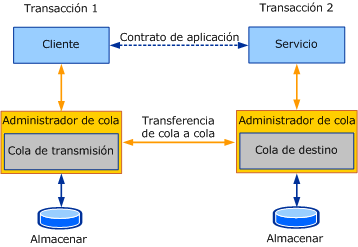

# Información general sobre colasQueues overview

En esta sección se presentan los conceptos generales y básicos detrás de la comunicación puesta en la cola.This section introduces the general and core concepts behind queued communication. En las secciones siguientes se describen los detalles sobre cómo se manifiestan los conceptos de colas descritos en Windows Communication Foundation (WCF).Subsequent sections go into details about how the queuing concepts described here are manifested in Windows Communication Foundation (WCF).  
  
## Conceptos de puesta en cola básicosBasic Queuing Concepts  

 Cuando se diseña una aplicación distribuida, es importante elegir el transporte adecuado para la comunicación entre los servicios y clientes.When designing a distributed application, choosing the right transport for communication between services and clients is important. Varios factores afectan el tipo de transporte que se va a usar.Several factors affect the kind of transport to use. Un factor importante —aislamiento entre el servicio, el cliente y el transporte— determina el uso de un transporte en cola o un transporte directo, como TCP o HTTP.One important factor—isolation between the service, the client, and the transport—determines use of a queued transport or a direct transport, such as TCP or HTTP. Debido a la naturaleza de los transportes directos como TCP y HTTP, la comunicación se detiene por completo si el servicio o el cliente para de funcionar o si se produce un error en la red.Due to the nature of direct transports such as TCP and HTTP, communication stops altogether if the service or the client stop functioning or if the network fails. El servicio, el cliente y la red deben estar en ejecución al mismo tiempo para que funcione la aplicación.The service, the client, and the network must be running at the same time for the application to work. Los transportes puestos en cola proporcionan aislamiento, lo cual significa que si hay un error en el servicio o cliente o si los vínculos de comunicaciones fallan entre ellos, el cliente y servicio pueden continuar funcionando.Queued transports provide isolation, which means that if the service or client fail or if communication links between them fail, the client and service can continue to function.  
  
 Las colas proporcionan comunicación de confianza incluso si hay errores en las partes que se comunican o en la red.Queues provide reliable communication even with failures in the communicating parties or the network. Las colas capturan y entregan los mensajes intercambiados entre las partes que se comunican.Queues capture and deliver messages exchanged between the communicating parties. Normalmente, las colas están respaldadas por un tipo de almacén, que puede ser volátil o durable.Queues are typically backed by some kind of a store, which can be volatile or durable. Las colas almacenan los mensajes de un cliente en nombre de un servicio y, a continuación, reenvían estos mensajes al servicio.Queues store messages from a client on behalf of a service and later forward these messages to the service. Las colas del direccionamiento indirecto proporcionan aislamiento de error garantizado a cualquier parte, de modo que lo convierte en el mecanismo de comunicación preferido para los sistemas de alta disponibilidad y servicios desconectados.The indirection queues provide ensured isolation of failure by either party, thus making it the preferred communication mechanism for high-availability systems and disconnected services. El direccionamiento indirecto viene con el costo de latencia alta.The indirection comes with the cost of high latency. La *latencia* es el tiempo que transcurre entre el momento en que el cliente envía un mensaje y el momento en que el servicio lo recibe.*Latency* is the time delay between the time the client sends a message and the time the service receives it. Esto significa que una vez se envía un mensaje, no sabe cuando se puede procesar ese mensaje.This means that once a message is sent, you do not know when that message may be processed. La mayoría de las aplicaciones en cola se enfrentan a una latencia elevada.Most queued applications cope with high latency. La ilustración siguiente muestra un modelo conceptual de comunicación en cola.The following illustration shows a conceptual model of queued communication.  
  
   
  
 Modelo conceptual de comunicación en colaQueued communication conceptual model  
  
 En realidad, la cola es un concepto distribuido.In reality, the queue is a distributed concept. Como tal, pueden ser locales en cualquier parte o remoto en ambas partes.As such, they can be local to either party or remote to both parties. Normalmente, la cola es local en el servicio.Typically, the queue is local to the service. En esta configuración, el cliente no puede depender de la conectividad a la cola remota para estar constantemente disponible.In this configuration, the client cannot depend on connectivity to the remote queue to be constantly available. De igual forma, la cola debe estar disponible independiente de la disponibilidad del servicio que lee de la cola.Similarly, the queue must be available independent of the availability of the service reading from the queue. Un administrador de cola administra una colección de colas.A queue manager manages a collection of queues. Es responsable de aceptar mensajes enviados a sus colas desde otros administradores de cola.It is responsible for accepting messages sent to its queues from other queue managers. También es responsable de administrar la conectividad a las colas remotas y de transferir los mensajes a esas colas remotas.It is also responsible for managing connectivity to remote queues and transferring messages to those remote queues. Para garantizar la disponibilidad de las colas a pesar de los errores de aplicación del cliente o de servicio, el administrador de cola se ejecuta normalmente como un servicio externo.To ensure availability of queues despite client or service application failures, the queue manager is typically run as an external service.  
  
 Cuando un cliente envía un mensaje a una cola, envía el mensaje a la cola de destino, que es la cola administrada por el administrador de cola del servicio.When a client sends a message to a queue, it addresses the message to the target queue, which is the queue managed by the service's queue manager. El administrador de cola del cliente envía el mensaje a una cola de transmisión (o de salida).The queue manager on the client sends the message to a transmission (or outgoing) queue. La cola de transmisión es una cola del administrador de cola del cliente que almacena los mensajes para transmitirlos a la cola de destino.The transmission queue is a queue on the client queue manager that stores messages for transmission to the target queue. A continuación, el administrador de cola busca una ruta de acceso para el administrador de cola que posee la cola de destino y transfiere el mensaje a dicha cola.The queue manager then finds a path to the queue manager that owns the target queue and transfers the message to it. Para garantizar la comunicación de confianza, los administradores de cola implementan un protocolo de transferencia de confianza para evitar la pérdida de datos.To ensure reliable communication, the queue managers implement a reliable transfer protocol to prevent data loss. El administrador de la cola de destino acepta los mensajes enviados a las colas de destino que posee y almacena los mensajes.The destination queue manager accepts messages addressed to the target queues it owns and stores the messages. El servicio solicita leer de la cola de destino y, en este momento, el administrador de cola entrega el mensaje a la aplicación destino.The service makes requests to read from the target queue, at which time the queue manager then delivers the message to the destination application. La ilustración siguiente muestra la comunicación entre las cuatro partes.The following illustration shows communication between the four parties.  
  
   
  
 Comunicación en cola en un escenario de implementación habitualQueued communication in a typical deployment scenario  
  
 De este modo, el administrador de cola proporciona el aislamiento necesario para que se pueda producir un error en el remitente y receptor de forma independiente sin afectar a la comunicación real.Thus, the queue manager provides the required isolation so that the sender and receiver can independently fail without affecting actual communication. La ventaja del direccionamiento indirecto adicional que las colas proporcionan también habilita varias instancias de aplicación para leer de la misma cola, para que el trabajo entre los nodos logre el rendimiento más elevado.The benefit of extra indirection that queues provide also enables multiple application instances to read from the same queue, so that farming work among the nodes achieves higher throughput. Por lo tanto, no es raro ver colas que se utilizan para lograr la escala más alta y requisitos de rendimiento.Therefore, it is not uncommon to see queues being used to achieve higher scale and throughput requirements.  
  
## Colas y transaccionesQueues and Transactions  

 Las transacciones le permiten agrupar un conjunto de operaciones de modo que si se produce un error en una operación, se producirá un error en todas las operaciones.Transactions allow you to group a set of operations together so that if one operation fails, all of the operations fail. Un ejemplo de cómo usar transacciones es cuando una persona usa un cajero automático para transferir $1.000 de su cuenta de ahorro a su cuenta de comprobación.An example of how to use transactions is when a person uses an ATM to transfer $1,000 from their savings account to their checking account. Esto supone las operaciones siguientes:This entails the following operations:  
  
- Retirar $1,000 de la cuenta de ahorros.Withdrawing $1,000 from the savings account.  
  
- Depositar $1,000 en la cuenta corriente.Depositing $1,000 into the checking account.  
  
 Si la primera operación es correcta y se retiran $1,000 de la cuenta de los ahorros, pero se produce un error en la segunda operación, se pierden los $1,000 porque ya se han retirado de la cuenta de ahorros.If the first operation succeeds and $1,000 is withdrawn from the savings account but the second operation fails, the $1,000 is lost because it has already been withdrawn from the savings account. Para mantener las cuentas en estado válido, si se produce un error en una operación, se debe producir un error en ambas operaciones.To keep the accounts in a valid state, if one operation fails, both operations must fail.  
  
 En mensajería transaccional, se pueden enviar mensajes a la cola y recibir mensajes de la cola bajo en una transacción.In transactional messaging, messages can be sent to the queue and received from the queue under a transaction. De este modo, si se envía un mensaje en una transacción y se deshace la transacción, a continuación, el resultado es como si el mensaje nunca se hubiera enviado a la cola.Thus, if a message is sent in a transaction and the transaction is rolled back, then the outcome is as if the message had never been sent to the queue. De igual forma, si se recibe un mensaje en una transacción y se deshace la transacción, a continuación, el resultado es como si el mensaje nunca se hubiera recibido.Similarly if a message is received in a transaction and the transaction is rolled back, then the outcome is as if the message had never been received. El mensaje permanece en la cola para ser leído.The message remains in the queue to be read.  
  
 Debido a la latencia elevada, cuando envíe un mensaje, usted podrá saber de ninguna manera cuánto tiempo tarda en alcanzar su cola de destino, ni sabrá cuánto tiempo tarda el servicio en procesar el mensaje.Because of high latency, when you send a message you have no way of knowing how long it takes to reach its target queue, nor do you know how long it takes for the service to process the message. Por ello, usted no quiere utilizar una transacción única para enviar el mensaje, recibir el mensaje y, a continuación, procesar el mensaje.Because of this, you do not want to use a single transaction to send the message, receive the message, and then process the message. Esto crea una transacción que no está confirmada durante un período indeterminado de tiempo.This creates a transaction that is not committed for an indeterminate amount of time. Cuando un cliente y servicio se comunican a través de una cola utilizando una transacción, se implican dos transacciones: una en el cliente y una en el servicio.When a client and service communicate through a queue using a transaction, two transactions are involved: one on the client and one on the service. La ilustración siguiente muestra los límites de una transacción en comunicación en cola habitual.The following illustration shows the transaction boundaries in typical queued communication.  
  
   
  
 Comunicación en cola que muestra transacciones independientes para la captura y entregaQueued communication showing separate transactions for capture and delivery  
  
 La transacción del cliente procesa y envía el mensaje.The client transaction processes and sends the message. Cuando se confirma la transacción, el mensaje está en la cola de transmisión.When the transaction is committed, the message is in the transmission queue. En el servicio, la transacción lee el mensaje desde la cola de destino, procesa el mensaje y, a continuación, confirma la transacción.On the service, the transaction reads the message from the target queue, processes the message, and then commits the transaction. Si se produce un error durante el procesamiento, se deshace el mensaje y se coloca en la cola de destino.If an error occurs during the processing, the message is rolled back and placed in the target queue.  
  
## Comunicación asincrónica utilizando colasAsynchronous Communication Using Queues  

 Las colas proporcionan un medio asincrónico de comunicación.Queues provide an asynchronous means of communication. Las aplicaciones que envían mensajes mediante colas no pueden esperar a que el receptor reciba y procese el mensaje debido a la latencia elevada introducida por el administrador de cola.Applications that send messages using queues cannot wait for the message to be received and processed by the receiver because of high latency introduced by the queue manager. Los mensajes pueden permanecer en la cola durante un período de tiempo más largo del previsto por la aplicación.Messages can remain in the queue for a far longer time than the application intended. Para evitarlo, la aplicación puede especificar un valor de período de vida en el mensaje.To avoid this, the application can specify a Time-To-Live value on the message. Este valor especifica cuánto tiempo debería permanecer en la cola de transmisión el mensaje.This value specifies how long the message should remain in the transmission queue. Si se supera este valor de tiempo, y el mensaje todavía no se ha enviado a la cola de destino, se puede transferir el mensaje a una cola de mensajes no enviados.If this time value is exceeded, and the message still has not been sent to the target queue, the message can be transferred to a dead-letter queue.  
  
 Cuando el remitente envía un mensaje, el retorno de la operación enviada implica que el mensaje sólo se envió a la cola de transmisión del remitente.When the sender sends a message, the return from the send operation implies that the message only made it to the transmission queue on the sender. Como tal, si hay un error en el mensaje de la cola de destino, la aplicación emisora no puede saberlo inmediatamente.As such, if there is a failure in getting the message to the target queue, the sending application cannot know about it immediately. Para tomar nota de estos errores, el mensaje que no se ha podido enviar se transfiere a una cola de mensajes no enviados.To take note of such failures, the failed message is transferred to a dead-letter queue.  
  
 Cualquier error, como por ejemplo, un mensaje que no ha alcanzado la cola de destino o un período de vida caducado, se debe procesar por separado.Any error, such as a message failing to reach the target queue or the Time-To-Live expiring, must be processed separately. Por lo tanto, no es raro que las aplicaciones en cola escriban dos conjuntos de lógica:It is not uncommon, therefore, for queued applications to write two sets of logic:  
  
- Cliente normal y lógica del servicio de enviar y recibir mensajes.The normal client and service logic of sending and receiving messages.  
  
- Lógica de la compensación para administrar los mensajes de la transmisión no o entrega no efectuadas.Compensation logic to handle messages from the failed transmission or delivery.  
  
 Las secciones siguientes discuten estos conceptos.The following sections discuss these concepts.  
  
## Programación de la cola de mensajes no entregadosDead-Letter Queue Programming  

 Las colas de mensajes no enviados contienen mensajes que no pudieron alcanzar la cola de destino por varias razones.Dead-letter queues contain messages that failed to reach the target queue for various reasons. Las razones pueden variar desde mensajes expirados a problemas en la conectividad que evitan la transferencia del mensaje a la cola de destino.The reasons can range from expired messages to connectivity issues preventing transfer of the message to the target queue.  
  
 Normalmente, una aplicación puede leer los mensajes desde una cola de mensajes no enviados para todo el sistema, determinar qué salió mal y realizar las acciones necesarias, como corregir los errores y reenviar el mensaje o anotarlo.Typically, an application can read messages from a system-wide dead-letter queue, determine what went wrong, and take appropriate action, such as correcting the errors and resending the message or taking note of it.  
  
## Programación de la cola de mensajes dudososPoison Message Queue Programming  

 Una vez el mensaje alcance la cola de destino, puede que el servicio no pueda procesar el mensaje repetidamente.After a message makes it to the target queue, the service may repeatedly fail to process the message. Por ejemplo, una aplicación que lee un mensaje desde la cola de una transacción y actualiza una base de datos puede encontrar la base de datos temporalmente desconectada.For example, an application reading a message from the queue under a transaction and updating a database may find the database temporarily disconnected. En este caso, la transacción se deshace, se crea una nueva transacción y se relee el mensaje de la cola.In this case, the transaction is rolled back, a new transaction is created, and the message is reread from the queue. Puede que un segundo intento funcione o no.A second attempt may succeed or fail. En algunos casos, dependiendo de la causa del error, el mensaje puede producir un error repetidamente en la entrega a la aplicación.In some cases, depending on the cause of the error, the message may repeatedly fail delivery to the application. En este caso, el mensaje se considera "dudoso."In this case, the message is deemed as "poison." Estos mensajes se mueven a una cola de mensajes dudosos, que se puede leer por una aplicación de administración de mensajes dudosos.Such messages are moved to a poison queue that can be read by a poison-handling application.  
  
## Vea tambiénSee also

- [Las colas en WCFQueuing in WCF](queuing-in-wcf.md)
- [Sesiones y colasSessions and Queues](../samples/sessions-and-queues.md)
- [Colas con problemas de entregaDead Letter Queues](../samples/dead-letter-queues.md)
- [Comunicación en cola volátilVolatile Queued Communication](../samples/volatile-queued-communication.md)
- [Windows Communication Foundation a Message QueuingWindows Communication Foundation to Message Queuing](../samples/wcf-to-message-queuing.md)
- [Instalar Message Queuing (MSMQ)Installing Message Queuing (MSMQ)](../samples/installing-message-queuing-msmq.md)
- [Message Queuing a Windows Communication FoundationMessage Queuing to Windows Communication Foundation](../samples/message-queuing-to-wcf.md)
- [Seguridad de mensajes mediante Message QueuingMessage Security over Message Queuing](../samples/message-security-over-message-queuing.md)
