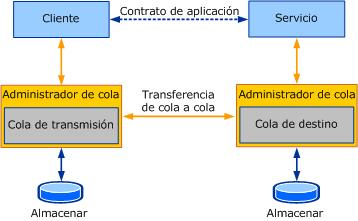

# Las colas en WCFQueuing in WCF
En esta sección se describe cómo usar la comunicación en cola en Windows Communication Foundation (WCF).This section describes how to use queued communication in Windows Communication Foundation (WCF).  
  
## Las colas como enlace de transporte de WCFQueues as a WCF transport binding  
 En WCF, los contratos especifican lo que se intercambia.In WCF, the contracts specify what is being exchanged. Los contratos son intercambios de mensajes que dependen de lo comercial, o intercambios específicos de la aplicación.Contracts are business-dependent or application-specific message exchanges. El mecanismo utilizado para intercambiar los mensajes (o el "cómo") se especifica en los enlaces.The mechanism used to exchange messages (or the "how") is specified in the bindings. Los enlaces de WCF encapsulan los detalles del intercambio de mensajes.Bindings in WCF encapsulate details of the message exchange. Exponen botones de configuración para que el usuario controle distintos aspectos del transporte o el protocolo que representan los enlaces.They expose configuration knobs for the user to control various aspects of the transport or the protocol that the bindings represent. La puesta en cola en WCF se trata como cualquier otro enlace de transporte, que es una gran ventaja para muchas aplicaciones de puesta en cola.Queuing in WCF is treated like any other transport binding, which is a big advantage for many queuing applications. Hoy en día, muchas aplicaciones de colas se escriben de manera diferente a otras aplicaciones de estilo distribuido de llamada a procedimiento remoto (RPC), lo que dificulta su seguimiento y mantenimiento.Today, many queuing applications are written differently from other remote procedure call (RPC)-style distributed applications, making it harder to follow and maintain. Con WCF, el estilo de escritura de una aplicación distribuida es muy similar, lo que facilita su seguimiento y mantenimiento.With WCF, the style of writing a distributed application is much the same, making it easier to follow and maintain. Es más, separando la factorización del mecanismo de intercambio de la lógica comercial, es más sencillo configurar el transporte o cambiarlo sin alterar el código específico de la aplicación.Moreover, by factoring out the mechanism of exchange separately from the business logic, it is easier to configure the transport or make changes to it without affecting application specific code. La figura siguiente muestra la estructura de un servicio y un cliente WCF que utilizan MSMQ como transporte.The following figure illustrates the structure of a WCF service and client using MSMQ as a transport.  
  
   
  
 Como puede verse en la figura anterior, el cliente y el servicio sólo tienen que definir las semánticas de la aplicación, es decir, el contrato y la implementación.As you can see from the preceding figure, the client and service must define only the application semantics, that is, the contract and implementation. El servicio configura un enlace en cola con los valores preferentes.The service configures a queued binding with preferred settings. El cliente usa la [herramienta de utilidad de metadatos de ServiceModel (SvcUtil. exe)](../../../../docs/framework/wcf/servicemodel-metadata-utility-tool-svcutil-exe.md) para generar un cliente de WCF para el servicio y para generar un archivo de configuración que describe los enlaces que se van a usar para enviar mensajes al servicio.The client uses the [ServiceModel Metadata Utility Tool (Svcutil.exe)](../../../../docs/framework/wcf/servicemodel-metadata-utility-tool-svcutil-exe.md) to generate a WCF client to the service and to generate a configuration file that describes the bindings to use to send messages to the service. Por lo tanto, para enviar un mensaje en cola, el cliente crea una instancia de un cliente WCF e invoca una operación en él.Thus, to send a queued message, the client instantiates a WCF client and invokes an operation on it. Esto provoca el envío del mensaje a la cola de transmisión y su transferencia a la cola de destino.This causes the message to be sent to the transmission queue and transferred to the target queue. Toda la complejidad de la comunicación en cola permanece oculta a la aplicación que envía y recibe los mensajes.All the complexities of queued communication are hidden from the application that is sending and receiving messages.  
  
 Las advertencias sobre el enlace en cola en WCF incluyen:Caveats about queued binding in WCF include:  
  
- Todas las operaciones de servicio deben ser unidireccionales porque el enlace en cola predeterminado en WCF no admite la comunicación dúplex mediante colas.All service operations must be one-way because the default queued binding in WCF does not support duplex communication using queues. Un ejemplo de comunicación bidireccional ([comunicación bidireccional](../../../../docs/framework/wcf/samples/two-way-communication.md)) muestra cómo usar contratos de 2 1 para implementar la comunicación dúplex mediante colas.A two-way communication sample ([Two-Way Communication](../../../../docs/framework/wcf/samples/two-way-communication.md)) illustrates how to use two one-way contracts to implement duplex communication using queues.  
  
- Para generar un cliente de WCF mediante el intercambio de metadatos, se requiere un extremo HTTP adicional en el servicio para que se pueda consultar directamente para generar el cliente de WCF y obtener información de enlace para configurar correctamente la comunicación en cola.To generate a WCF client using metadata exchange requires an additional HTTP endpoint on the service so that it can be queried directly to generate the WCF client and obtain binding information to appropriately configure queued communication.  
  
- Según el enlace en cola, se requiere una configuración adicional fuera de WCF.Based on the queued binding, extra configuration outside of WCF is required. Por ejemplo, la clase <xref:System.ServiceModel.NetMsmqBinding> que se suministra con WCF requiere la configuración de los enlaces y la configuración mínima de Message Queuing (MSMQ).For example, the <xref:System.ServiceModel.NetMsmqBinding> class that is shipped with WCF requires you to configure the bindings as well as minimally configure Message Queuing (MSMQ).  
  
 En las secciones siguientes se describen los enlaces en cola específicos que se incluyen con WCF, que se basan en MSMQ.The following sections describe the specific queued bindings shipped with WCF, which are based on MSMQ.  
  
### MSMQMSMQ  
 El transporte en cola en WCF utiliza MSMQ para su comunicación en cola.The queued transport in WCF uses MSMQ for its queued communication.  
  
 MSMQ se distribuye como componente opcional de Windows y se ejecuta como un servicio NT.MSMQ ships as an optional component with Windows and runs as an NT service. Captura los mensajes para su transmisión en una cola de transmisión, y para la entrega en una cola de destino.It captures messages for transmission in a transmission queue and for delivery in a target queue. Los administradores de cola de MSMQ implementan un protocolo de transferencias de mensajes de confianza para que los mensajes no se pierdan durante la transmisión.The MSMQ queue managers implement a reliable message-transfer protocol so that messages are not lost in transmission. El protocolo puede ser nativo o basado en SOAP, como el protocolo de mensajes de confianza (SRMP) de SOAP.The protocol can be either native or SOAP-based, such as the SOAP Reliable Message Protocol (SRMP).  
  
 En MSMQ, las colas pueden ser transaccionales o no transaccionales.In MSMQ, queues can be transactional or non-transactional. Una cola transaccional permite capturar los mensajes y entregarlos en una transacción y, a continuación, almacenarlos de manera duradera en la cola.A transactional queue allows messages to be captured and delivered in a transaction and then stored durably in the queue. Los mensajes enviados a una cola transaccional se transfieren con precisión una vez en orden.Messages sent to a transactional queue are transferred exactly once in order. Puede utilizar una cola no transaccional para enviar tanto los mensajes volátiles como los duraderos.You can use a non-transactional queue to send both volatile and durable messages. Un mensaje enviado a una cola no transaccional no posee ninguna garantía de transferencia de confianza, por lo que puede perderse.A message sent to a non-transactional queue does not carry any reliable transfer assurances; thus, messages can be lost.  
  
 Las colas de MSMQ también pueden protegerse utilizando una identidad de Windows registrada con el servicio de directorio Active Directory.MSMQ queues can also be secured using a Windows identity registered with the Active Directory directory service. Al instalar MSMQ puede instalar la integración de Active Directory, para lo que es necesario que el equipo forme parte de una red de dominios de Windows.When installing MSMQ, you can install Active Directory integration, which requires the computer to be part of a Windows domain network.  
  
 Para obtener más información acerca de MSMQ, vea [instalar Message Queue Server (MSMQ)](../../../../docs/framework/wcf/samples/installing-message-queuing-msmq.md).For more information about MSMQ, see [Installing Message Queuing (MSMQ)](../../../../docs/framework/wcf/samples/installing-message-queuing-msmq.md).  
  
### NetMsmqBindingNetMsmqBinding  
 El [\<netMsmqBinding >](../../../../docs/framework/configure-apps/file-schema/wcf/netmsmqbinding.md) es el enlace en cola que proporciona WCF para que dos extremos de WCF se comuniquen mediante MSMQ.The [\<netMsmqBinding>](../../../../docs/framework/configure-apps/file-schema/wcf/netmsmqbinding.md) is the queued binding WCF provides for two WCF endpoints to communicate using MSMQ. Por lo tanto, el enlace expone propiedades que son específicas de MSMQ.The binding, therefore, exposes properties that are specific to MSMQ. No obstante, no todas las características y propiedades MSMQ se exponen en `NetMsmqBinding`.However, not all MSMQ features and properties are exposed in the `NetMsmqBinding`. El `NetMsmqBinding` compacto está diseñado con un conjunto óptimo de características que la mayoría de los clientes debería encontrar suficiente.The compact `NetMsmqBinding` is designed with an optimal set of features that most customers should find sufficient.  
  
 `NetMsmqBinding` expone los conceptos fundamentales de las colas explicados hasta ahora como propiedades de los enlaces.The `NetMsmqBinding` manifests the core queuing concepts discussed thus far in the form of properties on the bindings. Por su parte, estas propiedades comunican a MSMQ cómo transferir y entregar los mensajes.These properties, in turn, communicate to MSMQ how to transfer and deliver the messages. Hay una descripción de las categorías de propiedad en las secciones siguientes.A discussion of the property categories is in the following sections. Para obtener más información, vea los temas conceptuales que describen las propiedades específicas más completamente.For more information, see the conceptual topics that describe specific properties more completely.  
  
#### ExactlyOnce y propiedades durablesExactlyOnce and Durable Properties  
 `ExactlyOnce` y las propiedades `Durable` afectan a cómo los mensajes se transfieren entre las colas:The `ExactlyOnce` and `Durable` properties affect how messages are transferred between queues:  
  
- `ExactlyOnce`: cuando se establece en `true` (el valor predeterminado), el canal en cola garantiza que, si se entrega, el mensaje no se duplica.`ExactlyOnce`: When set to `true` (the default), the queued channel ensures that the message, if delivered, is not duplicated. Además, garantiza que el mensaje no se pierda.It also ensures that the message is not lost. Si no puede entregarse el mensaje, o expira el periodo de vida del mismo antes de poder entregarlo, tanto el mensaje fallido como la razón del error en la entrega se registran en una cola de componentes con problemas de entrega.If the message cannot be delivered, or the message Time-To Live expires before the message can be delivered, the failed message along with the delivery failure reason is recorded in a dead-letter queue. Cuando se establece en `false`, el canal en cola realiza un esfuerzo para transferir el mensaje.When set to `false`, the queued channel makes an effort to transfer the message. En este caso, se puede optar por elegir una cola de mensajes no enviados.In this case, you can optionally choose a dead-letter queue.  
  
- `Durable:` cuando se establece en `true` (el valor predeterminado), el canal en cola garantiza que MSMQ almacena el mensaje en el disco de manera duradera.`Durable:` When set to `true` (the default), the queued channel ensures that MSMQ stores the message durably on disk. Así, si el servicio de MSMQ se detiene y reinicia, los mensajes del disco se transfieren a la cola de destino o se entregan al servicio.Thus, if the MSMQ service were to stop and restart, the messages on disk is transferred to the target queue or delivered to the service. Cuando se establece en `false`, los mensajes se guardan en un almacén volátil y se pierden en caso de que se detenga y reinicie el servicio de MSMQ.When set to `false`, the messages are stored in volatile store and are lost on stopping and restarting the MSMQ service.  
  
 MSMQ exige una cola transaccional para que la transferencia `ExactlyOnce` sea de confianza.For `ExactlyOnce` reliable transfer, MSMQ requires the queue to be transactional. Además, MSMQ exige que la transacción lea desde una cola transaccional.Also, MSMQ requires a transaction to read from a transactional queue. Por lo tanto, cuando utilice `NetMsmqBinding`, recuerde que se requiere una transacción para enviar o recibir mensajes cuando `ExactlyOnce` está establecido en `true`.As such, when you use the `NetMsmqBinding`, remember that a transaction is required to send or receive messages when `ExactlyOnce` is set to `true`. De igual forma, MSMQ exige a la cola que sea no transaccional para una mayor garantía, como cuando `ExactlyOnce` es `false` y en mensajería volátil.Similarly, MSMQ requires the queue to be non-transactional for best-effort assurances, such as when `ExactlyOnce` is `false` and for volatile messaging. Así, al establecer `ExactlyOnce` en `false` o durable en `false`, no puede enviar o recibir mediante una transacción.Thus, when setting `ExactlyOnce` to `false` or durable to `false`, you cannot send or receive using a transaction.  
  
> [!NOTE]
> Asegurarse de que la cola correcta (transaccional o no transaccional) se crea basándose en los valores de los enlaces.Ensure that the correct queue (transactional or non-transactional) is created based on settings in the bindings. Si `ExactlyOnce` es `true`, utilice una cola transaccional; de lo contrario, utilice una cola no transaccional.If `ExactlyOnce` is `true`, use a transactional queue; otherwise, use a non-transactional queue.  
  
#### Propiedades de la cola de mensajes no enviadosDead-Letter Queue Properties  
 La cola de mensajes no enviados se utiliza para guardar los mensajes cuya entrega ha sido fallida.The dead-letter queue is used to store messages that fail delivery. El usuario puede escribir una lógica de compensación que expulse los mensajes fuera de la cola de mensajes no enviados.The user can write compensating logic that reads messages out of the dead-letter queue.  
  
 Muchos sistemas de colas proporcionan una cola de mensajes no enviados para todo el sistema.Many queuing systems provide for a system-wide dead-letter queue. MSMQ proporciona una cola de mensajes no enviados no transaccional para todo el sistema, para los mensajes con entrega fallida en colas no transaccionales; y una cola de mensajes no enviados transaccional para todo el sistema para los mensajes con entrega fallida en colas transaccionales.MSMQ provides a system-wide non-transactional dead-letter queue for messages that fail delivery to non-transactional queues and a system-wide transactional dead-letter queue for messages that fail delivery to transactional queues.  
  
 Si varios clientes que envían mensajes a distintas colas de destino comparten el servicio MSMQ, todos los mensajes enviados por los clientes irán a la misma cola de mensajes no enviados.If multiple clients sending messages to different target queues share the MSMQ service, all messages sent by the clients go to the same dead-letter queue. Esto no siempre es lo mejor.This is not always preferable. Para un mejor aislamiento, WCF y MSMQ en Windows Vista proporcionan una cola de mensajes no enviados personalizada (o una cola de mensajes no enviados específica de la aplicación) que el usuario puede especificar para almacenar los mensajes que no se han podido entregar.For better isolation, WCF and MSMQ in Windows Vista provide a custom dead-letter queue (or application-specific dead-letter queue) that the user can specify to store messages that fail delivery. Por lo tanto, los distintos clientes no comparten la misma cola de mensajes no enviados.Therefore, different clients do not share the same dead-letter queue.  
  
 El enlace tiene dos propiedades interesantes:The binding has two properties of interest:  
  
- `DeadLetterQueue`: esta propiedad es una enumeración que indica si se envía una solicitud a una cola de mensajes no enviados.`DeadLetterQueue`: This property is an enumeration that indicates whether a dead-letter queue is requested. La enumeración también contiene el tipo de cola de mensajes no enviados, en caso de que se solicite uno.The enumeration also contains the kind of dead-letter queue, if one is requested. Los valores son `None`, `System` y `Custom`.The values are `None`, `System`, and `Custom`. Para obtener más información acerca de la interpretación de estas propiedades, consulte [uso de colas de mensajes no enviados para administrar los errores de transferencia de mensajes](../../../../docs/framework/wcf/feature-details/using-dead-letter-queues-to-handle-message-transfer-failures.md)For more information about the interpretation of these properties, see [Using Dead-Letter Queues to Handle Message Transfer Failures](../../../../docs/framework/wcf/feature-details/using-dead-letter-queues-to-handle-message-transfer-failures.md)  
  
- `CustomDeadLetterQueue`: esta propiedad es la dirección del identificador uniforme de recursos (URI) de la cola de mensajes no enviados específica de la aplicación.`CustomDeadLetterQueue`: This property is the Uniform Resource Identifier (URI) address of the application-specific dead-letter queue. Esto es necesario si `DeadLetterQueue`.`Custom`This is required if `DeadLetterQueue`.`Custom` se elige.is chosen.  
  
#### Propiedades de control de mensajes dudososPoison Message Handling properties  
 Cuando el servicio lee mensajes de la cola de destino en una transacción, puede no procesar el mensaje debido a distintas razones.When the service reads messages from the target queue under a transaction, the service may fail to process the message for various reasons. En este caso, el mensaje se devuelve a la cola para volver a leerse.The message is then put back into the queue to be read again. Para gestionar los mensajes en los que se producen errores repetidamente, se puede configurar un conjunto propiedades de control de mensajes dudosos en el enlace.To deal with messages that fail repeatedly, a set of poison-message handling properties can be configured in the binding. Hay cuatro propiedades: `ReceiveRetryCount`, `MaxRetryCycles`, `RetryCycleDelay` y `ReceiveErrorHandling`.There are four properties: `ReceiveRetryCount`, `MaxRetryCycles`, `RetryCycleDelay`, and `ReceiveErrorHandling`. Para obtener más información acerca de estas propiedades, vea [control de mensajes dudosos](../../../../docs/framework/wcf/feature-details/poison-message-handling.md).For more information about these properties, see [Poison Message Handling](../../../../docs/framework/wcf/feature-details/poison-message-handling.md).  
  
#### Propiedades de seguridadSecurity Properties  
 MSMQ expone su propio modelo de seguridad, como las listas de control de acceso (ACL) en una cola o el envío de mensajes autenticados.MSMQ exposes its own security model, such as access control lists (ACLs) on a queue or sending authenticated messages. `NetMsmqBinding` expone estas propiedades de seguridad como parte de sus valores de seguridad de transporte.The `NetMsmqBinding` exposes these security properties as part of its transport security settings. Hay dos propiedades en el enlace para la seguridad de transporte: `MsmqAuthenticationMode` y `MsmqProtectionLevel`.There are two properties in the binding for transport security: `MsmqAuthenticationMode` and `MsmqProtectionLevel`. Los valores de estas propiedades dependen de la configuración de MSMQ.Settings in these properties depend on how MSMQ is configured. Para obtener más información, consulte [protección de mensajes mediante la seguridad de transporte](../../../../docs/framework/wcf/feature-details/securing-messages-using-transport-security.md).For more information, see [Securing Messages Using Transport Security](../../../../docs/framework/wcf/feature-details/securing-messages-using-transport-security.md).  
  
 Además de la seguridad de transporte, el propio mensaje SOAP puede protegerse utilizando la seguridad de mensaje.In addition to transport security, the actual SOAP message itself can be secured using message security. Para obtener más información, consulte [protección de mensajes mediante la seguridad de mensajes](../../../../docs/framework/wcf/feature-details/securing-messages-using-message-security.md).For more information, see [Securing Messages Using Message Security](../../../../docs/framework/wcf/feature-details/securing-messages-using-message-security.md).  
  
 `MsmqTransportSecurity` también expone dos propiedades, `MsmqEncryptionAlgorithm` y `MsmqHashAlgorithm`.`MsmqTransportSecurity` also exposes two properties, `MsmqEncryptionAlgorithm` and `MsmqHashAlgorithm`. Éstas son enumeraciones de distintos algoritmos que permiten elegir el cifrado de la transferencia cola a cola de mensajes y el algoritmo hash de las firmas.These are enumerations of different algorithms to choose for queue-to-queue transfer encryption of messages and hashing of the signatures.  
  
#### Otras propiedadesOther Properties  
 Además de las propiedades anteriores, existen otras propiedades específicas de MSMQ expuestas en el enlace:In addition to the preceding properties, other MSMQ-specific properties exposed in the binding include:  
  
- `UseSourceJournal`: una propiedad que indica la activación del registro en el diario de origen.`UseSourceJournal`: A property to indicate that source journaling is turned on. El registro en el diario de origen es una característica de MSMQ que hace un seguimiento de los mensajes transmitidos correctamente desde la cola de transmisión.Source journaling is an MSMQ feature that keeps track of messages that have been successfully transmitted from the transmission queue.  
  
- `UseMsmqTracing`: una propiedad que indica que el seguimiento de la traza de MSMQ está activado.`UseMsmqTracing`: A property to indicate that MSMQ tracing is turned on. El seguimiento de la traza de MSMQ envía mensajes de informe a una cola de informes cada vez que un mensaje sale o llega a un equipo en el que se aloja un administrador de cola de MSMQ.MSMQ tracing sends report messages to a report queue each time a message leaves or arrives at a machine hosting an MSMQ queue manager.  
  
- `QueueTransferProtocol`: una enumeración del protocolo utilizado para las transferencias de mensajes cola a cola.`QueueTransferProtocol`: An enumeration of the protocol to use for queue-to-queue message transfers. MSMQ implementa un protocolo de transferencia cola a cola nativo y un protocolo basado en SOAP, denominado protocolo de mensajería de confianza (SRMP) de SOAP.MSMQ implements a native queue-to-queue transfer protocol and a SOAP-based protocol called SOAP Reliable Messaging Protocol (SRMP). Se utiliza SRMP cuando se recurre al transporte HTTP para las transferencias cola a cola.SRMP is used when using HTTP transport for queue-to-queue transfers. La protección SRMP se utiliza cuando se recurre a HTTPS para las transferencias cola a cola.SRMP secure is used when using HTTPS for queue-to-queue transfers.  
  
- `UseActiveDirectory`: un valor booleano que indica si debe utilizarse Active Directory para la resolución de direcciones de cola.`UseActiveDirectory`: A Boolean value to indicate whether the Active Directory must be used for queue address resolution. De manera predeterminada, está desactivado.By default, this is off. Para obtener más información, consulte [puntos de conexión de servicio y direccionamiento de colas](../../../../docs/framework/wcf/feature-details/service-endpoints-and-queue-addressing.md).For more information, see [Service Endpoints and Queue Addressing](../../../../docs/framework/wcf/feature-details/service-endpoints-and-queue-addressing.md).  
  
### MsmqIntegrationBindingMsmqIntegrationBinding  
 El `MsmqIntegrationBinding` se usa cuando se desea que un punto de conexión de WCF se comunique con una aplicación MSMQ existente C++escrita en las API de C,, com o System. Messaging.The `MsmqIntegrationBinding` is used when you want a WCF endpoint to communicate with an existing MSMQ application written in C, C++, COM, or System.Messaging APIs.  
  
 Las propiedades de enlace son la mismas que para `NetMsmqBinding`.The binding properties are the same as for `NetMsmqBinding`. No obstante, se aplican las siguientes diferencias.However, the following differences apply:  
  
- El contrato de operación para `MsmqIntegrationBinding` está restringido a tomar un único parámetro de tipo <xref:System.ServiceModel.MsmqIntegration.MsmqMessage%601>, en el que el parámetro de tipo, es el tipo del cuerpo.The operation contract for `MsmqIntegrationBinding` is restricted to taking a single parameter of type <xref:System.ServiceModel.MsmqIntegration.MsmqMessage%601> where the type parameter is the body type.  
  
- Muchas de las propiedades de mensaje nativas de MSMQ se exponen en <xref:System.ServiceModel.MsmqIntegration.MsmqMessage%601> para su usoMuch of MSMQ native message properties are exposed in the <xref:System.ServiceModel.MsmqIntegration.MsmqMessage%601> for use.  
  
- Para facilitar la serialización y deserialización del cuerpo del mensaje, se proporcionan serializadores como XML y ActiveX.To help with serialization and deserialization of the message body, serializers such as XML and ActiveX are provided.  
  
### Código de ejemploSample Code  
 Si desea obtener instrucciones paso a paso sobre cómo escribir servicios WCF que usen MSMQ, vea los temas siguientes:For step by step instructions on how to write WCF services that use MSMQ see the following topics:  
  
- [Intercambio de mensajes con puntos de conexión de WCF y aplicaciones de Message Queue ServerHow to: Exchange Messages with WCF Endpoints and Message Queuing Applications](../../../../docs/framework/wcf/feature-details/how-to-exchange-messages-with-wcf-endpoints-and-message-queuing-applications.md)  
  
- [Intercambio de mensajes en cola con puntos de conexión de WCFHow to: Exchange Queued Messages with WCF Endpoints](../../../../docs/framework/wcf/feature-details/how-to-exchange-queued-messages-with-wcf-endpoints.md)  
  
 Si desea obtener un ejemplo de código completo que muestre el uso de MSMQ en WCF, vea los temas siguientes:For a completed code sample illustrating the use of MSMQ in WCF see the following topics:  
  
- [Enlace MSMQ por transaccionesTransacted MSMQ Binding](../../../../docs/framework/wcf/samples/transacted-msmq-binding.md)  
  
- [Comunicación en cola volátilVolatile Queued Communication](../../../../docs/framework/wcf/samples/volatile-queued-communication.md)  
  
- [Colas de mensajes fallidosDead Letter Queues](../../../../docs/framework/wcf/samples/dead-letter-queues.md)  
  
- [Sesiones y colasSessions and Queues](../../../../docs/framework/wcf/samples/sessions-and-queues.md)  
  
- [Comunicación bidireccionalTwo-Way Communication](../../../../docs/framework/wcf/samples/two-way-communication.md) 
  
- [SRMPSRMP](../../../../docs/framework/wcf/samples/srmp.md)  
  
- [Seguridad de mensajes mediante Message QueuingMessage Security over Message Queuing](../../../../docs/framework/wcf/samples/message-security-over-message-queuing.md)  
  
## Vea tambiénSee also

- [Puntos de conexión de servicio y direccionamiento de la colaService Endpoints and Queue Addressing](../../../../docs/framework/wcf/feature-details/service-endpoints-and-queue-addressing.md)
- [Alojamiento web de una aplicación en colaWeb Hosting a Queued Application](../../../../docs/framework/wcf/feature-details/web-hosting-a-queued-application.md)
