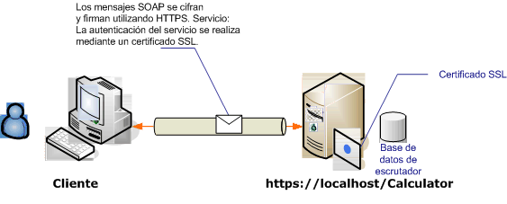

# <a name="transport-security-with-an-anonymous-client"></a>Seguridad de transporte con un cliente anónimo

En este escenario de Windows Communication Foundation (WCF) se usa la seguridad de transporte (HTTPS) para garantizar la confidencialidad y la integridad. El servidor debe autenticarse con un certificado de Capa de sockets seguros (SSL) y los clientes deben confiar en el certificado del servidor. Ningún mecanismo autentica el cliente y es, por lo tanto, anónimo.

Para obtener una aplicación de ejemplo, vea [seguridad de transporte de WS](../samples/ws-transport-security.md). Para obtener más información sobre la seguridad de transporte, vea [información general](transport-security-overview.md)sobre la seguridad de transporte.

Para obtener más información sobre el uso de un certificado con un servicio, consulte [trabajar con certificados](working-with-certificates.md) y [Cómo: configurar un puerto con un certificado SSL](how-to-configure-a-port-with-an-ssl-certificate.md).



|Característica|Descripción|
|--------------------|-----------------|
|Modo de seguridad|Transporte|
|Interoperabilidad|Con servicios y clientes Web existentes|
|Autenticación (servidor)<br /><br /> Autenticación (cliente)|Sí<br /><br /> Nivel de aplicación (sin compatibilidad con WCF)|
|Integridad|Sí|
|Confidencialidad|Sí|
|Transporte|HTTPS|
|Enlace|<xref:System.ServiceModel.WSHttpBinding>|

## <a name="service"></a>Servicio

El código y la configuración siguientes están diseñados para ejecutarse de forma independiente. Realice una de las siguientes acciones:

- Cree un servicio independiente mediante el código sin configuración.

- Cree un servicio mediante la configuración proporcionada, pero sin definir ningún punto de conexión.

### <a name="code"></a>Código

El código siguiente muestra cómo crear un extremo mediante la seguridad del transporte:

[!code-csharp[c_SecurityScenarios#5](~/samples/snippets/csharp/VS_Snippets_CFX/c_securityscenarios/cs/source.cs#5)]
[!code-vb[c_SecurityScenarios#5](~/samples/snippets/visualbasic/VS_Snippets_CFX/c_securityscenarios/vb/source.vb#5)]

### <a name="configuration"></a>Configuración

El código siguiente configura el mismo extremo mediante la configuración. Ningún mecanismo autentica el cliente y es, por lo tanto, anónimo.

```xml
<?xml version="1.0" encoding="utf-8"?>
<configuration>
  <system.serviceModel>
    <services>
      <service name="ServiceModel.Calculator">
        <endpoint address="https://localhost/Calculator"
                  binding="wsHttpBinding"
                  bindingConfiguration="WSHttpBinding_ICalculator"
                  name="SecuredByTransportEndpoint"
                  contract="ServiceModel.ICalculator" />
      </service>
    </services>
    <bindings>
      <wsHttpBinding>
        <binding name="WSHttpBinding_ICalculator">
          <security mode="Transport">
            <transport clientCredentialType="None" />
          </security>
        </binding>
      </wsHttpBinding>
    </bindings>
    <client />
  </system.serviceModel>
</configuration>
```

## <a name="client"></a>Cliente

El código y la configuración siguientes están diseñados para ejecutarse de forma independiente. Realice una de las siguientes acciones:

- Cree un cliente independiente mediante el código (y el código de cliente).

- Cree un cliente que no defina direcciones de punto de conexión. En su lugar, utilice el constructor de cliente que adopta el nombre de configuración como un argumento. Por ejemplo:

     [!code-csharp[C_SecurityScenarios#0](~/samples/snippets/csharp/VS_Snippets_CFX/c_securityscenarios/cs/source.cs#0)]
     [!code-vb[C_SecurityScenarios#0](~/samples/snippets/visualbasic/VS_Snippets_CFX/c_securityscenarios/vb/source.vb#0)]

### <a name="code"></a>Código

[!code-csharp[c_SecurityScenarios#6](~/samples/snippets/csharp/VS_Snippets_CFX/c_securityscenarios/cs/source.cs#6)]
[!code-vb[c_SecurityScenarios#6](~/samples/snippets/visualbasic/VS_Snippets_CFX/c_securityscenarios/vb/source.vb#6)]

### <a name="configuration"></a>Configuración

Se puede usar la configuración siguiente en lugar del código para configurar el servicio.

```xml
<configuration>
  <system.serviceModel>
    <bindings>
      <wsHttpBinding>
        <binding name="WSHttpBinding_ICalculator" >
          <security mode="Transport">
            <transport clientCredentialType="None" />
          </security>
        </binding>
      </wsHttpBinding>
    </bindings>
    <client>
      <endpoint address="https://machineName/Calculator"
                binding="wsHttpBinding"
                bindingConfiguration="WSHttpBinding_ICalculator"
                contract="ICalculator"
                name="WSHttpBinding_ICalculator" />
    </client>
  </system.serviceModel>
</configuration>
```

## <a name="see-also"></a>Vea también

- [Información general sobre seguridad](security-overview.md)
- [Seguridad de transporte WS](../samples/ws-transport-security.md)
- [Información general de la seguridad del transporte](transport-security-overview.md)
- [Modelo de seguridad para Windows Server App Fabric](/previous-versions/appfabric/ee677202(v=azure.10))
