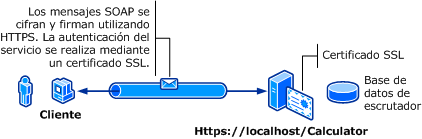

# <a name="transport-security-with-basic-authentication"></a><span data-ttu-id="1f1e3-102">Seguridad de transporte con autenticación básica</span><span class="sxs-lookup"><span data-stu-id="1f1e3-102">Transport Security with Basic Authentication</span></span>
<span data-ttu-id="1f1e3-103">La siguiente ilustración muestra un servicio de Windows Communication Foundation (WCF) y un cliente.</span><span class="sxs-lookup"><span data-stu-id="1f1e3-103">The following illustration shows a Windows Communication Foundation (WCF) service and client.</span></span> <span data-ttu-id="1f1e3-104">El servidor necesita un certificado X.509 válido que se puede utilizar para Capa de sockets seguros (SSL) y los clientes deben confiar en el certificado del servidor.</span><span class="sxs-lookup"><span data-stu-id="1f1e3-104">The server needs a valid X.509 certificate that can be used for Secure Sockets Layer (SSL), and the clients must trust the server’s certificate.</span></span> <span data-ttu-id="1f1e3-105">Además, el servicio web ya tiene una implementación SSL que se puede usar.</span><span class="sxs-lookup"><span data-stu-id="1f1e3-105">Further, the Web service already has an SSL implementation that can be used.</span></span> <span data-ttu-id="1f1e3-106">Para obtener más información acerca de cómo habilitar la autenticación básica en Internet Information Services (IIS), consulte [ https://go.microsoft.com/fwlink/?LinkId=83822 ](https://go.microsoft.com/fwlink/?LinkId=83822).</span><span class="sxs-lookup"><span data-stu-id="1f1e3-106">For more information about enabling basic authentication on Internet Information Services (IIS), see [https://go.microsoft.com/fwlink/?LinkId=83822](https://go.microsoft.com/fwlink/?LinkId=83822).</span></span>  
  
 <span data-ttu-id="1f1e3-107"></span><span class="sxs-lookup"><span data-stu-id="1f1e3-107"></span></span>  
  
|<span data-ttu-id="1f1e3-108">Característica</span><span class="sxs-lookup"><span data-stu-id="1f1e3-108">Characteristic</span></span>|<span data-ttu-id="1f1e3-109">Descripción</span><span class="sxs-lookup"><span data-stu-id="1f1e3-109">Description</span></span>|  
|--------------------|-----------------|  
|<span data-ttu-id="1f1e3-110">Modo de seguridad</span><span class="sxs-lookup"><span data-stu-id="1f1e3-110">Security Mode</span></span>|<span data-ttu-id="1f1e3-111">Transporte</span><span class="sxs-lookup"><span data-stu-id="1f1e3-111">Transport</span></span>|  
|<span data-ttu-id="1f1e3-112">Interoperabilidad</span><span class="sxs-lookup"><span data-stu-id="1f1e3-112">Interoperability</span></span>|<span data-ttu-id="1f1e3-113">Con clientes de servicios Web existentes y servicios</span><span class="sxs-lookup"><span data-stu-id="1f1e3-113">With existing Web service clients and services</span></span>|  
|<span data-ttu-id="1f1e3-114">Autenticación (servidor)</span><span class="sxs-lookup"><span data-stu-id="1f1e3-114">Authentication (Server)</span></span><br /><br /> <span data-ttu-id="1f1e3-115">Autenticación (cliente)</span><span class="sxs-lookup"><span data-stu-id="1f1e3-115">Authentication (Client)</span></span>|<span data-ttu-id="1f1e3-116">Sí (utilizar HTTPS)</span><span class="sxs-lookup"><span data-stu-id="1f1e3-116">Yes (using HTTPS)</span></span><br /><br /> <span data-ttu-id="1f1e3-117">Sí (a través del nombre de usuario/Contraseña)</span><span class="sxs-lookup"><span data-stu-id="1f1e3-117">Yes (through User name/Password)</span></span>|  
|<span data-ttu-id="1f1e3-118">Integridad</span><span class="sxs-lookup"><span data-stu-id="1f1e3-118">Integrity</span></span>|<span data-ttu-id="1f1e3-119">Sí</span><span class="sxs-lookup"><span data-stu-id="1f1e3-119">Yes</span></span>|  
|<span data-ttu-id="1f1e3-120">Confidencialidad</span><span class="sxs-lookup"><span data-stu-id="1f1e3-120">Confidentiality</span></span>|<span data-ttu-id="1f1e3-121">Sí</span><span class="sxs-lookup"><span data-stu-id="1f1e3-121">Yes</span></span>|  
|<span data-ttu-id="1f1e3-122">Transporte</span><span class="sxs-lookup"><span data-stu-id="1f1e3-122">Transport</span></span>|<span data-ttu-id="1f1e3-123">HTTPS</span><span class="sxs-lookup"><span data-stu-id="1f1e3-123">HTTPS</span></span>|  
|<span data-ttu-id="1f1e3-124">Enlaces</span><span class="sxs-lookup"><span data-stu-id="1f1e3-124">Binding</span></span>|<xref:System.ServiceModel.WSHttpBinding>|  
  
## <a name="service"></a><span data-ttu-id="1f1e3-125">Servicio</span><span class="sxs-lookup"><span data-stu-id="1f1e3-125">Service</span></span>  
 <span data-ttu-id="1f1e3-126">El código y la configuración siguientes están diseñados para ejecutarse de forma independiente.</span><span class="sxs-lookup"><span data-stu-id="1f1e3-126">The following code and configuration are meant to run independently.</span></span> <span data-ttu-id="1f1e3-127">Realice una de las siguientes acciones:</span><span class="sxs-lookup"><span data-stu-id="1f1e3-127">Do one of the following:</span></span>  
  
-   <span data-ttu-id="1f1e3-128">Cree un servicio independiente mediante el código sin configuración.</span><span class="sxs-lookup"><span data-stu-id="1f1e3-128">Create a stand-alone service using the code with no configuration.</span></span>  
  
-   <span data-ttu-id="1f1e3-129">Cree un servicio mediante la configuración proporcionada, pero sin definir ningún extremo.</span><span class="sxs-lookup"><span data-stu-id="1f1e3-129">Create a service using the supplied configuration, but do not define any endpoints.</span></span>  
  
### <a name="code"></a><span data-ttu-id="1f1e3-130">Código</span><span class="sxs-lookup"><span data-stu-id="1f1e3-130">Code</span></span>  
 <span data-ttu-id="1f1e3-131">El código siguiente muestra cómo crear un extremo de servicio que utiliza un nombre de usuario del dominio de Windows y contraseña para la seguridad de la transferencia.</span><span class="sxs-lookup"><span data-stu-id="1f1e3-131">The following code shows how to create a service endpoint that uses a Windows domain user name and password for transfer security.</span></span> <span data-ttu-id="1f1e3-132">Tenga en cuenta que el servicio exige un certificado X.509 que autentique al cliente.</span><span class="sxs-lookup"><span data-stu-id="1f1e3-132">Note that the service requires an X.509 certificate to authenticate to the client.</span></span> <span data-ttu-id="1f1e3-133">Para obtener más información, consulte [trabajar con certificados](../../../../docs/framework/wcf/feature-details/working-with-certificates.md) y [Cómo: configurar un puerto con un certificado SSL](../../../../docs/framework/wcf/feature-details/how-to-configure-a-port-with-an-ssl-certificate.md).</span><span class="sxs-lookup"><span data-stu-id="1f1e3-133">For more information, see [Working with Certificates](../../../../docs/framework/wcf/feature-details/working-with-certificates.md) and [How to: Configure a Port with an SSL Certificate](../../../../docs/framework/wcf/feature-details/how-to-configure-a-port-with-an-ssl-certificate.md).</span></span>  
  
 [!code-csharp[C_SecurityScenarios#1](../../../../samples/snippets/csharp/VS_Snippets_CFX/c_securityscenarios/cs/source.cs#1)]
 [!code-vb[C_SecurityScenarios#1](../../../../samples/snippets/visualbasic/VS_Snippets_CFX/c_securityscenarios/vb/source.vb#1)]  
  
## <a name="configuration"></a><span data-ttu-id="1f1e3-134">Configuración</span><span class="sxs-lookup"><span data-stu-id="1f1e3-134">Configuration</span></span>  
 <span data-ttu-id="1f1e3-135">Lo siguiente configura un servicio para utilizar la autenticación básica con seguridad de nivel de transporte:</span><span class="sxs-lookup"><span data-stu-id="1f1e3-135">The following configures a service to use basic authentication with transport-level security:</span></span>  
  
```xml  
<?xml version="1.0" encoding="utf-8"?>  
<configuration>  
    <system.serviceModel>  
        <bindings>  
            <wsHttpBinding>  
                <binding name="UsernameWithTransport">  
                    <security mode="Transport">  
                        <transport clientCredentialType="Basic" />  
                    </security>  
                </binding>  
            </wsHttpBinding>  
        </bindings>  
        <services>  
            <service name="BasicAuthentication.Calculator">  
                <endpoint address="https://localhost/Calculator"  
                          binding="wsHttpBinding"   
                          bindingConfiguration="UsernameWithTransport"  
                          name="BasicEndpoint"   
                          contract="BasicAuthentication.ICalculator" />  
            </service>  
        </services>  
    </system.serviceModel>  
</configuration>  
```  
  
## <a name="client"></a><span data-ttu-id="1f1e3-136">Cliente</span><span class="sxs-lookup"><span data-stu-id="1f1e3-136">Client</span></span>  
  
### <a name="code"></a><span data-ttu-id="1f1e3-137">Código</span><span class="sxs-lookup"><span data-stu-id="1f1e3-137">Code</span></span>  
 <span data-ttu-id="1f1e3-138">El código siguiente muestra el código de cliente que incluye el nombre de usuario y contraseña.</span><span class="sxs-lookup"><span data-stu-id="1f1e3-138">The following code shows the client code that includes the user name and password.</span></span> <span data-ttu-id="1f1e3-139">Tenga en cuenta que el usuario debe proporcionar un nombre de usuario de Windows válido y contraseña.</span><span class="sxs-lookup"><span data-stu-id="1f1e3-139">Note that the user must provide a valid Windows user name and password.</span></span> <span data-ttu-id="1f1e3-140">El código para devolver el nombre de usuario y la contraseña no se muestra aquí.</span><span class="sxs-lookup"><span data-stu-id="1f1e3-140">The code to return the user name and password is not shown here.</span></span> <span data-ttu-id="1f1e3-141">Utilice un cuadro de diálogo u otra interfaz para solicitar la información al usuario.</span><span class="sxs-lookup"><span data-stu-id="1f1e3-141">Use a dialog box or other interface to query the user for the information.</span></span>  
  
> [!NOTE]
>  <span data-ttu-id="1f1e3-142">El nombre de usuario y contraseña solo se pueden establecer utilizando el código.</span><span class="sxs-lookup"><span data-stu-id="1f1e3-142">User name and password can only be set using code.</span></span>  
  
 [!code-csharp[C_SecurityScenarios#2](../../../../samples/snippets/csharp/VS_Snippets_CFX/c_securityscenarios/cs/source.cs#2)]
 [!code-vb[C_SecurityScenarios#2](../../../../samples/snippets/visualbasic/VS_Snippets_CFX/c_securityscenarios/vb/source.vb#2)]  
  
### <a name="configuration"></a><span data-ttu-id="1f1e3-143">Configuración</span><span class="sxs-lookup"><span data-stu-id="1f1e3-143">Configuration</span></span>  
 <span data-ttu-id="1f1e3-144">El código siguiente muestra la configuración del cliente.</span><span class="sxs-lookup"><span data-stu-id="1f1e3-144">The following code shows the client configuration.</span></span>  
  
> [!NOTE]
>  <span data-ttu-id="1f1e3-145">No puede utilizar la configuración para establecer el nombre de usuario y contraseña.</span><span class="sxs-lookup"><span data-stu-id="1f1e3-145">You cannot use configuration to set the user name and password.</span></span> <span data-ttu-id="1f1e3-146">La configuración mostrada aquí se debe aumentar utilizando el código para establecer el nombre de usuario y contraseña.</span><span class="sxs-lookup"><span data-stu-id="1f1e3-146">The configuration shown here must be augmented using code to set the user name and password.</span></span>  
  
```xml  
<?xml version="1.0" encoding="utf-8"?>  
<configuration>  
  <system.serviceModel>  
    <bindings>  
      <wsHttpBinding>  
        <binding name="WSHttpBinding_ICalculator" >  
          <security mode="Transport">  
            <transport clientCredentialType="Basic" />  
          </security>  
        </binding>  
      </wsHttpBinding>  
    </bindings>  
    <client>  
      <endpoint address="https://machineName/Calculator"   
                binding="wsHttpBinding"  
                bindingConfiguration="WSHttpBinding_ICalculator"   
                contract="ICalculator"  
                name="WSHttpBinding_ICalculator" />  
    </client>  
  </system.serviceModel>  
</configuration>  
```  
  
## <a name="see-also"></a><span data-ttu-id="1f1e3-147">Vea también</span><span class="sxs-lookup"><span data-stu-id="1f1e3-147">See Also</span></span>  
 <xref:System.ServiceModel.ClientBase%601.ClientCredentials%2A>  
 <xref:System.ServiceModel.Security.UserNamePasswordClientCredential>  
 [<span data-ttu-id="1f1e3-148">Trabajo con certificados</span><span class="sxs-lookup"><span data-stu-id="1f1e3-148">Working with Certificates</span></span>](../../../../docs/framework/wcf/feature-details/working-with-certificates.md)  
 [<span data-ttu-id="1f1e3-149">Configuración de un puerto con un certificado SSL</span><span class="sxs-lookup"><span data-stu-id="1f1e3-149">How to: Configure a Port with an SSL Certificate</span></span>](../../../../docs/framework/wcf/feature-details/how-to-configure-a-port-with-an-ssl-certificate.md)  
 [<span data-ttu-id="1f1e3-150">Información general sobre seguridad</span><span class="sxs-lookup"><span data-stu-id="1f1e3-150">Security Overview</span></span>](../../../../docs/framework/wcf/feature-details/security-overview.md)  
 [<span data-ttu-id="1f1e3-151">\<clientCredentials ></span><span class="sxs-lookup"><span data-stu-id="1f1e3-151">\<clientCredentials></span></span>](../../../../docs/framework/configure-apps/file-schema/wcf/clientcredentials.md)  
 [<span data-ttu-id="1f1e3-152">Modelo de seguridad de Windows Server AppFabric</span><span class="sxs-lookup"><span data-stu-id="1f1e3-152">Security Model for Windows Server App Fabric</span></span>](https://go.microsoft.com/fwlink/?LinkID=201279&clcid=0x409)
