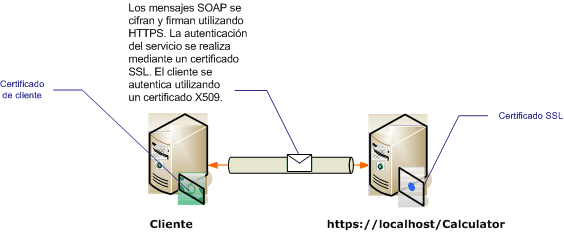

# <a name="transport-security-with-certificate-authentication"></a>Seguridad del transporte con autenticación de certificados

En este artículo se describe el uso de certificados X. 509 para la autenticación de servidor y cliente cuando se usa la seguridad de transporte. Para obtener más información sobre los certificados X.509, vea [X.509 Public Key Certificates](/windows/desktop/SecCertEnroll/about-x-509-public-key-certificates) (Certificados X.509 de clave pública). Los certificados los debe emitir una entidad de certificación, que suele ser un emisor de certificados de terceros. En un dominio de servidor de Windows, se pueden usar los Servicios de servidor de certificados de Active Directory para emitir certificados a los equipos cliente del dominio. En este escenario, el servicio se hospeda bajo Internet Information Services (IIS) que se configura con capa de sockets seguros (SSL). El servidor se configura con un certificado SSL (X.509) para que los clientes puedan comprobar la identidad del servidor. El cliente también se configura con un certificado X.509 que permite que el servicio compruebe la identidad del cliente. El cliente debe confiar en el certificado del servidor y este, en el certificado del cliente. La mecánica real de cómo el servicio y el cliente comprueba la identidad de los demás está fuera del ámbito de este artículo. Para obtener más información, consulte [firma digital](https://en.wikipedia.org/wiki/Digital_signature) en Wikipedia.
  
 En este escenario se implementa un patrón de mensaje de solicitud/respuesta como se muestra en el siguiente diagrama.  
  
   
  
 Para obtener más información sobre el uso de un certificado con un servicio, consulte [trabajar con certificados](working-with-certificates.md) y [Cómo: configurar un puerto con un certificado SSL](how-to-configure-a-port-with-an-ssl-certificate.md). En la tabla siguiente se describen las distintas características del escenario.  
  
|Característica|Descripción|  
|--------------------|-----------------|  
|Modo de seguridad|Transporte|  
|Interoperabilidad|Con clientes y servicios de servicios Web existentes|  
|Autenticación (servidor)<br /><br /> Autenticación (cliente)|Sí (mediante un certificado SSL)<br /><br /> Sí (mediante un certificado X.509)|  
|Integridad de datos|Yes|  
|Confidencialidad de los datos|Sí|  
|Transporte|HTTPS|  
|Enlaces|<xref:System.ServiceModel.WSHttpBinding>|  
  
## <a name="configure-the-service"></a>Configurar el servicio  

 Puesto que el servicio de este escenario se hospeda bajo IIS, se configura con un archivo web.config. El siguiente archivo web.config muestra cómo configurar la clase <xref:System.ServiceModel.WSHttpBinding> para usar la seguridad de transporte y las credenciales de cliente de X.509.  
  
```xml  
<configuration>  
  <system.serviceModel>  
    <protocolMapping>  
      <add scheme="https" binding="wsHttpBinding" />  
    </protocolMapping>  
    <bindings>  
      <wsHttpBinding>  
        <!-- configure wsHttp binding with Transport security mode and clientCredentialType as Certificate -->  
        <binding>  
          <security mode="Transport">  
            <transport clientCredentialType="Certificate"/>
          </security>  
        </binding>  
      </wsHttpBinding>  
    </bindings>  
    <!--For debugging purposes set the includeExceptionDetailInFaults attribute to true-->  
    <behaviors>  
      <serviceBehaviors>  
        <behavior>
           <serviceDebug includeExceptionDetailInFaults="True" />  
        </behavior>  
      </serviceBehaviors>  
    </behaviors>  
  </system.serviceModel>  
</configuration>  
```  
  
## <a name="configure-the-client"></a>Configurar el cliente  

 El cliente se puede configurar en código o en un archivo app.config. En el ejemplo siguiente se muestra cómo configurar el cliente en código.  
  
```csharp
// Create the binding.  
var myBinding = new WSHttpBinding();  
myBinding.Security.Mode = SecurityMode.Transport;  
myBinding.Security.Transport.ClientCredentialType =  
   HttpClientCredentialType.Certificate;  
  
// Create the endpoint address. Note that the machine name
// must match the subject or DNS field of the X.509 certificate  
// used to authenticate the service.
var ea = new  
   EndpointAddress("https://localhost/CalculatorService/service.svc");  
  
// Create the client. The code for the calculator
// client is not shown here. See the sample applications  
// for examples of the calculator code.  
var cc =  
   new CalculatorClient(myBinding, ea);  
  
// The client must specify a certificate trusted by the server.  
cc.ClientCredentials.ClientCertificate.SetCertificate(  
    StoreLocation.CurrentUser,  
    StoreName.My,  
    X509FindType.FindBySubjectName,  
    "contoso.com");  
  
// Begin using the client.  
Console.WriteLine(cc.Add(100, 1111));  
//...  
cc.Close();  
```  
  
 O bien, puede configurar el cliente en un archivo App.config como se muestra en el siguiente ejemplo:  
  
```xml  
<configuration>  
  <system.serviceModel>  
    <client>  
      <!-- this endpoint has an https: address -->  
      <endpoint address=" https://localhost/CalculatorService/service.svc "
                behaviorConfiguration="endpointCredentialBehavior"  
                binding="wsHttpBinding"
                bindingConfiguration="Binding1"
                contract="Microsoft.Samples.TransportSecurity.ICalculator"/>  
    </client>  
    <behaviors>  
      <endpointBehaviors>  
        <behavior name="endpointCredentialBehavior">  
          <clientCredentials>  
            <clientCertificate findValue="contoso.com"  
                               storeLocation="CurrentUser"  
                               storeName="My"  
                               x509FindType="FindBySubjectName" />  
          </clientCredentials>  
        </behavior>  
      </endpointBehaviors>  
    </behaviors>  
    <bindings>  
      <wsHttpBinding>  
        <!-- configure wsHttpbinding with Transport security mode  
                   and clientCredentialType as Certificate -->  
        <binding name="Binding1">  
          <security mode="Transport">  
            <transport clientCredentialType="Certificate"/>  
          </security>  
        </binding>  
      </wsHttpBinding>  
    </bindings>  
  </system.serviceModel>  
  
<startup><supportedRuntime version="v4.0" sku=".NETFramework,Version=v4.0"/></startup></configuration>  
```  
  
## <a name="see-also"></a>Vea también

- [Información general sobre seguridad](security-overview.md)
- [Modelo de seguridad para Windows Server App Fabric](/previous-versions/appfabric/ee677202(v=azure.10))
