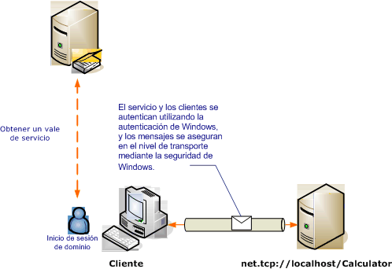

# Seguridad del transporte con la autenticaci&#243;n de Windows
El escenario siguiente muestra un cliente y el servicio de [!INCLUDE[indigo1](../../../../includes/indigo1-md.md)] protegidos por la seguridad de Windows.[!INCLUDE[crabout](../../../../includes/crabout-md.md)] cómo programar, vea [Cómo: Proteger un servicio con credenciales de Windows](../../../../docs/framework/wcf/how-to-secure-a-service-with-windows-credentials.md).  
  
 Un Servicio Web de la intranet muestra la información de recursos humanos.El cliente es una aplicación de Windows Form.La aplicación se implementa en un dominio con un controlador Kerberos que protege el dominio.  
  
   
  
|Característica|Descripción|  
|--------------------|-----------------|  
|Modo de seguridad|Transporte|  
|Interoperabilidad|Solo [!INCLUDE[indigo2](../../../../includes/indigo2-md.md)]|  
|Autenticación \(servidor\)<br /><br /> Autenticación \(cliente\)|Sí \(al utilizar la autenticación integrada de Windows\)<br /><br /> Sí \(al utilizar la autenticación integrada de Windows\)|  
|Integridad|Sí|  
|Confidencialidad|Sí|  
|Transport|NET.TCP|  
|Enlaces|<xref:System.ServiceModel.NetTcpBinding>|  
  
## Servicio  
 El código y la configuración siguientes están diseñados para ejecutarse de forma independiente.Siga uno de los procedimientos siguientes:  
  
-   Cree un servicio independiente mediante el código sin configuración.  
  
-   Cree un servicio con la configuración proporcionada, pero sin definir ningún extremo.  
  
### Código  
 El código siguiente muestra cómo crear un extremo de servicio que utilice la seguridad de Windows.  
  
 [!code-csharp[C_SecurityScenarios#3](../../../../samples/snippets/csharp/VS_Snippets_CFX/c_securityscenarios/cs/source.cs#3)]
 [!code-vb[C_SecurityScenarios#3](../../../../samples/snippets/visualbasic/VS_Snippets_CFX/c_securityscenarios/vb/source.vb#3)]  
  
### Configuración  
 Se puede usar la configuración siguiente en lugar del código para configurar el extremo de servicio:  
  
```  
<?xml version="1.0" encoding="utf-8"?>  
<configuration>  
  <system.serviceModel>  
    <behaviors />  
    <services>  
      <service behaviorConfiguration="" name="ServiceModel.Calculator">  
        <endpoint address="net.tcp://localhost:8008/Calculator"   
                  binding="netTcpBinding"  
          bindingConfiguration="WindowsClientOverTcp"   
                  name="WindowsClientOverTcp"  
                  contract="ServiceModel.ICalculator" />  
      </service>  
    </services>  
    <bindings>  
      <netTcpBinding>  
        <binding name="WindowsClientOverTcp">  
          <security mode="Transport">  
            <transport clientCredentialType="Windows" />  
          </security>  
        </binding>  
      </netTcpBinding>  
    </bindings>  
    <client />  
  </system.serviceModel>  
</configuration>  
```  
  
## Cliente  
 El código y la configuración siguientes están diseñados para ejecutarse de manera independiente.Realice uno de los procedimientos siguientes:  
  
-   Cree un cliente independiente mediante el código \(y el código de cliente\).  
  
-   Cree un cliente que no defina direcciones de extremo.En su lugar, utilice el constructor de cliente que adopta el nombre de configuración como un argumento.Por ejemplo:  
  
     [!code-csharp[C_SecurityScenarios#0](../../../../samples/snippets/csharp/VS_Snippets_CFX/c_securityscenarios/cs/source.cs#0)]
     [!code-vb[C_SecurityScenarios#0](../../../../samples/snippets/visualbasic/VS_Snippets_CFX/c_securityscenarios/vb/source.vb#0)]  
  
### Código  
 El siguiente código crea el cliente.El enlace se configura para utilizar la seguridad del modo de transporte, con el transporte TCP, con el tipo de credencial de cliente establecido en Windows.  
  
 [!code-csharp[C_SecurityScenarios#4](../../../../samples/snippets/csharp/VS_Snippets_CFX/c_securityscenarios/cs/source.cs#4)]
 [!code-vb[C_SecurityScenarios#4](../../../../samples/snippets/visualbasic/VS_Snippets_CFX/c_securityscenarios/vb/source.vb#4)]  
  
### Configuración  
 La configuración siguiente se puede utilizar en lugar del código para crear el cliente.  
  
```  
<?xml version="1.0" encoding="utf-8"?>  
<configuration>  
  <system.serviceModel>  
    <bindings>  
      <netTcpBinding>  
        <binding name="NetTcpBinding_ICalculator" >  
          <security mode="Transport">  
            <transport clientCredentialType="Windows" />  
          </security>  
        </binding>  
      </netTcpBinding>  
    </bindings>  
    <client>  
      <endpoint address="net.tcp://localhost:8008/Calculator"   
                binding="netTcpBinding"            
                bindingConfiguration="NetTcpBinding_ICalculator"   
                contract="ICalculator"  
                name="NetTcpBinding_ICalculator">  
      </endpoint>  
    </client>  
  </system.serviceModel>  
</configuration>  
```  
  
## Vea también  
 [Información general sobre seguridad](../../../../docs/framework/wcf/feature-details/security-overview.md)   
 [Cómo: Proteger un servicio con credenciales de Windows](../../../../docs/framework/wcf/how-to-secure-a-service-with-windows-credentials.md)   
 [Modelo de seguridad para Windows Server App Fabric](http://go.microsoft.com/fwlink/?LinkID=201279&clcid=0x409)