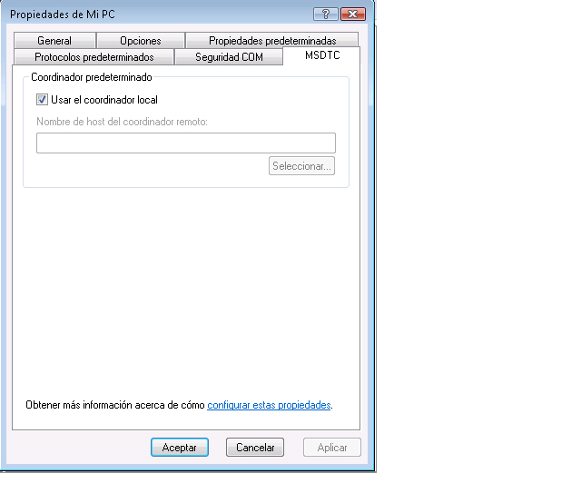

# <a name="troubleshooting-queued-messaging"></a>Solución de problemas de la mensajería en cola
Esta sección contiene preguntas comunes y solución de problemas para utilizar las colas en Windows Communication Foundation (WCF).  
  
## <a name="common-questions"></a>Preguntas comunes  
 **P: ¿** usé WCF Beta 1 y he instalado la revisión MSMQ. ¿Debo quitar la revisión?  
  
 **R:** Sí. Esta revisión ya no se admite. WCF ahora funciona en MSMQ sin un requisito de revisión.  
  
 **P: ¿** hay dos enlaces para MSMQ: <xref:System.ServiceModel.NetMsmqBinding> y <xref:System.ServiceModel.MsmqIntegration.MsmqIntegrationBinding>. ¿Qué debería utilizar y cuándo?  
  
 **R:** utilizar el <xref:System.ServiceModel.NetMsmqBinding> cuando desee usar MSMQ como transporte para la comunicación en cola entre dos aplicaciones de WCF. Utilice el <xref:System.ServiceModel.MsmqIntegration.MsmqIntegrationBinding> cuando desee utilizar aplicaciones MSMQ existentes para comunicarse con nuevas aplicaciones de WCF.  
  
 **P: ¿** ¿tengo que actualizar MSMQ para usar el <xref:System.ServiceModel.NetMsmqBinding> y `MsmqIntegration` enlaces?  
  
 **R:** no. Ambos enlaces funcionan con MSMQ 3.0 en [!INCLUDE[wxp](../../../../includes/wxp-md.md)] y [!INCLUDE[ws2003](../../../../includes/ws2003-md.md)]. Ciertas características de los enlaces se vuelven disponibles al actualizar a MSMQ 4.0 en [!INCLUDE[wv](../../../../includes/wv-md.md)].  
  
 **P: ¿** qué características de la <xref:System.ServiceModel.NetMsmqBinding> y <xref:System.ServiceModel.MsmqIntegration.MsmqIntegrationBinding> enlaces están disponibles en MSMQ 4.0 pero no en MSMQ 3.0?  
  
 **R:** las siguientes características están disponibles en MSMQ 4.0 pero no en MSMQ 3.0:  
  
-   La cola de mensajes no enviados personalizada solo se admite en MSMQ 4.0.  
  
-   MSMQ 3.0 y 4.0 administran los mensajes dudosos de manera diferente.  
  
-   Sólo MSMQ 4.0 admite la lectura de transacción remota.  
  
 Para obtener más información, consulte [diferencias en las características de puesta en cola en Windows Vista, Windows Server 2003 y Windows XP](../../../../docs/framework/wcf/feature-details/diff-in-queue-in-vista-server-2003-windows-xp.md).  
  
 **P: ¿** puedo usar MSMQ 3.0 en un lado de una comunicación en cola y MSMQ 4.0 en el otro lado?  
  
 **R:** Sí.  
  
 **P: ¿** deseo integrar aplicaciones MSMQ existentes con nuevos clientes WCF o servidores. ¿Necesito actualizar ambos lados de mi infraestructura de MSMQ?  
  
 **R:** no. No tiene que actualizar a MSMQ 4.0 en ningún lado.  
  
## <a name="troubleshooting"></a>Solución de problemas  
 Esta sección contiene las respuestas a la mayoría de problemas más comunes. Algunos problemas que son limitaciones conocidas también se describen en las notas de la versión.  
  
 **P: ¿** estoy intentando usar una cola privada y obtengo la excepción siguiente: `System.InvalidOperationException`: la dirección URL no es válida. La dirección URL para la cola no puede contener el carácter '$'. Utilice la sintaxis en net.msmq://machine/private/queueName para direccionar una cola privada.  
  
 **R:** Compruebe el identificador uniforme de recursos (URI) en la configuración y el código. No utilice el carácter "$" en el URI. Por ejemplo, para direccionar una cola privada denominada OrdersQueue, especifique el URI como net.msmq://localhost/private/ordersQueue.  
  
 **P: ¿** llamada `ServiceHost.Open()` en mi aplicación en cola inicia la siguiente excepción: `System.ArgumentException`: una dirección base no puede contener una cadena de consulta URI. ¿Por qué?  
  
 **R:** Compruebe el URI en el archivo de configuración y en el código de la cola. Mientras que las colas de MSMQ admiten el uso del carácter "?", los URI lo interpretan como el principio de una consulta de cadena. Para evitar este problema, use nombres de cola que no contengan el carácter "?".  
  
 **P: ¿** mi envío se realizó correctamente pero se invoca ninguna operación de servicio en el receptor. ¿Por qué?  
  
 **R:** para determinar la respuesta, funcionan a través de la lista de comprobación siguiente:  
  
-   Compruebe que los requisitos de cola transaccional sean compatibles con las convicciones especificadas. Tenga en cuenta los principios siguientes:  
  
    -   Puede enviar mensajes duraderos (datagramas y sesiones) con "exactamente una vez" garantías (<xref:System.ServiceModel.MsmqBindingBase.ExactlyOnce%2A> = `true`) solo a una cola transaccional.  
  
    -   Solo puede enviar las sesiones con "exactamente una" convicción.  
  
    -   Se requiere una transacción para recibir mensajes en una sesión de una cola transaccional.  
  
    -   Puede enviar o recibir mensajes volátiles o duraderos (solo datagramas) sin convicciones (<xref:System.ServiceModel.MsmqBindingBase.ExactlyOnce%2A> = `false`) solo a una cola no transaccional.  
  
-   Compruebe la cola de mensajes no enviados. Si encuentra los mensajes allí, determine por qué no se entregaron.  
  
-   Compruebe la conectividad o los problemas de direccionamiento de las colas de salida.  
  
 **P: ¿** he especificado una cola de mensajes no enviados personalizada, pero al iniciar la aplicación de remitente, obtengo una excepción que no se encuentra la cola de mensajes no enviados o la aplicación emisora no tiene permiso para la cola. ¿Por qué está sucediendo esto?  
  
 **R:** el URI de cola de mensajes no enviados personalizada debe incluir un "localhost" o el nombre del equipo en el primer segmento, por ejemplo, MSMQ://localhost/Private/cola.  
  
 **P: ¿** siempre es necesario definir una cola de mensajes no enviados personalizada o hay una cola de mensajes no enviados predeterminada?  
  
 **R:** si la convicción es "exactamente una vez" (<xref:System.ServiceModel.MsmqBindingBase.ExactlyOnce%2A> = `true`), y si no especifica una cola de mensajes no enviados personalizada, el valor predeterminado es una cola de mensajes no enviados transaccional de todo el sistema.  
  
 Si la convicción es none (<xref:System.ServiceModel.MsmqBindingBase.ExactlyOnce%2A> = `false`), el valor predeterminado es ninguna funcionalidad de cola de mensajes.  
  
 **P: ¿** mi servicio inicia Svchost.Open con un mensaje "que Listenerfactory no puede cumplir requisitos de Endpointlistener el". ¿Por qué?  
  
 R. Compruebe su contrato de servicios. Es posible que haya olvidado colocar "IsOneWay =`true`" en todas las operaciones de servicio. Las colas solo admiten las operaciones de servicio unidireccionales.  
  
 **P: ¿** hay mensajes en la cola, pero se invoca ninguna operación de servicio. ¿Cuál es el problema?  
  
 **R:** determinar si se genera un error en su host de servicio. Lo puede comprobar examinando el seguimiento o implementando `IErrorHandler`. El host de servicio, de forma predeterminada, tiene errores si se detecta un mensaje dudoso.  
  
 **P: ¿** hay mensajes en la cola pero no se activa mi servicio en cola hospedado en Web. ¿Por qué?  
  
 **R:** la razón más común es que los permisos.  
  
1.  Asegúrese de que el proceso `NetMsmqActivator` se esté ejecutando y la identidad del proceso `NetMsmqActivator` se lea y busque el permiso en la cola.  
  
2.  Si `NetMsmqActivator` está supervisando las colas en un equipo remoto, asegúrese de que `NetMsmqActivator` no se ejecute con un token restringido. Para ejecutar `NetMsmqActivator` con un token sin restricciones:  
  
    ```  
    sc sidtype NetMsmqActivator unrestricted  
    ```  
  
 Para problemas de falta de seguridad relacionados con Web host, consulte: [Web hospeda una aplicación en cola](../../../../docs/framework/wcf/feature-details/web-hosting-a-queued-application.md).  
  
 **P: ¿** cuál es la manera más fácil a las sesiones de acceso?  
  
 **R:** establezca AutoComplete =`true` en la operación que corresponde al último mensaje de la sesión y establezca AutoComplete =`false` en todas las operaciones de servicio restantes.  
  
 **P: ¿** ¿dónde puedo encontrar respuestas a preguntas habituales sobre MSMQ?  
  
 **R:** para obtener más información acerca de MSMQ, consulte [Microsoft Message Queuing](https://go.microsoft.com/fwlink/?LinkId=87810).  
  
 **P: ¿** ¿por qué genera mi servicio un `ProtocolException` cuando lee en una cola que contiene ambos en cola los mensajes de sesión y mensajes de datagrama en cola?  
  
 **R:** hay una diferencia fundamental en los mensajes de sesión cierto en cola y se componen los mensajes de datagrama en cola. Debido a esto, un servicio que está esperando leer un mensaje de la sesión en cola no puede recibir un mensaje del datagrama en cola y un servicio que espera leer un mensaje del datagrama en cola no puede recibir un mensaje de la sesión. Intentar leer ambos tipos de mensajes de la misma cola provoca la excepción siguiente:  
  
```  
System.ServiceModel.MsmqPoisonMessageException: The transport channel detected a poison message. This occurred because the message exceeded the maximum number of delivery attempts or because the channel detected a fundamental problem with the message. The inner exception may contain additional information.   
---> System.ServiceModel.ProtocolException: An incoming MSMQ message contained invalid or unexpected .NET Message Framing information in its body. The message cannot be received. Ensure that the sender is using a compatible service contract with a matching SessionMode.  
```  
  
 La cola de mensajes no enviados del sistema, así como cualquier cola de mensajes no enviados personalizada, es particularmente susceptible a este problema si una aplicación envía mensajes de la sesión en cola y mensajes del datagrama en cola desde el mismo equipo. Si no se puede enviar un mensaje correctamente, se mueve a la cola de mensajes no enviados. Bajo estas circunstancias, es posible tener mensajes de sesión y datagrama en la cola de mensajes no enviados. No hay ninguna manera de separar ambos tipos de mensajes en el tiempo de ejecución al leer de una cola, por consiguiente, las aplicaciones no deberían enviar mensajes de la sesión en cola y mensajes del datagrama en cola desde el mismo equipo.  
  
### <a name="msmq-integration-specific-troubleshooting"></a>Integración de MSMQ: Solución de problemas específicos  
 **P: ¿** cuando se envía un mensaje, o cuando abro el host de servicio, obtengo un error que indica el esquema es erróneo. ¿Por qué?  
  
 **R:** cuando se usa el enlace de integración de MSMQ, debe usar el esquema msmq.formatname. Por ejemplo, msmq.formatname:DIRECT=OS:. \private $ \OrdersQueue. Pero al especificar la cola de mensajes no enviados personalizada, debe utilizar el esquema de net.msmq.  
  
 **P: ¿** cuando utilice un nombre de formato público o privado y abra el host de servicio en [!INCLUDE[wv](../../../../includes/wv-md.md)], obtengo un error. ¿Por qué?  
  
 **R:** canal de integración de The WCF en [!INCLUDE[wv](../../../../includes/wv-md.md)] comprueba si se puede abrir una subcola de la cola de aplicación principal para administrar los mensajes dudosos. El nombre de la subcola se deriva de un URI de msmq.formatname pasado a la escucha. El nombre de la subcola en MSMQ solo puede ser un nombre de formato directo. Aquí radica el error. Cambie el URI de la cola a un nombre de formato directo.  
  
 **P: ¿** al recibir un mensaje desde una aplicación MSMQ, el mensaje se coloca en la cola y no se lee la aplicación receptora de WCF. ¿Por qué?  
  
 **R:** Compruebe si el mensaje tiene un cuerpo. Si el mensaje no tiene ningún cuerpo, el canal de integración de MSMQ omite el mensaje. Implemente `IErrorHandler` para recibir notificaciones de las excepciones y comprobar las trazas.  
  
### <a name="security-related-troubleshooting"></a>Solución de problemas relacionados con la seguridad  
 **P: ¿** cuando ejecuto el ejemplo que utiliza un enlace predeterminado en el modo de grupo de trabajo, los mensajes parecen enviarse pero nunca se reciben por el receptor.  
  
 **R:** de forma predeterminada, los mensajes se firman con un certificado interno de MSMQ que requiere el servicio de directorio de Active Directory. En modo del grupo de trabajo, puesto que Active Directory no está disponible, la firma de los mensajes falla. Por lo que el mensaje llega a la cola y se indica la causa del error, como "Firma no válida".  
  
 La solución alternativa es desactivar la seguridad. Esto se hace estableciendo <xref:System.ServiceModel.NetMsmqSecurity.Mode%2A>  =  <xref:System.ServiceModel.NetMsmqSecurityMode.None> para que funcione en modo de grupo de trabajo.  
  
 Otra solución alternativa es recibir <xref:System.ServiceModel.MsmqTransportSecurity> de la propiedad <xref:System.ServiceModel.NetMsmqSecurity.Transport%2A> y establecerlo en <xref:System.ServiceModel.MsmqAuthenticationMode.Certificate>y establecer el certificado de cliente.  
  
 Todavía otra solución alternativa es instalar MSMQ con integración de Active Directory.  
  
 **P: ¿** cuando se envía un mensaje con enlace predeterminado (activado de seguridad de transporte) en Active Directory a una cola, obtengo un mensaje "no se encontró el certificado interno". ¿Cómo se soluciona?  
  
 **R:** Esto significa que se debe renovar el certificado en Active Directory para el remitente. Para ello, abra **Panel de Control**, **herramientas administrativas**, **administración de equipos**, haga clic en **MSMQ**y seleccione **Propiedades**. Seleccione el **certificado de usuario** ficha y haga clic en el **Renew** botón.  
  
 **P: ¿** cuando envíe un mensaje mediante <xref:System.ServiceModel.MsmqAuthenticationMode.Certificate> y especificar el certificado que se usará, obtengo un mensaje de "Certificado no válido". ¿Cómo se soluciona?  
  
 **R:** no se puede usar un almacén de certificados equipo local con el modo de certificado. Tiene que copiar el certificado del almacén de certificados del equipo al almacén del usuario actual utilizando el complemento del certificado. Para obtener el complemento del certificado:  
  
1.  Haga clic en **iniciar**, seleccione **ejecutar**, tipo `mmc`y haga clic en **Aceptar**.  
  
2.  En el **Microsoft Management Console**, abra el **archivo** menú y seleccione **agregar o quitar complemento**.  
  
3.  En el **agregar o quitar complemento** cuadro de diálogo, haga clic en el **agregar** botón.  
  
4.  En el **Add Standalone Snap-in** cuadro de diálogo, seleccione certificados y haga clic en **agregar**.  
  
5.  En el **certificados** cuadro de diálogo complemento, seleccione **mi cuenta de usuario,** y haga clic en **finalizar**.  
  
6.  A continuación, agregue un segundo complemento certificados siguiendo los pasos anteriores, pero esta vez seleccione **cuenta de equipo** y haga clic en **siguiente**.  
  
7.  Seleccione **ordenador** y haga clic en **finalizar**. Ahora puede arrastrar y colocar certificados del almacén de certificados del equipo al almacén del usuario actual.  
  
 **P: ¿** cuando mi servicio lee de una cola en otro equipo en el modo de grupo de trabajo, obtengo una excepción "acceso denegado".  
  
 **R:** en modo de grupo de trabajo, para una aplicación remota obtener acceso a la cola, la aplicación debe tener permiso para acceder a la cola. Agregue "Inicio de sesión anónimo" a la lista de control de acceso (ACL) de la cola y asígnele el permiso de lectura.  
  
 **P: ¿** cuando un cliente de servicios de red (o cualquier cliente que no tiene una cuenta de dominio) envía un mensaje en cola, se produce un error en el envío con un certificado no válido. ¿Cómo se soluciona?  
  
 **R:** Compruebe la configuración de enlace. El enlace predeterminado tiene la seguridad de transporte de MSMQ activada para firmar el mensaje. Desactívela.  
  
### <a name="remote-transacted-receives"></a>Recepciones de transacción remotas  
 **P: ¿** cuando tengo una cola en el equipo, y un servicio WCF que lee los mensajes de una cola en el equipo B (escenario de recepción de transacción remota), los mensajes no se leen desde la cola. La información de seguimiento indica que la recepción no pudo con el mensaje "transacción no se puede importar." ¿Qué puedo hacer para solucionar este problema?  
  
 **R:** existen tres posibles razones para esto:  
  
-   Si está en modo del dominio, la recepción de transacciones remotas requiere el acceso de red de Microsoft DTC (Coordinador de transacciones distribuidas) (MSDTC). Esto puede habilitar mediante **agregar o quitar componentes**.  
  
       
  
-   Compruebe el modo de autenticación para comunicarse con el administrador de transacciones. Si está en modo de grupo de trabajo, no debe seleccionarse "se requiere autenticación". Si está en modo de dominio, debe seleccionar "Autenticación mutua requerida".  
  
       
  
-   Asegúrese de que MSDTC está en la lista de excepciones en el **Internet Connection Firewall** configuración.  
  
-   Asegúrese de que está utilizando [!INCLUDE[wv](../../../../includes/wv-md.md)]. MSMQ en [!INCLUDE[wv](../../../../includes/wv-md.md)] admite la lectura de transacciones remotas. MSMQ en versiones anteriores de Windows no admite la lectura de transacciones remotas.  
  
 **P: ¿** cuando el servicio que lee de la cola es un servicio de red, por ejemplo, en un sitio Web host, ¿por qué obtengo una excepción de acceso denegado se produce cuando se leen de la cola?  
  
 **R:** acceso de lectura del servicio de red debe agregarse a la cola ACL para asegurarse de que puede leer un servicio de red de la cola.  
  
 **P: ¿** puedo usar el servicio de activación de MSMQ para activar aplicaciones basadas en mensajes en una cola en un equipo remoto?  
  
 **R:** Sí. Para ello, debe configurar el servicio de activación de MSMQ para que se ejecute como un servicio de red y agregar el acceso del servicio de red a la cola en el equipo remoto.  
  
## <a name="using-custom-msmq-bindings-with-receivecontext-enabled"></a>Utilizar los enlaces personalizados de MSMQ con ReceiveContext habilitado  
 Al utilizar un enlace personalizado de MSMQ con <xref:System.ServiceModel.Channels.ReceiveContext> habilitado, al procesar un mensaje entrante se utilizará un subproceso del grupo de subprocesos porque MSMQ nativo no admite la realización de E/S para recepciones <xref:System.ServiceModel.Channels.ReceiveContext> asincrónicas. Esto se debe a que, al procesar este tipo de mensaje, se utilizan transacciones internas para <xref:System.ServiceModel.Channels.ReceiveContext> y MSMQ no admite el procesamiento asincrónico. Para evitar este problema, puede agregar <xref:System.ServiceModel.Description.SynchronousReceiveBehavior> al extremo para forzar el procesamiento sincrónico, o establecer <xref:System.ServiceModel.Description.DispatcherSynchronizationBehavior.MaxPendingReceives%2A> en 1.
