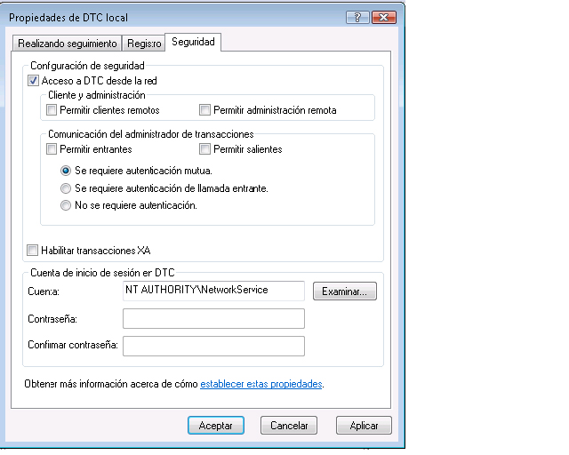

# <a name="troubleshooting-queued-messaging"></a>Solución de problemas de la mensajería en cola

Esta sección contiene preguntas comunes y ayuda para el uso de colas en Windows Communication Foundation (WCF).

## <a name="common-questions"></a>Preguntas frecuentes

**P:** He usado WCF beta 1 e he instalado la revisión de MSMQ. ¿Debo quitar la revisión?

**R:** Sí. Esta revisión ya no se admite. WCF ahora funciona en MSMQ sin un requisito de revisión.

**P:** Hay dos enlaces para MSMQ: <xref:System.ServiceModel.NetMsmqBinding> y <xref:System.ServiceModel.MsmqIntegration.MsmqIntegrationBinding> . ¿Qué debería utilizar y cuándo?

**R:** Use el <xref:System.ServiceModel.NetMsmqBinding> cuando desee usar MSMQ como transporte para la comunicación en cola entre dos aplicaciones WCF. Use el <xref:System.ServiceModel.MsmqIntegration.MsmqIntegrationBinding> cuando desee usar aplicaciones MSMQ existentes para comunicarse con nuevas aplicaciones WCF.

**P:** ¿Tengo que actualizar MSMQ para usar los <xref:System.ServiceModel.NetMsmqBinding> enlaces y `MsmqIntegration` ?

**R:** No. Ambos enlaces funcionan con MSMQ 3,0 en Windows XP y Windows Server 2003. Ciertas características de los enlaces están disponibles al actualizar a MSMQ 4,0 en Windows Vista.

**P:** ¿Qué características de <xref:System.ServiceModel.NetMsmqBinding> los <xref:System.ServiceModel.MsmqIntegration.MsmqIntegrationBinding> enlaces y están disponibles en MSMQ 4,0 pero no en MSMQ 3,0?

**R:** Las siguientes características están disponibles en MSMQ 4,0, pero no en MSMQ 3,0:

- La cola de mensajes no enviados personalizada solo se admite en MSMQ 4.0.

- MSMQ 3.0 y 4.0 administran los mensajes dudosos de manera diferente.

- Sólo MSMQ 4.0 admite la lectura de transacción remota.

Para obtener más información, vea [diferencias en las características de cola en Windows Vista, Windows Server 2003 y Windows XP](diff-in-queue-in-vista-server-2003-windows-xp.md).

**P:** ¿Puedo usar MSMQ 3,0 en un lado de una comunicación en cola y MSMQ 4,0 en el otro lado?

**R:** Sí.

**P:** Deseo integrar aplicaciones MSMQ existentes con nuevos clientes o servidores WCF. ¿Necesito actualizar ambos lados de mi infraestructura de MSMQ?

**R:** No. No tiene que actualizar a MSMQ 4.0 en ningún lado.

## <a name="troubleshooting"></a>Solución de problemas

Esta sección contiene las respuestas a la mayoría de problemas más comunes. Algunos problemas que son limitaciones conocidas también se describen en las notas de la versión.

**P:** Estoy intentando usar una cola privada y obtengo la siguiente excepción: `System.InvalidOperationException` : la dirección URL no es válida. La dirección URL para la cola no puede contener el carácter '$'. Utilice la sintaxis en net.msmq://machine/private/queueName para direccionar una cola privada.

**R:** Compruebe el identificador uniforme de recursos (URI) de la cola en la configuración y el código. No utilice el carácter "$" en el URI. Por ejemplo, para direccionar una cola privada denominada OrdersQueue, especifique el URI como `net.msmq://localhost/private/ordersQueue` .

**P:** La llamada a `ServiceHost.Open()` en la aplicación en cola produce la excepción siguiente: `System.ArgumentException` : una dirección base no puede contener una cadena de consulta de URI. ¿Por qué?

**R:** Compruebe el URI de la cola en el archivo de configuración y en el código. Mientras que las colas de MSMQ admiten el uso del carácter "?", los URI lo interpretan como el principio de una consulta de cadena. Para evitar este problema, use nombres de cola que no contengan el carácter "?".

**P:** Mi envío se realizó correctamente, pero no se invoca ninguna operación de servicio en el receptor. ¿Por qué?

**R:** Para determinar la respuesta, trabaje con la siguiente lista de comprobación:

- Compruebe que los requisitos de cola transaccional sean compatibles con las convicciones especificadas. Tenga en cuenta los principios siguientes:

  - Puede enviar mensajes duraderos (datagramas y sesiones) con garantías "exactamente una vez" ( <xref:System.ServiceModel.MsmqBindingBase.ExactlyOnce%2A>  =  `true` ) solo a una cola transaccional.

  - Solo puede enviar las sesiones con "exactamente una" convicción.

  - Se requiere una transacción para recibir mensajes en una sesión de una cola transaccional.

  - Puede enviar o recibir mensajes volátiles o duraderos (solo datagramas) sin garantías ( <xref:System.ServiceModel.MsmqBindingBase.ExactlyOnce%2A>  =  `false` ) solo en una cola no transaccional.

- Compruebe la cola de mensajes no enviados. Si encuentra los mensajes allí, determine por qué no se entregaron.

- Compruebe la conectividad o los problemas de direccionamiento de las colas de salida.

**P:** He especificado una cola de mensajes no enviados personalizada, pero cuando se inicia la aplicación remitente, obtengo una excepción que indica que no se encuentra la cola de mensajes no enviados o que la aplicación emisora no tiene permiso para la cola de mensajes no enviados. ¿Por qué ocurre esto?

**R:** El URI de la cola de mensajes no enviados personalizada debe incluir un "localhost" o el nombre del equipo en el primer segmento, por ejemplo, net. MSMQ://localhost/private/myAppdead-letter Queue.

**P:** ¿Siempre es necesario definir una cola de mensajes no enviados personalizada o hay una cola de mensajes no enviados predeterminada?

**R:** Si las garantías son "exactamente una vez" ( <xref:System.ServiceModel.MsmqBindingBase.ExactlyOnce%2A>  =  `true` ) y no especifica una cola de mensajes no enviados personalizada, el valor predeterminado es una cola de mensajes no enviados transaccional para todo el sistema.

Si las garantías son none ( <xref:System.ServiceModel.MsmqBindingBase.ExactlyOnce%2A>  =  `false` ), el valor predeterminado es sin funcionalidad de cola de mensajes no enviados.

**P:** El servicio se inicia en SvcHost. Open con un mensaje que indica que el Endpointlistener no puede cumplir los requisitos de EndpointListener. ¿Por qué?

A. Compruebe su contrato de servicios. Es posible que haya olvidado poner "IsOneWay = `true` " en todas las operaciones de servicio. Las colas solo admiten las operaciones de servicio unidireccionales.

**P:** Hay mensajes en la cola, pero no se invoca ninguna operación de servicio. ¿Cuál es el problema?

**R:** Determine si se produce un error en el host de servicio. Lo puede comprobar examinando el seguimiento o implementando `IErrorHandler`. El host de servicio, de forma predeterminada, tiene errores si se detecta un mensaje dudoso.

**P:** Hay mensajes en la cola, pero el servicio en cola hospedado en Web no se está activando. ¿Por qué?

**R:** La razón más común son los permisos.

1. Asegúrese de que el proceso `NetMsmqActivator` se esté ejecutando y la identidad del proceso `NetMsmqActivator` se lea y busque el permiso en la cola.

2. Si `NetMsmqActivator` está supervisando las colas en un equipo remoto, asegúrese de que `NetMsmqActivator` no se ejecute con un token restringido. Para ejecutar `NetMsmqActivator` con un token sin restricciones:

    ```console
    sc sidtype NetMsmqActivator unrestricted
    ```

En el caso de problemas de host web no relacionados con la seguridad, consulte: [hospedaje Web de una aplicación en cola](web-hosting-a-queued-application.md).

**P:** ¿Cuál es la manera más sencilla de acceder a las sesiones?

**R:** Establezca AutoComplete = `true` en la operación que se corresponda con el último mensaje de la sesión y establezca AutoComplete = `false` en todas las operaciones de servicio restantes.

**P:** ¿Por qué el servicio inicia una excepción `ProtocolException` cuando se lee de una cola que contiene mensajes de sesión en cola y mensajes de datagrama en cola?

**R:** Existe una diferencia fundamental en el modo en que se componen los mensajes de sesión en cola y los mensajes de datagrama en cola. Debido a esto, un servicio que está esperando leer un mensaje de la sesión en cola no puede recibir un mensaje del datagrama en cola y un servicio que espera leer un mensaje del datagrama en cola no puede recibir un mensaje de la sesión. Intentar leer ambos tipos de mensajes de la misma cola provoca la excepción siguiente:

```console
System.ServiceModel.MsmqPoisonMessageException: The transport channel detected a poison message. This occurred because the message exceeded the maximum number of delivery attempts or because the channel detected a fundamental problem with the message. The inner exception may contain additional information.
---> System.ServiceModel.ProtocolException: An incoming MSMQ message contained invalid or unexpected .NET Message Framing information in its body. The message cannot be received. Ensure that the sender is using a compatible service contract with a matching SessionMode.
```

La cola de mensajes no enviados del sistema, así como cualquier cola de mensajes no enviados personalizada, es particularmente susceptible a este problema si una aplicación envía mensajes de la sesión en cola y mensajes del datagrama en cola desde el mismo equipo. Si no se puede enviar un mensaje correctamente, se mueve a la cola de mensajes no enviados. Bajo estas circunstancias, es posible tener mensajes de sesión y datagrama en la cola de mensajes no enviados. No hay ninguna manera de separar ambos tipos de mensajes en el tiempo de ejecución al leer de una cola, por consiguiente, las aplicaciones no deberían enviar mensajes de la sesión en cola y mensajes del datagrama en cola desde el mismo equipo.

### <a name="msmq-integration-specific-troubleshooting"></a>Integración de MSMQ: Solución de problemas específicos

**P:** Cuando se envía un mensaje, o cuando abro el host de servicio, aparece un error que indica que el esquema es incorrecto. ¿Por qué?

**R:** Al utilizar el enlace de integración de MSMQ, debe utilizar el esquema MSMQ. FormatName. Por ejemplo, msmq.formatname:DIRECT=OS:. \private $ \OrdersQueue. Pero al especificar la cola de mensajes no enviados personalizada, debe utilizar el esquema de net.msmq.

**P:** Cuando utilizo un nombre de formato público o privado y abro el host de servicio en Windows Vista, obtengo un error. ¿Por qué?

**R:** El canal de integración de WCF en Windows Vista comprueba si se puede abrir una subcola para la cola de la aplicación principal para administrar los mensajes dudosos. El nombre de la subcola se deriva de un URI de MSMQ. FormatName pasado al agente de escucha. El nombre de la subcola en MSMQ solo puede ser un nombre de formato directo. Aquí radica el error. Cambie el URI de la cola a un nombre de formato directo.

**P:** Al recibir un mensaje de una aplicación MSMQ, el mensaje se coloca en la cola y la aplicación WCF receptora no lo lee. ¿Por qué?

**R:** Compruebe si el mensaje tiene un cuerpo. Si el mensaje no tiene ningún cuerpo, el canal de integración de MSMQ omite el mensaje. Implemente `IErrorHandler` para recibir notificaciones de las excepciones y comprobar las trazas.

### <a name="security-related-troubleshooting"></a>Solución de problemas relacionados con la seguridad

**P:** Cuando ejecuto el ejemplo que utiliza un enlace predeterminado en el modo de grupo de trabajo, los mensajes parecen enviarse pero el receptor nunca los recibe.

**R:** De forma predeterminada, los mensajes se firman con un certificado interno de MSMQ que requiere el servicio de directorio de Active Directory. En modo del grupo de trabajo, puesto que Active Directory no está disponible, la firma de los mensajes falla. Por lo tanto, se indica el mensaje que se encuentra en la cola de mensajes no enviados y la causa del error, como "firma incorrecta".

La solución alternativa es desactivar la seguridad. Esto se hace estableciendo <xref:System.ServiceModel.NetMsmqSecurity.Mode%2A>  =  <xref:System.ServiceModel.NetMsmqSecurityMode.None> para que funcione en modo de grupo de trabajo.

Otra solución alternativa es recibir <xref:System.ServiceModel.MsmqTransportSecurity> de la propiedad <xref:System.ServiceModel.NetMsmqSecurity.Transport%2A> y establecerlo en <xref:System.ServiceModel.MsmqAuthenticationMode.Certificate>y establecer el certificado de cliente.

Todavía otra solución alternativa es instalar MSMQ con integración de Active Directory.

**P:** Cuando se envía un mensaje con el enlace predeterminado (seguridad de transporte activada) en Active Directory a una cola, aparece el mensaje "no se encontró el certificado interno". ¿Cómo puedo corregirlo?

**R:** Esto significa que el certificado en Active Directory para el remitente debe renovarse. Para ello, abra el **Panel de control**, **herramientas administrativas**, **Administración de equipos**, haga clic con el botón secundario en **MSMQ**y seleccione **propiedades**. Seleccione la pestaña **certificado de usuario** y haga clic en el botón **renovar** .

**P:** Cuando se envía un mensaje mediante <xref:System.ServiceModel.MsmqAuthenticationMode.Certificate> y se especifica el certificado que se va a utilizar, aparece un mensaje que indica que el certificado no es válido. ¿Cómo puedo corregirlo?

**R:** No se puede usar un almacén de certificados del equipo local con el modo de certificado. Tiene que copiar el certificado del almacén de certificados del equipo al almacén del usuario actual utilizando el complemento del certificado. Para obtener el complemento del certificado:

1. Haga clic en **Inicio**, seleccione **Ejecutar**, escriba `mmc` y haga clic en **Aceptar**.

2. En **Microsoft Management Console**, abra el menú **archivo** y seleccione **Agregar o quitar complemento**.

3. En el cuadro de diálogo **Agregar o quitar complemento** , haga clic en el botón **Agregar** .

4. En el cuadro de diálogo **Agregar un complemento independiente** , seleccione certificados y haga clic en **Agregar**.

5. En el cuadro de diálogo complemento **certificados** , seleccione **mi cuenta de usuario** y haga clic en **Finalizar**.

6. Después, agregue un segundo complemento certificados con los pasos anteriores, pero esta vez seleccione cuenta de **equipo** y haga clic en **siguiente**.

7. Seleccione **Equipo Local** y haga clic en **Finalizar**. Ahora puede arrastrar y colocar certificados del almacén de certificados del equipo al almacén del usuario actual.

**P:** Cuando el servicio Lee de una cola de otro equipo en el modo de grupo de trabajo, obtengo una excepción de "acceso denegado".

**R:** En el modo de grupo de trabajo, para que una aplicación remota obtenga acceso a la cola, la aplicación debe tener permiso de acceso a la cola. Agregue "Inicio de sesión anónimo" a la lista de control de acceso (ACL) de la cola y concédale el permiso de lectura.

**P:** Cuando un cliente de servicio de red (o cualquier cliente que no tiene una cuenta de dominio) envía un mensaje en cola, se produce un error de envío con un certificado no válido. ¿Cómo puedo corregirlo?

**R:** Compruebe la configuración de enlace. El enlace predeterminado tiene la seguridad de transporte de MSMQ activada para firmar el mensaje. Desactívela.

### <a name="remote-transacted-receives"></a>Recepciones de transacción remotas

**P:** Cuando tengo una cola en el equipo A y un servicio WCF que lee los mensajes de una cola en el equipo B (el escenario de recepción de transacción remota), los mensajes no se leen de la cola. La información de seguimiento indica que se produjo un error en la recepción con el mensaje "no se puede importar la transacción". ¿Qué puedo hacer para solucionar esto?

**R:** Existen tres razones posibles para ello:

- Si está en modo del dominio, la recepción de transacciones remotas requiere el acceso de red de Microsoft DTC (Coordinador de transacciones distribuidas) (MSDTC). Puede habilitarlo mediante **Agregar o quitar componentes**.

  

- Compruebe el modo de autenticación para comunicarse con el administrador de transacciones. Si está en modo de grupo de trabajo, debe seleccionar "no se requiere autenticación". Si está en modo de dominio, debe estar seleccionada la opción "se requiere autenticación mutua".

  

- Asegúrese de que MSDTC está en la lista de excepciones en la configuración del **firewall de conexión a Internet** .

- Asegúrese de que está usando Windows Vista. MSMQ en Windows Vista admite la lectura de transacciones remotas. MSMQ en versiones anteriores de Windows no admite la lectura de transacciones remotas.

**P:** Cuando el servicio que lee de la cola es un servicio de red, por ejemplo, en un host Web, ¿por qué obtengo una excepción de acceso denegado al leer de la cola?

**R:** Se debe agregar acceso de lectura del servicio de red a la ACL de la cola para asegurarse de que un servicio de red pueda leer la cola.

**P:** ¿Puedo usar el servicio de activación MSMQ para activar aplicaciones basadas en mensajes de una cola en un equipo remoto?

**R:** Sí. Para ello, debe configurar el servicio de activación de MSMQ para que se ejecute como un servicio de red y agregar el acceso del servicio de red a la cola en el equipo remoto.

## <a name="using-custom-msmq-bindings-with-receivecontext-enabled"></a>Utilizar los enlaces personalizados de MSMQ con ReceiveContext habilitado

Cuando se usa un enlace MSMQ personalizado con <xref:System.ServiceModel.Channels.ReceiveContext> habilitado, el procesamiento de un mensaje entrante usa un subproceso de grupo de subprocesos porque MSMQ nativo no admite la finalización de e/s para las <xref:System.ServiceModel.Channels.ReceiveContext> recepciones asincrónicas. Esto se debe a que el procesamiento de este tipo de mensaje usa transacciones internas para <xref:System.ServiceModel.Channels.ReceiveContext> y MSMQ no admite el procesamiento asincrónico. Para solucionar este problema, puede Agregar un <xref:System.ServiceModel.Description.SynchronousReceiveBehavior> al punto de conexión para forzar el procesamiento sincrónico o establecer <xref:System.ServiceModel.Description.DispatcherSynchronizationBehavior.MaxPendingReceives%2A> en 1.
