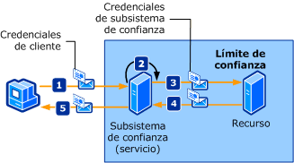

# <a name="trusted-subsystem"></a><span data-ttu-id="75734-102">Subsistema de confianza</span><span class="sxs-lookup"><span data-stu-id="75734-102">Trusted Subsystem</span></span>

<span data-ttu-id="75734-103">Un cliente obtiene acceso a uno o varios servicios Web distribuidos a través de una red.</span><span class="sxs-lookup"><span data-stu-id="75734-103">A client accesses one or more Web services that are distributed across a network.</span></span> <span data-ttu-id="75734-104">Los servicios Web están diseñados para que el acceso a recursos adicionales (como bases de datos u otros servicios Web) se encapsule en la lógica empresarial del servicio Web.</span><span class="sxs-lookup"><span data-stu-id="75734-104">The Web services are designed so that access to additional resources (such as databases or other Web services) is encapsulated in the business logic of the Web service.</span></span> <span data-ttu-id="75734-105">Estos recursos deben protegerse frente al acceso no autorizado.</span><span class="sxs-lookup"><span data-stu-id="75734-105">These resources must be protected against unauthorized access.</span></span> <span data-ttu-id="75734-106">La siguiente ilustración describe un proceso de subsistema de confianza.</span><span class="sxs-lookup"><span data-stu-id="75734-106">The following illustration depicts a trusted subsystem process.</span></span>  
  
 <span data-ttu-id="75734-107"></span><span class="sxs-lookup"><span data-stu-id="75734-107"></span></span>  
  
 <span data-ttu-id="75734-108">Los siguientes pasos describen el proceso del subsistema de confianza tal y como se ilustra:</span><span class="sxs-lookup"><span data-stu-id="75734-108">The following steps describe the trusted subsystem process as illustrated:</span></span>  
  
1. <span data-ttu-id="75734-109">El cliente envía una solicitud al subsistema de confianza, junto con las credenciales.</span><span class="sxs-lookup"><span data-stu-id="75734-109">The client submits a request to the trusted subsystem, along with credentials.</span></span>  
  
2. <span data-ttu-id="75734-110">El subsistema de confianza autentica y autoriza al usuario.</span><span class="sxs-lookup"><span data-stu-id="75734-110">The trusted subsystem authenticates and authorizes the user.</span></span>  
  
3. <span data-ttu-id="75734-111">El subsistema de confianza envía un mensaje de solicitud al recurso remoto.</span><span class="sxs-lookup"><span data-stu-id="75734-111">The trusted subsystem sends a request message to the remote resource.</span></span> <span data-ttu-id="75734-112">Las credenciales acompañan a esta solicitud para el subsistema de confianza (o la cuenta de servicio bajo la que se ejecuta el proceso del subsistema de confianza).</span><span class="sxs-lookup"><span data-stu-id="75734-112">This request is accompanied by the credentials for the trusted subsystem (or the service account under which the trusted subsystem process is being executed).</span></span>  
  
4. <span data-ttu-id="75734-113">El recurso de back-end autentica y autoriza al subsistema de confianza.</span><span class="sxs-lookup"><span data-stu-id="75734-113">The back-end resource authenticates and authorizes the trusted subsystem.</span></span> <span data-ttu-id="75734-114">A continuación, procesa la solicitud y emite una respuesta al subsistema de confianza.</span><span class="sxs-lookup"><span data-stu-id="75734-114">It then processes the request and issues a response to the trusted subsystem.</span></span>  
  
5. <span data-ttu-id="75734-115">El subsistema de confianza procesa la respuesta y emite su propia respuesta al cliente.</span><span class="sxs-lookup"><span data-stu-id="75734-115">The trusted subsystem processes the response and issues its own response to the client.</span></span>  
  
|<span data-ttu-id="75734-116">Característica</span><span class="sxs-lookup"><span data-stu-id="75734-116">Characteristic</span></span>|<span data-ttu-id="75734-117">Descripción</span><span class="sxs-lookup"><span data-stu-id="75734-117">Description</span></span>|  
|--------------------|-----------------|  
|<span data-ttu-id="75734-118">Modo de seguridad</span><span class="sxs-lookup"><span data-stu-id="75734-118">Security Mode</span></span>|<span data-ttu-id="75734-119">Message</span><span class="sxs-lookup"><span data-stu-id="75734-119">Message</span></span>|  
|<span data-ttu-id="75734-120">Interoperabilidad</span><span class="sxs-lookup"><span data-stu-id="75734-120">Interoperability</span></span>|<span data-ttu-id="75734-121">Solo Windows Communication Foundation (WCF).</span><span class="sxs-lookup"><span data-stu-id="75734-121">Windows Communication Foundation (WCF) only.</span></span>|  
|<span data-ttu-id="75734-122">Autenticación (servicio)</span><span class="sxs-lookup"><span data-stu-id="75734-122">Authentication (service)</span></span>|<span data-ttu-id="75734-123">El servicio de token de seguridad autentica y autoriza clientes.</span><span class="sxs-lookup"><span data-stu-id="75734-123">Security token service authenticates and authorizes clients.</span></span>|  
|<span data-ttu-id="75734-124">Autenticación (cliente)</span><span class="sxs-lookup"><span data-stu-id="75734-124">Authentication (client)</span></span>|<span data-ttu-id="75734-125">El subsistema de confianza autentica al cliente y el recurso autentica al servicio del subsistema de confianza.</span><span class="sxs-lookup"><span data-stu-id="75734-125">The trusted subsystem authenticates the client and the resource authenticates the trusted subsystem service.</span></span>|  
|<span data-ttu-id="75734-126">Integridad</span><span class="sxs-lookup"><span data-stu-id="75734-126">Integrity</span></span>|<span data-ttu-id="75734-127">Yes</span><span class="sxs-lookup"><span data-stu-id="75734-127">Yes</span></span>|  
|<span data-ttu-id="75734-128">Confidencialidad</span><span class="sxs-lookup"><span data-stu-id="75734-128">Confidentiality</span></span>|<span data-ttu-id="75734-129">Sí</span><span class="sxs-lookup"><span data-stu-id="75734-129">Yes</span></span>|  
|<span data-ttu-id="75734-130">Transporte</span><span class="sxs-lookup"><span data-stu-id="75734-130">Transport</span></span>|<span data-ttu-id="75734-131">HTTP entre el cliente y el servicio del subsistema de confianza.</span><span class="sxs-lookup"><span data-stu-id="75734-131">HTTP between client and the trusted subsystem service.</span></span><br /><br /> <span data-ttu-id="75734-132">NET.TCP entre el servicio del subsistema de confianza y el recurso (servicio back-end).</span><span class="sxs-lookup"><span data-stu-id="75734-132">NET.TCP between trusted subsystem service and the resource (back-end service).</span></span>|  
|<span data-ttu-id="75734-133">Enlaces</span><span class="sxs-lookup"><span data-stu-id="75734-133">Binding</span></span>|<span data-ttu-id="75734-134"><xref:System.ServiceModel.WSHttpBinding> etc <xref:System.ServiceModel.NetTcpBinding>[\<wsFederationHttpBinding>](../../configure-apps/file-schema/wcf/wsfederationhttpbinding.md)</span><span class="sxs-lookup"><span data-stu-id="75734-134"><xref:System.ServiceModel.WSHttpBinding> and <xref:System.ServiceModel.NetTcpBinding>[\<wsFederationHttpBinding>](../../configure-apps/file-schema/wcf/wsfederationhttpbinding.md)</span></span>|  
  
## <a name="resource-back-end-service"></a><span data-ttu-id="75734-135">Recurso (servicio back-end)</span><span class="sxs-lookup"><span data-stu-id="75734-135">Resource (Back-End Service)</span></span>  
  
### <a name="code"></a><span data-ttu-id="75734-136">Código</span><span class="sxs-lookup"><span data-stu-id="75734-136">Code</span></span>  

 <span data-ttu-id="75734-137">El siguiente código muestra cómo crear un punto de conexión de servicio para el recurso, que utiliza seguridad de transporte a través del protocolo de transporte de TCP.</span><span class="sxs-lookup"><span data-stu-id="75734-137">The following code shows how to create a service endpoint for the resource, which uses transport security over the TCP transport protocol.</span></span>  
  
 [!code-csharp[TrustedSubSystemsResource#1](../../../../samples/snippets/csharp/VS_Snippets_CFX/trustedsubsystemsresource/cs/source.cs#1)]
 [!code-vb[TrustedSubSystemsResource#1](../../../../samples/snippets/visualbasic/VS_Snippets_CFX/trustedsubsystemsresource/vb/source.vb#1)]  
  
### <a name="configuration"></a><span data-ttu-id="75734-138">Configuración</span><span class="sxs-lookup"><span data-stu-id="75734-138">Configuration</span></span>  

 <span data-ttu-id="75734-139">La siguiente configuración define el mismo punto de conexión mediante configuración.</span><span class="sxs-lookup"><span data-stu-id="75734-139">The following configuration sets up the same endpoint using configuration.</span></span>  
  
```xml  
<?xml version="1.0" encoding="utf-8" ?>  
<configuration>  
  <system.serviceModel>  
    <services>  
      <service name="Microsoft.ServiceModel.Samples.BackendService"  
               behaviorConfiguration="BackendServiceBehavior">  
        <endpoint address="net.tcp://localhost.com:8001/BackendService"  
                  binding="customBinding"  
                  bindingConfiguration="Binding1"  
                  contract="Microsoft.ServiceModel.Samples.ICalculator"/>  
      </service>  
    </services>  
    <bindings>  
      <customBinding>  
        <binding name="Binding1">  
          <security authenticationMode="UserNameOverTransport"/>  
          <windowsStreamSecurity/>  
          <tcpTransport/>  
        </binding>  
      </customBinding>  
    </bindings>  
    <behaviors>  
      <serviceBehaviors>  
        <behavior name="BackendServiceBehavior">  
          <serviceCredentials>  
            <userNameAuthentication userNamePasswordValidationMode="Custom"  
                                    customUserNamePasswordValidatorType="Microsoft.ServiceModel.Samples.MyUserNamePasswordValidator, BackendService"/>  
          </serviceCredentials>  
        </behavior>  
      </serviceBehaviors>  
    </behaviors>  
  </system.serviceModel>  
</configuration>  
```  
  
## <a name="trusted-subsystem"></a><span data-ttu-id="75734-140">Subsistema de confianza</span><span class="sxs-lookup"><span data-stu-id="75734-140">Trusted Subsystem</span></span>  
  
### <a name="code"></a><span data-ttu-id="75734-141">Código</span><span class="sxs-lookup"><span data-stu-id="75734-141">Code</span></span>  

 <span data-ttu-id="75734-142">El siguiente código muestra cómo crear un extremo de servicio para el subsistema de confianza que utiliza el modo de seguridad sobre el protocolo HTTP y un nombre de usuario y contraseña para la autenticación.</span><span class="sxs-lookup"><span data-stu-id="75734-142">The following code shows how to create a service endpoint for the trusted subsystem that uses message security over the HTTP protocol and a user name and password for authentication.</span></span>  
  
 [!code-csharp[TrustedSubSystems#1](../../../../samples/snippets/csharp/VS_Snippets_CFX/trustedsubsystems/cs/source.cs#1)]
 [!code-vb[TrustedSubSystems#1](../../../../samples/snippets/visualbasic/VS_Snippets_CFX/trustedsubsystems/vb/source.vb#1)]  
  
 <span data-ttu-id="75734-143">El siguiente código muestra un servicio en un subsistema de confianza que se comunica con un servicio back-end utilizando seguridad de transporte a través del protocolo de transporte de TCP.</span><span class="sxs-lookup"><span data-stu-id="75734-143">The following code shows a service in a trusted subsystem that communicates with a back-end service using transport security over the TCP transport protocol.</span></span>  
  
 [!code-csharp[TrustedSubSystems#2](../../../../samples/snippets/csharp/VS_Snippets_CFX/trustedsubsystems/cs/source.cs#2)]
 [!code-vb[TrustedSubSystems#2](../../../../samples/snippets/visualbasic/VS_Snippets_CFX/trustedsubsystems/vb/source.vb#2)]  
  
### <a name="configuration"></a><span data-ttu-id="75734-144">Configuración</span><span class="sxs-lookup"><span data-stu-id="75734-144">Configuration</span></span>  

 <span data-ttu-id="75734-145">La siguiente configuración define el mismo punto de conexión mediante configuración.</span><span class="sxs-lookup"><span data-stu-id="75734-145">The following configuration sets up the same endpoint using configuration.</span></span> <span data-ttu-id="75734-146">Tenga en cuenta los dos enlaces: uno protege el servicio que se hospeda en el subsistema de confianza y el otro comunica entre el subsistema de confianza y el servicio back-end.</span><span class="sxs-lookup"><span data-stu-id="75734-146">Note the two bindings: One secures the service hosted in the trusted subsystem and the other communicates between the trusted subsystem and the back-end service.</span></span>  
  
```xml  
<?xml version="1.0" encoding="utf-8" ?>  
<configuration>  
  <system.serviceModel>  
    <services>  
      <service name="Microsoft.ServiceModel.Samples.FacadeService"  
               behaviorConfiguration="FacadeServiceBehavior">  
        <host>  
          <baseAddresses>  
            <add baseAddress="http://localhost:8000/FacadeService"/>  
          </baseAddresses>  
        </host>  
        <endpoint address="http://localhost:8000/FacadeService"  
                  binding="wsHttpBinding"  
                  bindingConfiguration="Binding1"  
                  contract="Microsoft.ServiceModel.Samples.ICalculator"/>  
      </service>  
    </services>  
    <client>  
      <endpoint name=""
                address="net.tcp://contoso.com:8001/BackendService"  
                binding="customBinding"  
                bindingConfiguration="ClientBinding"  
                contract="Microsoft.ServiceModel.Samples.ICalculator"/>  
    </client>  
    <bindings>  
      <wsHttpBinding>  
        <binding name="Binding1">  
          <security mode="Message">  
            <message clientCredentialType="UserName"/>  
          </security>  
        </binding>  
      </wsHttpBinding>  
      <customBinding>  
        <binding name="ClientBinding">  
          <security authenticationMode="UserNameOverTransport"/>  
          <windowsStreamSecurity/>  
          <tcpTransport/>  
        </binding>  
      </customBinding>  
    </bindings>  
    <behaviors>  
      <serviceBehaviors>  
        <behavior name="FacadeServiceBehavior">  
          <serviceMetadata httpGetEnabled="True"/>  
          <serviceCredentials>  
            <serviceCertificate findValue="Contoso.com"  
                                storeLocation="LocalMachine"  
                                storeName="My"  
                                x509FindType="FindBySubjectName" />  
            <userNameAuthentication userNamePasswordValidationMode="Custom"  
                                    customUserNamePasswordValidatorType="Microsoft.ServiceModel.Samples.MyUserNamePasswordValidator, FacadeService"/>  
          </serviceCredentials>  
        </behavior>  
      </serviceBehaviors>  
    </behaviors>  
  </system.serviceModel>  
</configuration>  
```  
  
## <a name="client"></a><span data-ttu-id="75734-147">Cliente</span><span class="sxs-lookup"><span data-stu-id="75734-147">Client</span></span>  
  
### <a name="code"></a><span data-ttu-id="75734-148">Código</span><span class="sxs-lookup"><span data-stu-id="75734-148">Code</span></span>  

 <span data-ttu-id="75734-149">El siguiente código muestra cómo crear el cliente que comunica con el subsistema de confianza utilizando la seguridad de mensaje sobre el protocolo HTTP y un nombre de usuario y contraseña para la autenticación.</span><span class="sxs-lookup"><span data-stu-id="75734-149">The following code shows how to create the client that communicates with the trusted subsystem by using message security over the HTTP protocol and a user name and password for authentication.</span></span>  
  
 [!code-csharp[TrustedSubSystemsClient#1](../../../../samples/snippets/csharp/VS_Snippets_CFX/trustedsubsystemsclient/cs/source.cs#1)]
 [!code-vb[TrustedSubSystemsClient#1](../../../../samples/snippets/visualbasic/VS_Snippets_CFX/trustedsubsystemsclient/vb/source.vb#1)]  
  
### <a name="configuration"></a><span data-ttu-id="75734-150">Configuración</span><span class="sxs-lookup"><span data-stu-id="75734-150">Configuration</span></span>  

 <span data-ttu-id="75734-151">El siguiente código configura el cliente para utilizar la seguridad de mensaje sobre el protocolo HTTP y un nombre de usuario y contraseña para la autenticación.</span><span class="sxs-lookup"><span data-stu-id="75734-151">The following code configures the client to use message security over the HTTP protocol and a user name and password for authentication.</span></span> <span data-ttu-id="75734-152">El nombre de usuario y la contraseña solo se pueden especificar mediante código (no es configurable).</span><span class="sxs-lookup"><span data-stu-id="75734-152">The user name and password can only be specified using code (it is not configurable).</span></span>  
  
```xml  
<?xml version="1.0" encoding="utf-8" ?>  
<configuration>  
  <system.serviceModel>  
    <client>  
        <endpoint name=""
                  address="http://www.cohowinery.com:8000/FacadeService"  
                  binding="wsHttpBinding"  
                  bindingConfiguration="Binding1"  
                  behaviorConfiguration="ClientUserNameBehavior"  
                  contract="Microsoft.ServiceModel.Samples.ICalculator"/>  
    </client>  
    <bindings>  
      <wsHttpBinding>  
        <binding name="Binding1">  
          <security mode="Message">  
            <message clientCredentialType="UserName"/>  
          </security>  
        </binding>  
      </wsHttpBinding>  
    </bindings>  
    <behaviors>  
      <endpointBehaviors>  
        <behavior name="ClientUserNameBehavior">  
          <clientCredentials>  
            <serviceCertificate>  
              <authentication certificateValidationMode="PeerOrChainTrust"/>  
            </serviceCertificate>  
          </clientCredentials>  
        </behavior>  
      </endpointBehaviors>  
    </behaviors>  
  </system.serviceModel>  
</configuration>  
```  
  
## <a name="see-also"></a><span data-ttu-id="75734-153">Vea también</span><span class="sxs-lookup"><span data-stu-id="75734-153">See also</span></span>

- [<span data-ttu-id="75734-154">Información general sobre seguridad</span><span class="sxs-lookup"><span data-stu-id="75734-154">Security Overview</span></span>](security-overview.md)
- <span data-ttu-id="75734-155">[Modelo de seguridad para Windows Server App Fabric](/previous-versions/appfabric/ee677202(v=azure.10))</span><span class="sxs-lookup"><span data-stu-id="75734-155">[Security Model for Windows Server App Fabric](/previous-versions/appfabric/ee677202(v=azure.10))</span></span>
