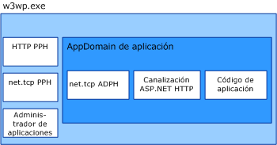

# <a name="was-activation-architecture"></a>Arquitectura de activación de WAS
Este tema detalla y discute los componentes de Windows Process Activation Service (también conocido como WAS).  
  
## <a name="activation-components"></a>Componentes de activación  
 WAS está compuesto por varios componentes arquitectónicos:  
  
-   Adaptadores de escucha. Servicios de Windows que reciben mensajes en protocolos de red concretos y se comunican con WAS para enrutar los mensajes entrantes hasta el proceso de trabajo correcto.  
  
-   WAS. El servicio de Windows que administra la creación y duración de procesos de trabajo.  
  
-   La aplicación ejecutable del proceso de trabajo genérica (w3wp.exe).  
  
-   Administrador de aplicaciones. Administra la creación y duración de dominios de aplicación que hospedan aplicaciones dentro del proceso de trabajo.  
  
-   Controladores de protocolos. Componentes específicos de protocolos que se ejecutan en el proceso de trabajo y administran la comunicación entre el proceso de trabajo y los adaptadores de escucha individuales. Existen dos tipos de controladores de protocolo: controladores de protocolo de proceso y controladores de protocolo del AppDomain.  
  
 Cuando WAS activa una instancia del proceso de trabajo, carga los controladores de protocolo de proceso requeridos en el proceso de trabajo y utiliza el administrador de aplicaciones para crear un dominio de aplicación que hospede la aplicación. El dominio de la aplicación carga el código de la aplicación así como los controladores de protocolo del AppDomain que requieren los protocolos de red utilizados por la aplicación.  
  
   
  
### <a name="listener-adapters"></a>Adaptadores de escucha  
 Los adaptadores de escucha son servicios de Windows individuales que implementan la lógica de comunicación de red utilizada para recibir mensajes mediante el protocolo de red en el que realizan escuchas. En la tabla siguiente se enumera los adaptadores de escucha para los protocolos de Windows Communication Foundation (WCF).  
  
|Nombre de servicio de adaptador de escucha|Protocolo|Notas|  
|-----------------------------------|--------------|-----------|  
|W3SVC|http|Componente común que proporciona activación HTTP para IIS 7.0 y WCF.|  
|NetTcpActivator|net.tcp|Depende del servicio NetTcpPortSharing.|  
|NetPipeActivator|net.pipe||  
|NetMsmqActivator|net.msmq|Para su uso con aplicaciones basadas en WCF Message Queue Server.|  
|NetMsmqActivator|msmq.formatname|Proporciona compatibilidad con versiones anteriores para aplicaciones existentes de Message Queuing.|  
  
 Los adaptadores de escucha para protocolos concretos se registran durante la instalación en el archivo applicationHost.config, tal y como se muestra en el siguiente XML de ejemplo.  
  
```xml  
<system.applicationHost>  
    <listenerAdapters>  
        <add name="http" />  
        <add name="net.tcp"   
          identity="S-1-5-80-3579033775-2824656752-1522793541-1960352512-462907086" />  
         <add name="net.pipe"   
           identity="S-1-5-80-2943419899-937267781-4189664001-1229628381-3982115073" />  
          <add name="net.msmq"   
            identity="S-1-5-80-89244771-1762554971-1007993102-348796144-2203111529" />  
           <add name="msmq.formatname"   
             identity="S-1-5-80-89244771-1762554971-1007993102-348796144-2203111529" />  
    </listenerAdapters>  
</system.applicationHost>  
```  
  
### <a name="protocol-handlers"></a>Controladores de protocolo  
 Los controladores de protocolo de proceso y AppDomain se registran en el archivo Web.config de nivel de equipo.  
  
```xml  
<system.web>  
   <protocols>  
      <add name="net.tcp"   
        processHandlerType=  
         "System.ServiceModel.WasHosting.TcpProcessProtocolHandler"  
        appDomainHandlerType=  
         "System.ServiceModel.WasHosting.TcpAppDomainProtocolHandler"  
        validate="false" />  
      <add name="net.pipe"   
        processHandlerType=  
         "System.ServiceModel.WasHosting.NamedPipeProcessProtocolHandler"  
          appDomainHandlerType=  
           "System.ServiceModel.WasHosting.NamedPipeAppDomainProtocolHandler"/>  
      <add name="net.msmq"  
        processHandlerType=  
         "System.ServiceModel.WasHosting.MsmqProcessProtocolHandler"  
        appDomainHandlerType=  
         "System.ServiceModel.WasHosting.MsmqAppDomainProtocolHandler"  
        validate="false" />  
   </protocols>  
</system.web>  
```  
  
## <a name="see-also"></a>Vea también  
 [Configuración de WAS para su uso con WCF](../../../../docs/framework/wcf/feature-details/configuring-the-wpa--service-for-use-with-wcf.md)  
 [Características de hospedaje de Windows Server App Fabric](https://go.microsoft.com/fwlink/?LinkId=201276)
