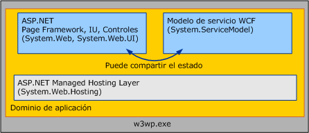

# <a name="wcf-services-and-aspnet"></a>Servicios WCF y ASP.NET
Este tema describen hospedaje Windows Communication Foundation (WCF) servicios side-by-side con ASP.NET y hospedaje de ellos en modo de compatibilidad ASP.NET.  
  
## <a name="hosting-wcf-side-by-side-with-aspnet"></a>Hospedaje de WCF en paralelo con ASP.NET  
 Se pueden encontrar con los servicios WCF hospedados en Internet Information Services (IIS). Las páginas ASPX y los servicios Web ASMX dentro de un dominio de aplicación única y común. ASP.NET proporciona servicios de infraestructura común como administración de AppDomain y compilación dinámica para WCF y el tiempo de ejecución HTTP de ASP.NET. La configuración predeterminada de WCF es en paralelo con ASP.NET.  
  
   
  
 El tiempo de ejecución HTTP de ASP.NET controla las solicitudes de ASP.NET, pero no participa en el procesamiento de solicitudes destinadas a para los servicios WCF, aunque estos servicios se hospedan en el mismo AppDomain que ASP.NET contenido. En su lugar, el modelo de servicio de WCF intercepta los mensajes dirigidos a los servicios de WCF y los enruta a través de la pila de transporte/canal WCF.  
  
 Los resultados del modelo en paralelo son de la siguiente manera:  
  
-   Servicios ASP.NET y WCF pueden compartir el estado de AppDomain. Dado que los dos marcos pueden coexistir en el mismo AppDomain, WCF también puede compartir el estado del AppDomain con ASP.NET (incluidas las variables estáticas, eventos etc.).  
  
-   Servicios WCF comportarán de forma consistente, independientemente del transporte y entorno de hospedaje. El tiempo de ejecución de HTTP de ASP.NET se acopla de manera intencionada al entorno de hospedaje de IIS/ASP.NET y a la comunicación HTTP. Por el contrario, WCF está diseñado para comportarse de forma consistente en diferentes entornos de hospedaje (WCF comporta de forma coherente tanto dentro y fuera de IIS) y transportes (un servicio hospedado en IIS 7.0 y posterior tiene un comportamiento coherente en todos los extremos que expone, incluso si algunos de esos extremos utilizan protocolos distintos de HTTP).  
  
-   Dentro de un AppDomain, las características implementadas por el tiempo de ejecución HTTP se aplican al contenido de ASP.NET pero no a WCF. Muchas características específicas de HTTP de la plataforma de aplicaciones de ASP.NET no se aplican a los servicios WCF hospedados dentro de un AppDomain que incluya contenido de ASP.NET. Ejemplos de estas características incluyen lo siguiente:  
  
    -   HttpContext: <xref:System.Web.HttpContext.Current%2A> siempre es `null` cuando se tiene acceso desde dentro de un servicio WCF. Use <!--zz <xref:System.ServiceModel.OperationContext.Current.RequestContext>--> `RequestContext` en su lugar.  
  
    -   Autorización basada en archivos: modelo de seguridad de la WCF no permite la lista de control de acceso (ACL) que se aplica al archivo .svc del servicio de hora de decidir si una solicitud de servicio está autorizada.  
  
    -   Autorización de dirección URL basada en configuración: de forma similar, el modelo de seguridad WCF no se adhiere a las reglas de autorización basada en URL especificadas en System.Web \<autorización > elemento de configuración. Estos valores se omiten para las solicitudes WCF si un servicio reside en un espacio de direcciones URL protegido por ASP. Reglas de autorización de dirección URL de NET.  
  
    -   Extensibilidad de HttpModule: infraestructura de hospedaje de WCF la intercepta WCF solicita cuando la <xref:System.Web.HttpApplication.PostAuthenticateRequest> evento se produce y no se devuelve el procesamiento a la canalización HTTP de ASP.NET. Módulos que están codificados para interceptar las solicitudes en fases posteriores de la canalización no interceptan las solicitudes WCF.  
  
    -   Suplantación de ASP.NET: de forma predeterminada, WCF solicita siempre se ejecuta como el proceso IIS identidad, aun cuando ASP.NET se configura para permitir la suplantación mediante System.Web \<identity impersonate = "true" / > opción de configuración.  
  
 Estas restricciones se aplican sólo a los servicios WCF hospedados en aplicación de IIS. El comportamiento del contenido de ASP.NET no se ve afectado por la presencia de WCF.  
  
 Las aplicaciones WCF que requieren la funcionalidad que proporciona tradicionalmente la canalización HTTP convendrá usar los equivalentes WCF, que dependen del host ni del transporte:  
  
-   <xref:System.ServiceModel.OperationContext> en lugar de <xref:System.Web.HttpContext>.  
  
-   <xref:System.ServiceModel.Description.ServiceAuthorizationBehavior> en lugar de la autorización de archivo/URL de ASP.NET.  
  
-   <xref:System.ServiceModel.Dispatcher.IDispatchMessageInspector> o los canales dispuestos en capas personalizados en lugar de los módulos HTTP.  
  
-   Suplantación de cada operación con WCF en lugar de suplantación de System.Web.  
  
 Como alternativa, puede considerar ejecutar sus servicios en modo de compatibilidad ASP.NET de WCF.  
  
## <a name="hosting-wcf-services-in-aspnet-compatibility-mode"></a>Hospedaje de servicios de WCF en el modo de compatibilidad de ASP.NET  
 Aunque el modelo de WCF está diseñado para comportarse de forma coherente en entornos de hospedaje y transportes, a menudo existen escenarios donde una aplicación no requiere este grado de flexibilidad. Modo de compatibilidad ASP.NET de WCF es adecuado para escenarios que no requieren la capacidad de hospedar fuera de IIS o para comunicarse a través de protocolos distintos de HTTP, pero que usan todas las características de la plataforma de aplicación Web de ASP.NET.  
  
 A diferencia de la configuración en paralelo predeterminada, donde la infraestructura de hospedaje de WCF intercepta los mensajes WCF y los enruta fuera de la canalización HTTP, servicios WCF que se ejecutan en modo de compatibilidad de ASP.NET participan totalmente en el ciclo de vida de la solicitud HTTP de ASP.NET. En el modo de compatibilidad, los servicios de WCF utilizan la canalización HTTP a través de un <xref:System.Web.IHttpHandler> implementación, similar a las solicitudes de manera para que se administran las páginas ASPX y servicios Web ASMX. Como resultado, WCF se comporta de forma idéntica a ASMX con respecto a las siguientes características ASP.NET:  
  
-   <xref:System.Web.HttpContext>: Pueden tener acceso servicios WCF que se ejecutan en modo de compatibilidad de ASP.NET <xref:System.Web.HttpContext.Current%2A> y su estado asociado.  
  
-   Autorización basada en archivos: servicios WCF que se ejecutan en modo de compatibilidad ASP.NET pueden ser seguros mediante una asociación de listas de control de acceso de sistema de archivos (ACL) para el archivo .svc del servicio.  
  
-   Autorización de URL configurable: ASP. Cuando el servicio WCF se ejecuta en modo de compatibilidad de ASP.NET, se aplican las reglas de autorización de dirección URL de NET para las solicitudes WCF.  
  
-   <xref:System.Web.HttpModuleCollection> extensibilidad: servicios porque WCF que se ejecutan en modo de compatibilidad de ASP.NET participan totalmente en el ciclo de vida de la solicitud HTTP de ASP.NET, cualquier módulo HTTP configurado en la canalización HTTP puede funcionar en solicitudes de WCF antes y después de la invocación de servicios.  
  
-   Suplantación de ASP.NET: Servicios WCF que se ejecutan utilizando la identidad actual de ASP.NET suplantado subproceso, que puede ser diferente de la identidad de proceso IIS si se ha habilitado la suplantación de ASP.NET para la aplicación. Si la suplantación de ASP.NET y la suplantación de WCF están habilitadas para una operación de servicio determinado, la implementación del servicio se ejecuta finalmente utilizando la identidad obtenida de WCF.  
  
 Modo de compatibilidad ASP.NET de WCF está habilitado en el nivel de aplicación a través de la configuración siguiente (que se encuentra en el archivo Web.config de la aplicación):  
  
```xml  
<system.serviceModel>  
    <serviceHostingEnvironment aspNetCompatibilityEnabled="true" />  
</system.serviceModel>  
```  
  
 El valor predeterminado es "`true`" Si no se especifica. Establecer este valor en "`false`" indica que todos los servicios WCF que se ejecutan en la aplicación no se ejecutarán en modo de compatibilidad de ASP.NET.  
  
 Dado que el modo de compatibilidad de ASP.NET implica una semántica de procesamiento de solicitudes que son fundamentalmente diferente del valor predeterminado WCF, implementaciones de servicios individuales tienen la capacidad para controlar si se ejecutan dentro de una aplicación para que ASP.NET Se habilitó el modo de compatibilidad. Los servicios pueden utilizar el <xref:System.ServiceModel.Activation.AspNetCompatibilityRequirementsAttribute> para indicar si admiten el modo de compatibilidad de ASP.NET. El valor predeterminado para este atributo es <xref:System.ServiceModel.Activation.AspNetCompatibilityRequirementsMode.Allowed>.  
  
 `[AspNetCompatibilityRequirements(RequirementsMode = AspNetCompatibilityRequirementsMode.Allowed)]`  
  
 `public class CalculatorService : ICalculatorSession`  
  
 `{//Implement calculator service methods.}`  
  
 La siguiente tabla muestra cómo el valor del modo de compatibilidad de toda la aplicación interactúa con el nivel expresado de compatibilidad del servicio individual:  
  
|Valor de modo de compatibilidad de la aplicación|[AspNetCompatibilityRequirementsMode]<br /><br /> Parámetro|Resultado observado|  
|--------------------------------------------------|---------------------------------------------------------|---------------------|  
|aspNetCompatibilityEnabled = "`true`"|<xref:System.ServiceModel.Activation.AspNetCompatibilityRequirementsMode.Required>|El servicio se activa correctamente.|  
|aspNetCompatibilityEnabled = "`true`"|<xref:System.ServiceModel.Activation.AspNetCompatibilityRequirementsMode.Allowed>|El servicio se activa correctamente.|  
|aspNetCompatibilityEnabled = "`true`"|<xref:System.ServiceModel.Activation.AspNetCompatibilityRequirementsMode.NotAllowed>|Se produce un error de activación cuando el servicio recibe un mensaje.|  
|aspNetCompatibilityEnabled = "`false`"|<xref:System.ServiceModel.Activation.AspNetCompatibilityRequirementsMode.Required>|Se produce un error de activación cuando el servicio recibe un mensaje.|  
|aspNetCompatibilityEnabled = "`false`"|<xref:System.ServiceModel.Activation.AspNetCompatibilityRequirementsMode.Allowed>|El servicio se activa correctamente.|  
|aspNetCompatibilityEnabled = "`false`"|<xref:System.ServiceModel.Activation.AspNetCompatibilityRequirementsMode.NotAllowed>|El servicio se activa correctamente.|  
  
> [!NOTE]
>  IIS 7.0 y WAS permite a los servicios WCF para comunicarse a través de protocolos distintos de HTTP. Sin embargo, los servicios WCF que se ejecutan en aplicaciones que se han habilitado el modo de compatibilidad ASP.NET no se permiten para exponer los extremos no HTTP. Este tipo de configuración genera una excepción de activación cuando el servicio recibe su primer mensaje.  
  
 Para obtener más información acerca de cómo habilitar el modo de compatibilidad ASP.NET para los servicios WCF, vea <xref:System.ServiceModel.Activation.AspNetCompatibilityRequirementsMode> y [compatibilidad de ASP.NET](../../../../docs/framework/wcf/samples/aspnet-compatibility.md) ejemplo.  
  
## <a name="see-also"></a>Vea también  
 <xref:System.ServiceModel.Activation.AspNetCompatibilityRequirementsAttribute>  
 [Características de hospedaje de Windows Server App Fabric](http://go.microsoft.com/fwlink/?LinkId=201276)
