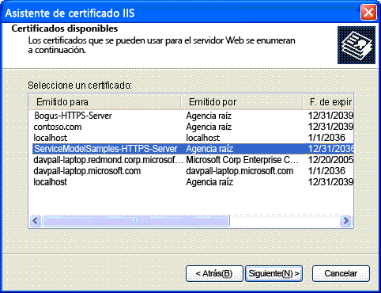

# <a name="internet-information-services-iis-server-certificate-installation-instructions"></a><span data-ttu-id="77639-103">Instrucciones de instalación del certificado de servidor de Internet Information Services (IIS)</span><span class="sxs-lookup"><span data-stu-id="77639-103">Internet Information Services (IIS) Server Certificate Installation Instructions</span></span>

<span data-ttu-id="77639-104">Para ejecutar los ejemplos que se comunican de forma segura con Internet Information Services (IIS), debe crear e instalar un certificado de servidor.</span><span class="sxs-lookup"><span data-stu-id="77639-104">To run the samples that securely communicate with Internet Information Services (IIS), you must create and install a server certificate.</span></span>  
  
## <a name="step-1-creating-certificates"></a><span data-ttu-id="77639-105">Paso 1.</span><span class="sxs-lookup"><span data-stu-id="77639-105">Step 1.</span></span> <span data-ttu-id="77639-106">Crear certificados</span><span class="sxs-lookup"><span data-stu-id="77639-106">Creating Certificates</span></span>  

 <span data-ttu-id="77639-107">Para crear un certificado para el equipo, abra una Símbolo del sistema para desarrolladores para Visual Studio con privilegios de administrador y ejecute el Setup.bat que se incluye en cada uno de los ejemplos que utilizan la comunicación segura con IIS.</span><span class="sxs-lookup"><span data-stu-id="77639-107">To create a certificate for your computer, open a Developer Command Prompt for Visual Studio with administrator privileges and run the Setup.bat that is included in each of the samples that use secure communication with IIS.</span></span> <span data-ttu-id="77639-108">Asegúrese de que la ruta de acceso incluye la carpeta que contiene makecert.exe antes de ejecutar este archivo por lotes.</span><span class="sxs-lookup"><span data-stu-id="77639-108">Ensure that the path includes the folder that contains Makecert.exe before you run this batch file.</span></span> <span data-ttu-id="77639-109">El siguiente comando se utiliza para crear el certificado en Setup.bat.</span><span class="sxs-lookup"><span data-stu-id="77639-109">The following command is used to create the certificate in Setup.bat.</span></span>  
  
```console  
makecert -sr LocalMachine -ss My -n CN=ServiceModelSamples-HTTPS-Server -sky exchange -sk ServiceModelSamples-HTTPS-Key  
```  
  
## <a name="step-2-installing-certificates"></a><span data-ttu-id="77639-110">Paso 2.</span><span class="sxs-lookup"><span data-stu-id="77639-110">Step 2.</span></span> <span data-ttu-id="77639-111">Instalar certificados</span><span class="sxs-lookup"><span data-stu-id="77639-111">Installing Certificates</span></span>  

 <span data-ttu-id="77639-112">Los pasos requeridos para instalar los certificados que acaba de crear dependen de la versión de IIS que está utilizando.</span><span class="sxs-lookup"><span data-stu-id="77639-112">The steps required to install the certificates you just created depend on which version of IIS you are using.</span></span>  
  
#### <a name="to-install-iis-on-iis-51-windows-xp-and-iis-60-windows-server-2003"></a><span data-ttu-id="77639-113">Para instalar IIS en IIS 5.1 (Windows XP) e IIS 6.0 (Windows Server 2003)</span><span class="sxs-lookup"><span data-stu-id="77639-113">To install IIS on IIS 5.1 (Windows XP) and IIS 6.0 (Windows Server 2003)</span></span>  
  
1. <span data-ttu-id="77639-114">Abra el complemento MMC del administrador de Internet Information Services.</span><span class="sxs-lookup"><span data-stu-id="77639-114">Open the Internet Information Services Manager MMC Snap-In.</span></span>  
  
2. <span data-ttu-id="77639-115">Haga clic con el botón secundario en el sitio web predeterminado y seleccione **propiedades**.</span><span class="sxs-lookup"><span data-stu-id="77639-115">Right-click the default Web site and select **Properties**.</span></span>  
  
3. <span data-ttu-id="77639-116">Seleccione la pestaña **seguridad de directorios** .</span><span class="sxs-lookup"><span data-stu-id="77639-116">Select the **Directory Security** tab.</span></span>  
  
4. <span data-ttu-id="77639-117">Haga clic en el botón **certificado de servidor** .</span><span class="sxs-lookup"><span data-stu-id="77639-117">Click the **Server Certificate** button.</span></span> <span data-ttu-id="77639-118">Se inicia el Asistente para certificados de servidor web.</span><span class="sxs-lookup"><span data-stu-id="77639-118">The Web Server Certificate Wizard starts.</span></span>  
  
5. <span data-ttu-id="77639-119">Complete el asistente.</span><span class="sxs-lookup"><span data-stu-id="77639-119">Complete the wizard.</span></span> <span data-ttu-id="77639-120">Seleccione la opción para asignar un certificado.</span><span class="sxs-lookup"><span data-stu-id="77639-120">Select the option to assign a certificate.</span></span> <span data-ttu-id="77639-121">Seleccione el certificado ServiceModelSamples-HTTPS-Server de la lista de certificados que se muestran.</span><span class="sxs-lookup"><span data-stu-id="77639-121">Select the ServiceModelSamples-HTTPS-Server certificate from the list of certificates that are displayed.</span></span>  
  
     <span data-ttu-id="77639-122"></span><span class="sxs-lookup"><span data-stu-id="77639-122"></span></span>  
  
6. <span data-ttu-id="77639-123">Pruebe el acceso al servicio en un explorador mediante la dirección HTTPS `https://localhost/servicemodelsamples/service.svc` .</span><span class="sxs-lookup"><span data-stu-id="77639-123">Test access to the service in a browser by using the HTTPS address `https://localhost/servicemodelsamples/service.svc`.</span></span>  
  
#### <a name="if-ssl-was-previously-configured-by-using-httpcfgexe"></a><span data-ttu-id="77639-124">Si SSL se configuró previamente utilizando httpcfg.exe</span><span class="sxs-lookup"><span data-stu-id="77639-124">If SSL was previously configured by using Httpcfg.exe</span></span>  
  
1. <span data-ttu-id="77639-125">Utilice makecert.exe (o ejecute setup.bat) para crear el certificado de servidor.</span><span class="sxs-lookup"><span data-stu-id="77639-125">Use Makecert.exe (or run Setup.bat) to create the server certificate.</span></span>  
  
2. <span data-ttu-id="77639-126">Ejecute el Administrador de IIS e instale el certificado según los pasos anteriores.</span><span class="sxs-lookup"><span data-stu-id="77639-126">Run the IIS manager and install the certificate according to the previous steps.</span></span>  
  
3. <span data-ttu-id="77639-127">Agregue la línea siguiente de código al programa cliente:</span><span class="sxs-lookup"><span data-stu-id="77639-127">Add the following line of code to the client program.</span></span>  
  
> [!IMPORTANT]
> <span data-ttu-id="77639-128">Este código solo se requiere para los certificados de prueba como los creados por makecert.exe.</span><span class="sxs-lookup"><span data-stu-id="77639-128">This code is only required for test certificates such as those created by Makecert.exe.</span></span> <span data-ttu-id="77639-129">No se recomienda para el código de producción.</span><span class="sxs-lookup"><span data-stu-id="77639-129">It is not recommended for production code.</span></span>  
  
```csharp  
PermissiveCertificatePolicy.Enact("CN=ServiceModelSamples-HTTPS-Server");  
```  
  
#### <a name="to-install-iis-on-iis-70-windows-vista-and-windows-server-2008"></a><span data-ttu-id="77639-130">Para instalar IIS en IIS 7.0 (Windows Vista y Windows Server 2008)</span><span class="sxs-lookup"><span data-stu-id="77639-130">To install IIS on IIS 7.0 (Windows Vista and Windows Server 2008)</span></span>  
  
1. <span data-ttu-id="77639-131">En el menú **Inicio** , haga clic en **Ejecutar** y, a continuación, escriba **inetmgr** para abrir el complemento MMC de Internet Information Services (IIS).</span><span class="sxs-lookup"><span data-stu-id="77639-131">From the **Start** menu, click **Run**, then type **inetmgr** to open the Internet Information Services (IIS) MMC snap-in.</span></span>  
  
2. <span data-ttu-id="77639-132">Haga clic con el botón secundario en el **sitio web predeterminado** y seleccione **Editar enlaces..** .</span><span class="sxs-lookup"><span data-stu-id="77639-132">Right-click the **Default Web Site** and select **Edit Bindings…**</span></span>  
  
3. <span data-ttu-id="77639-133">Haga clic en el botón **Agregar** del cuadro de diálogo **enlaces de sitios** .</span><span class="sxs-lookup"><span data-stu-id="77639-133">Click the **Add** button of the **Site Bindings** dialog box.</span></span>  
  
4. <span data-ttu-id="77639-134">Seleccione **https** en la lista desplegable **tipo** .</span><span class="sxs-lookup"><span data-stu-id="77639-134">Select **HTTPS** from the **Type** drop-down list.</span></span>  
  
5. <span data-ttu-id="77639-135">Seleccione **ServiceModelSamples-https-Server** en la lista desplegable **certificado SSL** y haga clic en **Aceptar**.</span><span class="sxs-lookup"><span data-stu-id="77639-135">Select the **ServiceModelSamples-HTTPS-Server** from the **SSL certificate** drop-down list and click **OK**.</span></span>  
  
6. <span data-ttu-id="77639-136">Pruebe el acceso al servicio en un explorador mediante la dirección HTTPS `https://localhost/servicemodelsamples/service.svc` .</span><span class="sxs-lookup"><span data-stu-id="77639-136">Test access to the service in a browser by using the HTTPS address `https://localhost/servicemodelsamples/service.svc`.</span></span>  
  
> [!NOTE]
> <span data-ttu-id="77639-137">Dado que el certificado de prueba que acaba de instalar no es un certificado de confianza, puede encontrar advertencias de seguridad de Internet Explorer adicionales al ir a las direcciones web locales protegidas con este certificado.</span><span class="sxs-lookup"><span data-stu-id="77639-137">Because the test certificate you have just installed is not a trusted certificate, you may encounter additional Internet Explorer security warnings when browsing to local Web addresses secured with this certificate.</span></span>  
  
## <a name="removing-certificates"></a><span data-ttu-id="77639-138">Quitar Certificados</span><span class="sxs-lookup"><span data-stu-id="77639-138">Removing Certificates</span></span>  
  
- <span data-ttu-id="77639-139">Utilice el Administrador de Internet Information Services según las instrucciones anteriores, pero quite el certificado o enlace en lugar de agregarlo.</span><span class="sxs-lookup"><span data-stu-id="77639-139">Use the Internet Information Services Manager as previously directed, but remove the certificate or binding instead of adding it.</span></span>  
  
- <span data-ttu-id="77639-140">Quite el certificado de equipo utilizando el comando siguiente.</span><span class="sxs-lookup"><span data-stu-id="77639-140">Remove the computer certificate by using the following command.</span></span>  
  
    ```console  
    httpcfg delete ssl -i 0.0.0.0:443  
    ```
