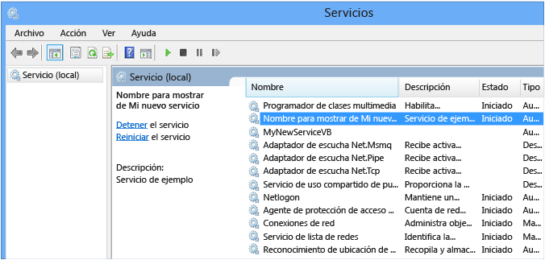

# <a name="tutorial-create-a-windows-service-app"></a>Tutorial: Creación de una aplicación de servicio de Windows

En este artículo se explica cómo crear una aplicación de servicio de Windows en Visual Studio que escribe mensajes en un registro de eventos.

## <a name="create-a-service"></a>Creación de un servicio

Para empezar, cree el proyecto y defina los valores necesarios para que el servicio funcione correctamente.

1. En el menú **Archivo** de Visual Studio, seleccione **Nuevo** > **Proyecto** (o presione **CTRL**+**Mayús**+**N**) para abrir la ventana **Nuevo proyecto**.

2. Vaya a la plantilla de proyecto **Windows Service (.NET Framework)** [Servicio de Windows (.NET Framework)] y selecciónela. Para encontrarla, expanda **Instalado** y **Visual C#**  o **Visual Basic**. Después, seleccione **Escritorio de Windows**. También puede escribir *Servicio de Windows* en el cuadro de búsqueda en la esquina superior derecha y presionar **ENTRAR**.

   

   > [!NOTE]
   > Si no ve la plantilla **Servicio de Windows**, puede que tenga que instalar la carga de trabajo **Desarrollo de escritorio de .NET**:
   >
   > En el cuadro de diálogo **Nuevo proyecto**, seleccione **Abrir el Instalador de Visual Studio** en la parte inferior izquierda. Elija la carga de trabajo **Desarrollo de escritorio de .NET** y seleccione **Modificar**.

3. En **Nombre**, escriba *MyNewService* y haga clic en **Aceptar**.

   Aparecerá la pestaña **Diseño** (**Service1.cs [Diseño]** o **Service1.vb [Diseño]** ).

   La plantilla de proyecto incluye una clase de componente denominada `Service1`, que hereda de <xref:System.ServiceProcess.ServiceBase?displayProperty=nameWithType>. Incluye gran parte del código de servicio básico, como el código para iniciar el servicio.

## <a name="rename-the-service"></a>Cambiar el nombre del servicio

Cambie el nombre del servicio **Service1** por **MyNewService**.

1. En el **Explorador de soluciones**, elija **Service1.cs** o **Service1.vb** y seleccione **Cambiar nombre** en el menú contextual. Cambie el nombre del archivo a **MyNewService.cs** o **MyNewService.vb** y presione **ENTRAR**.

    Aparecerá una ventana emergente en la que se le pregunta si quiere cambiar el nombre de todas las referencias al elemento de código *Service1*.

2. En la ventana emergente, seleccione **Sí**.

    

3. En la pestaña **Diseño**, seleccione **Propiedades** en el menú contextual. En la ventana **Propiedades**, cambie el valor **ServiceName** a *MyNewService*.

    

4. Seleccione **Guardar todo** en el menú **Archivo**.

## <a name="add-features-to-the-service"></a>Adición de características al servicio

En esta sección, agregará un registro de eventos personalizado al servicio de Windows. El componente <xref:System.Diagnostics.EventLog> es un ejemplo del tipo de componente que se puede agregar a un servicio de Windows.

### <a name="add-custom-event-log-functionality"></a>Adición de la funcionalidad de registro de eventos personalizado

1. En el **Explorador de soluciones**, en el menú contextual de **MyNewService.cs** o **MyNewService.vb**, elija **Diseñador de vistas**.

2. En el **Cuadro de herramientas**, expanda **Componentes** y arrastre el componente **EventLog** a la pestaña **Service1.cs [Diseño]** o  **Service1.vb [Diseño]** .

3. En el **Explorador de soluciones**, en el menú contextual de **MyNewService.cs** o **MyNewService.vb**, elija **Ver código**.

4. Defina un registro de eventos personalizado. Para C#, edite el constructor `MyNewService()` existente; para Visual Basic, agregue el constructor `New()`:

   [!code-csharp[VbRadconService#2](../../../samples/snippets/csharp/VS_Snippets_VBCSharp/VbRadconService/CS/MyNewService.cs#2)]
   [!code-vb[VbRadconService#2](../../../samples/snippets/visualbasic/VS_Snippets_VBCSharp/VbRadconService/VB/MyNewService.vb#2)]

5. Agregue una instrucción `using` a **MyNewService.cs** (si no existe) o una instrucción `Imports` a **MyNewService.vb** para el espacio de nombres <xref:System.Diagnostics?displayProperty=nameWithType>:

    ```csharp
    using System.Diagnostics;
    ```

    ```vb
    Imports System.Diagnostics
    ```

6. Seleccione **Guardar todo** en el menú **Archivo**.

### <a name="define-what-occurs-when-the-service-starts"></a>Definición de qué ocurre al iniciar el servicio

En el editor de código para **MyNewService.cs** o **MyNewService.vb**, busque el método <xref:System.ServiceProcess.ServiceBase.OnStart%2A> (Visual Studio creó automáticamente una definición de método vacía al crear el proyecto). Agregue código que escriba una entrada en el registro de eventos cuando el servicio se inicia:

[!code-csharp[VbRadconService#3](../../../samples/snippets/csharp/VS_Snippets_VBCSharp/VbRadconService/CS/MyNewService.cs#3)]
[!code-vb[VbRadconService#3](../../../samples/snippets/visualbasic/VS_Snippets_VBCSharp/VbRadconService/VB/MyNewService.vb#3)]

#### <a name="polling"></a>Sondeo

Dado que una aplicación de servicio está diseñada para ejecutarse a largo plazo, suele sondear o supervisar el sistema, que se estableció en el método <xref:System.ServiceProcess.ServiceBase.OnStart%2A>. El método `OnStart` debe volver al sistema operativo después de que haya comenzado el funcionamiento del servicio, a fin de que el sistema no se bloquee.

Para establecer un mecanismo de sondeo sencillo, use el componente <xref:System.Timers.Timer?displayProperty=nameWithType>. El temporizador genera un evento <xref:System.Timers.Timer.Elapsed> a intervalos regulares, momento en el que el servicio puede realizar la supervisión. Use el componente <xref:System.Timers.Timer> como se indica a continuación:

- Establezca las propiedades del componente <xref:System.Timers.Timer> en el método `MyNewService.OnStart`.
- Inicie el temporizador mediante una llamada al método <xref:System.Timers.Timer.Start%2A>.

##### <a name="set-up-the-polling-mechanism"></a>Establezca el mecanismo de sondeo.

1. Agregue el código siguiente en el evento `MyNewService.OnStart` para configurar el mecanismo de sondeo:

   ```csharp
   // Set up a timer that triggers every minute.
   Timer timer = new Timer();
   timer.Interval = 60000; // 60 seconds
   timer.Elapsed += new ElapsedEventHandler(this.OnTimer);
   timer.Start();
   ```

   ```vb
   ' Set up a timer that triggers every minute.
   Dim timer As Timer = New Timer()
   timer.Interval = 60000 ' 60 seconds
   AddHandler timer.Elapsed, AddressOf Me.OnTimer
   timer.Start()
   ```

2. Agregue una instrucción `using` a **MyNewService.cs** o una instrucción `Imports` a **MyNewService.vb** para el espacio de nombres <xref:System.Timers?displayProperty=nameWithType>:

   ```csharp
   using System.Timers;
   ```

   ```vb
   Imports System.Timers
   ```

3. En la clase `MyNewService`, agregue el método `OnTimer` para controlar el evento <xref:System.Timers.Timer.Elapsed?displayProperty=nameWithType>:

   ```csharp
   public void OnTimer(object sender, ElapsedEventArgs args)
   {
       // TODO: Insert monitoring activities here.
       eventLog1.WriteEntry("Monitoring the System", EventLogEntryType.Information, eventId++);
   }
   ```

   ```vb
   Private Sub OnTimer(sender As Object, e As Timers.ElapsedEventArgs)
      ' TODO: Insert monitoring activities here.
      eventLog1.WriteEntry("Monitoring the System", EventLogEntryType.Information, eventId)
      eventId = eventId + 1
   End Sub
   ```

4. En la clase `MyNewService`, agregue una variable de miembro. Contiene el identificador del siguiente evento para escribir en el registro de eventos:

   ```csharp
   private int eventId = 1;
   ```

   ```vb
   Private eventId As Integer = 1
   ```

En lugar de ejecutar todo el trabajo en el subproceso principal, puede ejecutar las tareas mediante el uso de subprocesos de trabajo en segundo plano. Para obtener más información, vea <xref:System.ComponentModel.BackgroundWorker?displayProperty=fullName>.

### <a name="define-what-occurs-when-the-service-is-stopped"></a>Definición de qué ocurre al detener el servicio

Inserte una línea de código en el método <xref:System.ServiceProcess.ServiceBase.OnStop%2A> que agregue una entrada al registro de eventos cuando el servicio se detenga:

[!code-csharp[VbRadconService#2](../../../samples/snippets/csharp/VS_Snippets_VBCSharp/VbRadconService/CS/MyNewService.cs#4)]
[!code-vb[VbRadconService#4](../../../samples/snippets/visualbasic/VS_Snippets_VBCSharp/VbRadconService/VB/MyNewService.vb#4)]

### <a name="define-other-actions-for-the-service"></a>Definición de otras acciones para el servicio

Puede invalidar los métodos <xref:System.ServiceProcess.ServiceBase.OnPause%2A>, <xref:System.ServiceProcess.ServiceBase.OnContinue%2A> y <xref:System.ServiceProcess.ServiceBase.OnShutdown%2A> para definir un procesamiento adicional para el componente.

En el siguiente código se muestra cómo reemplazar el método <xref:System.ServiceProcess.ServiceBase.OnContinue%2A> en la clase `MyNewService`:

[!code-csharp[VbRadconService#5](../../../samples/snippets/csharp/VS_Snippets_VBCSharp/VbRadconService/CS/MyNewService.cs#5)]
[!code-vb[VbRadconService#5](../../../samples/snippets/visualbasic/VS_Snippets_VBCSharp/VbRadconService/VB/MyNewService.vb#5)]

## <a name="set-service-status"></a>Definición del estado de servicio

Los servicios informan de su estado al [Administrador de control de servicios](/windows/desktop/Services/service-control-manager) para que los usuarios puedan saber si un servicio funciona correctamente. De forma predeterminada, un servicio que hereda de <xref:System.ServiceProcess.ServiceBase> notifica un conjunto limitado de opciones de estado, entre las que se incluyen SERVICE_STOPPED, SERVICE_PAUSED y SERVICE_RUNNING. Si un servicio tarda un poco en iniciarse, es útil informar de un estado SERVICE_START_PENDING.

Puede implementar las opciones de estado SERVICE_START_PENDING y SERVICE_STOP_PENDING si agrega código que llama a la función [SetServiceStatus](/windows/desktop/api/winsvc/nf-winsvc-setservicestatus) de Windows.

### <a name="implement-service-pending-status"></a>Implementación del estado pendiente del servicio

1. Agregue una instrucción `using` a **MyNewService.cs** o una instrucción `Imports` a **MyNewService.vb** para el espacio de nombres <xref:System.Runtime.InteropServices?displayProperty=nameWithType>:

    ```csharp
    using System.Runtime.InteropServices;
    ```

    ```vb
    Imports System.Runtime.InteropServices
    ```

2. Agregue el código siguiente a **MyNewService.cs** o **MyNewService.vb** para declarar los valores de `ServiceState` y para agregar una estructura para el estado, que usará en una llamada de invocación de plataforma:

    ```csharp
    public enum ServiceState
    {
        SERVICE_STOPPED = 0x00000001,
        SERVICE_START_PENDING = 0x00000002,
        SERVICE_STOP_PENDING = 0x00000003,
        SERVICE_RUNNING = 0x00000004,
        SERVICE_CONTINUE_PENDING = 0x00000005,
        SERVICE_PAUSE_PENDING = 0x00000006,
        SERVICE_PAUSED = 0x00000007,
    }

    [StructLayout(LayoutKind.Sequential)]
    public struct ServiceStatus
    {
        public int dwServiceType;
        public ServiceState dwCurrentState;
        public int dwControlsAccepted;
        public int dwWin32ExitCode;
        public int dwServiceSpecificExitCode;
        public int dwCheckPoint;
        public int dwWaitHint;
    };
    ```

    ```vb
    Public Enum ServiceState
        SERVICE_STOPPED = 1
        SERVICE_START_PENDING = 2
        SERVICE_STOP_PENDING = 3
        SERVICE_RUNNING = 4
        SERVICE_CONTINUE_PENDING = 5
        SERVICE_PAUSE_PENDING = 6
        SERVICE_PAUSED = 7
    End Enum

    <StructLayout(LayoutKind.Sequential)>
    Public Structure ServiceStatus
        Public dwServiceType As Long
        Public dwCurrentState As ServiceState
        Public dwControlsAccepted As Long
        Public dwWin32ExitCode As Long
        Public dwServiceSpecificExitCode As Long
        Public dwCheckPoint As Long
        Public dwWaitHint As Long
    End Structure
    ```

    > [!NOTE]
    > El Administrador de control de servicios usa los miembros `dwWaitHint` y `dwCheckpoint` de la [estructura SERVICE_STATUS](/windows/win32/api/winsvc/ns-winsvc-service_status) para determinar durante cuánto tiempo hay que esperar a que un servicio de Windows se inicie o apague. Si los métodos `OnStart` y `OnStop` se ejecutan durante mucho tiempo, el servicio puede solicitar más tiempo por medio de una nueva llamada a `SetServiceStatus` con un valor de `dwCheckPoint` incrementado.

3. En la clase `MyNewService`, declare la [función SetServiceStatus](/windows/desktop/api/winsvc/nf-winsvc-setservicestatus) mediante la [invocación de plataforma](../interop/consuming-unmanaged-dll-functions.md):

    ```csharp
    [DllImport("advapi32.dll", SetLastError = true)]
    private static extern bool SetServiceStatus(System.IntPtr handle, ref ServiceStatus serviceStatus);
    ```

    ```vb
    Declare Auto Function SetServiceStatus Lib "advapi32.dll" (ByVal handle As IntPtr, ByRef serviceStatus As ServiceStatus) As Boolean
    ```

4. Para implementar el estado SERVICE_START_PENDING, agregue el código siguiente al principio del método <xref:System.ServiceProcess.ServiceBase.OnStart%2A>:

    ```csharp
    // Update the service state to Start Pending.
    ServiceStatus serviceStatus = new ServiceStatus();
    serviceStatus.dwCurrentState = ServiceState.SERVICE_START_PENDING;
    serviceStatus.dwWaitHint = 100000;
    SetServiceStatus(this.ServiceHandle, ref serviceStatus);
    ```

    ```vb
    ' Update the service state to Start Pending.
    Dim serviceStatus As ServiceStatus = New ServiceStatus()
    serviceStatus.dwCurrentState = ServiceState.SERVICE_START_PENDING
    serviceStatus.dwWaitHint = 100000
    SetServiceStatus(Me.ServiceHandle, serviceStatus)
    ```

5. Agregue código al final del método `OnStart` para establecer el estado en SERVICE_RUNNING:

    ```csharp
    // Update the service state to Running.
    serviceStatus.dwCurrentState = ServiceState.SERVICE_RUNNING;
    SetServiceStatus(this.ServiceHandle, ref serviceStatus);
    ```

    ```vb
    ' Update the service state to Running.
    serviceStatus.dwCurrentState = ServiceState.SERVICE_RUNNING
    SetServiceStatus(Me.ServiceHandle, serviceStatus)
    ```

6. (Opcional) Si <xref:System.ServiceProcess.ServiceBase.OnStop%2A> es un método de ejecución prolongada, repita este procedimiento en el método `OnStop`. Implemente el estado SERVICE_STOP_PENDING y devuelva el estado SERVICE_STOPPED antes de que finalice el método `OnStop`.

   Por ejemplo:

    ```csharp
    // Update the service state to Stop Pending.
    ServiceStatus serviceStatus = new ServiceStatus();
    serviceStatus.dwCurrentState = ServiceState.SERVICE_STOP_PENDING;
    serviceStatus.dwWaitHint = 100000;
    SetServiceStatus(this.ServiceHandle, ref serviceStatus);

    // Update the service state to Stopped.
    serviceStatus.dwCurrentState = ServiceState.SERVICE_STOPPED;
    SetServiceStatus(this.ServiceHandle, ref serviceStatus);
    ```

    ```vb
    ' Update the service state to Stop Pending.
    Dim serviceStatus As ServiceStatus = New ServiceStatus()
    serviceStatus.dwCurrentState = ServiceState.SERVICE_STOP_PENDING
    serviceStatus.dwWaitHint = 100000
    SetServiceStatus(Me.ServiceHandle, serviceStatus)

    ' Update the service state to Stopped.
    serviceStatus.dwCurrentState = ServiceState.SERVICE_STOPPED
    SetServiceStatus(Me.ServiceHandle, serviceStatus)
    ```

## <a name="add-installers-to-the-service"></a>Adición de instaladores al servicio

Para poder ejecutar un servicio de Windows, antes debe instalarlo, lo que lo registra con el Administrador de control de servicios. Agregue instaladores al proyecto que controlen los detalles del registro.

1. En el **Explorador de soluciones**, en el menú contextual de **MyNewService.cs** o **MyNewService.vb**, elija **Diseñador de vistas**.

2. En la vista **Diseño**, seleccione el área de fondo y, después, elija **Agregar instalador** en el menú contextual.

     De forma predeterminada, Visual Studio agrega al proyecto una clase de componente denominada `ProjectInstaller`, que contiene dos instaladores. Estos instaladores son para el servicio y para el proceso asociado al servicio.

3. En la vista **Diseño** de **ProjectInstaller**, seleccione **serviceInstaller1** para un proyecto de Visual C# o **ServiceInstaller1** para un proyecto de Visual Basic. Después, seleccione **Propiedades** en el menú contextual.

4. En la ventana **Propiedades**, compruebe que la propiedad <xref:System.ServiceProcess.ServiceInstaller.ServiceName%2A> esté establecida en **MyNewService**.

5. Agregue texto a la propiedad <xref:System.ServiceProcess.ServiceInstaller.Description%2A>, como *Servicio de ejemplo*.

     Este texto aparece en la columna **Descripción** de la ventana **Servicios** y describe el servicio al usuario.

    

6. Agregue texto a la propiedad <xref:System.ServiceProcess.ServiceInstaller.DisplayName%2A>. Por ejemplo, *Nombre para mostrar de MyNewService*.

     Este texto aparece en la columna **Nombre para mostrar** de la ventana **Servicios**. Este nombre puede ser diferente de la propiedad <xref:System.ServiceProcess.ServiceInstaller.ServiceName%2A>, que es el nombre usado por el sistema (por ejemplo, el nombre que usa en el comando `net start` para iniciar el servicio).

7. Establezca la propiedad <xref:System.ServiceProcess.ServiceInstaller.StartType%2A> en <xref:System.ServiceProcess.ServiceStartMode.Automatic> en la lista desplegable.

8. Cuando haya terminado, la ventana **Propiedades** debería tener un aspecto similar al siguiente:

     

9. En la vista **Diseño** de **ProjectInstaller**, seleccione **serviceProcessInstaller1** para un proyecto de Visual C# o **ServiceProcessInstaller1** para un proyecto de Visual Basic. Después, seleccione **Propiedades** en el menú contextual. Establezca la propiedad <xref:System.ServiceProcess.ServiceProcessInstaller.Account%2A> en <xref:System.ServiceProcess.ServiceAccount.LocalSystem> en la lista desplegable.

     Esta opción instala el servicio y lo ejecuta mediante el uso de la cuenta del sistema local.

    > [!IMPORTANT]
    > La cuenta <xref:System.ServiceProcess.ServiceAccount.LocalSystem> tiene amplios permisos, incluida la capacidad para escribir en el registro de eventos. Utilice esta cuenta con precaución porque podría aumentar el riesgo de ataques por parte de software malintencionado. Para otras tareas, considere la posibilidad de usar la cuenta <xref:System.ServiceProcess.ServiceAccount.LocalService> , que actúa como un usuario sin privilegios en el equipo local y presenta credenciales anónimas a cualquier servidor remoto. En este ejemplo se produce un error si intenta usar la cuenta <xref:System.ServiceProcess.ServiceAccount.LocalService> , ya que necesita permiso de escritura en el registro de eventos.

Para más información sobre los instaladores, consulte [Procedimiento para agregar instaladores a una aplicación de servicio](how-to-add-installers-to-your-service-application.md).

## <a name="optional-set-startup-parameters"></a>(Opcional) Establecer parámetros de inicio

> [!NOTE]
> Antes de decidirse a agregar parámetros de inicio, piense en si es la mejor manera de pasar información al servicio. Aunque son fáciles de usar y analizar, y los usuarios pueden reemplazarlos fácilmente, pueden ser más difíciles de descubrir y usar para los usuarios sin documentación. Por lo general, si el servicio requiere más de unos pocos parámetros de inicio, debe usar el Registro o un archivo de configuración en su lugar.

Un servicio de Windows puede aceptar argumentos de línea de comandos o parámetros de inicio. Cuando se agrega código para procesar los parámetros de inicio, los usuarios pueden iniciar el servicio con sus propios parámetros de inicio personalizados en la ventana de propiedades del servicio. Aun así, estos parámetros de inicio no se conservan la próxima vez que se inicia el servicio. Para establecer los parámetros de inicio de forma permanente, establézcalos en el Registro.

Cada servicio de Windows tiene una entrada del Registro en la subclave **HKEY_LOCAL_MACHINE\SYSTEM\CurrentControlSet\Services**. En la subclave de cada servicio, use la subclave **Parameters** para almacenar la información a la que puede tener acceso su servicio. Puede usar archivos de configuración de aplicación para un servicio de Windows del mismo modo que lo hace para otros tipos de programas. Para ver un ejemplo de código, consulte <xref:System.Configuration.ConfigurationManager.AppSettings?displayProperty=nameWithType>.

### <a name="to-add-startup-parameters"></a>Para agregar parámetros de inicio

1. Seleccione **Program.cs** o **MyNewService.Designer.vb** y, después, **Ver código** en el menú contextual. En el método `Main`, cambie el código para agregar un parámetro de entrada y pasarlo al constructor del servicio:

   [!code-csharp[VbRadconService](../../../samples/snippets/csharp/VS_Snippets_VBCSharp/VbRadconService/CS/Program-add-parameter.cs?highlight=1,6)]
   [!code-vb[VbRadconService](../../../samples/snippets/visualbasic/VS_Snippets_VBCSharp/VbRadconService/VB/MyNewService.Designer-add-parameter.vb?highlight=1-2)]

2. En **MyNewService.cs** o **MyNewService.vb**, cambie el constructor `MyNewService` para procesar el parámetro de entrada de la manera siguiente:

   ```csharp
   using System.Diagnostics;

   public MyNewService(string[] args)
   {
       InitializeComponent();

       string eventSourceName = "MySource";
       string logName = "MyNewLog";

       if (args.Length > 0)
       {
          eventSourceName = args[0];
       }

       if (args.Length > 1)
       {
           logName = args[1];
       }

       eventLog1 = new EventLog();

       if (!EventLog.SourceExists(eventSourceName))
       {
           EventLog.CreateEventSource(eventSourceName, logName);
       }

       eventLog1.Source = eventSourceName;
       eventLog1.Log = logName;
   }
   ```

   ```vb
   Imports System.Diagnostics

   Public Sub New(ByVal cmdArgs() As String)
       InitializeComponent()
       Dim eventSourceName As String = "MySource"
       Dim logName As String = "MyNewLog"
       If (cmdArgs.Count() > 0) Then
           eventSourceName = cmdArgs(0)
       End If
       If (cmdArgs.Count() > 1) Then
           logName = cmdArgs(1)
       End If
       eventLog1 = New EventLog()
       If (Not EventLog.SourceExists(eventSourceName)) Then
           EventLog.CreateEventSource(eventSourceName, logName)
       End If
       eventLog1.Source = eventSourceName
       eventLog1.Log = logName
   End Sub
   ```

   Este código establece el nombre del origen del evento y del registro según los parámetros de inicio que proporciona el usuario. Si no se proporciona ningún argumento, usa los valores predeterminados.

3. Para especificar los argumentos de línea de comandos, agregue el código siguiente a la clase `ProjectInstaller` en **ProjectInstaller.cs** o **ProjectInstaller.vb**:

   ```csharp
   protected override void OnBeforeInstall(IDictionary savedState)
   {
       string parameter = "MySource1\" \"MyLogFile1";
       Context.Parameters["assemblypath"] = "\"" + Context.Parameters["assemblypath"] + "\" \"" + parameter + "\"";
       base.OnBeforeInstall(savedState);
   }
   ```

   ```vb
   Protected Overrides Sub OnBeforeInstall(ByVal savedState As IDictionary)
       Dim parameter As String = "MySource1"" ""MyLogFile1"
       Context.Parameters("assemblypath") = """" + Context.Parameters("assemblypath") + """ """ + parameter + """"
       MyBase.OnBeforeInstall(savedState)
   End Sub
   ```

   Normalmente, este valor contiene la ruta de acceso completa al archivo ejecutable para el servicio de Windows. Para que el servicio se inicie correctamente, el usuario debe incluir comillas en la ruta de acceso y en cada parámetro individual. Un usuario puede cambiar los parámetros en la entrada del Registro **ImagePath** para cambiar los parámetros de inicio para el servicio de Windows. Aun así, lo mejor es cambiar el valor mediante programación y exponer la funcionalidad de una manera más fácil, por ejemplo, mediante una utilidad de administración o configuración.

## <a name="build-the-service"></a>Compilación del servicio

1. En el **Explorador de soluciones**, seleccione **Propiedades** en el menú contextual del proyecto **MyNewService**.

   Aparecerán las páginas de propiedades del proyecto.

2. En la pestaña **Aplicación**, en la lista **Objeto de inicio**, elija **MyNewService.Program**, o bien **Sub Main** para proyectos de Visual Basic.

3. Para compilar el proyecto, en el **Explorador de soluciones**, seleccione **Compilar** en el menú contextual del proyecto (o bien presione **CTRL**+**Mayús**+**B**).

## <a name="install-the-service"></a>Instalación del servicio

Ahora que ha compilado el servicio de Windows, puede instalarlo. Para instalar un servicio de Windows, debe tener credenciales de administrador en el equipo en el que lo va a instalar.

1. Abra un [Símbolo del sistema para desarrolladores para Visual Studio](https://docs.microsoft.com/dotnet/framework/tools/developer-command-prompt-for-vs) con credenciales administrativas. En el menú **Inicio** de Windows, seleccione **Símbolo del sistema para desarrolladores de VS2017** en la carpeta de Visual Studio y haga clic en **Más** > **Ejecutar como Administrador** en el menú contextual.

2. En la ventana **Developer Command Prompt for Visual Studio** (Símbolo del sistema para desarrolladores de Visual Studio), desplácese hasta la carpeta que contiene la salida del proyecto (de forma predeterminada, es el subdirectorio *\bin\Debug* del proyecto).

3. Escriba el comando siguiente:

    ```shell
    installutil MyNewService.exe
    ```

    Si el servicio se instala correctamente, el comando indica que la instalación ha sido correcta.

    Si el sistema no encuentra *installutil.exe*, asegúrese de que existe en el equipo. Esta herramienta se instala con .NET Framework en la carpeta *%windir%\Microsoft.NET\Framework[64]\\&lt;[versión de Framework]&gt;* . Por ejemplo, la ruta de acceso predeterminada para la versión de 64 bits es *%windir%\Microsoft.NET\Framework64\v4.0.30319\InstallUtil.exe*.

    Si se produce un error en el proceso **installutil.exe**, compruebe el registro de instalación para averiguar a qué se debe. De manera predeterminada, el registro está en la misma carpeta que el ejecutable del servicio. Puede producirse un error en la instalación en los casos siguientes:
    - La clase <xref:System.ComponentModel.RunInstallerAttribute> no está presente en la clase `ProjectInstaller`.
    - El atributo no se ha establecido en `true`.
    - La clase `ProjectInstaller` no se ha definido como `public`.

Para obtener más información, vea [Cómo: Instalar y desinstalar servicios](how-to-install-and-uninstall-services.md).

## <a name="start-and-run-the-service"></a>Inicio y ejecución del servicio

1. En Windows, abra la aplicación de escritorio **Servicios**. Presione **Windows**+**R** para abrir el cuadro **Ejecutar**, escriba *services.msc* y presione la tecla **ENTRAR** o haga clic en **Aceptar**.

     El servicio debería aparecer en **Servicios**, mostrado en orden alfabético por el nombre para mostrar que se haya establecido.

     

2. Para iniciar el servicio, seleccione **Iniciar** en el menú contextual del servicio.

3. Para detener el servicio, seleccione **Detener** en el menú contextual del servicio.

4. (Opcional) En la línea de comandos, use los comandos **net start &lt;nombre del servicio&gt;** y **net stop &lt;nombre del servicio&gt;** para iniciar y detener el servicio.

### <a name="verify-the-event-log-output-of-your-service"></a>Verificación de la salida del registro de eventos del servicio

1. En Windows, abra la aplicación de escritorio **Visor de eventos**. Escriba *Visor de eventos* en la barra de búsqueda de Windows y, después, seleccione **Visor de eventos** en los resultados de la búsqueda.

   > [!TIP]
   > Para obtener acceso a los registros de eventos en Visual Studio, abra el **Explorador de servidores** en el menú **Vista** (o presione **CTRL**+**Alt**+**S**) y expanda el nodo **Registros de eventos** para el equipo local.

2. En **Visor de eventos**, expanda **Registros de aplicaciones y servicios**.

3. Localice la lista correspondiente a **MyNewLog** (o **MyLogFile1** si ha seguido el procedimiento para agregar argumentos de línea de comandos) y expándala. Debería ver las entradas de las dos acciones (iniciar y detener) que el servicio ha llevado a cabo.

     

## <a name="clean-up-resources"></a>Limpiar los recursos

Si ya no necesita la aplicación de servicio de Windows, puede quitarla.

1. Abra un **Símbolo del sistema para desarrolladores para Visual Studio** con credenciales administrativas.

2. En la ventana **Developer Command Prompt for Visual Studio** (Símbolo del sistema para desarrolladores de Visual Studio), desplácese hasta la carpeta que contiene la salida del proyecto.

3. Escriba el comando siguiente:

    ```shell
    installutil.exe /u MyNewService.exe
    ```

   Si el servicio se desinstala correctamente, el comando indica que el servicio se ha quitado correctamente. Para obtener más información, vea [Cómo: Instalar y desinstalar servicios](how-to-install-and-uninstall-services.md).

## <a name="next-steps"></a>Pasos siguientes

Ahora que ha creado el servicio, puede hacer lo siguiente:

- Crear un programa de instalación independiente a fin de que otros usuarios lo puedan emplear para instalar el servicio de Windows. Use el [Conjunto de herramientas de WiX](https://wixtoolset.org/) con el objeto de crear un instalador para un servicio de Windows. Para otras ideas, vea [Crear un paquete de instalador](/visualstudio/deployment/deploying-applications-services-and-components#create-an-installer-package-windows-desktop).

- Explorar el componente <xref:System.ServiceProcess.ServiceController>, que permite enviar comandos al servicio instalado.

- En lugar de crear el registro de eventos cuando se ejecuta la aplicación, use un instalador para crearlo al instalar la aplicación. El instalador elimina el registro de eventos cuando se desinstala la aplicación. Para obtener más información, vea <xref:System.Diagnostics.EventLogInstaller>.

## <a name="see-also"></a>Vea también

- [Aplicaciones de servicios de Windows](index.md)
- [Introducción a las aplicaciones de servicios de Windows](introduction-to-windows-service-applications.md)
- [Cómo: Depurar aplicaciones de servicios de Windows](how-to-debug-windows-service-applications.md)
- [Servicios (Windows)](/windows/desktop/Services/services)
