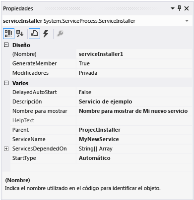

# <a name="walkthrough-create-a-windows-service-app"></a><span data-ttu-id="283c0-102">Tutorial: Creación de una aplicación de servicio de Windows</span><span class="sxs-lookup"><span data-stu-id="283c0-102">Walkthrough: Create a Windows service app</span></span>

<span data-ttu-id="283c0-103">En este artículo se explica cómo crear una sencilla aplicación de servicio de Windows en Visual Studio que escribe mensajes en un registro de eventos.</span><span class="sxs-lookup"><span data-stu-id="283c0-103">This article demonstrates how to create a simple Windows service app in Visual Studio that writes messages to an event log.</span></span>

## <a name="create-a-service"></a><span data-ttu-id="283c0-104">Creación de un servicio</span><span class="sxs-lookup"><span data-stu-id="283c0-104">Create a service</span></span>

<span data-ttu-id="283c0-105">Para empezar, cree el proyecto y defina los valores necesarios para que el servicio funcione correctamente.</span><span class="sxs-lookup"><span data-stu-id="283c0-105">To begin, create the project and set values that are required for the service to function correctly.</span></span>

1. <span data-ttu-id="283c0-106">En Visual Studio, en la barra de menús, elija **Archivo** > **Nuevo** > **Proyecto**, o presione **Ctrl** + **Mayús**+**N**, para abrir el cuadro de diálogo **Nuevo proyecto**.</span><span class="sxs-lookup"><span data-stu-id="283c0-106">In Visual Studio, on the menu bar, choose **File** > **New** > **Project** (or press **Ctrl**+**Shift**+**N**) to open the **New Project** dialog.</span></span>

2. <span data-ttu-id="283c0-107">Vaya a la plantilla de proyecto **Servicio de Windows** y selecciónela.</span><span class="sxs-lookup"><span data-stu-id="283c0-107">Navigate to and select the **Windows Service** project template.</span></span> <span data-ttu-id="283c0-108">Expanda **Instalado** > [**Visual C#** o **Visual Basic**] > **Escritorio de Windows**, o escriba **Servicio de Windows** en el cuadro de búsqueda en la esquina superior derecha.</span><span class="sxs-lookup"><span data-stu-id="283c0-108">Expand **Installed** > [**Visual C#** or **Visual Basic**] > **Windows Desktop**, or type **Windows Service** in the search box on the upper right.</span></span>

   

   > [!NOTE]
   > <span data-ttu-id="283c0-110">Si no ve la plantilla **Servicio de Windows**, puede que tenga que instalar la carga de trabajo **Desarrollo de escritorio de .NET**.</span><span class="sxs-lookup"><span data-stu-id="283c0-110">If you don't see the **Windows Service** template, you may need to install the **.NET desktop development** workload.</span></span> <span data-ttu-id="283c0-111">En el cuadro de diálogo **Nuevo proyecto**, haga clic en el vínculo que dice **Abrir el instalador de Visual Studio** en la parte inferior izquierda.</span><span class="sxs-lookup"><span data-stu-id="283c0-111">In the **New Project** dialog, click the link that says **Open Visual Studio Installer** on the lower left.</span></span> <span data-ttu-id="283c0-112">En el **Instalador de Visual Studio**, seleccione la carga de trabajo **Desarrollo de escritorio de .NET** y luego seleccione **Modificar**.</span><span class="sxs-lookup"><span data-stu-id="283c0-112">In **Visual Studio Installer**, select the **.NET desktop development** workload and then choose **Modify**.</span></span>

3. <span data-ttu-id="283c0-113">Asigne el nombre **MyNewService** al proyecto y después seleccione **Aceptar**.</span><span class="sxs-lookup"><span data-stu-id="283c0-113">Name the project **MyNewService**, and then choose **OK**.</span></span>

   <span data-ttu-id="283c0-114">La plantilla de proyecto incluye una clase de componente denominada `Service1`, que hereda de <xref:System.ServiceProcess.ServiceBase?displayProperty=nameWithType>.</span><span class="sxs-lookup"><span data-stu-id="283c0-114">The project template includes a component class named `Service1` that inherits from <xref:System.ServiceProcess.ServiceBase?displayProperty=nameWithType>.</span></span> <span data-ttu-id="283c0-115">Incluye gran parte del código de servicio básico, como el código para iniciar el servicio.</span><span class="sxs-lookup"><span data-stu-id="283c0-115">It includes much of the basic service code, such as the code to start the service.</span></span>

## <a name="rename-the-service"></a><span data-ttu-id="283c0-116">Cambiar el nombre del servicio</span><span class="sxs-lookup"><span data-stu-id="283c0-116">Rename the service</span></span>

<span data-ttu-id="283c0-117">Cambie el nombre del servicio **Service1** por **MyNewService**.</span><span class="sxs-lookup"><span data-stu-id="283c0-117">Rename the service from **Service1** to **MyNewService**.</span></span>

1. <span data-ttu-id="283c0-118">En la vista **Diseño** de Service1.cs o de Service1.vb, haga clic en el vínculo para **cambiar a la vista de código**.</span><span class="sxs-lookup"><span data-stu-id="283c0-118">In the **Design** view for Service1.cs (or Service1.vb), click the link to **switch to code view**.</span></span> <span data-ttu-id="283c0-119">Haga clic con el botón derecho en **Service1** y seleccione **Cambiar nombre** en el menú contextual.</span><span class="sxs-lookup"><span data-stu-id="283c0-119">Right-click on **Service1** and select **Rename** from the context menu.</span></span> <span data-ttu-id="283c0-120">Escriba **MyNewService** y luego presione la tecla **ENTRAR** o haga clic en **Aplicar**.</span><span class="sxs-lookup"><span data-stu-id="283c0-120">Enter **MyNewService** and then press **Enter** or click **Apply**.</span></span>

2. <span data-ttu-id="283c0-121">En la ventana **Propiedades** de **Service1.cs [Diseño]** o **Service1.vb [Diseño]**, cambie el valor **ServiceName** por **MyNewService**.</span><span class="sxs-lookup"><span data-stu-id="283c0-121">In the **Properties** window for **Service1.cs [Design]** or **Service1.vb [Design]**, change the **ServiceName** value to **MyNewService**.</span></span>

3. <span data-ttu-id="283c0-122">En el **Explorador de soluciones**, cambie el nombre **Service1.cs** por **MyNewService.cs** o **Service1.vb** por **MyNewService.vb**.</span><span class="sxs-lookup"><span data-stu-id="283c0-122">In **Solution Explorer**, rename **Service1.cs** to **MyNewService.cs**, or rename **Service1.vb** to **MyNewService.vb**.</span></span>

## <a name="add-features-to-the-service"></a><span data-ttu-id="283c0-123">Adición de características al servicio</span><span class="sxs-lookup"><span data-stu-id="283c0-123">Add features to the service</span></span>

<span data-ttu-id="283c0-124">En esta sección, agregará un registro de eventos personalizado al servicio de Windows.</span><span class="sxs-lookup"><span data-stu-id="283c0-124">In this section, you add a custom event log to the Windows service.</span></span> <span data-ttu-id="283c0-125">Los registros de eventos no están asociados de ningún modo a los servicios de Windows.</span><span class="sxs-lookup"><span data-stu-id="283c0-125">Event logs are not associated in any way with Windows services.</span></span> <span data-ttu-id="283c0-126">El componente <xref:System.Diagnostics.EventLog> se utiliza como ejemplo del tipo de componente que se puede agregar a un servicio de Windows.</span><span class="sxs-lookup"><span data-stu-id="283c0-126">The <xref:System.Diagnostics.EventLog> component is used here as an example of the type of component you can add to a Windows service.</span></span>

### <a name="add-custom-event-log-functionality"></a><span data-ttu-id="283c0-127">Adición de la funcionalidad de registro de eventos personalizado</span><span class="sxs-lookup"><span data-stu-id="283c0-127">Add custom event log functionality</span></span>

1. <span data-ttu-id="283c0-128">En el **Explorador de soluciones**, abra el menú contextual de **MyNewService.cs** o **MyNewService.vb**y, a continuación, elija **Diseñador de vistas**.</span><span class="sxs-lookup"><span data-stu-id="283c0-128">In **Solution Explorer**, open the context menu for **MyNewService.cs** or **MyNewService.vb**, and then choose **View Designer**.</span></span>

2. <span data-ttu-id="283c0-129">En la sección **Componentes** del **Cuadro de herramientas**, arrastre un componente <xref:System.Diagnostics.EventLog> hasta el diseñador.</span><span class="sxs-lookup"><span data-stu-id="283c0-129">From the **Components** section of the **Toolbox**, drag an <xref:System.Diagnostics.EventLog> component to the designer.</span></span>

3. <span data-ttu-id="283c0-130">En el **Explorador de soluciones**, abra el menú contextual de **MyNewService.cs** o **MyNewService.vb**y, a continuación, elija **Ver código**.</span><span class="sxs-lookup"><span data-stu-id="283c0-130">In **Solution Explorer**, open the context menu for **MyNewService.cs** or **MyNewService.vb**, and then choose **View Code**.</span></span>

4. <span data-ttu-id="283c0-131">Edite el constructor para definir un registro de eventos personalizado:</span><span class="sxs-lookup"><span data-stu-id="283c0-131">Edit the constructor to define a custom event log:</span></span>

   ```csharp
   public MyNewService()
   {
        InitializeComponent();

        eventLog1 = new System.Diagnostics.EventLog();
        if (!System.Diagnostics.EventLog.SourceExists("MySource"))
        {
            System.Diagnostics.EventLog.CreateEventSource(
                "MySource", "MyNewLog");
        }
        eventLog1.Source = "MySource";
        eventLog1.Log = "MyNewLog";
    }
   ```

   [!code-vb[VbRadconService#2](../../../samples/snippets/visualbasic/VS_Snippets_VBCSharp/VbRadconService/VB/MyNewService.vb#2)]

### <a name="define-what-occurs-when-the-service-starts"></a><span data-ttu-id="283c0-132">Definición de qué ocurre al iniciar el servicio</span><span class="sxs-lookup"><span data-stu-id="283c0-132">Define what occurs when the service starts</span></span>

<span data-ttu-id="283c0-133">En el Editor de código, busque el método <xref:System.ServiceProcess.ServiceBase.OnStart%2A> que se reemplazó automáticamente al crear el proyecto.</span><span class="sxs-lookup"><span data-stu-id="283c0-133">In the code editor, locate the <xref:System.ServiceProcess.ServiceBase.OnStart%2A> method that was automatically overridden when you created the project.</span></span> <span data-ttu-id="283c0-134">Agregue una línea de código que escriba una entrada en el registro de eventos cuando el servicio se inicia:</span><span class="sxs-lookup"><span data-stu-id="283c0-134">Add a line of code that writes an entry to the event log when the service starts:</span></span>

[!code-csharp[VbRadconService#3](../../../samples/snippets/csharp/VS_Snippets_VBCSharp/VbRadconService/CS/MyNewService.cs#3)]
[!code-vb[VbRadconService#3](../../../samples/snippets/visualbasic/VS_Snippets_VBCSharp/VbRadconService/VB/MyNewService.vb#3)]

<span data-ttu-id="283c0-135">Una aplicación de servicio está diseñada para ejecutarse a largo plazo, por lo que suele sondear o supervisar algún elemento del sistema.</span><span class="sxs-lookup"><span data-stu-id="283c0-135">A service application is designed to be long-running, so it usually polls or monitors something in the system.</span></span> <span data-ttu-id="283c0-136">La supervisión se puede establecer en el método <xref:System.ServiceProcess.ServiceBase.OnStart%2A> .</span><span class="sxs-lookup"><span data-stu-id="283c0-136">The monitoring is set up in the <xref:System.ServiceProcess.ServiceBase.OnStart%2A> method.</span></span> <span data-ttu-id="283c0-137">Sin embargo, <xref:System.ServiceProcess.ServiceBase.OnStart%2A> no lleva a cabo la supervisión.</span><span class="sxs-lookup"><span data-stu-id="283c0-137">However, <xref:System.ServiceProcess.ServiceBase.OnStart%2A> doesn’t actually do the monitoring.</span></span> <span data-ttu-id="283c0-138">El método <xref:System.ServiceProcess.ServiceBase.OnStart%2A> debe volver al sistema operativo después de que haya comenzado el funcionamiento del servicio.</span><span class="sxs-lookup"><span data-stu-id="283c0-138">The <xref:System.ServiceProcess.ServiceBase.OnStart%2A> method must return to the operating system after the service's operation has begun.</span></span> <span data-ttu-id="283c0-139">No debe bloquearse ni ejecutar un bucle infinito.</span><span class="sxs-lookup"><span data-stu-id="283c0-139">It must not loop forever or block.</span></span> <span data-ttu-id="283c0-140">Para configurar un mecanismo de sondeo sencillo, puede usar el componente <xref:System.Timers.Timer?displayProperty=nameWithType> de la manera siguiente: En el método <xref:System.ServiceProcess.ServiceBase.OnStart%2A>, establezca los parámetros del componente y, luego, establezca la propiedad <xref:System.Timers.Timer.Enabled%2A> en `true`.</span><span class="sxs-lookup"><span data-stu-id="283c0-140">To set up a simple polling mechanism, you can use the <xref:System.Timers.Timer?displayProperty=nameWithType> component as follows: In the <xref:System.ServiceProcess.ServiceBase.OnStart%2A> method, set parameters on the component, and then set the <xref:System.Timers.Timer.Enabled%2A> property to `true`.</span></span> <span data-ttu-id="283c0-141">El temporizador activa eventos periódicamente en el código y, en esos instantes, el servicio podría realizar su control.</span><span class="sxs-lookup"><span data-stu-id="283c0-141">The timer raises events in your code periodically, at which time your service could do its monitoring.</span></span> <span data-ttu-id="283c0-142">Para ello puede usar el código siguiente:</span><span class="sxs-lookup"><span data-stu-id="283c0-142">You can use the following code to do this:</span></span>

```csharp
// Set up a timer that triggers every minute.
System.Timers.Timer timer = new System.Timers.Timer();
timer.Interval = 60000; // 60 seconds
timer.Elapsed += new System.Timers.ElapsedEventHandler(this.OnTimer);
timer.Start();
```

```vb
' Set up a timer that triggers every minute.
Dim timer As System.Timers.Timer = New System.Timers.Timer()
timer.Interval = 60000 ' 60 seconds
AddHandler timer.Elapsed, AddressOf Me.OnTimer
timer.Start()
```

<span data-ttu-id="283c0-143">Agregue una variable de miembro a la clase.</span><span class="sxs-lookup"><span data-stu-id="283c0-143">Add a member variable to the class.</span></span> <span data-ttu-id="283c0-144">Contiene el identificador del siguiente evento para escribir en el registro de eventos.</span><span class="sxs-lookup"><span data-stu-id="283c0-144">It contains the identifier of the next event to write into the event log.</span></span>

```csharp
private int eventId = 1;
```

```vb
Private eventId As Integer = 1
```

<span data-ttu-id="283c0-145">Agregue un método nuevo para controlar el evento de temporizador:</span><span class="sxs-lookup"><span data-stu-id="283c0-145">Add a new method to handle the timer event:</span></span>

```csharp
public void OnTimer(object sender, System.Timers.ElapsedEventArgs args)
{
    // TODO: Insert monitoring activities here.
    eventLog1.WriteEntry("Monitoring the System", EventLogEntryType.Information, eventId++);
}
```

```vb
Private Sub OnTimer(sender As Object, e As Timers.ElapsedEventArgs)
    ' TODO: Insert monitoring activities here.
    eventLog1.WriteEntry("Monitoring the System", EventLogEntryType.Information, eventId)
    eventId = eventId + 1
End Sub
```

<span data-ttu-id="283c0-146">Es posible que desee realizar tareas mediante el uso de subprocesos de trabajo en segundo plano en lugar de ejecutar todo el trabajo en el subproceso principal.</span><span class="sxs-lookup"><span data-stu-id="283c0-146">You might want to perform tasks by using background worker threads instead of running all your work on the main thread.</span></span> <span data-ttu-id="283c0-147">Para obtener más información, vea <xref:System.ComponentModel.BackgroundWorker?displayProperty=fullName>.</span><span class="sxs-lookup"><span data-stu-id="283c0-147">For more information, see <xref:System.ComponentModel.BackgroundWorker?displayProperty=fullName>.</span></span>

### <a name="define-what-occurs-when-the-service-is-stopped"></a><span data-ttu-id="283c0-148">Definición de qué ocurre al detener el servicio</span><span class="sxs-lookup"><span data-stu-id="283c0-148">Define what occurs when the service is stopped</span></span>

<span data-ttu-id="283c0-149">Agregue una línea de código al método <xref:System.ServiceProcess.ServiceBase.OnStop%2A> que agregue una entrada al registro de eventos cuando el servicio se detenga:</span><span class="sxs-lookup"><span data-stu-id="283c0-149">Add a line of code to the <xref:System.ServiceProcess.ServiceBase.OnStop%2A> method that adds an entry to the event log when the service is stopped:</span></span>

```csharp
eventLog1.WriteEntry("In OnStop.");
```

[!code-vb[VbRadconService#4](../../../samples/snippets/visualbasic/VS_Snippets_VBCSharp/VbRadconService/VB/MyNewService.vb#4)]

### <a name="define-other-actions-for-the-service"></a><span data-ttu-id="283c0-150">Definición de otras acciones para el servicio</span><span class="sxs-lookup"><span data-stu-id="283c0-150">Define other actions for the service</span></span>

<span data-ttu-id="283c0-151">Puede invalidar los métodos <xref:System.ServiceProcess.ServiceBase.OnPause%2A>, <xref:System.ServiceProcess.ServiceBase.OnContinue%2A> y <xref:System.ServiceProcess.ServiceBase.OnShutdown%2A> para definir un procesamiento adicional para el componente.</span><span class="sxs-lookup"><span data-stu-id="283c0-151">You can override the <xref:System.ServiceProcess.ServiceBase.OnPause%2A>, <xref:System.ServiceProcess.ServiceBase.OnContinue%2A>, and <xref:System.ServiceProcess.ServiceBase.OnShutdown%2A> methods to define additional processing for your component.</span></span> <span data-ttu-id="283c0-152">En el siguiente código se muestra cómo reemplazar el método <xref:System.ServiceProcess.ServiceBase.OnContinue%2A> :</span><span class="sxs-lookup"><span data-stu-id="283c0-152">The following code shows how you can override the <xref:System.ServiceProcess.ServiceBase.OnContinue%2A> method:</span></span>

[!code-csharp[VbRadconService#5](../../../samples/snippets/csharp/VS_Snippets_VBCSharp/VbRadconService/CS/MyNewService.cs#5)]
[!code-vb[VbRadconService#5](../../../samples/snippets/visualbasic/VS_Snippets_VBCSharp/VbRadconService/VB/MyNewService.vb#5)]

<span data-ttu-id="283c0-153">Deben realizarse algunas acciones personalizadas cuando la clase <xref:System.Configuration.Install.Installer> instala un servicio de Windows.</span><span class="sxs-lookup"><span data-stu-id="283c0-153">Some custom actions have to occur when a Windows service is installed by the <xref:System.Configuration.Install.Installer> class.</span></span> <span data-ttu-id="283c0-154">Visual Studio puede crear estos instaladores específicamente para un servicio de Windows y agregarlos al proyecto.</span><span class="sxs-lookup"><span data-stu-id="283c0-154">Visual Studio can create these installers specifically for a Windows service and add them to your project.</span></span>

## <a name="set-service-status"></a><span data-ttu-id="283c0-155">Definición del estado de servicio</span><span class="sxs-lookup"><span data-stu-id="283c0-155">Set service status</span></span>

<span data-ttu-id="283c0-156">Los servicios informan de su estado al Administrador de control de servicios, para que los usuarios puedan saber si un servicio funciona correctamente.</span><span class="sxs-lookup"><span data-stu-id="283c0-156">Services report their status to the Service Control Manager, so that users can tell whether a service is functioning correctly.</span></span> <span data-ttu-id="283c0-157">De manera predeterminada, los servicios que se heredan de <xref:System.ServiceProcess.ServiceBase> informan de un conjunto limitado de parámetros de estado, incluidos Detenido, En pausa y En ejecución.</span><span class="sxs-lookup"><span data-stu-id="283c0-157">By default, services that inherit from <xref:System.ServiceProcess.ServiceBase> report a limited set of status settings, including Stopped, Paused, and Running.</span></span> <span data-ttu-id="283c0-158">Si un servicio tarda un poco en iniciarse, puede ser útil informar de un estado Inicio pendiente.</span><span class="sxs-lookup"><span data-stu-id="283c0-158">If a service takes a little while to start up, it might be helpful to report a Start Pending status.</span></span> <span data-ttu-id="283c0-159">También puede implementar la configuración de estado Inicio pendiente y Detención pendiente si agrega código que llama a la [función SetServiceStatus](/windows/desktop/api/winsvc/nf-winsvc-setservicestatus)de Windows.</span><span class="sxs-lookup"><span data-stu-id="283c0-159">You can also implement the Start Pending and Stop Pending status settings by adding code that calls into the Windows [SetServiceStatus function](/windows/desktop/api/winsvc/nf-winsvc-setservicestatus).</span></span>

<span data-ttu-id="283c0-160">Para implementar el estado pendiente del servicio:</span><span class="sxs-lookup"><span data-stu-id="283c0-160">To implement service pending status:</span></span>

1. <span data-ttu-id="283c0-161">Agregue una instrucción `using` o una declaración `Imports` al espacio de nombres <xref:System.Runtime.InteropServices?displayProperty=nameWithType> en el archivo MyNewService.cs o MyNewService.vb:</span><span class="sxs-lookup"><span data-stu-id="283c0-161">Add a `using` statement or `Imports` declaration for the <xref:System.Runtime.InteropServices?displayProperty=nameWithType> namespace in the MyNewService.cs or MyNewService.vb file:</span></span>

    ```csharp
    using System.Runtime.InteropServices;
    ```

    ```vb
    Imports System.Runtime.InteropServices
    ```

2. <span data-ttu-id="283c0-162">Agregue el código siguiente a MyNewService.cs para declarar los valores de `ServiceState` y agregue una estructura para el estado, que usará en una llamada de invocación de plataforma:</span><span class="sxs-lookup"><span data-stu-id="283c0-162">Add the following code to MyNewService.cs to declare the `ServiceState` values and to add a structure for the status, which you'll use in a platform invoke call:</span></span>

    ```csharp
    public enum ServiceState
    {
        SERVICE_STOPPED = 0x00000001,
        SERVICE_START_PENDING = 0x00000002,
        SERVICE_STOP_PENDING = 0x00000003,
        SERVICE_RUNNING = 0x00000004,
        SERVICE_CONTINUE_PENDING = 0x00000005,
        SERVICE_PAUSE_PENDING = 0x00000006,
        SERVICE_PAUSED = 0x00000007,
    }

    [StructLayout(LayoutKind.Sequential)]
    public struct ServiceStatus
    {
        public int dwServiceType;
        public ServiceState dwCurrentState;
        public int dwControlsAccepted;
        public int dwWin32ExitCode;
        public int dwServiceSpecificExitCode;
        public int dwCheckPoint;
        public int dwWaitHint;
    };
    ```

    ```vb
    Public Enum ServiceState
        SERVICE_STOPPED = 1
        SERVICE_START_PENDING = 2
        SERVICE_STOP_PENDING = 3
        SERVICE_RUNNING = 4
        SERVICE_CONTINUE_PENDING = 5
        SERVICE_PAUSE_PENDING = 6
        SERVICE_PAUSED = 7
    End Enum

    <StructLayout(LayoutKind.Sequential)>
    Public Structure ServiceStatus
        Public dwServiceType As Long
        Public dwCurrentState As ServiceState
        Public dwControlsAccepted As Long
        Public dwWin32ExitCode As Long
        Public dwServiceSpecificExitCode As Long
        Public dwCheckPoint As Long
        Public dwWaitHint As Long
    End Structure
    ```

3. <span data-ttu-id="283c0-163">Ahora, en la clase `MyNewService`, declare la [función SetServiceStatus](/windows/desktop/api/winsvc/nf-winsvc-setservicestatus) mediante la [invocación de plataforma](../interop/consuming-unmanaged-dll-functions.md):</span><span class="sxs-lookup"><span data-stu-id="283c0-163">Now, in the `MyNewService` class, declare the [SetServiceStatus function](/windows/desktop/api/winsvc/nf-winsvc-setservicestatus) by using [platform invoke](../interop/consuming-unmanaged-dll-functions.md):</span></span>

    ```csharp
    [DllImport("advapi32.dll", SetLastError = true)]
    private static extern bool SetServiceStatus(System.IntPtr handle, ref ServiceStatus serviceStatus);
    ```

    ```vb
    Declare Auto Function SetServiceStatus Lib "advapi32.dll" (ByVal handle As IntPtr, ByRef serviceStatus As ServiceStatus) As Boolean
    ```

4. <span data-ttu-id="283c0-164">Para implementar el estado Inicio pendiente, agregue el código siguiente al principio del método <xref:System.ServiceProcess.ServiceBase.OnStart%2A> :</span><span class="sxs-lookup"><span data-stu-id="283c0-164">To implement the Start Pending status, add the following code to the beginning of the <xref:System.ServiceProcess.ServiceBase.OnStart%2A> method:</span></span>

    ```csharp
    // Update the service state to Start Pending.
    ServiceStatus serviceStatus = new ServiceStatus();
    serviceStatus.dwCurrentState = ServiceState.SERVICE_START_PENDING;
    serviceStatus.dwWaitHint = 100000;
    SetServiceStatus(this.ServiceHandle, ref serviceStatus);
    ```

    ```vb
    ' Update the service state to Start Pending.
    Dim serviceStatus As ServiceStatus = New ServiceStatus()
    serviceStatus.dwCurrentState = ServiceState.SERVICE_START_PENDING
    serviceStatus.dwWaitHint = 100000
    SetServiceStatus(Me.ServiceHandle, serviceStatus)
    ```

5. <span data-ttu-id="283c0-165">Agregue código para establecer el estado en En ejecución al final del método <xref:System.ServiceProcess.ServiceBase.OnStart%2A> .</span><span class="sxs-lookup"><span data-stu-id="283c0-165">Add code to set the status to Running at the end of the <xref:System.ServiceProcess.ServiceBase.OnStart%2A> method.</span></span>

    ```csharp
    // Update the service state to Running.
    serviceStatus.dwCurrentState = ServiceState.SERVICE_RUNNING;
    SetServiceStatus(this.ServiceHandle, ref serviceStatus);
    ```

    ```vb
    ' Update the service state to Running.
    serviceStatus.dwCurrentState = ServiceState.SERVICE_RUNNING
    SetServiceStatus(Me.ServiceHandle, serviceStatus)
    ```

6. <span data-ttu-id="283c0-166">(Opcional) Repita este procedimiento para el método <xref:System.ServiceProcess.ServiceBase.OnStop%2A> .</span><span class="sxs-lookup"><span data-stu-id="283c0-166">(Optional) Repeat this procedure for the <xref:System.ServiceProcess.ServiceBase.OnStop%2A> method.</span></span>

> [!NOTE]
> <span data-ttu-id="283c0-167">El cuadro de diálogo [Administrador de control de servicios](/windows/desktop/Services/service-control-manager) usa los miembros `dwWaitHint` y `dwCheckpoint` de la [estructura SERVICE_STATUS](/windows/desktop/api/winsvc/ns-winsvc-_service_status) para determinar durante cuánto tiempo hay que esperar a que un servicio de Windows se inicie o apague.</span><span class="sxs-lookup"><span data-stu-id="283c0-167">The [Service Control Manager](/windows/desktop/Services/service-control-manager) uses the `dwWaitHint` and `dwCheckpoint` members of the [SERVICE_STATUS structure](/windows/desktop/api/winsvc/ns-winsvc-_service_status) to determine how much time to wait for a Windows service to start or shut down.</span></span> <span data-ttu-id="283c0-168">Si los métodos <xref:System.ServiceProcess.ServiceBase.OnStart%2A> y <xref:System.ServiceProcess.ServiceBase.OnStop%2A> se ejecutan durante mucho tiempo, el servicio puede solicitar más tiempo por medio de una nueva llamada a [SetServiceStatus](/windows/desktop/api/winsvc/nf-winsvc-setservicestatus) con un valor de `dwCheckPoint` incrementado.</span><span class="sxs-lookup"><span data-stu-id="283c0-168">If your <xref:System.ServiceProcess.ServiceBase.OnStart%2A> and <xref:System.ServiceProcess.ServiceBase.OnStop%2A> methods run long, your service can request more time by calling [SetServiceStatus](/windows/desktop/api/winsvc/nf-winsvc-setservicestatus) again with an incremented `dwCheckPoint` value.</span></span>

## <a name="add-installers-to-the-service"></a><span data-ttu-id="283c0-169">Adición de instaladores al servicio</span><span class="sxs-lookup"><span data-stu-id="283c0-169">Add installers to the service</span></span>

<span data-ttu-id="283c0-170">Para poder ejecutar un servicio de Windows, antes debe instalarlo, lo que lo registra con el Administrador de control de servicios.</span><span class="sxs-lookup"><span data-stu-id="283c0-170">Before you can run a Windows service, you need to install it, which registers it with the Service Control Manager.</span></span> <span data-ttu-id="283c0-171">Puede agregar instaladores al proyecto que controlen los detalles del registro.</span><span class="sxs-lookup"><span data-stu-id="283c0-171">You can add installers to your project that handle the registration details.</span></span>

1. <span data-ttu-id="283c0-172">En el **Explorador de soluciones**, abra el menú contextual de **MyNewService.cs** o **MyNewService.vb**y, a continuación, elija **Diseñador de vistas**.</span><span class="sxs-lookup"><span data-stu-id="283c0-172">In **Solution Explorer**, open the context menu for **MyNewService.cs** or **MyNewService.vb**, and then choose **View Designer**.</span></span>

2. <span data-ttu-id="283c0-173">Haga clic en el fondo del diseñador para seleccionar el propio servicio, en vez de cualquier elemento de su contenido.</span><span class="sxs-lookup"><span data-stu-id="283c0-173">Click the background of the designer to select the service itself, instead of any of its contents.</span></span>

3. <span data-ttu-id="283c0-174">Abra el menú contextual de la ventana del diseñador (si usa un dispositivo señalador, haga clic con el botón secundario dentro de la ventana) y, a continuación, elija **Agregar instalador**.</span><span class="sxs-lookup"><span data-stu-id="283c0-174">Open the context menu for the designer window (if you’re using a pointing device, right-click inside the window), and then choose **Add Installer**.</span></span>

   <span data-ttu-id="283c0-175">De forma predeterminada, se agrega al proyecto una clase de componente que contiene dos instaladores.</span><span class="sxs-lookup"><span data-stu-id="283c0-175">By default, a component class that contains two installers is added to your project.</span></span> <span data-ttu-id="283c0-176">El componente se denomina **ProjectInstaller**, y los instaladores que contiene son el instalador para el servicio y el instalador para el proceso asociado al servicio.</span><span class="sxs-lookup"><span data-stu-id="283c0-176">The component is named **ProjectInstaller**, and the installers it contains are the installer for your service and the installer for the service's associated process.</span></span>

4. <span data-ttu-id="283c0-177">En la vista **Diseño** de **ProjectInstaller**, elija **serviceInstaller1** para un proyecto de Visual C# o **ServiceInstaller1** para un proyecto de Visual Basic.</span><span class="sxs-lookup"><span data-stu-id="283c0-177">In **Design** view for **ProjectInstaller**, choose **serviceInstaller1** for a Visual C# project, or **ServiceInstaller1** for a Visual Basic project.</span></span>

5. <span data-ttu-id="283c0-178">En la ventana **Propiedades** , asegúrese de que la propiedad <xref:System.ServiceProcess.ServiceInstaller.ServiceName%2A> esté establecida en **MyNewService**.</span><span class="sxs-lookup"><span data-stu-id="283c0-178">In the **Properties** window, make sure the <xref:System.ServiceProcess.ServiceInstaller.ServiceName%2A> property is set to **MyNewService**.</span></span>

6. <span data-ttu-id="283c0-179">Establezca texto en la propiedad **Descripción** , como "Servicio de ejemplo".</span><span class="sxs-lookup"><span data-stu-id="283c0-179">Set the **Description** property to some text, such as "A sample service".</span></span> <span data-ttu-id="283c0-180">Este texto aparece en la ventana Servicios y ayuda al usuario a identificar el servicio y comprender para qué se usa.</span><span class="sxs-lookup"><span data-stu-id="283c0-180">This text appears in the Services window and helps the user identify the service and understand what it’s used for.</span></span>

7. <span data-ttu-id="283c0-181">Establezca la propiedad <xref:System.ServiceProcess.ServiceInstaller.DisplayName%2A> en el texto que desea que aparezca en la ventana Servicios en la columna **Nombre** .</span><span class="sxs-lookup"><span data-stu-id="283c0-181">Set the <xref:System.ServiceProcess.ServiceInstaller.DisplayName%2A> property to the text that you want to appear in the Services window in the **Name** column.</span></span> <span data-ttu-id="283c0-182">Por ejemplo, puede escribir "Nombre para mostrar de MyNewService".</span><span class="sxs-lookup"><span data-stu-id="283c0-182">For example, you can enter "MyNewService Display Name".</span></span> <span data-ttu-id="283c0-183">Este nombre puede ser diferente de la propiedad <xref:System.ServiceProcess.ServiceInstaller.ServiceName%2A> , que es el nombre usado por el sistema (por ejemplo, al usar el comando `net start` para iniciar el servicio).</span><span class="sxs-lookup"><span data-stu-id="283c0-183">This name can be different from the <xref:System.ServiceProcess.ServiceInstaller.ServiceName%2A> property, which is the name used by the system (for example, when you use the `net start` command to start your service).</span></span>

8. <span data-ttu-id="283c0-184">Establezca la propiedad <xref:System.ServiceProcess.ServiceInstaller.StartType%2A> en <xref:System.ServiceProcess.ServiceStartMode.Automatic>.</span><span class="sxs-lookup"><span data-stu-id="283c0-184">Set the <xref:System.ServiceProcess.ServiceInstaller.StartType%2A> property to <xref:System.ServiceProcess.ServiceStartMode.Automatic>.</span></span>

     <span data-ttu-id="283c0-185"></span><span class="sxs-lookup"><span data-stu-id="283c0-185"></span></span>

9. <span data-ttu-id="283c0-186">En el diseñador, elija **serviceProcessInstaller1** para un proyecto de Visual C# o **ServiceProcessInstaller1** para un proyecto de Visual Basic.</span><span class="sxs-lookup"><span data-stu-id="283c0-186">In the designer, choose **serviceProcessInstaller1** for a Visual C# project, or **ServiceProcessInstaller1** for a Visual Basic project.</span></span> <span data-ttu-id="283c0-187">Establezca la propiedad <xref:System.ServiceProcess.ServiceProcessInstaller.Account%2A> en <xref:System.ServiceProcess.ServiceAccount.LocalSystem>.</span><span class="sxs-lookup"><span data-stu-id="283c0-187">Set the <xref:System.ServiceProcess.ServiceProcessInstaller.Account%2A> property to <xref:System.ServiceProcess.ServiceAccount.LocalSystem>.</span></span> <span data-ttu-id="283c0-188">Esto hace que el servicio se instale y se ejecute con la cuenta de sistema local.</span><span class="sxs-lookup"><span data-stu-id="283c0-188">This causes the service to be installed and to run using the local system account.</span></span>

    > [!IMPORTANT]
    > <span data-ttu-id="283c0-189">La cuenta <xref:System.ServiceProcess.ServiceAccount.LocalSystem> tiene amplios permisos, incluida la capacidad para escribir en el registro de eventos.</span><span class="sxs-lookup"><span data-stu-id="283c0-189">The <xref:System.ServiceProcess.ServiceAccount.LocalSystem> account has broad permissions, including the ability to write to the event log.</span></span> <span data-ttu-id="283c0-190">Utilice esta cuenta con precaución porque podría aumentar el riesgo de ataques por parte de software malintencionado.</span><span class="sxs-lookup"><span data-stu-id="283c0-190">Use this account with caution, because it might increase your risk of attacks from malicious software.</span></span> <span data-ttu-id="283c0-191">Para otras tareas, considere la posibilidad de usar la cuenta <xref:System.ServiceProcess.ServiceAccount.LocalService> , que actúa como un usuario sin privilegios en el equipo local y presenta credenciales anónimas a cualquier servidor remoto.</span><span class="sxs-lookup"><span data-stu-id="283c0-191">For other tasks, consider using the <xref:System.ServiceProcess.ServiceAccount.LocalService> account, which acts as a non-privileged user on the local computer and presents anonymous credentials to any remote server.</span></span> <span data-ttu-id="283c0-192">En este ejemplo se produce un error si intenta usar la cuenta <xref:System.ServiceProcess.ServiceAccount.LocalService> , ya que necesita permiso de escritura en el registro de eventos.</span><span class="sxs-lookup"><span data-stu-id="283c0-192">This example fails if you try to use the <xref:System.ServiceProcess.ServiceAccount.LocalService> account, because it needs permission to write to the event log.</span></span>

<span data-ttu-id="283c0-193">Para más información sobre los instaladores, consulte [Procedimiento para agregar instaladores a una aplicación de servicio](../../../docs/framework/windows-services/how-to-add-installers-to-your-service-application.md).</span><span class="sxs-lookup"><span data-stu-id="283c0-193">For more information about installers, see [How to: Add Installers to Your service Application](../../../docs/framework/windows-services/how-to-add-installers-to-your-service-application.md).</span></span>

## <a name="optional-set-startup-parameters"></a><span data-ttu-id="283c0-194">(Opcional) Establecer parámetros de inicio</span><span class="sxs-lookup"><span data-stu-id="283c0-194">(Optional) Set startup parameters</span></span>

<span data-ttu-id="283c0-195">Un servicio de Windows, al igual que cualquier otro archivo ejecutable, puede aceptar argumentos de línea de comandos o parámetros de inicio.</span><span class="sxs-lookup"><span data-stu-id="283c0-195">A Windows service, like any other executable, can accept command-line arguments, or startup parameters.</span></span> <span data-ttu-id="283c0-196">Cuando se agrega código para procesar los parámetros de inicio, los usuarios pueden iniciar el servicio con sus propios parámetros de inicio personalizados mediante la ventana Servicios del Panel de control de Windows.</span><span class="sxs-lookup"><span data-stu-id="283c0-196">When you add code to process startup parameters, users can start your service with their own custom startup parameters by using the Services window in the Windows Control Panel.</span></span> <span data-ttu-id="283c0-197">Sin embargo, estos parámetros de inicio no se conservan la próxima vez que se inicia el servicio.</span><span class="sxs-lookup"><span data-stu-id="283c0-197">However, these startup parameters are not persisted the next time the service starts.</span></span> <span data-ttu-id="283c0-198">Para establecer los parámetros de inicio de manera permanente, puede establecerlos en el Registro, como se muestra en este procedimiento.</span><span class="sxs-lookup"><span data-stu-id="283c0-198">To set startup parameters permanently, you can set them in the registry, as shown in this procedure.</span></span>

> [!NOTE]
> <span data-ttu-id="283c0-199">Antes de decidirse a agregar parámetros de inicio, piense en si es la mejor manera de pasar información al servicio.</span><span class="sxs-lookup"><span data-stu-id="283c0-199">Before you decide to add startup parameters, consider whether that is the best way to pass information to your service.</span></span> <span data-ttu-id="283c0-200">Aunque los parámetros de inicio son fáciles de usar y analizar, y los usuarios los pueden reemplazar fácilmente, pueden ser más difíciles de descubrir y usar para los usuarios sin documentación.</span><span class="sxs-lookup"><span data-stu-id="283c0-200">Although startup parameters are easy to use and to parse, and users can easily override them, they might be harder for users to discover and use without documentation.</span></span> <span data-ttu-id="283c0-201">Por lo general, si el servicio requiere más de unos pocos parámetros de inicio, debe considerar el uso del Registro o un archivo de configuración en su lugar.</span><span class="sxs-lookup"><span data-stu-id="283c0-201">Generally, if your service requires more than just a few startup parameters, you should consider using the registry or a configuration file instead.</span></span> <span data-ttu-id="283c0-202">Todos los servicios de Windows tienen una entrada en el Registro en **HKLM\System\CurrentControlSet\services**.</span><span class="sxs-lookup"><span data-stu-id="283c0-202">Every Windows service has an entry in the registry under **HKLM\System\CurrentControlSet\services**.</span></span> <span data-ttu-id="283c0-203">En la clave del servicio, se puede usar la subclave **Parameters** para almacenar la información a la que puede tener acceso su servicio.</span><span class="sxs-lookup"><span data-stu-id="283c0-203">Under the service's key, you can use the **Parameters** subkey to store information that your service can access.</span></span> <span data-ttu-id="283c0-204">Puede usar archivos de configuración de aplicación para un servicio de Windows del mismo modo que lo hace para otros tipos de programas.</span><span class="sxs-lookup"><span data-stu-id="283c0-204">You can use application configuration files for a Windows service the same way you do for other types of programs.</span></span> <span data-ttu-id="283c0-205">Para obtener código de ejemplo, vea <xref:System.Configuration.ConfigurationManager.AppSettings%2A>.</span><span class="sxs-lookup"><span data-stu-id="283c0-205">For example code, see <xref:System.Configuration.ConfigurationManager.AppSettings%2A>.</span></span>

<span data-ttu-id="283c0-206">Para agregar parámetros de inicio:</span><span class="sxs-lookup"><span data-stu-id="283c0-206">To add startup parameters:</span></span>

1. <span data-ttu-id="283c0-207">En el método `Main` de Program.cs o MyNewService.Designer.vb, agregue un parámetro de entrada para pasarlo al constructor del servicio:</span><span class="sxs-lookup"><span data-stu-id="283c0-207">In the `Main` method in Program.cs or in MyNewService.Designer.vb, add an input parameter to pass to the service constructor:</span></span>

   ```csharp
   static void Main(string[] args)
   {
       ServiceBase[] ServicesToRun;
       ServicesToRun = new ServiceBase[]
       {
           new MyNewService(args)
       };
       ServiceBase.Run(ServicesToRun);
   }
   ```

   ```vb
   Shared Sub Main(ByVal cmdArgs() As String)
       Dim ServicesToRun() As System.ServiceProcess.ServiceBase = New System.ServiceProcess.ServiceBase() {New MyNewServiceVB(cmdArgs)}
       System.ServiceProcess.ServiceBase.Run(ServicesToRun)
   End Sub
   ```

2. <span data-ttu-id="283c0-208">Cambie el constructor `MyNewService` de la siguiente forma:</span><span class="sxs-lookup"><span data-stu-id="283c0-208">Change the `MyNewService` constructor as follows:</span></span>

   ```csharp
   public MyNewService(string[] args)
   {
       InitializeComponent();

        string eventSourceName = "MySource";
        string logName = "MyNewLog";

        if (args.Length > 0)
        {
            eventSourceName = args[0];
        }

        if (args.Length > 1)
        {
            logName = args[1];
        }

        eventLog1 = new System.Diagnostics.EventLog();

        if (!System.Diagnostics.EventLog.SourceExists(eventSourceName))
        {
            System.Diagnostics.EventLog.CreateEventSource(eventSourceName, logName);
        }

        eventLog1.Source = eventSourceName;
        eventLog1.Log = logName;
   }
   ```

   ```vb
   Public Sub New(ByVal cmdArgs() As String)
       InitializeComponent()
       Dim eventSourceName As String = "MySource"
       Dim logName As String = "MyNewLog"
       If (cmdArgs.Count() > 0) Then
           eventSourceName = cmdArgs(0)
       End If
       If (cmdArgs.Count() > 1) Then
           logName = cmdArgs(1)
       End If
       eventLog1 = New System.Diagnostics.EventLog()
       If (Not System.Diagnostics.EventLog.SourceExists(eventSourceName)) Then
           System.Diagnostics.EventLog.CreateEventSource(eventSourceName, logName)
       End If
       eventLog1.Source = eventSourceName
       eventLog1.Log = logName
   End Sub
   ```

   <span data-ttu-id="283c0-209">Este código establece el nombre de registro y el origen de eventos según los parámetros de inicio proporcionados, o bien, usa los valores predeterminados si no se proporcionan argumentos.</span><span class="sxs-lookup"><span data-stu-id="283c0-209">This code sets the event source and log name according to the supplied startup parameters, or uses default values if no arguments are supplied.</span></span>

3. <span data-ttu-id="283c0-210">Para especificar los argumentos de línea de comandos, agregue el código siguiente a la clase `ProjectInstaller` en ProjectInstaller.cs o ProjectInstaller.vb:</span><span class="sxs-lookup"><span data-stu-id="283c0-210">To specify the command-line arguments, add the following code to the `ProjectInstaller` class in ProjectInstaller.cs or ProjectInstaller.vb:</span></span>

   ```csharp
   protected override void OnBeforeInstall(IDictionary savedState)
   {
       string parameter = "MySource1\" \"MyLogFile1";
       Context.Parameters["assemblypath"] = "\"" + Context.Parameters["assemblypath"] + "\" \"" + parameter + "\"";
       base.OnBeforeInstall(savedState);
   }
   ```

   ```vb
   Protected Overrides Sub OnBeforeInstall(ByVal savedState As IDictionary)
       Dim parameter As String = "MySource1"" ""MyLogFile1"
       Context.Parameters("assemblypath") = """" + Context.Parameters("assemblypath") + """ """ + parameter + """"
       MyBase.OnBeforeInstall(savedState)
   End Sub
   ```

   <span data-ttu-id="283c0-211">Este código modifica la clave del Registro **ImagePath**, que suele contener la ruta de acceso completa al archivo ejecutable para el servicio de Windows. Para ello, agrega los valores de parámetros predeterminados.</span><span class="sxs-lookup"><span data-stu-id="283c0-211">This code modifies the **ImagePath** registry key, which typically contains the full path to the executable for the Windows service, by adding the default parameter values.</span></span> <span data-ttu-id="283c0-212">Las comillas alrededor de la ruta de acceso (y alrededor de cada parámetro individual) son obligatorias para que el servicio se inicie correctamente.</span><span class="sxs-lookup"><span data-stu-id="283c0-212">The quotation marks around the path (and around each individual parameter) are required for the service to start up correctly.</span></span> <span data-ttu-id="283c0-213">Para cambiar los parámetros de inicio para este servicio de Windows, los usuarios pueden cambiar los parámetros proporcionados en la clave del Registro **ImagePath**, aunque la mejor manera es cambiarlos mediante programación y exponer la funcionalidad a los usuarios de una manera fácil de usar (por ejemplo, en una utilidad de administración o configuración).</span><span class="sxs-lookup"><span data-stu-id="283c0-213">To change the startup parameters for this Windows service, users can change the parameters given in the **ImagePath** registry key, although the better way is to change it programmatically and expose the functionality to users in a friendly way (for example, in a management or configuration utility).</span></span>

## <a name="build-the-service"></a><span data-ttu-id="283c0-214">Compilación del servicio</span><span class="sxs-lookup"><span data-stu-id="283c0-214">Build the service</span></span>

1. <span data-ttu-id="283c0-215">En el **Explorador de soluciones**, abra el menú contextual del proyecto y, a continuación, elija **Propiedades**.</span><span class="sxs-lookup"><span data-stu-id="283c0-215">In **Solution Explorer**, open the context menu for your project, and then choose **Properties**.</span></span>

   <span data-ttu-id="283c0-216">Aparecerán las páginas de propiedades del proyecto.</span><span class="sxs-lookup"><span data-stu-id="283c0-216">The property pages for your project appear.</span></span>

2. <span data-ttu-id="283c0-217">En la pestaña **Aplicación**, en la lista **Objeto de inicio**, elija **MyNewService.Program**.</span><span class="sxs-lookup"><span data-stu-id="283c0-217">On the **Application** tab, in the **Startup object** list, choose **MyNewService.Program**.</span></span>

3. <span data-ttu-id="283c0-218">En el **Explorador de soluciones**, abra el menú contextual del proyecto y, a continuación, elija **Compilar** para compilar el proyecto, o bien presione **Ctrl**+**Mayús**+**B**.</span><span class="sxs-lookup"><span data-stu-id="283c0-218">In **Solution Explorer**, open the context menu for your project, and then choose **Build** to build the project (or press **Ctrl**+**Shift**+**B**).</span></span>

## <a name="install-the-service"></a><span data-ttu-id="283c0-219">Instalación del servicio</span><span class="sxs-lookup"><span data-stu-id="283c0-219">Install the service</span></span>

<span data-ttu-id="283c0-220">Ahora que ha compilado el servicio de Windows, puede instalarlo.</span><span class="sxs-lookup"><span data-stu-id="283c0-220">Now that you've built the Windows service, you can install it.</span></span> <span data-ttu-id="283c0-221">Para instalar un servicio de Windows, debe tener credenciales de administrador en el equipo en el que lo va a instalar.</span><span class="sxs-lookup"><span data-stu-id="283c0-221">To install a Windows service, you must have administrator credentials on the computer on which you're installing it.</span></span>

1. <span data-ttu-id="283c0-222">Abra un **Símbolo del sistema para desarrolladores para Visual Studio** con credenciales administrativas.</span><span class="sxs-lookup"><span data-stu-id="283c0-222">Open **Developer Command Prompt for Visual Studio** with administrative credentials.</span></span> <span data-ttu-id="283c0-223">Si usa un mouse, haga clic con el botón derecho en **Símbolo del sistema para desarrolladores para VS 2017** en el menú Inicio de Windows y, a continuación, elija **Más** > **Ejecutar como administrador**.</span><span class="sxs-lookup"><span data-stu-id="283c0-223">If you’re using a mouse, right-click on **Developer Command Prompt for VS 2017** in the Windows Start menu, and then choose **More** > **Run as Administrator**.</span></span>

2. <span data-ttu-id="283c0-224">En la ventana del **Símbolo del sistema para desarrolladores**, desplácese hasta la carpeta que contiene el resultado del proyecto (de forma predeterminada, es el subdirectorio *\bin\Debug* del proyecto).</span><span class="sxs-lookup"><span data-stu-id="283c0-224">In the **Developer Command Prompt** window, navigate to the folder that contains your project's output (by default, it's the *\bin\Debug* subdirectory of your project).</span></span>

3. <span data-ttu-id="283c0-225">Escriba el comando siguiente:</span><span class="sxs-lookup"><span data-stu-id="283c0-225">Enter the following command:</span></span>

    ```shell
    installutil.exe MyNewService.exe
    ```

    <span data-ttu-id="283c0-226">Si el servicio se instala correctamente, **installutil.exe** indica que la instalación ha sido correcta.</span><span class="sxs-lookup"><span data-stu-id="283c0-226">If the service installs successfully, **installutil.exe** reports success.</span></span> <span data-ttu-id="283c0-227">Si el sistema no encuentra **InstallUtil.exe**, asegúrese de que existe en el equipo.</span><span class="sxs-lookup"><span data-stu-id="283c0-227">If the system could not find **InstallUtil.exe**, make sure that it exists on your computer.</span></span> <span data-ttu-id="283c0-228">Esta herramienta se instala con .NET Framework en la carpeta *%windir%\Microsoft.NET\Framework[64]\\[versión de framework]*.</span><span class="sxs-lookup"><span data-stu-id="283c0-228">This tool is installed with the .NET Framework to the folder *%windir%\Microsoft.NET\Framework[64]\\[framework version]*.</span></span> <span data-ttu-id="283c0-229">Por ejemplo, la ruta de acceso predeterminada para la versión de 32 bits es *%windir%\Microsoft.NET\Framework\v4.0.30319\InstallUtil.exe*.</span><span class="sxs-lookup"><span data-stu-id="283c0-229">For example, the default path for the 32-bit version is *%windir%\Microsoft.NET\Framework\v4.0.30319\InstallUtil.exe*.</span></span>

    <span data-ttu-id="283c0-230">Si el proceso **installutil.exe** informa de un error, compruebe el registro de instalación para averiguar por qué.</span><span class="sxs-lookup"><span data-stu-id="283c0-230">If the **installutil.exe** process reports failure, check the install log to find out why.</span></span> <span data-ttu-id="283c0-231">De manera predeterminada, el registro está en la misma carpeta que el ejecutable del servicio.</span><span class="sxs-lookup"><span data-stu-id="283c0-231">By default the log is in the same folder as the service executable.</span></span> <span data-ttu-id="283c0-232">La instalación puede generar errores si la clase <xref:System.ComponentModel.RunInstallerAttribute> no está presente en la clase `ProjectInstaller`, si el atributo no está establecido en **true** o si la clase `ProjectInstaller` no está marcada como **pública**.</span><span class="sxs-lookup"><span data-stu-id="283c0-232">The installation can fail if  the <xref:System.ComponentModel.RunInstallerAttribute> Class is not present on the `ProjectInstaller` class, if the attribute is not set to **true**, or if the `ProjectInstaller` class is not marked **public**.</span></span>

<span data-ttu-id="283c0-233">Para obtener más información, vea [Cómo: Instalar y desinstalar servicios](../../../docs/framework/windows-services/how-to-install-and-uninstall-services.md).</span><span class="sxs-lookup"><span data-stu-id="283c0-233">For more information, see [How to: Install and Uninstall Services](../../../docs/framework/windows-services/how-to-install-and-uninstall-services.md).</span></span>

## <a name="start-and-run-the-service"></a><span data-ttu-id="283c0-234">Inicio y ejecución del servicio</span><span class="sxs-lookup"><span data-stu-id="283c0-234">Start and run the service</span></span>

1. <span data-ttu-id="283c0-235">En Windows, abra la aplicación de escritorio **Servicios**.</span><span class="sxs-lookup"><span data-stu-id="283c0-235">In Windows, open the **Services** desktop app.</span></span> <span data-ttu-id="283c0-236">Presione **Windows**+**R** para abrir el cuadro **Ejecutar** y después escriba **services.msc** y presione la tecla **ENTRAR** o haga clic en **Aceptar**.</span><span class="sxs-lookup"><span data-stu-id="283c0-236">Press **Windows**+**R** to open the **Run** box, and then enter **services.msc** and press **Enter** or click **OK**.</span></span>

     <span data-ttu-id="283c0-237">El servicio debería aparecer en **Servicios**, mostrado en orden alfabético por el nombre para mostrar que se haya establecido.</span><span class="sxs-lookup"><span data-stu-id="283c0-237">You should see your service listed in **Services**, displayed alphabetically by the display name that you set for it.</span></span>

     

2. <span data-ttu-id="283c0-239">En **Servicios**, abra el menú contextual del servicio y, a continuación, elija **Iniciar**.</span><span class="sxs-lookup"><span data-stu-id="283c0-239">In **Services**, open the shortcut menu for your service, and then choose **Start**.</span></span>

3. <span data-ttu-id="283c0-240">Para detener el servicio, abra el menú contextual del servicio y luego elija **Detener**.</span><span class="sxs-lookup"><span data-stu-id="283c0-240">To stop the service, open the shortcut menu for the service, and then choose **Stop**.</span></span>

4. <span data-ttu-id="283c0-241">(Opcional) Desde la línea de comandos, puede usar los comandos `net start ServiceName` y `net stop ServiceName` para iniciar y detener el servicio.</span><span class="sxs-lookup"><span data-stu-id="283c0-241">(Optional) From the command line, you can use the commands `net start ServiceName` and `net stop ServiceName` to start and stop your service.</span></span>

### <a name="verify-the-event-log-output-of-your-service"></a><span data-ttu-id="283c0-242">Verificación de la salida del registro de eventos del servicio</span><span class="sxs-lookup"><span data-stu-id="283c0-242">Verify the event log output of your service</span></span>

1. <span data-ttu-id="283c0-243">Abra el **Visor de eventos**; para ello, empiece a escribir **Visor de eventos** en el cuadro de búsqueda de la barra de tareas de Windows y luego seleccione **Visor de eventos** en los resultados de la búsqueda.</span><span class="sxs-lookup"><span data-stu-id="283c0-243">Open **Event Viewer** by starting to type **Event Viewer** in the search box on the Windows task bar, and then selecting **Event Viewer** from the search results.</span></span>

   > [!TIP]
   > <span data-ttu-id="283c0-244">En Visual Studio, para acceder a los registros de eventos, abra el **Explorador de servidores** (teclado: **Ctrl**+**Alt**+**S**) y expanda el nodo **Registros de eventos** para el equipo local.</span><span class="sxs-lookup"><span data-stu-id="283c0-244">In Visual Studio, you can access event logs by opening **Server Explorer** (Keyboard: **Ctrl**+**Alt**+**S**) and expanding the **Event Logs** node for the local computer.</span></span>

2. <span data-ttu-id="283c0-245">En **Visor de eventos**, expanda **Registros de aplicaciones y servicios**.</span><span class="sxs-lookup"><span data-stu-id="283c0-245">In **Event Viewer**, expand **Applications and Services Logs**.</span></span>

3. <span data-ttu-id="283c0-246">Localice la lista correspondiente a **MyNewLog**, o **MyLogFile1** si siguió el procedimiento opcional para agregar argumentos de línea de comandos, y expándala.</span><span class="sxs-lookup"><span data-stu-id="283c0-246">Locate the listing for **MyNewLog** (or **MyLogFile1**, if you followed the optional procedure to add command-line arguments) and expand it.</span></span> <span data-ttu-id="283c0-247">Debería ver las entradas de las dos acciones (iniciar y detener) que el servicio realizó.</span><span class="sxs-lookup"><span data-stu-id="283c0-247">You should see entries for the two actions (start and stop) that your service performed.</span></span>

     

## <a name="uninstall-the-service"></a><span data-ttu-id="283c0-249">Desinstalación del servicio</span><span class="sxs-lookup"><span data-stu-id="283c0-249">Uninstall the service</span></span>

1. <span data-ttu-id="283c0-250">Abra un **Símbolo del sistema para desarrolladores para Visual Studio** con credenciales administrativas.</span><span class="sxs-lookup"><span data-stu-id="283c0-250">Open **Developer Command Prompt for Visual Studio** with administrative credentials.</span></span>

2. <span data-ttu-id="283c0-251">En la ventana del símbolo del sistema, desplácese hasta la carpeta que contiene la salida del proyecto.</span><span class="sxs-lookup"><span data-stu-id="283c0-251">In the command prompt window, navigate to the folder that contains your project's output.</span></span>

3. <span data-ttu-id="283c0-252">Escriba el comando siguiente:</span><span class="sxs-lookup"><span data-stu-id="283c0-252">Enter the following command:</span></span>

    ```shell
    installutil.exe /u MyNewService.exe
    ```

   <span data-ttu-id="283c0-253">Si el servicio se desinstala correctamente, **installutil.exe** indica que el servicio se ha desinstalado correctamente.</span><span class="sxs-lookup"><span data-stu-id="283c0-253">If the service uninstalls successfully, **installutil.exe** reports that your service was successfully removed.</span></span> <span data-ttu-id="283c0-254">Para obtener más información, vea [Cómo: Instalar y desinstalar servicios](../../../docs/framework/windows-services/how-to-install-and-uninstall-services.md).</span><span class="sxs-lookup"><span data-stu-id="283c0-254">For more information, see [How to: Install and Uninstall Services](../../../docs/framework/windows-services/how-to-install-and-uninstall-services.md).</span></span>

## <a name="next-steps"></a><span data-ttu-id="283c0-255">Pasos siguientes</span><span class="sxs-lookup"><span data-stu-id="283c0-255">Next steps</span></span>

<span data-ttu-id="283c0-256">Ahora que ya ha creado el servicio, puede crear un programa de instalación independiente que otros usuarios pueden usar para instalar el servicio de Windows.</span><span class="sxs-lookup"><span data-stu-id="283c0-256">Now that you've created the service, you might want to create a standalone setup program that others can use to install your Windows service.</span></span> <span data-ttu-id="283c0-257">ClickOnce no es compatible con los servicios de Windows, pero puede usar el [conjunto de herramientas de WiX](http://wixtoolset.org/) para crear un instalador para un servicio de Windows.</span><span class="sxs-lookup"><span data-stu-id="283c0-257">ClickOnce doesn't support Windows services, but you can use the [WiX Toolset](http://wixtoolset.org/) to create an installer for a Windows service.</span></span> <span data-ttu-id="283c0-258">Para otras ideas, vea [Crear un paquete de instalador](/visualstudio/deployment/deploying-applications-services-and-components#create-an-installer-package-windows-desktop).</span><span class="sxs-lookup"><span data-stu-id="283c0-258">For other ideas, see [Create an installer package](/visualstudio/deployment/deploying-applications-services-and-components#create-an-installer-package-windows-desktop).</span></span>

<span data-ttu-id="283c0-259">Podría probar también el uso de un componente <xref:System.ServiceProcess.ServiceController>, que permite enviar comandos al servicio instalado.</span><span class="sxs-lookup"><span data-stu-id="283c0-259">You might explore the use of a <xref:System.ServiceProcess.ServiceController> component, which enables you to send commands to the service you've installed.</span></span>

<span data-ttu-id="283c0-260">Puede usar un instalador para crear un registro de eventos al instalar la aplicación, en lugar de crearlo cuando se ejecuta la aplicación.</span><span class="sxs-lookup"><span data-stu-id="283c0-260">You can use an installer to create an event log when the application is installed instead of creating the event log when the application runs.</span></span> <span data-ttu-id="283c0-261">Además, el instalador eliminará el registro de eventos cuando se desinstale la aplicación.</span><span class="sxs-lookup"><span data-stu-id="283c0-261">Additionally, the event log will be deleted by the installer when the application is uninstalled.</span></span> <span data-ttu-id="283c0-262">Para obtener más información, vea la página de referencia de <xref:System.Diagnostics.EventLogInstaller> .</span><span class="sxs-lookup"><span data-stu-id="283c0-262">For more information, see the <xref:System.Diagnostics.EventLogInstaller> reference page.</span></span>

## <a name="see-also"></a><span data-ttu-id="283c0-263">Vea también</span><span class="sxs-lookup"><span data-stu-id="283c0-263">See also</span></span>

- [<span data-ttu-id="283c0-264">Aplicaciones de servicios de Windows</span><span class="sxs-lookup"><span data-stu-id="283c0-264">Windows service applications</span></span>](../../../docs/framework/windows-services/index.md)
- [<span data-ttu-id="283c0-265">Introducción a las aplicaciones de servicios de Windows</span><span class="sxs-lookup"><span data-stu-id="283c0-265">Introduction to Windows service applications</span></span>](../../../docs/framework/windows-services/introduction-to-windows-service-applications.md)
- [<span data-ttu-id="283c0-266">Cómo: Depurar aplicaciones de servicios de Windows</span><span class="sxs-lookup"><span data-stu-id="283c0-266">How to: Debug Windows service applications</span></span>](../../../docs/framework/windows-services/how-to-debug-windows-service-applications.md)
- [<span data-ttu-id="283c0-267">Servicios (Windows)</span><span class="sxs-lookup"><span data-stu-id="283c0-267">Services (Windows)</span></span>](/windows/desktop/Services/services)
