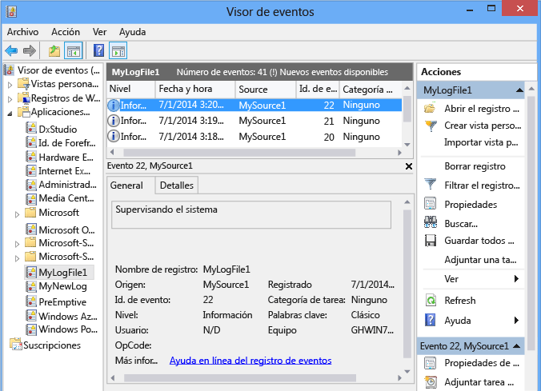

# <a name="walkthrough-creating-a-windows-service-application-in-the-component-designer"></a><span data-ttu-id="a8056-102">Tutorial: Crear una aplicación de servicios de Windows en el Diseñador de componentes</span><span class="sxs-lookup"><span data-stu-id="a8056-102">Walkthrough: Creating a Windows Service Application in the Component Designer</span></span>
<span data-ttu-id="a8056-103">En este artículo se demuestra cómo crear una sencilla aplicación de servicio de Windows en Visual Studio que escribe mensajes en un registro de eventos.</span><span class="sxs-lookup"><span data-stu-id="a8056-103">This article demonstrates how to create a simple Windows Service application in Visual Studio that writes messages to an event log.</span></span> <span data-ttu-id="a8056-104">A continuación se incluyen los pasos básicos que se realizan para crear y usar el servicio:</span><span class="sxs-lookup"><span data-stu-id="a8056-104">Here are the basic steps that you perform to create and use your service:</span></span>  
  
1.  <span data-ttu-id="a8056-105">[Crear un servicio](#BK_CreateProject) mediante la plantilla del proyecto **Servicio de Windows** y configurarlo.</span><span class="sxs-lookup"><span data-stu-id="a8056-105">[Creating a Service](#BK_CreateProject) by using the **Windows Service** project template, and configure it.</span></span> <span data-ttu-id="a8056-106">Esta plantilla crea una clase que hereda de <xref:System.ServiceProcess.ServiceBase?displayProperty=nameWithType> y escribe gran parte del código básico del servicio, como el código que lo inicia.</span><span class="sxs-lookup"><span data-stu-id="a8056-106">This template creates a class for you that inherits from <xref:System.ServiceProcess.ServiceBase?displayProperty=nameWithType> and writes much of the basic service code, such as the code to start the service.</span></span>  
  
2.  <span data-ttu-id="a8056-107">[Agregar características al servicio](#BK_WriteCode) para los procedimientos <xref:System.ServiceProcess.ServiceBase.OnStart%2A> y <xref:System.ServiceProcess.ServiceBase.OnStop%2A> , y reemplazar los otros métodos que quiera redefinir.</span><span class="sxs-lookup"><span data-stu-id="a8056-107">[Adding Features to the Service](#BK_WriteCode) for the <xref:System.ServiceProcess.ServiceBase.OnStart%2A> and <xref:System.ServiceProcess.ServiceBase.OnStop%2A> procedures, and override any other methods that you want to redefine.</span></span>  
  
3.  <span data-ttu-id="a8056-108">[Configurar el estado del servicio](#BK_SetStatus).</span><span class="sxs-lookup"><span data-stu-id="a8056-108">[Setting Service Status](#BK_SetStatus).</span></span> <span data-ttu-id="a8056-109">De manera predeterminada, los servicios creados con <xref:System.ServiceProcess.ServiceBase?displayProperty=nameWithType> implementan solo un subconjunto de las marcas de estado disponibles.</span><span class="sxs-lookup"><span data-stu-id="a8056-109">By default, services created with <xref:System.ServiceProcess.ServiceBase?displayProperty=nameWithType> implement only a subset of the available status flags.</span></span> <span data-ttu-id="a8056-110">Si el servicio tarda mucho tiempo en iniciarse, pausarse o detenerse, puede implementar valores de estado como Inicio pendiente o Finalización pendiente para indicar que está trabajando en una operación.</span><span class="sxs-lookup"><span data-stu-id="a8056-110">If your service takes a long time to start up, pause, or stop, you can implement status values such as Start Pending or Stop Pending to indicate that it's working on an operation.</span></span>  
  
4.  <span data-ttu-id="a8056-111">[Agregar instaladores al servicio](#BK_AddInstallers) para la aplicación de servicio.</span><span class="sxs-lookup"><span data-stu-id="a8056-111">[Adding Installers to the Service](#BK_AddInstallers) for your service application.</span></span>  
  
5.  <span data-ttu-id="a8056-112">(Opcional) [Establecer parámetros de inicio](#BK_StartupParameters), especificar los argumentos de inicio predeterminados y permitir a los usuarios reemplazar la configuración predeterminada al iniciar el servicio manualmente.</span><span class="sxs-lookup"><span data-stu-id="a8056-112">(Optional) [Set Startup Parameters](#BK_StartupParameters), specify default startup arguments, and enable users to override default settings when they start your service manually.</span></span>  
  
6.  <span data-ttu-id="a8056-113">[Compilar el servicio](#BK_Build).</span><span class="sxs-lookup"><span data-stu-id="a8056-113">[Building the Service](#BK_Build).</span></span>  
  
7.  <span data-ttu-id="a8056-114">[Instalar el servicio](#BK_Install) en el equipo local.</span><span class="sxs-lookup"><span data-stu-id="a8056-114">[Installing the Service](#BK_Install) on the local machine.</span></span>  
  
8.  <span data-ttu-id="a8056-115">Obtener acceso al Administrador de control de servicios de Windows e [Iniciar y ejecutar el servicio](#BK_StartService).</span><span class="sxs-lookup"><span data-stu-id="a8056-115">Access the Windows Service Control Manager and [Starting and Running the Service](#BK_StartService).</span></span>  
  
9. <span data-ttu-id="a8056-116">[Desinstalar un servicio de Windows](#BK_Uninstall).</span><span class="sxs-lookup"><span data-stu-id="a8056-116">[Uninstalling a Windows Service](#BK_Uninstall).</span></span>  
  
> [!WARNING]
>  <span data-ttu-id="a8056-117">La plantilla de proyecto Servicios de Windows que se requiere para este tutorial no está disponible en la edición Express de Visual Studio.</span><span class="sxs-lookup"><span data-stu-id="a8056-117">The Windows Services project template that is required for this walkthrough is not available in the Express edition of Visual Studio.</span></span>  
  
 [!INCLUDE[note_settings_general](../../../includes/note-settings-general-md.md)]  
  
<a name="BK_CreateProject"></a>   
## <a name="creating-a-service"></a><span data-ttu-id="a8056-118">Crear un servicio</span><span class="sxs-lookup"><span data-stu-id="a8056-118">Creating a Service</span></span>  
 <span data-ttu-id="a8056-119">Para empezar, debe crear el proyecto y definir los valores necesarios para que el servicio funcione correctamente.</span><span class="sxs-lookup"><span data-stu-id="a8056-119">To begin, you create the project and set values that are required for the service to function correctly.</span></span>  
  
#### <a name="to-create-and-configure-your-service"></a><span data-ttu-id="a8056-120">Para crear y configurar el servicio</span><span class="sxs-lookup"><span data-stu-id="a8056-120">To create and configure your service</span></span>  
  
1.  <span data-ttu-id="a8056-121">En Visual Studio, en la barra de menús, elija **Archivo**, **Nuevo**, **Proyecto**.</span><span class="sxs-lookup"><span data-stu-id="a8056-121">In Visual Studio, on the menu bar, choose **File**, **New**, **Project**.</span></span>  
  
     <span data-ttu-id="a8056-122">Aparece el cuadro de diálogo **Nuevo proyecto** .</span><span class="sxs-lookup"><span data-stu-id="a8056-122">The **New Project** dialog box opens.</span></span>  
  
2.  <span data-ttu-id="a8056-123">Seleccione **Servicio de Windows**en la lista de plantillas de proyecto de Visual Basic o Visual C# y asigne al proyecto el nombre **MyNewService**.</span><span class="sxs-lookup"><span data-stu-id="a8056-123">In the list of Visual Basic or Visual C# project templates, choose **Windows Service**, and name the project **MyNewService**.</span></span> <span data-ttu-id="a8056-124">Elija **Aceptar**.</span><span class="sxs-lookup"><span data-stu-id="a8056-124">Choose **OK**.</span></span>  
  
     <span data-ttu-id="a8056-125">La plantilla de proyecto agrega automáticamente una clase de componente, denominada `Service1`, que hereda de <xref:System.ServiceProcess.ServiceBase?displayProperty=nameWithType>.</span><span class="sxs-lookup"><span data-stu-id="a8056-125">The project template automatically adds a component class named `Service1` that inherits from <xref:System.ServiceProcess.ServiceBase?displayProperty=nameWithType>.</span></span>  
  
3.  <span data-ttu-id="a8056-126">En el menú **Editar** , elija **Buscar y reemplazar**, **Buscar en archivos** (teclado: Ctrl+Mayús+F).</span><span class="sxs-lookup"><span data-stu-id="a8056-126">On the **Edit** menu, choose **Find and Replace**, **Find in Files** (Keyboard: Ctrl+Shift+F).</span></span> <span data-ttu-id="a8056-127">Cambie todas las apariciones de `Service1` a `MyNewService`.</span><span class="sxs-lookup"><span data-stu-id="a8056-127">Change all occurrences of `Service1` to `MyNewService`.</span></span> <span data-ttu-id="a8056-128">Encontrará casos en Service1.cs, Program.cs y Service1.Designer.cs (o sus equivalentes .vb).</span><span class="sxs-lookup"><span data-stu-id="a8056-128">You’ll find instances in Service1.cs, Program.cs, and Service1.Designer.cs (or their .vb equivalents).</span></span>  
  
4.  <span data-ttu-id="a8056-129">En la ventana **Propiedades** para **Service1.cs [Diseño]** o **Service1.vb [Diseño]**, establezca <xref:System.ServiceProcess.ServiceBase.ServiceName%2A> y la propiedad **(Name)** para `Service1` en **MyNewService**, si todavía no están establecidos.</span><span class="sxs-lookup"><span data-stu-id="a8056-129">In the **Properties** window for **Service1.cs [Design]** or **Service1.vb [Design]**, set the <xref:System.ServiceProcess.ServiceBase.ServiceName%2A> and the **(Name)** property for `Service1` to **MyNewService**, if it's not already set.</span></span>  
  
5.  <span data-ttu-id="a8056-130">En el Explorador de soluciones, cambie el nombre de **Service1.cs** a **MyNewService.cs**o de **Service1.vb** a **MyNewService.vb**.</span><span class="sxs-lookup"><span data-stu-id="a8056-130">In Solution Explorer, rename **Service1.cs** to **MyNewService.cs**, or **Service1.vb** to **MyNewService.vb**.</span></span>  
  
<a name="BK_WriteCode"></a>   
## <a name="adding-features-to-the-service"></a><span data-ttu-id="a8056-131">Agregar características al servicio</span><span class="sxs-lookup"><span data-stu-id="a8056-131">Adding Features to the Service</span></span>  
 <span data-ttu-id="a8056-132">En esta sección, agregará un registro de eventos personalizado al servicio de Windows.</span><span class="sxs-lookup"><span data-stu-id="a8056-132">In this section, you add a custom event log to the Windows service.</span></span> <span data-ttu-id="a8056-133">Los registros de eventos no están asociados de ningún modo a los servicios de Windows.</span><span class="sxs-lookup"><span data-stu-id="a8056-133">Event logs are not associated in any way with Windows services.</span></span> <span data-ttu-id="a8056-134">Aquí, el componente <xref:System.Diagnostics.EventLog> se utiliza como ejemplo del tipo de componente que se puede agregar a un servicio de Windows.</span><span class="sxs-lookup"><span data-stu-id="a8056-134">Here the <xref:System.Diagnostics.EventLog> component is used as an example of the type of component you could add to a Windows service.</span></span>  
  
#### <a name="to-add-custom-event-log-functionality-to-your-service"></a><span data-ttu-id="a8056-135">Para agregar la funcionalidad de registro de eventos personalizado al servicio</span><span class="sxs-lookup"><span data-stu-id="a8056-135">To add custom event log functionality to your service</span></span>  
  
1.  <span data-ttu-id="a8056-136">En el **Explorador de soluciones**, abra el menú contextual de **MyNewService.cs** o **MyNewService.vb**y, a continuación, elija **Diseñador de vistas**.</span><span class="sxs-lookup"><span data-stu-id="a8056-136">In **Solution Explorer**, open the context menu for **MyNewService.cs** or **MyNewService.vb**, and then choose **View Designer**.</span></span>  
  
2.  <span data-ttu-id="a8056-137">En la sección **Componentes** del **Cuadro de herramientas**, arrastre un componente <xref:System.Diagnostics.EventLog> hasta el diseñador.</span><span class="sxs-lookup"><span data-stu-id="a8056-137">From the **Components** section of the **Toolbox**, drag an <xref:System.Diagnostics.EventLog> component to the designer.</span></span>  
  
3.  <span data-ttu-id="a8056-138">En el **Explorador de soluciones**, abra el menú contextual de **MyNewService.cs** o **MyNewService.vb**y, a continuación, elija **Ver código**.</span><span class="sxs-lookup"><span data-stu-id="a8056-138">In **Solution Explorer**, open the context menu for **MyNewService.cs** or **MyNewService.vb**, and then choose **View Code**.</span></span>  
  
4.  <span data-ttu-id="a8056-139">Agregue una declaración para el objeto **eventLog** en la clase `MyNewService` , después de la línea que declara la variable `components` :</span><span class="sxs-lookup"><span data-stu-id="a8056-139">Add a declaration for the **eventLog** object in the `MyNewService` class, right after the line that declares the `components` variable:</span></span>  
  
     [!code-csharp[VbRadconService#16](../../../samples/snippets/csharp/VS_Snippets_VBCSharp/VbRadconService/CS/MyNewService.cs#16)]
     [!code-vb[VbRadconService#16](../../../samples/snippets/visualbasic/VS_Snippets_VBCSharp/VbRadconService/VB/MyNewService.vb#16)]  
  
5.  <span data-ttu-id="a8056-140">Agregue o edite el constructor para definir un registro de eventos personalizado:</span><span class="sxs-lookup"><span data-stu-id="a8056-140">Add or edit the constructor to define a custom event log:</span></span>  
  
     [!code-csharp[VbRadconService#2](../../../samples/snippets/csharp/VS_Snippets_VBCSharp/VbRadconService/CS/MyNewService.cs#2)]
     [!code-vb[VbRadconService#2](../../../samples/snippets/visualbasic/VS_Snippets_VBCSharp/VbRadconService/VB/MyNewService.vb#2)]  
  
#### <a name="to-define-what-occurs-when-the-service-starts"></a><span data-ttu-id="a8056-141">Para definir qué ocurre al iniciar el servicio</span><span class="sxs-lookup"><span data-stu-id="a8056-141">To define what occurs when the service starts</span></span>  
  
-   <span data-ttu-id="a8056-142">En el Editor de código, busque el método <xref:System.ServiceProcess.ServiceBase.OnStart%2A> que se reemplazó automáticamente al crear el proyecto y reemplace el código con lo siguiente.</span><span class="sxs-lookup"><span data-stu-id="a8056-142">In the Code Editor, locate the <xref:System.ServiceProcess.ServiceBase.OnStart%2A> method that was automatically overridden when you created the project, and replace the code with the following.</span></span> <span data-ttu-id="a8056-143">Agrega una entrada al registro de eventos cuando el servicio comienza a ejecutarse:</span><span class="sxs-lookup"><span data-stu-id="a8056-143">This adds an entry to the event log when the service starts running:</span></span>  
  
     [!code-csharp[VbRadconService#3](../../../samples/snippets/csharp/VS_Snippets_VBCSharp/VbRadconService/CS/MyNewService.cs#3)]
     [!code-vb[VbRadconService#3](../../../samples/snippets/visualbasic/VS_Snippets_VBCSharp/VbRadconService/VB/MyNewService.vb#3)]  
  
     <span data-ttu-id="a8056-144">Una aplicación de servicio está diseñada para ejecutarse a largo plazo, por lo que suele sondear o supervisar algún elemento del sistema.</span><span class="sxs-lookup"><span data-stu-id="a8056-144">A service application is designed to be long-running, so it usually polls or monitors something in the system.</span></span> <span data-ttu-id="a8056-145">La supervisión se puede establecer en el método <xref:System.ServiceProcess.ServiceBase.OnStart%2A> .</span><span class="sxs-lookup"><span data-stu-id="a8056-145">The monitoring is set up in the <xref:System.ServiceProcess.ServiceBase.OnStart%2A> method.</span></span> <span data-ttu-id="a8056-146">Sin embargo, <xref:System.ServiceProcess.ServiceBase.OnStart%2A> no lleva a cabo la supervisión.</span><span class="sxs-lookup"><span data-stu-id="a8056-146">However, <xref:System.ServiceProcess.ServiceBase.OnStart%2A> doesn’t actually do the monitoring.</span></span> <span data-ttu-id="a8056-147">El método <xref:System.ServiceProcess.ServiceBase.OnStart%2A> debe volver al sistema operativo después de que haya comenzado el funcionamiento del servicio.</span><span class="sxs-lookup"><span data-stu-id="a8056-147">The <xref:System.ServiceProcess.ServiceBase.OnStart%2A> method must return to the operating system after the service's operation has begun.</span></span> <span data-ttu-id="a8056-148">No debe bloquearse ni ejecutar un bucle infinito.</span><span class="sxs-lookup"><span data-stu-id="a8056-148">It must not loop forever or block.</span></span> <span data-ttu-id="a8056-149">Para establecer un mecanismo de sondeo sencillo, puede usar el componente <xref:System.Timers.Timer?displayProperty=nameWithType> de la siguiente manera: en el método <xref:System.ServiceProcess.ServiceBase.OnStart%2A>, establezca los parámetros en el componente y, a continuación, establezca la propiedad <xref:System.Timers.Timer.Enabled%2A> en `true`.</span><span class="sxs-lookup"><span data-stu-id="a8056-149">To set up a simple polling mechanism, you can use the <xref:System.Timers.Timer?displayProperty=nameWithType> component as follows: In the <xref:System.ServiceProcess.ServiceBase.OnStart%2A> method, set parameters on the component, and then set the <xref:System.Timers.Timer.Enabled%2A> property to `true`.</span></span> <span data-ttu-id="a8056-150">El temporizador activa eventos periódicamente en el código y, en esos instantes, el servicio podría realizar su control.</span><span class="sxs-lookup"><span data-stu-id="a8056-150">The timer raises events in your code periodically, at which time your service could do its monitoring.</span></span> <span data-ttu-id="a8056-151">Para ello puede usar el código siguiente:</span><span class="sxs-lookup"><span data-stu-id="a8056-151">You can use the following code to do this:</span></span>  
  
    ```csharp  
    // Set up a timer to trigger every minute.  
    System.Timers.Timer timer = new System.Timers.Timer();  
    timer.Interval = 60000; // 60 seconds  
    timer.Elapsed += new System.Timers.ElapsedEventHandler(this.OnTimer);  
    timer.Start();  
    ```  
  
    ```vb  
    ' Set up a timer to trigger every minute.  
    Dim timer As System.Timers.Timer = New System.Timers.Timer()  
    timer.Interval = 60000 ' 60 seconds  
    AddHandler timer.Elapsed, AddressOf Me.OnTimer  
    timer.Start()  
    ```  
     <span data-ttu-id="a8056-152">Agregue una variable de miembro a la clase.</span><span class="sxs-lookup"><span data-stu-id="a8056-152">Add a member variable to the class.</span></span> <span data-ttu-id="a8056-153">Contendrá el identificador del siguiente evento para escribir en el registro de eventos.</span><span class="sxs-lookup"><span data-stu-id="a8056-153">It will contain the identifier of the next event to write into the event log.</span></span>

    ```csharp
    private int eventId = 1;
    ```

    ```vb
    Private eventId As Integer = 1
    ```

     <span data-ttu-id="a8056-154">Agregue código para controlar el evento de temporizador:</span><span class="sxs-lookup"><span data-stu-id="a8056-154">Add code to handle the timer event:</span></span>  
  
    ```csharp  
    public void OnTimer(object sender, System.Timers.ElapsedEventArgs args)  
    {  
        // TODO: Insert monitoring activities here.  
        eventLog1.WriteEntry("Monitoring the System", EventLogEntryType.Information, eventId++);  
    }  
    ```  
  
    ```vb  
    Private Sub OnTimer(sender As Object, e As Timers.ElapsedEventArgs)  
        ' TODO: Insert monitoring activities here.  
        eventLog1.WriteEntry("Monitoring the System", EventLogEntryType.Information, eventId)  
        eventId = eventId + 1  
    End Sub  
    ```  
  
     <span data-ttu-id="a8056-155">Es posible que desee realizar tareas mediante el uso de subprocesos de trabajo en segundo plano en lugar de ejecutar todo el trabajo en el subproceso principal.</span><span class="sxs-lookup"><span data-stu-id="a8056-155">You might want to perform tasks by using background worker threads instead of running all your work on the main thread.</span></span> <span data-ttu-id="a8056-156">Para obtener un ejemplo de esto, vea la página de referencia de <xref:System.ServiceProcess.ServiceBase?displayProperty=nameWithType>.</span><span class="sxs-lookup"><span data-stu-id="a8056-156">For an example of this, see the <xref:System.ServiceProcess.ServiceBase?displayProperty=nameWithType> reference page.</span></span>  
  
#### <a name="to-define-what-occurs-when-the-service-is-stopped"></a><span data-ttu-id="a8056-157">Para definir qué debe ocurrir al detener el servicio</span><span class="sxs-lookup"><span data-stu-id="a8056-157">To define what occurs when the service is stopped</span></span>  
  
-   <span data-ttu-id="a8056-158">Reemplace el código del método <xref:System.ServiceProcess.ServiceBase.OnStop%2A> por el código siguiente:</span><span class="sxs-lookup"><span data-stu-id="a8056-158">Replace the code for the <xref:System.ServiceProcess.ServiceBase.OnStop%2A> method with the following.</span></span> <span data-ttu-id="a8056-159">Agrega una entrada al registro de eventos cuando el servicio se detiene:</span><span class="sxs-lookup"><span data-stu-id="a8056-159">This adds an entry to the event log when the service is stopped:</span></span>  
  
     [!code-csharp[VbRadconService#4](../../../samples/snippets/csharp/VS_Snippets_VBCSharp/VbRadconService/CS/MyNewService.cs#4)]
     [!code-vb[VbRadconService#4](../../../samples/snippets/visualbasic/VS_Snippets_VBCSharp/VbRadconService/VB/MyNewService.vb#4)]  
  
 <span data-ttu-id="a8056-160">En la siguiente sección, puede reemplazar los métodos <xref:System.ServiceProcess.ServiceBase.OnPause%2A>, <xref:System.ServiceProcess.ServiceBase.OnContinue%2A>, y <xref:System.ServiceProcess.ServiceBase.OnShutdown%2A> para definir procesamiento adicional para el componente.</span><span class="sxs-lookup"><span data-stu-id="a8056-160">In the next section, you can override the <xref:System.ServiceProcess.ServiceBase.OnPause%2A>, <xref:System.ServiceProcess.ServiceBase.OnContinue%2A>, and <xref:System.ServiceProcess.ServiceBase.OnShutdown%2A> methods to define additional processing for your component.</span></span>  
  
#### <a name="to-define-other-actions-for-the-service"></a><span data-ttu-id="a8056-161">Para definir otras acciones para el servicio</span><span class="sxs-lookup"><span data-stu-id="a8056-161">To define other actions for the service</span></span>  
  
-   <span data-ttu-id="a8056-162">Localice el método que desee controlar y reemplácelo para definir lo que desea que suceda.</span><span class="sxs-lookup"><span data-stu-id="a8056-162">Locate the method that you want to handle, and override it to define what you want to occur.</span></span>  
  
     <span data-ttu-id="a8056-163">En el siguiente código se muestra cómo reemplazar el método <xref:System.ServiceProcess.ServiceBase.OnContinue%2A> :</span><span class="sxs-lookup"><span data-stu-id="a8056-163">The following code shows how you can override the <xref:System.ServiceProcess.ServiceBase.OnContinue%2A> method:</span></span>  
  
     [!code-csharp[VbRadconService#5](../../../samples/snippets/csharp/VS_Snippets_VBCSharp/VbRadconService/CS/MyNewService.cs#5)]
     [!code-vb[VbRadconService#5](../../../samples/snippets/visualbasic/VS_Snippets_VBCSharp/VbRadconService/VB/MyNewService.vb#5)]  
  
 <span data-ttu-id="a8056-164">Deben realizarse algunas acciones personalizadas cuando la clase <xref:System.Configuration.Install.Installer> instala un servicio de Windows.</span><span class="sxs-lookup"><span data-stu-id="a8056-164">Some custom actions have to occur when a Windows service is installed by the <xref:System.Configuration.Install.Installer> class.</span></span> <span data-ttu-id="a8056-165">Visual Studio puede crear estos instaladores específicamente para un servicio de Windows y agregarlos al proyecto.</span><span class="sxs-lookup"><span data-stu-id="a8056-165">Visual Studio can create these installers specifically for a Windows service and add them to your project.</span></span>  
  
<a name="BK_SetStatus"></a>   
## <a name="setting-service-status"></a><span data-ttu-id="a8056-166">Configurar el estado del servicio</span><span class="sxs-lookup"><span data-stu-id="a8056-166">Setting Service Status</span></span>  
 <span data-ttu-id="a8056-167">Los servicios informan de su estado al Administrador de control de servicios, para que los usuarios puedan saber si un servicio funciona correctamente.</span><span class="sxs-lookup"><span data-stu-id="a8056-167">Services report their status to the Service Control Manager, so that users can tell whether a service is functioning correctly.</span></span> <span data-ttu-id="a8056-168">De manera predeterminada, los servicios que se heredan de <xref:System.ServiceProcess.ServiceBase> informan de un conjunto limitado de parámetros de estado, incluidos Detenido, En pausa y En ejecución.</span><span class="sxs-lookup"><span data-stu-id="a8056-168">By default, services that inherit from <xref:System.ServiceProcess.ServiceBase> report a limited set of status settings, including Stopped, Paused, and Running.</span></span> <span data-ttu-id="a8056-169">Si un servicio tarda un poco en iniciarse, puede ser útil informar de un estado Inicio pendiente.</span><span class="sxs-lookup"><span data-stu-id="a8056-169">If a service takes a little while to start up, it might be helpful to report a Start Pending status.</span></span> <span data-ttu-id="a8056-170">También puede implementar la configuración de estado Inicio pendiente y Detención pendiente si agrega código que llama a la [función SetServiceStatus](http://msdn.microsoft.com/library/windows/desktop/ms686241.aspx)de Windows.</span><span class="sxs-lookup"><span data-stu-id="a8056-170">You can also implement the Start Pending and Stop Pending status settings by adding code that calls into the Windows [SetServiceStatus function](http://msdn.microsoft.com/library/windows/desktop/ms686241.aspx).</span></span>  
  
#### <a name="to-implement-service-pending-status"></a><span data-ttu-id="a8056-171">Para implementar el estado pendiente del servicio</span><span class="sxs-lookup"><span data-stu-id="a8056-171">To implement service pending status</span></span>  
  
1.  <span data-ttu-id="a8056-172">Agregue una instrucción `using` o una declaración `Imports` al espacio de nombres <xref:System.Runtime.InteropServices?displayProperty=nameWithType> en el archivo MyNewService.cs o MyNewService.vb:</span><span class="sxs-lookup"><span data-stu-id="a8056-172">Add a `using` statement or `Imports` declaration to the <xref:System.Runtime.InteropServices?displayProperty=nameWithType> namespace in the MyNewService.cs or MyNewService.vb file:</span></span>  
  
    ```csharp  
    using System.Runtime.InteropServices;  
    ```  
  
    ```vb  
    Imports System.Runtime.InteropServices  
    ```  
  
2.  <span data-ttu-id="a8056-173">Agregue el código siguiente a MyNewService.cs para declarar los valores de `ServiceState` y agregue una estructura para el estado, que usará en una llamada de invocación de plataforma:</span><span class="sxs-lookup"><span data-stu-id="a8056-173">Add the following code to MyNewService.cs to declare the `ServiceState` values and to add a structure for the status, which you'll use in a platform invoke call:</span></span>  
  
    ```csharp  
    public enum ServiceState  
      {  
          SERVICE_STOPPED = 0x00000001,  
          SERVICE_START_PENDING = 0x00000002,  
          SERVICE_STOP_PENDING = 0x00000003,  
          SERVICE_RUNNING = 0x00000004,  
          SERVICE_CONTINUE_PENDING = 0x00000005,  
          SERVICE_PAUSE_PENDING = 0x00000006,  
          SERVICE_PAUSED = 0x00000007,  
      }  
  
      [StructLayout(LayoutKind.Sequential)]  
      public struct ServiceStatus  
      {  
          public int dwServiceType;  
          public ServiceState dwCurrentState;  
          public int dwControlsAccepted;  
          public int dwWin32ExitCode;  
          public int dwServiceSpecificExitCode;  
          public int dwCheckPoint;  
          public int dwWaitHint;  
      };  
    ```  
  
    ```vb  
    Public Enum ServiceState  
        SERVICE_STOPPED = 1  
        SERVICE_START_PENDING = 2  
        SERVICE_STOP_PENDING = 3  
        SERVICE_RUNNING = 4  
        SERVICE_CONTINUE_PENDING = 5  
        SERVICE_PAUSE_PENDING = 6  
        SERVICE_PAUSED = 7  
    End Enum  
  
    <StructLayout(LayoutKind.Sequential)>  
    Public Structure ServiceStatus  
        Public dwServiceType As Long  
        Public dwCurrentState As ServiceState  
        Public dwControlsAccepted As Long  
        Public dwWin32ExitCode As Long  
        Public dwServiceSpecificExitCode As Long  
        Public dwCheckPoint As Long  
        Public dwWaitHint As Long  
    End Structure  
    ```  
  
3.  <span data-ttu-id="a8056-174">Ahora, en la clase `MyNewService` , declare la [función SetServiceStatus](http://msdn.microsoft.com/library/windows/desktop/ms686241.aspx) con la plataforma de invocación:</span><span class="sxs-lookup"><span data-stu-id="a8056-174">Now, in the `MyNewService` class, declare the [SetServiceStatus function](http://msdn.microsoft.com/library/windows/desktop/ms686241.aspx) by using platform invoke:</span></span>  
  
    ```csharp  
    [DllImport("advapi32.dll", SetLastError=true)]  
            private static extern bool SetServiceStatus(IntPtr handle, ref ServiceStatus serviceStatus);  
    ```  
  
    ```vb  
    Declare Auto Function SetServiceStatus Lib "advapi32.dll" (ByVal handle As IntPtr, ByRef serviceStatus As ServiceStatus) As Boolean  
    ```  
  
4.  <span data-ttu-id="a8056-175">Para implementar el estado Inicio pendiente, agregue el código siguiente al principio del método <xref:System.ServiceProcess.ServiceBase.OnStart%2A> :</span><span class="sxs-lookup"><span data-stu-id="a8056-175">To implement the Start Pending status, add the following code to the beginning of the <xref:System.ServiceProcess.ServiceBase.OnStart%2A> method:</span></span>  
  
    ```csharp  
    // Update the service state to Start Pending.  
    ServiceStatus serviceStatus = new ServiceStatus();  
    serviceStatus.dwCurrentState = ServiceState.SERVICE_START_PENDING;  
    serviceStatus.dwWaitHint = 100000;  
    SetServiceStatus(this.ServiceHandle, ref serviceStatus);  
    ```  
  
    ```vb  
    ' Update the service state to Start Pending.  
    Dim serviceStatus As ServiceStatus = New ServiceStatus()  
    serviceStatus.dwCurrentState = ServiceState.SERVICE_START_PENDING  
    serviceStatus.dwWaitHint = 100000  
    SetServiceStatus(Me.ServiceHandle, serviceStatus)  
    ```  
  
5.  <span data-ttu-id="a8056-176">Agregue código para establecer el estado en En ejecución al final del método <xref:System.ServiceProcess.ServiceBase.OnStart%2A> .</span><span class="sxs-lookup"><span data-stu-id="a8056-176">Add code to set the status to Running at the end of the <xref:System.ServiceProcess.ServiceBase.OnStart%2A> method.</span></span>  
  
    ```csharp
    // Update the service state to Running.  
    serviceStatus.dwCurrentState = ServiceState.SERVICE_RUNNING;  
    SetServiceStatus(this.ServiceHandle, ref serviceStatus);  
    ```  
  
    ```vb  
    ' Update the service state to Running.  
    serviceStatus.dwCurrentState = ServiceState.SERVICE_RUNNING  
    SetServiceStatus(Me.ServiceHandle, serviceStatus)  
    ```  
  
6.  <span data-ttu-id="a8056-177">(Opcional) Repita este procedimiento para el método <xref:System.ServiceProcess.ServiceBase.OnStop%2A> .</span><span class="sxs-lookup"><span data-stu-id="a8056-177">(Optional) Repeat this procedure for the <xref:System.ServiceProcess.ServiceBase.OnStop%2A> method.</span></span>  
  
> [!CAUTION]
>  <span data-ttu-id="a8056-178">Aparece el cuadro de diálogo [Administrador de control de servicios](http://msdn.microsoft.com/library/windows/desktop/ms685150.aspx) usa los miembros `dwWaitHint` y `dwCheckpoint` de la [estructura SERVICE_STATUS](http://msdn.microsoft.com/library/windows/desktop/ms685996.aspx) para determinar durante cuánto tiempo hay que esperar a que un servicio de Windows se inicie o apague.</span><span class="sxs-lookup"><span data-stu-id="a8056-178">The [Service Control Manager](http://msdn.microsoft.com/library/windows/desktop/ms685150.aspx) uses the `dwWaitHint` and `dwCheckpoint` members of the [SERVICE_STATUS structure](http://msdn.microsoft.com/library/windows/desktop/ms685996.aspx) to determine how much time to wait for a Windows Service to start or shut down.</span></span> <span data-ttu-id="a8056-179">Si los métodos <xref:System.ServiceProcess.ServiceBase.OnStart%2A> y <xref:System.ServiceProcess.ServiceBase.OnStop%2A> se ejecutan durante mucho tiempo, el servicio puede solicitar más tiempo por medio de una llamada a [SetServiceStatus](http://msdn.microsoft.com/library/windows/desktop/ms686241.aspx) de nuevo con un valor de `dwCheckPoint` incrementado.</span><span class="sxs-lookup"><span data-stu-id="a8056-179">If your <xref:System.ServiceProcess.ServiceBase.OnStart%2A> and <xref:System.ServiceProcess.ServiceBase.OnStop%2A> methods run long, your service can request more time by calling [SetServiceStatus](http://msdn.microsoft.com/library/windows/desktop/ms686241.aspx) again with an incremented `dwCheckPoint` value.</span></span>  
  
<a name="BK_AddInstallers"></a>   
## <a name="adding-installers-to-the-service"></a><span data-ttu-id="a8056-180">Agregar instaladores al servicio</span><span class="sxs-lookup"><span data-stu-id="a8056-180">Adding Installers to the Service</span></span>  
 <span data-ttu-id="a8056-181">Para poder ejecutar un servicio de Windows, antes debe instalarlo, lo que lo registra con el Administrador de control de servicios.</span><span class="sxs-lookup"><span data-stu-id="a8056-181">Before you can run a Windows Service, you need to install it, which registers it with the Service Control Manager.</span></span> <span data-ttu-id="a8056-182">Puede agregar instaladores al proyecto que controlen los detalles del registro.</span><span class="sxs-lookup"><span data-stu-id="a8056-182">You can add installers to your project that handle the registration details.</span></span>  
  
#### <a name="to-create-the-installers-for-your-service"></a><span data-ttu-id="a8056-183">Para crear los instaladores necesarios para el servicio</span><span class="sxs-lookup"><span data-stu-id="a8056-183">To create the installers for your service</span></span>  
  
1.  <span data-ttu-id="a8056-184">En el **Explorador de soluciones**, abra el menú contextual de **MyNewService.cs** o **MyNewService.vb**y, a continuación, elija **Diseñador de vistas**.</span><span class="sxs-lookup"><span data-stu-id="a8056-184">In **Solution Explorer**, open the context menu for **MyNewService.cs** or **MyNewService.vb**, and then choose **View Designer**.</span></span>  
  
2.  <span data-ttu-id="a8056-185">Haga clic en el fondo del diseñador para seleccionar el propio servicio, en vez de cualquier elemento de su contenido.</span><span class="sxs-lookup"><span data-stu-id="a8056-185">Click the background of the designer to select the service itself, instead of any of its contents.</span></span>  
  
3.  <span data-ttu-id="a8056-186">Abra el menú contextual de la ventana del diseñador (si usa un dispositivo señalador, haga clic con el botón secundario dentro de la ventana) y, a continuación, elija **Agregar instalador**.</span><span class="sxs-lookup"><span data-stu-id="a8056-186">Open the context menu for the designer window (if you’re using a pointing device, right-click inside the window), and then choose **Add Installer**.</span></span>  
  
     <span data-ttu-id="a8056-187">De forma predeterminada, se agrega al proyecto una clase de componente que contiene dos instaladores.</span><span class="sxs-lookup"><span data-stu-id="a8056-187">By default, a component class that contains two installers is added to your project.</span></span> <span data-ttu-id="a8056-188">El componente se denomina **ProjectInstaller**, y los instaladores que contiene son el instalador para el servicio y el instalador para el proceso asociado al servicio.</span><span class="sxs-lookup"><span data-stu-id="a8056-188">The component is named **ProjectInstaller**, and the installers it contains are the installer for your service and the installer for the service's associated process.</span></span>  
  
4.  <span data-ttu-id="a8056-189">En la vista **Diseño** de **ProjectInstaller**, elija **serviceInstaller1** para un proyecto de Visual C# o **ServiceInstaller1** para un proyecto de Visual Basic.</span><span class="sxs-lookup"><span data-stu-id="a8056-189">In **Design** view for **ProjectInstaller**, choose **serviceInstaller1** for a Visual C# project, or **ServiceInstaller1** for a Visual Basic project.</span></span>  
  
5.  <span data-ttu-id="a8056-190">En la ventana **Propiedades** , asegúrese de que la propiedad <xref:System.ServiceProcess.ServiceInstaller.ServiceName%2A> esté establecida en **MyNewService**.</span><span class="sxs-lookup"><span data-stu-id="a8056-190">In the **Properties** window, make sure the <xref:System.ServiceProcess.ServiceInstaller.ServiceName%2A> property is set to **MyNewService**.</span></span>  
  
6.  <span data-ttu-id="a8056-191">Establezca texto en la propiedad **Descripción** , como "Servicio de ejemplo".</span><span class="sxs-lookup"><span data-stu-id="a8056-191">Set the **Description** property to some text, such as "A sample service".</span></span> <span data-ttu-id="a8056-192">Este texto aparece en la ventana Servicios y ayuda al usuario a identificar el servicio y comprender para qué se usa.</span><span class="sxs-lookup"><span data-stu-id="a8056-192">This text appears in the Services window and helps the user identify the service and understand what it’s used for.</span></span>  
  
7.  <span data-ttu-id="a8056-193">Establezca la propiedad <xref:System.ServiceProcess.ServiceInstaller.DisplayName%2A> en el texto que desea que aparezca en la ventana Servicios en la columna **Nombre** .</span><span class="sxs-lookup"><span data-stu-id="a8056-193">Set the <xref:System.ServiceProcess.ServiceInstaller.DisplayName%2A> property to the text that you want to appear in the Services window in the **Name** column.</span></span> <span data-ttu-id="a8056-194">Por ejemplo, puede escribir "Nombre para mostrar de MyNewService".</span><span class="sxs-lookup"><span data-stu-id="a8056-194">For example, you can enter "MyNewService Display Name".</span></span> <span data-ttu-id="a8056-195">Este nombre puede ser diferente de la propiedad <xref:System.ServiceProcess.ServiceInstaller.ServiceName%2A> , que es el nombre usado por el sistema (por ejemplo, al usar el comando `net start` para iniciar el servicio).</span><span class="sxs-lookup"><span data-stu-id="a8056-195">This name can be different from the <xref:System.ServiceProcess.ServiceInstaller.ServiceName%2A> property, which is the name used by the system (for example, when you use the `net start` command to start your service).</span></span>  
  
8.  <span data-ttu-id="a8056-196">Establezca la propiedad <xref:System.ServiceProcess.ServiceInstaller.StartType%2A> en <xref:System.ServiceProcess.ServiceStartMode.Automatic>.</span><span class="sxs-lookup"><span data-stu-id="a8056-196">Set the <xref:System.ServiceProcess.ServiceInstaller.StartType%2A> property to <xref:System.ServiceProcess.ServiceStartMode.Automatic>.</span></span>  
  
     <span data-ttu-id="a8056-197"></span><span class="sxs-lookup"><span data-stu-id="a8056-197"></span></span>  
  
9. <span data-ttu-id="a8056-198">En el diseñador, elija **serviceProcessInstaller1** para un proyecto de Visual C# o **ServiceProcessInstaller1** para un proyecto de Visual Basic.</span><span class="sxs-lookup"><span data-stu-id="a8056-198">In the designer, choose **serviceProcessInstaller1** for a Visual C# project, or **ServiceProcessInstaller1** for a Visual Basic project.</span></span> <span data-ttu-id="a8056-199">Establezca la propiedad <xref:System.ServiceProcess.ServiceProcessInstaller.Account%2A> en <xref:System.ServiceProcess.ServiceAccount.LocalSystem>.</span><span class="sxs-lookup"><span data-stu-id="a8056-199">Set the <xref:System.ServiceProcess.ServiceProcessInstaller.Account%2A> property to <xref:System.ServiceProcess.ServiceAccount.LocalSystem>.</span></span> <span data-ttu-id="a8056-200">Esto hará que se instale el servicio y se ejecute con una cuenta de servicio local.</span><span class="sxs-lookup"><span data-stu-id="a8056-200">This will cause the service to be installed and to run on a local service account.</span></span>  
  
    > [!IMPORTANT]
    >  <span data-ttu-id="a8056-201">La cuenta <xref:System.ServiceProcess.ServiceAccount.LocalSystem> tiene amplios permisos, incluida la capacidad para escribir en el registro de eventos.</span><span class="sxs-lookup"><span data-stu-id="a8056-201">The <xref:System.ServiceProcess.ServiceAccount.LocalSystem> account has broad permissions, including the ability to write to the event log.</span></span> <span data-ttu-id="a8056-202">Utilice esta cuenta con precaución porque podría aumentar el riesgo de ataques por parte de software malintencionado.</span><span class="sxs-lookup"><span data-stu-id="a8056-202">Use this account with caution, because it might increase your risk of attacks from malicious software.</span></span> <span data-ttu-id="a8056-203">Para otras tareas, considere la posibilidad de usar la cuenta <xref:System.ServiceProcess.ServiceAccount.LocalService>, que actúa como un usuario sin privilegios en el equipo local y presenta credenciales anónimas a cualquier servidor remoto.</span><span class="sxs-lookup"><span data-stu-id="a8056-203">For other tasks, consider using the <xref:System.ServiceProcess.ServiceAccount.LocalService> account, which acts as a non-privileged user on the local computer and presents anonymous credentials to any remote server.</span></span> <span data-ttu-id="a8056-204">En este ejemplo se produce un error si intenta usar la cuenta <xref:System.ServiceProcess.ServiceAccount.LocalService>, ya que necesita permiso de escritura en el registro de eventos.</span><span class="sxs-lookup"><span data-stu-id="a8056-204">This example fails if you try to use the <xref:System.ServiceProcess.ServiceAccount.LocalService> account, because it needs permission to write to the event log.</span></span>  
  
     <span data-ttu-id="a8056-205">Para obtener más información acerca de los instaladores, vea [How to: Add Installers to Your Service Application](../../../docs/framework/windows-services/how-to-add-installers-to-your-service-application.md).</span><span class="sxs-lookup"><span data-stu-id="a8056-205">For more information about installers, see [How to: Add Installers to Your Service Application](../../../docs/framework/windows-services/how-to-add-installers-to-your-service-application.md).</span></span>  
  
<a name="BK_StartupParameters"></a>   
## <a name="set-startup-parameters"></a><span data-ttu-id="a8056-206">Establecer parámetros de inicio</span><span class="sxs-lookup"><span data-stu-id="a8056-206">Set Startup Parameters</span></span>  
 <span data-ttu-id="a8056-207">Un servicio de Windows, al igual que cualquier otro archivo ejecutable, puede aceptar argumentos de línea de comandos o parámetros de inicio.</span><span class="sxs-lookup"><span data-stu-id="a8056-207">A Windows Service, like any other executable, can accept command-line arguments, or startup parameters.</span></span> <span data-ttu-id="a8056-208">Cuando se agrega código para procesar los parámetros de inicio, los usuarios pueden iniciar el servicio con sus propios parámetros de inicio personalizados mediante la ventana Servicios del Panel de control de Windows.</span><span class="sxs-lookup"><span data-stu-id="a8056-208">When you add code to process startup parameters, users can start your service with their own custom startup parameters by using the Services window in the Windows Control Panel.</span></span> <span data-ttu-id="a8056-209">Sin embargo, estos parámetros de inicio no se conservan la próxima vez que se inicia el servicio.</span><span class="sxs-lookup"><span data-stu-id="a8056-209">However, these startup parameters are not persisted the next time the service starts.</span></span> <span data-ttu-id="a8056-210">Para establecer los parámetros de inicio de manera permanente, puede establecerlos en el Registro, como se muestra en este procedimiento.</span><span class="sxs-lookup"><span data-stu-id="a8056-210">To set startup parameters permanently, you can set them in the registry, as shown in this procedure.</span></span>  
  
> [!NOTE]
>  <span data-ttu-id="a8056-211">Antes de decidirse a agregar parámetros de inicio, piense en si es la mejor manera de pasar información al servicio.</span><span class="sxs-lookup"><span data-stu-id="a8056-211">Before you decide to add startup parameters, consider whether that is the best way to pass information to your service.</span></span> <span data-ttu-id="a8056-212">Aunque los parámetros de inicio son fáciles de usar y analizar, y los usuarios los pueden reemplazar fácilmente, pueden ser más difíciles de descubrir y usar para los usuarios sin documentación.</span><span class="sxs-lookup"><span data-stu-id="a8056-212">Although startup parameters are easy to use and to parse, and users can easily override them, they might be harder for users to discover and use without documentation.</span></span> <span data-ttu-id="a8056-213">Por lo general, si el servicio requiere más de unos pocos parámetros de inicio, debe considerar el uso del Registro o un archivo de configuración en su lugar.</span><span class="sxs-lookup"><span data-stu-id="a8056-213">Generally, if your service requires more than just a few startup parameters, you should consider using the registry or a configuration file instead.</span></span> <span data-ttu-id="a8056-214">Todos los servicios de Windows tienen una entrada en el Registro en HKLM\System\CurrentControlSet\services.</span><span class="sxs-lookup"><span data-stu-id="a8056-214">Every Windows Service has an entry in the registry under HKLM\System\CurrentControlSet\services.</span></span> <span data-ttu-id="a8056-215">En la clave del servicio, se puede usar la subclave **Parameters** para almacenar la información a la que puede tener acceso su servicio.</span><span class="sxs-lookup"><span data-stu-id="a8056-215">Under the service's key, you can use the **Parameters** subkey to store information that your service can access.</span></span> <span data-ttu-id="a8056-216">Puede usar archivos de configuración de aplicación para un servicio de Windows del mismo modo que lo hace para otros tipos de programas.</span><span class="sxs-lookup"><span data-stu-id="a8056-216">You can use application configuration files for a Windows Service the same way you do for other types of programs.</span></span> <span data-ttu-id="a8056-217">Para obtener código de ejemplo, vea <xref:System.Configuration.ConfigurationManager.AppSettings%2A>.</span><span class="sxs-lookup"><span data-stu-id="a8056-217">For example code, see <xref:System.Configuration.ConfigurationManager.AppSettings%2A>.</span></span>  
  
#### <a name="adding-startup-parameters"></a><span data-ttu-id="a8056-218">Agregar parámetros de inicio</span><span class="sxs-lookup"><span data-stu-id="a8056-218">Adding startup parameters</span></span>  
  
1.  <span data-ttu-id="a8056-219">En el método `Main` de Program.cs o MyNewService.Designer.vb, agregue un argumento para la línea de comandos:</span><span class="sxs-lookup"><span data-stu-id="a8056-219">In the `Main` method in Program.cs or in MyNewService.Designer.vb, add an argument for the command line:</span></span>  
  
```csharp  
static void Main(string[] args)
{
    ServiceBase[] ServicesToRun = new ServiceBase[] { new MyNewService(args) };
    ServiceBase.Run(ServicesToRun);
}
```  
  
```vb
Shared Sub Main(ByVal cmdArgs() As String)
    Dim ServicesToRun() As System.ServiceProcess.ServiceBase = New System.ServiceProcess.ServiceBase() {New MyNewServiceVB(cmdArgs)}
    System.ServiceProcess.ServiceBase.Run(ServicesToRun)
End Sub
```  
  
2.  <span data-ttu-id="a8056-220">Cambie el constructor `MyNewService` de la siguiente forma:</span><span class="sxs-lookup"><span data-stu-id="a8056-220">Change the `MyNewService` constructor as follows:</span></span>  
  
```csharp  
public MyNewService(string[] args)
{
    InitializeComponent();
    string eventSourceName = "MySource";
    string logName = "MyNewLog";
    if (args.Count() > 0) 
    {
        eventSourceName = args[0];
    }
    if (args.Count() > 1)
    {
        logName = args[1];
    }
    eventLog1 = new System.Diagnostics.EventLog();
    if (!System.Diagnostics.EventLog.SourceExists(eventSourceName))
    {
        System.Diagnostics.EventLog.CreateEventSource(eventSourceName, logName);
    }
    eventLog1.Source = eventSourceName;
    eventLog1.Log = logName;        
}
```  
  
```vb  
Public Sub New(ByVal cmdArgs() As String)
    InitializeComponent()
    Dim eventSourceName As String = "MySource"
    Dim logName As String = "MyNewLog"
    If (cmdArgs.Count() > 0) Then
        eventSourceName = cmdArgs(0)
    End If
    If (cmdArgs.Count() > 1) Then
        logName = cmdArgs(1)
    End If
    eventLog1 = New System.Diagnostics.EventLog()
    If (Not System.Diagnostics.EventLog.SourceExists(eventSourceName)) Then
        System.Diagnostics.EventLog.CreateEventSource(eventSourceName, logName)
    End If
    eventLog1.Source = eventSourceName
    eventLog1.Log = logName
End Sub  
```  
  
<span data-ttu-id="a8056-221">Este código establece el nombre de registro y el origen de eventos según los parámetros de inicio proporcionados, o bien, usa los valores predeterminados si no se proporcionan argumentos.</span><span class="sxs-lookup"><span data-stu-id="a8056-221">This code sets the event source and log name according to the supplied startup parameters, or uses default values if no arguments are supplied.</span></span>  
  
3. <span data-ttu-id="a8056-222">Para especificar los argumentos de línea de comandos, agregue el código siguiente a la clase `ProjectInstaller` en ProjectInstaller.cs o ProjectInstaller.vb:</span><span class="sxs-lookup"><span data-stu-id="a8056-222">To specify the command-line arguments, add the following code to the `ProjectInstaller` class in ProjectInstaller.cs or ProjectInstaller.vb:</span></span>  
  
```csharp  
protected override void OnBeforeInstall(IDictionary savedState)
{
    string parameter = "MySource1\" \"MyLogFile1";
    Context.Parameters["assemblypath"] = "\"" + Context.Parameters["assemblypath"] + "\" \"" + parameter + "\"";
    base.OnBeforeInstall(savedState);
}
```

```vb  
Protected Overrides Sub OnBeforeInstall(ByVal savedState As IDictionary)
    Dim parameter As String = "MySource1"" ""MyLogFile1"
    Context.Parameters("assemblypath") = """" + Context.Parameters("assemblypath") + """ """ + parameter + """"
    MyBase.OnBeforeInstall(savedState)
End Sub  
```  
  
<span data-ttu-id="a8056-223">Este código modifica la clave del Registro **ImagePath** , que suele contener la ruta de acceso completa al archivo ejecutable para el servicio de Windows. Para ello, agrega los valores de parámetros predeterminados.</span><span class="sxs-lookup"><span data-stu-id="a8056-223">This code modifies the **ImagePath** registry key, which typically contains the full path to the executable for the Windows Service, by adding the default parameter values.</span></span> <span data-ttu-id="a8056-224">Las comillas alrededor de la ruta de acceso (y alrededor de cada parámetro individual) son obligatorias para que el servicio se inicie correctamente.</span><span class="sxs-lookup"><span data-stu-id="a8056-224">The quotation marks around the path (and around each individual parameter) are required for the service to start up correctly.</span></span> <span data-ttu-id="a8056-225">Para cambiar los parámetros de inicio para este servicio de Windows, los usuarios pueden cambiar los parámetros proporcionados en la clave del Registro **ImagePath** , aunque la mejor manera es cambiarlos mediante programación y exponer la funcionalidad a los usuarios de una manera fácil de usar (por ejemplo, en una utilidad de administración o configuración).</span><span class="sxs-lookup"><span data-stu-id="a8056-225">To change the startup parameters for this Windows Service, users can change the parameters given in the **ImagePath** registry key, although the better way is to change it programmatically and expose the functionality to users in a friendly way (for example, in a management or configuration utility).</span></span>  
  
<a name="BK_Build"></a>   
## <a name="building-the-service"></a><span data-ttu-id="a8056-226">Compilar el servicio</span><span class="sxs-lookup"><span data-stu-id="a8056-226">Building the Service</span></span>  
  
#### <a name="to-build-your-service-project"></a><span data-ttu-id="a8056-227">Para compilar el proyecto de servicio</span><span class="sxs-lookup"><span data-stu-id="a8056-227">To build your service project</span></span>  
  
1.  <span data-ttu-id="a8056-228">En el **Explorador de soluciones**, abra el menú contextual del proyecto y, a continuación, elija **Propiedades**.</span><span class="sxs-lookup"><span data-stu-id="a8056-228">In **Solution Explorer**, open the context menu for your project, and then choose **Properties**.</span></span> <span data-ttu-id="a8056-229">Aparecerán las páginas de propiedades del proyecto.</span><span class="sxs-lookup"><span data-stu-id="a8056-229">The property pages for your project  appear.</span></span>  
  
2.  <span data-ttu-id="a8056-230">En la pestaña Aplicación, en la lista **Objeto de inicio** , elija **MyNewService.Program**.</span><span class="sxs-lookup"><span data-stu-id="a8056-230">On the Application tab, in the **Startup object** list, choose **MyNewService.Program**.</span></span>  
  
3.  <span data-ttu-id="a8056-231">En el **Explorador de soluciones**, abra el menú contextual del proyecto y, a continuación, elija **Compilar** para compilar el proyecto (teclado: Ctrl+Mayús+B).</span><span class="sxs-lookup"><span data-stu-id="a8056-231">In **Solution Explorer**, open the context menu for your project, and then choose **Build** to build the project (Keyboard: Ctrl+Shift+B).</span></span>  
  
<a name="BK_Install"></a>   
## <a name="installing-the-service"></a><span data-ttu-id="a8056-232">Instalar el servicio</span><span class="sxs-lookup"><span data-stu-id="a8056-232">Installing the Service</span></span>  
 <span data-ttu-id="a8056-233">Ahora que ha compilado el servicio de Windows, puede instalarlo.</span><span class="sxs-lookup"><span data-stu-id="a8056-233">Now that you've built the Windows service, you can install it.</span></span> <span data-ttu-id="a8056-234">Para instalar un servicio de Windows, debe tener credenciales administrativas en el equipo en el que lo va a instalar.</span><span class="sxs-lookup"><span data-stu-id="a8056-234">To install a Windows service, you must have administrative credentials on the computer on which you're installing it.</span></span>  
  
#### <a name="to-install-a-windows-service"></a><span data-ttu-id="a8056-235">Para instalar un servicio de Windows</span><span class="sxs-lookup"><span data-stu-id="a8056-235">To install a Windows Service</span></span>  
  
1.  <span data-ttu-id="a8056-236">En Windows 7 y Windows Server, abra el **Símbolo del sistema para desarrolladores** en **Visual Studio Tools** en el menú **Inicio** .</span><span class="sxs-lookup"><span data-stu-id="a8056-236">In Windows 7 and Windows Server, open the **Developer Command Prompt** under **Visual Studio Tools** in the **Start** menu.</span></span> <span data-ttu-id="a8056-237">En Windows 8 o Windows 8.1, elija el icono de **Visual Studio Tools** en la pantalla **Inicio** y ejecute el Símbolo del sistema para desarrolladores con credenciales administrativas.</span><span class="sxs-lookup"><span data-stu-id="a8056-237">In Windows 8 or Windows 8.1, choose the **Visual Studio Tools** tile on the **Start** screen, and then run Developer Command Prompt with administrative credentials.</span></span> <span data-ttu-id="a8056-238">(Si usa un mouse, haga clic con el botón derecho en **Símbolo del sistema para desarrolladores**y, a continuación, elija **Ejecutar como administrador**).</span><span class="sxs-lookup"><span data-stu-id="a8056-238">(If you’re using a mouse, right-click on **Developer Command Prompt**, and then choose **Run as Administrator**.)</span></span>  
  
2.  <span data-ttu-id="a8056-239">En la ventana de símbolo del sistema, desplácese hasta la carpeta que contiene la salida del proyecto.</span><span class="sxs-lookup"><span data-stu-id="a8056-239">In the Command Prompt window, navigate to the folder that contains your project's output.</span></span> <span data-ttu-id="a8056-240">Por ejemplo, en la carpeta Mis documentos, desplácese hasta Visual Studio 2013\Projects\MyNewService\bin\Debug.</span><span class="sxs-lookup"><span data-stu-id="a8056-240">For example, under your My Documents folder, navigate to Visual Studio 2013\Projects\MyNewService\bin\Debug.</span></span>  
  
3.  <span data-ttu-id="a8056-241">Escriba el comando siguiente:</span><span class="sxs-lookup"><span data-stu-id="a8056-241">Enter the following command:</span></span>  
  
    ```  
    installutil.exe MyNewService.exe  
    ```  
  
     <span data-ttu-id="a8056-242">Si el servicio se instala correctamente, installutil.exe indicará que la instalación ha sido correcta.</span><span class="sxs-lookup"><span data-stu-id="a8056-242">If the service installs successfully, installutil.exe will report success.</span></span> <span data-ttu-id="a8056-243">Si el sistema no encuentra InstallUtil.exe, asegúrese de que existe en el equipo.</span><span class="sxs-lookup"><span data-stu-id="a8056-243">If the system could not find InstallUtil.exe, make sure that it exists on your computer.</span></span> <span data-ttu-id="a8056-244">Esta herramienta se instala con .NET Framework en la carpeta `%WINDIR%\Microsoft.NET\Framework[64]\`*versión_Framework*.</span><span class="sxs-lookup"><span data-stu-id="a8056-244">This tool is installed with the .NET Framework to the folder `%WINDIR%\Microsoft.NET\Framework[64]\`*framework_version*.</span></span> <span data-ttu-id="a8056-245">Por ejemplo, la ruta de acceso predeterminada para la versión de 32 bits de .NET Framework 4, 4.5, 4.5.1 y 4.5.2 es `C:\Windows\Microsoft.NET\Framework\v4.0.30319\InstallUtil.exe`.</span><span class="sxs-lookup"><span data-stu-id="a8056-245">For example, the default path for the 32-bit version of the .NET Framework 4, 4.5, 4.5.1, and 4.5.2 is `C:\Windows\Microsoft.NET\Framework\v4.0.30319\InstallUtil.exe`.</span></span>  
  
     <span data-ttu-id="a8056-246">Si el proceso installutil.exe informa de un error, compruebe el registro de instalación para averiguar por qué.</span><span class="sxs-lookup"><span data-stu-id="a8056-246">If the installutil.exe process reports failure, check the install log to find out why.</span></span> <span data-ttu-id="a8056-247">De manera predeterminada, el registro está en la misma carpeta que el ejecutable del servicio.</span><span class="sxs-lookup"><span data-stu-id="a8056-247">By default the log is in the same folder as the service executable.</span></span> <span data-ttu-id="a8056-248">La instalación puede producir un error si la clase <xref:System.ComponentModel.RunInstallerAttribute> no está presente en la clase `ProjectInstaller`, o si el atributo no está establecido en `true` o la clase `ProjectInstaller` no es `public`.</span><span class="sxs-lookup"><span data-stu-id="a8056-248">The installation can fail if  the <xref:System.ComponentModel.RunInstallerAttribute> Class is not present on the `ProjectInstaller` class, or else the attribute is not set to `true`, or else the `ProjectInstaller` class is not `public`.</span></span>  
  
     <span data-ttu-id="a8056-249">Para obtener más información, consulta [How to: Install and Uninstall Services](../../../docs/framework/windows-services/how-to-install-and-uninstall-services.md).</span><span class="sxs-lookup"><span data-stu-id="a8056-249">For more information, see [How to: Install and Uninstall Services](../../../docs/framework/windows-services/how-to-install-and-uninstall-services.md).</span></span>  
  
<a name="BK_StartService"></a>   
## <a name="starting-and-running-the-service"></a><span data-ttu-id="a8056-250">Iniciar y ejecutar el servicio</span><span class="sxs-lookup"><span data-stu-id="a8056-250">Starting and Running the Service</span></span>  
  
#### <a name="to-start-and-stop-your-service"></a><span data-ttu-id="a8056-251">Para iniciar y detener el servicio</span><span class="sxs-lookup"><span data-stu-id="a8056-251">To start and stop your service</span></span>  
  
1.  <span data-ttu-id="a8056-252">En Windows, abra la pantalla **Inicio** o el menú **Inicio** y escriba `services.msc`.</span><span class="sxs-lookup"><span data-stu-id="a8056-252">In Windows, open the **Start** screen or **Start** menu, and type `services.msc`.</span></span>  
  
     <span data-ttu-id="a8056-253">Podrá ver el servicio **MyNewService** en la lista de la ventana **Servicios** .</span><span class="sxs-lookup"><span data-stu-id="a8056-253">You should now see **MyNewService** listed in the **Services** window.</span></span>  
  
     <span data-ttu-id="a8056-254"></span><span class="sxs-lookup"><span data-stu-id="a8056-254"></span></span>  
  
2.  <span data-ttu-id="a8056-255">En la ventana **Servicios** , abra el menú contextual del servicio y, a continuación, elija **Iniciar**.</span><span class="sxs-lookup"><span data-stu-id="a8056-255">In the **Services** window, open the shortcut menu for your service, and then choose **Start**.</span></span>  
  
3.  <span data-ttu-id="a8056-256">Abra el menú contextual del servicio y, a continuación, elija **Detener**.</span><span class="sxs-lookup"><span data-stu-id="a8056-256">Open the shortcut menu for the service, and then choose **Stop**.</span></span>  
  
4.  <span data-ttu-id="a8056-257">(Opcional) Desde la línea de comandos, puede usar los comandos `net start``ServiceName` y `net stop``ServiceName` para iniciar y detener el servicio.</span><span class="sxs-lookup"><span data-stu-id="a8056-257">(Optional) From the command line, you can use the commands `net start``ServiceName` and `net stop``ServiceName` to start and stop your service.</span></span>  
  
#### <a name="to-verify-the-event-log-output-of-your-service"></a><span data-ttu-id="a8056-258">Para comprobar el registro de eventos del servicio</span><span class="sxs-lookup"><span data-stu-id="a8056-258">To verify the event log output of your service</span></span>  
  
1.  <span data-ttu-id="a8056-259">En Visual Studio, abra el **Explorador de servidores** (teclado: Ctrl+Alt+S) y obtenga acceso al nodo **Registros de eventos** del equipo local.</span><span class="sxs-lookup"><span data-stu-id="a8056-259">In Visual Studio, open **Server Explorer** (Keyboard: Ctrl+Alt+S), and access the **Event Logs** node for the local computer.</span></span>  
  
2.  <span data-ttu-id="a8056-260">Localice la lista correspondiente a **MyNewLog** (o **MyLogFile1**, si se usa el procedimiento opcional para agregar argumentos de línea de comandos) y expándala.</span><span class="sxs-lookup"><span data-stu-id="a8056-260">Locate the listing for **MyNewLog** (or **MyLogFile1**, if you used the optional procedure to add command-line arguments) and expand it.</span></span> <span data-ttu-id="a8056-261">Debería ver las entradas de las dos acciones (iniciar y detener) que ha realizado el servicio.</span><span class="sxs-lookup"><span data-stu-id="a8056-261">You should see entries for the two actions (start and stop) your service has performed.</span></span>  
  
     <span data-ttu-id="a8056-262"></span><span class="sxs-lookup"><span data-stu-id="a8056-262"></span></span>  
  
<a name="BK_Uninstall"></a>   
## <a name="uninstalling-a-windows-service"></a><span data-ttu-id="a8056-263">Desinstalar un servicio de Windows</span><span class="sxs-lookup"><span data-stu-id="a8056-263">Uninstalling a Windows Service</span></span>  
  
#### <a name="to-uninstall-your-service"></a><span data-ttu-id="a8056-264">Para desinstalar el servicio</span><span class="sxs-lookup"><span data-stu-id="a8056-264">To uninstall your service</span></span>  
  
1.  <span data-ttu-id="a8056-265">Abra un Símbolo del sistema para desarrolladores con credenciales administrativas.</span><span class="sxs-lookup"><span data-stu-id="a8056-265">Open a developer command prompt with administrative credentials.</span></span>  
  
2.  <span data-ttu-id="a8056-266">En la ventana de símbolo del sistema, desplácese hasta la carpeta que contiene la salida del proyecto.</span><span class="sxs-lookup"><span data-stu-id="a8056-266">In the Command Prompt window, navigate to the folder that contains your project's output.</span></span> <span data-ttu-id="a8056-267">Por ejemplo, en la carpeta Mis documentos, desplácese hasta Visual Studio 2013\Projects\MyNewService\bin\Debug.</span><span class="sxs-lookup"><span data-stu-id="a8056-267">For example, under your My Documents folder, navigate to Visual Studio 2013\Projects\MyNewService\bin\Debug.</span></span>  
  
3.  <span data-ttu-id="a8056-268">Escriba el comando siguiente:</span><span class="sxs-lookup"><span data-stu-id="a8056-268">Enter the following command:</span></span>  
  
    ```  
    installutil.exe /u MyNewService.exe  
    ```  
  
     <span data-ttu-id="a8056-269">Si el servicio se desinstala correctamente, installutil.exe indicará que el servicio se ha desinstalado correctamente.</span><span class="sxs-lookup"><span data-stu-id="a8056-269">If the service uninstalls successfully, installutil.exe will report that your service was successfully removed.</span></span> <span data-ttu-id="a8056-270">Para obtener más información, consulta [How to: Install and Uninstall Services](../../../docs/framework/windows-services/how-to-install-and-uninstall-services.md).</span><span class="sxs-lookup"><span data-stu-id="a8056-270">For more information, see [How to: Install and Uninstall Services](../../../docs/framework/windows-services/how-to-install-and-uninstall-services.md).</span></span>  
  
## <a name="next-steps"></a><span data-ttu-id="a8056-271">Pasos siguientes</span><span class="sxs-lookup"><span data-stu-id="a8056-271">Next Steps</span></span>  
 <span data-ttu-id="a8056-272">Puede crear un programa de instalación independiente que otros usuarios pueden usar para instalar el servicio de Windows, pero esto requiere pasos adicionales.</span><span class="sxs-lookup"><span data-stu-id="a8056-272">You can create a standalone setup program that others can use to install your Windows service, but it requires additional steps.</span></span> <span data-ttu-id="a8056-273">ClickOnce no admite servicios de Windows, por lo que no puede utilizar el Asistente para publicación.</span><span class="sxs-lookup"><span data-stu-id="a8056-273">ClickOnce doesn't support Windows services, so you can't use the Publish Wizard.</span></span> <span data-ttu-id="a8056-274">Puede utilizar una versión completa de InstallShield, que Microsoft no proporciona.</span><span class="sxs-lookup"><span data-stu-id="a8056-274">You can use a full edition of InstallShield, which Microsoft doesn't provide.</span></span> <span data-ttu-id="a8056-275">Para obtener más información acerca de InstallShield, vea [InstallShield Limited Edition](/visualstudio/deployment/installshield-limited-edition).</span><span class="sxs-lookup"><span data-stu-id="a8056-275">For more information about InstallShield, see [InstallShield Limited Edition](/visualstudio/deployment/installshield-limited-edition).</span></span> <span data-ttu-id="a8056-276">También puede usar [Conjunto de herramientas de Windows Installer XML](http://go.microsoft.com/fwlink/?LinkId=249067) para crear un instalador para un servicio de Windows.</span><span class="sxs-lookup"><span data-stu-id="a8056-276">You can also use the [Windows Installer XML Toolset](http://go.microsoft.com/fwlink/?LinkId=249067) to create an installer for a Windows service.</span></span>  
  
 <span data-ttu-id="a8056-277">Podría probar también el uso de un componente <xref:System.ServiceProcess.ServiceController> para enviar comandos al servicio instalado.</span><span class="sxs-lookup"><span data-stu-id="a8056-277">You might explore the use of a <xref:System.ServiceProcess.ServiceController> component, which enables you to send commands to the service you have installed.</span></span>  
  
 <span data-ttu-id="a8056-278">Puede usar un instalador para crear un registro de eventos al instalar la aplicación, en lugar de crearlo cuando se ejecuta la aplicación.</span><span class="sxs-lookup"><span data-stu-id="a8056-278">You can use an installer to create an event log when the application is installed instead of creating the event log when the application runs.</span></span> <span data-ttu-id="a8056-279">Además, el instalador eliminará el registro de eventos cuando se desinstale la aplicación.</span><span class="sxs-lookup"><span data-stu-id="a8056-279">Additionally, the event log will be deleted by the installer when the application is uninstalled.</span></span> <span data-ttu-id="a8056-280">Para obtener más información, vea la página de referencia de <xref:System.Diagnostics.EventLogInstaller> .</span><span class="sxs-lookup"><span data-stu-id="a8056-280">For more information, see the <xref:System.Diagnostics.EventLogInstaller> reference page.</span></span>  
  
## <a name="see-also"></a><span data-ttu-id="a8056-281">Vea también</span><span class="sxs-lookup"><span data-stu-id="a8056-281">See Also</span></span>  
 [<span data-ttu-id="a8056-282">Aplicaciones de servicios de Windows</span><span class="sxs-lookup"><span data-stu-id="a8056-282">Windows Service Applications</span></span>](../../../docs/framework/windows-services/index.md)  
 [<span data-ttu-id="a8056-283">Introducción a las aplicaciones de servicios de Windows</span><span class="sxs-lookup"><span data-stu-id="a8056-283">Introduction to Windows Service Applications</span></span>](../../../docs/framework/windows-services/introduction-to-windows-service-applications.md)  
 [<span data-ttu-id="a8056-284">Depuración de aplicaciones de servicios de Windows</span><span class="sxs-lookup"><span data-stu-id="a8056-284">How to: Debug Windows Service Applications</span></span>](../../../docs/framework/windows-services/how-to-debug-windows-service-applications.md)  
 [<span data-ttu-id="a8056-285">Servicios (Windows)</span><span class="sxs-lookup"><span data-stu-id="a8056-285">Services (Windows)</span></span>](http://msdn.microsoft.com/library/windows/desktop/ms685141.aspx)
