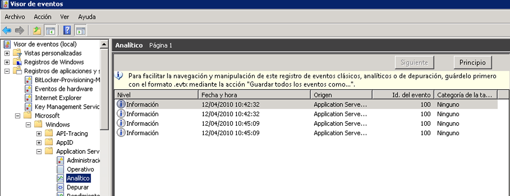

# <a name="configuring-tracking-for-a-workflow"></a><span data-ttu-id="40ded-102">Configurar seguimiento para un flujo de trabajo</span><span class="sxs-lookup"><span data-stu-id="40ded-102">Configuring Tracking for a Workflow</span></span>
<span data-ttu-id="40ded-103">Un flujo de trabajo se puede ejecutar de tres maneras:</span><span class="sxs-lookup"><span data-stu-id="40ded-103">A workflow can execute in three ways:</span></span>  
  
-   <span data-ttu-id="40ded-104">Hospedado en <xref:System.ServiceModel.Activities.WorkflowServiceHost></span><span class="sxs-lookup"><span data-stu-id="40ded-104">Hosted in <xref:System.ServiceModel.Activities.WorkflowServiceHost></span></span>  
  
-   <span data-ttu-id="40ded-105">Ejecutado como <xref:System.Activities.WorkflowApplication></span><span class="sxs-lookup"><span data-stu-id="40ded-105">Executed as a <xref:System.Activities.WorkflowApplication></span></span>  
  
-   <span data-ttu-id="40ded-106">Ejecutado directamente utilizando <xref:System.Activities.WorkflowInvoker></span><span class="sxs-lookup"><span data-stu-id="40ded-106">Executed directly using <xref:System.Activities.WorkflowInvoker></span></span>  
  
 <span data-ttu-id="40ded-107">Dependiendo de la opción de hospedaje de flujo de trabajo, se puede agregar un participante de seguimiento, ya sea a través de código o de un archivo de configuración.</span><span class="sxs-lookup"><span data-stu-id="40ded-107">Depending on the workflow hosting option, a tracking participant can be added either through code or through a configuration file.</span></span> <span data-ttu-id="40ded-108">En este tema se describe cómo configurar el seguimiento agregando un participante de seguimiento a <xref:System.Activities.WorkflowApplication> y a <xref:System.ServiceModel.Activities.WorkflowServiceHost> y cómo habilitar el seguimiento al utilizar <xref:System.Activities.WorkflowInvoker>.</span><span class="sxs-lookup"><span data-stu-id="40ded-108">This topic describes how tracking is configured by adding a tracking participant to a <xref:System.Activities.WorkflowApplication> and to a <xref:System.ServiceModel.Activities.WorkflowServiceHost>, and how to enable tracking when using <xref:System.Activities.WorkflowInvoker>.</span></span>  
  
## <a name="configuring-workflow-application-tracking"></a><span data-ttu-id="40ded-109">Configurar seguimiento de aplicación de flujo de trabajo</span><span class="sxs-lookup"><span data-stu-id="40ded-109">Configuring Workflow Application Tracking</span></span>  
 <span data-ttu-id="40ded-110">Un flujo de trabajo se puede ejecutar mediante la clase <xref:System.Activities.WorkflowApplication>.</span><span class="sxs-lookup"><span data-stu-id="40ded-110">A workflow can run using the <xref:System.Activities.WorkflowApplication> class.</span></span> <span data-ttu-id="40ded-111">En este tema se muestra cómo configurar el seguimiento de una aplicación de flujo de trabajo de [!INCLUDE[netfx_current_long](../../../includes/netfx-current-long-md.md)] al agregar un participante de seguimiento al host de flujo de trabajo <xref:System.Activities.WorkflowApplication>.</span><span class="sxs-lookup"><span data-stu-id="40ded-111">This topic demonstrates how tracking is configured for a [!INCLUDE[netfx_current_long](../../../includes/netfx-current-long-md.md)] workflow application by adding a tracking participant to the <xref:System.Activities.WorkflowApplication> workflow host.</span></span> <span data-ttu-id="40ded-112">En este caso, el flujo de trabajo se ejecuta como una aplicación de flujo de trabajo.</span><span class="sxs-lookup"><span data-stu-id="40ded-112">In this case, the workflow runs as a workflow application.</span></span> <span data-ttu-id="40ded-113">Configure una aplicación de flujo de trabajo mediante código (en lugar de utilizar un archivo de configuración), que es un archivo .exe auto-hospedado usando la clase <xref:System.Activities.WorkflowApplication>.</span><span class="sxs-lookup"><span data-stu-id="40ded-113">You configure a workflow application through code (rather than by using a configuration file), which is a self-hosted .exe file using the <xref:System.Activities.WorkflowApplication> class.</span></span> <span data-ttu-id="40ded-114">El participante de seguimiento se agrega como una extensión a la instancia <xref:System.Activities.WorkflowApplication>.</span><span class="sxs-lookup"><span data-stu-id="40ded-114">The tracking participant is added as an extension to the <xref:System.Activities.WorkflowApplication> instance.</span></span> <span data-ttu-id="40ded-115">Esto se realiza agregando <xref:System.Activities.Tracking.TrackingParticipant> a la colección de las extensiones para la instancia de WorkflowApplication.</span><span class="sxs-lookup"><span data-stu-id="40ded-115">This is done by adding the <xref:System.Activities.Tracking.TrackingParticipant> to the extensions collection for the WorkflowApplication instance.</span></span>  
  
 <span data-ttu-id="40ded-116">Para una aplicación de flujo de trabajo, puede agregar la extensión de comportamiento <xref:System.Activities.Tracking.EtwTrackingParticipant> tal y como se muestra en el siguiente código.</span><span class="sxs-lookup"><span data-stu-id="40ded-116">For a workflow application, you can add the <xref:System.Activities.Tracking.EtwTrackingParticipant> behavior extension as shown in the following code.</span></span>  
  
```csharp  
LogActivity activity = new LogActivity();  
  
WorkflowApplication instance = new WorkflowApplication(activity);  
EtwTrackingParticipant trackingParticipant =  
    new EtwTrackingParticipant  
{  
  
        TrackingProfile = new TrackingProfile  
           {  
               Name = "SampleTrackingProfile",  
               ActivityDefinitionId = "ProcessOrder",  
               Queries = new WorkflowInstanceQuery  
               {  
                  States = { "*" }  
              }  
          }  
       };  
instance.Extensions.Add(trackingParticipant);  
```  
  
### <a name="configuring-workflow-service-tracking"></a><span data-ttu-id="40ded-117">Configurar el seguimiento de servicio de flujo de trabajo</span><span class="sxs-lookup"><span data-stu-id="40ded-117">Configuring Workflow Service Tracking</span></span>  
 <span data-ttu-id="40ded-118">Un flujo de trabajo se puede exponer como un servicio de [!INCLUDE[indigo2](../../../includes/indigo2-md.md)] cuando se hospeda en el host de servicio <xref:System.ServiceModel.Activities.WorkflowServiceHost>.</span><span class="sxs-lookup"><span data-stu-id="40ded-118">A workflow can be exposed as a [!INCLUDE[indigo2](../../../includes/indigo2-md.md)] service when hosted in the <xref:System.ServiceModel.Activities.WorkflowServiceHost> service host.</span></span> <span data-ttu-id="40ded-119"><xref:System.ServiceModel.Activities.WorkflowServiceHost> es una implementación especializada de .NET ServiceHost para un servicio basado en flujo de trabajo.</span><span class="sxs-lookup"><span data-stu-id="40ded-119"><xref:System.ServiceModel.Activities.WorkflowServiceHost> is a specialized .NET ServiceHost implementation for a workflow-based service.</span></span> <span data-ttu-id="40ded-120">En esta sección se explica cómo configurar el seguimiento para un servicio de flujo de trabajo de [!INCLUDE[netfx_current_short](../../../includes/netfx-current-short-md.md)] que se ejecuta en <xref:System.ServiceModel.Activities.WorkflowServiceHost>.</span><span class="sxs-lookup"><span data-stu-id="40ded-120">This section explains how to configure tracking for a [!INCLUDE[netfx_current_short](../../../includes/netfx-current-short-md.md)] workflow service running in <xref:System.ServiceModel.Activities.WorkflowServiceHost>.</span></span> <span data-ttu-id="40ded-121">Se configura mediante un archivo Web.config (para un servicio hospedado en web) o un archivo App.config (para un servicio hospedado en una aplicación independiente, como una aplicación de consola) especificando un comportamiento de servicio o mediante código agregando un comportamiento específico de seguimiento a la colección <xref:System.ServiceModel.Description.ServiceDescription.Behaviors%2A> del host de servicio.</span><span class="sxs-lookup"><span data-stu-id="40ded-121">It is configured through a Web.config file (for a Web-hosted service) or an App.config file (for a service hosted in a stand-alone application, such as a console application) by specifying a service behavior or through code by adding a tracking-specific behavior to the <xref:System.ServiceModel.Description.ServiceDescription.Behaviors%2A> collection for the service host.</span></span>  
  
 <span data-ttu-id="40ded-122">En el caso de un servicio de host hospedado en <xref:System.ServiceModel.WorkflowServiceHost>, puede agregar <xref:System.Activities.Tracking.EtwTrackingParticipant> mediante el elemento <`behavior`> en un archivo de configuración, tal y como se muestra en el siguiente ejemplo.</span><span class="sxs-lookup"><span data-stu-id="40ded-122">For a workflow service hosted in <xref:System.ServiceModel.WorkflowServiceHost>, you can add the <xref:System.Activities.Tracking.EtwTrackingParticipant> using the <`behavior`> element in a configuration file, as shown in the following example.</span></span>  
  
```xml  
<behaviors>  
   <serviceBehaviors>  
        <behavior>  
          <etwTracking profileName="Sample Tracking Profile" />  
        </behavior>              
   </serviceBehaviors>  
<behaviors>  
```  
  
 <span data-ttu-id="40ded-123">Por otra parte, en el caso de un servicio de flujo de trabajo hospedado en <xref:System.ServiceModel.WorkflowServiceHost>, puede agregar la extensión de comportamiento <xref:System.Activities.Tracking.EtwTrackingParticipant> a través del código.</span><span class="sxs-lookup"><span data-stu-id="40ded-123">Alternatively, for a workflow service hosted in <xref:System.ServiceModel.WorkflowServiceHost>, you can add the <xref:System.Activities.Tracking.EtwTrackingParticipant> behavior extension through code.</span></span> <span data-ttu-id="40ded-124">Para agregar un participante de seguimiento personalizado, cree una nueva extensión de comportamiento y agréguela a <xref:System.ServiceModel.ServiceHost> tal y como se muestra en el siguiente código de ejemplo.</span><span class="sxs-lookup"><span data-stu-id="40ded-124">To add a custom tracking participant, create a new behavior extension and add it to the <xref:System.ServiceModel.ServiceHost> as shown in the following example code.</span></span>  
  
> [!NOTE]
>  <span data-ttu-id="40ded-125">Si desea ver código de ejemplo que muestra cómo crear un elemento de comportamiento personalizado que agrega un participante de seguimiento personalizado, consulte el [seguimiento](../../../docs/framework/windows-workflow-foundation/samples/tracking.md) ejemplos.</span><span class="sxs-lookup"><span data-stu-id="40ded-125">If you want to view sample code that shows how to create a custom behavior element that adds a custom tracking participant, refer to the [Tracking](../../../docs/framework/windows-workflow-foundation/samples/tracking.md) samples.</span></span>  
  
```  
ServiceHost svcHost = new ServiceHost(typeof(WorkflowService), new   
                                 Uri("http://localhost:8001/Sample"));  
EtwTrackingBehavior trackingBehavior =   
    new EtwTrackingBehavior  
    {  
        ProfileName = "Sample Tracking Profile"  
    };  
svcHost.Description.Behaviors.Add(trackingBehavior);  
svcHost.Open();  
```  
  
 <span data-ttu-id="40ded-126">El participante del seguimiento se agrega al host de servicio de flujo de trabajo como una extensión al comportamiento.</span><span class="sxs-lookup"><span data-stu-id="40ded-126">The tracking participant is added to the workflow service host as an extension to the behavior.</span></span>  
  
 <span data-ttu-id="40ded-127">El siguiente código de ejemplo muestra cómo leer un perfil de seguimiento del archivo de configuración.</span><span class="sxs-lookup"><span data-stu-id="40ded-127">This sample code below shows how to read a tracking profile from configuration file.</span></span>  
  
```  
TrackingProfile GetProfile(string profileName, string displayName)  
        {  
            TrackingProfile trackingProfile = null;  
            TrackingSection trackingSection = (TrackingSection)WebConfigurationManager.GetSection("system.serviceModel/tracking");  
            if (trackingSection == null)   
            {  
                return null;  
            }  
  
            if (profileName == null)   
            {  
                profileName = "";  
            }  
  
            //Find the profile with the specified profile name in the list of profile found in config  
            var match = from p in new List<TrackingProfile>(trackingSection.TrackingProfiles)  
                        where (p.Name == profileName) && ((p.ActivityDefinitionId == displayName) || (p.ActivityDefinitionId == "*"))  
                        select p;  
  
            if (match.Count() == 0)  
            {  
                //return an empty profile  
                trackingProfile = new TrackingProfile()  
                {  
                    ActivityDefinitionId = displayName  
                };  
  
            }  
            else  
            {  
                trackingProfile = match.First();  
            }  
  
            return trackingProfile;  
```  
  
 <span data-ttu-id="40ded-128">Este código de ejemplo muestra cómo agregar un perfil de seguimiento a un host del flujo de trabajo.</span><span class="sxs-lookup"><span data-stu-id="40ded-128">This sample code shows how to add a tracking profile to a workflow host.</span></span>  
  
```  
WorkflowServiceHost workflowServiceHost = serviceHostBase as WorkflowServiceHost;  
if (null != workflowServiceHost)  
{  
              string workflowDisplayName = workflowServiceHost.Activity.DisplayName;  
               TrackingProfile trackingProfile = GetProfile(this.profileName, workflowDisplayName);  
                workflowServiceHost.WorkflowExtensions.Add(()  => new EtwTrackingParticipant  {  
               TrackingProfile = trackingProfile  
                        });  
 }  
```  
  
> [!NOTE]
>  <span data-ttu-id="40ded-129">Para obtener más información sobre los perfiles de seguimiento, consulte [perfiles de seguimiento](http://go.microsoft.com/fwlink/?LinkId=201310).</span><span class="sxs-lookup"><span data-stu-id="40ded-129">For more information on tracking profiles, refer to [Tracking Profiles](http://go.microsoft.com/fwlink/?LinkId=201310).</span></span>  
  
### <a name="configuring-tracking-using-workflowinvoker"></a><span data-ttu-id="40ded-130">Configurar el seguimiento mediante WorkflowInvoker</span><span class="sxs-lookup"><span data-stu-id="40ded-130">Configuring tracking using WorkflowInvoker</span></span>  
 <span data-ttu-id="40ded-131">Para configurar el seguimiento para un flujo de trabajo ejecutado utilizando <xref:System.Activities.WorkflowInvoker>, agregue el proveedor del seguimiento como una extensión de una instancia de <xref:System.Activities.WorkflowInvoker>.</span><span class="sxs-lookup"><span data-stu-id="40ded-131">To configure tracking for a workflow executed using <xref:System.Activities.WorkflowInvoker>, add the tracking provider as an extension to a <xref:System.Activities.WorkflowInvoker> instance.</span></span> <span data-ttu-id="40ded-132">El siguiente ejemplo de código es de la [seguimiento personalizado](../../../docs/framework/windows-workflow-foundation/samples/custom-tracking.md) ejemplo.</span><span class="sxs-lookup"><span data-stu-id="40ded-132">The following code example is from the [Custom Tracking](../../../docs/framework/windows-workflow-foundation/samples/custom-tracking.md) sample.</span></span>  
  
```  
WorkflowInvoker invoker = new WorkflowInvoker(BuildSampleWorkflow());  
invoker.Extensions.Add(customTrackingParticipant);  
invoker.Invoke();  
```  
  
### <a name="viewing-tracking-records-in-event-viewer"></a><span data-ttu-id="40ded-133">Visualizar los registros de seguimiento en el Visor de eventos</span><span class="sxs-lookup"><span data-stu-id="40ded-133">Viewing tracking records in Event Viewer</span></span>  
 <span data-ttu-id="40ded-134">Hay dos registros del Visor de eventos que resultan de especial interés para ver la ejecución del seguimiento de WF: el registro analítico y el registro de depuración.</span><span class="sxs-lookup"><span data-stu-id="40ded-134">There are two Event Viewer logs of particular interest to view when tracking WF execution - the Analytic log and the Debug log.</span></span> <span data-ttu-id="40ded-135">Residen en el Microsoft &#124; Windows &#124; Nodo de aplicaciones de servidor de aplicación.</span><span class="sxs-lookup"><span data-stu-id="40ded-135">Both reside under the Microsoft&#124;Windows&#124;Application Server-Applications node.</span></span>  <span data-ttu-id="40ded-136">Los registros de esta sección contienen eventos de una única aplicación en lugar de los eventos que afectan a todo el sistema.</span><span class="sxs-lookup"><span data-stu-id="40ded-136">Logs within this section contain events from a single application rather than events that have an impact on the entire system.</span></span>  
  
 <span data-ttu-id="40ded-137">Los eventos de seguimiento de depuración se escriben en el registro de depuración.</span><span class="sxs-lookup"><span data-stu-id="40ded-137">Debug trace events are written to the Debug Log.</span></span> <span data-ttu-id="40ded-138">Para recopilar eventos de seguimiento de depuración de WF en el Visor de eventos, habilite el registro de depuración.</span><span class="sxs-lookup"><span data-stu-id="40ded-138">To collect WF debug trace events in the Event Viewer, enable the Debug Log.</span></span>  
  
1.  <span data-ttu-id="40ded-139">Para abrir el Visor de eventos, haga clic en **iniciar**y, a continuación, haga clic en **ejecutar.**</span><span class="sxs-lookup"><span data-stu-id="40ded-139">To open Event Viewer, click **Start**, and then click **Run.**</span></span> <span data-ttu-id="40ded-140">En el cuadro de diálogo Ejecutar, escriba `eventvwr`.</span><span class="sxs-lookup"><span data-stu-id="40ded-140">In the Run dialog, type `eventvwr`.</span></span>  
  
2.  <span data-ttu-id="40ded-141">En el cuadro de diálogo Visor de eventos, expanda el **registros de aplicaciones y servicios** nodo.</span><span class="sxs-lookup"><span data-stu-id="40ded-141">In the Event Viewer dialog, expand the **Applications and Services Logs** node.</span></span>  
  
3.  <span data-ttu-id="40ded-142">Expanda el **Microsoft**, **Windows**, y **Application Server-Applications** nodos.</span><span class="sxs-lookup"><span data-stu-id="40ded-142">Expand the **Microsoft**, **Windows**, and **Application Server-Applications** nodes.</span></span>  
  
4.  <span data-ttu-id="40ded-143">Haga clic en el **depurar** nodo bajo el **servidor de aplicaciones** nodo y seleccione **Habilitar registro**.</span><span class="sxs-lookup"><span data-stu-id="40ded-143">Right-click the **Debug** node under the **Application Server-Applications** node, and select **Enable Log**.</span></span>  
  
5.  <span data-ttu-id="40ded-144">Ejecute la aplicación habilitada para realizar seguimientos con el fin de generar eventos de seguimiento.</span><span class="sxs-lookup"><span data-stu-id="40ded-144">Execute your tracing-enabled application to generate tracing events.</span></span>  
  
6.  <span data-ttu-id="40ded-145">Haga clic en el **depurar** nodo y seleccione **actualizar.**</span><span class="sxs-lookup"><span data-stu-id="40ded-145">Right-click the **Debug** node and select **Refresh.**</span></span> <span data-ttu-id="40ded-146">Los eventos de seguimiento deben estar visibles en el panel central.</span><span class="sxs-lookup"><span data-stu-id="40ded-146">Tracing events should be visible in the center pane.</span></span>  
  
 <span data-ttu-id="40ded-147">WF 4 proporciona un participante de seguimiento que escribe registros de seguimiento en una sesión de ETW (Seguimiento de eventos para Windows).</span><span class="sxs-lookup"><span data-stu-id="40ded-147">WF 4 provides a tracking participant that writes tracking records to an ETW (Event Tracing for Windows) session.</span></span> <span data-ttu-id="40ded-148">El participante de seguimiento de ETW se configura con un perfil de seguimiento para suscribirse a registros de seguimiento.</span><span class="sxs-lookup"><span data-stu-id="40ded-148">The ETW tracking participant is configured with a tracking profile to subscribe to tracking records.</span></span>  <span data-ttu-id="40ded-149">Cuando se habilita el seguimiento, los registros de seguimiento de errores se emiten en ETW.</span><span class="sxs-lookup"><span data-stu-id="40ded-149">When tracking is enabled, errors tracking records are emitted to ETW.</span></span> <span data-ttu-id="40ded-150">Los eventos de seguimiento de ETW (entre el intervalo de 100-113) correspondientes a los eventos de seguimiento emitidos por el participante de seguimiento de ETW se escriben en el registro analítico.</span><span class="sxs-lookup"><span data-stu-id="40ded-150">ETW tracking events (between the range of 100-113) corresponding to the tracking events emitted by the ETW tracking participant are written to the Analytic Log.</span></span>  
  
 <span data-ttu-id="40ded-151">Para ver los registros de seguimiento, siga estos pasos.</span><span class="sxs-lookup"><span data-stu-id="40ded-151">To view tracking records, follow these steps.</span></span>  
  
1.  <span data-ttu-id="40ded-152">Para abrir el Visor de eventos, haga clic en **iniciar**y, a continuación, haga clic en **ejecutar.**</span><span class="sxs-lookup"><span data-stu-id="40ded-152">To open Event Viewer, click **Start**, and then click **Run.**</span></span> <span data-ttu-id="40ded-153">En el cuadro de diálogo Ejecutar, escriba `eventvwr`.</span><span class="sxs-lookup"><span data-stu-id="40ded-153">In the Run dialog, type `eventvwr`.</span></span>  
  
2.  <span data-ttu-id="40ded-154">En el cuadro de diálogo Visor de eventos, expanda el **registros de aplicaciones y servicios** nodo.</span><span class="sxs-lookup"><span data-stu-id="40ded-154">In the Event Viewer dialog, expand the **Applications and Services Logs** node.</span></span>  
  
3.  <span data-ttu-id="40ded-155">Expanda el **Microsoft**, **Windows**, y **Application Server-Applications** nodos.</span><span class="sxs-lookup"><span data-stu-id="40ded-155">Expand the **Microsoft**, **Windows**, and **Application Server-Applications** nodes.</span></span>  
  
4.  <span data-ttu-id="40ded-156">Haga clic en el **analítico** nodo bajo el **servidor de aplicaciones** nodo y seleccione **Habilitar registro**.</span><span class="sxs-lookup"><span data-stu-id="40ded-156">Right-click the **Analytic** node under the **Application Server-Applications** node, and select **Enable Log**.</span></span>  
  
5.  <span data-ttu-id="40ded-157">Ejecute la aplicación habilitada para realizar seguimientos a fin de generar los registros de seguimiento.</span><span class="sxs-lookup"><span data-stu-id="40ded-157">Execute your tracking-enabled application to generate tracking records.</span></span>  
  
6.  <span data-ttu-id="40ded-158">Haga clic en el **analítico** nodo y seleccione **actualizar.**</span><span class="sxs-lookup"><span data-stu-id="40ded-158">Right-click the **Analytic** node and select **Refresh.**</span></span> <span data-ttu-id="40ded-159">Los registros de seguimiento deben estar visibles en el panel central.</span><span class="sxs-lookup"><span data-stu-id="40ded-159">Tracking records should be visible in the center pane.</span></span>  
  
 <span data-ttu-id="40ded-160">La siguiente imagen muestra eventos de seguimiento en el Visor de eventos.</span><span class="sxs-lookup"><span data-stu-id="40ded-160">The following image shows tracking events in the event viewer.</span></span>  
  
 <span data-ttu-id="40ded-161"></span><span class="sxs-lookup"><span data-stu-id="40ded-161"></span></span>  
  
### <a name="registering-an-application-specific-provider-id"></a><span data-ttu-id="40ded-162">Registrar un identificador de proveedor específico de la aplicación</span><span class="sxs-lookup"><span data-stu-id="40ded-162">Registering an application-specific provider ID</span></span>  
 <span data-ttu-id="40ded-163">Si es necesario escribir eventos en un determinado registro de aplicaciones, siga estos pasos para registrar el nuevo manifiesto del proveedor.</span><span class="sxs-lookup"><span data-stu-id="40ded-163">If events need to be written to a specific application log, follow these steps to register the new provider manifest.</span></span>  
  
1.  <span data-ttu-id="40ded-164">Declare el Id. de proveedor en el archivo de configuración de la aplicación.</span><span class="sxs-lookup"><span data-stu-id="40ded-164">Declare the provider ID in the application configuration file.</span></span>  
  
    ```xml  
    <system.serviceModel>  
        <diagnostics etwProviderId="2720e974-9fe9-477a-bb60-81fe3bf91eec"/>  
    </system.serviceModel>  
    ```  
  
2.  <span data-ttu-id="40ded-165">Copie el archivo de manifiesto de %windir%\Microsoft.NET\Framework\\< versión más reciente de [!INCLUDE[netfx_current_short](../../../includes/netfx-current-short-md.md)]> \Microsoft.Windows.ApplicationServer.Applications.man en una ubicación temporal y cambie su nombre a Microsoft.Windows.ApplicationServer.Applications_Provider1.man</span><span class="sxs-lookup"><span data-stu-id="40ded-165">Copy the manifest file from %windir%\Microsoft.NET\Framework\\<latest version of [!INCLUDE[netfx_current_short](../../../includes/netfx-current-short-md.md)]>\Microsoft.Windows.ApplicationServer.Applications.man to a temporary location, and rename it to Microsoft.Windows.ApplicationServer.Applications_Provider1.man</span></span>  
  
3.  <span data-ttu-id="40ded-166">Cambie el GUID del archivo de manifiesto por el nuevo GUID.</span><span class="sxs-lookup"><span data-stu-id="40ded-166">Change the GUID in the manifest file to the new GUID.</span></span>  
  
    ```xml  
    <provider name="Microsoft-Windows-Application Server-Applications" guid="{2720e974-9fe9-477a-bb60-81fe3bf91eec}"  
    ```  
  
4.  <span data-ttu-id="40ded-167">Cambie el nombre de proveedor si no desea desinstalar el proveedor predeterminado.</span><span class="sxs-lookup"><span data-stu-id="40ded-167">Change the provider name if you do not want to uninstall the default provider.</span></span>  
  
    ```xml  
    <provider name="Microsoft-Windows-Application Server-Applications" guid="{2720e974-9fe9-477a-bb60-81fe3bf91eec}"  
    ```  
  
5.  <span data-ttu-id="40ded-168">Si ha cambiado el nombre de proveedor en el paso anterior, cambie los nombres de canal del archivo de manifiesto al nuevo nombre de proveedor.</span><span class="sxs-lookup"><span data-stu-id="40ded-168">If you changed the provider name in the previous step, change the channel names in the manifest file to the new provider name.</span></span>  
  
    ```xml  
    <channel name="Microsoft-Windows-Application Server-Applications_Provider1/Admin" chid="ADMIN_CHANNEL" symbol="ADMIN_CHANNEL" type="Admin" enabled="false" isolation="Application" message="$(string.MICROSOFT_WINDOWS_APPLICATIONSERVER_APPLICATIONS.channel.ADMIN_CHANNEL.message)" />  
    <channel name="Microsoft-Windows-Application Server-Applications_Provider1/Operational" chid="OPERATIONAL_CHANNEL" symbol="OPERATIONAL_CHANNEL" type="Operational" enabled="false" isolation="Application" message="$(string.MICROSOFT_WINDOWS_APPLICATIONSERVER_APPLICATIONS.channel.OPERATIONAL_CHANNEL.message)" />  
    <channel name="Microsoft-Windows-Application Server-Applications_Provider1/Analytic" chid="ANALYTIC_CHANNEL" symbol="ANALYTIC_CHANNEL" type="Analytic" enabled="false" isolation="Application" message="$(string.MICROSOFT_WINDOWS_APPLICATIONSERVER_APPLICATIONS.channel.ANALYTIC_CHANNEL.message)" />  
    <channel name="Microsoft-Windows-Application Server-Applications_Provider1/Debug" chid="DEBUG_CHANNEL" symbol="DEBUG_CHANNEL" type="Debug" enabled="false" isolation="Application" message="$(string.MICROSOFT_WINDOWS_APPLICATIONSERVER_APPLICATIONS.channel.DEBUG_CHANNEL.message)" />  
    <channel name="Microsoft-Windows-Application Server-Applications_Provider1/Perf" chid="PERF_CHANNEL" symbol="PERF_CHANNEL" type="Analytic" enabled="false" isolation="Application" message="$(string.MICROSOFT_WINDOWS_APPLICATIONSERVER_APPLICATIONS.channel.PERF_CHANNEL.message)" />  
    ```  
  
6.  <span data-ttu-id="40ded-169">Genere el archivo DLL de recursos siguiendo estos pasos.</span><span class="sxs-lookup"><span data-stu-id="40ded-169">Generate the resource DLL by following these steps.</span></span>  
  
    1.  <span data-ttu-id="40ded-170">Instale el SDK de Windows.</span><span class="sxs-lookup"><span data-stu-id="40ded-170">Install the Windows SDK.</span></span> <span data-ttu-id="40ded-171">El SDK de Windows incluye el compilador de mensajes ([mc.exe](http://go.microsoft.com/fwlink/?LinkId=184606)) y el compilador de recursos ([rc.exe](http://go.microsoft.com/fwlink/?LinkId=184605)).</span><span class="sxs-lookup"><span data-stu-id="40ded-171">The Windows SDK includes the message compiler ([mc.exe](http://go.microsoft.com/fwlink/?LinkId=184606)) and resource compiler ([rc.exe](http://go.microsoft.com/fwlink/?LinkId=184605)).</span></span>  
  
    2.  <span data-ttu-id="40ded-172">En un símbolo del sistema de Windows SDK, ejecute mc.exe en el archivo de manifiesto nuevo.</span><span class="sxs-lookup"><span data-stu-id="40ded-172">In a Windows SDK command prompt, run mc.exe on the new manifest file.</span></span>  
  
        ```  
        mc.exe Microsoft.Windows.ApplicationServer.Applications_Provider1.man  
        ```  
  
    3.  <span data-ttu-id="40ded-173">Ejecute rc.exe en el archivo de recursos generado en el paso anterior.</span><span class="sxs-lookup"><span data-stu-id="40ded-173">Run rc.exe on the resource file generated in the previous step.</span></span>  
  
        ```  
        rc.exe  Microsoft.Windows.ApplicationServer.Applications_Provider1.rc  
        ```  
  
    4.  <span data-ttu-id="40ded-174">Cree un archivo cs vacío denominado NewProviderReg.cs.</span><span class="sxs-lookup"><span data-stu-id="40ded-174">Create an empty cs file called NewProviderReg.cs.</span></span>  
  
    5.  <span data-ttu-id="40ded-175">Cree un archivo DLL de recursos mediante el compilador de C#.</span><span class="sxs-lookup"><span data-stu-id="40ded-175">Create a resource DLL using the C# compiler.</span></span>  
  
        ```  
        csc /target:library /win32res:Microsoft.Windows.ApplicationServer.Applications_Provider1.res NewProviderReg.cs /out:Microsoft.Windows.ApplicationServer.Applications_Provider1.dll  
        ```  
  
    6.  <span data-ttu-id="40ded-176">Cambie el nombre del archivo DLL de mensajes y de recursos en el archivo de manifiesto de `Microsoft.Windows.ApplicationServer.Applications.Provider1.man` por el nuevo nombre de archivo DLL.</span><span class="sxs-lookup"><span data-stu-id="40ded-176">Change the resource and message dl namel in the manifest file from `Microsoft.Windows.ApplicationServer.Applications.Provider1.man` to the new dll name.</span></span>  
  
        ```xml  
        <provider name="Microsoft-Windows-Application Server-Applications_Provider1" guid="{2720e974-9fe9-477a-bb60-81fe3bf91eec}" symbol="Microsoft_Windows_ApplicationServer_ApplicationEvents" resourceFileName="<dll directory>\Microsoft.Windows.ApplicationServer.Applications_Provider1.dll" messageFileName="<dll directory>\Microsoft.Windows.ApplicationServer.Applications_Provider1.dll">  
        ```  
  
    7.  <span data-ttu-id="40ded-177">Use [wevtutil](http://go.microsoft.com/fwlink/?LinkId=184608) para registrar el manifiesto.</span><span class="sxs-lookup"><span data-stu-id="40ded-177">Use [wevtutil](http://go.microsoft.com/fwlink/?LinkId=184608) to register the manifest.</span></span>  
  
        ```  
        wevtutil im Microsoft.Windows.ApplicationServer.Applications_Provider1.man  
        ```  
  
## <a name="see-also"></a><span data-ttu-id="40ded-178">Vea también</span><span class="sxs-lookup"><span data-stu-id="40ded-178">See Also</span></span>  
 [<span data-ttu-id="40ded-179">Supervisión de Windows Server App Fabric</span><span class="sxs-lookup"><span data-stu-id="40ded-179">Windows Server App Fabric Monitoring</span></span>](http://go.microsoft.com/fwlink/?LinkId=201273)  
 [<span data-ttu-id="40ded-180">Supervisión de aplicaciones con App Fabric</span><span class="sxs-lookup"><span data-stu-id="40ded-180">Monitoring Applications with App Fabric</span></span>](http://go.microsoft.com/fwlink/?LinkId=201275)
