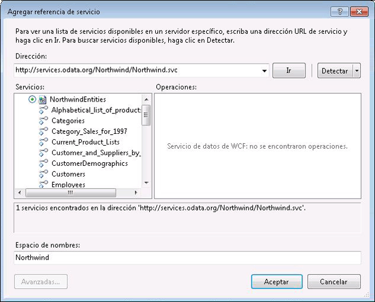

# <a name="consuming-odata-feeds-from-a-workflow"></a>Usar fuentes de OData en un flujo de trabajo

Servicios de datos de WCF es un componente de [!INCLUDE[dnprdnshort](../../../includes/dnprdnshort-md.md)] que le habilita para crear servicios que usan Open Data Protocol (OData) para exponer y usar datos en Internet o una intranet mediante la semántica de  transferencia de estado representacional (REST, Representational State Transfer). OData expone los datos como recursos direccionables a través de identificadores uniformes de recursos (URI). Cualquier aplicación puede interactuar con un servicio de datos basado en OData si puede enviar una solicitud HTTP y procesar la fuente de OData que devuelve un servicio de datos. Además, Servicios de datos de WCF incluye bibliotecas de cliente que proporcionan una experiencia de programación más enriquecida cuando se usan fuentes OData desde aplicaciones [!INCLUDE[dnprdnshort](../../../includes/dnprdnshort-md.md)] . En este tema se proporciona una información general del uso de una fuente de OData en un flujo de trabajo con y sin utilizar las bibliotecas de clientes.

## <a name="using-the-sample-northwind-odata-service"></a>Utilizar el servicio OData de Northwind de ejemplo

Los ejemplos de este tema usan el servicio de datos ubicado en Northwind de ejemplo [ http://services.odata.org/Northwind/Northwind.svc/ ](https://go.microsoft.com/fwlink/?LinkID=187426). Este servicio se proporciona como parte de la [SDK de OData](https://go.microsoft.com/fwlink/?LinkID=185248) y proporciona acceso de solo lectura a la base de datos de ejemplo Northwind. Si se desea acceso de escritura, o si se desea un servicio de datos de WCF local, puede seguir los pasos necesarios para la [tutorial rápido de WCF Data Services](https://go.microsoft.com/fwlink/?LinkID=131076) para crear un servicio OData local que proporciona acceso a la base de datos Northwind. Si sigue el tutorial rápido, sustituya el URI local por el que se proporciona en el código de ejemplo de este tema.

## <a name="consuming-an-odata-feed-using-the-client-libraries"></a>Usar una fuente de OData mediante las bibliotecas de cliente

Servicios de datos de WCF incluye bibliotecas cliente que permiten utilizar más fácilmente una fuente de OData desde [!INCLUDE[dnprdnshort](../../../includes/dnprdnshort-md.md)] y las aplicaciones cliente. Estas bibliotecas simplifican el envío y recepción de los mensajes HTTP. También traducen la carga del mensaje en objetos CLR que representan los datos de entidad. Las bibliotecas cliente representan las dos clases principales <xref:System.Data.Services.Client.DataServiceContext> y <xref:System.Data.Services.Client.DataServiceQuery%601>. Estas clases le permiten consultar un servicio de datos y, a continuación, trabajar con los datos de entidad devueltos como objetos CLR. En esta sección se incluyen dos enfoques para crear actividades que utilizan bibliotecas de clientes.

### <a name="adding-a-service-reference-to-the-wcf-data-service"></a>Agregar una referencia de servicio al Servicio de datos de WCF

Para generar las bibliotecas de cliente de Northwind, puede utilizar el cuadro de diálogo **Agregar referencia de servicio** de [!INCLUDE[vs_current_long](../../../includes/vs-current-long-md.md)] para agregar una referencia al servicio  OData de Northwind.



Observe que no hay ninguna operación del servicio expuesta por el servicio y que en la lista **Servicios** hay elementos que representan las entidades expuestas por el servicio de datos Northwind. Cuando se agregue la referencia de servicio, se generarán las clases para estas entidades y se podrán utilizar en el código del cliente. Los ejemplos de este tema usan estas clases y la clase `NorthwindEntities` para realizar las consultas.

> [!NOTE]
> Para obtener más información, consulte [generar la biblioteca de cliente de servicio de datos (WCF Data Services)](https://go.microsoft.com/fwlink/?LinkID=191611).

### <a name="using-asynchronous-methods"></a>Usar métodos asincrónicos

Para resolver los posibles problemas de latencia que se pueden producir al tener acceso a los recursos en Web, recomendamos el acceso asincrónico a Servicios de datos de WCF. Las bibliotecas de cliente de WCF Data Services incluyen métodos asincrónicos para invocar las consultas y Windows Workflow Foundation (WF) proporciona la <xref:System.Activities.AsyncCodeActivity> clase para crear actividades asincrónicas. Se pueden escribir actividades derivadas de<xref:System.Activities.AsyncCodeActivity> para aprovechar las clases de [!INCLUDE[dnprdnshort](../../../includes/dnprdnshort-md.md)] que tienen métodos asincrónicos, o el código que se ejecuta de forma asincrónica se puede incluir en un método e invocar mediante un delegado. Esta sección proporciona dos ejemplos de una actividad derivada de <xref:System.Activities.AsyncCodeActivity> ; uno que utiliza los métodos asincrónicos de las bibliotecas cliente de los Servicios de datos de WCF y otro que usa un delegado.

> [!NOTE]
> Para obtener más información, consulte [operaciones asincrónicas (WCF Data Services)](https://go.microsoft.com/fwlink/?LinkId=193396) y [crear actividades asincrónicas](../../../docs/framework/windows-workflow-foundation/creating-asynchronous-activities-in-wf.md).

### <a name="using-client-library-asynchronous-methods"></a>Utilizar métodos asincrónicos de biblioteca de cliente

La clase <xref:System.Data.Services.Client.DataServiceQuery%601> proporciona los métodos <xref:System.Data.Services.Client.DataServiceQuery%601.BeginExecute%2A> y <xref:System.Data.Services.Client.DataServiceQuery%601.EndExecute%2A> para consultar asincrónicamente un servicio OData. Se puede llamar a estos métodos desde <xref:System.Activities.AsyncCodeActivity.BeginExecute%2A> y <xref:System.Activities.AsyncCodeActivity.EndExecute%2A> invalida de una clase derivada de <xref:System.Activities.AsyncCodeActivity> . Cuando el <xref:System.Activities.AsyncCodeActivity> <xref:System.Activities.AsyncCodeActivity.BeginExecute%2A> invalida las devoluciones, el flujo de trabajo puede quedar inactivo (pero no conservar) y, cuando se completa el trabajo asincrónico, <xref:System.Activities.AsyncCodeActivity.EndExecute%2A> invocada por el tiempo de ejecución.

En el ejemplo siguiente, se define una actividad `OrdersByCustomer` con dos argumentos de entrada. El argumento `CustomerId` representa el cliente que identifica qué pedidos se va a devolver, mientras que el argumento `ServiceUri` representa el URI del servicio de OData que se va a consultar. Dado que la actividad deriva de `AsyncCodeActivity<IEnumerable<Order>>` hay también un parámetro de salida <xref:System.Activities.Activity%601.Result%2A> que se utiliza para devolver los resultados de la consulta. La <xref:System.Activities.AsyncCodeActivity.BeginExecute%2A> reemplazada crea un consulta LINQ que selecciona todos los pedidos del cliente especificado. Esta consulta se especifica como la <xref:System.Activities.AsyncCodeActivityContext.UserState%2A> de la <xref:System.Activities.AsyncCodeActivityContext>pasada y, a continuación, se llama al método de la consulta <xref:System.Data.Services.Client.DataServiceQuery%601.BeginExecute%2A> . Observe que la devolución de llamada y el estado que se pasan a la <xref:System.Data.Services.Client.DataServiceQuery%601.BeginExecute%2A> de la consulta son las que se pasan al método <xref:System.Activities.AsyncCodeActivity.BeginExecute%2A> de la actividad. Cuando la consulta se ha terminado de ejecutar, se invoca el método <xref:System.Activities.AsyncCodeActivity.EndExecute%2A> de la actividad. La consulta se recupera desde <xref:System.Activities.AsyncCodeActivityContext.UserState%2A>y, a continuación, se llama al método <xref:System.Data.Services.Client.DataServiceQuery%601.EndExecute%2A> de la consulta. Este método devuelve las <xref:System.Collections.Generic.IEnumerable%601> del tipo de entidad especificado; en este caso `Order`. Puesto que `IEnumerable<Order>` es el tipo genérico de la <xref:System.Activities.AsyncCodeActivity%601>, este `IEnumerable` se establece como el <xref:System.Activities.Activity%601.Result%2A> <xref:System.Activities.OutArgument%601> de la actividad.

[!code-csharp[CFX_WCFDataServicesActivityExample#100](../../../samples/snippets/csharp/VS_Snippets_CFX/CFX_WCFDataServicesActivityExample/cs/Program.cs#100)]

En el siguiente ejemplo, la actividad `OrdersByCustomer` recupera una lista de pedidos para el cliente especificado y a continuación una actividad <xref:System.Activities.Statements.ForEach%601> enumera los pedidos devueltos y escribe la fecha de cada pedido en la consola.

[!code-csharp[CFX_WCFDataServicesActivityExample#10](../../../samples/snippets/csharp/VS_Snippets_CFX/CFX_WCFDataServicesActivityExample/cs/Program.cs#10)]

Cuando se invoca este flujo de trabajo, se escriben los siguientes datos en la consola:

```console
Calling WCF Data Service...
8/25/1997
10/3/1997
10/13/1997
1/15/1998
3/16/1998
4/9/1998
```

> [!NOTE]
> Si no se puede establecer una conexión al servidor de OData, obtendrá una excepción similar a la siguiente:
>
> Excepción no controlada: System.InvalidOperationException: Error al procesar esta solicitud. ---> System.Net.WebException: No es posible conectar con el servidor remoto ---> System.Net.Sockets.SocketException: Error de intento de conexión porque la parte conectada no respondió correctamente después de un período de tiempo, o error de la conexión establecida porque el host conectado no respondió.

Si se requiere cualquier procesamiento adicional de los datos devueltos por la consulta, se puede hacer al reemplazar <xref:System.Activities.AsyncCodeActivity%601.EndExecute%2A> en la actividad. Se invocan <xref:System.Activities.AsyncCodeActivity%601.BeginExecute%2A> y <xref:System.Activities.AsyncCodeActivity%601.EndExecute%2A> al usar el subproceso del flujo de trabajo y cualquier código de estos reemplazos no se ejecuta de forma asincrónica. Si el procesamiento adicional es extenso o de ejecución prolongada, o se paginan los resultados de la consulta, debería considerar el enfoque descrito en la sección siguiente, que utiliza un delegado para ejecutar la consulta y realizar el procesamiento adicional de forma asincrónica.

### <a name="using-a-delegate"></a>Utilizar un delegado

Además de invocar el método asincrónico de una clase [!INCLUDE[dnprdnshort](../../../includes/dnprdnshort-md.md)] , una actividad basada en <xref:System.Activities.AsyncCodeActivity>también puede definir la lógica asincrónica en uno de sus métodos. Este método se especifica al usar un delegado en el reemplazo de <xref:System.Activities.AsyncCodeActivity.BeginExecute%2A> de la actividad. Cuando el método devuelve un resultado, el runtime invoca el reemplazo de <xref:System.Activities.AsyncCodeActivity.EndExecute%2A> de la actividad. Al llamar a un servicio de OData desde un flujo de trabajo, este método se puede utilizar para consultar el servicio y proporcionar cualquier procesamiento adicional.

En el ejemplo siguiente, se define una actividad `ListCustomers` . Esta actividad consulta el servicio de datos de Northwind de ejemplo y devuelve una `List<Customer>` que contiene todos los clientes de la base de datos Northwind. El método `GetCustomers` realiza el trabajo asincrónico. Este método consulta todos los clientes del servicio y, a continuación, los copia en una `List<Customer>`. Después, comprueba si los resultados están paginados. En ese caso, consulta en el servicio la siguiente página de resultados, los agrega a la lista y continúa hasta que se hayan recuperado todos los datos del cliente.

> [!NOTE]
> Para obtener más información acerca de la paginación en WCF Data Services, vea. [Cómo: cargar resultados paginados (WCF Data Services)](https://go.microsoft.com/fwlink/?LinkId=193452).

Una vez agregados todos los clientes, se devuelve la lista. El método `GetCustomers` se especifica en el reemplazo de <xref:System.Activities.AsyncCodeActivity.BeginExecute%2A> de la actividad. Puesto que el método tiene un valor devuelto, se crea `Func<string, List<Customer>>` para especificar el método.

> [!NOTE]
> Si el método que realiza el trabajo asincrónico no tiene un valor devuelto, se utiliza <xref:System.Action> en lugar de <!--zz <xref:System.Func> --> `System.Func`. Para obtener ejemplos de creación de un ejemplo asincrónico con ambos enfoques, vea [crear actividades asincrónicas](../../../docs/framework/windows-workflow-foundation/creating-asynchronous-activities-in-wf.md).

<!--zz <xref:System.Func> --> `System.Func` está asignado a <xref:System.Activities.AsyncCodeActivityContext.UserState%2A>y, a continuación, se llama a `BeginInvoke` . Puesto que el método que se va a invocar no tiene el acceso al entorno de argumentos de la actividad, el valor del argumento `ServiceUri` se pasa como el primer parámetro, junto con la devolución de llamada y estado por los que se pasaron en <xref:System.Activities.AsyncCodeActivity.BeginExecute%2A>. Cuando `GetCustomers` devuelve un resultado, el runtime invoca a <xref:System.Activities.AsyncCodeActivity.EndExecute%2A>. El código de <xref:System.Activities.AsyncCodeActivity.EndExecute%2A> recupera el delegado desde la propiedad <xref:System.Activities.AsyncCodeActivityContext.UserState%2A>, llama a `EndInvoke`y devuelve el resultado, que es la lista de clientes devuelta desde el método `GetCustomers` .

[!code-csharp[CFX_WCFDataServicesActivityExample#200](../../../samples/snippets/csharp/VS_Snippets_CFX/CFX_WCFDataServicesActivityExample/cs/Program.cs#200)]

En el siguiente ejemplo, la actividad `ListCustomers` recupera una lista de clientes y, a continuación, una actividad <xref:System.Activities.Statements.ForEach%601> los enumera y escribe el nombre de la compañía y nombre de contacto de cada cliente en la consola.

[!code-csharp[CFX_WCFDataServicesActivityExample#20](../../../samples/snippets/csharp/VS_Snippets_CFX/CFX_WCFDataServicesActivityExample/cs/Program.cs#20)]

Cuando se invoca este flujo de trabajo, se escriben los siguientes datos en la consola. Puesto que esta consulta devuelve muchos clientes, solo se mostró aquí una parte del resultado.

```console
Calling WCF Data Service...
Alfreds Futterkiste, Contact: Maria Anders
Ana Trujillo Emparedados y helados, Contact: Ana Trujillo
Antonio Moreno Taquería, Contact: Antonio Moreno
Around the Horn, Contact: Thomas Hardy
Berglunds snabbköp, Contact: Christina Berglund
...
```

## <a name="consuming-an-odata-feed-without-using-the-client-libraries"></a>Usar una fuente de OData sin usar las bibliotecas de cliente

OData expone los datos como recursos direccionables a través de identificadores uniformes de recursos (URI). Al utilizar las bibliotecas de clientes, se crean estos URI para usted, pero no tiene que utilizar las bibliotecas de clientes. Si se desea, se puede tener acceso directo a los servicios OData sin utilizar las bibliotecas de clientes. Cuando no se usan las bibliotecas de clientes, la ubicación del servicio y los datos deseados son especificados por el URI y los resultados se devuelven en respuesta a la solicitud HTTP. Entonces, estos datos sin procesar se pueden procesar o manipular del modo deseado. Una manera de recuperar los resultados de una consulta de OData es utilizando la clase <xref:System.Net.WebClient> . En este ejemplo, se recupera el nombre de contacto para el cliente representado por la clave ALFKI.

[!code-csharp[CFX_WCFDataServicesActivityExample#2](../../../samples/snippets/csharp/VS_Snippets_CFX/CFX_WCFDataServicesActivityExample/cs/Program.cs#2)]

Cuando se ejecuta este código, en la consola se muestra el siguiente resultado:

```console
Raw data returned:
<?xml version="1.0" encoding="utf-8" standalone="yes"?> 
<ContactName xmlns="http://schemas.microsoft.com/ado/2007/08/dataservices">Maria Anders</ContactName>
```

En un flujo de trabajo, el código de este ejemplo podría incorporarse al reemplazo <xref:System.Activities.CodeActivity.Execute%2A> de una actividad personalizada basada en <xref:System.Activities.CodeActivity>, pero también se puede lograr la misma funcionalidad utilizando la actividad <xref:System.Activities.Expressions.InvokeMethod%601>. La actividad <xref:System.Activities.Expressions.InvokeMethod%601> permite a los autores del flujo de trabajo invocarlos métodos estáticos y de instancia de una clase, pero también tiene una opción para invocar el método especificado de forma asincrónica. En el siguiente ejemplo, se configura una actividad <xref:System.Activities.Expressions.InvokeMethod%601> para llamar al método <xref:System.Net.WebClient.DownloadString%2A> de la clase <xref:System.Net.WebClient> y devolver una lista de clientes.

[!code-csharp[CFX_WCFDataServicesActivityExample#3](../../../samples/snippets/csharp/VS_Snippets_CFX/CFX_WCFDataServicesActivityExample/cs/Program.cs#3)]

<xref:System.Activities.Expressions.InvokeMethod%601> puede llamar métodos estáticos y de instancia de una clase. Puesto que <xref:System.Net.WebClient.DownloadString%2A> es un método de instancia de la clase <xref:System.Net.WebClient> , una nueva instancia de la clase <xref:System.Net.WebClient> se especifica para <xref:System.Activities.Expressions.InvokeMethod%601.TargetObject%2A>. `DownloadString` se especifica como <xref:System.Activities.Expressions.InvokeMethod%601.MethodName%2A>, el URI que contiene la consulta se especifica en la colección <xref:System.Activities.Expressions.InvokeMethod%601.Parameters%2A> y el valor devuelto se asigna al valor de <xref:System.Activities.Activity%601.Result%2A> . El valor <xref:System.Activities.Expressions.InvokeMethod%601.RunAsynchronously%2A> se establece en `true`, lo que significa que la invocación del método se ejecutará de forma asincrónica con respecto al flujo de trabajo. En el siguiente ejemplo, se construye un flujo de trabajo que utiliza la actividad <xref:System.Activities.Expressions.InvokeMethod%601> para consultar en el servicio de datos de Northwind dl ejemplo una lista de pedidos para un cliente concreto y, a continuación, los datos devueltos se escriben en la consola.

[!code-csharp[CFX_WCFDataServicesActivityExample#1](../../../samples/snippets/csharp/VS_Snippets_CFX/CFX_WCFDataServicesActivityExample/cs/Program.cs#1)]

Cuando se invoca este flujo de trabajo, en la consola se muestra el siguiente resultado. Puesto que esta consulta devuelve varios pedidos, solo se muestra aquí una parte del resultado.

```console
Calling WCF Data Service...
Raw data returned:

<?xml version="1.0" encoding="utf-8" standalone="yes"?>*
<feed
xml:base="http://services.odata.org/Northwind/Northwind.svc/"
xmlns:d="http://schemas.microsoft.com/ado/2007/08/dataservices"
xmlns:m="http://schemas.microsoft.com/ado/2007/08/dataservices/metadata"
xmlns="http://www.w3.org/2005/Atom">
<title type="text">Orders\</title>
<id>http://services.odata.org/Northwind/Northwind.svc/Customers('ALFKI')/Orders\</id>
<updated>2010-05-19T19:37:07Z\</updated>
<link rel="self" title="Orders" href="Orders" />
<entry>
<id>http://services.odata.org/Northwind/Northwind.svc/Orders(10643)\</id>
<title type="text">\</title>
<updated>2010-05-19T19:37:07Z\</updated>
<author>
<name />
</author>
<link rel="edit" title="Order" href="Orders(10643)" />
<link rel="http://schemas.microsoft.com/ado/2007/08/dataservices/related/Customer" type="application/atom+xml;type=entry" title="Customer" href="Orders(10643)/Customer" />
...
```

Este ejemplo proporciona un método que los autores de aplicación de flujo de trabajo pueden usar para consumir los datos sin formato devueltos de un servicio de OData. Para obtener más información sobre el acceso a WCF Data Services mediante URI, consulte [acceso a recursos de servicio de datos (WCF Data Services)](https://go.microsoft.com/fwlink/?LinkId=193397) y [OData: convenciones URI](https://go.microsoft.com/fwlink/?LinkId=185564).
