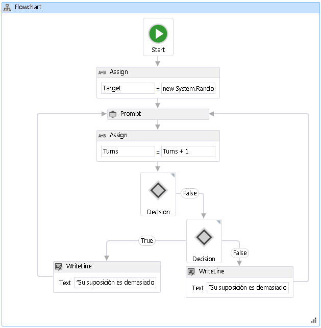

# <a name="how-to-create-a-flowchart-workflow"></a><span data-ttu-id="2057e-102">Crear un flujo de trabajo de diagrama de flujo</span><span class="sxs-lookup"><span data-stu-id="2057e-102">How to: Create a Flowchart Workflow</span></span>
<span data-ttu-id="2057e-103">Se pueden construir flujos de trabajo a partir de actividades integradas, así como de actividades personalizadas.</span><span class="sxs-lookup"><span data-stu-id="2057e-103">Workflows can be constructed from built-in activities as well as from custom activities.</span></span> <span data-ttu-id="2057e-104">Este tema ayudará a crear un flujo de trabajo que utiliza las actividades integradas, como el <xref:System.Activities.Statements.Flowchart> actividad y las actividades personalizadas desde el anterior [Cómo: crear una actividad](../../../docs/framework/windows-workflow-foundation/how-to-create-an-activity.md) tema.</span><span class="sxs-lookup"><span data-stu-id="2057e-104">This topic steps through creating a workflow that uses both built-in activities such as the <xref:System.Activities.Statements.Flowchart> activity, and the custom activities from the previous [How to: Create an Activity](../../../docs/framework/windows-workflow-foundation/how-to-create-an-activity.md) topic.</span></span> <span data-ttu-id="2057e-105">El flujo de trabajo modela un juego de adivinanzas de números.</span><span class="sxs-lookup"><span data-stu-id="2057e-105">The workflow models a number guessing game.</span></span>  
  
> [!NOTE]
>  <span data-ttu-id="2057e-106">Cada uno de los temas del tutorial de introducción depende de los temas anteriores.</span><span class="sxs-lookup"><span data-stu-id="2057e-106">Each topic in the Getting Started tutorial depends on the previous topics.</span></span> <span data-ttu-id="2057e-107">Para completar este tema, debe completar primero [Cómo: crear una actividad](../../../docs/framework/windows-workflow-foundation/how-to-create-an-activity.md).</span><span class="sxs-lookup"><span data-stu-id="2057e-107">To complete this topic, you must first complete [How to: Create an Activity](../../../docs/framework/windows-workflow-foundation/how-to-create-an-activity.md).</span></span>  
  
> [!NOTE]
>  <span data-ttu-id="2057e-108">Para descargar una versión completa del tutorial, consulte [Windows Workflow Foundation (WF45) - Getting Started Tutorial (Windows Workflow Foundation (WF45): tutorial introductorio)](http://go.microsoft.com/fwlink/?LinkID=248976).</span><span class="sxs-lookup"><span data-stu-id="2057e-108">To download a completed version of the tutorial, see [Windows Workflow Foundation (WF45) - Getting Started Tutorial](http://go.microsoft.com/fwlink/?LinkID=248976).</span></span>  
  
### <a name="to-create-the-workflow"></a><span data-ttu-id="2057e-109">Para crear el flujo de trabajo</span><span class="sxs-lookup"><span data-stu-id="2057e-109">To create the workflow</span></span>  
  
1.  <span data-ttu-id="2057e-110">Haga clic en **NumberGuessWorkflowActivities** en **el Explorador de soluciones** y seleccione **agregar**, **nuevo elemento**.</span><span class="sxs-lookup"><span data-stu-id="2057e-110">Right-click **NumberGuessWorkflowActivities** in **Solution Explorer** and select **Add**, **New Item**.</span></span>  
  
2.  <span data-ttu-id="2057e-111">En el **instalado**, **elementos comunes** nodo, seleccione **flujo de trabajo**.</span><span class="sxs-lookup"><span data-stu-id="2057e-111">In the **Installed**, **Common Items** node, select **Workflow**.</span></span> <span data-ttu-id="2057e-112">Seleccione **actividad** desde el **flujo de trabajo** lista.</span><span class="sxs-lookup"><span data-stu-id="2057e-112">Select **Activity** from the **Workflow** list.</span></span>  
  
3.  <span data-ttu-id="2057e-113">Tipo de `FlowchartNumberGuessWorkflow` en el **nombre** y haga clic en **agregar**.</span><span class="sxs-lookup"><span data-stu-id="2057e-113">Type `FlowchartNumberGuessWorkflow` into the **Name** box and click **Add**.</span></span>  
  
4.  <span data-ttu-id="2057e-114">Arrastre un **diagrama de flujo** actividad desde la **diagrama de flujo** sección de la **cuadro de herramientas** y colóquela en la **coloque la actividad aquí** etiquetar en el superficie de diseño de flujo de trabajo.</span><span class="sxs-lookup"><span data-stu-id="2057e-114">Drag a **Flowchart** activity from the **Flowchart** section of the **Toolbox** and drop it onto the **Drop activity here** label on the workflow design surface.</span></span>  
  
### <a name="to-create-the-workflow-variables-and-arguments"></a><span data-ttu-id="2057e-115">Para crear las variables y argumentos de flujo de trabajo</span><span class="sxs-lookup"><span data-stu-id="2057e-115">To create the workflow variables and arguments</span></span>  
  
1.  <span data-ttu-id="2057e-116">Haga doble clic en **FlowchartNumberGuessWorkflow.xaml** en **el Explorador de soluciones** para mostrar el flujo de trabajo en el diseñador, si aún no se muestra.</span><span class="sxs-lookup"><span data-stu-id="2057e-116">Double-click **FlowchartNumberGuessWorkflow.xaml** in **Solution Explorer** to display the workflow in the designer, if it is not already displayed.</span></span>  
  
2.  <span data-ttu-id="2057e-117">Haga clic en **argumentos** en la parte inferior izquierda del Diseñador de flujo de trabajo para mostrar la **argumentos** panel.</span><span class="sxs-lookup"><span data-stu-id="2057e-117">Click **Arguments** in the lower-left side of the workflow designer to display the **Arguments** pane.</span></span>  
  
3.  <span data-ttu-id="2057e-118">Haga clic en **crear argumento**.</span><span class="sxs-lookup"><span data-stu-id="2057e-118">Click **Create Argument**.</span></span>  
  
4.  <span data-ttu-id="2057e-119">Tipo de `MaxNumber` en el **nombre** cuadro, seleccione **en** desde el **dirección** lista desplegable, seleccione **Int32** desde el **Tipo de argumento** lista desplegable y, a continuación, presione ENTRAR para guardar el argumento.</span><span class="sxs-lookup"><span data-stu-id="2057e-119">Type `MaxNumber` into the **Name** box, select **In** from the **Direction** drop-down list, select **Int32** from the **Argument type** drop-down list, and then press ENTER to save the argument.</span></span>  
  
5.  <span data-ttu-id="2057e-120">Haga clic en **crear argumento**.</span><span class="sxs-lookup"><span data-stu-id="2057e-120">Click **Create Argument**.</span></span>  
  
6.  <span data-ttu-id="2057e-121">Tipo de `Turns` en el **nombre** cuadro que se encuentra debajo de la recién agregado `MaxNumber` argumento, seleccione **Out** desde el **dirección** lista desplegable, seleccione  **Int32** desde el **tipo de argumento** lista desplegable y, a continuación, presione ENTRAR.</span><span class="sxs-lookup"><span data-stu-id="2057e-121">Type `Turns` into the **Name** box that is below the newly added `MaxNumber` argument, select **Out** from the **Direction** drop-down list, select **Int32** from the **Argument type** drop-down list, and then press ENTER.</span></span>  
  
7.  <span data-ttu-id="2057e-122">Haga clic en **argumentos** en la parte inferior izquierda del Diseñador de actividad para cerrar la **argumentos** panel.</span><span class="sxs-lookup"><span data-stu-id="2057e-122">Click **Arguments** in the lower-left side of the activity designer to close the **Arguments** pane.</span></span>  
  
8.  <span data-ttu-id="2057e-123">Haga clic en **Variables** en la parte inferior izquierda del Diseñador de flujo de trabajo para mostrar la **Variables** panel.</span><span class="sxs-lookup"><span data-stu-id="2057e-123">Click **Variables** in the lower-left side of the workflow designer to display the **Variables** pane.</span></span>  
  
9. <span data-ttu-id="2057e-124">Haga clic en **crear Variable**.</span><span class="sxs-lookup"><span data-stu-id="2057e-124">Click **Create Variable**.</span></span>  
  
    > [!TIP]
    >  <span data-ttu-id="2057e-125">Si no hay ningún **crear Variable** aparece el cuadro, haga clic en la <xref:System.Activities.Statements.Flowchart> actividad en la superficie del Diseñador de flujo de trabajo para seleccionarla.</span><span class="sxs-lookup"><span data-stu-id="2057e-125">If no **Create Variable** box is displayed, click the <xref:System.Activities.Statements.Flowchart> activity on the workflow designer surface to select it.</span></span>  
  
10. <span data-ttu-id="2057e-126">Tipo de `Guess` en el **nombre** cuadro, seleccione **Int32** desde el **tipo de Variable** lista desplegable y, a continuación, presione ENTRAR para guardar la variable.</span><span class="sxs-lookup"><span data-stu-id="2057e-126">Type `Guess` into the **Name** box, select **Int32** from the **Variable type** drop-down list, and then press ENTER to save the variable.</span></span>  
  
11. <span data-ttu-id="2057e-127">Haga clic en **crear Variable**.</span><span class="sxs-lookup"><span data-stu-id="2057e-127">Click **Create Variable**.</span></span>  
  
12. <span data-ttu-id="2057e-128">Tipo de `Target` en el **nombre** cuadro, seleccione **Int32** desde el **tipo de Variable** lista desplegable y, a continuación, presione ENTRAR para guardar la variable.</span><span class="sxs-lookup"><span data-stu-id="2057e-128">Type `Target` into the **Name** box, select **Int32** from the **Variable type** drop-down list, and then press ENTER to save the variable.</span></span>  
  
13. <span data-ttu-id="2057e-129">Haga clic en **Variables** en la parte inferior izquierda del Diseñador de actividad para cerrar la **Variables** panel.</span><span class="sxs-lookup"><span data-stu-id="2057e-129">Click **Variables** in the lower-left side of the activity designer to close the **Variables** pane.</span></span>  
  
### <a name="to-add-the-workflow-activities"></a><span data-ttu-id="2057e-130">Para agregar actividades de flujo de trabajo</span><span class="sxs-lookup"><span data-stu-id="2057e-130">To add the workflow activities</span></span>  
  
1.  <span data-ttu-id="2057e-131">Arrastre un **asignar** actividad desde la **primitivas** sección de la **cuadro de herramientas** y mantenga el mouse sobre la **iniciar** nodo, que es la parte superior de la diagrama de flujo.</span><span class="sxs-lookup"><span data-stu-id="2057e-131">Drag an **Assign** activity from the **Primitives** section of the **Toolbox** and hover it over the **Start** node, which is at the top of the flowchart.</span></span> <span data-ttu-id="2057e-132">Cuando el **asignar** actividad está por encima del **iniciar** nodo, aparecerán tres triángulos alrededor de la **iniciar** nodo.</span><span class="sxs-lookup"><span data-stu-id="2057e-132">When the **Assign** activity is over the **Start** node, three triangles will appear around the **Start** node.</span></span> <span data-ttu-id="2057e-133">Quitar el **asignar** actividad en el triángulo que está justo debajo del **iniciar** nodo.</span><span class="sxs-lookup"><span data-stu-id="2057e-133">Drop the **Assign** activity on the triangle that is directly below the **Start** node.</span></span> <span data-ttu-id="2057e-134">Esto vinculará los dos elementos juntos y designa el **asignar** actividad como la primera actividad en el diagrama de flujo.</span><span class="sxs-lookup"><span data-stu-id="2057e-134">This will link the two items together and designates the **Assign** activity as the first activity in the flowchart.</span></span>  
  
    > [!NOTE]
    >  <span data-ttu-id="2057e-135">Las actividades también se pueden indicar como actividad de inicio en el flujo de trabajo si se vinculan manualmente al nodo de inicio.</span><span class="sxs-lookup"><span data-stu-id="2057e-135">Activities can also be indicated as the starting activity in the workflow by manually linking them activity to the start node.</span></span> <span data-ttu-id="2057e-136">Para ello, mantenga el mouse sobre la **iniciar** nodo, haga clic en uno de los rectángulos que aparecen cuando el mouse está sobre la **iniciar** nodo y arrastre la conexión de línea hacia abajo hasta la actividad deseada y colóquela en uno de los rectángulos que aparecen.</span><span class="sxs-lookup"><span data-stu-id="2057e-136">To do this, hover the mouse over the **Start** node, click one of the rectangles that appear when the mouse is over the **Start** node, and drag the connecting line down to the desired activity and drop it on one of the rectangles that appear.</span></span> <span data-ttu-id="2057e-137">También puede designar y la actividad como la actividad de inicio haciendo clic en la TI y elegir **establecer como nodo inicial**.</span><span class="sxs-lookup"><span data-stu-id="2057e-137">You can also designate and activity as the starting activity by right-clicking the it and choosing **Set as Start Node**.</span></span>  
  
2.  <span data-ttu-id="2057e-138">Tipo de `Target` en el **a** cuadro y la siguiente expresión en el **escriba una expresión de C#** o **escriba una expresión de VB** cuadro.</span><span class="sxs-lookup"><span data-stu-id="2057e-138">Type `Target` into the **To** box and the following expression into the **Enter a C# Expression** or **Enter a VB expression** box.</span></span>  
  
    ```vb  
    New System.Random().Next(1, MaxNumber + 1)  
    ```  
  
    ```csharp  
    new System.Random().Next(1, MaxNumber + 1)  
    ```  
  
    > [!TIP]
    >  <span data-ttu-id="2057e-139">Si el **cuadro de herramientas** no se muestra la ventana, seleccione **cuadro de herramientas** desde el **vista** menú.</span><span class="sxs-lookup"><span data-stu-id="2057e-139">If the **Toolbox** window is not displayed, select **Toolbox** from the **View** menu.</span></span>  
  
3.  <span data-ttu-id="2057e-140">Arrastre un **Prompt** actividad desde la **NumberGuessWorkflowActivities** sección de la **cuadro de herramientas**, colóquela debajo la **asignar** actividad desde el anterior paso a paso y conecte el **Prompt** actividad para la **asignar** actividad.</span><span class="sxs-lookup"><span data-stu-id="2057e-140">Drag a **Prompt** activity from the **NumberGuessWorkflowActivities** section of the **Toolbox**, drop it below the **Assign** activity from the previous step, and connect the **Prompt** activity to the **Assign** activity.</span></span> <span data-ttu-id="2057e-141">Hay tres maneras de conectar las dos actividades.</span><span class="sxs-lookup"><span data-stu-id="2057e-141">There are three ways to connect the two activities.</span></span> <span data-ttu-id="2057e-142">La primera manera consiste en conectarlas cuando se coloca el **Prompt** actividad en el flujo de trabajo.</span><span class="sxs-lookup"><span data-stu-id="2057e-142">The first way is to connect them as you drop the **Prompt** activity on the workflow.</span></span> <span data-ttu-id="2057e-143">Medida que arrastra la **Prompt** actividad al flujo de trabajo, mantenga el mouse sobre la **asignar** actividad y colóquela en uno de los cuatro triángulos que aparecen cuando el **Prompt** actividad está por encima del **asignar** actividad.</span><span class="sxs-lookup"><span data-stu-id="2057e-143">As you are dragging the **Prompt** activity to the workflow, hover it over the **Assign** activity and drop it onto one of the four triangles that appear when the **Prompt** activity is over the **Assign** activity.</span></span> <span data-ttu-id="2057e-144">La segunda manera es colocar el **Prompt** actividad en el flujo de trabajo en la ubicación deseada.</span><span class="sxs-lookup"><span data-stu-id="2057e-144">The second way is to drop the **Prompt** activity onto the workflow at the desired location.</span></span> <span data-ttu-id="2057e-145">A continuación, mantenga el mouse sobre la **asignar** actividad y arrastre uno de los rectángulos que aparece hacia abajo hasta la **Prompt** actividad.</span><span class="sxs-lookup"><span data-stu-id="2057e-145">Then, hover the mouse over the **Assign** activity and drag one of the rectangles that appears down to the **Prompt** activity.</span></span> <span data-ttu-id="2057e-146">Arrastre el mouse para que la línea de conexión desde el **asignar** actividad se conecta a uno de los rectángulos de la **Prompt** actividad y, a continuación, suelte el botón del mouse.</span><span class="sxs-lookup"><span data-stu-id="2057e-146">Drag the mouse so that the connecting line from the **Assign** activity connects to one of the rectangles of the **Prompt** activity, and then release the mouse button.</span></span> <span data-ttu-id="2057e-147">La tercera es muy similar a la primera, salvo que en lugar de arrastrar la **Prompt** actividad desde la **cuadro de herramientas**, arrástrelo desde su ubicación en la superficie de diseño de flujo de trabajo, mantenga el mouse sobre el  **Asignar** actividad y colóquela en uno de los triángulos que aparece.</span><span class="sxs-lookup"><span data-stu-id="2057e-147">The third way is very similar to the first way, except that instead of dragging the **Prompt** activity from the **Toolbox**, you drag it from its location on the workflow design surface, hover it over the **Assign** activity, and drop it onto one of the triangles that appears.</span></span>  
  
4.  <span data-ttu-id="2057e-148">En el **ventana propiedades** para el **Prompt** actividad, tipo `"EnterGuess"` incluidas las comillas en el **BookmarkName** cuadro de valor de propiedad.</span><span class="sxs-lookup"><span data-stu-id="2057e-148">In the **Properties Window** for the **Prompt** activity, type `"EnterGuess"` including the quotes into the **BookmarkName** property value box.</span></span> <span data-ttu-id="2057e-149">Tipo de `Guess` en el **resultado** propiedad cuadro de valor y escriba la siguiente expresión en el **texto** cuadro de la propiedad.</span><span class="sxs-lookup"><span data-stu-id="2057e-149">Type `Guess` into the **Result** property value box, and type the following expression into the **Text** property box.</span></span>  
  
    ```vb  
    "Please enter a number between 1 and " & MaxNumber  
    ```  
  
    ```csharp  
    "Please enter a number between 1 and " + MaxNumber  
    ```  
  
    > [!TIP]
    >  <span data-ttu-id="2057e-150">Si el **ventana propiedades** no se muestra, seleccione **ventana propiedades** desde el **vista** menú.</span><span class="sxs-lookup"><span data-stu-id="2057e-150">If the **Properties Window** is not displayed, select **Properties Window** from the **View** menu.</span></span>  
  
5.  <span data-ttu-id="2057e-151">Arrastre un **asignar** actividad desde la **primitivas** sección de la **cuadro de herramientas** y conéctela mediante uno de los métodos descritos en el paso anterior para que quede por debajo de la  **Símbolo del sistema** actividad.</span><span class="sxs-lookup"><span data-stu-id="2057e-151">Drag an **Assign** activity from the **Primitives** section of the **Toolbox** and connect it using one of the methods described in the previous step so that it is below the **Prompt** activity.</span></span>  
  
6.  <span data-ttu-id="2057e-152">Tipo de `Turns` en el **a** cuadro y `Turns + 1` en el **escriba una expresión de C#** o **escriba una expresión de VB** cuadro.</span><span class="sxs-lookup"><span data-stu-id="2057e-152">Type `Turns` into the **To** box and `Turns + 1` into the **Enter a C# expression**  or **Enter a VB expression** box.</span></span>  
  
7.  <span data-ttu-id="2057e-153">Arrastre un **FlowDecision** desde el **diagrama de flujo de** sección de la **cuadro de herramientas** y conéctela debajo la **asignar** actividad.</span><span class="sxs-lookup"><span data-stu-id="2057e-153">Drag a **FlowDecision** from the **Flowchart** section of the **Toolbox** and connect it below the **Assign** activity.</span></span> <span data-ttu-id="2057e-154">En el **ventana propiedades**, escriba la siguiente expresión en el **condición** cuadro de valor de propiedad.</span><span class="sxs-lookup"><span data-stu-id="2057e-154">In the **Properties Window**, type the following expression into the **Condition** property value box.</span></span>  
  
    ```vb  
    Guess = Target  
    ```  
  
    ```csharp  
    Guess == Target  
    ```  
  
8.  <span data-ttu-id="2057e-155">Arrastre otra **FlowDecision** actividad desde la **cuadro de herramientas** y colóquela debajo de la primera de ellas.</span><span class="sxs-lookup"><span data-stu-id="2057e-155">Drag another **FlowDecision** activity from the **Toolbox** and drop it below the first one.</span></span> <span data-ttu-id="2057e-156">Conecte las dos actividades arrastrando desde el rectángulo que tiene la etiqueta **False** en la parte superior **FlowDecision** actividad en el rectángulo en la parte superior de la segunda **FlowDecision**actividad.</span><span class="sxs-lookup"><span data-stu-id="2057e-156">Connect the two activities by dragging from the rectangle that is labeled **False** on the top **FlowDecision** activity to the rectangle at the top of the second **FlowDecision** activity.</span></span>  
  
    > [!TIP]
    >  <span data-ttu-id="2057e-157">Si no ve el **True** y **False** las etiquetas en el **FlowDecision**, mantenga el mouse sobre la **FlowDecision**.</span><span class="sxs-lookup"><span data-stu-id="2057e-157">If you do not see the **True** and **False** labels on the **FlowDecision**, hover the mouse over the **FlowDecision**.</span></span>  
  
9. <span data-ttu-id="2057e-158">Haga clic en el segundo **FlowDecision** actividad para seleccionarlo.</span><span class="sxs-lookup"><span data-stu-id="2057e-158">Click the second **FlowDecision** activity to select it.</span></span> <span data-ttu-id="2057e-159">En el **ventana propiedades**, escriba la siguiente expresión en el **condición** cuadro de valor de propiedad.</span><span class="sxs-lookup"><span data-stu-id="2057e-159">In the **Properties Window**, type the following expression into the **Condition** property value box.</span></span>  
  
    ```
    Guess < Target  
    ```  
  
10. <span data-ttu-id="2057e-160">Arrastre dos **WriteLine** actividades desde el **primitivas** sección de la **cuadro de herramientas** y colóquelas para que estén en paralelo por debajo de los dos **FlowDecision**  actividades.</span><span class="sxs-lookup"><span data-stu-id="2057e-160">Drag two **WriteLine** activities from the **Primitives** section of the **Toolbox** and drop them so that they are side by side below the two **FlowDecision** activities.</span></span> <span data-ttu-id="2057e-161">Conectar el **True** acción de la parte inferior **FlowDecision** actividad a la izquierda **WriteLine** actividad y el **False** acción a la derecha **WriteLine** actividad.</span><span class="sxs-lookup"><span data-stu-id="2057e-161">Connect the **True** action of the bottom **FlowDecision** activity to the leftmost **WriteLine** activity, and the **False** action to the rightmost **WriteLine** activity.</span></span>  
  
11. <span data-ttu-id="2057e-162">Haga clic en el extremo izquierdo **WriteLine** actividad para seleccionarla y escriba la siguiente expresión en el **texto** cuadro de valor de propiedad el **ventana propiedades**.</span><span class="sxs-lookup"><span data-stu-id="2057e-162">Click the leftmost **WriteLine** activity to select it, and type the following expression into the **Text** property value box in the **Properties Window**.</span></span>  
  
    ```
    "Your guess is too low."  
    ```  
  
12. <span data-ttu-id="2057e-163">Conectar el **WriteLine** a la izquierda de la **Prompt** actividad que está por encima de él.</span><span class="sxs-lookup"><span data-stu-id="2057e-163">Connect the **WriteLine** to the left side of the **Prompt** activity that is above it.</span></span>  
  
13. <span data-ttu-id="2057e-164">Haga clic en el extremo derecho **WriteLine** actividad para seleccionarla y escriba la siguiente expresión en el **texto** cuadro de valor de propiedad el **ventana propiedades**.</span><span class="sxs-lookup"><span data-stu-id="2057e-164">Click the rightmost **WriteLine** activity to select it, and type the following expression into the **Text** property value box in the **Properties Window**.</span></span>  
  
    ```
    "Your guess is too high."  
    ```  
  
14. <span data-ttu-id="2057e-165">Conectar el **WriteLine** actividad en el lado derecho de la **Prompt** actividad por encima de él.</span><span class="sxs-lookup"><span data-stu-id="2057e-165">Connect the **WriteLine** activity to the right side of the **Prompt** activity above it.</span></span>  
  
     <span data-ttu-id="2057e-166">En el siguiente ejemplo se muestra el flujo de trabajo completado.</span><span class="sxs-lookup"><span data-stu-id="2057e-166">The following example illustrates the completed workflow.</span></span>  
  
     <span data-ttu-id="2057e-167"></span><span class="sxs-lookup"><span data-stu-id="2057e-167"></span></span>  
  
### <a name="to-build-the-workflow"></a><span data-ttu-id="2057e-168">Para compilar el flujo de trabajo</span><span class="sxs-lookup"><span data-stu-id="2057e-168">To build the workflow</span></span>  
  
1.  <span data-ttu-id="2057e-169">Presione Ctrl+MAYÚS+B para compilar la solución.</span><span class="sxs-lookup"><span data-stu-id="2057e-169">Press CTRL+SHIFT+B to build the solution.</span></span>  
  
     <span data-ttu-id="2057e-170">Para obtener instrucciones sobre cómo ejecutar el flujo de trabajo, consulte el tema siguiente, [Cómo: ejecutar un flujo de trabajo](../../../docs/framework/windows-workflow-foundation/how-to-run-a-workflow.md).</span><span class="sxs-lookup"><span data-stu-id="2057e-170">For instructions on how to run the workflow, please see the next topic, [How to: Run a Workflow](../../../docs/framework/windows-workflow-foundation/how-to-run-a-workflow.md).</span></span> <span data-ttu-id="2057e-171">Si ya ha completado la [Cómo: ejecutar un flujo de trabajo](../../../docs/framework/windows-workflow-foundation/how-to-run-a-workflow.md) paso a paso con un estilo diferente de flujo de trabajo y desea ejecutarlo mediante el flujo de trabajo de este paso, ir directamente a la [para compilar y ejecutar la aplicación](../../../docs/framework/windows-workflow-foundation/how-to-run-a-workflow.md#BKMK_ToRunTheApplication)sección de [Cómo: ejecutar un flujo de trabajo](../../../docs/framework/windows-workflow-foundation/how-to-run-a-workflow.md).</span><span class="sxs-lookup"><span data-stu-id="2057e-171">If you have already completed the [How to: Run a Workflow](../../../docs/framework/windows-workflow-foundation/how-to-run-a-workflow.md) step with a different style of workflow and wish to run it using the flowchart workflow from this step, skip ahead to the [To build and run the application](../../../docs/framework/windows-workflow-foundation/how-to-run-a-workflow.md#BKMK_ToRunTheApplication) section of [How to: Run a Workflow](../../../docs/framework/windows-workflow-foundation/how-to-run-a-workflow.md).</span></span>  
  
## <a name="see-also"></a><span data-ttu-id="2057e-172">Vea también</span><span class="sxs-lookup"><span data-stu-id="2057e-172">See Also</span></span>  
 <xref:System.Activities.Statements.Flowchart>  
 <xref:System.Activities.Statements.FlowDecision>  
 [<span data-ttu-id="2057e-173">Programación de Windows Workflow Foundation</span><span class="sxs-lookup"><span data-stu-id="2057e-173">Windows Workflow Foundation Programming</span></span>](../../../docs/framework/windows-workflow-foundation/programming.md)  
 [<span data-ttu-id="2057e-174">Diseño de flujos de trabajo</span><span class="sxs-lookup"><span data-stu-id="2057e-174">Designing Workflows</span></span>](../../../docs/framework/windows-workflow-foundation/designing-workflows.md)  
 [<span data-ttu-id="2057e-175">Tutorial de introducción</span><span class="sxs-lookup"><span data-stu-id="2057e-175">Getting Started Tutorial</span></span>](../../../docs/framework/windows-workflow-foundation/getting-started-tutorial.md)  
 [<span data-ttu-id="2057e-176">Cómo crear una actividad</span><span class="sxs-lookup"><span data-stu-id="2057e-176">How to: Create an Activity</span></span>](../../../docs/framework/windows-workflow-foundation/how-to-create-an-activity.md)  
 [<span data-ttu-id="2057e-177">Cómo ejecutar un flujo de trabajo</span><span class="sxs-lookup"><span data-stu-id="2057e-177">How to: Run a Workflow</span></span>](../../../docs/framework/windows-workflow-foundation/how-to-run-a-workflow.md)
