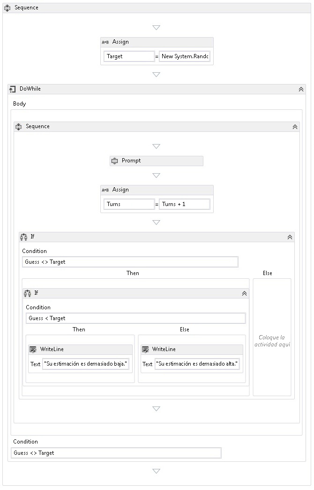

# <a name="how-to-create-a-sequential-workflow"></a>Crear un flujo de trabajo secuencial
Se pueden construir flujos de trabajo a partir de actividades integradas, así como de actividades personalizadas. Este tema ayudará a crear un flujo de trabajo que utiliza las actividades integradas, como el <xref:System.Activities.Statements.Sequence> actividad y las actividades personalizadas desde el anterior [Cómo: crear una actividad](../../../docs/framework/windows-workflow-foundation/how-to-create-an-activity.md) tema. El flujo de trabajo modela un juego de adivinanzas de números.  
  
> [!NOTE]
>  Cada uno de los temas del tutorial de introducción depende de los temas anteriores. Para completar este tema, debe completar primero [Cómo: crear una actividad](../../../docs/framework/windows-workflow-foundation/how-to-create-an-activity.md).  
  
> [!NOTE]
>  Para descargar una versión completa del tutorial, consulte [Windows Workflow Foundation (WF45) - Getting Started Tutorial (Windows Workflow Foundation (WF45): tutorial introductorio)](http://go.microsoft.com/fwlink/?LinkID=248976).  
  
### <a name="to-create-the-workflow"></a>Para crear el flujo de trabajo  
  
1.  Haga clic en **NumberGuessWorkflowActivities** en **el Explorador de soluciones** y seleccione **agregar**, **nuevo elemento**.  
  
2.  En el **instalado**, **elementos comunes** nodo, seleccione **flujo de trabajo**. Seleccione **actividad** desde el **flujo de trabajo** lista.  
  
3.  Tipo de `SequentialNumberGuessWorkflow` en el **nombre** y haga clic en **agregar**.  
  
4.  Arrastre un **secuencia** actividad desde la **flujo de Control** sección de la **cuadro de herramientas** y colóquela en la **coloque la actividad aquí** etiqueta en el superficie de diseño de flujo de trabajo.  
  
### <a name="to-create-the-workflow-variables-and-arguments"></a>Para crear las variables y argumentos de flujo de trabajo  
  
1.  Haga doble clic en **SequentialNumberGuessWorkflow.xaml** en **el Explorador de soluciones** para mostrar el flujo de trabajo en el diseñador, si aún no se muestra.  
  
2.  Haga clic en **argumentos** en la parte inferior izquierda del Diseñador de flujo de trabajo para mostrar la **argumentos** panel.  
  
3.  Haga clic en **crear argumento**.  
  
4.  Tipo de `MaxNumber` en el **nombre** cuadro, seleccione **en** desde el **dirección** lista desplegable, seleccione **Int32** desde el **Tipo de argumento** lista desplegable y, a continuación, presione ENTRAR para guardar el argumento.  
  
5.  Haga clic en **crear argumento**.  
  
6.  Tipo de `Turns` en el **nombre** cuadro que se encuentra debajo de la recién agregado `MaxNumber` argumento, seleccione **Out** desde el **dirección** lista desplegable, seleccione  **Int32** desde el **tipo de argumento** lista desplegable y, a continuación, presione ENTRAR.  
  
7.  Haga clic en **argumentos** en la parte inferior izquierda del Diseñador de actividad para cerrar la **argumentos** panel.  
  
8.  Haga clic en **Variables** en la parte inferior izquierda del Diseñador de flujo de trabajo para mostrar la **Variables** panel.  
  
9. Haga clic en **crear Variable**.  
  
    > [!TIP]
    >  Si no hay ningún **crear Variable** aparece el cuadro, haga clic en el **secuencia** actividad en la superficie del Diseñador de flujo de trabajo para seleccionarla.  
  
10. Tipo de `Guess` en el **nombre** cuadro, seleccione **Int32** desde el **tipo de Variable** lista desplegable y, a continuación, presione ENTRAR para guardar la variable.  
  
11. Haga clic en **crear Variable**.  
  
12. Tipo de `Target` en el **nombre** cuadro, seleccione **Int32** desde el **tipo de Variable** lista desplegable y, a continuación, presione ENTRAR para guardar la variable.  
  
13. Haga clic en **Variables** en la parte inferior izquierda del Diseñador de actividad para cerrar la **Variables** panel.  
  
### <a name="to-add-the-workflow-activities"></a>Para agregar actividades de flujo de trabajo  
  
1.  Arrastre un **asignar** actividad desde el **primitivas** sección de la **cuadro de herramientas** y colóquela sobre la **secuencia** actividad. Tipo de `Target` en el **a** cuadro y la siguiente expresión en el **escriba una expresión de C#** o **escriba una expresión de VB** cuadro.  
  
    ```vb  
    New System.Random().Next(1, MaxNumber + 1)  
    ```  
  
    ```csharp  
    new System.Random().Next(1, MaxNumber + 1)  
    ```  
  
    > [!TIP]
    >  Si el **cuadro de herramientas** no se muestra la ventana, seleccione **cuadro de herramientas** desde el **vista** menú.  
  
2.  Arrastre un **DoWhile** actividad desde la **flujo de Control** sección de la **cuadro de herramientas** y colóquela en el flujo de trabajo para que quede por debajo de la **asignar** actividad.  
  
3.  Escriba la siguiente expresión en el **DoWhile** la actividad **condición** cuadro de valor de propiedad.  
  
    ```vb  
    Guess <> Target  
    ```  
  
    ```csharp  
    Guess != Target  
    ```  
  
     Una actividad <xref:System.Activities.Statements.DoWhile> ejecuta sus actividades secundarias y después evalúa su <xref:System.Activities.Statements.DoWhile.Condition%2A>. Si <xref:System.Activities.Statements.DoWhile.Condition%2A> se evalúa como `True`, las actividades de <xref:System.Activities.Statements.DoWhile> se ejecutan de nuevo. En este ejemplo, se evalúa el intento del usuario y <xref:System.Activities.Statements.DoWhile> continúa hasta que se acierta el número.  
  
4.  Arrastre un **Prompt** actividad desde la **NumberGuessWorkflowActivities** sección de la **cuadro de herramientas** y colóquelo el **DoWhile** actividad en el paso anterior.  
  
5.  En el **ventana propiedades**, tipo `"EnterGuess"` incluidas las comillas en el **BookmarkName** cuadro de valor de propiedad de la **Prompt** actividad. Tipo de `Guess` en el **resultado** propiedad cuadro de valor y escriba la siguiente expresión en el **texto** cuadro de la propiedad.  
  
    ```vb  
    "Please enter a number between 1 and " & MaxNumber  
    ```  
  
    ```csharp  
    "Please enter a number between 1 and " + MaxNumber  
    ```  
  
    > [!TIP]
    >  Si el **ventana propiedades** no se muestra, seleccione **ventana propiedades** desde el **vista** menú.  
  
6.  Arrastre un **asignar** actividad desde la **primitivas** sección de la **cuadro de herramientas** y colóquelo el **DoWhile** actividad para que siga a la **Prompt** actividad.  
  
    > [!NOTE]
    >  Al colocar el **asignar** actividad, observe cómo el Diseñador de flujo de trabajo agrega automáticamente un **secuencia** actividad para contener el **Prompt** recién agregado y actividad **Asignar** actividad.  
  
7.  Tipo de `Turns` en el **a** cuadro y `Turns + 1` en el **escriba una expresión de C#** o **escriba una expresión de VB** cuadro.  
  
8.  Arrastre un **si** actividad desde la **flujo de Control** sección de la **cuadro de herramientas** y colóquelo el **secuencia** actividad para que siga a la recién agregado **asignar** actividad.  
  
9. Escriba la siguiente expresión en el **si** la actividad **condición** cuadro de valor de propiedad.  
  
    ```vb  
    Guess <> Target  
    ```  
  
    ```csharp  
    Guess != Target  
    ```  
  
10. Arrastre otra **si** actividad desde la **flujo de Control** sección de la **cuadro de herramientas** y colóquelo el **, a continuación,** sección de la primera **Si** actividad.  
  
11. Escriba la siguiente expresión en recién agregado **si** la actividad **condición** cuadro de valor de propiedad.  
  
    ```
    Guess < Target  
    ```  
  
12. Arrastre dos **WriteLine** actividades desde el **primitivas** sección de la **cuadro de herramientas** y colóquelas de modo que una esté en el **, a continuación,** sección de recién agregado **si** actividad y otra esté en el **Else** sección.  
  
13. Haga clic en el **WriteLine** actividad en el **, a continuación,** sección para seleccionarla y escriba la siguiente expresión en el **texto** cuadro de valor de propiedad.  
  
    ```vb  
    "Your guess is too low."  
    ```  
  
14. Haga clic en el **WriteLine** actividad en el **Else** sección para seleccionarla y escriba la siguiente expresión en el **texto** cuadro de valor de propiedad.  
  
    ```vb  
    "Your guess is too high."  
    ```  
  
     En el siguiente ejemplo se muestra el flujo de trabajo completado.  
  
       
  
### <a name="to-build-the-workflow"></a>Para compilar el flujo de trabajo  
  
1.  Presione Ctrl+MAYÚS+B para compilar la solución.  
  
     Para obtener instrucciones sobre cómo ejecutar el flujo de trabajo, consulte el tema siguiente, [Cómo: ejecutar un flujo de trabajo](../../../docs/framework/windows-workflow-foundation/how-to-run-a-workflow.md). Si ya ha completado la [Cómo: ejecutar un flujo de trabajo](../../../docs/framework/windows-workflow-foundation/how-to-run-a-workflow.md) paso a paso con un estilo diferente de flujo de trabajo y desea ejecutarlo mediante el flujo de trabajo secuencial de este paso, ir directamente a la [para compilar y ejecutar la aplicación](../../../docs/framework/windows-workflow-foundation/how-to-run-a-workflow.md#BKMK_ToRunTheApplication)sección de [Cómo: ejecutar un flujo de trabajo](../../../docs/framework/windows-workflow-foundation/how-to-run-a-workflow.md).  
  
## <a name="see-also"></a>Vea también  
 <xref:System.Activities.Statements.Flowchart>  
 <xref:System.Activities.Statements.FlowDecision>  
 [Programación de Windows Workflow Foundation](../../../docs/framework/windows-workflow-foundation/programming.md)  
 [Diseño de flujos de trabajo](../../../docs/framework/windows-workflow-foundation/designing-workflows.md)  
 [Tutorial de introducción](../../../docs/framework/windows-workflow-foundation/getting-started-tutorial.md)  
 [Cómo crear una actividad](../../../docs/framework/windows-workflow-foundation/how-to-create-an-activity.md)  
 [Cómo ejecutar un flujo de trabajo](../../../docs/framework/windows-workflow-foundation/how-to-run-a-workflow.md)
