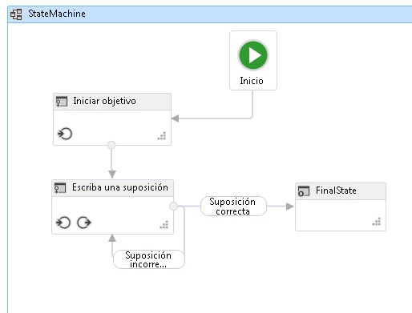

# <a name="how-to-create-a-state-machine-workflow"></a><span data-ttu-id="171e1-102">Filtrar para crear un flujo de trabajo de máquina de estados</span><span class="sxs-lookup"><span data-stu-id="171e1-102">How to: Create a State Machine Workflow</span></span>
<span data-ttu-id="171e1-103">Se pueden construir flujos de trabajo a partir de actividades integradas, así como de actividades personalizadas.</span><span class="sxs-lookup"><span data-stu-id="171e1-103">Workflows can be constructed from built-in activities as well as from custom activities.</span></span> <span data-ttu-id="171e1-104">En este tema le ayudará a crear un flujo de trabajo que usa tanto las actividades integradas, como el <xref:System.Activities.Statements.StateMachine> actividad y las actividades personalizadas del anterior [Cómo: Crear una actividad](how-to-create-an-activity.md) tema.</span><span class="sxs-lookup"><span data-stu-id="171e1-104">This topic steps through creating a workflow that uses both built-in activities such as the <xref:System.Activities.Statements.StateMachine> activity, and the custom activities from the previous [How to: Create an Activity](how-to-create-an-activity.md) topic.</span></span> <span data-ttu-id="171e1-105">El flujo de trabajo modela un juego de adivinanzas de números.</span><span class="sxs-lookup"><span data-stu-id="171e1-105">The workflow models a number guessing game.</span></span>  
  
> [!NOTE]
>  <span data-ttu-id="171e1-106">Cada uno de los temas del tutorial de introducción depende de los temas anteriores.</span><span class="sxs-lookup"><span data-stu-id="171e1-106">Each topic in the Getting Started tutorial depends on the previous topics.</span></span> <span data-ttu-id="171e1-107">Para completar este tema, primero debe completar [Cómo: Crear una actividad](how-to-create-an-activity.md).</span><span class="sxs-lookup"><span data-stu-id="171e1-107">To complete this topic, you must first complete [How to: Create an Activity](how-to-create-an-activity.md).</span></span>  
  
> [!NOTE]
>  <span data-ttu-id="171e1-108">Para descargar una versión completa del tutorial, consulte [Windows Workflow Foundation (WF45) - Getting Started Tutorial (Windows Workflow Foundation (WF45): tutorial introductorio)](https://go.microsoft.com/fwlink/?LinkID=248976).</span><span class="sxs-lookup"><span data-stu-id="171e1-108">To download a completed version of the tutorial, see [Windows Workflow Foundation (WF45) - Getting Started Tutorial](https://go.microsoft.com/fwlink/?LinkID=248976).</span></span>  
  
### <a name="to-create-the-workflow"></a><span data-ttu-id="171e1-109">Para crear el flujo de trabajo</span><span class="sxs-lookup"><span data-stu-id="171e1-109">To create the workflow</span></span>  
  
1.  <span data-ttu-id="171e1-110">Haga clic en **NumberGuessWorkflowActivities** en **el Explorador de soluciones** y seleccione **agregar**, **nuevo elemento**.</span><span class="sxs-lookup"><span data-stu-id="171e1-110">Right-click **NumberGuessWorkflowActivities** in **Solution Explorer** and select **Add**, **New Item**.</span></span>  
  
2.  <span data-ttu-id="171e1-111">En el **instalado**, **elementos comunes** nodo, seleccione **flujo de trabajo**.</span><span class="sxs-lookup"><span data-stu-id="171e1-111">In the **Installed**, **Common Items** node, select **Workflow**.</span></span> <span data-ttu-id="171e1-112">Seleccione **actividad** desde el **flujo de trabajo** lista.</span><span class="sxs-lookup"><span data-stu-id="171e1-112">Select **Activity** from the **Workflow** list.</span></span>  
  
3.  <span data-ttu-id="171e1-113">Tipo `StateMachineNumberGuessWorkflow` en el **nombre** y haga clic en **agregar**.</span><span class="sxs-lookup"><span data-stu-id="171e1-113">Type `StateMachineNumberGuessWorkflow` into the **Name** box and click **Add**.</span></span>  
  
4.  <span data-ttu-id="171e1-114">Arrastre un **StateMachine** actividad desde la **máquina de estados** sección de la **cuadro de herramientas** y colóquela en la **colocar actividad aquí** etiquetar en la superficie de diseño de flujo de trabajo.</span><span class="sxs-lookup"><span data-stu-id="171e1-114">Drag a **StateMachine** activity from the **State Machine** section of the **Toolbox** and drop it onto the **Drop activity here** label on the workflow design surface.</span></span>  
  
### <a name="to-create-the-workflow-variables-and-arguments"></a><span data-ttu-id="171e1-115">Para crear las variables y argumentos de flujo de trabajo</span><span class="sxs-lookup"><span data-stu-id="171e1-115">To create the workflow variables and arguments</span></span>  
  
1.  <span data-ttu-id="171e1-116">Haga doble clic en **StateMachineNumberGuessWorkflow.xaml** en **el Explorador de soluciones** para mostrar el flujo de trabajo en el diseñador, si aún no se muestra.</span><span class="sxs-lookup"><span data-stu-id="171e1-116">Double-click **StateMachineNumberGuessWorkflow.xaml** in **Solution Explorer** to display the workflow in the designer, if it is not already displayed.</span></span>  
  
2.  <span data-ttu-id="171e1-117">Haga clic en **argumentos** en el lado inferior izquierdo del Diseñador de flujo de trabajo para mostrar el **argumentos** panel.</span><span class="sxs-lookup"><span data-stu-id="171e1-117">Click **Arguments** in the lower-left side of the workflow designer to display the **Arguments** pane.</span></span>  
  
3.  <span data-ttu-id="171e1-118">Haga clic en **crear argumento**.</span><span class="sxs-lookup"><span data-stu-id="171e1-118">Click **Create Argument**.</span></span>  
  
4.  <span data-ttu-id="171e1-119">Tipo `MaxNumber` en el **nombre** cuadro, seleccione **en** desde el **dirección** lista desplegable, seleccione **Int32** desde el **Tipo de argumento** lista desplegable y, a continuación, presione ENTRAR para guardar el argumento.</span><span class="sxs-lookup"><span data-stu-id="171e1-119">Type `MaxNumber` into the **Name** box, select **In** from the **Direction** drop-down list, select **Int32** from the **Argument type** drop-down list, and then press ENTER to save the argument.</span></span>  
  
5.  <span data-ttu-id="171e1-120">Haga clic en **crear argumento**.</span><span class="sxs-lookup"><span data-stu-id="171e1-120">Click **Create Argument**.</span></span>  
  
6.  <span data-ttu-id="171e1-121">Tipo `Turns` en el **nombre** cuadro que se encuentra debajo de la recién agregada `MaxNumber` argumento, seleccione **Out** desde el **dirección** lista desplegable, seleccione  **Int32** desde el **tipo de argumento** lista desplegable y, a continuación, presione ENTRAR.</span><span class="sxs-lookup"><span data-stu-id="171e1-121">Type `Turns` into the **Name** box that is below the newly added `MaxNumber` argument, select **Out** from the **Direction** drop-down list, select **Int32** from the **Argument type** drop-down list, and then press ENTER.</span></span>  
  
7.  <span data-ttu-id="171e1-122">Haga clic en **argumentos** en el lado inferior izquierdo del Diseñador de actividad para cerrar el **argumentos** panel.</span><span class="sxs-lookup"><span data-stu-id="171e1-122">Click **Arguments** in the lower-left side of the activity designer to close the **Arguments** pane.</span></span>  
  
8.  <span data-ttu-id="171e1-123">Haga clic en **Variables** en el lado inferior izquierdo del Diseñador de flujo de trabajo para mostrar el **Variables** panel.</span><span class="sxs-lookup"><span data-stu-id="171e1-123">Click **Variables** in the lower-left side of the workflow designer to display the **Variables** pane.</span></span>  
  
9. <span data-ttu-id="171e1-124">Haga clic en **crear Variable**.</span><span class="sxs-lookup"><span data-stu-id="171e1-124">Click **Create Variable**.</span></span>  
  
    > [!TIP]
    >  <span data-ttu-id="171e1-125">Si no hay ningún **crear Variable** se muestra el cuadro, haga clic en el <xref:System.Activities.Statements.StateMachine> actividad en la superficie del Diseñador de flujo de trabajo para seleccionarla.</span><span class="sxs-lookup"><span data-stu-id="171e1-125">If no **Create Variable** box is displayed, click the <xref:System.Activities.Statements.StateMachine> activity on the workflow designer surface to select it.</span></span>  
  
10. <span data-ttu-id="171e1-126">Tipo `Guess` en el **nombre** cuadro, seleccione **Int32** desde el **tipo de Variable** lista desplegable y, a continuación, presione ENTRAR para guardar la variable.</span><span class="sxs-lookup"><span data-stu-id="171e1-126">Type `Guess` into the **Name** box, select **Int32** from the **Variable type** drop-down list, and then press ENTER to save the variable.</span></span>  
  
11. <span data-ttu-id="171e1-127">Haga clic en **crear Variable**.</span><span class="sxs-lookup"><span data-stu-id="171e1-127">Click **Create Variable**.</span></span>  
  
12. <span data-ttu-id="171e1-128">Tipo `Target` en el **nombre** cuadro, seleccione **Int32** desde el **tipo de Variable** lista desplegable y, a continuación, presione ENTRAR para guardar la variable.</span><span class="sxs-lookup"><span data-stu-id="171e1-128">Type `Target` into the **Name** box, select **Int32** from the **Variable type** drop-down list, and then press ENTER to save the variable.</span></span>  
  
13. <span data-ttu-id="171e1-129">Haga clic en **Variables** en el lado inferior izquierdo del Diseñador de actividad para cerrar el **Variables** panel.</span><span class="sxs-lookup"><span data-stu-id="171e1-129">Click **Variables** in the lower-left side of the activity designer to close the **Variables** pane.</span></span>  
  
### <a name="to-add-the-workflow-activities"></a><span data-ttu-id="171e1-130">Para agregar actividades de flujo de trabajo</span><span class="sxs-lookup"><span data-stu-id="171e1-130">To add the workflow activities</span></span>  
  
1.  <span data-ttu-id="171e1-131">Haga clic en **State1** para seleccionarlo.</span><span class="sxs-lookup"><span data-stu-id="171e1-131">Click **State1** to select it.</span></span> <span data-ttu-id="171e1-132">En el **ventana propiedades**, cambie el **DisplayName** a `Initialize Target`.</span><span class="sxs-lookup"><span data-stu-id="171e1-132">In the **Properties Window**, change the **DisplayName** to `Initialize Target`.</span></span>  
  
    > [!TIP]
    >  <span data-ttu-id="171e1-133">Si el **ventana propiedades** no se muestra, seleccione **ventana propiedades** desde el **vista** menú.</span><span class="sxs-lookup"><span data-stu-id="171e1-133">If the **Properties Window** is not displayed, select **Properties Window** from the **View** menu.</span></span>  
  
2.  <span data-ttu-id="171e1-134">Haga doble clic en el nombre cambiado recientemente **inicializar destino** estado en el Diseñador de flujo de trabajo para expandirlo.</span><span class="sxs-lookup"><span data-stu-id="171e1-134">Double-click the newly renamed **Initialize Target** state in the workflow designer to expand it.</span></span>  
  
3.  <span data-ttu-id="171e1-135">Arrastre un **asignar** actividad desde la **primitivas** sección de la **cuadro de herramientas** y colóquela en la **entrada** sección del estado.</span><span class="sxs-lookup"><span data-stu-id="171e1-135">Drag an **Assign** activity from the **Primitives** section of the **Toolbox** and drop it onto the **Entry** section of the state.</span></span> <span data-ttu-id="171e1-136">Tipo `Target` en el **a** cuadro y la siguiente expresión en el **escriba una expresión de C#** o **escriba una expresión de VB** cuadro.</span><span class="sxs-lookup"><span data-stu-id="171e1-136">Type `Target` into the **To** box and the following expression into the **Enter a C# expression** or **Enter a VB expression** box.</span></span>  
  
    ```vb  
    New System.Random().Next(1, MaxNumber + 1)  
    ```  
  
    ```csharp  
    new System.Random().Next(1, MaxNumber + 1)  
    ```  
  
    > [!TIP]
    >  <span data-ttu-id="171e1-137">Si el **cuadro de herramientas** no se muestra la ventana, seleccione **cuadro de herramientas** desde el **vista** menú.</span><span class="sxs-lookup"><span data-stu-id="171e1-137">If the **Toolbox** window is not displayed, select **Toolbox** from the **View** menu.</span></span>  
  
4.  <span data-ttu-id="171e1-138">Volver a general el estado de vista de la máquina en el Diseñador de flujo de trabajo haciendo clic en **StateMachine** en la ruta de navegación que se muestran en la parte superior del Diseñador de flujo de trabajo.</span><span class="sxs-lookup"><span data-stu-id="171e1-138">Return to the overall state machine view in the workflow designer by clicking **StateMachine** in the breadcrumb display at the top of the workflow designer.</span></span>  
  
5.  <span data-ttu-id="171e1-139">Arrastre un **estado** actividad desde la **máquina de estados** sección de la **cuadro de herramientas** hasta el Diseñador de flujo de trabajo y mantenga el mouse sobre el **inicializar destino** estado.</span><span class="sxs-lookup"><span data-stu-id="171e1-139">Drag a **State** activity from the **State Machine** section of the **Toolbox** onto the workflow designer and hover it over the **Initialize Target** state.</span></span> <span data-ttu-id="171e1-140">Tenga en cuenta que aparecerán cuatro triángulos alrededor del **inicializar destino** estado cuando el estado nueva está sobre él.</span><span class="sxs-lookup"><span data-stu-id="171e1-140">Note that four triangles will appear around the **Initialize Target** state when the new state is over it.</span></span> <span data-ttu-id="171e1-141">Coloque el nuevo estado en el triángulo que está justo debajo del **inicializar destino** estado.</span><span class="sxs-lookup"><span data-stu-id="171e1-141">Drop the new state on the triangle that is immediately below the **Initialize Target** state.</span></span> <span data-ttu-id="171e1-142">Esto coloca el nuevo estado en el flujo de trabajo y crea una transición desde el **inicializar destino** estado para el estado nueva.</span><span class="sxs-lookup"><span data-stu-id="171e1-142">This places the new state onto the workflow and creates a transition from the **Initialize Target** state to the new state.</span></span>  
  
6.  <span data-ttu-id="171e1-143">Haga clic en **State1** para seleccionarlo, cambie el **DisplayName** a `Enter Guess`y, a continuación, haga doble clic en el estado en el Diseñador de flujo de trabajo para expandirlo.</span><span class="sxs-lookup"><span data-stu-id="171e1-143">Click **State1** to select it, change the **DisplayName** to `Enter Guess`, and then double-click the state in the workflow designer to expand it.</span></span>  
  
7.  <span data-ttu-id="171e1-144">Arrastre un **WriteLine** actividad desde la **primitivas** sección de la **cuadro de herramientas** y colóquela en la **entrada** sección del estado.</span><span class="sxs-lookup"><span data-stu-id="171e1-144">Drag a **WriteLine** activity from the **Primitives** section of the **Toolbox** and drop it onto the **Entry** section of the state.</span></span>  
  
8.  <span data-ttu-id="171e1-145">Escriba la siguiente expresión en el **texto** cuadro de la propiedad de la **WriteLine**.</span><span class="sxs-lookup"><span data-stu-id="171e1-145">Type the following expression into the **Text** property box of the **WriteLine**.</span></span>  
  
    ```vb  
    "Please enter a number between 1 and " & MaxNumber  
    ```  
  
    ```csharp  
    "Please enter a number between 1 and " + MaxNumber  
    ```  
  
9. <span data-ttu-id="171e1-146">Arrastre un **asignar** actividad desde la **primitivas** sección de la **cuadro de herramientas** y colóquela en la **Exit** sección del estado.</span><span class="sxs-lookup"><span data-stu-id="171e1-146">Drag an **Assign** activity from the **Primitives** section of the **Toolbox** and drop onto the **Exit** section of the state.</span></span>  
  
10. <span data-ttu-id="171e1-147">Tipo `Turns` en el **a** cuadro y `Turns + 1` en el **escriba una expresión de C#** o **escriba una expresión de VB** cuadro.</span><span class="sxs-lookup"><span data-stu-id="171e1-147">Type `Turns` into the **To** box and `Turns + 1` into the **Enter a C# expression** or **Enter a VB expression** box.</span></span>  
  
11. <span data-ttu-id="171e1-148">Volver a general el estado de vista de la máquina en el Diseñador de flujo de trabajo haciendo clic en **StateMachine** en la ruta de navegación que se muestran en la parte superior del Diseñador de flujo de trabajo.</span><span class="sxs-lookup"><span data-stu-id="171e1-148">Return to the overall state machine view in the workflow designer by clicking **StateMachine** in the breadcrumb display at the top of the workflow designer.</span></span>  
  
12. <span data-ttu-id="171e1-149">Arrastre un **FinalState** actividad desde la **máquina de estados** sección de la **cuadro de herramientas**, mantenga el mouse sobre el **Enter Guess** de estado y colóquelo en el triángulo que aparece a la derecha de la **Enter Guess** de estado para que se crea una transición entre **Enter Guess** y **FinalState**.</span><span class="sxs-lookup"><span data-stu-id="171e1-149">Drag a **FinalState** activity from the **State Machine** section of the **Toolbox**, hover it over the **Enter Guess** state, and drop it onto the triangle that appears to the right of the **Enter Guess** state so that a transition is created between **Enter Guess** and **FinalState**.</span></span>  
  
13. <span data-ttu-id="171e1-150">El nombre predeterminado de la transición es **T2**.</span><span class="sxs-lookup"><span data-stu-id="171e1-150">The default name of the transition is **T2**.</span></span> <span data-ttu-id="171e1-151">Haga clic en la transición en el Diseñador de flujo de trabajo para seleccionarla y establezca su **DisplayName** a **Guess Correct**.</span><span class="sxs-lookup"><span data-stu-id="171e1-151">Click the transition in the workflow designer to select it, and set its **DisplayName** to **Guess Correct**.</span></span> <span data-ttu-id="171e1-152">A continuación, haga clic en y seleccione el **FinalState**y arrástrelo a la derecha para que haya espacio para el nombre de la transición completa que se mostrará sin superposición en cualquiera de los dos Estados.</span><span class="sxs-lookup"><span data-stu-id="171e1-152">Then click and select the **FinalState**, and drag it to the right so that there is room for the full transition name to be displayed without overlaying either of the two states.</span></span> <span data-ttu-id="171e1-153">Así resultará más fácil completar los pasos restantes del tutorial.</span><span class="sxs-lookup"><span data-stu-id="171e1-153">This will make it easier to complete the remaining steps in the tutorial.</span></span>  
  
14. <span data-ttu-id="171e1-154">Haga doble clic en el nombre cambiado recientemente **Guess Correct** transición en el Diseñador de flujo de trabajo para expandirlo.</span><span class="sxs-lookup"><span data-stu-id="171e1-154">Double-click the newly renamed **Guess Correct** transition in the workflow designer to expand it.</span></span>  
  
15. <span data-ttu-id="171e1-155">Arrastre un **ReadInt** actividad desde la **NumberGuessWorkflowActivities** sección de la **cuadro de herramientas** y colóquelo el **desencadenador** sección de la transición.</span><span class="sxs-lookup"><span data-stu-id="171e1-155">Drag a **ReadInt** activity from the **NumberGuessWorkflowActivities** section of the **Toolbox** and drop it in the **Trigger** section of the transition.</span></span>  
  
16. <span data-ttu-id="171e1-156">En el **ventana propiedades** para el **ReadInt** actividad, tipo `"EnterGuess"` , incluidas las comillas en el **BookmarkName** cuadro del valor de propiedad y tipo `Guess`en el **resultado** cuadro del valor de propiedad</span><span class="sxs-lookup"><span data-stu-id="171e1-156">In the **Properties Window** for the **ReadInt** activity, type `"EnterGuess"` including the quotes into the **BookmarkName** property value box, and type `Guess` into the **Result** property value box</span></span>  
  
17. <span data-ttu-id="171e1-157">Escriba la siguiente expresión en el **Guess Correct** la transición **condición** cuadro del valor de propiedad.</span><span class="sxs-lookup"><span data-stu-id="171e1-157">Type the following expression into the **Guess Correct** transition’s **Condition** property value box.</span></span>  
  
    ```vb  
    Guess = Target  
    ```  
  
    ```csharp  
    Guess == Target  
    ```  
  
18. <span data-ttu-id="171e1-158">Volver a general el estado de vista de la máquina en el Diseñador de flujo de trabajo haciendo clic en **StateMachine** en la ruta de navegación que se muestran en la parte superior del Diseñador de flujo de trabajo.</span><span class="sxs-lookup"><span data-stu-id="171e1-158">Return to the overall state machine view in the workflow designer by clicking **StateMachine** in the breadcrumb display at the top of the workflow designer.</span></span>  
  
    > [!NOTE]
    >  <span data-ttu-id="171e1-159">Una transición se produce cuando se recibe el evento desencadenador y <xref:System.Activities.Statements.Transition.Condition%2A>, si está presente, se evalúa como `True`.</span><span class="sxs-lookup"><span data-stu-id="171e1-159">A transition occurs when the trigger event is received and the <xref:System.Activities.Statements.Transition.Condition%2A>, if present, evaluates to `True`.</span></span> <span data-ttu-id="171e1-160">Para esta transición, si el usuario `Guess` coincide con generado aleatoriamente `Target`, control pasa a la **FinalState** y se completa el flujo de trabajo.</span><span class="sxs-lookup"><span data-stu-id="171e1-160">For this transition, if the user’s `Guess` matches the randomly generated `Target`, then control passes to the **FinalState** and the workflow completes.</span></span>  
  
19. <span data-ttu-id="171e1-161">Dependiendo de si el intento es correcto, el flujo de trabajo debe realizar la transición a la **FinalState** o volver a la **Enter Guess** estado inténtelo de nuevo.</span><span class="sxs-lookup"><span data-stu-id="171e1-161">Depending on whether the guess is correct, the workflow should transition either to the **FinalState** or back to the **Enter Guess** state for another try.</span></span> <span data-ttu-id="171e1-162">Ambas transiciones comparten el mismo desencadenador de esperar el intento del usuario poder recibir a través de la **ReadInt** actividad.</span><span class="sxs-lookup"><span data-stu-id="171e1-162">Both transitions share the same trigger of waiting for the user’s guess to be received via the **ReadInt** activity.</span></span> <span data-ttu-id="171e1-163">Esto se denomina una transición compartida.</span><span class="sxs-lookup"><span data-stu-id="171e1-163">This is called a shared transition.</span></span> <span data-ttu-id="171e1-164">Para crear una transición compartida, haga clic en el círculo que indica el inicio de la **Guess Correct** transición y arrástrelo hasta el estado deseado.</span><span class="sxs-lookup"><span data-stu-id="171e1-164">To create a shared transition, click the circle that indicates the start of the **Guess Correct** transition and drag it to the desired state.</span></span> <span data-ttu-id="171e1-165">En este caso, la transición es una transición a sí misma, arrastre hasta el punto inicial de la **Guess Correct** transición y colóquela atrás en la parte inferior de la **Enter Guess** estado.</span><span class="sxs-lookup"><span data-stu-id="171e1-165">In this case the transition is a self-transition, so drag the start point of the **Guess Correct** transition and drop it back onto the bottom of the **Enter Guess** state.</span></span> <span data-ttu-id="171e1-166">Después de crear la transición, selecciónela en el Diseñador de flujo de trabajo y establezca su **DisplayName** propiedad **Guess Incorrect**.</span><span class="sxs-lookup"><span data-stu-id="171e1-166">After creating the transition, select it in the workflow designer and set its **DisplayName** property to **Guess Incorrect**.</span></span>  
  
    > [!NOTE]
    >  <span data-ttu-id="171e1-167">Las transiciones compartidas también pueden crearse desde dentro del Diseñador de transición haciendo **Agregar transición de desencadenador compartida** en la parte inferior del diseñador transición y, a continuación, seleccione el estado de destino deseado el  **Estados disponibles para conectar** lista desplegable.</span><span class="sxs-lookup"><span data-stu-id="171e1-167">Shared transitions can also be created from within the transition designer by clicking **Add shared trigger transition** at the bottom of the transition designer, and then selecting the desired target state from the **Available states to connect** drop-down.</span></span>  
  
    > [!NOTE]
    >  <span data-ttu-id="171e1-168">Tenga en cuenta que si la condición <xref:System.Activities.Statements.Transition.Condition%2A> de una transición se evalúa en `false` (o todas las condiciones de una transición de desencadenador compartido se evalúan en `false`), la transición no se producirá y se reprogramarán todos los desencadenadores para todas las transiciones desde el estado.</span><span class="sxs-lookup"><span data-stu-id="171e1-168">Note that if the <xref:System.Activities.Statements.Transition.Condition%2A> of a transition evaluates to `false` (or all of the conditions of a shared trigger transition evaluate to `false`), the transition will not occur and all triggers for all the transitions from the state will be rescheduled.</span></span> <span data-ttu-id="171e1-169">En este tutorial, no puede suceder esta situación debido a la forma en que están configuradas las condiciones (tenemos acciones específicas para determinar si el supuesto es correcto o incorrecto).</span><span class="sxs-lookup"><span data-stu-id="171e1-169">In this tutorial, this situation cannot happen because of the way the conditions are configured (we have specific actions for whether the guess is correct or incorrect).</span></span>  
  
20. <span data-ttu-id="171e1-170">Haga doble clic en el **Guess Incorrect** transición en el Diseñador de flujo de trabajo para expandirlo.</span><span class="sxs-lookup"><span data-stu-id="171e1-170">Double-click the **Guess Incorrect** transition in the workflow designer to expand it.</span></span> <span data-ttu-id="171e1-171">Tenga en cuenta que el **desencadenador** ya está establecido en el mismo **ReadInt** actividad que ha usado el **Guess Correct** transición.</span><span class="sxs-lookup"><span data-stu-id="171e1-171">Note that the **Trigger** is already set to the same **ReadInt** activity that was used by the **Guess Correct** transition.</span></span>  
  
21. <span data-ttu-id="171e1-172">Escriba la siguiente expresión en el **condición** cuadro del valor de propiedad.</span><span class="sxs-lookup"><span data-stu-id="171e1-172">Type the following expression into the **Condition** property value box.</span></span>  
  
    ```vb  
    Guess <> Target  
    ```  
  
    ```csharp  
    Guess != Target  
    ```  
  
22. <span data-ttu-id="171e1-173">Arrastre un **si** actividad desde la **flujo de Control** sección de la **cuadro de herramientas** y colóquelo el **acción** sección de la transición.</span><span class="sxs-lookup"><span data-stu-id="171e1-173">Drag an **If** activity from the **Control Flow** section of the **Toolbox** and drop it in the **Action** section of the transition.</span></span>  
  
23. <span data-ttu-id="171e1-174">Escriba la siguiente expresión en el **si** la actividad **condición** cuadro del valor de propiedad.</span><span class="sxs-lookup"><span data-stu-id="171e1-174">Type the following expression into the **If** activity’s **Condition** property value box.</span></span>  
  
    ```
    Guess < Target  
    ```  
  
24. <span data-ttu-id="171e1-175">Arrastre dos **WriteLine** las actividades desde el **primitivas** sección de la **cuadro de herramientas** y colóquelas de modo que una esté en el **, a continuación,** sección de el **si** actividad y otra esté en el **Else** sección.</span><span class="sxs-lookup"><span data-stu-id="171e1-175">Drag two **WriteLine** activities from the **Primitives** section of the **Toolbox** and drop them so that one is in the **Then** section of the **If** activity, and one is in the **Else** section.</span></span>  
  
25. <span data-ttu-id="171e1-176">Haga clic en el **WriteLine** actividad en el **, a continuación,** sección para seleccionarla y escriba la siguiente expresión en el **texto** cuadro del valor de propiedad.</span><span class="sxs-lookup"><span data-stu-id="171e1-176">Click the **WriteLine** activity in the **Then** section to select it, and type the following expression into the **Text** property value box.</span></span>  
  
    ```
    "Your guess is too low."  
    ```  
  
26. <span data-ttu-id="171e1-177">Haga clic en el **WriteLine** actividad en el **Else** sección para seleccionarla y escriba la siguiente expresión en el **texto** cuadro del valor de propiedad.</span><span class="sxs-lookup"><span data-stu-id="171e1-177">Click the **WriteLine** activity in the **Else** section to select it, and type the following expression into the **Text** property value box.</span></span>  
  
    ```
    "Your guess is too high."  
    ```  
  
27. <span data-ttu-id="171e1-178">Volver a general el estado de vista de la máquina en el Diseñador de flujo de trabajo haciendo clic en **StateMachine** en la ruta de navegación que se muestran en la parte superior del Diseñador de flujo de trabajo.</span><span class="sxs-lookup"><span data-stu-id="171e1-178">Return to the overall state machine view in the workflow designer by clicking **StateMachine** in the breadcrumb display at the top of the workflow designer.</span></span>  
  
     <span data-ttu-id="171e1-179">En el siguiente ejemplo se muestra el flujo de trabajo completado.</span><span class="sxs-lookup"><span data-stu-id="171e1-179">The following example illustrates the completed workflow.</span></span>  
  
     <span data-ttu-id="171e1-180"></span><span class="sxs-lookup"><span data-stu-id="171e1-180"></span></span>  
  
### <a name="to-build-the-workflow"></a><span data-ttu-id="171e1-181">Para compilar el flujo de trabajo</span><span class="sxs-lookup"><span data-stu-id="171e1-181">To build the workflow</span></span>  
  
1.  <span data-ttu-id="171e1-182">Presione Ctrl+MAYÚS+B para compilar la solución.</span><span class="sxs-lookup"><span data-stu-id="171e1-182">Press CTRL+SHIFT+B to build the solution.</span></span>  
  
     <span data-ttu-id="171e1-183">Para obtener instrucciones sobre cómo ejecutar el flujo de trabajo, vea el tema siguiente, [Cómo: Ejecutar un flujo de trabajo](how-to-run-a-workflow.md).</span><span class="sxs-lookup"><span data-stu-id="171e1-183">For instructions on how to run the workflow, please see the next topic, [How to: Run a Workflow](how-to-run-a-workflow.md).</span></span> <span data-ttu-id="171e1-184">Si ya ha completado la [Cómo: Ejecutar un flujo de trabajo](how-to-run-a-workflow.md) paso con un estilo diferente de flujo de trabajo y desea ejecutarlo mediante el flujo de trabajo de máquina de estado de este paso, puede ir directamente a la [para compilar y ejecutar la aplicación](how-to-run-a-workflow.md#BKMK_ToRunTheApplication) sección de [Cómo: Ejecutar un flujo de trabajo](how-to-run-a-workflow.md).</span><span class="sxs-lookup"><span data-stu-id="171e1-184">If you have already completed the [How to: Run a Workflow](how-to-run-a-workflow.md) step with a different style of workflow and wish to run it using the state machine workflow from this step, skip ahead to the [To build and run the application](how-to-run-a-workflow.md#BKMK_ToRunTheApplication) section of [How to: Run a Workflow](how-to-run-a-workflow.md).</span></span>  
  
## <a name="see-also"></a><span data-ttu-id="171e1-185">Vea también</span><span class="sxs-lookup"><span data-stu-id="171e1-185">See also</span></span>

- <xref:System.Activities.Statements.Flowchart>
- <xref:System.Activities.Statements.FlowDecision>
- [<span data-ttu-id="171e1-186">Programación de Windows Workflow Foundation</span><span class="sxs-lookup"><span data-stu-id="171e1-186">Windows Workflow Foundation Programming</span></span>](programming.md)
- [<span data-ttu-id="171e1-187">Diseñar flujos de trabajo</span><span class="sxs-lookup"><span data-stu-id="171e1-187">Designing Workflows</span></span>](designing-workflows.md)
- [<span data-ttu-id="171e1-188">Tutorial de introducción</span><span class="sxs-lookup"><span data-stu-id="171e1-188">Getting Started Tutorial</span></span>](getting-started-tutorial.md)
- [<span data-ttu-id="171e1-189">Filtrar para crear una actividad</span><span class="sxs-lookup"><span data-stu-id="171e1-189">How to: Create an Activity</span></span>](how-to-create-an-activity.md)
- [<span data-ttu-id="171e1-190">Filtrar para ejecutar un flujo de trabajo</span><span class="sxs-lookup"><span data-stu-id="171e1-190">How to: Run a Workflow</span></span>](how-to-run-a-workflow.md)
