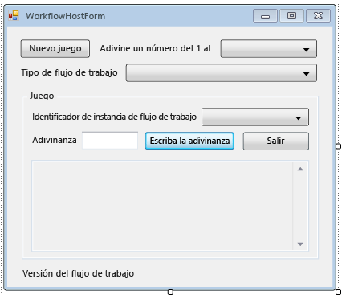

# <a name="how-to-create-and-run-a-long-running-workflow"></a><span data-ttu-id="8da01-102">Cómo: Crear y ejecutar un flujo de trabajo de larga ejecución</span><span class="sxs-lookup"><span data-stu-id="8da01-102">How to: Create and Run a Long Running Workflow</span></span>
<span data-ttu-id="8da01-103">Una de las características principales de [!INCLUDE[wf](../../../includes/wf-md.md)] es la capacidad del tiempo de ejecución de conservar y descargar flujos de trabajo inactivos en una base de datos.</span><span class="sxs-lookup"><span data-stu-id="8da01-103">One of the central features of [!INCLUDE[wf](../../../includes/wf-md.md)] is the runtime’s ability to persist and unload idle workflows to a database.</span></span> <span data-ttu-id="8da01-104">Los pasos descritos en [Cómo: ejecutar un flujo de trabajo](../../../docs/framework/windows-workflow-foundation/how-to-run-a-workflow.md) muestra los conceptos básicos de hospedaje de flujo de trabajo utilizando una aplicación de consola.</span><span class="sxs-lookup"><span data-stu-id="8da01-104">The steps in [How to: Run a Workflow](../../../docs/framework/windows-workflow-foundation/how-to-run-a-workflow.md) demonstrated the basics of workflow hosting using a console application.</span></span> <span data-ttu-id="8da01-105">Se mostraron ejemplos de cómo iniciar flujos de trabajo, de los controladores de ciclo de vida de los flujos de trabajo y de los marcadores de reanudación.</span><span class="sxs-lookup"><span data-stu-id="8da01-105">Examples were shown of starting workflows, workflow lifecycle handlers, and resuming bookmarks.</span></span> <span data-ttu-id="8da01-106">Para demostrar la persistencia del flujo de trabajo con efectividad, es necesario un host de flujo de trabajo más complejo que admita el inicio y la reanudación de varias instancias de flujo de trabajo.</span><span class="sxs-lookup"><span data-stu-id="8da01-106">In order to demonstrate workflow persistence effectively, a more complex workflow host is required that supports starting and resuming multiple workflow instances.</span></span> <span data-ttu-id="8da01-107">En este paso del tutorial se muestra cómo crear una aplicación host de Windows Forms que admita iniciar y reanudar varias instancias de flujo de trabajo o la persistencia del flujo de trabajo, y que proporcione una base para características avanzadas como el seguimiento y el control de versiones mostrado en los siguientes pasos del tutorial.</span><span class="sxs-lookup"><span data-stu-id="8da01-107">This step in the tutorial demonstrates how to create a Windows form host application that supports starting and resuming multiple workflow instances, workflow persistence, and provides a basis for the advanced features such as tracking and versioning that are demonstrated in subsequent tutorial steps.</span></span>  
  
> [!NOTE]
>  <span data-ttu-id="8da01-108">Este paso del tutorial y los pasos siguientes utilizan los tres tipos de flujo de trabajo de [Cómo: crear un flujo de trabajo](../../../docs/framework/windows-workflow-foundation/how-to-create-a-workflow.md).</span><span class="sxs-lookup"><span data-stu-id="8da01-108">This tutorial step and the subsequent steps use all three workflow types from [How to: Create a Workflow](../../../docs/framework/windows-workflow-foundation/how-to-create-a-workflow.md).</span></span> <span data-ttu-id="8da01-109">Si no completó los tres tipos, puede descargar una versión completa de los pasos del [Windows Workflow Foundation (WF45) - Tutorial de introducción](http://go.microsoft.com/fwlink/?LinkID=248976).</span><span class="sxs-lookup"><span data-stu-id="8da01-109">If you did not complete all three types you can download a completed version of the steps from [Windows Workflow Foundation (WF45) - Getting Started Tutorial](http://go.microsoft.com/fwlink/?LinkID=248976).</span></span>  
  
> [!NOTE]
>  <span data-ttu-id="8da01-110">Para descargar una versión completada o ver un tutorial en vídeo del tutorial, vea [Windows Workflow Foundation (WF45) - Tutorial de introducción](http://go.microsoft.com/fwlink/?LinkID=248976).</span><span class="sxs-lookup"><span data-stu-id="8da01-110">To download a completed version or view a video walkthrough of the tutorial, see [Windows Workflow Foundation (WF45) - Getting Started Tutorial](http://go.microsoft.com/fwlink/?LinkID=248976).</span></span>  
  
## <a name="in-this-topic"></a><span data-ttu-id="8da01-111">En este tema</span><span class="sxs-lookup"><span data-stu-id="8da01-111">In this topic</span></span>  
  
-   [<span data-ttu-id="8da01-112">Para crear la base de datos de persistencia</span><span class="sxs-lookup"><span data-stu-id="8da01-112">To create the persistence database</span></span>](../../../docs/framework/windows-workflow-foundation/how-to-create-and-run-a-long-running-workflow.md#BKMK_CreatePersistenceDatabase)  
  
-   [<span data-ttu-id="8da01-113">Para agregar la referencia a los ensamblados de DurableInstancing</span><span class="sxs-lookup"><span data-stu-id="8da01-113">To add the reference to the DurableInstancing assemblies</span></span>](../../../docs/framework/windows-workflow-foundation/how-to-create-and-run-a-long-running-workflow.md#BKMK_AddReference)  
  
-   [<span data-ttu-id="8da01-114">Para crear el formulario de host de flujo de trabajo</span><span class="sxs-lookup"><span data-stu-id="8da01-114">To create the workflow host form</span></span>](../../../docs/framework/windows-workflow-foundation/how-to-create-and-run-a-long-running-workflow.md#BKMK_CreateForm)  
  
-   [<span data-ttu-id="8da01-115">Para agregar las propiedades y métodos auxiliares del formulario</span><span class="sxs-lookup"><span data-stu-id="8da01-115">To add the properties and helper methods of the form</span></span>](../../../docs/framework/windows-workflow-foundation/how-to-create-and-run-a-long-running-workflow.md#BKMK_AddHelperMethods)  
  
-   [<span data-ttu-id="8da01-116">Para configurar el almacén de instancias, controladores de ciclo de vida de flujo de trabajo y extensiones</span><span class="sxs-lookup"><span data-stu-id="8da01-116">To configure the instance store, workflow lifecycle handlers, and extensions</span></span>](../../../docs/framework/windows-workflow-foundation/how-to-create-and-run-a-long-running-workflow.md#BKMK_ConfigureWorkflowApplication)  
  
-   [<span data-ttu-id="8da01-117">Para habilitar el inicio y la reanudación de varios tipos de flujo de trabajo</span><span class="sxs-lookup"><span data-stu-id="8da01-117">To enable starting and resuming multiple workflow types</span></span>](../../../docs/framework/windows-workflow-foundation/how-to-create-and-run-a-long-running-workflow.md#BKMK_WorkflowVersionMap)  
  
-   [<span data-ttu-id="8da01-118">Para iniciar un nuevo flujo de trabajo</span><span class="sxs-lookup"><span data-stu-id="8da01-118">To start a new workflow</span></span>](../../../docs/framework/windows-workflow-foundation/how-to-create-and-run-a-long-running-workflow.md#BKMK_StartWorkflow)  
  
-   [<span data-ttu-id="8da01-119">Para reanudar un flujo de trabajo</span><span class="sxs-lookup"><span data-stu-id="8da01-119">To resume a workflow</span></span>](../../../docs/framework/windows-workflow-foundation/how-to-create-and-run-a-long-running-workflow.md#BKMK_ResumeWorkflow)  
  
-   [<span data-ttu-id="8da01-120">Para finalizar un flujo de trabajo</span><span class="sxs-lookup"><span data-stu-id="8da01-120">To terminate a workflow</span></span>](../../../docs/framework/windows-workflow-foundation/how-to-create-and-run-a-long-running-workflow.md#BKMK_TerminateWorkflow)  
  
-   [<span data-ttu-id="8da01-121">Para compilar y ejecutar la aplicación</span><span class="sxs-lookup"><span data-stu-id="8da01-121">To build and run the application</span></span>](../../../docs/framework/windows-workflow-foundation/how-to-create-and-run-a-long-running-workflow.md#BKMK_BuildAndRun)  
  
###  <a name="BKMK_CreatePersistenceDatabase"></a><span data-ttu-id="8da01-122">Para crear la base de datos de persistencia</span><span class="sxs-lookup"><span data-stu-id="8da01-122">To create the persistence database</span></span>  
  
1.  <span data-ttu-id="8da01-123">Abra SQL Server Management Studio y conéctese al servidor local, por ejemplo **. \SQLEXPRESS**.</span><span class="sxs-lookup"><span data-stu-id="8da01-123">Open SQL Server Management Studio and connect to the local server, for example **.\SQLEXPRESS**.</span></span> <span data-ttu-id="8da01-124">Haga clic en el **bases de datos** nodo en el servidor local y seleccione **nueva base de datos**.</span><span class="sxs-lookup"><span data-stu-id="8da01-124">Right-click the **Databases** node on the local server, and select **New Database**.</span></span> <span data-ttu-id="8da01-125">Nombre de la base de datos nueva **WF45GettingStartedTutorial**, acepte todos los demás valores y seleccione **Aceptar**.</span><span class="sxs-lookup"><span data-stu-id="8da01-125">Name the new database **WF45GettingStartedTutorial**, accept all other values, and select **OK**.</span></span>  
  
    > [!NOTE]
    >  <span data-ttu-id="8da01-126">Asegúrese de que tiene **Create Database** permiso en el servidor local antes de crear la base de datos.</span><span class="sxs-lookup"><span data-stu-id="8da01-126">Ensure that you have **Create Database** permission on the local server before creating the database.</span></span>  
  
2.  <span data-ttu-id="8da01-127">Elija **abiertos**, **archivo** desde el **archivo** menú.</span><span class="sxs-lookup"><span data-stu-id="8da01-127">Choose **Open**, **File** from the **File** menu.</span></span> <span data-ttu-id="8da01-128">Busque la siguiente carpeta: `C:\Windows\Microsoft.NET\Framework\4.0.30319\sql\en`</span><span class="sxs-lookup"><span data-stu-id="8da01-128">Browse to the following folder: `C:\Windows\Microsoft.NET\Framework\4.0.30319\sql\en`</span></span>  
  
     <span data-ttu-id="8da01-129">Seleccione los dos archivos siguientes y haga clic en **abiertos**.</span><span class="sxs-lookup"><span data-stu-id="8da01-129">Select the following two files and click **Open**.</span></span>  
  
    -   <span data-ttu-id="8da01-130">SqlWorkflowInstanceStoreLogic.sql</span><span class="sxs-lookup"><span data-stu-id="8da01-130">SqlWorkflowInstanceStoreLogic.sql</span></span>  
  
    -   <span data-ttu-id="8da01-131">SqlWorkflowInstanceStoreSchema.sql</span><span class="sxs-lookup"><span data-stu-id="8da01-131">SqlWorkflowInstanceStoreSchema.sql</span></span>  
  
3.  <span data-ttu-id="8da01-132">Elija **SqlWorkflowInstanceStoreSchema.sql** desde el **ventana** menú.</span><span class="sxs-lookup"><span data-stu-id="8da01-132">Choose **SqlWorkflowInstanceStoreSchema.sql** from the **Window** menu.</span></span> <span data-ttu-id="8da01-133">Asegúrese de que **WF45GettingStartedTutorial** está seleccionado en el **bases de datos disponibles** lista desplegable y elija **Execute** desde el **consulta**menú.</span><span class="sxs-lookup"><span data-stu-id="8da01-133">Ensure that **WF45GettingStartedTutorial** is selected in the **Available Databases** drop-down and choose **Execute** from the **Query** menu.</span></span>  
  
4.  <span data-ttu-id="8da01-134">Elija **SqlWorkflowInstanceStoreLogic.sql** desde el **ventana** menú.</span><span class="sxs-lookup"><span data-stu-id="8da01-134">Choose **SqlWorkflowInstanceStoreLogic.sql** from the **Window** menu.</span></span> <span data-ttu-id="8da01-135">Asegúrese de que **WF45GettingStartedTutorial** está seleccionado en el **bases de datos disponibles** lista desplegable y elija **Execute** desde el **consulta**menú.</span><span class="sxs-lookup"><span data-stu-id="8da01-135">Ensure that **WF45GettingStartedTutorial** is selected in the **Available Databases** drop-down and choose **Execute** from the **Query** menu.</span></span>  
  
    > [!WARNING]
    >  <span data-ttu-id="8da01-136">Es importante realizar los dos pasos anteriores en el orden correcto.</span><span class="sxs-lookup"><span data-stu-id="8da01-136">It is important to perform the previous two steps in the correct order.</span></span> <span data-ttu-id="8da01-137">Si las consultas se ejecutan de manera desordenada, aparecerán errores y la base de datos de persistencia no se configurará correctamente.</span><span class="sxs-lookup"><span data-stu-id="8da01-137">If the queries are executed out of order, errors occur and the persistence database is not configured correctly.</span></span>  
  
###  <a name="BKMK_AddReference"></a><span data-ttu-id="8da01-138">Para agregar la referencia a los ensamblados de DurableInstancing</span><span class="sxs-lookup"><span data-stu-id="8da01-138">To add the reference to the DurableInstancing assemblies</span></span>  
  
1.  <span data-ttu-id="8da01-139">Haga clic en **NumberGuessWorkflowHost** en **el Explorador de soluciones** y seleccione **Agregar referencia**.</span><span class="sxs-lookup"><span data-stu-id="8da01-139">Right-click **NumberGuessWorkflowHost** in **Solution Explorer** and select **Add Reference**.</span></span>  
  
2.  <span data-ttu-id="8da01-140">Seleccione **ensamblados** desde el **Agregar referencia** lista y escriba `DurableInstancing` en el **buscar ensamblados** cuadro.</span><span class="sxs-lookup"><span data-stu-id="8da01-140">Select **Assemblies** from the **Add Reference** list, and type `DurableInstancing` into the **Search Assemblies** box.</span></span> <span data-ttu-id="8da01-141">Esto filtrará los ensamblados y simplificará la selección de las referencias deseadas.</span><span class="sxs-lookup"><span data-stu-id="8da01-141">This filters the assemblies and makes the desired references easier to select.</span></span>  
  
3.  <span data-ttu-id="8da01-142">Active la casilla situada junto a **System.Activities.DurableInstancing** y **System.Runtime.DurableInstancing** desde el **resultados de la búsqueda** lista y haga clic en **Aceptar**.</span><span class="sxs-lookup"><span data-stu-id="8da01-142">Check the checkbox beside **System.Activities.DurableInstancing** and **System.Runtime.DurableInstancing** from the **Search Results** list, and click **OK**.</span></span>  
  
###  <a name="BKMK_CreateForm"></a><span data-ttu-id="8da01-143">Para crear el formulario de host de flujo de trabajo</span><span class="sxs-lookup"><span data-stu-id="8da01-143">To create the workflow host form</span></span>  
  
> [!NOTE]
>  <span data-ttu-id="8da01-144">Los pasos de este procedimiento describen cómo agregar y configurar el formulario manualmente.</span><span class="sxs-lookup"><span data-stu-id="8da01-144">The steps in this procedure describe how to add and configure the form manually.</span></span> <span data-ttu-id="8da01-145">Si lo desea, puede descargar los archivos de solución para el tutorial y agregar el formulario completo al proyecto.</span><span class="sxs-lookup"><span data-stu-id="8da01-145">If desired, you can download the solution files for the tutorial and add the completed form to the project.</span></span> <span data-ttu-id="8da01-146">Para descargar los archivos del tutorial, vea [Windows Workflow Foundation (WF45) - Tutorial de introducción](http://go.microsoft.com/fwlink/?LinkID=248976).</span><span class="sxs-lookup"><span data-stu-id="8da01-146">To download the tutorial files, see [Windows Workflow Foundation (WF45) - Getting Started Tutorial](http://go.microsoft.com/fwlink/?LinkID=248976).</span></span> <span data-ttu-id="8da01-147">Una vez que se descargan los archivos, haga clic en **NumberGuessWorkflowHost** y elija **Agregar referencia**.</span><span class="sxs-lookup"><span data-stu-id="8da01-147">Once the files are downloaded, right-click **NumberGuessWorkflowHost** and choose **Add Reference**.</span></span> <span data-ttu-id="8da01-148">Agregue una referencia a **System.Windows.Forms** y **System.Drawing**.</span><span class="sxs-lookup"><span data-stu-id="8da01-148">Add a reference to **System.Windows.Forms** and **System.Drawing**.</span></span> <span data-ttu-id="8da01-149">Estas referencias se agregan automáticamente si agrega un nuevo formulario desde el **agregar**, **nuevo elemento** menú, pero se deben agregar manualmente al importar un formulario.</span><span class="sxs-lookup"><span data-stu-id="8da01-149">These references are added automatically if you add a new form from the **Add**, **New Item** menu, but must be added manually when importing a form.</span></span> <span data-ttu-id="8da01-150">Una vez que se agregan las referencias, haga clic en **NumberGuessWorkflowHost** en **el Explorador de soluciones** y elija **agregar**, **elemento existente**.</span><span class="sxs-lookup"><span data-stu-id="8da01-150">Once the references are added, right-click **NumberGuessWorkflowHost** in **Solution Explorer** and choose **Add**, **Existing Item**.</span></span> <span data-ttu-id="8da01-151">Vaya a la `Form` carpeta en los archivos de proyecto, seleccione **WorkflowHostForm.cs** (o **WorkflowHostForm.vb**) y haga clic en **agregar**.</span><span class="sxs-lookup"><span data-stu-id="8da01-151">Browse to the `Form` folder in the project files, select **WorkflowHostForm.cs** (or **WorkflowHostForm.vb**), and click **Add**.</span></span> <span data-ttu-id="8da01-152">Si decide importar el formulario, puede saltar a la siguiente sección, [para agregar las propiedades y métodos auxiliares del formulario](../../../docs/framework/windows-workflow-foundation/how-to-create-and-run-a-long-running-workflow.md#BKMK_AddHelperMethods).</span><span class="sxs-lookup"><span data-stu-id="8da01-152">If you choose to import the form, then you can skip down to the next section, [To add the properties and helper methods of the form](../../../docs/framework/windows-workflow-foundation/how-to-create-and-run-a-long-running-workflow.md#BKMK_AddHelperMethods).</span></span>  
  
1.  <span data-ttu-id="8da01-153">Haga clic en **NumberGuessWorkflowHost** en **el Explorador de soluciones** y elija **agregar**, **nuevo elemento**.</span><span class="sxs-lookup"><span data-stu-id="8da01-153">Right-click **NumberGuessWorkflowHost** in **Solution Explorer** and choose **Add**, **New Item**.</span></span>  
  
2.  <span data-ttu-id="8da01-154">En el **instalado** plantillas de lista, elija **Windows Form**, tipo `WorkflowHostForm` en el **nombre** cuadro y haga clic en **agregar**.</span><span class="sxs-lookup"><span data-stu-id="8da01-154">In the **Installed** templates list, choose **Windows Form**, type `WorkflowHostForm` in the **Name** box, and click **Add**.</span></span>  
  
3.  <span data-ttu-id="8da01-155">Configure las siguientes propiedades en el formulario.</span><span class="sxs-lookup"><span data-stu-id="8da01-155">Configure the following properties on the form.</span></span>  
  
    |<span data-ttu-id="8da01-156">Propiedad</span><span class="sxs-lookup"><span data-stu-id="8da01-156">Property</span></span>|<span data-ttu-id="8da01-157">Valor</span><span class="sxs-lookup"><span data-stu-id="8da01-157">Value</span></span>|  
    |--------------|-----------|  
    |<span data-ttu-id="8da01-158">FormBorderStyle</span><span class="sxs-lookup"><span data-stu-id="8da01-158">FormBorderStyle</span></span>|<span data-ttu-id="8da01-159">FixedSingle</span><span class="sxs-lookup"><span data-stu-id="8da01-159">FixedSingle</span></span>|  
    |<span data-ttu-id="8da01-160">MaximizeBox</span><span class="sxs-lookup"><span data-stu-id="8da01-160">MaximizeBox</span></span>|<span data-ttu-id="8da01-161">False</span><span class="sxs-lookup"><span data-stu-id="8da01-161">False</span></span>|  
    |<span data-ttu-id="8da01-162">Tamaño</span><span class="sxs-lookup"><span data-stu-id="8da01-162">Size</span></span>|<span data-ttu-id="8da01-163">400, 420</span><span class="sxs-lookup"><span data-stu-id="8da01-163">400, 420</span></span>|  
  
4.  <span data-ttu-id="8da01-164">Agregue los siguientes controles al formulario en el orden especificado y configure las propiedades como dirigidas.</span><span class="sxs-lookup"><span data-stu-id="8da01-164">Add the following controls to the form in the order specified and configure the properties as directed.</span></span>  
  
    |<span data-ttu-id="8da01-165">Control</span><span class="sxs-lookup"><span data-stu-id="8da01-165">Control</span></span>|<span data-ttu-id="8da01-166">Propiedad: valor</span><span class="sxs-lookup"><span data-stu-id="8da01-166">Property: Value</span></span>|  
    |-------------|---------------------|  
    |<span data-ttu-id="8da01-167">**Button**</span><span class="sxs-lookup"><span data-stu-id="8da01-167">**Button**</span></span>|<span data-ttu-id="8da01-168">Nombre: NewGame</span><span class="sxs-lookup"><span data-stu-id="8da01-168">Name: NewGame</span></span><br /><br /> <span data-ttu-id="8da01-169">Ubicación: 13, 13</span><span class="sxs-lookup"><span data-stu-id="8da01-169">Location: 13, 13</span></span><br /><br /> <span data-ttu-id="8da01-170">Tamaño: 75, 23</span><span class="sxs-lookup"><span data-stu-id="8da01-170">Size: 75, 23</span></span><br /><br /> <span data-ttu-id="8da01-171">Texto: Nueva partida</span><span class="sxs-lookup"><span data-stu-id="8da01-171">Text: New Game</span></span>|  
    |<span data-ttu-id="8da01-172">**Label**</span><span class="sxs-lookup"><span data-stu-id="8da01-172">**Label**</span></span>|<span data-ttu-id="8da01-173">Ubicación: 94, 18</span><span class="sxs-lookup"><span data-stu-id="8da01-173">Location: 94, 18</span></span><br /><br /> <span data-ttu-id="8da01-174">Texto: Adivine un número entre 1 y</span><span class="sxs-lookup"><span data-stu-id="8da01-174">Text: Guess a number from 1 to</span></span>|  
    |<span data-ttu-id="8da01-175">**ComboBox**</span><span class="sxs-lookup"><span data-stu-id="8da01-175">**ComboBox**</span></span>|<span data-ttu-id="8da01-176">Nombre: NumberRange</span><span class="sxs-lookup"><span data-stu-id="8da01-176">Name: NumberRange</span></span><br /><br /> <span data-ttu-id="8da01-177">DropDownStyle: DropDownList</span><span class="sxs-lookup"><span data-stu-id="8da01-177">DropDownStyle: DropDownList</span></span><br /><br /> <span data-ttu-id="8da01-178">Elementos: 10, 100, 1000</span><span class="sxs-lookup"><span data-stu-id="8da01-178">Items: 10, 100, 1000</span></span><br /><br /> <span data-ttu-id="8da01-179">Ubicación: 228, 12</span><span class="sxs-lookup"><span data-stu-id="8da01-179">Location: 228, 12</span></span><br /><br /> <span data-ttu-id="8da01-180">Tamaño: 143, 21</span><span class="sxs-lookup"><span data-stu-id="8da01-180">Size: 143, 21</span></span>|  
    |<span data-ttu-id="8da01-181">**Label**</span><span class="sxs-lookup"><span data-stu-id="8da01-181">**Label**</span></span>|<span data-ttu-id="8da01-182">Ubicación: 13, 43</span><span class="sxs-lookup"><span data-stu-id="8da01-182">Location: 13, 43</span></span><br /><br /> <span data-ttu-id="8da01-183">Texto: Tipo de flujo de trabajo</span><span class="sxs-lookup"><span data-stu-id="8da01-183">Text: Workflow type</span></span>|  
    |<span data-ttu-id="8da01-184">**ComboBox**</span><span class="sxs-lookup"><span data-stu-id="8da01-184">**ComboBox**</span></span>|<span data-ttu-id="8da01-185">Nombre: WorkflowType</span><span class="sxs-lookup"><span data-stu-id="8da01-185">Name: WorkflowType</span></span><br /><br /> <span data-ttu-id="8da01-186">DropDownStyle: DropDownList</span><span class="sxs-lookup"><span data-stu-id="8da01-186">DropDownStyle: DropDownList</span></span><br /><br /> <span data-ttu-id="8da01-187">Elementos: StateMachineNumberGuessWorkflow, FlowchartNumberGuessWorkflow, SequentialNumberGuessWorkflow</span><span class="sxs-lookup"><span data-stu-id="8da01-187">Items: StateMachineNumberGuessWorkflow, FlowchartNumberGuessWorkflow, SequentialNumberGuessWorkflow</span></span><br /><br /> <span data-ttu-id="8da01-188">Ubicación: 94, 40</span><span class="sxs-lookup"><span data-stu-id="8da01-188">Location: 94, 40</span></span><br /><br /> <span data-ttu-id="8da01-189">Tamaño: 277, 21</span><span class="sxs-lookup"><span data-stu-id="8da01-189">Size: 277, 21</span></span>|  
    |<span data-ttu-id="8da01-190">**Label**</span><span class="sxs-lookup"><span data-stu-id="8da01-190">**Label**</span></span>|<span data-ttu-id="8da01-191">Nombre: WorkflowVersion</span><span class="sxs-lookup"><span data-stu-id="8da01-191">Name: WorkflowVersion</span></span><br /><br /> <span data-ttu-id="8da01-192">Ubicación: 13, 362</span><span class="sxs-lookup"><span data-stu-id="8da01-192">Location: 13, 362</span></span><br /><br /> <span data-ttu-id="8da01-193">Texto: Versión de flujo de trabajo</span><span class="sxs-lookup"><span data-stu-id="8da01-193">Text: Workflow version</span></span>|  
    |<span data-ttu-id="8da01-194">**GroupBox**</span><span class="sxs-lookup"><span data-stu-id="8da01-194">**GroupBox**</span></span>|<span data-ttu-id="8da01-195">Ubicación: 13, 67</span><span class="sxs-lookup"><span data-stu-id="8da01-195">Location: 13, 67</span></span><br /><br /> <span data-ttu-id="8da01-196">Tamaño: 358, 287</span><span class="sxs-lookup"><span data-stu-id="8da01-196">Size: 358, 287</span></span><br /><br /> <span data-ttu-id="8da01-197">Texto: juegos</span><span class="sxs-lookup"><span data-stu-id="8da01-197">Text: Game</span></span>|  
  
    > [!NOTE]
    >  <span data-ttu-id="8da01-198">Al agregar los siguientes controles, colóquelos en el cuadro de grupo.</span><span class="sxs-lookup"><span data-stu-id="8da01-198">When adding the following controls, put them into the GroupBox.</span></span>  
  
    |<span data-ttu-id="8da01-199">Control</span><span class="sxs-lookup"><span data-stu-id="8da01-199">Control</span></span>|<span data-ttu-id="8da01-200">Propiedad: valor</span><span class="sxs-lookup"><span data-stu-id="8da01-200">Property: Value</span></span>|  
    |-------------|---------------------|  
    |<span data-ttu-id="8da01-201">**Label**</span><span class="sxs-lookup"><span data-stu-id="8da01-201">**Label**</span></span>|<span data-ttu-id="8da01-202">Ubicación: 7, 20</span><span class="sxs-lookup"><span data-stu-id="8da01-202">Location: 7, 20</span></span><br /><br /> <span data-ttu-id="8da01-203">Texto: Id. de instancia de flujo de trabajo</span><span class="sxs-lookup"><span data-stu-id="8da01-203">Text: Workflow Instance Id</span></span>|  
    |<span data-ttu-id="8da01-204">**ComboBox**</span><span class="sxs-lookup"><span data-stu-id="8da01-204">**ComboBox**</span></span>|<span data-ttu-id="8da01-205">Nombre: InstanceId</span><span class="sxs-lookup"><span data-stu-id="8da01-205">Name: InstanceId</span></span><br /><br /> <span data-ttu-id="8da01-206">DropDownStyle: DropDownList</span><span class="sxs-lookup"><span data-stu-id="8da01-206">DropDownStyle: DropDownList</span></span><br /><br /> <span data-ttu-id="8da01-207">Ubicación: 121, 17</span><span class="sxs-lookup"><span data-stu-id="8da01-207">Location: 121, 17</span></span><br /><br /> <span data-ttu-id="8da01-208">Tamaño: 227, 21</span><span class="sxs-lookup"><span data-stu-id="8da01-208">Size: 227, 21</span></span>|  
    |<span data-ttu-id="8da01-209">**Label**</span><span class="sxs-lookup"><span data-stu-id="8da01-209">**Label**</span></span>|<span data-ttu-id="8da01-210">Ubicación: 7, 47</span><span class="sxs-lookup"><span data-stu-id="8da01-210">Location: 7, 47</span></span><br /><br /> <span data-ttu-id="8da01-211">Texto: adivinar</span><span class="sxs-lookup"><span data-stu-id="8da01-211">Text: Guess</span></span>|  
    |<span data-ttu-id="8da01-212">**TextBox**</span><span class="sxs-lookup"><span data-stu-id="8da01-212">**TextBox**</span></span>|<span data-ttu-id="8da01-213">Nombre: adivinar</span><span class="sxs-lookup"><span data-stu-id="8da01-213">Name: Guess</span></span><br /><br /> <span data-ttu-id="8da01-214">Ubicación: 50, 44</span><span class="sxs-lookup"><span data-stu-id="8da01-214">Location: 50, 44</span></span><br /><br /> <span data-ttu-id="8da01-215">Tamaño: 65, 20</span><span class="sxs-lookup"><span data-stu-id="8da01-215">Size: 65, 20</span></span>|  
    |<span data-ttu-id="8da01-216">**Button**</span><span class="sxs-lookup"><span data-stu-id="8da01-216">**Button**</span></span>|<span data-ttu-id="8da01-217">Nombre: EnterGuess</span><span class="sxs-lookup"><span data-stu-id="8da01-217">Name: EnterGuess</span></span><br /><br /> <span data-ttu-id="8da01-218">Ubicación: 121, 42</span><span class="sxs-lookup"><span data-stu-id="8da01-218">Location: 121, 42</span></span><br /><br /> <span data-ttu-id="8da01-219">Tamaño: 75, 23</span><span class="sxs-lookup"><span data-stu-id="8da01-219">Size: 75, 23</span></span><br /><br /> <span data-ttu-id="8da01-220">Texto: Escriba intento</span><span class="sxs-lookup"><span data-stu-id="8da01-220">Text: Enter Guess</span></span>|  
    |<span data-ttu-id="8da01-221">**Button**</span><span class="sxs-lookup"><span data-stu-id="8da01-221">**Button**</span></span>|<span data-ttu-id="8da01-222">Nombre: QuitGame</span><span class="sxs-lookup"><span data-stu-id="8da01-222">Name: QuitGame</span></span><br /><br /> <span data-ttu-id="8da01-223">Ubicación: 274, 42</span><span class="sxs-lookup"><span data-stu-id="8da01-223">Location: 274, 42</span></span><br /><br /> <span data-ttu-id="8da01-224">Tamaño: 75, 23</span><span class="sxs-lookup"><span data-stu-id="8da01-224">Size: 75, 23</span></span><br /><br /> <span data-ttu-id="8da01-225">Texto: salir</span><span class="sxs-lookup"><span data-stu-id="8da01-225">Text: Quit</span></span>|  
    |<span data-ttu-id="8da01-226">**TextBox**</span><span class="sxs-lookup"><span data-stu-id="8da01-226">**TextBox**</span></span>|<span data-ttu-id="8da01-227">Nombre: WorkflowStatus</span><span class="sxs-lookup"><span data-stu-id="8da01-227">Name: WorkflowStatus</span></span><br /><br /> <span data-ttu-id="8da01-228">Ubicación: 10, 73</span><span class="sxs-lookup"><span data-stu-id="8da01-228">Location: 10, 73</span></span><br /><br /> <span data-ttu-id="8da01-229">Multiline: True</span><span class="sxs-lookup"><span data-stu-id="8da01-229">Multiline: True</span></span><br /><br /> <span data-ttu-id="8da01-230">ReadOnly: True</span><span class="sxs-lookup"><span data-stu-id="8da01-230">ReadOnly: True</span></span><br /><br /> <span data-ttu-id="8da01-231">Barras de desplazamiento: Vertical</span><span class="sxs-lookup"><span data-stu-id="8da01-231">ScrollBars: Vertical</span></span><br /><br /> <span data-ttu-id="8da01-232">Tamaño: 338, 208</span><span class="sxs-lookup"><span data-stu-id="8da01-232">Size: 338, 208</span></span>|  
  
5.  <span data-ttu-id="8da01-233">Establecer el **AcceptButton** propiedad del formulario para **EnterGuess**.</span><span class="sxs-lookup"><span data-stu-id="8da01-233">Set the **AcceptButton** property of the form to **EnterGuess**.</span></span>  
  
 <span data-ttu-id="8da01-234">En el siguiente ejemplo se muestra el formulario completado.</span><span class="sxs-lookup"><span data-stu-id="8da01-234">The following example illustrates the completed form.</span></span>  
  
 <span data-ttu-id="8da01-235"></span><span class="sxs-lookup"><span data-stu-id="8da01-235"></span></span>  
  
###  <a name="BKMK_AddHelperMethods"></a><span data-ttu-id="8da01-236">Para agregar las propiedades y métodos auxiliares del formulario</span><span class="sxs-lookup"><span data-stu-id="8da01-236">To add the properties and helper methods of the form</span></span>  
 <span data-ttu-id="8da01-237">Los pasos de esta sección agregan propiedades y métodos auxiliares a la clase de formulario que configuran la interfaz de usuario del formulario para que se admita la ejecución y la reanudación de flujos de trabajo de acierto de números.</span><span class="sxs-lookup"><span data-stu-id="8da01-237">The steps in this section add properties and helper methods to the form class that configure the UI of the form to support running and resuming number guess workflows.</span></span>  
  
1.  <span data-ttu-id="8da01-238">Haga clic en **WorkflowHostForm** en **el Explorador de soluciones** y elija **ver código**.</span><span class="sxs-lookup"><span data-stu-id="8da01-238">Right-click **WorkflowHostForm** in **Solution Explorer** and choose **View Code**.</span></span>  
  
2.  <span data-ttu-id="8da01-239">Agregue las siguientes instrucciones `using` (o `Imports`) al principio del archivo con las demás instrucciones `using` (o `Imports`).</span><span class="sxs-lookup"><span data-stu-id="8da01-239">Add the following `using` (or `Imports`) statements at the top of the file with the other `using` (or `Imports`) statements.</span></span>  
  
    ```vb  
    Imports System.Windows.Forms  
    Imports System.Activities.DurableInstancing  
    Imports System.Activities  
    Imports System.Data.SqlClient  
    Imports System.IO  
    ```  
  
    ```csharp  
    using System.Windows.Forms;  
    using System.Activities.DurableInstancing;  
    using System.Activities;  
    using System.Data.SqlClient;  
    using System.IO;  
    ```  
  
3.  <span data-ttu-id="8da01-240">Agregue las siguientes declaraciones de miembro para el **WorkflowHostForm** clase.</span><span class="sxs-lookup"><span data-stu-id="8da01-240">Add the following member declarations to the **WorkflowHostForm** class.</span></span>  
  
    ```vb  
    Const connectionString = "Server=.\SQLEXPRESS;Initial Catalog=WF45GettingStartedTutorial;Integrated Security=SSPI"  
    Dim store As SqlWorkflowInstanceStore  
    Dim WorkflowStarting As Boolean  
    ```  
  
    ```csharp  
    const string connectionString = "Server=.\\SQLEXPRESS;Initial Catalog=WF45GettingStartedTutorial;Integrated Security=SSPI";  
    SqlWorkflowInstanceStore store;  
    bool WorkflowStarting;  
    ```  
  
    > [!NOTE]
    >  <span data-ttu-id="8da01-241">Si la cadena de conexión es diferente, actualice `connectionString` para consultar la base de datos.</span><span class="sxs-lookup"><span data-stu-id="8da01-241">If your connection string is different, update `connectionString` to refer to your database.</span></span>  
  
4.  <span data-ttu-id="8da01-242">Agregue una propiedad `WorkflowInstanceId` a la clase `WorkflowFormHost`.</span><span class="sxs-lookup"><span data-stu-id="8da01-242">Add a `WorkflowInstanceId` property to the `WorkflowFormHost` class.</span></span>  
  
    ```vb  
    Public ReadOnly Property WorkflowInstanceId() As Guid  
        Get  
            If InstanceId.SelectedIndex = -1 Then  
                Return Guid.Empty  
            Else  
                Return New Guid(InstanceId.SelectedItem.ToString())  
            End If  
        End Get  
    End Property  
    ```  
  
    ```csharp  
    public Guid WorkflowInstanceId  
    {  
        get  
        {  
            return InstanceId.SelectedIndex == -1 ? Guid.Empty : (Guid)InstanceId.SelectedItem;  
        }  
    }  
    ```  
  
     <span data-ttu-id="8da01-243">El `InstanceId` cuadro combinado muestra una lista de identificadores de instancia de flujo de trabajo persistentes y la `WorkflowInstanceId` propiedad devuelve el flujo de trabajo seleccionado actualmente.</span><span class="sxs-lookup"><span data-stu-id="8da01-243">The `InstanceId` combo box displays a list of persisted workflow instance ids, and the `WorkflowInstanceId` property returns the currently selected workflow.</span></span>  
  
5.  <span data-ttu-id="8da01-244">Agregue un controlador para el evento del formulario `Load`.</span><span class="sxs-lookup"><span data-stu-id="8da01-244">Add a handler for the form `Load` event.</span></span> <span data-ttu-id="8da01-245">Para agregar el controlador, cambie a **la vista Diseño** del formulario, haga clic en el **eventos** situado en la parte superior de la **propiedades** ventana y haga doble clic en **carga**.</span><span class="sxs-lookup"><span data-stu-id="8da01-245">To add the handler, switch to **Design View** for the form, click the **Events** icon at the top of the **Properties** window, and double-click **Load**.</span></span>  
  
    ```vb  
    Private Sub WorkflowHostForm_Load(sender As Object, e As EventArgs) Handles Me.Load  
  
    End Sub  
    ```  
  
    ```csharp  
    private void WorkflowHostForm_Load(object sender, EventArgs e)  
    {  
  
    }  
    ```  
  
6.  <span data-ttu-id="8da01-246">Agregue el código siguiente a `WorkflowHostForm_Load`.</span><span class="sxs-lookup"><span data-stu-id="8da01-246">Add the following code to `WorkflowHostForm_Load`.</span></span>  
  
    ```vb  
    'Initialize the store and configure it so that it can be used for  
    'multiple WorkflowApplication instances.  
    store = New SqlWorkflowInstanceStore(connectionString)  
    WorkflowApplication.CreateDefaultInstanceOwner(store, Nothing, WorkflowIdentityFilter.Any)  
  
    'Set default ComboBox selections.  
    NumberRange.SelectedIndex = 0  
    WorkflowType.SelectedIndex = 0  
  
    ListPersistedWorkflows()  
    ```  
  
    ```csharp  
    // Initialize the store and configure it so that it can be used for  
    // multiple WorkflowApplication instances.  
    store = new SqlWorkflowInstanceStore(connectionString);  
    WorkflowApplication.CreateDefaultInstanceOwner(store, null, WorkflowIdentityFilter.Any);  
  
    // Set default ComboBox selections.  
    NumberRange.SelectedIndex = 0;  
    WorkflowType.SelectedIndex = 0;  
  
    ListPersistedWorkflows();  
    ```  
  
     <span data-ttu-id="8da01-247">Cuando el formulario se carga, se configura `SqlWorkflowInstanceStore`, los intervalos y los cuadros combinados de tipo de flujo de trabajo se establecen en valores predeterminados y las instancias de flujo de trabajo persistentes se agregan al cuadro combinado `InstanceId`.</span><span class="sxs-lookup"><span data-stu-id="8da01-247">When the form loads, the `SqlWorkflowInstanceStore` is configured, the range and workflow type combo boxes are set to default values, and the persisted workflow instances are added to the `InstanceId` combo box.</span></span>  
  
7.  <span data-ttu-id="8da01-248">Agregue un controlador `SelectedIndexChanged` para `InstanceId`.</span><span class="sxs-lookup"><span data-stu-id="8da01-248">Add a `SelectedIndexChanged` handler for `InstanceId`.</span></span> <span data-ttu-id="8da01-249">Para agregar el controlador, cambie a **la vista Diseño** del formulario, seleccione la `InstanceId` cuadro combinado, haga clic en el **eventos** situado en la parte superior de la **propiedades** ventana, y Haga doble clic en **SelectedIndexChanged**.</span><span class="sxs-lookup"><span data-stu-id="8da01-249">To add the handler, switch to **Design View** for the form, select the `InstanceId` combo box, click the **Events** icon at the top of the **Properties** window, and double-click **SelectedIndexChanged**.</span></span>  
  
    ```vb  
    Private Sub InstanceId_SelectedIndexChanged(sender As Object, e As EventArgs) Handles InstanceId.SelectedIndexChanged  
  
    End Sub  
    ```  
  
    ```csharp  
    private void InstanceId_SelectedIndexChanged(object sender, EventArgs e)  
    {  
  
    }  
    ```  
  
8.  <span data-ttu-id="8da01-250">Agregue el código siguiente a `InstanceId_SelectedIndexChanged`.</span><span class="sxs-lookup"><span data-stu-id="8da01-250">Add the following code to `InstanceId_SelectedIndexChanged`.</span></span> <span data-ttu-id="8da01-251">Siempre que el usuario selecciona un flujo de trabajo mediante el cuadro combinado, este controlador actualiza la ventana de estado.</span><span class="sxs-lookup"><span data-stu-id="8da01-251">Whenever the user selects a workflow by using the combo box this handler updates the status window.</span></span>  
  
    ```vb  
    If InstanceId.SelectedIndex = -1 Then  
        Return  
    End If  
  
    'Clear the status window.  
    WorkflowStatus.Clear()  
  
    'Get the workflow version and display it.  
    'If the workflow is just starting then this info will not  
    'be available in the persistence store so do not try and retrieve it.  
    If Not WorkflowStarting Then  
        Dim instance As WorkflowApplicationInstance = _  
            WorkflowApplication.GetInstance(WorkflowInstanceId, store)  
  
        WorkflowVersion.Text = _  
            WorkflowVersionMap.GetIdentityDescription(instance.DefinitionIdentity)  
  
        'Unload the instance.  
        instance.Abandon()  
    End If  
    ```  
  
    ```csharp  
    if (InstanceId.SelectedIndex == -1)  
    {  
        return;  
    }  
  
    // Clear the status window.  
    WorkflowStatus.Clear();  
  
    // Get the workflow version and display it.  
    // If the workflow is just starting then this info will not  
    // be available in the persistence store so do not try and retrieve it.  
    if (!WorkflowStarting)  
    {  
        WorkflowApplicationInstance instance =  
            WorkflowApplication.GetInstance(this.WorkflowInstanceId, store);  
  
        WorkflowVersion.Text =  
            WorkflowVersionMap.GetIdentityDescription(instance.DefinitionIdentity);  
  
        // Unload the instance.  
        instance.Abandon();  
    }  
    ```  
  
9. <span data-ttu-id="8da01-252">Agregue el siguiente método `ListPersistedWorkflows` a la clase de formulario.</span><span class="sxs-lookup"><span data-stu-id="8da01-252">Add the following `ListPersistedWorkflows` method to the form class.</span></span>  
  
    ```vb  
    Private Sub ListPersistedWorkflows()  
        Using localCon As New SqlConnection(connectionString)  
            Dim localCmd As String = _  
                "Select [InstanceId] from [System.Activities.DurableInstancing].[Instances] Order By [CreationTime]"  
  
            Dim cmd As SqlCommand = localCon.CreateCommand()  
            cmd.CommandText = localCmd  
            localCon.Open()  
            Using reader As SqlDataReader = cmd.ExecuteReader(CommandBehavior.CloseConnection)  
  
                While (reader.Read())  
                    'Get the InstanceId of the persisted Workflow.  
                    Dim id As Guid = Guid.Parse(reader(0).ToString())  
                    InstanceId.Items.Add(id)  
                End While  
            End Using  
        End Using  
    End Sub  
    ```  
  
    ```csharp  
    using (SqlConnection localCon = new SqlConnection(connectionString))  
    {  
        string localCmd =  
            "Select [InstanceId] from [System.Activities.DurableInstancing].[Instances] Order By [CreationTime]";  
  
        SqlCommand cmd = localCon.CreateCommand();  
        cmd.CommandText = localCmd;  
        localCon.Open();  
        using (SqlDataReader reader = cmd.ExecuteReader(CommandBehavior.CloseConnection))  
        {  
            while (reader.Read())  
            {  
                // Get the InstanceId of the persisted Workflow  
                Guid id = Guid.Parse(reader[0].ToString());  
                InstanceId.Items.Add(id);  
            }  
        }  
    }  
    ```  
  
     <span data-ttu-id="8da01-253">`ListPersistedWorkflows` consulta el almacén de instancias con respecto a las instancias de flujo de trabajo persistentes y agrega los identificadores de instancia al cuadro combinado `cboInstanceId`.</span><span class="sxs-lookup"><span data-stu-id="8da01-253">`ListPersistedWorkflows` queries the instance store for persisted workflow instances, and adds the instance ids to the `cboInstanceId` combo box.</span></span>  
  
10. <span data-ttu-id="8da01-254">Agregue el siguiente método `UpdateStatus` y el delegado correspondiente a la clase de formulario.</span><span class="sxs-lookup"><span data-stu-id="8da01-254">Add the following `UpdateStatus` method and corresponding delegate to the form class.</span></span> <span data-ttu-id="8da01-255">Este método actualiza la ventana de estado en el formulario con el estado del flujo de trabajo en funcionamiento.</span><span class="sxs-lookup"><span data-stu-id="8da01-255">This method updates the status window on the form with the status of the currently running workflow.</span></span>  
  
    ```vb  
    Private Delegate Sub UpdateStatusDelegate(msg As String)  
    Public Sub UpdateStatus(msg As String)  
        'We may be on a different thread so we need to  
        'make this call using BeginInvoke.  
        If InvokeRequired Then  
            BeginInvoke(New UpdateStatusDelegate(AddressOf UpdateStatus), msg)  
        Else  
            If Not msg.EndsWith(vbCrLf) Then  
                msg = msg & vbCrLf  
            End If  
  
            WorkflowStatus.AppendText(msg)  
  
            'Ensure that the newly added status is visible.  
            WorkflowStatus.SelectionStart = WorkflowStatus.Text.Length  
            WorkflowStatus.ScrollToCaret()  
        End If  
    End Sub  
    ```  
  
    ```csharp  
    private delegate void UpdateStatusDelegate(string msg);  
    public void UpdateStatus(string msg)  
    {  
        // We may be on a different thread so we need to  
        // make this call using BeginInvoke.  
        if (InvokeRequired)  
        {  
            BeginInvoke(new UpdateStatusDelegate(UpdateStatus), msg);  
        }  
        else  
        {  
            if (!msg.EndsWith("\r\n"))  
            {  
                msg += "\r\n";  
            }  
            WorkflowStatus.AppendText(msg);  
  
            WorkflowStatus.SelectionStart = WorkflowStatus.Text.Length;  
            WorkflowStatus.ScrollToCaret();  
        }  
    }  
    ```  
  
11. <span data-ttu-id="8da01-256">Agregue el siguiente método `GameOver` y el delegado correspondiente a la clase de formulario.</span><span class="sxs-lookup"><span data-stu-id="8da01-256">Add the following `GameOver` method and corresponding delegate to the form class.</span></span> <span data-ttu-id="8da01-257">Cuando se completa un flujo de trabajo, este método actualiza la interfaz de usuario del formulario mediante la eliminación de lo Id. de instancia de flujo de trabajo completado de la **InstanceId** cuadro combinado.</span><span class="sxs-lookup"><span data-stu-id="8da01-257">When a workflow completes, this method updates the form UI by removing the instance id of the completed workflow from the **InstanceId** combo box.</span></span>  
  
    ```vb  
    Private Delegate Sub GameOverDelegate()  
    Private Sub GameOver()  
        If InvokeRequired Then  
            BeginInvoke(New GameOverDelegate(AddressOf GameOver))  
        Else  
            'Remove this instance from the InstanceId combo box.  
            InstanceId.Items.Remove(InstanceId.SelectedItem)  
            InstanceId.SelectedIndex = -1  
        End If  
    End Sub  
    ```  
  
    ```csharp  
    private delegate void GameOverDelegate();  
    private void GameOver()  
    {  
        if (InvokeRequired)  
        {  
            BeginInvoke(new GameOverDelegate(GameOver));  
        }  
        else  
        {  
            // Remove this instance from the combo box  
            InstanceId.Items.Remove(InstanceId.SelectedItem);  
            InstanceId.SelectedIndex = -1;  
        }  
    }  
    ```  
  
###  <a name="BKMK_ConfigureWorkflowApplication"></a><span data-ttu-id="8da01-258">Para configurar el almacén de instancias, controladores de ciclo de vida de flujo de trabajo y extensiones</span><span class="sxs-lookup"><span data-stu-id="8da01-258">To configure the instance store, workflow lifecycle handlers, and extensions</span></span>  
  
1.  <span data-ttu-id="8da01-259">Agregue un método `ConfigureWorkflowApplication` a la clase de formulario.</span><span class="sxs-lookup"><span data-stu-id="8da01-259">Add a `ConfigureWorkflowApplication` method to the form class.</span></span>  
  
    ```vb  
    Private Sub ConfigureWorkflowApplication(wfApp As WorkflowApplication)  
  
    End Sub  
    ```  
  
    ```csharp  
    private void ConfigureWorkflowApplication(WorkflowApplication wfApp)  
    {      
    }  
    ```  
  
     <span data-ttu-id="8da01-260">Este método configura `WorkflowApplication`, agrega las extensiones deseadas y agrega los controladores para los eventos de ciclo de vida de flujo de trabajo.</span><span class="sxs-lookup"><span data-stu-id="8da01-260">This method configures the `WorkflowApplication`, adds the desired extensions, and adds handlers for the workflow lifecycle events.</span></span>  
  
2.  <span data-ttu-id="8da01-261">En `ConfigureWorkflowApplication`, especifique `SqlWorkflowInstanceStore` para la `WorkflowApplication`.</span><span class="sxs-lookup"><span data-stu-id="8da01-261">In `ConfigureWorkflowApplication`, specify the `SqlWorkflowInstanceStore` for the `WorkflowApplication`.</span></span>  
  
    ```vb  
    'Configure the persistence store.  
    wfApp.InstanceStore = store  
    ```  
  
    ```csharp  
    // Configure the persistence store.  
    wfApp.InstanceStore = store;  
    ```  
  
3.  <span data-ttu-id="8da01-262">A continuación, cree una instancia `StringWriter` y agréguela a la colección `Extensions` de `WorkflowApplication`.</span><span class="sxs-lookup"><span data-stu-id="8da01-262">Next, create a `StringWriter` instance and add it to the `Extensions` collection of the `WorkflowApplication`.</span></span> <span data-ttu-id="8da01-263">Cuando un `StringWriter` se agrega a las extensiones, captura todos los `WriteLine` resultados de actividad.</span><span class="sxs-lookup"><span data-stu-id="8da01-263">When a `StringWriter` is added to the extensions it captures all `WriteLine` activity output.</span></span> <span data-ttu-id="8da01-264">Cuando el flujo de trabajo se vuelve inactivo, el resultado de `WriteLine` puede extraerse desde `StringWriter` y mostrarse en el formulario.</span><span class="sxs-lookup"><span data-stu-id="8da01-264">When the workflow becomes idle, the `WriteLine` output can be extracted from the `StringWriter` and displayed on the form.</span></span>  
  
    ```vb  
    'Add a StringWriter to the extensions. This captures the output  
    'from the WriteLine activities so we can display it in the form.  
    Dim sw As New StringWriter()  
    wfApp.Extensions.Add(sw)  
    ```  
  
    ```csharp  
    // Add a StringWriter to the extensions. This captures the output  
    // from the WriteLine activities so we can display it in the form.  
    StringWriter sw = new StringWriter();  
    wfApp.Extensions.Add(sw);  
    ```  
  
4.  <span data-ttu-id="8da01-265">Agregue el controlador siguiente para el evento `Completed`.</span><span class="sxs-lookup"><span data-stu-id="8da01-265">Add the following handler for the `Completed` event.</span></span> <span data-ttu-id="8da01-266">Cuando un flujo de trabajo se ha completado con éxito, el número de intentos que han sido necesarios para acertar el número se muestra en la ventana de estado.</span><span class="sxs-lookup"><span data-stu-id="8da01-266">When a workflow successfully completes, the number of turns taken to guess the number is displayed to the status window.</span></span> <span data-ttu-id="8da01-267">Si el flujo de trabajo finaliza, se muestra la información de excepción que ha provocado la finalización.</span><span class="sxs-lookup"><span data-stu-id="8da01-267">If the workflow terminates, the exception information that caused the termination is displayed.</span></span> <span data-ttu-id="8da01-268">Al final del controlador se llama al método `GameOver`, que quita el flujo de trabajo completado de la lista de flujos de trabajo.</span><span class="sxs-lookup"><span data-stu-id="8da01-268">At the end of the handler the `GameOver` method is called, which removes the completed workflow from the workflow list.</span></span>  
  
    ```vb  
    wfApp.Completed = _  
        Sub(e As WorkflowApplicationCompletedEventArgs)  
            If e.CompletionState = ActivityInstanceState.Faulted Then  
                UpdateStatus(String.Format("Workflow Terminated. Exception: {0}" & vbCrLf & "{1}", _  
                    e.TerminationException.GetType().FullName, _  
                    e.TerminationException.Message))  
            ElseIf e.CompletionState = ActivityInstanceState.Canceled Then  
                UpdateStatus("Workflow Canceled.")  
            Else  
                Dim Turns As Integer = Convert.ToInt32(e.Outputs("Turns"))  
                UpdateStatus(String.Format("Congratulations, you guessed the number in {0} turns.", Turns))  
            End If  
            GameOver()  
        End Sub  
    ```  
  
    ```csharp  
    wfApp.Completed = delegate(WorkflowApplicationCompletedEventArgs e)  
    {  
        if (e.CompletionState == ActivityInstanceState.Faulted)  
        {  
            UpdateStatus(string.Format("Workflow Terminated. Exception: {0}\r\n{1}",  
                e.TerminationException.GetType().FullName,  
                e.TerminationException.Message));  
        }  
        else if (e.CompletionState == ActivityInstanceState.Canceled)  
        {  
            UpdateStatus("Workflow Canceled.");  
        }  
        else  
        {  
            int Turns = Convert.ToInt32(e.Outputs["Turns"]);  
            UpdateStatus(string.Format("Congratulations, you guessed the number in {0} turns.", Turns));  
        }  
        GameOver();  
    };  
    ```  
  
5.  <span data-ttu-id="8da01-269">Agregue los siguientes controladores `Aborted` y `OnUnhandledException`.</span><span class="sxs-lookup"><span data-stu-id="8da01-269">Add the following `Aborted` and `OnUnhandledException` handlers.</span></span> <span data-ttu-id="8da01-270">No se llama al método de `GameOver` desde el controlador `Aborted` porque cuando una instancia de flujo de trabajo se anula, no se finaliza y es posible reanudar la instancia posteriormente.</span><span class="sxs-lookup"><span data-stu-id="8da01-270">The `GameOver` method is not called from the `Aborted` handler because when a workflow instance is aborted, it does not terminate, and it is possible to resume the instance at a later time.</span></span>  
  
    ```vb  
    wfApp.Aborted = _  
        Sub(e As WorkflowApplicationAbortedEventArgs)  
            UpdateStatus(String.Format("Workflow Aborted. Exception: {0}" & vbCrLf & "{1}", _  
                e.Reason.GetType().FullName, _  
                e.Reason.Message))  
        End Sub  
  
    wfApp.OnUnhandledException = _  
        Function(e As WorkflowApplicationUnhandledExceptionEventArgs)  
            UpdateStatus(String.Format("Unhandled Exception: {0}" & vbCrLf & "{1}", _  
                e.UnhandledException.GetType().FullName, _  
                e.UnhandledException.Message))  
            GameOver()  
            Return UnhandledExceptionAction.Terminate  
        End Function  
    ```  
  
    ```csharp  
    wfApp.Aborted = delegate(WorkflowApplicationAbortedEventArgs e)  
    {  
        UpdateStatus(string.Format("Workflow Aborted. Exception: {0}\r\n{1}",  
                e.Reason.GetType().FullName,  
                e.Reason.Message));  
    };  
  
    wfApp.OnUnhandledException = delegate(WorkflowApplicationUnhandledExceptionEventArgs e)  
    {  
        UpdateStatus(string.Format("Unhandled Exception: {0}\r\n{1}",  
                e.UnhandledException.GetType().FullName,  
                e.UnhandledException.Message));  
        GameOver();  
        return UnhandledExceptionAction.Terminate;  
    };  
    ```  
  
6.  <span data-ttu-id="8da01-271">Agregue el siguiente controlador `PersistableIdle`.</span><span class="sxs-lookup"><span data-stu-id="8da01-271">Add the following `PersistableIdle` handler.</span></span> <span data-ttu-id="8da01-272">Este controlador recupera la extensión `StringWriter` que se había agregado, extrae la salida de las actividades de `WriteLine` y la muestra en la ventana de estado.</span><span class="sxs-lookup"><span data-stu-id="8da01-272">This handler retrieves the `StringWriter` extension that was added, extracts the output from the `WriteLine` activities, and displays it in the status window.</span></span>  
  
    ```vb  
    wfApp.PersistableIdle = _  
        Function(e As WorkflowApplicationIdleEventArgs)  
            'Send the current WriteLine outputs to the status window.  
            Dim writers = e.GetInstanceExtensions(Of StringWriter)()  
            For Each writer In writers  
                UpdateStatus(writer.ToString())  
            Next  
            Return PersistableIdleAction.Unload  
        End Function  
    ```  
  
    ```csharp  
    wfApp.PersistableIdle = delegate(WorkflowApplicationIdleEventArgs e)  
    {  
        // Send the current WriteLine outputs to the status window.  
        var writers = e.GetInstanceExtensions<StringWriter>();  
        foreach (var writer in writers)  
        {  
            UpdateStatus(writer.ToString());  
        }  
        return PersistableIdleAction.Unload;  
    };  
    ```  
  
     <span data-ttu-id="8da01-273">La enumeración <xref:System.Activities.PersistableIdleAction> tiene tres valores: <xref:System.Activities.PersistableIdleAction.None>, <xref:System.Activities.PersistableIdleAction.Persist> y <xref:System.Activities.PersistableIdleAction.Unload>.</span><span class="sxs-lookup"><span data-stu-id="8da01-273">The <xref:System.Activities.PersistableIdleAction> enumeration has three values: <xref:System.Activities.PersistableIdleAction.None>, <xref:System.Activities.PersistableIdleAction.Persist>, and <xref:System.Activities.PersistableIdleAction.Unload>.</span></span> <span data-ttu-id="8da01-274"><xref:System.Activities.PersistableIdleAction.Persist> hace que el flujo de trabajo sea persistente pero no hace que se descargue.</span><span class="sxs-lookup"><span data-stu-id="8da01-274"><xref:System.Activities.PersistableIdleAction.Persist> causes the workflow to persist but it does not cause the workflow to unload.</span></span> <span data-ttu-id="8da01-275"><xref:System.Activities.PersistableIdleAction.Unload> hace que el flujo de trabajo sea persistente y se descargue.</span><span class="sxs-lookup"><span data-stu-id="8da01-275"><xref:System.Activities.PersistableIdleAction.Unload> causes the workflow to persist and be unloaded.</span></span>  
  
     <span data-ttu-id="8da01-276">El siguiente ejemplo es el método `ConfigureWorkflowApplication` completado.</span><span class="sxs-lookup"><span data-stu-id="8da01-276">The following example is the completed `ConfigureWorkflowApplication` method.</span></span>  
  
    ```vb  
    Private Sub ConfigureWorkflowApplication(wfApp As WorkflowApplication)  
        'Configure the persistence store.  
        wfApp.InstanceStore = store  
  
        'Add a StringWriter to the extensions. This captures the output  
        'from the WriteLine activities so we can display it in the form.  
        Dim sw As New StringWriter()  
        wfApp.Extensions.Add(sw)  
  
        wfApp.Completed = _  
            Sub(e As WorkflowApplicationCompletedEventArgs)  
                If e.CompletionState = ActivityInstanceState.Faulted Then  
                    UpdateStatus(String.Format("Workflow Terminated. Exception: {0}" & vbCrLf & "{1}", _  
                        e.TerminationException.GetType().FullName, _  
                        e.TerminationException.Message))  
                ElseIf e.CompletionState = ActivityInstanceState.Canceled Then  
                    UpdateStatus("Workflow Canceled.")  
                Else  
                    Dim Turns As Integer = Convert.ToInt32(e.Outputs("Turns"))  
                    UpdateStatus(String.Format("Congratulations, you guessed the number in {0} turns.", Turns))  
                End If  
                GameOver()  
            End Sub  
  
        wfApp.Aborted = _  
            Sub(e As WorkflowApplicationAbortedEventArgs)  
                UpdateStatus(String.Format("Workflow Aborted. Exception: {0}" & vbCrLf & "{1}", _  
                    e.Reason.GetType().FullName, _  
                    e.Reason.Message))  
            End Sub  
  
        wfApp.OnUnhandledException = _  
            Function(e As WorkflowApplicationUnhandledExceptionEventArgs)  
                UpdateStatus(String.Format("Unhandled Exception: {0}" & vbCrLf & "{1}", _  
                    e.UnhandledException.GetType().FullName, _  
                    e.UnhandledException.Message))  
                GameOver()  
                Return UnhandledExceptionAction.Terminate  
            End Function  
  
        wfApp.PersistableIdle = _  
            Function(e As WorkflowApplicationIdleEventArgs)  
                'Send the current WriteLine outputs to the status window.  
                Dim writers = e.GetInstanceExtensions(Of StringWriter)()  
                For Each writer In writers  
                    UpdateStatus(writer.ToString())  
                Next  
                Return PersistableIdleAction.Unload  
            End Function  
    End Sub  
    ```  
  
    ```csharp  
    private void ConfigureWorkflowApplication(WorkflowApplication wfApp)  
    {  
        // Configure the persistence store.  
        wfApp.InstanceStore = store;  
  
        // Add a StringWriter to the extensions. This captures the output  
        // from the WriteLine activities so we can display it in the form.  
        StringWriter sw = new StringWriter();  
        wfApp.Extensions.Add(sw);  
  
        wfApp.Completed = delegate(WorkflowApplicationCompletedEventArgs e)  
        {  
            if (e.CompletionState == ActivityInstanceState.Faulted)  
            {  
                UpdateStatus(string.Format("Workflow Terminated. Exception: {0}\r\n{1}",  
                    e.TerminationException.GetType().FullName,  
                    e.TerminationException.Message));  
            }  
            else if (e.CompletionState == ActivityInstanceState.Canceled)  
            {  
                UpdateStatus("Workflow Canceled.");  
            }  
            else  
            {  
                int Turns = Convert.ToInt32(e.Outputs["Turns"]);  
                UpdateStatus(string.Format("Congratulations, you guessed the number in {0} turns.", Turns));  
            }  
            GameOver();  
        };  
  
        wfApp.Aborted = delegate(WorkflowApplicationAbortedEventArgs e)  
        {  
            UpdateStatus(string.Format("Workflow Aborted. Exception: {0}\r\n{1}",  
                    e.Reason.GetType().FullName,  
                    e.Reason.Message));  
        };  
  
        wfApp.OnUnhandledException = delegate(WorkflowApplicationUnhandledExceptionEventArgs e)  
        {  
            UpdateStatus(string.Format("Unhandled Exception: {0}\r\n{1}",  
                    e.UnhandledException.GetType().FullName,  
                    e.UnhandledException.Message));  
            GameOver();  
            return UnhandledExceptionAction.Terminate;  
        };  
  
        wfApp.PersistableIdle = delegate(WorkflowApplicationIdleEventArgs e)  
        {  
            // Send the current WriteLine outputs to the status window.  
            var writers = e.GetInstanceExtensions<StringWriter>();  
            foreach (var writer in writers)  
            {  
                UpdateStatus(writer.ToString());  
            }  
            return PersistableIdleAction.Unload;  
        };  
    }  
    ```  
  
###  <a name="BKMK_WorkflowVersionMap"></a><span data-ttu-id="8da01-277">Para habilitar el inicio y la reanudación de varios tipos de flujo de trabajo</span><span class="sxs-lookup"><span data-stu-id="8da01-277">To enable starting and resuming multiple workflow types</span></span>  
 <span data-ttu-id="8da01-278">Para reanudar una instancia de flujo de trabajo, el host tiene que proporcionar la definición de flujo de trabajo.</span><span class="sxs-lookup"><span data-stu-id="8da01-278">In order to resume a workflow instance, the host has to provide the workflow definition.</span></span> <span data-ttu-id="8da01-279">En este tutorial hay tres tipos de flujo de trabajo, y los pasos siguientes del tutorial presentan varias versiones de estos tipos.</span><span class="sxs-lookup"><span data-stu-id="8da01-279">In this tutorial there are three workflow types, and subsequent tutorial steps introduce multiple versions of these types.</span></span> <span data-ttu-id="8da01-280">`WorkflowIdentity` proporciona una manera para que una aplicación de host asocie información de identificación con una instancia de flujo de trabajo persistente.</span><span class="sxs-lookup"><span data-stu-id="8da01-280">`WorkflowIdentity` provides a way for a host application to associate identifying information with a persisted workflow instance.</span></span> <span data-ttu-id="8da01-281">Los pasos de esta sección muestran cómo crear una clase de utilidad para contribuir a la asignación de la identidad de flujo de trabajo desde una instancia de flujo de trabajo persistente a la definición de flujo de trabajo correspondiente.</span><span class="sxs-lookup"><span data-stu-id="8da01-281">The steps in this section demonstrate how to create a utility class to assist with mapping the workflow identity from a persisted workflow instance to the corresponding workflow definition.</span></span> [!INCLUDE[crabout](../../../includes/crabout-md.md)]<span data-ttu-id="8da01-282">`WorkflowIdentity` y control de versiones, vea [utilizando WorkflowIdentity y control de versiones](../../../docs/framework/windows-workflow-foundation/using-workflowidentity-and-versioning.md).</span><span class="sxs-lookup"><span data-stu-id="8da01-282"> `WorkflowIdentity` and versioning, see [Using WorkflowIdentity and Versioning](../../../docs/framework/windows-workflow-foundation/using-workflowidentity-and-versioning.md).</span></span>  
  
1.  <span data-ttu-id="8da01-283">Haga clic en **NumberGuessWorkflowHost** en **el Explorador de soluciones** y elija **agregar**, **clase**.</span><span class="sxs-lookup"><span data-stu-id="8da01-283">Right-click **NumberGuessWorkflowHost** in **Solution Explorer** and choose **Add**, **Class**.</span></span> <span data-ttu-id="8da01-284">Tipo de `WorkflowVersionMap` en el **nombre** y haga clic en **agregar**.</span><span class="sxs-lookup"><span data-stu-id="8da01-284">Type `WorkflowVersionMap` into the **Name** box and click **Add**.</span></span>  
  
2.  <span data-ttu-id="8da01-285">Agregue las siguientes instrucciones `using` (o `Imports`) al principio del archivo con las demás instrucciones `using` o `Imports`.</span><span class="sxs-lookup"><span data-stu-id="8da01-285">Add the following `using` or `Imports` statements at the top of the file with the other `using` or `Imports` statements.</span></span>  
  
    ```vb  
    Imports NumberGuessWorkflowActivities  
    Imports System.Activities  
    ```  
  
    ```csharp  
    using NumberGuessWorkflowActivities;  
    using System.Activities;  
    ```  
  
3.  <span data-ttu-id="8da01-286">Reemplace la declaración de clase `WorkflowVersionMap` por la declaración siguiente.</span><span class="sxs-lookup"><span data-stu-id="8da01-286">Replace the `WorkflowVersionMap` class declaration with the following declaration.</span></span>  
  
    ```vb  
    Public Module WorkflowVersionMap  
        Dim map As Dictionary(Of WorkflowIdentity, Activity)  
  
        'Current version identities.  
        Public StateMachineNumberGuessIdentity As WorkflowIdentity  
        Public FlowchartNumberGuessIdentity As WorkflowIdentity  
        Public SequentialNumberGuessIdentity As WorkflowIdentity  
  
        Sub New()  
            map = New Dictionary(Of WorkflowIdentity, Activity)  
  
            'Add the current workflow version identities.  
            StateMachineNumberGuessIdentity = New WorkflowIdentity With  
            {  
                .Name = "StateMachineNumberGuessWorkflow",  
                .Version = New Version(1, 0, 0, 0)  
            }  
  
            FlowchartNumberGuessIdentity = New WorkflowIdentity With  
            {  
                .Name = "FlowchartNumberGuessWorkflow",  
                .Version = New Version(1, 0, 0, 0)  
            }  
  
            SequentialNumberGuessIdentity = New WorkflowIdentity With  
            {  
                .Name = "SequentialNumberGuessWorkflow",  
                .Version = New Version(1, 0, 0, 0)  
            }  
  
            map.Add(StateMachineNumberGuessIdentity, New StateMachineNumberGuessWorkflow())  
            map.Add(FlowchartNumberGuessIdentity, New FlowchartNumberGuessWorkflow())  
            map.Add(SequentialNumberGuessIdentity, New SequentialNumberGuessWorkflow())  
        End Sub  
  
        Public Function GetWorkflowDefinition(identity As WorkflowIdentity) As Activity  
            Return map(identity)  
        End Function  
  
        Public Function GetIdentityDescription(identity As WorkflowIdentity) As String  
            Return identity.ToString()  
        End Function  
    End Module  
    ```  
  
    ```csharp  
    public static class WorkflowVersionMap  
    {  
        static Dictionary<WorkflowIdentity, Activity> map;  
  
        // Current version identities.  
        static public WorkflowIdentity StateMachineNumberGuessIdentity;  
        static public WorkflowIdentity FlowchartNumberGuessIdentity;  
        static public WorkflowIdentity SequentialNumberGuessIdentity;  
  
        static WorkflowVersionMap()  
        {  
            map = new Dictionary<WorkflowIdentity, Activity>();  
  
            // Add the current workflow version identities.  
            StateMachineNumberGuessIdentity = new WorkflowIdentity  
            {  
                Name = "StateMachineNumberGuessWorkflow",  
                Version = new Version(1, 0, 0, 0)  
            };  
  
            FlowchartNumberGuessIdentity = new WorkflowIdentity  
            {  
                Name = "FlowchartNumberGuessWorkflow",  
                Version = new Version(1, 0, 0, 0)  
            };  
  
            SequentialNumberGuessIdentity = new WorkflowIdentity  
            {  
                Name = "SequentialNumberGuessWorkflow",  
                Version = new Version(1, 0, 0, 0)  
            };  
  
            map.Add(StateMachineNumberGuessIdentity, new StateMachineNumberGuessWorkflow());  
            map.Add(FlowchartNumberGuessIdentity, new FlowchartNumberGuessWorkflow());  
            map.Add(SequentialNumberGuessIdentity, new SequentialNumberGuessWorkflow());  
        }  
  
        public static Activity GetWorkflowDefinition(WorkflowIdentity identity)  
        {  
            return map[identity];  
        }  
  
        public static string GetIdentityDescription(WorkflowIdentity identity)  
        {          
            return identity.ToString();  
       }  
    }  
    ```  
  
     <span data-ttu-id="8da01-287">`WorkflowVersionMap` contiene tres identidades de flujo de trabajo que se asignan a las tres definiciones de flujo de trabajo de este tutorial y se usan en las secciones siguientes al iniciar o al reanudar los flujos de trabajo.</span><span class="sxs-lookup"><span data-stu-id="8da01-287">`WorkflowVersionMap` contains three workflow identities that map to the three workflow definitions from this tutorial and is used in the following sections when workflows are started and resumed.</span></span>  
  
###  <a name="BKMK_StartWorkflow"></a><span data-ttu-id="8da01-288">Para iniciar un nuevo flujo de trabajo</span><span class="sxs-lookup"><span data-stu-id="8da01-288">To start a new workflow</span></span>  
  
1.  <span data-ttu-id="8da01-289">Agregue un controlador `Click` para `NewGame`.</span><span class="sxs-lookup"><span data-stu-id="8da01-289">Add a `Click` handler for `NewGame`.</span></span> <span data-ttu-id="8da01-290">Para agregar el controlador, cambie a **la vista Diseño** para el formulario y haga doble clic en `NewGame`.</span><span class="sxs-lookup"><span data-stu-id="8da01-290">To add the handler, switch to **Design View** for the form, and double-click `NewGame`.</span></span> <span data-ttu-id="8da01-291">Se agrega un controlador `NewGame_Click` y la vista cambia a vista de código para el formulario.</span><span class="sxs-lookup"><span data-stu-id="8da01-291">A `NewGame_Click` handler is added and the view switches to code view for the form.</span></span> <span data-ttu-id="8da01-292">Siempre que el usuario haga clic en este botón se inicia un nuevo flujo de trabajo.</span><span class="sxs-lookup"><span data-stu-id="8da01-292">Whenever the user clicks this button a new workflow is started.</span></span>  
  
    ```vb  
    Private Sub NewGame_Click(sender As Object, e As EventArgs) Handles NewGame.Click  
  
    End Sub  
    ```  
  
    ```csharp  
    private void NewGame_Click(object sender, EventArgs e)  
    {  
  
    }  
    ```  
  
2.  <span data-ttu-id="8da01-293">Agregue el código siguiente al controlador de clic.</span><span class="sxs-lookup"><span data-stu-id="8da01-293">Add the following code to the click handler.</span></span> <span data-ttu-id="8da01-294">Este código crea un diccionario de argumentos de entrada para el flujo de trabajo, por clave de nombre de argumento.</span><span class="sxs-lookup"><span data-stu-id="8da01-294">This code creates a dictionary of input arguments for the workflow, keyed by argument name.</span></span> <span data-ttu-id="8da01-295">Este diccionario tiene una entrada que contiene el intervalo del número generado aleatoriamente recuperado en el cuadro combinado del intervalo.</span><span class="sxs-lookup"><span data-stu-id="8da01-295">This dictionary has one entry that contains the range of the randomly generated number retrieved from the range combo box.</span></span>  
  
    ```vb  
    Dim inputs As New Dictionary(Of String, Object)()  
    inputs.Add("MaxNumber", Convert.ToInt32(NumberRange.SelectedItem))  
    ```  
  
    ```csharp  
    var inputs = new Dictionary<string, object>();  
    inputs.Add("MaxNumber", Convert.ToInt32(NumberRange.SelectedItem));  
    ```  
  
3.  <span data-ttu-id="8da01-296">A continuación, agregue el siguiente código que inicia el flujo de trabajo.</span><span class="sxs-lookup"><span data-stu-id="8da01-296">Next, add the following code that starts the workflow.</span></span> <span data-ttu-id="8da01-297">`WorkflowIdentity` y la definición de flujo de trabajo correspondiente al tipo de flujo de trabajo seleccionado se recuperan mediante la clase auxiliar `WorkflowVersionMap`.</span><span class="sxs-lookup"><span data-stu-id="8da01-297">The `WorkflowIdentity` and workflow definition corresponding to the type of workflow selected are retrieved using the `WorkflowVersionMap` helper class.</span></span> <span data-ttu-id="8da01-298">A continuación, se crea una nueva instancia de `WorkflowApplication` mediante la definición de flujo de trabajo, `WorkflowIdentity`, y el diccionario de argumentos de entrada.</span><span class="sxs-lookup"><span data-stu-id="8da01-298">Next, a new `WorkflowApplication` instance is created using the workflow definition, `WorkflowIdentity`, and dictionary of input arguments.</span></span>  
  
    ```vb  
    Dim identity As WorkflowIdentity = Nothing  
    Select Case WorkflowType.SelectedItem.ToString()  
        Case "SequentialNumberGuessWorkflow"  
            identity = WorkflowVersionMap.SequentialNumberGuessIdentity  
  
        Case "StateMachineNumberGuessWorkflow"  
            identity = WorkflowVersionMap.StateMachineNumberGuessIdentity  
  
        Case "FlowchartNumberGuessWorkflow"  
            identity = WorkflowVersionMap.FlowchartNumberGuessIdentity  
    End Select  
  
    Dim wf As Activity = WorkflowVersionMap.GetWorkflowDefinition(identity)  
  
    Dim wfApp = New WorkflowApplication(wf, inputs, identity)  
    ```  
  
    ```csharp  
    WorkflowIdentity identity = null;  
    switch (WorkflowType.SelectedItem.ToString())  
    {  
        case "SequentialNumberGuessWorkflow":  
            identity = WorkflowVersionMap.SequentialNumberGuessIdentity;  
            break;  
  
        case "StateMachineNumberGuessWorkflow":  
            identity = WorkflowVersionMap.StateMachineNumberGuessIdentity;  
            break;  
  
        case "FlowchartNumberGuessWorkflow":  
            identity = WorkflowVersionMap.FlowchartNumberGuessIdentity;  
            break;  
    };  
  
    Activity wf = WorkflowVersionMap.GetWorkflowDefinition(identity);  
  
    WorkflowApplication wfApp = new WorkflowApplication(wf, inputs, identity);  
    ```  
  
4.  <span data-ttu-id="8da01-299">A continuación, agregue el siguiente código que agrega el flujo de trabajo a la lista de flujos de trabajo y muestra la información de la versión del flujo de trabajo en el formulario.</span><span class="sxs-lookup"><span data-stu-id="8da01-299">Next, add the following code which adds the workflow to the workflow list and displays the workflow's version information on the form.</span></span>  
  
    ```vb  
    'Add the workflow to the list and display the version information.  
    WorkflowStarting = True  
    InstanceId.SelectedIndex = InstanceId.Items.Add(wfApp.Id)  
    WorkflowVersion.Text = identity.ToString()  
    WorkflowStarting = False  
    ```  
  
    ```csharp  
    // Add the workflow to the list and display the version information.  
    WorkflowStarting = true;  
    InstanceId.SelectedIndex = InstanceId.Items.Add(wfApp.Id);  
    WorkflowVersion.Text = identity.ToString();  
    WorkflowStarting = false;  
    ```  
  
5.  <span data-ttu-id="8da01-300">Llame a `ConfigureWorkflowApplication` para configurar el almacén de instancias, las extensiones y los controladores de ciclo de vida del flujo de trabajo para esta instancia `WorkflowApplication`.</span><span class="sxs-lookup"><span data-stu-id="8da01-300">Call `ConfigureWorkflowApplication` to configure the instance store, extensions, and workflow lifecycle handlers for this `WorkflowApplication` instance.</span></span>  
  
    ```vb  
    'Configure the instance store, extensions, and   
    'workflow lifecycle handlers.  
    ConfigureWorkflowApplication(wfApp)  
    ```  
  
    ```csharp  
    // Configure the instance store, extensions, and   
    // workflow lifecycle handlers.  
    ConfigureWorkflowApplication(wfApp);  
    ```  
  
6.  <span data-ttu-id="8da01-301">Por último, llame a `Run`.</span><span class="sxs-lookup"><span data-stu-id="8da01-301">Finally, call `Run`.</span></span>  
  
    ```vb  
    'Start the workflow.  
    wfApp.Run()  
    ```  
  
    ```  
    // Start the workflow.  
    wfApp.Run();  
    ```  
  
     <span data-ttu-id="8da01-302">El siguiente ejemplo es el controlador `NewGame_Click` completado.</span><span class="sxs-lookup"><span data-stu-id="8da01-302">The following example is the completed `NewGame_Click` handler.</span></span>  
  
    ```vb  
    Private Sub NewGame_Click(sender As Object, e As EventArgs) Handles NewGame.Click  
        'Start a new workflow.  
        Dim inputs As New Dictionary(Of String, Object)()  
        inputs.Add("MaxNumber", Convert.ToInt32(NumberRange.SelectedItem))  
  
        Dim identity As WorkflowIdentity = Nothing  
        Select Case WorkflowType.SelectedItem.ToString()  
            Case "SequentialNumberGuessWorkflow"  
                identity = WorkflowVersionMap.SequentialNumberGuessIdentity  
  
            Case "StateMachineNumberGuessWorkflow"  
                identity = WorkflowVersionMap.StateMachineNumberGuessIdentity  
  
            Case "FlowchartNumberGuessWorkflow"  
                identity = WorkflowVersionMap.FlowchartNumberGuessIdentity  
        End Select  
  
        Dim wf As Activity = WorkflowVersionMap.GetWorkflowDefinition(identity)  
  
        Dim wfApp = New WorkflowApplication(wf, inputs, identity)  
  
        'Add the workflow to the list and display the version information.  
        WorkflowStarting = True  
        InstanceId.SelectedIndex = InstanceId.Items.Add(wfApp.Id)  
        WorkflowVersion.Text = identity.ToString()  
        WorkflowStarting = False  
  
        'Configure the instance store, extensions, and   
        'workflow lifecycle handlers.  
        ConfigureWorkflowApplication(wfApp)  
  
        'Start the workflow.  
        wfApp.Run()  
    End Sub  
    ```  
  
    ```csharp  
    private void NewGame_Click(object sender, EventArgs e)  
    {  
        var inputs = new Dictionary<string, object>();  
        inputs.Add("MaxNumber", Convert.ToInt32(NumberRange.SelectedItem));  
  
        WorkflowIdentity identity = null;  
        switch (WorkflowType.SelectedItem.ToString())  
        {  
            case "SequentialNumberGuessWorkflow":  
                identity = WorkflowVersionMap.SequentialNumberGuessIdentity;  
                break;  
  
            case "StateMachineNumberGuessWorkflow":  
                identity = WorkflowVersionMap.StateMachineNumberGuessIdentity;  
                break;  
  
            case "FlowchartNumberGuessWorkflow":  
                identity = WorkflowVersionMap.FlowchartNumberGuessIdentity;  
                break;  
        };  
  
        Activity wf = WorkflowVersionMap.GetWorkflowDefinition(identity);  
  
        WorkflowApplication wfApp = new WorkflowApplication(wf, inputs, identity);  
  
        // Add the workflow to the list and display the version information.  
        WorkflowStarting = true;  
        InstanceId.SelectedIndex = InstanceId.Items.Add(wfApp.Id);  
        WorkflowVersion.Text = identity.ToString();  
        WorkflowStarting = false;  
  
        // Configure the instance store, extensions, and   
        // workflow lifecycle handlers.  
        ConfigureWorkflowApplication(wfApp);  
  
        // Start the workflow.  
        wfApp.Run();  
    }  
    ```  
  
###  <a name="BKMK_ResumeWorkflow"></a><span data-ttu-id="8da01-303">Para reanudar un flujo de trabajo</span><span class="sxs-lookup"><span data-stu-id="8da01-303">To resume a workflow</span></span>  
  
1.  <span data-ttu-id="8da01-304">Agregue un controlador `Click` para `EnterGuess`.</span><span class="sxs-lookup"><span data-stu-id="8da01-304">Add a `Click` handler for `EnterGuess`.</span></span> <span data-ttu-id="8da01-305">Para agregar el controlador, cambie a **la vista Diseño** para el formulario y haga doble clic en `EnterGuess`.</span><span class="sxs-lookup"><span data-stu-id="8da01-305">To add the handler, switch to **Design View** for the form, and double-click `EnterGuess`.</span></span> <span data-ttu-id="8da01-306">Siempre que el usuario haga clic en este botón se reanudará un flujo de trabajo.</span><span class="sxs-lookup"><span data-stu-id="8da01-306">Whenever the user clicks this button a workflow is resumed.</span></span>  
  
    ```vb  
    Private Sub EnterGuess_Click(sender As Object, e As EventArgs) Handles EnterGuess.Click  
  
    End Sub  
    ```  
  
    ```csharp  
    private void EnterGuess_Click(object sender, EventArgs e)  
    {  
  
    }  
    ```  
  
2.  <span data-ttu-id="8da01-307">Agregue el código siguiente para asegurarse de que un flujo de trabajo está seleccionado en la lista de flujos de trabajo y de que el acierto del usuario es válido.</span><span class="sxs-lookup"><span data-stu-id="8da01-307">Add the following code to ensure that a workflow is selected in the workflow list, and that the user's guess is valid.</span></span>  
  
    ```vb  
    If WorkflowInstanceId = Guid.Empty Then  
        MessageBox.Show("Please select a workflow.")  
        Return  
    End If  
  
    Dim userGuess As Integer  
    If Not Int32.TryParse(Guess.Text, userGuess) Then  
        MessageBox.Show("Please enter an integer.")  
        Guess.SelectAll()  
        Guess.Focus()  
        Return  
    End If  
    ```  
  
    ```csharp  
    if (WorkflowInstanceId == Guid.Empty)  
    {  
        MessageBox.Show("Please select a workflow.");  
        return;  
    }  
  
    int guess;  
    if (!Int32.TryParse(Guess.Text, out guess))  
    {  
        MessageBox.Show("Please enter an integer.");  
        Guess.SelectAll();  
        Guess.Focus();  
        return;  
    }  
    ```  
  
3.  <span data-ttu-id="8da01-308">A continuación, recupere `WorkflowApplicationInstance` de la instancia de flujo de trabajo persistente.</span><span class="sxs-lookup"><span data-stu-id="8da01-308">Next, retrieve the `WorkflowApplicationInstance` of the persisted workflow instance.</span></span> <span data-ttu-id="8da01-309">`WorkflowApplicationInstance` representa una instancia de flujo de trabajo persistente que aún no se ha asociado a una definición de flujo de trabajo.</span><span class="sxs-lookup"><span data-stu-id="8da01-309">A `WorkflowApplicationInstance` represents a persisted workflow instance that has not yet been associated with a workflow definition.</span></span> <span data-ttu-id="8da01-310">`DefinitionIdentity` de `WorkflowApplicationInstance` contiene `WorkflowIdentity` de la instancia de flujo de trabajo persistente.</span><span class="sxs-lookup"><span data-stu-id="8da01-310">The `DefinitionIdentity` of the `WorkflowApplicationInstance` contains the `WorkflowIdentity` of the persisted workflow instance.</span></span> <span data-ttu-id="8da01-311">En este tutorial, la clase de utilidad de `WorkflowVersionMap` se usa para asignar `WorkflowIdentity` a la definición de flujo de trabajo correcta.</span><span class="sxs-lookup"><span data-stu-id="8da01-311">In this tutorial, the `WorkflowVersionMap` utility class is used to map the `WorkflowIdentity` to the correct workflow definition.</span></span> <span data-ttu-id="8da01-312">Una vez que se recupera la definición de flujo de trabajo, se crea `WorkflowApplication`, mediante la definición de flujo de trabajo correcta.</span><span class="sxs-lookup"><span data-stu-id="8da01-312">Once the workflow definition is retrieved, a `WorkflowApplication` is created, using the correct workflow definition.</span></span>  
  
    ```vb  
    Dim instance As WorkflowApplicationInstance = _  
        WorkflowApplication.GetInstance(WorkflowInstanceId, store)  
  
    'Use the persisted WorkflowIdentity to retrieve the correct workflow  
    'definition from the dictionary.  
    Dim wf As Activity = _  
        WorkflowVersionMap.GetWorkflowDefinition(instance.DefinitionIdentity)  
  
    'Associate the WorkflowApplication with the correct definition  
    Dim wfApp As WorkflowApplication = _  
        New WorkflowApplication(wf, instance.DefinitionIdentity)  
    ```  
  
    ```csharp  
    WorkflowApplicationInstance instance =  
        WorkflowApplication.GetInstance(WorkflowInstanceId, store);  
  
    // Use the persisted WorkflowIdentity to retrieve the correct workflow  
    // definition from the dictionary.  
    Activity wf =  
        WorkflowVersionMap.GetWorkflowDefinition(instance.DefinitionIdentity);  
  
    // Associate the WorkflowApplication with the correct definition  
    WorkflowApplication wfApp =  
        new WorkflowApplication(wf, instance.DefinitionIdentity);  
    ```  
  
4.  <span data-ttu-id="8da01-313">Una vez que se ha creado `WorkflowApplication`, configure el almacén de instancias, los controladores de ciclo de vida del flujo de trabajo y las extensiones mediante una llamada a `ConfigureWorkflowApplication`.</span><span class="sxs-lookup"><span data-stu-id="8da01-313">Once the `WorkflowApplication` is created, configure the instance store, workflow lifecycle handlers, and extensions by calling `ConfigureWorkflowApplication`.</span></span> <span data-ttu-id="8da01-314">Deben llevarse a cabo estos pasos cada vez que se crea un nuevo objeto `WorkflowApplication` y antes de que se cargue la instancia de flujo de trabajo en `WorkflowApplication`.</span><span class="sxs-lookup"><span data-stu-id="8da01-314">These steps must be done every time a new `WorkflowApplication` is created, and they must be done before the workflow instance is loaded into the `WorkflowApplication`.</span></span> <span data-ttu-id="8da01-315">Cuando el flujo de trabajo ya está cargado, se reanuda con el intento del usuario.</span><span class="sxs-lookup"><span data-stu-id="8da01-315">After the workflow is loaded, it is resumed with the user's guess.</span></span>  
  
    ```vb  
    'Configure the extensions and lifecycle handlers.  
    'Do this before the instance is loaded. Once the instance is  
    'loaded it is too late to add extensions.  
    ConfigureWorkflowApplication(wfApp)  
  
    'Load the workflow.  
    wfApp.Load(instance)  
  
    'Resume the workflow.  
    wfApp.ResumeBookmark("EnterGuess", userGuess)  
    ```  
  
    ```csharp  
    // Configure the extensions and lifecycle handlers.  
    // Do this before the instance is loaded. Once the instance is  
    // loaded it is too late to add extensions.  
    ConfigureWorkflowApplication(wfApp);  
  
    // Load the workflow.  
    wfApp.Load(instance);  
  
    // Resume the workflow.  
    wfApp.ResumeBookmark("EnterGuess", guess);  
    ```  
  
5.  <span data-ttu-id="8da01-316">Finalmente, desactive el cuadro donde se indica el número y prepare el formulario para aceptar otro intento.</span><span class="sxs-lookup"><span data-stu-id="8da01-316">Finally, clear the guess textbox and prepare the form to accept another guess.</span></span>  
  
    ```vb  
    'Clear the Guess textbox.  
    Guess.Clear()  
    Guess.Focus()  
    ```  
  
    ```csharp  
    // Clear the Guess textbox.  
    Guess.Clear();  
    Guess.Focus();  
    ```  
  
     <span data-ttu-id="8da01-317">El siguiente ejemplo es el controlador `EnterGuess_Click` completado.</span><span class="sxs-lookup"><span data-stu-id="8da01-317">The following example is the completed `EnterGuess_Click` handler.</span></span>  
  
    ```vb  
    Private Sub EnterGuess_Click(sender As Object, e As EventArgs) Handles EnterGuess.Click  
        If WorkflowInstanceId = Guid.Empty Then  
            MessageBox.Show("Please select a workflow.")  
            Return  
        End If  
  
        Dim userGuess As Integer  
        If Not Int32.TryParse(Guess.Text, userGuess) Then  
            MessageBox.Show("Please enter an integer.")  
            Guess.SelectAll()  
            Guess.Focus()  
            Return  
        End If  
  
        Dim instance As WorkflowApplicationInstance = _  
            WorkflowApplication.GetInstance(WorkflowInstanceId, store)  
  
        'Use the persisted WorkflowIdentity to retrieve the correct workflow  
        'definition from the dictionary.  
        Dim wf As Activity = _  
            WorkflowVersionMap.GetWorkflowDefinition(instance.DefinitionIdentity)  
  
        'Associate the WorkflowApplication with the correct definition  
        Dim wfApp As WorkflowApplication = _  
            New WorkflowApplication(wf, instance.DefinitionIdentity)  
  
        'Configure the extensions and lifecycle handlers.  
        'Do this before the instance is loaded. Once the instance is  
        'loaded it is too late to add extensions.  
        ConfigureWorkflowApplication(wfApp)  
  
        'Load the workflow.  
        wfApp.Load(instance)  
  
        'Resume the workflow.  
        wfApp.ResumeBookmark("EnterGuess", userGuess)  
  
        'Clear the Guess textbox.  
        Guess.Clear()  
        Guess.Focus()  
    End Sub  
    ```  
  
    ```csharp  
    private void EnterGuess_Click(object sender, EventArgs e)  
    {  
        if (WorkflowInstanceId == Guid.Empty)  
        {  
            MessageBox.Show("Please select a workflow.");  
            return;  
        }  
  
        int guess;  
        if (!Int32.TryParse(Guess.Text, out guess))  
        {  
            MessageBox.Show("Please enter an integer.");  
            Guess.SelectAll();  
            Guess.Focus();  
            return;  
        }  
  
        WorkflowApplicationInstance instance =  
            WorkflowApplication.GetInstance(WorkflowInstanceId, store);  
  
        // Use the persisted WorkflowIdentity to retrieve the correct workflow  
        // definition from the dictionary.  
        Activity wf =  
            WorkflowVersionMap.GetWorkflowDefinition(instance.DefinitionIdentity);  
  
        // Associate the WorkflowApplication with the correct definition  
        WorkflowApplication wfApp =  
            new WorkflowApplication(wf, instance.DefinitionIdentity);  
  
        // Configure the extensions and lifecycle handlers.  
        // Do this before the instance is loaded. Once the instance is  
        // loaded it is too late to add extensions.  
        ConfigureWorkflowApplication(wfApp);  
  
        // Load the workflow.  
        wfApp.Load(instance);  
  
        // Resume the workflow.  
        wfApp.ResumeBookmark("EnterGuess", guess);  
  
        // Clear the Guess textbox.  
        Guess.Clear();  
        Guess.Focus();  
    }  
    ```  
  
###  <a name="BKMK_TerminateWorkflow"></a><span data-ttu-id="8da01-318">Para finalizar un flujo de trabajo</span><span class="sxs-lookup"><span data-stu-id="8da01-318">To terminate a workflow</span></span>  
  
1.  <span data-ttu-id="8da01-319">Agregue un controlador `Click` para `QuitGame`.</span><span class="sxs-lookup"><span data-stu-id="8da01-319">Add a `Click` handler for `QuitGame`.</span></span> <span data-ttu-id="8da01-320">Para agregar el controlador, cambie a **la vista Diseño** para el formulario y haga doble clic en `QuitGame`.</span><span class="sxs-lookup"><span data-stu-id="8da01-320">To add the handler, switch to **Design View** for the form, and double-click `QuitGame`.</span></span> <span data-ttu-id="8da01-321">Siempre que el usuario haga clic en este botón se finalizará el flujo de trabajo seleccionado actualmente.</span><span class="sxs-lookup"><span data-stu-id="8da01-321">Whenever the user clicks this button the currently selected workflow is terminated.</span></span>  
  
    ```vb  
    Private Sub QuitGame_Click(sender As Object, e As EventArgs) Handles QuitGame.Click  
  
    End Sub  
    ```  
  
    ```csharp  
    private void QuitGame_Click(object sender, EventArgs e)  
    {  
  
    }  
    ```  
  
2.  <span data-ttu-id="8da01-322">Agregue el código siguiente al controlador `QuitGame_Click`.</span><span class="sxs-lookup"><span data-stu-id="8da01-322">Add the following code to the `QuitGame_Click` handler.</span></span> <span data-ttu-id="8da01-323">Este código primero comprueba que un flujo de trabajo está seleccionado en la lista de flujos de trabajo.</span><span class="sxs-lookup"><span data-stu-id="8da01-323">This code first checks to ensure that a workflow is selected in the workflow list.</span></span> <span data-ttu-id="8da01-324">Después, carga la instancia persistente en `WorkflowApplicationInstance`, usa `DefinitionIdentity` para determinar la definición correcta de flujo de trabajo e inicializa `WorkflowApplication`.</span><span class="sxs-lookup"><span data-stu-id="8da01-324">Then it loads the persisted instance into a `WorkflowApplicationInstance`, uses the `DefinitionIdentity` to determine the correct workflow definition, and then initializes the `WorkflowApplication`.</span></span> <span data-ttu-id="8da01-325">A continuación, las extensiones y los controladores de ciclo de vida de flujo de trabajo se configuran mediante una llamada a `ConfigureWorkflowApplication`.</span><span class="sxs-lookup"><span data-stu-id="8da01-325">Next the extensions and workflow lifecycle handlers are configured with a call to `ConfigureWorkflowApplication`.</span></span> <span data-ttu-id="8da01-326">Una vez se ha configurado `WorkflowApplication`, se carga y, a continuación, `Terminate` recibe una llamada.</span><span class="sxs-lookup"><span data-stu-id="8da01-326">Once the `WorkflowApplication` is configured, it is loaded, and then `Terminate` is called.</span></span>  
  
    ```vb  
    If WorkflowInstanceId = Guid.Empty Then  
        MessageBox.Show("Please select a workflow.")  
        Return  
    End If  
  
    Dim instance As WorkflowApplicationInstance = _  
        WorkflowApplication.GetInstance(WorkflowInstanceId, store)  
  
    'Use the persisted WorkflowIdentity to retrieve the correct workflow  
    'definition from the dictionary.  
    Dim wf As Activity = WorkflowVersionMap.GetWorkflowDefinition(instance.DefinitionIdentity)  
  
    'Associate the WorkflowApplication with the correct definition.  
    Dim wfApp As WorkflowApplication = _  
        New WorkflowApplication(wf, instance.DefinitionIdentity)  
  
    'Configure the extensions and lifecycle handlers.  
    ConfigureWorkflowApplication(wfApp)  
  
    'Load the workflow.  
    wfApp.Load(instance)  
  
    'Terminate the workflow.  
    wfApp.Terminate("User resigns.")  
    ```  
  
    ```csharp  
    if (WorkflowInstanceId == Guid.Empty)  
    {  
        MessageBox.Show("Please select a workflow.");  
        return;  
    }  
  
    WorkflowApplicationInstance instance =  
        WorkflowApplication.GetInstance(WorkflowInstanceId, store);  
  
    // Use the persisted WorkflowIdentity to retrieve the correct workflow  
    // definition from the dictionary.  
    Activity wf = WorkflowVersionMap.GetWorkflowDefinition(instance.DefinitionIdentity);  
  
    // Associate the WorkflowApplication with the correct definition  
    WorkflowApplication wfApp =  
        new WorkflowApplication(wf, instance.DefinitionIdentity);  
  
    // Configure the extensions and lifecycle handlers  
    ConfigureWorkflowApplication(wfApp);  
  
    // Load the workflow.  
    wfApp.Load(instance);  
  
    // Terminate the workflow.  
    wfApp.Terminate("User resigns.");  
    ```  
  
###  <a name="BKMK_BuildAndRun"></a><span data-ttu-id="8da01-327">Para compilar y ejecutar la aplicación</span><span class="sxs-lookup"><span data-stu-id="8da01-327">To build and run the application</span></span>  
  
1.  <span data-ttu-id="8da01-328">Haga doble clic en **Program.cs** (o **Module1.vb**) en **el Explorador de soluciones** para mostrar el código.</span><span class="sxs-lookup"><span data-stu-id="8da01-328">Double-click **Program.cs** (or **Module1.vb**) in **Solution Explorer** to display the code.</span></span>  
  
2.  <span data-ttu-id="8da01-329">Agregue las siguientes instrucciones `using` (o `Imports`) al principio del archivo con las demás instrucciones `using` (o `Imports`).</span><span class="sxs-lookup"><span data-stu-id="8da01-329">Add the following `using` (or `Imports`) statement at the top of the file with the other `using` (or `Imports`) statements.</span></span>  
  
    ```vb  
    Imports System.Windows.Forms  
    ```  
  
    ```csharp  
    using System.Windows.Forms;  
    ```  
  
3.  <span data-ttu-id="8da01-330">Quite o marque como comentario el flujo de trabajo existente que hospeda el código de [Cómo: ejecutar un flujo de trabajo](../../../docs/framework/windows-workflow-foundation/how-to-run-a-workflow.md)y reemplazarlo con el código siguiente.</span><span class="sxs-lookup"><span data-stu-id="8da01-330">Remove or comment out the existing workflow hosting code from [How to: Run a Workflow](../../../docs/framework/windows-workflow-foundation/how-to-run-a-workflow.md), and replace it with the following code.</span></span>  
  
    ```vb  
    Sub Main()  
        Application.EnableVisualStyles()  
        Application.Run(New WorkflowHostForm())  
    End Sub  
    ```  
  
    ```csharp  
    static void Main(string[] args)  
    {  
        Application.EnableVisualStyles();  
        Application.Run(new WorkflowHostForm());  
    }  
    ```  
  
4.  <span data-ttu-id="8da01-331">Haga clic en **NumberGuessWorkflowHost** en **el Explorador de soluciones** y elija **propiedades**.</span><span class="sxs-lookup"><span data-stu-id="8da01-331">Right-click **NumberGuessWorkflowHost** in **Solution Explorer** and choose **Properties**.</span></span> <span data-ttu-id="8da01-332">En el **aplicación** ficha, especifique **aplicación de Windows** para el **tipo de salida**.</span><span class="sxs-lookup"><span data-stu-id="8da01-332">In the **Application** tab, specify **Windows Application** for the **Output type**.</span></span> <span data-ttu-id="8da01-333">Este paso es opcional, pero si no se realiza la ventana de la consola se muestra además del formulario.</span><span class="sxs-lookup"><span data-stu-id="8da01-333">This step is optional, but if it is not followed the console window is displayed in addition to the form.</span></span>  
  
5.  <span data-ttu-id="8da01-334">Presione Ctrl+Mayús+B para compilar la aplicación.</span><span class="sxs-lookup"><span data-stu-id="8da01-334">Press Ctrl+Shift+B to build the application.</span></span>  
  
6.  <span data-ttu-id="8da01-335">Asegúrese de que **NumberGuessWorkflowHost** esté establecida como la aplicación de inicio y presione Ctrl + F5 para iniciar la aplicación.</span><span class="sxs-lookup"><span data-stu-id="8da01-335">Ensure that **NumberGuessWorkflowHost** is set as the startup application, and press Ctrl+F5 to start the application.</span></span>  
  
7.  <span data-ttu-id="8da01-336">Seleccione un intervalo para el juego de adivinanzas y el tipo de flujo de trabajo para iniciar y haga clic en **New Game**.</span><span class="sxs-lookup"><span data-stu-id="8da01-336">Select a range for the guessing game and the type of workflow to start, and click **New Game**.</span></span> <span data-ttu-id="8da01-337">Escriba un intento en el **estimación** y haga clic en **vaya** para enviarlo.</span><span class="sxs-lookup"><span data-stu-id="8da01-337">Enter a guess in the **Guess** box and click **Go** to submit your guess.</span></span> <span data-ttu-id="8da01-338">Observe que el resultado de las actividades `WriteLine` se muestra en el formulario.</span><span class="sxs-lookup"><span data-stu-id="8da01-338">Note that the output from the `WriteLine` activities is displayed on the form.</span></span>  
  
8.  <span data-ttu-id="8da01-339">Inicie varios flujos de trabajo mediante tipos de flujo de trabajo diferente e intervalos de números, escriba algunos números y cambie entre los flujos de trabajo mediante la selección de la **Id. de instancia de flujo de trabajo** lista.</span><span class="sxs-lookup"><span data-stu-id="8da01-339">Start several workflows using different workflow types and number ranges, enter some guesses, and switch between the workflows by selecting from the **Workflow Instance Id** list.</span></span>  
  
     <span data-ttu-id="8da01-340">Observe que al cambiar a un nuevo flujo de trabajo, los intentos anteriores y el progreso del flujo de trabajo no aparecen en la ventana de estado.</span><span class="sxs-lookup"><span data-stu-id="8da01-340">Note that when you switch to a new workflow, the previous guesses and progress of the workflow are not displayed in the status window.</span></span> <span data-ttu-id="8da01-341">El estado no está disponible porque no se captura ni guarda en ningún lugar.</span><span class="sxs-lookup"><span data-stu-id="8da01-341">The reason the status is not available is because it is not captured and saved anywhere.</span></span> <span data-ttu-id="8da01-342">En el siguiente paso del tutorial, [Cómo: crear un participante de seguimiento personalizado](../../../docs/framework/windows-workflow-foundation/how-to-create-a-custom-tracking-participant.md), crear un participante de seguimiento personalizado que guarda esta información.</span><span class="sxs-lookup"><span data-stu-id="8da01-342">In the next step of the tutorial, [How to: Create a Custom Tracking Participant](../../../docs/framework/windows-workflow-foundation/how-to-create-a-custom-tracking-participant.md), you create a custom tracking participant that saves this information.</span></span>
