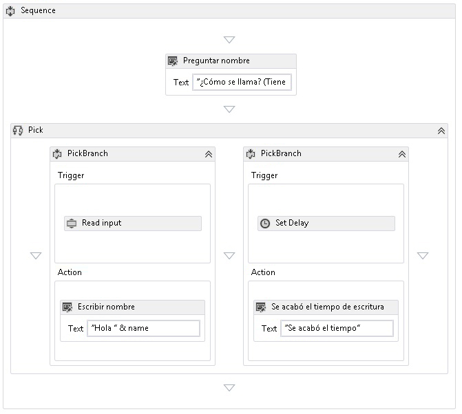

# <a name="pick-activity"></a><span data-ttu-id="988fe-102">Actividad Pick</span><span class="sxs-lookup"><span data-stu-id="988fe-102">Pick Activity</span></span>
<span data-ttu-id="988fe-103">La actividad <xref:System.Activities.Statements.Pick> simplifica el modelado de un conjunto de desencadenadores de eventos seguido por sus controladores correspondientes.</span><span class="sxs-lookup"><span data-stu-id="988fe-103">The <xref:System.Activities.Statements.Pick> activity simplifies the modeling of a set of event triggers followed by their corresponding handlers.</span></span>  <span data-ttu-id="988fe-104">Una actividad <xref:System.Activities.Statements.Pick> contiene una colección de actividades <xref:System.Activities.Statements.PickBranch>, donde cada <xref:System.Activities.Statements.PickBranch> es un emparejamiento entre las actividades <xref:System.Activities.Statements.PickBranch.Trigger%2A> y <xref:System.Activities.Statements.PickBranch.Action%2A>.</span><span class="sxs-lookup"><span data-stu-id="988fe-104">A <xref:System.Activities.Statements.Pick> activity contains a collection of <xref:System.Activities.Statements.PickBranch> activities, where each <xref:System.Activities.Statements.PickBranch> is a pairing between a <xref:System.Activities.Statements.PickBranch.Trigger%2A> activity and an <xref:System.Activities.Statements.PickBranch.Action%2A> activity.</span></span>  <span data-ttu-id="988fe-105">En el momento de la ejecución, los desencadenadores de todas las bifurcaciones se ejecutan en paralelo.</span><span class="sxs-lookup"><span data-stu-id="988fe-105">At execution time, the triggers for all branches are executed in parallel.</span></span>  <span data-ttu-id="988fe-106">Cuando se completa un desencadenador, se ejecuta la acción correspondiente a continuación y se cancelan el resto de desencadenadores.</span><span class="sxs-lookup"><span data-stu-id="988fe-106">When one trigger completes, then its corresponding action is executed, and all other triggers are canceled.</span></span>  <span data-ttu-id="988fe-107">El comportamiento de la actividad [!INCLUDE[netfx_current_short](../../../includes/netfx-current-short-md.md)] de <xref:System.Activities.Statements.Pick> es similar a la actividad [!INCLUDE[netfx35_short](../../../includes/netfx35-short-md.md)] de <xref:System.Workflow.Activities.ListenActivity>.</span><span class="sxs-lookup"><span data-stu-id="988fe-107">The behavior of the [!INCLUDE[netfx_current_short](../../../includes/netfx-current-short-md.md)]<xref:System.Activities.Statements.Pick> activity is similar to the [!INCLUDE[netfx35_short](../../../includes/netfx35-short-md.md)]<xref:System.Workflow.Activities.ListenActivity> activity.</span></span>  
  
 <span data-ttu-id="988fe-108">La siguiente captura de pantalla del ejemplo de SDK [Uso de la actividad Pick](../../../docs/framework/windows-workflow-foundation/samples/using-the-pick-activity.md) muestra una actividad Pick con dos bifurcaciones.</span><span class="sxs-lookup"><span data-stu-id="988fe-108">The following screenshot from the [Using the Pick Activity](../../../docs/framework/windows-workflow-foundation/samples/using-the-pick-activity.md) SDK sample shows a Pick activity with two branches.</span></span>  <span data-ttu-id="988fe-109">Una bifurcación tiene un desencadenador denominado **Read input**, una actividad personalizada que lee la entrada de la línea de comandos.</span><span class="sxs-lookup"><span data-stu-id="988fe-109">One branch has a trigger called **Read input**, a custom activity that reads input from the command line.</span></span> <span data-ttu-id="988fe-110">La segunda bifurcación tiene un desencadenador de actividad <xref:System.Activities.Statements.Delay>.</span><span class="sxs-lookup"><span data-stu-id="988fe-110">The second branch has a <xref:System.Activities.Statements.Delay> activity trigger.</span></span> <span data-ttu-id="988fe-111">Si el **Leer entrada** actividad recibe los datos antes de la <xref:System.Activities.Statements.Delay> finaliza la actividad, <xref:System.Activities.Statements.Delay> retraso se cancelará y se escribirá un saludo en la consola.</span><span class="sxs-lookup"><span data-stu-id="988fe-111">If the **Read input** activity receives data before the <xref:System.Activities.Statements.Delay> activity finishes, <xref:System.Activities.Statements.Delay> Delay will be canceled and a greeting will be written to the console.</span></span>  <span data-ttu-id="988fe-112">De lo contrario, si la actividad **Read input** no recibe los datos en el tiempo asignado, se cancelará y se escribirá un mensaje de tiempo de espera en la consola.</span><span class="sxs-lookup"><span data-stu-id="988fe-112">Otherwise, if the **Read input** activity does not receive data in the allotted time, then it will be canceled and a timeout message will be written to the console.</span></span>  <span data-ttu-id="988fe-113">Se trata de un patrón común que se usa para agregar un tiempo de espera a una acción.</span><span class="sxs-lookup"><span data-stu-id="988fe-113">This is a common pattern used to add a timeout to any action.</span></span>  
  
 <span data-ttu-id="988fe-114"></span><span class="sxs-lookup"><span data-stu-id="988fe-114"></span></span>  
  
## <a name="best-practices"></a><span data-ttu-id="988fe-115">Procedimientos recomendados</span><span class="sxs-lookup"><span data-stu-id="988fe-115">Best practices</span></span>  
 <span data-ttu-id="988fe-116">Al usar Pick, la bifurcación que se ejecuta es la bifurcación cuyo desencadenador se completa primero.</span><span class="sxs-lookup"><span data-stu-id="988fe-116">When using Pick, the branch that executes is the branch whose trigger completes first.</span></span>  <span data-ttu-id="988fe-117">Por definición, todos los desencadenadores se ejecutan en paralelo; de hecho, un desencadenador puede haber ejecutado la mayoría de la lógica antes de que se cancele al finalizar el otro desencadenador.</span><span class="sxs-lookup"><span data-stu-id="988fe-117">Conceptually, all triggers execute in parallel, and one trigger may have executed the majority of its logic before it is canceled by the completion of another trigger.</span></span>  <span data-ttu-id="988fe-118">Con esta perspectiva, una instrucción general que seguir cuando se usa la actividad Pick es tratar el desencadenador como si representara un único evento y poner tan poca lógica como sea posible en él.</span><span class="sxs-lookup"><span data-stu-id="988fe-118">With this in mind, a general guideline to follow when using the Pick activity is to treat the trigger as representing a single event, and to put as little logic as possible into it.</span></span>  <span data-ttu-id="988fe-119">Lo ideal es que el desencadenador contenga la lógica suficiente para recibir un evento y que todo el procesamiento de ese evento debería ir a la acción de la bifurcación.</span><span class="sxs-lookup"><span data-stu-id="988fe-119">Ideally, the trigger should contain just enough logic to receive an event, and all the processing of that event should go into the action of the branch.</span></span>  <span data-ttu-id="988fe-120">Este método minimiza la cantidad de superposición entre la ejecución de los desencadenadores.</span><span class="sxs-lookup"><span data-stu-id="988fe-120">This method minimizes the amount of overlap between the execution of the triggers.</span></span>  <span data-ttu-id="988fe-121">Por ejemplo, considere un <xref:System.Activities.Statements.Pick> con dos desencadenadores, donde cada uno contiene una actividad <xref:System.ServiceModel.Activities.Receive> seguida por una lógica adicional.</span><span class="sxs-lookup"><span data-stu-id="988fe-121">For example, consider a <xref:System.Activities.Statements.Pick> with two triggers, where each trigger contains a <xref:System.ServiceModel.Activities.Receive> activity followed by additional logic.</span></span>  <span data-ttu-id="988fe-122">Si la lógica adicional introduce un punto inactivo, existe la posibilidad de que ambas actividades <xref:System.ServiceModel.Activities.Receive> se completen correctamente.</span><span class="sxs-lookup"><span data-stu-id="988fe-122">If the additional logic introduces an idle point, then there is the possibility of both <xref:System.ServiceModel.Activities.Receive> activities completing successfully.</span></span>  <span data-ttu-id="988fe-123">Un desencadenador se completará totalmente, mientras que otro se completará parcialmente.</span><span class="sxs-lookup"><span data-stu-id="988fe-123">One trigger will fully complete, while another will partially complete.</span></span>  <span data-ttu-id="988fe-124">En algunos escenarios, el hecho de aceptar un mensaje y después completar parcialmente el procesamiento es inaceptable.</span><span class="sxs-lookup"><span data-stu-id="988fe-124">In some scenarios, accepting a message, and then partially completing the processing of it is unacceptable.</span></span>  <span data-ttu-id="988fe-125">Por consiguiente, al usar actividades de mensajería integradas de WF como <xref:System.ServiceModel.Activities.Receive> y <xref:System.ServiceModel.Activities.SendReply>, mientras que <xref:System.ServiceModel.Activities.Receive> se usa normalmente en el desencadenador, <xref:System.ServiceModel.Activities.SendReply> y otra lógica deberían ponerse en acción siempre que sea posible.</span><span class="sxs-lookup"><span data-stu-id="988fe-125">Therefore, when using WF built-in messaging activities such as <xref:System.ServiceModel.Activities.Receive> and <xref:System.ServiceModel.Activities.SendReply>, while <xref:System.ServiceModel.Activities.Receive> is commonly used in the trigger, <xref:System.ServiceModel.Activities.SendReply> and other logic should be put in the action whenever possible.</span></span>  
  
## <a name="using-the-pick-activity-in-the-designer"></a><span data-ttu-id="988fe-126">Usar la actividad Pick en el diseñador</span><span class="sxs-lookup"><span data-stu-id="988fe-126">Using the Pick activity in the designer</span></span>  
 <span data-ttu-id="988fe-127">Para usar Pick en el diseñador, busque **Pick** y **PickBranch** en el cuadro de herramientas.</span><span class="sxs-lookup"><span data-stu-id="988fe-127">To use Pick in the designer, find **Pick** and **PickBranch** in the toolbox.</span></span>  <span data-ttu-id="988fe-128">Arrastre y coloque **Pick** en el lienzo.</span><span class="sxs-lookup"><span data-stu-id="988fe-128">Drag and drop **Pick** onto the canvas.</span></span>  <span data-ttu-id="988fe-129">De forma predeterminada, una nueva actividad **Pick** en el diseñador contendrá dos bifurcaciones.</span><span class="sxs-lookup"><span data-stu-id="988fe-129">By default, a new **Pick** Activity in the designer will contain two branches.</span></span>  <span data-ttu-id="988fe-130">Para agregar bifurcaciones adicionales, arrastre la actividad **PickBranch** y colóquela junto a las bifurcaciones existentes.</span><span class="sxs-lookup"><span data-stu-id="988fe-130">To add additional branches, drag the **PickBranch** activity and drop it next to existing branches.</span></span> <span data-ttu-id="988fe-131">Las actividades se pueden colocar en la actividad **Pick** en el área **Trigger** o el área **Action** de cualquier **PickBranch**.</span><span class="sxs-lookup"><span data-stu-id="988fe-131">Activities can be dropped onto the **Pick** Activity into either the **Trigger** area or the **Action** area of any **PickBranch**.</span></span>  
  
## <a name="using-the-pick-activity-in-code"></a><span data-ttu-id="988fe-132">Usar la actividad Pick en el código</span><span class="sxs-lookup"><span data-stu-id="988fe-132">Using the Pick Activity in code</span></span>  
 <span data-ttu-id="988fe-133">La actividad <xref:System.Activities.Statements.Pick> se usa rellenando la colección de <xref:System.Activities.Statements.Pick.Branches%2A> con actividades <xref:System.Activities.Statements.PickBranch>.</span><span class="sxs-lookup"><span data-stu-id="988fe-133">The <xref:System.Activities.Statements.Pick> activity is used by populating its <xref:System.Activities.Statements.Pick.Branches%2A> collection with <xref:System.Activities.Statements.PickBranch> activities.</span></span> <span data-ttu-id="988fe-134">Cada una de las actividades <xref:System.Activities.Statements.PickBranch> tiene una propiedad <xref:System.Activities.Statements.PickBranch.Trigger%2A> de tipo <xref:System.Activities.Activity>.</span><span class="sxs-lookup"><span data-stu-id="988fe-134">The <xref:System.Activities.Statements.PickBranch> activities each have a <xref:System.Activities.Statements.PickBranch.Trigger%2A> property of type <xref:System.Activities.Activity>.</span></span> <span data-ttu-id="988fe-135">Cuando la actividad especificada ha terminado de ejecutarse, se ejecuta <xref:System.Activities.Statements.PickBranch.Action%2A>.</span><span class="sxs-lookup"><span data-stu-id="988fe-135">When the specified activity completes execution, the <xref:System.Activities.Statements.PickBranch.Action%2A> executes.</span></span>  
  
 <span data-ttu-id="988fe-136">El siguiente ejemplo de código muestra cómo usar una actividad <xref:System.Activities.Statements.Pick> para implementar un tiempo de espera para una actividad que lee una línea de la consola.</span><span class="sxs-lookup"><span data-stu-id="988fe-136">The following code example demonstrates how to use a <xref:System.Activities.Statements.Pick> activity to implement a timeout for an activity that reads a line from the console.</span></span>  
  
```csharp  
Sequence body = new Sequence()  
{  
    Variables = { name },  
    Activities =   
   {  
       new System.Activities.Statements.Pick  
        {  
           Branches =   
           {  
               new PickBranch  
               {  
                   Trigger = new ReadLine  
                   {  
                      Result = name,  
                      BookmarkName = "name"  
                   },  
                   Action = new WriteLine   
                   {   
                       Text = ExpressionServices.Convert<string>(ctx => "Hello " +   
                           name.Get(ctx))   
                   }  
               },  
               new PickBranch  
               {  
                   Trigger = new Delay  
                   {  
                      Duration = new TimeSpan(0, 0, 5)  
                   },  
                   Action = new WriteLine  
                   {  
                      Text = "Time is up."  
                   }  
               }  
           }  
       }  
   }  
};  
```  
  
```xaml  
<Sequence xmlns="http://schemas.microsoft.com/netfx/2009/xaml/activities" xmlns:x="http://schemas.microsoft.com/winfx/2006/xaml">  
  <Sequence.Variables>  
    <Variable x:TypeArguments="x:String" Name="username" />  
  </Sequence.Variables>  
  <Pick>  
    <PickBranch>  
      <PickBranch.Trigger>  
        <ReadLine BookmarkName="name" Result="username" />  
      </PickBranch.Trigger>  
      <WriteLine>[String.Concat("Hello ", username)]</WriteLine>  
    </PickBranch>  
    <PickBranch>  
      <PickBranch.Trigger>  
        <Delay>00:00:05</Delay>  
      </PickBranch.Trigger>  
      <WriteLine>Time is up.</WriteLine>  
    </PickBranch>  
  </Pick>  
</Sequence>  
```
