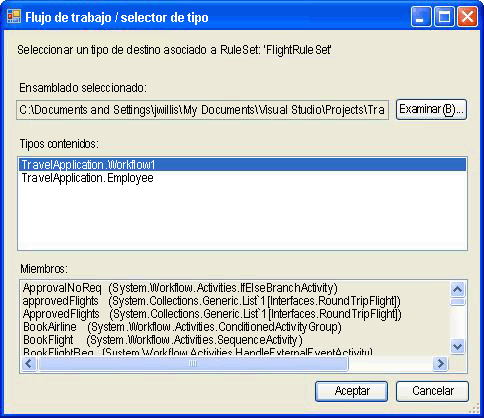

# <a name="external-ruleset-toolkit"></a>Kit de herramientas de RuleSet externo

Normalmente cuando las reglas se utilizan dentro de una aplicación de flujo de trabajo, las reglas forman parte del ensamblado. En algunos escenarios, puede desear mantener separadamente RuleSets del ensamblado para que se puedan actualizar sin recompilar e implementar el ensamblado de flujo de trabajo. Este ejemplo le permite administrar y editar RuleSets en una base de datos y acceder a ellos desde un flujo de trabajo en tiempo de ejecución. Esto habilita las instancias de flujo de trabajo en ejecución para que incorporen automáticamente los cambios de RuleSet.

El ejemplo de kit de herramientas de RuleSet Kit externo contiene una herramienta basada en Windows Forms que puede utilizar para administrar y editar las versiones de RuleSet en una base de datos. También incluye una actividad y un servicio de host para ejecutar esas reglas.

> [!NOTE]
> Este ejemplo requiere [Microsoft SQL Server](/sql).

Visual Studio proporciona un editor RuleSet como parte del Windows Workflow Foundation (WF). Puede iniciar este editor haciendo doble clic en la actividad `Policy` en un flujo de trabajo; serializa el objeto RuleSet definido al archivo .rules asociado al flujo de trabajo (una actividad `Policy` ejecuta una instancia de RuleSet contra el flujo de trabajo). El archivo .rules está compilado en el ensamblado como un recurso al generar el proyecto de flujo de trabajo.

Los componentes de este ejemplo incluyen:

- Una herramienta de interfaz gráfica de usuario de RuleSet que puede utilizar para editar y administrar las versiones de RuleSet en la base de datos.

- Un servicio de RuleSet que se configura en la aplicación del host y que accede a los RuleSets de la base de datos.

- Una actividad `ExternalPolicy` que solicita un RuleSet al servicio de RuleSet y ejecuta el RuleSet contra el flujo de trabajo.

La interacción de los componentes se muestra en la siguiente imagen. Las secciones que siguen describen cada componente.


> [!IMPORTANT]
> Puede que los ejemplos ya estén instalados en su equipo. Compruebe el siguiente directorio (predeterminado) antes de continuar.
>
> `<InstallDrive>:\WF_WCF_Samples`
>
> Si este directorio no existe, vaya a [ejemplos de Windows Communication Foundation (WCF) y Windows Workflow Foundation (WF) para .NET Framework 4](https://www.microsoft.com/download/details.aspx?id=21459) para descargar todos los Windows Communication Foundation (WCF) y [!INCLUDE[wf1](../../../../includes/wf1-md.md)] ejemplos. Este ejemplo se encuentra en el siguiente directorio.
>
> `<InstallDrive>:\WF_WCF_Samples\WF\Scenario\ExternalRuleSetToolKit`

## <a name="ruleset-tool"></a>Herramienta RuleSet

La imagen siguiente es una captura de pantalla de la herramienta RuleSet. En el menú **almacén de reglas** , puede cargar los conjuntos de reglas disponibles de la base de datos y volver a guardar los conjuntos de reglas modificados en el almacén. Un archivo de configuración de la aplicación proporciona una cadena de conexión a bases de datos para la base de datos RuleSet. Al iniciar la herramienta, carga automáticamente los RuleSets de la base de datos configurada.


La herramienta RuleSet aplica números de versión principal y secundario a los RuleSets, permitiéndole mantener simultáneamente y almacenar varias versiones (la herramienta no proporciona ningún bloqueo u otras características de gestión de la configuración además de la función de administración de la versión). Con la herramienta, puede crear nuevas versiones de RuleSet o eliminar las versiones existentes. Al hacer clic en **nuevo**, la herramienta crea un nuevo nombre de ruleset y aplica la versión 1,0. Al copiar una versión, la herramienta crea una copia de la versión RuleSet seleccionada, incluidas las reglas contenidas, y asigna los nuevos números de versión únicos. Estos números de versión están basados en los números de versión de los RuleSets existentes. Puede cambiar el nombre de RuleSet y los números de versión utilizando los campos asociados en el formulario.

Al hacer clic en **editar reglas**, se inicia el editor de ruleset, tal como se muestra en la siguiente imagen:


Se trata de un nuevo hospedaje del cuadro de diálogo del editor que forma parte del complemento Windows Workflow Foundation Visual Studio. Proporciona la misma funcionalidad, incluyendo la compatibilidad del IntelliSense. Las reglas se crean con un tipo de destino (por ejemplo, un flujo de trabajo) que está asociado con el conjunto de reglas de la herramienta. al hacer clic en **examinar** en el cuadro de diálogo principal de la herramienta, aparece el cuadro de diálogo **selector de flujo de trabajo/tipo** , como se muestra en la figura 4.



Figura 4: Selector de flujo de trabajo/tipo

Puede usar el cuadro de diálogo **selector de flujo de trabajo/tipo** para especificar un ensamblado y un tipo específico dentro de ese ensamblado. Este tipo es el tipo de destino contra el que se crean (y se ejecuta) las reglas. En muchos casos, el tipo de destino es un flujo de trabajo o algún otro tipo de actividad. Sin embargo, puede ejecutar un RuleSet contra cualquier tipo de .NET.

La ruta de acceso al archivo de ensamblado y el tipo `name are stored with the` ruleset en la base de datos, de modo que cuando se recupere el conjunto de reglas de la base de datos, la herramienta intente cargar automáticamente el tipo de destino.

Al hacer clic en **Aceptar** en el cuadro de diálogo **selector de flujo de trabajo/tipo** , valida el tipo seleccionado en el conjunto de reglas para asegurarse de que el tipo de destino tenga todos los miembros a los que hacen referencia las reglas. Los errores se muestran en un cuadro de diálogo **errores de validación** . Puede optar por continuar con el cambio a pesar de los errores o hacer clic en **Cancelar**. En el menú **herramientas** del cuadro de diálogo principal de la herramienta, puede hacer clic en **validar** para volver a validar la versión del ruleset con respecto a la actividad de destino.


En el menú **datos** de la herramienta, puede importar y exportar conjuntos de herramientas. Al hacer clic en **importar**, aparece un cuadro de diálogo Selector de archivos, desde el que puede seleccionar un archivo. rules. Puede ser o no un archivo creado inicialmente en Visual Studio. El archivo .rules debería contener una instancia `RuleDefinitions` serializada que contiene una colección de condiciones y una colección de RuleSets. La herramienta no utiliza la colección de condiciones, pero usa el `RuleDefinitions` formato. rules para permitir la interacción con el entorno de Visual Studio.

Después de seleccionar un archivo. rules, aparece un cuadro de diálogo **selector ruleset** . Puede utilizar el cuadro de diálogo para seleccionar RuleSets desde el archivo que desea importar (el valor predeterminado especificada todos los RuleSets). Los RuleSets en el archivo .rules no tienen números de versión, porque su versión dentro de un proyecto WF es igual que la versión del ensamblado. Durante el proceso de importación, la herramienta asigna automáticamente el siguiente número de versión principal disponible (que puede cambiar después de la importación); puede ver los números de versión asignados en la lista de **selector ruleset** .

Para cada RuleSet que importa, la herramienta intenta buscar el tipo asociado de la carpeta bin\Debug bajo la ubicación del archivo .rules (si existe), basándose en los miembros utilizados en el RuleSet. Si la herramienta encuentra varios tipos correspondientes, intenta elegir un tipo basado en una coincidencia entre el nombre de archivo de .rules y el nombre de tipo (por ejemplo, el tipo `Workflow1` corresponde a Workflow1.rules). Si existen varias coincidencias, se le pedirá que seleccione el tipo. Si este mecanismo de identificación automática no encuentra un ensamblado o tipo coincidente, después de la importación, puede hacer clic en **examinar** en el cuadro de diálogo principal de la herramienta para navegar hasta el tipo asociado. En la imagen siguiente se muestra el selector RuleSet:


Al hacer clic en **exportación de datos** desde el menú principal de la herramienta, aparece de nuevo el cuadro de diálogo **selector ruleset** , desde el que puede determinar los conjuntos de reglas de la base de datos que se debe exportar. Al hacer clic en **Aceptar**, aparece el cuadro de diálogo **Guardar archivo** , en el que puede especificar el nombre y la ubicación del archivo. rules resultante. Dado que el archivo .rules no contiene información de versión, sólo puede seleccionar una versión RuleSet con un nombre RuleSet determinado.

## <a name="policyfromservice-activity"></a>Actividad PolicyFromService

El código para la actividad `PolicyFromService` es sencillo. Funciona en gran medida como la actividad `Policy` proporcionada con WF, pero en lugar de recuperar el RuleSet de destino del archivo .rules, llama a un servicio del host para obtener la instancia de RuleSet. A continuación, ejecuta el RuleSet contra la instancia de actividad de flujo de trabajo raíz.

Para utilizar la actividad en un flujo de trabajo, agregue una referencia a `PolicyActivities` y los ensamblados `RuleSetService` de su proyecto de flujo de trabajo. Vea el procedimiento al final de este tema para obtener una descripción sobre cómo agregar la actividad al cuadro de herramientas.

Después de colocar la actividad en su flujo de trabajo, debe proporcionar el nombre del RuleSet que se va a ejecutar. Puede introducir el nombre como un valor literal o enlazarlo con una variable de flujo de trabajo o propiedad de otra actividad. Opcionalmente, puede introducir los números de versión del RuleSet específico que se debería ejecutar. Si deja el valor predeterminado de 0 para los números de versión principal y secundario, el número de versión último en la base de datos se proporciona automáticamente para la actividad.

## <a name="ruleset-service"></a>Servicio RuleSet

El servicio es responsable de recuperar la versión de RuleSet especificada de la base de datos y devolverla a la actividad de llamada. Como se ha abordado previamente, si los valores de versión principal y secundaria pasados en la llamada `GetRuleSet` son 0, el servicio recupera la última versión. En este punto no hay ningún almacenamiento en caché de definiciones o instancias RuleSet; de igual forma, no hay ninguna característica para marcar las versiones RuleSet como "implementadas" para diferenciarlas de RuleSets en curso.

La base de datos a la que va a acceder el servicio se debería configurar en el host utilizando un archivo de configuración de la aplicación.

#### <a name="to-run-the-tool"></a>Para ejecutar la herramienta

1. La carpeta que prepara la tabla RuleSet utilizada por la herramienta y el servicio contiene un archivo Setup.sql. Puede ejecutar el archivo por lotes de Setup.cmd para crear la base de datos de reglas en SQL Express y configurar la tabla RuleSet.

2. Si modifica el archivo por lotes o Setup.sql y especifica no utilizar SQL Express o colocar la tabla en una base de datos con una denominación diferente a `Rules`, los archivos de configuración de la aplicación en la herramienta RuleSet y los proyectos `UsageSample` se deberían editar con la misma información.

3. Después de ejecutar el script Setup.sql, puede compilar la solución `ExternalRuleSetToolkit` y, a continuación, iniciar la herramienta RuleSet desde el proyecto ExternalRuleSetTool.

4. La solución de aplicación de la consola de flujo de trabajo secuencial `RuleSetToolkitUsageSample` incluye un flujo de trabajo de ejemplo. El flujo de trabajo está compuesto de una actividad `PolicyFromService` y dos variables, `orderValue` y `discount`, contra los que el RuleSet de destino se ejecuta.

5. Para utilizar el ejemplo, compile la solución `RuleSetToolkitUsageSample`. A continuación, en el menú principal de la herramienta RuleSet, haga clic en **importación de datos** y seleccione el archivo DiscountRuleSet. rules en la carpeta RuleSetToolkitUsageSample Haga clic en la opción **de menú almacén de reglas-guardar** para guardar el conjunto de reglas importado en la base de datos.

6. Dado que se hace referencia al ensamblado `PolicyActivities` desde el proyecto de flujo de trabajo de ejemplo, la actividad `PolicyFromService` aparece en el flujo de trabajo. Sin embargo, no aparece de forma predeterminada en el cuadro de herramientas. Para agregarla al cuadro de herramientas, haga lo siguiente:

    - Haga clic con el botón secundario en el cuadro de herramientas y seleccione **elegir elementos** (esto puede tardar unos minutos).

    - Cuando aparezca el cuadro de diálogo **elegir elementos del cuadro de herramientas** , haga clic en la pestaña **actividades** .

    - Busque el `PolicyActivities` ensamblado en la `ExternalRuleSetToolkit` solución y haga clic en **abrir**.

    - Asegúrese de que la `PolicyFromService` actividad está seleccionada en el cuadro de diálogo **elegir elementos del cuadro de herramientas** y haga clic en **Aceptar**.

    - La actividad debe aparecer ahora en el cuadro de herramientas en la categoría **componentes de RuleSetToolkitUsageSample** .

7. El servicio RuleSet ya está configurado en el host de la aplicación de consola utilizando la instrucción siguiente en Program.cs.

    ```csharp
    workflowRuntime.AddService(new RuleSetService());
    ```

8. También puede configurar el servicio en el host utilizando un archivo de configuración; consulte la documentación de SDK para obtener detalles.

9. Un archivo de configuración de la aplicación se agrega al proyecto de flujo de trabajo para especificar la cadena de conexión para la base de datos que va a utilizar el servicio. Ésta debería ser la misma cadena de conexión utilizada por la herramienta RuleSet, que señala a la base de datos que contiene la tabla RuleSet.

10. Ahora puede ejecutar el proyecto `RuleSetToolkitUsageSample` como lo haría con cualquier otra aplicación de consola del flujo de trabajo. Presione F5 o Ctrl + F5 dentro de Visual Studio o ejecute el archivo de RuleSetToolkitUsageSample.exe directamente.

    > [!NOTE]
    > Debe cerrar la herramienta RuleSet para recompilar el ejemplo de uso, porque la herramienta carga el ensamblado del ejemplo de uso.
